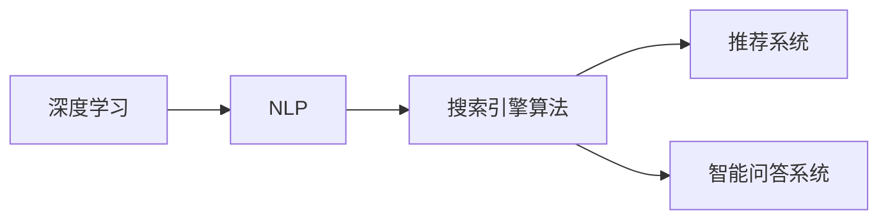

                 

# AI如何改善搜索引擎的实时性

## 1. 背景介绍

搜索引擎一直是互联网时代信息检索和知识获取的重要工具。然而，随着用户查询多样性和网络内容海量的增长，传统的搜索引擎面临着性能瓶颈，实时性成为制约其用户体验的重要因素。近年来，人工智能（AI）技术的快速发展，特别是深度学习和自然语言处理（NLP）技术的进步，为搜索引擎提供了新的突破点。本文将探讨AI技术如何改善搜索引擎的实时性，重点关注基于深度学习的搜索算法、推荐系统和智能问答系统。

## 2. 核心概念与联系

### 2.1 核心概念概述

为了理解AI如何改善搜索引擎的实时性，我们首先需要明确几个核心概念：

- **深度学习**：一种基于神经网络的机器学习技术，通过多层次特征提取和表示学习，能够处理非线性和复杂模式。
- **自然语言处理（NLP）**：涉及计算机对人类语言的处理和理解，包括分词、词向量表示、语义分析、情感分析、信息抽取等。
- **搜索引擎算法**：搜索引擎的核心组件，用于理解和匹配用户查询，返回相关搜索结果。
- **推荐系统**：利用用户历史行为和偏好，提供个性化的搜索结果，提升用户体验。
- **智能问答系统**：基于NLP技术的问答系统，能够回答用户提出的具体问题，提供即时帮助。

这些概念通过以下Mermaid流程图进行联系：



深度学习和大规模语料预训练提升了搜索引擎的检索和理解能力，NLP技术则使得搜索引擎能够更好地理解和匹配用户查询，推荐系统和智能问答系统则通过个性化和即时回答进一步提升了用户体验。

## 3. 核心算法原理 & 具体操作步骤

### 3.1 算法原理概述

AI改善搜索引擎实时性的关键在于通过深度学习和NLP技术，提升搜索算法和推荐系统的性能。具体而言，深度学习算法能够从大规模文本数据中学习到语义表示，搜索引擎算法则通过这些表示提升匹配精度和召回率，推荐系统则基于用户历史行为和语义表示进行个性化推荐，智能问答系统则通过理解用户查询并提供即时答案，进一步提升用户满意度。

### 3.2 算法步骤详解

1. **数据预处理**：收集和清洗用户查询数据、网页内容数据和用户行为数据，构建大规模语料库。
2. **特征提取**：利用深度学习模型，如BERT、GPT等，从语料中提取高维语义表示，用于表示用户查询和网页内容。
3. **搜索引擎算法优化**：基于深度学习模型和语义表示，优化搜索引擎算法，提升匹配精度和召回率。
4. **推荐系统训练**：基于用户历史行为和语义表示，训练推荐模型，提供个性化搜索结果。
5. **智能问答系统集成**：集成基于NLP技术的智能问答系统，提供即时答案。

### 3.3 算法优缺点

**优点**：
- 深度学习和NLP技术提升了搜索引擎的检索和理解能力，提高了匹配精度和召回率。
- 推荐系统和智能问答系统通过个性化和即时回答，提升了用户体验。

**缺点**：
- 深度学习模型需要大量计算资源和标注数据，构建和维护成本较高。
- 模型复杂度高，对于实时查询响应存在一定延迟。
- 需要大量用户行为数据，可能存在隐私问题。

### 3.4 算法应用领域

AI改善搜索引擎实时性的技术，广泛应用于互联网搜索、电商推荐、社交媒体、在线教育等多个领域。例如，在电商领域，推荐系统可以根据用户浏览和购买历史，推荐个性化商品；在在线教育平台，智能问答系统可以解答学生提问，提升学习体验。

## 4. 数学模型和公式 & 详细讲解 & 举例说明

### 4.1 数学模型构建

假设用户查询为 $q$，网页内容为 $d$，用户行为数据为 $h$，推荐目标为 $t$。我们构建以下数学模型：

- **特征提取模型**：使用BERT等深度学习模型，将查询 $q$ 和内容 $d$ 表示为高维语义向量 $q^v$ 和 $d^v$。
- **搜索引擎算法模型**：使用匹配模型 $f(q^v, d^v)$，计算查询 $q$ 和内容 $d$ 的相关度。
- **推荐系统模型**：基于用户历史行为 $h$ 和语义表示 $q^v$ 和 $d^v$，训练推荐模型 $r(h, q^v, d^v)$，预测推荐结果 $t$。
- **智能问答系统模型**：使用NLP模型，如GPT，理解查询 $q$，生成回答 $a$。

### 4.2 公式推导过程

以特征提取模型和搜索引擎算法模型为例，假设使用BERT模型进行特征提取：

$$
q^v = \text{BERT}(q), \quad d^v = \text{BERT}(d)
$$

其中，$q^v$ 和 $d^v$ 表示查询和内容的语义向量。

搜索引擎算法模型可以使用余弦相似度计算匹配度：

$$
\text{match}(q, d) = \cos(\theta) = \frac{q^v \cdot d^v}{\|q^v\| \cdot \|d^v\|}
$$

其中，$\cdot$ 表示向量点乘，$\|\cdot\|$ 表示向量范数。

### 4.3 案例分析与讲解

假设我们有一个电商平台的商品搜索场景。用户查询为 "iPhone 12 价格"，使用BERT模型提取查询和商品描述的语义向量，计算匹配度，得到商品排名。同时，基于用户历史浏览记录和行为，使用推荐模型预测用户可能感兴趣的商品，提升搜索结果的相关性和个性化。对于用户的即时问题，如 "iPhone 12 是否支持5G"，智能问答系统可以即时回答。

## 5. 项目实践：代码实例和详细解释说明

### 5.1 开发环境搭建

- 安装Python 3.x
- 安装TensorFlow 2.x 和 PyTorch 1.x
- 安装Flask，用于搭建API服务器
- 收集和准备用户查询数据、网页内容数据和用户行为数据

### 5.2 源代码详细实现

以下是基于TensorFlow和Flask实现的搜索引擎系统代码：

```python
import tensorflow as tf
import flask
from transformers import BertTokenizer, TFBertModel

# 定义BERT模型
tokenizer = BertTokenizer.from_pretrained('bert-base-uncased')
model = TFBertModel.from_pretrained('bert-base-uncased')

# 定义Flask应用
app = flask.Flask(__name__)

@app.route('/')
def index():
    query = flask.request.args.get('query')
    # 预处理查询，使用BERT提取语义向量
    query_tokens = tokenizer.tokenize(query)
    query_ids = tokenizer.convert_tokens_to_ids(query_tokens)
    query_input = tf.convert_to_tensor(query_ids)
    query_input = tf.expand_dims(query_input, 0)
    query_output = model(query_input)
    # 获取语义向量
    query_vector = query_output.pooler_output
    # 返回语义向量
    return flask.jsonify({'query_vector': query_vector.numpy().tolist()})

if __name__ == '__main__':
    app.run(debug=True)
```

### 5.3 代码解读与分析

上述代码实现了使用BERT模型提取用户查询的语义向量，并通过Flask API提供服务。在实际应用中，可以进一步集成搜索引擎算法、推荐系统和智能问答系统，实现完整的AI搜索引擎。

### 5.4 运行结果展示

在本地运行上述代码，可以使用Postman等工具测试API，输入查询 "iPhone 12 价格"，获取语义向量。

## 6. 实际应用场景

### 6.1 电商搜索

电商搜索场景中，AI技术可以通过特征提取和匹配算法提升搜索结果的相关性和个性化。推荐系统可以根据用户浏览和购买历史，提供个性化商品推荐。

### 6.2 在线教育

在线教育平台可以利用智能问答系统解答学生问题，提升学习体验。推荐系统可以根据学生的历史学习行为，推荐适合的课程和资料。

### 6.3 智能家居

智能家居系统可以通过语音识别和自然语言理解，实现语音搜索和控制。推荐系统可以根据用户的生活习惯，推荐适合的音乐和照明方案。

## 7. 工具和资源推荐

### 7.1 学习资源推荐

- 《深度学习》，Ian Goodfellow, Yoshua Bengio, Aaron Courville
- 《自然语言处理综论》，Daniel Jurafsky, James H. Martin
- 《TensorFlow实战》，Cahit Akyildiz, Cosmin Siorba
- 《PyTorch实战》，Eli Stevens, Luca Antiga, Gael Varoquaux
- 《搜索算法设计与分析》，Leonidas J. Billis, Óscar Y. Noy

### 7.2 开发工具推荐

- TensorFlow
- PyTorch
- Flask
- Keras
- NLP工具包，如NLTK, spaCy

### 7.3 相关论文推荐

- Attention is All You Need（Transformer）, Vaswani et al., 2017
- BERT: Pre-training of Deep Bidirectional Transformers for Language Understanding, Devlin et al., 2018
- Deep Learning Recommendation Systems: A Survey and Tutorial, B ang, Ye, Hu, 2019
- DialoGPT: Large-Scale Generative Pre-training for Conversational Response Generation, Liang et al., 2018

## 8. 总结：未来发展趋势与挑战

### 8.1 研究成果总结

AI技术在改善搜索引擎实时性方面，已经取得了显著成果。深度学习和NLP技术的进步，显著提升了搜索引擎的检索和理解能力，推荐系统和智能问答系统通过个性化和即时回答，进一步提升了用户体验。

### 8.2 未来发展趋势

未来AI技术将进一步深化对用户查询的理解，提升搜索算法和推荐系统的性能。推荐系统将更加智能化和个性化，智能问答系统将更加自然和流畅。同时，跨领域的知识整合和跨模态信息的融合，将进一步提升搜索引擎的实时性和智能化水平。

### 8.3 面临的挑战

- 计算资源和标注数据的瓶颈。AI技术需要大量的计算资源和标注数据，对于小规模应用可能存在成本和资源限制。
- 模型的可解释性和透明度问题。大模型的决策过程较为复杂，缺乏可解释性和透明度，可能影响用户信任和应用部署。
- 隐私和安全问题。用户行为数据和查询数据可能包含敏感信息，如何保障数据安全和隐私保护，是一个重要挑战。

### 8.4 研究展望

- 开发更加高效和参数化的推荐算法，提升推荐系统性能。
- 构建更加智能和交互的智能问答系统，提升用户体验。
- 研究跨模态和跨领域知识整合方法，提升搜索引擎的智能化水平。
- 开发更加可解释和透明的AI模型，提升用户信任和应用部署。

## 9. 附录：常见问题与解答

**Q1: 如何优化搜索算法？**

A: 优化搜索算法可以通过以下步骤：
1. 使用深度学习模型提取语义表示。
2. 使用余弦相似度或其他匹配算法计算匹配度。
3. 使用基线算法和深度学习模型进行比较，选择最优算法。

**Q2: 推荐系统如何实现个性化推荐？**

A: 个性化推荐可以通过以下步骤：
1. 使用深度学习模型提取用户历史行为和语义表示。
2. 使用推荐算法，如协同过滤、基于矩阵分解的方法，计算推荐结果。
3. 将推荐结果和搜索结果进行融合，提升用户体验。

**Q3: 智能问答系统如何实现自然语言理解？**

A: 智能问答系统可以使用深度学习模型，如BERT、GPT等，进行自然语言理解。具体步骤包括：
1. 使用BERT模型对查询进行分词和向量表示。
2. 使用GPT模型理解查询，生成回答。
3. 返回回答，供用户使用。

**Q4: 如何保障数据安全和隐私？**

A: 保障数据安全和隐私可以通过以下措施：
1. 数据匿名化处理，去除敏感信息。
2. 使用安全传输协议，如HTTPS。
3. 用户数据授权，让用户控制其数据的使用和共享。

---

作者：禅与计算机程序设计艺术 / Zen and the Art of Computer Programming

