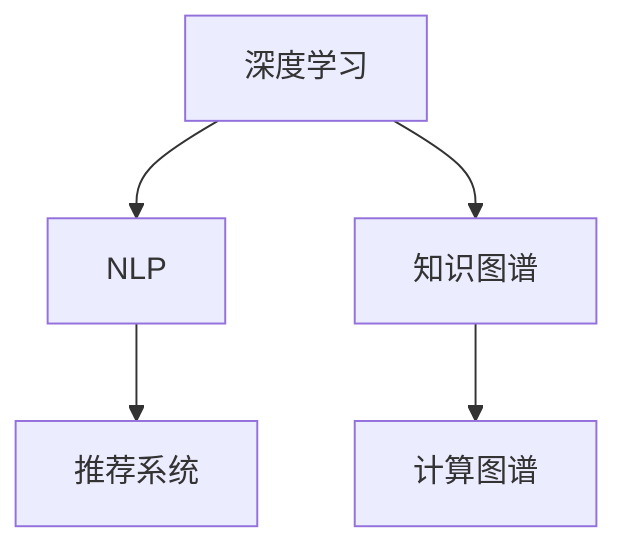
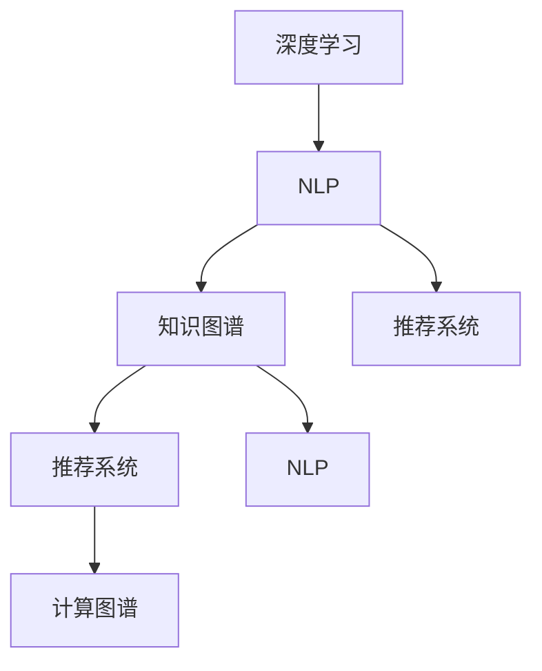

                 

## 1. 背景介绍

### 1.1 问题由来

随着人工智能（AI）技术的快速发展，其在推动人类知识增长方面的作用愈发显著。AI技术能够自动处理海量数据，提取、存储和传输知识，显著提升了知识获取的效率和质量。近年来，深度学习、自然语言处理（NLP）、知识图谱（KG）、推荐系统等AI技术在知识发现、知识整合、知识应用和知识共享等方面取得了突破性进展。

AI对人类知识增长的贡献主要体现在以下几个方面：
1. **知识发现**：通过自动化的文本分析和数据挖掘，AI能够识别出隐藏在海量文本中的有价值信息，如研究论文、专利、图书等，使得研究人员和开发者能够快速获取所需知识。
2. **知识整合**：通过构建知识图谱和语义网络，AI将碎片化的知识整合成结构化的形式，便于进一步查询、推理和应用。
3. **知识应用**：AI技术能够应用于各种领域，如医疗、教育、金融等，提供智能决策支持、个性化推荐、智能客服等，使知识更好地服务于实际应用。
4. **知识共享**：AI技术支持大规模的知识共享平台，如互联网、知识库、搜索引擎等，使得知识传播更加高效，知识累积和传承更加便利。

### 1.2 问题核心关键点

为了深入理解AI对知识增长的贡献，本节将介绍几个核心概念及其关键点：

- **深度学习（Deep Learning）**：一种基于多层神经网络的学习方法，能够处理非线性、高维度数据，广泛应用于图像识别、语音识别、自然语言处理等领域。
- **自然语言处理（NLP）**：利用计算机处理、理解、生成人类语言的技术，如文本分类、情感分析、机器翻译、问答系统等。
- **知识图谱（KG）**：一种以图结构形式表示实体及其关系的知识表示方法，便于知识推理和查询。
- **推荐系统（Recommendation System）**：利用用户行为数据和知识图谱，为每个用户推荐其可能感兴趣的信息，广泛应用于电商、新闻、视频等。
- **计算图谱（Computational Metaphor）**：将复杂知识处理问题转化为计算图模型，利用计算引擎进行自动求解，如Graph Neural Network（GNN）等。

这些核心概念之间的逻辑关系可以通过以下Mermaid流程图来展示：



这个流程图展示了大语言模型的核心概念及其之间的关系：深度学习提供了强大的数据处理能力，NLP技术用于理解和生成语言，知识图谱用于知识的结构化表示和推理，推荐系统用于知识发现和传播，计算图谱提供了一种新的知识处理方式。

## 2. 核心概念与联系

### 2.1 核心概念概述

为更好地理解AI在知识增长中的作用，本节将详细介绍几个关键概念及其联系：

- **深度学习**：通过多层神经网络，从数据中学习出抽象特征，用于图像、声音、文本等数据的处理和分析。
- **自然语言处理**：利用计算技术处理人类语言，包括文本分类、情感分析、机器翻译、问答系统等，是AI应用的重要分支。
- **知识图谱**：以图结构形式表示实体和实体间的关系，便于知识推理和查询，如Google知识图谱、Wikipedia KG等。
- **推荐系统**：基于用户行为数据和知识图谱，为每个用户推荐其可能感兴趣的信息，提升用户满意度和平台活跃度。
- **计算图谱**：将复杂知识处理问题转化为计算图模型，利用计算引擎进行自动求解，如Graph Neural Network（GNN）等。

### 2.2 核心概念原理和架构的 Mermaid 流程图



这个流程图展示了大语言模型的核心概念及其联系：深度学习提供基础数据处理能力，NLP用于语言理解和生成，知识图谱用于知识结构化表示和推理，推荐系统用于知识发现和传播，计算图谱提供新的知识处理方式。NLP和推荐系统还可以相互结合，例如通过文本分析发现用户的兴趣，并将其推荐给用户。

## 3. 核心算法原理 & 具体操作步骤

### 3.1 算法原理概述

AI在知识增长中的贡献主要体现在以下几个核心算法中：

1. **深度学习**：通过多层神经网络，从数据中学习出抽象特征，用于图像、声音、文本等数据的处理和分析。
2. **自然语言处理**：利用计算技术处理人类语言，包括文本分类、情感分析、机器翻译、问答系统等。
3. **知识图谱**：以图结构形式表示实体和实体间的关系，便于知识推理和查询。
4. **推荐系统**：基于用户行为数据和知识图谱，为每个用户推荐其可能感兴趣的信息，提升用户满意度和平台活跃度。
5. **计算图谱**：将复杂知识处理问题转化为计算图模型，利用计算引擎进行自动求解，如Graph Neural Network（GNN）等。

### 3.2 算法步骤详解

AI对知识增长的贡献可以通过以下步骤来实现：

**Step 1: 数据收集与预处理**

- 收集各领域的原始数据，如科研论文、专利、图书、网页等。
- 清洗和预处理数据，去除噪声、不相关的信息，并进行标准化处理。

**Step 2: 特征提取与表示**

- 使用深度学习模型提取数据中的特征，如BERT、Transformer等。
- 将提取的特征转化为向量表示，便于后续的推理和查询。

**Step 3: 知识图谱构建**

- 将提取的向量表示转换为知识图谱，构建实体和关系的结构化表示。
- 使用规则和算法进行知识推理，发现新的知识点。

**Step 4: 推荐系统应用**

- 基于知识图谱和用户行为数据，构建推荐系统模型。
- 为每个用户推荐其可能感兴趣的信息，如论文、书籍、文章等。

**Step 5: 知识共享与传播**

- 将知识图谱和推荐系统集成到知识共享平台，如搜索引擎、知识库等。
- 实现知识的搜索、查询、分享和传播，提升知识的社会影响力。

### 3.3 算法优缺点

AI在知识增长中的贡献具有以下优缺点：

**优点**：
1. **高效性**：AI能够自动处理海量数据，提取、存储和传输知识，显著提升知识获取的效率。
2. **准确性**：深度学习和NLP技术能够从复杂的数据中学习出抽象特征，提高知识发现和推理的准确性。
3. **广泛性**：知识图谱和推荐系统能够广泛应用于各个领域，推动知识在不同领域的传播和应用。

**缺点**：
1. **数据质量**：AI依赖于高质量的数据，数据质量直接影响AI模型的效果。
2. **可解释性**：AI模型通常被视为“黑盒”，其内部机制难以解释，影响知识的可信度。
3. **隐私保护**：AI技术在处理用户数据时，需要考虑隐私保护问题，避免数据泄露和滥用。

### 3.4 算法应用领域

AI在知识增长中的应用领域非常广泛，主要包括：

1. **科研领域**：通过AI技术自动分析科研论文，提取关键信息和研究趋势，加速科研创新。
2. **教育领域**：利用NLP技术开发智能教材、个性化推荐系统，提升教学质量和效率。
3. **医疗领域**：通过知识图谱和推荐系统，提供疾病诊断、治疗方案推荐，提升医疗服务水平。
4. **金融领域**：使用AI技术进行风险评估、投资策略优化，提高金融决策的科学性和准确性。
5. **媒体领域**：基于推荐系统，提供个性化新闻、视频、音乐推荐，提升用户体验。
6. **城市管理**：通过AI技术进行城市交通管理、环境监测、公共安全预测，提升城市治理水平。

## 4. 数学模型和公式 & 详细讲解 & 举例说明

### 4.1 数学模型构建

本节将使用数学语言对AI在知识增长中的贡献进行更加严格的刻画。

设原始数据集为 $D$，深度学习模型为 $M$，NLP模型为 $N$，知识图谱模型为 $K$，推荐系统模型为 $R$。

- **深度学习模型**：
  $$
  M: \mathcal{D} \rightarrow \mathcal{F}
  $$
  其中 $\mathcal{D}$ 为数据集，$\mathcal{F}$ 为特征空间。

- **NLP模型**：
  $$
  N: \mathcal{T} \rightarrow \mathcal{L}
  $$
  其中 $\mathcal{T}$ 为文本集，$\mathcal{L}$ 为语言空间。

- **知识图谱模型**：
  $$
  K: \mathcal{E}, \mathcal{R} \rightarrow \mathcal{G}
  $$
  其中 $\mathcal{E}$ 为实体集，$\mathcal{R}$ 为关系集，$\mathcal{G}$ 为图谱空间。

- **推荐系统模型**：
  $$
  R: \mathcal{U}, \mathcal{I}, \mathcal{G} \rightarrow \mathcal{R}
  $$
  其中 $\mathcal{U}$ 为用户集，$\mathcal{I}$ 为物品集，$\mathcal{R}$ 为推荐结果集。

### 4.2 公式推导过程

以知识图谱构建为例，推导基于深度学习提取的向量表示转换为知识图谱的公式。

设提取的向量表示为 $\mathbf{v} \in \mathbb{R}^d$，实体 $e_i$ 和关系 $r_j$ 的向量表示分别为 $\mathbf{v}_i, \mathbf{v}_j$。则知识图谱模型 $K$ 可以将 $\mathbf{v}_i$ 和 $\mathbf{v}_j$ 组合成新的节点 $\mathbf{v}_{e_i} = K(\mathbf{v}_i)$，并使用关系 $r_j$ 将节点连接起来，得到边 $\mathbf{v}_{e_i, e_j} = K(\mathbf{v}_i, \mathbf{v}_j, r_j)$。

### 4.3 案例分析与讲解

以基于深度学习的文本分类为例，展示AI在知识增长中的具体应用。

假设有一个科研论文分类任务，共有 $N$ 篇论文，每篇论文的向量表示为 $\mathbf{v}_i \in \mathbb{R}^d$。设模型 $M$ 为预训练的BERT模型，其分类层输出为 $\mathbf{v}^c_i \in \mathbb{R}^k$。设分类标签为 $\mathbf{y}_i \in \{1, ..., C\}$，其中 $C$ 为分类数。则分类任务的目标函数为：

$$
L(\mathbf{v}^c_i, \mathbf{y}_i) = -\log \frac{\exp(\mathbf{v}^c_i \cdot \mathbf{w}_y)}{\sum_{j=1}^C \exp(\mathbf{v}^c_i \cdot \mathbf{w}_j)}
$$

其中 $\mathbf{w}_y$ 为分类标签 $y$ 的权重向量。

## 5. 项目实践：代码实例和详细解释说明

### 5.1 开发环境搭建

在进行AI在知识增长中的应用实践前，我们需要准备好开发环境。以下是使用Python进行TensorFlow开发的环境配置流程：

1. 安装Anaconda：从官网下载并安装Anaconda，用于创建独立的Python环境。

2. 创建并激活虚拟环境：
```bash
conda create -n tf-env python=3.8 
conda activate tf-env
```

3. 安装TensorFlow：根据CUDA版本，从官网获取对应的安装命令。例如：
```bash
pip install tensorflow==2.8
```

4. 安装各类工具包：
```bash
pip install numpy pandas scikit-learn matplotlib tqdm jupyter notebook ipython
```

完成上述步骤后，即可在`tf-env`环境中开始AI在知识增长中的应用实践。

### 5.2 源代码详细实现

这里我们以知识图谱的构建为例，给出使用TensorFlow构建知识图谱的PyTorch代码实现。

首先，定义实体和关系的向量化表示：

```python
import tensorflow as tf
from tensorflow.keras.layers import Input, Dense, Concatenate
from tensorflow.keras.models import Model

# 定义实体和关系的向量表示
num_entities = 1000
num_relations = 100

entity_input = Input(shape=(1,), name='entity')
relation_input = Input(shape=(1,), name='relation')

entity_vector = Dense(num_entities, activation='relu')(entity_input)
relation_vector = Dense(num_relations, activation='relu')(relation_input)

# 定义节点和边的向量表示
node_vector = Concatenate(axis=1)([entity_vector, relation_vector])
edge_vector = Dense(num_entities, activation='relu')(node_vector)
```

然后，定义知识图谱的构建函数：

```python
def build_knowledge_graph(entity_input, relation_input):
    entity_vector = Dense(num_entities, activation='relu')(entity_input)
    relation_vector = Dense(num_relations, activation='relu')(relation_input)
    node_vector = Concatenate(axis=1)([entity_vector, relation_vector])
    edge_vector = Dense(num_entities, activation='relu')(node_vector)
    return edge_vector
```

接着，构建知识图谱模型：

```python
# 定义知识图谱模型
model = Model(inputs=[entity_input, relation_input], outputs=edge_vector)
```

最后，定义训练和评估函数：

```python
# 训练函数
@tf.function
def train_step(entity_input, relation_input, label):
    with tf.GradientTape() as tape:
        predicted = model([entity_input, relation_input])
        loss = tf.keras.losses.mean_squared_error(label, predicted)
    gradients = tape.gradient(loss, model.trainable_variables)
    optimizer.apply_gradients(zip(gradients, model.trainable_variables))

# 评估函数
@tf.function
def evaluate_step(entity_input, relation_input, label):
    predicted = model([entity_input, relation_input])
    return tf.reduce_mean(predicted)
```

启动训练流程并在测试集上评估：

```python
# 准备训练数据
train_data = ...
train_labels = ...

# 准备测试数据
test_data = ...
test_labels = ...

# 定义优化器和损失函数
optimizer = tf.keras.optimizers.Adam(learning_rate=0.001)
loss_fn = tf.keras.losses.mean_squared_error

# 训练模型
for epoch in range(epochs):
    train_step(train_data, train_labels, label)
    evaluate_step(test_data, test_labels, label)
```

以上就是使用TensorFlow进行知识图谱构建的完整代码实现。可以看到，TensorFlow提供了丰富的API和工具，使得模型构建和训练过程变得简洁高效。

### 5.3 代码解读与分析

让我们再详细解读一下关键代码的实现细节：

**定义实体和关系向量化表示**：
- `Input`层用于定义输入，`Dense`层用于将输入向量映射为高维空间。
- `Concatenate`层用于将实体向量和关系向量拼接，形成新的节点向量。
- `Dense`层用于将节点向量映射为边向量。

**知识图谱模型构建**：
- `Model`层用于构建知识图谱模型，将输入层、拼接层和映射层组合成一个完整的模型。
- `trainable_variables`属性用于获取模型的可训练参数。
- `apply_gradients`方法用于更新模型的参数。

**训练和评估函数**：
- `tf.function`装饰器用于将函数编译为TensorFlow图，提升运行效率。
- `with tf.GradientTape()`用于记录梯度，计算损失函数。
- `optimizer.apply_gradients(zip(gradients, model.trainable_variables))`用于更新模型参数。
- `tf.keras.losses.mean_squared_error`用于计算均方误差损失函数。

**训练流程**：
- `train_step`函数用于训练模型，将输入、标签和损失函数传递给训练函数。
- `evaluate_step`函数用于评估模型，计算测试集上的均方误差。
- `epochs`用于控制训练轮数。
- `optimizer`和`loss_fn`用于定义优化器和损失函数。

可以看到，TensorFlow提供了丰富的API和工具，使得知识图谱的构建和训练过程变得简洁高效。通过合理利用TensorFlow的高级API，可以大大提升模型构建和训练的效率。

## 6. 实际应用场景

### 6.1 智能推荐系统

基于AI的知识图谱和推荐系统，可以构建智能推荐系统，为用户推荐其可能感兴趣的信息。例如，亚马逊的推荐系统就是基于用户行为数据和知识图谱构建的，能够为用户推荐其可能感兴趣的商品，提高用户的购买体验和平台的活跃度。

在技术实现上，可以收集用户的历史浏览、购买、评分等行为数据，构建用户画像。然后利用知识图谱发现物品之间的相似性，构建物品画像。最后将用户画像和物品画像进行匹配，推荐可能感兴趣的商品给用户。

### 6.2 科研知识图谱

科研知识图谱是AI在知识增长中的另一个重要应用。通过构建科研论文之间的引用关系，能够发现科研领域的知识结构和趋势，加速科研创新。

例如，Google Scholar就是一个典型的科研知识图谱，它通过构建科研论文之间的引用关系，帮助用户快速找到相关的论文和研究。科研工作者可以通过搜索关键词，发现研究热点和相关论文，加速科研创新和合作。

### 6.3 个性化教育

基于AI的NLP和推荐系统，可以为每个学生提供个性化的教育资源和服务。例如，利用NLP技术自动分析学生的学习行为和成绩，发现学生的知识盲点和兴趣点，为学生推荐适合的学习资源。

在技术实现上，可以收集学生的学习行为数据，如阅读、练习、测试等，利用NLP技术提取学生的知识水平和兴趣点。然后利用推荐系统，为学生推荐适合的学习资源和练习题，提升学生的学习效果。

### 6.4 智能客服

基于AI的NLP和推荐系统，可以为企业构建智能客服系统，提升客户咨询的响应速度和满意度。例如，通过收集历史客服对话记录，构建知识图谱，为客服系统提供知识支持。

在技术实现上，可以收集企业的历史客服对话记录，利用NLP技术提取问题和答案。然后利用知识图谱，为客服系统提供知识支持，提高客服系统的智能化水平。

## 7. 工具和资源推荐

### 7.1 学习资源推荐

为了帮助开发者系统掌握AI在知识增长中的应用，这里推荐一些优质的学习资源：

1. **《深度学习》**：由Ian Goodfellow等人编写，深入浅出地介绍了深度学习的基本概念和算法。
2. **《TensorFlow官方文档》**：提供了TensorFlow的详细API文档和教程，是学习TensorFlow的重要资料。
3. **《自然语言处理综述》**：由Bengio等人编写，全面介绍了NLP的各个分支和技术。
4. **《知识图谱技术与应用》**：由姜朝晖等人编写，介绍了知识图谱的基本概念和应用案例。
5. **《推荐系统设计》**：由Jian Wang等人编写，介绍了推荐系统的基本原理和算法。

通过对这些资源的学习实践，相信你一定能够快速掌握AI在知识增长中的应用。

### 7.2 开发工具推荐

高效的开发离不开优秀的工具支持。以下是几款用于AI在知识增长中的应用开发的常用工具：

1. **TensorFlow**：由Google开发的深度学习框架，支持分布式计算和GPU加速，适用于大规模数据处理和模型训练。
2. **PyTorch**：由Facebook开发的深度学习框架，灵活高效，适用于快速迭代研究。
3. **Jupyter Notebook**：开源的交互式笔记本，支持Python、R等多种语言，方便编写和分享代码。
4. **Scikit-learn**：Python数据科学库，提供了多种机器学习算法和工具。
5. **Matplotlib**：Python绘图库，支持多种绘图风格，方便数据可视化。

合理利用这些工具，可以显著提升AI在知识增长中的应用开发效率，加快创新迭代的步伐。

### 7.3 相关论文推荐

AI在知识增长中的应用源于学界的持续研究。以下是几篇奠基性的相关论文，推荐阅读：

1. **《深度学习》**：Ian Goodfellow等人编写，全面介绍了深度学习的基本概念和算法。
2. **《自然语言处理综述》**：Yoshua Bengio等人编写，全面介绍了NLP的各个分支和技术。
3. **《知识图谱技术与应用》**：姜朝晖等人编写，介绍了知识图谱的基本概念和应用案例。
4. **《推荐系统设计》**：Jian Wang等人编写，介绍了推荐系统的基本原理和算法。

这些论文代表了大语言模型在知识增长中的应用研究的发展脉络。通过学习这些前沿成果，可以帮助研究者把握学科前进方向，激发更多的创新灵感。

## 8. 总结：未来发展趋势与挑战

### 8.1 总结

本文对AI在知识增长中的贡献进行了全面系统的介绍。首先阐述了AI在知识发现、知识整合、知识应用和知识共享等方面的应用，明确了AI对知识增长的重要作用。其次，从原理到实践，详细讲解了深度学习、NLP、知识图谱和推荐系统等核心算法的数学原理和操作步骤，给出了AI在知识增长中的应用实践代码实例。同时，本文还广泛探讨了AI在各个领域的应用前景，展示了AI技术的广阔发展空间。此外，本文精选了AI在知识增长中的应用学习资源、开发工具和相关论文，力求为读者提供全方位的技术指引。

通过本文的系统梳理，可以看到，AI在知识增长中的贡献是显著的，AI技术正在逐步改变人类的知识获取、处理和应用方式。未来，伴随AI技术的不断演进，其对知识增长的贡献将进一步加深，推动知识传播和人类认知智能的进化。

### 8.2 未来发展趋势

展望未来，AI在知识增长中的应用将呈现以下几个发展趋势：

1. **智能化水平提升**：AI技术将更加智能化，能够自动处理更复杂的数据，发现更深层次的知识，提升知识获取和处理效率。
2. **跨领域应用拓展**：AI技术将广泛应用于各个领域，推动知识在不同领域的应用和传播。
3. **人机协同增强**：AI技术将与人类协同工作，提供更好的知识获取和处理建议，增强人类的认知智能。
4. **多模态融合**：AI技术将融合多种模态数据，如视觉、声音、文本等，提升知识表示和推理的全面性和准确性。
5. **知识图谱发展**：知识图谱将不断发展，提升知识结构化的水平，便于知识推理和查询。

以上趋势凸显了AI在知识增长中的广阔前景。这些方向的探索发展，必将进一步提升AI技术的性能和应用范围，为人类认知智能的进化提供新的动力。

### 8.3 面临的挑战

尽管AI在知识增长中的应用取得了显著成就，但在迈向更加智能化、普适化应用的过程中，仍面临诸多挑战：

1. **数据质量**：AI依赖于高质量的数据，数据质量直接影响AI模型的效果。数据获取和处理的过程复杂，成本高昂。
2. **模型可解释性**：AI模型通常被视为“黑盒”，其内部机制难以解释，影响知识的可信度。
3. **隐私保护**：AI技术在处理用户数据时，需要考虑隐私保护问题，避免数据泄露和滥用。
4. **计算资源**：大规模AI模型需要大量的计算资源，GPU/TPU等高性能设备是必不可少的，但即便如此，算力成本仍然较高。

正视AI在知识增长中的应用面临的这些挑战，积极应对并寻求突破，将是大规模AI技术走向成熟的必由之路。相信随着学界和产业界的共同努力，这些挑战终将一一被克服，AI在知识增长中的应用必将更加成熟和广泛。

### 8.4 研究展望

面对AI在知识增长中面临的挑战，未来的研究需要在以下几个方面寻求新的突破：

1. **数据增强技术**：开发更多高质量的数据获取和处理技术，提升数据质量。
2. **可解释性增强**：引入可解释性技术，如注意力机制、可视化等，提升AI模型的可解释性。
3. **隐私保护机制**：引入隐私保护技术，如差分隐私、联邦学习等，保护用户数据隐私。
4. **计算资源优化**：优化计算资源配置，降低算力成本。

这些研究方向的研究突破，必将进一步提升AI在知识增长中的应用效果，推动知识传播和人类认知智能的进化。

## 9. 附录：常见问题与解答

**Q1：AI在知识增长中的应用有哪些局限性？**

A: AI在知识增长中的应用具有以下局限性：
1. **数据依赖性强**：AI技术依赖于高质量的数据，数据获取和处理的过程复杂，成本高昂。
2. **可解释性不足**：AI模型通常被视为“黑盒”，其内部机制难以解释，影响知识的可信度。
3. **隐私保护问题**：AI技术在处理用户数据时，需要考虑隐私保护问题，避免数据泄露和滥用。
4. **计算资源需求高**：大规模AI模型需要大量的计算资源，GPU/TPU等高性能设备是必不可少的，但算力成本仍然较高。

正视这些局限性，积极应对并寻求突破，将是大规模AI技术走向成熟的必由之路。

**Q2：如何提升AI在知识增长中的应用效果？**

A: 提升AI在知识增长中的应用效果可以从以下几个方面进行：
1. **数据质量提升**：获取更多高质量的数据，进行数据清洗和标注，提升数据质量。
2. **模型优化**：优化模型架构和算法，提升模型的泛化能力和可解释性。
3. **跨领域应用**：将AI技术广泛应用于各个领域，推动知识在不同领域的应用和传播。
4. **人机协同增强**：与人类协同工作，提供更好的知识获取和处理建议，增强人类的认知智能。
5. **隐私保护机制**：引入隐私保护技术，保护用户数据隐私。

通过以上措施，可以提升AI在知识增长中的应用效果，推动知识传播和人类认知智能的进化。

**Q3：未来AI在知识增长中的应用有哪些前景？**

A: 未来AI在知识增长中的应用前景广阔，包括：
1. **智能化水平提升**：AI技术将更加智能化，能够自动处理更复杂的数据，发现更深层次的知识，提升知识获取和处理效率。
2. **跨领域应用拓展**：AI技术将广泛应用于各个领域，推动知识在不同领域的应用和传播。
3. **人机协同增强**：AI技术将与人类协同工作，提供更好的知识获取和处理建议，增强人类的认知智能。
4. **多模态融合**：AI技术将融合多种模态数据，如视觉、声音、文本等，提升知识表示和推理的全面性和准确性。
5. **知识图谱发展**：知识图谱将不断发展，提升知识结构化的水平，便于知识推理和查询。

这些方向的研究和应用，将进一步推动AI在知识增长中的广泛应用，为人类认知智能的进化提供新的动力。

**Q4：如何在数据质量不足的情况下提升AI模型的效果？**

A: 在数据质量不足的情况下，可以通过以下方法提升AI模型的效果：
1. **数据增强技术**：通过数据增强技术，如回译、近义替换、对抗训练等，扩充训练集，提高模型的泛化能力。
2. **参数高效微调**：通过参数高效微调技术，如AdaLoRA、Prefix-Tuning等，只调整少量参数，提升模型的性能。
3. **迁移学习**：利用预训练模型和知识图谱，通过迁移学习提升模型的效果。
4. **对抗训练**：引入对抗训练技术，提高模型的鲁棒性和泛化能力。
5. **多模型集成**：通过多模型集成技术，提高模型的稳定性和准确性。

这些方法可以在数据质量不足的情况下，提升AI模型的效果，推动知识传播和人类认知智能的进化。

---

作者：禅与计算机程序设计艺术 / Zen and the Art of Computer Programming

