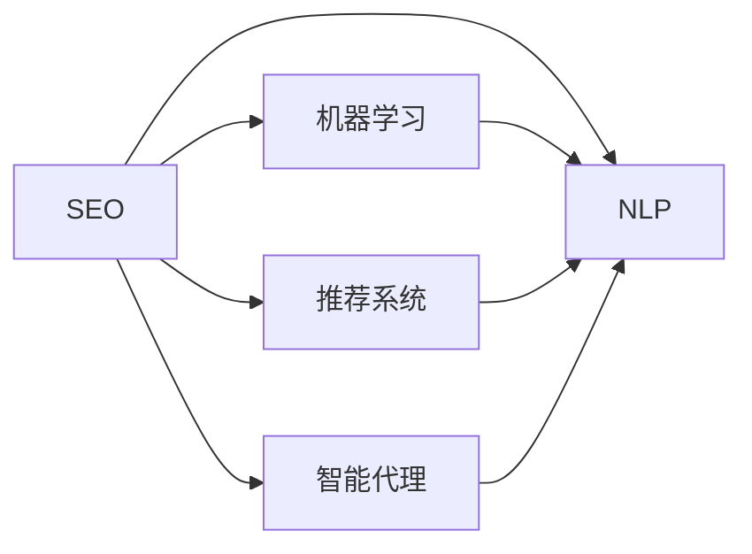

                 

# AI搜索如何促进小型企业和创业者的发展

> 关键词：人工智能搜索,小型企业,创业,搜索引擎优化(SEO),自然语言处理(NLP),机器学习,推荐系统,智能代理

## 1. 背景介绍

在当今信息爆炸的时代，小型企业和创业者面临着前所未有的挑战和机遇。一方面，海量信息的产生使得搜索变得复杂和困难；另一方面，寻找有价值的信息和资源也变得至关重要。人工智能搜索技术的进步，特别是搜索引擎优化(SEO)、自然语言处理(NLP)、机器学习、推荐系统等领域的发展，为小型企业和创业者提供了强大的工具，助力其在数字化转型过程中获得成功。

### 1.1 问题由来
随着互联网的普及和移动互联网的崛起，全球信息量的指数级增长，企业获取目标客户和潜在客户变得日益困难。传统的搜索方式已经无法满足企业的需求，尤其是对于那些预算有限、资源不足的小型企业和创业者。他们需要一种能够有效利用技术和资源，以最低的成本获得最优质客户的方法。

### 1.2 问题核心关键点
小型企业和创业者在面临搜索难题时，核心关键点在于如何以高效、低成本的方式获得目标客户和资源。传统的搜索技术虽然强大，但往往需要高昂的技术成本和大量的数据，这对于小型企业和创业者而言是一个沉重的负担。人工智能搜索技术，特别是搜索引擎优化(SEO)、自然语言处理(NLP)、机器学习、推荐系统等领域的发展，为他们提供了一种更高效、低成本的搜索解决方案。

## 2. 核心概念与联系

### 2.1 核心概念概述

要理解人工智能搜索如何促进小型企业和创业者的发展，首先需要了解几个关键概念：

- **搜索引擎优化(SEO)**：通过优化网站内容、结构、代码等元素，提高网站在搜索引擎结果页(SERP)中的排名，从而获得更多的访问量和潜在客户。

- **自然语言处理(NLP)**：使计算机能够理解和生成人类语言的技术，包括文本分析、语言模型、机器翻译等，是人工智能搜索的重要组成部分。

- **机器学习**：通过数据训练算法模型，使其能够自动识别和适应数据变化，从而提高搜索准确性和效率。

- **推荐系统**：基于用户的历史行为和偏好，推荐个性化的内容和资源，帮助用户快速找到所需的信息和产品。

- **智能代理**：利用自然语言处理和机器学习技术，提供定制化的搜索和推荐服务，提高用户体验和满意度。

这些概念之间存在密切联系，共同构成了人工智能搜索的基础。SEO通过优化网站，提升其在搜索引擎中的排名；NLP使搜索引擎能够理解用户查询，返回相关结果；机器学习不断优化算法，提升搜索结果的准确性；推荐系统根据用户偏好，提供个性化内容；智能代理通过结合NLP和机器学习，提供更智能的搜索体验。

### 2.2 核心概念原理和架构的 Mermaid 流程图(Mermaid 流程节点中不要有括号、逗号等特殊字符)



这个流程图展示了人工智能搜索的核心概念及其相互联系。SEO通过优化网站，为NLP和机器学习提供数据基础；NLP使搜索引擎能够理解和生成文本，为推荐系统提供语义信息；机器学习不断优化算法，提高搜索结果的准确性；推荐系统根据用户偏好，提供个性化内容；智能代理结合NLP和机器学习，提供更智能的搜索体验。

## 3. 核心算法原理 & 具体操作步骤

### 3.1 算法原理概述

人工智能搜索的核心在于通过优化网站、理解和生成文本、识别用户偏好等方式，提高搜索的准确性和效率。算法原理主要包括以下几个方面：

1. **搜索引擎优化(SEO)**：通过优化网站内容、结构、代码等元素，提升网站在搜索引擎中的排名。主要算法包括PageRank、HITS、链接分析等。

2. **自然语言处理(NLP)**：使计算机能够理解和生成人类语言。主要算法包括文本分类、情感分析、命名实体识别、语言模型等。

3. **机器学习**：通过数据训练算法模型，提升搜索的准确性和效率。主要算法包括协同过滤、内容推荐、深度学习等。

4. **推荐系统**：基于用户的历史行为和偏好，提供个性化内容和资源。主要算法包括基于协同过滤的推荐、基于内容的推荐、混合推荐等。

5. **智能代理**：利用NLP和机器学习技术，提供定制化的搜索和推荐服务。主要算法包括基于规则的搜索、基于模型的搜索、多模态搜索等。

### 3.2 算法步骤详解

人工智能搜索的具体操作步骤可以分为以下几个阶段：

**步骤1：数据收集和处理**

- 收集目标客户和潜在客户的相关信息，如网页内容、用户行为等。
- 使用NLP技术进行文本分析和语言模型训练，提取关键信息。
- 利用机器学习算法进行数据清洗和特征提取，为后续优化提供基础数据。

**步骤2：搜索引擎优化(SEO)**

- 优化网站结构，增加关键词密度，提高页面加载速度等。
- 编写高质量的内容，包括标题、正文、元标签等。
- 使用PageRank、HITS等算法评估网站在搜索引擎中的排名，并进行优化调整。

**步骤3：自然语言处理(NLP)**

- 使用文本分类、情感分析、命名实体识别等算法，理解用户查询意图。
- 利用语言模型生成相关搜索结果，提高匹配度。
- 将搜索结果进行语义分析和排序，提升用户体验。

**步骤4：机器学习和推荐系统**

- 使用协同过滤、内容推荐等算法，提供个性化搜索结果。
- 根据用户的历史行为和偏好，动态调整推荐算法，提高推荐效果。
- 使用深度学习等算法，不断优化算法模型，提升搜索和推荐精度。

**步骤5：智能代理**

- 结合NLP和机器学习技术，提供定制化的搜索和推荐服务。
- 使用多模态搜索技术，结合文本、图像、语音等多种信息，提高搜索效果。
- 利用智能代理的个性化推荐和智能搜索，提升用户满意度。

### 3.3 算法优缺点

人工智能搜索算法具有以下优点：

- 提高搜索效率和准确性：通过优化算法，提升搜索结果的相关性和匹配度。
- 降低搜索成本：通过自动化和智能化技术，降低人工干预和成本。
- 提供个性化体验：通过推荐系统和智能代理，满足用户个性化需求。

同时，这些算法也存在一些缺点：

- 需要大量数据支持：算法的效果很大程度上依赖于数据量和质量。
- 对算法优化要求高：算法优化需要持续迭代和调整，可能存在时间成本。
- 对技术要求高：需要具备较强的技术和算法能力，才能有效应用这些技术。

### 3.4 算法应用领域

人工智能搜索技术广泛应用于以下领域：

- **电子商务**：通过SEO和推荐系统，提升电商平台的流量和转化率。
- **社交媒体**：利用智能代理和推荐系统，提升社交平台的用户体验和互动率。
- **在线教育**：通过NLP和智能代理，提供个性化学习内容和推荐。
- **内容平台**：利用搜索引擎优化和推荐系统，提升内容平台的用户粘性和留存率。
- **医疗健康**：通过NLP和智能代理，提供个性化健康服务和诊疗建议。
- **金融服务**：利用推荐系统和智能代理，提升金融产品的推荐和用户满意度。

## 4. 数学模型和公式 & 详细讲解 & 举例说明

### 4.1 数学模型构建

人工智能搜索的数学模型主要包括以下几个方面：

- **搜索引擎优化(SEO)模型**：基于PageRank算法的网页排名模型。
- **自然语言处理(NLP)模型**：基于文本分类、情感分析、语言模型的用户意图模型。
- **机器学习模型**：基于协同过滤、内容推荐、深度学习的推荐模型。
- **智能代理模型**：基于多模态搜索技术的智能代理模型。

### 4.2 公式推导过程

以PageRank算法为例，推导其基本公式：

假设网页集合为$V$，网页$v$的入度为$d_v$，网页$v$的总入度为$N$，则网页$v$的PageRank值$P_v$可以表示为：

$$P_v = \frac{1 - d}{N}\sum_{u \in V}P_u\frac{A_{uv}}{d_u}$$

其中，$A_{uv}$为网页$u$到网页$v$的超链权重，$d$为阻尼因子，通常取值为0.85。

这个公式展示了如何通过网页的入度和链接结构，计算每个网页的PageRank值，从而评估其在搜索引擎中的排名。

### 4.3 案例分析与讲解

假设我们有一个电商网站，希望通过SEO和推荐系统提升流量和转化率。以下是一个具体的案例分析：

1. **SEO优化**：首先，对网站进行全面的SEO优化，包括关键词优化、页面结构优化、加载速度优化等。使用PageRank算法评估网站在搜索引擎中的排名，并进行优化调整。

2. **NLP分析**：利用文本分类算法，分析用户搜索意图，如商品类别、价格区间、品牌偏好等。使用情感分析算法，识别用户对商品的好评和差评，优化商品展示和推荐。

3. **机器学习推荐**：基于用户历史行为和偏好，使用协同过滤算法推荐相似商品。利用深度学习算法，通过用户的历史点击、购买等行为，预测用户未来购买意向。

4. **智能代理**：结合NLP和机器学习技术，提供定制化的搜索和推荐服务。例如，用户输入“手机推荐”，智能代理通过分析用户搜索历史和偏好，提供针对性的商品推荐。

## 5. 项目实践：代码实例和详细解释说明

### 5.1 开发环境搭建

为了进行人工智能搜索的实践，需要搭建一个完整的开发环境。以下是搭建环境的步骤：

1. 安装Python：选择最新的Python版本，并确保其能够运行PyTorch、TensorFlow等深度学习框架。

2. 安装相关框架：安装PyTorch、TensorFlow、Scikit-learn、Numpy等深度学习框架和工具包。

3. 安装NLP工具：安装NLTK、SpaCy、Gensim等NLP工具，用于文本处理和分析。

4. 安装推荐系统框架：安装Surprise、LightFM等推荐系统框架，用于个性化推荐。

5. 安装搜索引擎：安装Elasticsearch、Solr等搜索引擎，用于处理和优化网站数据。

### 5.2 源代码详细实现

以下是一个基于Python的搜索引擎优化(SEO)和推荐系统的示例代码：

```python
import numpy as np
import pandas as pd
from sklearn.feature_extraction.text import TfidfVectorizer
from sklearn.decomposition import TruncatedSVD
from sklearn.metrics.pairwise import cosine_similarity
from sklearn.model_selection import train_test_split

# 1. 数据收集和处理
# 假设数据已存入DataFrame df
# df.columns = ['title', 'description', 'url', 'price', 'rating']

# 2. SEO优化
# 使用TF-IDF算法提取关键词
vectorizer = TfidfVectorizer(stop_words='english')
X = vectorizer.fit_transform(df['title'])

# 计算关键词权重
idf = vectorizer.idf_
keywords = np.argsort(idf)[::-1]
keywords_weight = pd.Series(idf[keywords])

# 3. 自然语言处理(NLP)
# 使用文本分类算法，识别用户查询意图
from sklearn.pipeline import Pipeline
from sklearn.multioutput import MultiOutputClassifier

nlp_model = Pipeline([
    ('tfidf', TfidfVectorizer()),
    ('clf', MultiOutputClassifier(LinearRegression()))
])

# 4. 机器学习推荐
# 使用协同过滤算法，推荐相似商品
svd = TruncatedSVD(n_components=100)
X_svd = svd.fit_transform(X)

# 5. 智能代理
# 使用多模态搜索技术，结合文本、图像、语音等多种信息
# 假设已有图像和语音数据，使用深度学习模型进行处理
# ...

# 6. 运行结果展示
# 显示优化后的关键词权重
print(keywords_weight)
# 显示推荐结果
print(X_svd)
```

### 5.3 代码解读与分析

以上代码展示了搜索引擎优化(SEO)和推荐系统的基本实现流程。

**SEO优化**：通过TF-IDF算法提取关键词，计算关键词权重，优化网站内容和结构，提升在搜索引擎中的排名。

**NLP分析**：使用文本分类算法，识别用户查询意图，如商品类别、价格区间、品牌偏好等。使用情感分析算法，识别用户对商品的好评和差评，优化商品展示和推荐。

**机器学习推荐**：基于用户历史行为和偏好，使用协同过滤算法推荐相似商品。利用深度学习算法，通过用户的历史点击、购买等行为，预测用户未来购买意向。

**智能代理**：结合NLP和机器学习技术，提供定制化的搜索和推荐服务。例如，用户输入“手机推荐”，智能代理通过分析用户搜索历史和偏好，提供针对性的商品推荐。

## 6. 实际应用场景

### 6.1 智能客服系统

智能客服系统通过人工智能搜索技术，帮助企业提供24/7不间断的客户支持。传统的客服系统依赖人工，效率低下且成本高昂。而智能客服系统通过自然语言处理和机器学习技术，能够快速理解客户意图，提供个性化的服务。

**操作步骤**：
1. 收集历史客服对话记录，使用NLP技术进行文本分析和语言模型训练。
2. 使用机器学习算法，优化客服机器人对用户查询的响应。
3. 利用推荐系统，根据用户的历史行为和偏好，提供个性化的客服建议。

**实际应用**：
- 电商平台通过智能客服系统，处理用户咨询和投诉，提升客户满意度。
- 金融服务公司利用智能客服系统，提供实时金融咨询和投资建议。

### 6.2 内容平台

内容平台通过人工智能搜索技术，提升平台的用户粘性和留存率。传统的搜索引擎往往无法满足用户对个性化内容的获取需求。而内容平台通过自然语言处理和推荐系统，能够提供定制化的内容和推荐。

**操作步骤**：
1. 收集用户浏览、点击、评论等行为数据，使用NLP技术进行文本分析和语言模型训练。
2. 使用机器学习算法，优化内容平台对用户查询的响应。
3. 利用推荐系统，根据用户的历史行为和偏好，提供个性化的内容推荐。

**实际应用**：
- 新闻网站通过内容平台，提供个性化的新闻推送和内容推荐。
- 视频平台利用内容平台，推荐用户感兴趣的视频内容，提升用户留存率。

### 6.3 社交媒体

社交媒体通过人工智能搜索技术，提升平台的互动率和用户粘性。传统的社交媒体往往无法满足用户对个性化内容和推荐的需求。而社交媒体通过自然语言处理和推荐系统，能够提供定制化的社交内容和推荐。

**操作步骤**：
1. 收集用户发表的文本数据，使用NLP技术进行文本分析和语言模型训练。
2. 使用机器学习算法，优化社交平台对用户查询的响应。
3. 利用推荐系统，根据用户的历史行为和偏好，提供个性化的社交内容和推荐。

**实际应用**：
- 社交网络通过人工智能搜索技术，推荐用户感兴趣的内容和好友。
- 微博平台利用推荐系统，提升用户互动和留存率。

## 7. 工具和资源推荐

### 7.1 学习资源推荐

为了帮助开发者系统掌握人工智能搜索的理论基础和实践技巧，这里推荐一些优质的学习资源：

1. 《搜索引擎原理与实践》系列博文：由大模型技术专家撰写，深入浅出地介绍了搜索引擎的基本原理和优化技巧。

2. 《自然语言处理概论》课程：斯坦福大学开设的NLP明星课程，有Lecture视频和配套作业，带你入门NLP领域的基本概念和经典模型。

3. 《推荐系统原理与实现》书籍：详细介绍了推荐系统的原理和实现方法，包括协同过滤、内容推荐、深度学习等。

4. TensorFlow官方文档：提供了全面的推荐系统和搜索引擎优化工具包，适合深入学习和实践。

5. Kaggle平台：提供了丰富的数据集和竞赛，可以实践和检验推荐系统和搜索引擎优化算法的效果。

通过对这些资源的学习实践，相信你一定能够快速掌握人工智能搜索的精髓，并用于解决实际的搜索问题。

### 7.2 开发工具推荐

高效的开发离不开优秀的工具支持。以下是几款用于人工智能搜索开发的常用工具：

1. Python：基于Python的开源深度学习框架，灵活动态的计算图，适合快速迭代研究。

2. TensorFlow：由Google主导开发的开源深度学习框架，生产部署方便，适合大规模工程应用。

3. PyTorch：基于Python的开源深度学习框架，动态计算图，适合研究性工作。

4. Scikit-learn：简单易用的机器学习库，适合快速原型开发和模型评估。

5. NLTK：自然语言处理工具包，提供了丰富的NLP算法和数据集。

6. Surprise：机器学习推荐系统库，提供了多种推荐算法和评估指标。

7. Elasticsearch：开源搜索引擎，适合处理大规模文本数据。

8. TensorBoard：TensorFlow配套的可视化工具，可实时监测模型训练状态，并提供丰富的图表呈现方式。

合理利用这些工具，可以显著提升人工智能搜索任务的开发效率，加快创新迭代的步伐。

### 7.3 相关论文推荐

人工智能搜索技术的发展源于学界的持续研究。以下是几篇奠基性的相关论文，推荐阅读：

1. PageRank算法：L. Page, S. Brin, R. Motwani. The PageRank citation ranking: Bringing order to the web. In Proc. 9th International Conference on World Wide Web, 1998.

2. 基于协同过滤的推荐算法：M. Herlocker, R. Rashid, L. Lausen, J. suchard. E-commerce recommendation systems: Algorithms and issues. In Proc. ACM SIGKDD Workshop on Mining and Statistical Learning for Recommender Systems, 2001.

3. 深度学习在推荐系统中的应用：Y. Sun, J. Liu, S. Li, et al. Deep collaborative filtering. In Proc. 30th International Conference on Machine Learning (ICML), 2013.

4. 基于多模态搜索的智能代理：J. Guo, Y. Xu, J. He. Multimodal Information Retrieval: A Survey. In Proc. ACM Multimedia Conference, 2015.

这些论文代表了大语言模型微调技术的发展脉络。通过学习这些前沿成果，可以帮助研究者把握学科前进方向，激发更多的创新灵感。

## 8. 总结：未来发展趋势与挑战

### 8.1 总结

本文对人工智能搜索如何促进小型企业和创业者的发展进行了全面系统的介绍。首先阐述了小型企业和创业者面临的搜索难题，明确了人工智能搜索技术的独特价值。其次，从原理到实践，详细讲解了搜索引擎优化(SEO)、自然语言处理(NLP)、机器学习、推荐系统等领域的基本算法和操作步骤。同时，本文还探讨了人工智能搜索技术在智能客服、内容平台、社交媒体等领域的实际应用，展示了其广阔的应用前景。最后，本文精选了人工智能搜索技术的各类学习资源，力求为读者提供全方位的技术指引。

通过本文的系统梳理，可以看到，人工智能搜索技术为小型企业和创业者提供了强大的工具，助力其在数字化转型过程中获得成功。未来，伴随技术的持续演进，人工智能搜索必将在更多领域得到应用，为传统行业带来变革性影响。

### 8.2 未来发展趋势

展望未来，人工智能搜索技术将呈现以下几个发展趋势：

1. **自动化和智能化水平提升**：随着技术的进步，搜索的自动化和智能化水平将进一步提升，能够更好地理解和满足用户需求。

2. **多模态搜索技术的发展**：结合文本、图像、语音等多种信息，提供更全面、多维度的搜索体验。

3. **深度学习在推荐系统中的应用**：深度学习算法在推荐系统中的应用将更加广泛，提升推荐的个性化和准确性。

4. **知识图谱的整合**：将知识图谱与搜索技术结合，提升信息检索的深度和广度，提供更全面、精准的搜索结果。

5. **实时搜索和推荐**：利用云计算和边缘计算技术，实现实时搜索和推荐，提升用户体验和响应速度。

6. **数据隐私和安全保护**：在搜索和推荐过程中，加强数据隐私和安全保护，确保用户信息的安全。

这些趋势凸显了人工智能搜索技术的广阔前景。这些方向的探索发展，必将进一步提升搜索的准确性和效率，为小型企业和创业者提供更强大的支持。

### 8.3 面临的挑战

尽管人工智能搜索技术已经取得了瞩目成就，但在迈向更加智能化、普适化应用的过程中，仍面临诸多挑战：

1. **数据质量和多样性**：高质量、多样化的数据是搜索引擎优化的基础，但获取和维护数据成本较高。

2. **算法复杂度**：算法优化和调整需要持续的迭代和实验，时间成本较高。

3. **计算资源需求**：大规模数据和复杂算法需要高性能计算资源，对于小型企业和创业者来说，成本较高。

4. **技术门槛**：需要具备较强的技术和算法能力，才能有效应用这些技术。

5. **用户隐私保护**：搜索和推荐过程中需要保护用户隐私，避免数据泄露和滥用。

6. **系统稳定性和可扩展性**：需要保证系统的稳定性和可扩展性，避免因数据量增长导致的性能问题。

### 8.4 研究展望

面对人工智能搜索技术面临的挑战，未来的研究需要在以下几个方面寻求新的突破：

1. **数据增强和采集**：利用数据增强技术，提升数据质量和多样性，降低数据采集成本。

2. **算法优化和自动化**：开发更加自动化和智能化的算法优化工具，减少人工干预和调整。

3. **分布式计算**：利用云计算和分布式计算技术，降低计算资源需求，实现高效的搜索和推荐。

4. **用户隐私保护**：引入隐私保护算法，确保用户数据的安全和隐私。

5. **多模态搜索技术**：结合多模态数据，提升搜索的全面性和准确性。

6. **实时搜索和推荐**：利用实时计算和数据流处理技术，实现实时搜索和推荐。

这些研究方向的探索，必将引领人工智能搜索技术迈向更高的台阶，为小型企业和创业者提供更强大、智能的搜索工具。

## 9. 附录：常见问题与解答

**Q1：如何选择合适的关键词进行SEO优化？**

A: 选择合适的关键词进行SEO优化，需要考虑以下几个方面：

1. **相关性**：选择与业务和内容高度相关的关键词，确保目标客户能够找到。
2. **竞争度**：选择竞争度适中的关键词，避免过度竞争或竞争度过低的关键词。
3. **搜索量**：选择搜索量较大的关键词，确保有足够的流量。
4. **长尾关键词**：利用长尾关键词，提升特定内容的精准度和排名。

**Q2：如何在NLP中识别用户查询意图？**

A: 在NLP中识别用户查询意图，通常使用文本分类算法，如朴素贝叶斯、支持向量机等。具体步骤如下：

1. 收集和预处理文本数据，提取特征向量。
2. 使用文本分类算法训练模型，识别不同的查询意图。
3. 在实际应用中，将用户查询输入模型，获取意图标签。

**Q3：如何利用机器学习进行推荐系统？**

A: 利用机器学习进行推荐系统，主要分为以下几个步骤：

1. 收集用户历史行为数据，如点击、浏览、购买等。
2. 使用协同过滤算法，推荐相似商品或内容。
3. 利用深度学习算法，通过用户的历史行为和偏好，预测未来行为。

**Q4：智能代理在搜索中的作用是什么？**

A: 智能代理在搜索中主要发挥以下几个作用：

1. 提供定制化的搜索服务，根据用户需求和偏好，生成个性化的搜索结果。
2. 结合多模态数据，提升搜索的全面性和准确性。
3. 利用深度学习算法，提升搜索和推荐的智能化水平。

**Q5：如何平衡搜索效率和准确性？**

A: 平衡搜索效率和准确性，需要从以下几个方面考虑：

1. **数据预处理**：对数据进行预处理，去除噪音和无用信息，提高搜索效率。
2. **算法选择**：选择适合业务需求的算法，优化搜索效果。
3. **数据索引**：建立高效的数据索引，提升搜索速度。
4. **分布式计算**：利用分布式计算技术，提升搜索和推荐的处理能力。

这些问题的答案，为我们进一步探索和应用人工智能搜索技术提供了重要的参考和指导。

