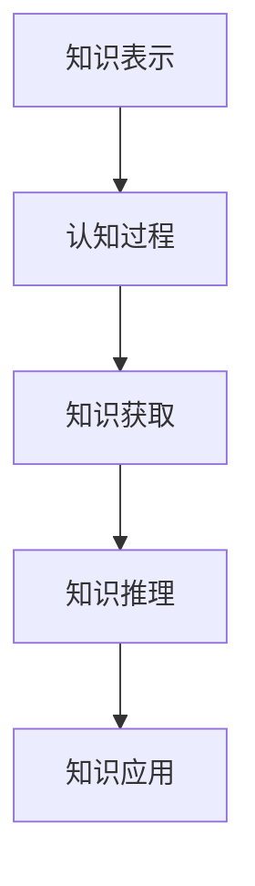

                 

# 认知科学视角下的知识本质

## 1. 背景介绍

### 1.1 问题由来
在人工智能研究领域，长期以来，知识的本质问题一直是一个备受争议和深入探讨的主题。认知科学作为一门跨学科的科学，试图通过研究人类和动物如何获取、存储、处理和利用知识，来理解知识这一复杂现象。人工智能的发展，特别是深度学习和神经网络技术的应用，使得研究者有更多机会从认知科学的角度来理解知识，并在实际应用中取得进展。

## 2. 核心概念与联系

### 2.1 核心概念概述

认知科学视角下的知识本质研究，涉及众多概念，包括：

- **知识表示**：知识如何被编码和组织，以便于存储和检索。
- **认知过程**：包括感知、记忆、推理、学习等心理过程，以及它们如何影响知识的获取和应用。
- **知识获取**：知识从外界获取的过程，包括感知、注意、编码和存储。
- **知识推理**：知识的推理过程，即如何利用已有知识来生成新知识。
- **知识应用**：将知识应用于实际问题的过程，包括问题求解、决策制定等。

这些概念之间有着紧密的联系，共同构成了对知识本质的理解。

### 2.2 核心概念原理和架构的 Mermaid 流程图



## 3. 核心算法原理 & 具体操作步骤

### 3.1 算法原理概述

在认知科学视角下，知识本质研究主要围绕以下几个核心算法原理：

- **知识获取算法**：通过感知和注意机制，从外界环境中获取信息，并将信息编码为知识表示。
- **知识存储算法**：将获取到的知识存储在认知系统内，以便于后续的检索和应用。
- **知识推理算法**：利用已有知识生成新知识，包括推理、类比、归纳等。
- **知识应用算法**：将知识应用于实际问题，包括问题求解、决策制定等。

### 3.2 算法步骤详解

**Step 1: 知识表示**
- 选择适当的知识表示方法，如逻辑表示、框架表示、符号网络等。
- 确定知识库的结构，包括事实、规则、模式等。

**Step 2: 知识获取**
- 通过感知和注意机制，从外界环境获取信息。
- 将获取到的信息编码为知识表示，存入知识库。

**Step 3: 知识存储**
- 将知识库中的知识组织好，使其便于检索和应用。
- 采用各种算法和数据结构，如记忆回溯、关联规则等，实现知识的有效存储。

**Step 4: 知识推理**
- 根据知识库中的事实和规则，进行推理和类比，生成新知识。
- 采用各种推理算法，如逻辑推理、专家系统等，实现知识的扩展。

**Step 5: 知识应用**
- 利用推理生成的知识，解决实际问题，包括问题求解、决策制定等。
- 采用各种算法和工具，如规划、搜索、优化等，实现知识的应用。

### 3.3 算法优缺点

**优点**：
- 认知科学视角下的知识本质研究，能够从人类认知的角度来理解知识的获取和应用，具有深刻的理论和实际应用价值。
- 通过认知科学的研究，可以更好地理解和利用人类的智能，推动人工智能技术的发展。

**缺点**：
- 认知科学的研究方法较为复杂，涉及大量心理学、神经科学等领域，难以统一形成系统的理论框架。
- 认知科学的理论和算法仍存在较多未知和争议，难以直接应用于实际问题。

### 3.4 算法应用领域

认知科学视角下的知识本质研究，在人工智能领域具有广泛的应用前景，特别是在以下几个方面：

- **智能机器人**：通过理解认知过程和知识获取，实现更加智能的决策和行为。
- **自然语言处理**：通过理解语言认知过程，提升自然语言理解和生成能力。
- **机器学习**：通过理解知识推理过程，实现更加高效和智能的学习算法。
- **计算机视觉**：通过理解视觉认知过程，提升图像识别和理解能力。

## 4. 数学模型和公式 & 详细讲解 & 举例说明

### 4.1 数学模型构建

在认知科学视角下，知识本质研究主要涉及以下数学模型：

- **符号表示模型**：将知识表示为符号网络，使用逻辑推理算法进行推理。
- **神经网络模型**：将知识表示为神经元之间的连接权重，使用反向传播算法进行学习。
- **贝叶斯网络模型**：将知识表示为贝叶斯网络，使用贝叶斯推理算法进行推理。

### 4.2 公式推导过程

**符号表示模型**：

$$
\begin{align*}
\text{知识库} &= \{(\text{实体}, \text{属性}, \text{事实})\} \\
\text{事实} &= \text{实体-属性映射}
\end{align*}
$$

**神经网络模型**：

$$
\begin{align*}
\text{知识库} &= \{\text{神经元}\} \\
\text{知识表示} &= \text{神经元之间的连接权重}
\end{align*}
$$

**贝叶斯网络模型**：

$$
\begin{align*}
\text{知识库} &= \{\text{变量}, \text{条件概率}\} \\
\text{知识表示} &= \text{变量之间的条件概率分布}
\end{align*}
$$

### 4.3 案例分析与讲解

**案例一：知识表示模型**
- **问题**：设计一个简单的知识库，表示某城市的信息。
- **解**：选择逻辑表示方法，知识库可以表示为：
  - 实体：城市、街道、商店
  - 属性：名称、位置、类型
  - 事实：城市包含多个街道，街道上有多个商店。

**案例二：神经网络模型**
- **问题**：训练一个简单的图像分类模型，识别数字0到9。
- **解**：使用卷积神经网络（CNN），知识库可以表示为：
  - 神经元：卷积层、池化层、全连接层
  - 连接权重：各层之间的连接权重和偏置。
- **训练**：使用反向传播算法，不断调整连接权重，使得模型能够正确分类输入图像。

**案例三：贝叶斯网络模型**
- **问题**：设计一个简单的疾病诊断模型。
- **解**：使用贝叶斯网络，知识库可以表示为：
  - 变量：症状、疾病
  - 条件概率：症状对不同疾病的概率分布。
- **推理**：给定一组症状，使用贝叶斯推理算法，计算出各个疾病的可能性。

## 5. 项目实践：代码实例和详细解释说明

### 5.1 开发环境搭建

在认知科学视角下，知识本质研究的开发环境主要包括Python、R、MATLAB等工具，以及相关的神经网络和符号表示库，如TensorFlow、PyTorch、Pangloss等。

**Step 1: 安装环境**
- 在Linux系统下，使用conda或pip安装所需的工具。

**Step 2: 配置环境**
- 安装所需的库，如numpy、scikit-learn、TensorFlow等。
- 配置好开发环境，设置编译器、Python版本等。

### 5.2 源代码详细实现

**案例一：符号表示模型**
- **代码实现**：
  ```python
  from pangloss import KB
  from pangloss import Rule

  # 创建知识库
  kb = KB()

  # 添加事实
  facts = [
      'John works in New York City',
      'New York City is in the United States',
      'John lives in the United States'
  ]
  for fact in facts:
      kb.add_fact(fact)

  # 添加规则
  rules = [
      Rule('work_in -> live_in', 'John works in New York City -> John lives in the United States'),
      Rule('live_in -> work_in', 'John lives in the United States -> John works in New York City')
  ]
  for rule in rules:
      kb.add_rule(rule)
  ```

**案例二：神经网络模型**
- **代码实现**：
  ```python
  import tensorflow as tf

  # 创建模型
  model = tf.keras.Sequential([
      tf.keras.layers.Conv2D(32, (3,3), activation='relu', input_shape=(28, 28, 1)),
      tf.keras.layers.MaxPooling2D((2,2)),
      tf.keras.layers.Flatten(),
      tf.keras.layers.Dense(128, activation='relu'),
      tf.keras.layers.Dense(10, activation='softmax')
  ])

  # 编译模型
  model.compile(optimizer='adam', loss='categorical_crossentropy', metrics=['accuracy'])

  # 训练模型
  model.fit(train_images, train_labels, epochs=10)
  ```

**案例三：贝叶斯网络模型**
- **代码实现**：
  ```python
  import pomegranate

  # 创建贝叶斯网络
  bn = pomegranate.BayesianNetwork()

  # 添加变量
  bn.add_variable('Symptom', pomegranate.CategoricalDistribution(['Fever', 'Cough', 'Pain']))
  bn.add_variable('Disease', pomegranate.CategoricalDistribution(['Flu', 'Pneumonia', 'StrepThroat']))

  # 添加条件概率
  bn.add_joint('Symptom_Disease', pomegranate.JointDistribution(['Fever', 'Cough', 'Pain']))

  # 训练网络
  bn.fit(train_data)

  # 推理
  predictions = bn.predict(test_data)
  ```

### 5.3 代码解读与分析

**符号表示模型**：
- **代码解读**：使用Pangloss库，创建知识库，添加事实和规则，使用逻辑推理算法。
- **分析**：符号表示模型可以清晰地表示知识库中的实体、属性和事实关系，适合用于描述复杂的知识和逻辑推理问题。

**神经网络模型**：
- **代码解读**：使用TensorFlow库，创建卷积神经网络模型，进行图像分类训练。
- **分析**：神经网络模型能够处理大量数据，通过反向传播算法自动学习特征，适合用于图像、语音等复杂数据的分类和识别。

**贝叶斯网络模型**：
- **代码解读**：使用Pomegranate库，创建贝叶斯网络，添加变量和条件概率，进行训练和推理。
- **分析**：贝叶贝叶斯网络模型能够处理不确定性和概率问题，适合用于疾病诊断、风险评估等需要处理概率和不确定性的问题。

## 6. 实际应用场景

### 6.1 智能机器人

智能机器人需要具备强大的知识获取和推理能力，以便于在复杂环境中进行决策和行为规划。通过认知科学视角下的知识本质研究，可以实现以下应用：

- **感知与环境理解**：通过感知算法获取环境信息，利用知识表示模型理解环境特征，提升机器人对环境的认知能力。
- **决策与行为规划**：通过推理算法进行决策，利用知识库规划行为，提升机器人的自主性和智能性。

### 6.2 自然语言处理

自然语言处理（NLP）需要理解语言的结构和意义，以便于进行语言理解和生成。通过认知科学视角下的知识本质研究，可以实现以下应用：

- **语言理解**：通过符号表示模型和神经网络模型，理解自然语言的结构和语义，提升语言理解的准确性。
- **语言生成**：通过知识库和推理算法，生成符合语法和语义规则的文本，提升语言生成的自然性和流畅性。

### 6.3 机器学习

机器学习需要理解数据的结构和模式，以便于进行高效的模型训练和预测。通过认知科学视角下的知识本质研究，可以实现以下应用：

- **数据表示**：通过符号表示模型和神经网络模型，表示数据结构和特征，提升模型训练的效率和准确性。
- **模型推理**：通过知识库和推理算法，进行模型推理和优化，提升模型的泛化能力和稳定性。

### 6.4 未来应用展望

未来，认知科学视角下的知识本质研究将呈现以下几个发展趋势：

1. **多模态知识表示**：将不同模态的知识表示方法进行融合，提升知识获取和推理的全面性。
2. **自适应知识获取**：通过智能算法，自适应地获取和更新知识库，提升知识获取的灵活性和时效性。
3. **跨领域知识迁移**：将知识库中的知识进行跨领域迁移，提升知识应用的范围和效果。
4. **深度认知理解**：利用认知科学的研究成果，深入理解人类认知过程，提升人工智能的智能化水平。
5. **知识自动化生成**：通过算法生成符合逻辑和语义规则的知识，提升知识获取的自动化程度。

## 7. 工具和资源推荐

### 7.1 学习资源推荐

1. **《认知科学导论》**：该书系统介绍了认知科学的基本概念和理论，适合作为认知科学视角下知识本质研究的学习入门书籍。
2. **Coursera《认知科学》课程**：该课程由斯坦福大学开设，介绍了认知科学的基本原理和应用，适合在线学习。
3. **《神经网络与深度学习》**：该书详细介绍了神经网络和深度学习的理论和方法，适合作为知识表示和推理的学习资源。
4. **MIT《人工智能导论》课程**：该课程由MIT开设，介绍了人工智能的基本概念和应用，适合了解认知科学视角下知识本质的研究背景。
5. **Pangloss库**：一个用于符号表示模型的Python库，适合研究知识表示和逻辑推理。

### 7.2 开发工具推荐

1. **Python**：作为认知科学视角下知识本质研究的主流语言，Python具有丰富的库和工具，适合进行符号表示、神经网络和贝叶斯网络等模型的开发。
2. **TensorFlow**：一个流行的深度学习框架，适合进行神经网络的开发和训练。
3. **Pomegranate**：一个用于贝叶斯网络的Python库，适合进行概率推理和统计分析。
4. **MATLAB**：一个专业的数值计算和数据可视化工具，适合进行复杂的数学建模和仿真。
5. **R语言**：一个专业的统计分析工具，适合进行数据处理和分析。

### 7.3 相关论文推荐

1. **《认知科学的起源与发展》**：该论文系统介绍了认知科学的基本理论和应用，适合了解认知科学视角下知识本质研究的理论背景。
2. **《符号推理与人工智能》**：该论文详细介绍了符号推理的基本原理和应用，适合作为知识表示和推理的研究资源。
3. **《深度学习在自然语言处理中的应用》**：该论文详细介绍了深度学习在自然语言处理中的应用，适合作为NLP方向的知识本质研究资源。
4. **《机器学习与统计学习》**：该书详细介绍了机器学习的基本理论和应用，适合作为知识获取和推理的研究资源。
5. **《贝叶斯网络与概率推理》**：该论文详细介绍了贝叶斯网络的基本原理和应用，适合作为概率推理和统计分析的研究资源。

## 8. 总结：未来发展趋势与挑战

### 8.1 研究成果总结

本文从认知科学视角下对知识本质进行了探讨，详细介绍了知识获取、存储、推理和应用的过程，并结合实际应用进行了实例分析。通过这些分析和实例，能够帮助研究者更深刻地理解认知科学视角下的知识本质，并应用于实际问题中。

### 8.2 未来发展趋势

未来，认知科学视角下的知识本质研究将呈现以下几个发展趋势：

1. **认知科学与其他学科的融合**：认知科学与其他学科（如心理学、神经科学、信息科学等）的融合，将进一步提升对知识本质的理解。
2. **认知科学的自动化和智能化**：利用人工智能技术，实现认知科学的自动化和智能化，提升知识获取和推理的效率和准确性。
3. **认知科学的跨领域应用**：认知科学的研究成果将广泛应用于多个领域，如智能机器人、自然语言处理、机器学习等。
4. **认知科学的伦理和安全性**：认知科学的研究需要关注伦理和安全问题，确保人工智能技术的健康发展。
5. **认知科学的持续更新和优化**：认知科学的研究需要不断更新和优化，以适应不断变化的技术和应用需求。

### 8.3 面临的挑战

尽管认知科学视角下的知识本质研究具有广阔的前景，但也面临着诸多挑战：

1. **跨学科的协调和合作**：认知科学涉及多个学科，跨学科的协调和合作将是一个重要的挑战。
2. **复杂性和多样性**：认知科学的研究对象和问题非常复杂和多样化，难以统一形成系统的理论框架。
3. **数据和资源的限制**：认知科学的研究需要大量的数据和资源，如何获取和管理这些资源也是一个重要的挑战。
4. **技术的成熟度**：当前认知科学的研究技术仍处于初期阶段，技术的成熟度还需进一步提升。
5. **伦理和安全问题**：认知科学的研究需要关注伦理和安全问题，确保技术的应用不会带来负面影响。

### 8.4 研究展望

未来，认知科学视角下的知识本质研究需要在以下几个方面进行深入探索：

1. **多模态知识的表示和融合**：将不同模态的知识表示方法进行融合，提升知识获取和推理的全面性。
2. **跨领域的知识迁移**：将知识库中的知识进行跨领域迁移，提升知识应用的范围和效果。
3. **自适应知识获取**：通过智能算法，自适应地获取和更新知识库，提升知识获取的灵活性和时效性。
4. **认知科学的自动化和智能化**：利用人工智能技术，实现认知科学的自动化和智能化，提升知识获取和推理的效率和准确性。
5. **认知科学的伦理和安全**：关注认知科学研究的伦理和安全问题，确保技术的应用不会带来负面影响。

---

作者：禅与计算机程序设计艺术 / Zen and the Art of Computer Programming

