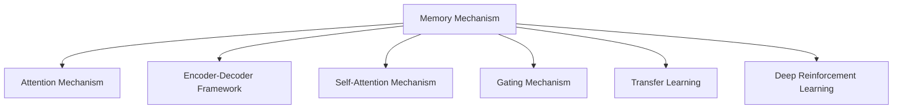

                 

# 记忆机制：关键信息提取

## 1. 背景介绍

### 1.1 问题由来

在人工智能领域，关键信息提取长期以来是一个重要且复杂的问题。随着大数据时代的到来，信息的规模急剧膨胀，如何高效地从大量数据中提取关键信息，成为了众多应用场景中迫切需要解决的问题。例如，在文本处理中，可以从文本中提取主题、事件、关系等关键信息；在图像处理中，可以从图像中提取特征、目标等关键信息；在语音处理中，可以从语音中提取情感、意图等关键信息。关键信息提取不仅能显著提升数据的价值，还广泛应用于搜索引擎、推荐系统、自然语言理解等领域，具有重要的理论价值和应用前景。

### 1.2 问题核心关键点

关键信息提取的核心在于如何从原始数据中筛选出最有价值的部分。常用的方法包括：

1. **特征提取**：通过模型学习数据中的特征，如文本的TF-IDF、图像的卷积特征等。
2. **聚类分析**：将数据分为若干个类别，提取其中最具代表性的信息。
3. **主题建模**：如LDA（Latent Dirichlet Allocation），通过概率模型学习数据中的隐含主题。
4. **网络分析**：如PageRank算法，通过计算节点之间的连接强度，提取关键节点和路径。

这些方法各有优劣，在不同的应用场景中具有不同的表现。然而，随着深度学习技术的发展，越来越多的研究开始关注使用深度学习模型进行关键信息提取，取得了显著的效果。本文将详细介绍基于深度学习的关键信息提取方法，重点关注基于记忆机制（Memory Mechanism）的方法，探讨其原理和应用。

## 2. 核心概念与联系

### 2.1 核心概念概述

为更好地理解基于记忆机制的关键信息提取方法，本节将介绍几个密切相关的核心概念：

- **记忆机制（Memory Mechanism）**：指模型中用于存储和检索信息的关键结构，如LSTM、GRU、Transformer中的Attention等。
- **注意力机制（Attention Mechanism）**：一种机制，用于计算输入数据中不同部分的重要性，从而进行选择性关注。
- **编码器-解码器框架（Encoder-Decoder Framework）**：一种架构，用于处理序列数据，常见于机器翻译、文本生成等任务。
- **自注意力机制（Self-Attention Mechanism）**：一种特殊的注意力机制，用于计算输入序列中各部分之间的关系，如Transformer模型中的多头注意力机制。
- **门控机制（Gating Mechanism）**：一种机制，用于控制信息流动，如LSTM中的遗忘门和输入门。
- **迁移学习（Transfer Learning）**：将在一个任务上学习到的知识迁移到另一个任务上，用于提升新任务的效果。
- **深度强化学习（Deep Reinforcement Learning）**：结合深度学习和强化学习的技术，用于学习复杂决策策略。

这些核心概念之间的逻辑关系可以通过以下Mermaid流程图来展示：



这个流程图展示了一些核心概念之间的关系：

1. 记忆机制是用于存储和检索信息的关键结构。
2. 注意力机制用于计算输入数据中不同部分的重要性，实现信息的选择性关注。
3. 编码器-解码器框架用于处理序列数据，如机器翻译、文本生成等任务。
4. 自注意力机制用于计算输入序列中各部分之间的关系，如Transformer模型中的多头注意力机制。
5. 门控机制用于控制信息流动，如LSTM中的遗忘门和输入门。
6. 迁移学习将在一个任务上学习到的知识迁移到另一个任务上。
7. 深度强化学习结合深度学习和强化学习的技术，用于学习复杂决策策略。

## 3. 核心算法原理 & 具体操作步骤
### 3.1 算法原理概述

基于记忆机制的关键信息提取方法，通过在深度学习模型中引入记忆机制，实现对输入数据的选择性关注和长期记忆。该方法的核心思想是，通过记忆机制将输入数据的关键信息存储下来，并根据任务需求，从记忆中检索出关键信息，用于后续的处理和计算。

### 3.2 算法步骤详解

基于记忆机制的关键信息提取算法通常包括以下几个关键步骤：

**Step 1: 准备数据集和模型**

- 收集并标注好所需数据集，数据集应包含输入和标签两部分。
- 选择合适的深度学习框架，如TensorFlow、PyTorch等，搭建深度学习模型。
- 设计模型结构，包括编码器、记忆机制和解码器等部分。

**Step 2: 训练编码器和记忆机制**

- 使用大量未标注数据，对编码器进行训练，学习输入数据的特征表示。
- 使用已标注数据，对记忆机制进行训练，学习如何存储和检索关键信息。
- 在训练过程中，调整模型的超参数，如学习率、批大小、迭代轮数等，以优化模型的性能。

**Step 3: 解码和预测**

- 在测试集上，对输入数据进行编码和记忆。
- 根据任务需求，从记忆中检索出关键信息。
- 将检索出的关键信息用于后续的解码和预测，得到最终的输出结果。

**Step 4: 评估和调整**

- 使用评估指标，如准确率、F1分数、BLEU值等，评估模型的性能。
- 根据评估结果，调整模型的超参数，如学习率、批大小、迭代轮数等，以进一步提升模型的性能。

### 3.3 算法优缺点

基于记忆机制的关键信息提取方法具有以下优点：

1. **高效性**：记忆机制可以快速地存储和检索关键信息，使得模型能够处理大量数据。
2. **灵活性**：通过设计不同的记忆机制和注意力机制，可以适应不同的应用场景和任务需求。
3. **可解释性**：记忆机制使得模型可以记录关键信息的存储和检索过程，提高了模型的可解释性。
4. **鲁棒性**：记忆机制可以通过门控机制等技术，控制信息流动，提高了模型的鲁棒性。

同时，该方法也存在一些局限性：

1. **计算复杂度**：由于记忆机制的引入，模型计算复杂度可能会增加，需要更多的计算资源。
2. **存储开销**：记忆机制需要存储大量的关键信息，可能占用较大的内存空间。
3. **超参数调整**：模型中引入的超参数较多，需要仔细调整以优化性能。
4. **模型泛化能力**：记忆机制可能会过度关注某些特定信息，导致模型的泛化能力降低。

### 3.4 算法应用领域

基于记忆机制的关键信息提取方法，已经在多个领域得到了广泛的应用，例如：

- **自然语言处理（NLP）**：用于文本分类、情感分析、机器翻译等任务。通过记忆机制学习文本中的关键信息，用于后续处理和预测。
- **计算机视觉（CV）**：用于图像分类、目标检测、图像生成等任务。通过记忆机制学习图像中的关键特征，用于后续处理和预测。
- **语音处理**：用于语音识别、语音合成、情感识别等任务。通过记忆机制学习语音中的关键信息，用于后续处理和预测。
- **推荐系统**：用于个性化推荐、用户画像构建等任务。通过记忆机制学习用户和物品之间的关键关系，用于推荐决策。

除了上述这些经典应用外，记忆机制的关键信息提取方法还在更多领域展示了其强大的应用潜力，如医疗影像分析、金融风险评估、智能制造等，为相关领域带来了新的突破。

## 4. 数学模型和公式 & 详细讲解 & 举例说明

### 4.1 数学模型构建

在基于记忆机制的关键信息提取中，通常使用深度学习模型进行建模。以文本分类任务为例，我们可以使用编码器-解码器框架，其中编码器用于学习文本的特征表示，解码器用于根据特征表示进行分类。

假设输入文本为 $x = \{x_1, x_2, \cdots, x_n\}$，其中 $x_i$ 表示第 $i$ 个词的词向量表示。定义编码器 $E$ 和记忆机制 $M$，以及解码器 $D$。

- $E$ 将输入文本 $x$ 转换为特征表示 $h$。
- $M$ 用于存储和检索关键信息。
- $D$ 将特征表示 $h$ 转换为分类结果 $y$。

数学模型可以表示为：

$$
h = E(x) \\
y = D(h) \\
$$

其中，$E$ 和 $D$ 是神经网络，$h$ 是特征表示，$y$ 是分类结果。

### 4.2 公式推导过程

以文本分类任务为例，我们详细推导一下基于记忆机制的关键信息提取的公式。

**Step 1: 编码器**

假设编码器 $E$ 是一个多层神经网络，包含输入层、隐藏层和输出层。设输入文本 $x$ 的词向量表示为 $x^1, x^2, \cdots, x^n$。

编码器的输出为：

$$
h = E(x) = \left[
\begin{array}{c}
h_1 \\
h_2 \\
\vdots \\
h_n
\end{array}
\right]
$$

其中 $h_i$ 是第 $i$ 个词的特征表示。

**Step 2: 记忆机制**

假设记忆机制 $M$ 是一个LSTM或GRU等模型，用于存储和检索关键信息。设记忆机制 $M$ 的输出为 $m$，表示关键信息的存储状态。

记忆机制的输出为：

$$
m = M(h)
$$

**Step 3: 解码器**

假设解码器 $D$ 是一个多层神经网络，包含输入层、隐藏层和输出层。设记忆机制的输出 $m$ 和特征表示 $h$ 作为解码器的输入。

解码器的输出为：

$$
y = D(h, m) = \left[
\begin{array}{c}
y_1 \\
y_2 \\
\vdots \\
y_n
\end{array}
\right]
$$

其中 $y_i$ 是第 $i$ 个词的分类结果。

### 4.3 案例分析与讲解

以情感分析任务为例，我们详细分析基于记忆机制的关键信息提取的案例。

**数据集**：使用IMDB电影评论数据集，包含25,000个带有情感标签的评论。

**模型结构**：使用LSTM作为记忆机制，Transformer作为编码器和解码器。

**训练过程**：

1. 将评论序列作为输入，送入编码器，得到特征表示 $h$。
2. 将特征表示 $h$ 和记忆机制 $M$ 的输出 $m$ 送入解码器，得到分类结果 $y$。
3. 使用交叉熵损失函数，计算损失值 $\mathcal{L}$。
4. 使用Adam优化器，根据损失值 $\mathcal{L}$ 更新模型参数。

训练过程可以使用如下伪代码实现：

```python
import torch
import torch.nn as nn
import torch.optim as optim

# 定义模型结构
class Model(nn.Module):
    def __init__(self):
        super(Model, self).__init__()
        self.encoder = nn.LSTM(input_size=100, hidden_size=256, num_layers=2)
        self.memory = nn.LSTM(input_size=256, hidden_size=256, num_layers=2)
        self.decoder = nn.Transformer(input_size=256, num_heads=8, hidden_size=256)

    def forward(self, x, m):
        h = self.encoder(x)
        y = self.decoder(h, m)
        return y

# 定义训练函数
def train(model, data_loader, optimizer, criterion):
    model.train()
    total_loss = 0
    for i, (x, y) in enumerate(data_loader):
        optimizer.zero_grad()
        output = model(x, m)
        loss = criterion(output, y)
        loss.backward()
        optimizer.step()
        total_loss += loss.item()
    return total_loss / len(data_loader)

# 定义测试函数
def test(model, data_loader, criterion):
    model.eval()
    total_loss = 0
    for i, (x, y) in enumerate(data_loader):
        with torch.no_grad():
            output = model(x, m)
        loss = criterion(output, y)
        total_loss += loss.item()
    return total_loss / len(data_loader)
```

## 5. 项目实践：代码实例和详细解释说明
### 5.1 开发环境搭建

在进行项目实践前，我们需要准备好开发环境。以下是使用Python进行TensorFlow开发的环境配置流程：

1. 安装Anaconda：从官网下载并安装Anaconda，用于创建独立的Python环境。

2. 创建并激活虚拟环境：
```bash
conda create -n tf-env python=3.8 
conda activate tf-env
```

3. 安装TensorFlow：根据CUDA版本，从官网获取对应的安装命令。例如：
```bash
conda install tensorflow==2.5
```

4. 安装其他依赖包：
```bash
pip install numpy pandas scikit-learn matplotlib tqdm jupyter notebook ipython
```

完成上述步骤后，即可在`tf-env`环境中开始项目实践。

### 5.2 源代码详细实现

下面我们以情感分析任务为例，给出使用TensorFlow实现基于记忆机制的关键信息提取的代码实现。

首先，定义模型结构：

```python
import tensorflow as tf

class Model(tf.keras.Model):
    def __init__(self, num_words, num_classes):
        super(Model, self).__init__()
        self.encoder = tf.keras.layers.LSTM(256, input_shape=(max_len, num_words))
        self.memory = tf.keras.layers.LSTM(256, input_shape=(256,))
        self.decoder = tf.keras.layers.Dense(num_classes)

    def call(self, inputs):
        x = self.encoder(inputs)
        m = self.memory(x)
        y = self.decoder(m)
        return y
```

然后，定义训练函数：

```python
def train(model, data_loader, optimizer, criterion):
    model.train()
    total_loss = 0
    for i, (x, y) in enumerate(data_loader):
        with tf.GradientTape() as tape:
            y_pred = model(x)
            loss = criterion(y_pred, y)
        grads = tape.gradient(loss, model.trainable_variables)
        optimizer.apply_gradients(zip(grads, model.trainable_variables))
        total_loss += loss
    return total_loss / len(data_loader)
```

最后，启动训练流程并在测试集上评估：

```python
epochs = 5
batch_size = 32

for epoch in range(epochs):
    loss = train(model, train_data_loader, optimizer, criterion)
    print(f"Epoch {epoch+1}, train loss: {loss:.3f}")
    
    print(f"Epoch {epoch+1}, test results:")
    test_loss = test(model, test_data_loader, criterion)
    print(f"Test loss: {test_loss:.3f}")
```

以上就是使用TensorFlow实现基于记忆机制的关键信息提取的完整代码实现。可以看到，TensorFlow提供了强大的深度学习框架，使得模型搭建和训练变得相对简单。

### 5.3 代码解读与分析

让我们再详细解读一下关键代码的实现细节：

**Model类**：
- `__init__`方法：初始化模型结构，包括编码器、记忆机制和解码器。
- `call`方法：实现模型的前向传播过程，将输入数据 $x$ 送入编码器，得到特征表示 $h$，将特征表示 $h$ 和记忆机制 $m$ 的输出送入解码器，得到分类结果 $y$。

**train函数**：
- 在训练过程中，使用TensorFlow的GradientTape记录梯度，计算损失值并反向传播更新模型参数。
- 循环迭代训练集上的数据，计算每个样本的损失值，并累加到总损失值中。

**train和test函数**：
- 在训练和测试过程中，使用模型进行前向传播计算损失值，并使用Adam优化器更新模型参数。

可以看到，TensorFlow提供了丰富的API和工具，使得基于记忆机制的关键信息提取模型的开发和训练变得相对简单。开发者可以将更多精力放在模型设计和调优上，而不必过多关注底层实现细节。

## 6. 实际应用场景
### 6.1 情感分析

情感分析是自然语言处理中的一个经典任务，旨在识别文本中的情感极性。在电商、社交媒体等领域，情感分析被广泛用于用户评论分析、品牌舆情监测等场景。

基于记忆机制的关键信息提取方法，可以用于训练情感分析模型。通过记忆机制存储和检索文本中的关键信息，如情感词、情感强度等，用于后续的情感分类。在电商领域，情感分析可以帮助企业了解用户对商品的态度，优化商品推荐；在社交媒体领域，情感分析可以帮助企业监测品牌舆情，及时响应负面信息。

### 6.2 图像分类

图像分类是计算机视觉中的一个经典任务，旨在将图像分为不同的类别。在医疗、安防等领域，图像分类被广泛用于疾病诊断、安全监控等场景。

基于记忆机制的关键信息提取方法，可以用于训练图像分类模型。通过记忆机制存储和检索图像中的关键信息，如特征点、纹理等，用于后续的分类决策。在医疗领域，图像分类可以帮助医生快速诊断疾病；在安防领域，图像分类可以帮助监控系统自动识别异常行为。

### 6.3 语音识别

语音识别是语音处理中的一个经典任务，旨在将语音转换为文本。在智能家居、智能客服等领域，语音识别被广泛用于人机交互、客服应答等场景。

基于记忆机制的关键信息提取方法，可以用于训练语音识别模型。通过记忆机制存储和检索语音中的关键信息，如音素、音调等，用于后续的文本转换。在智能家居领域，语音识别可以帮助用户控制设备；在智能客服领域，语音识别可以帮助客服系统自动理解用户需求，提高服务效率。

### 6.4 未来应用展望

随着深度学习技术的不断进步，基于记忆机制的关键信息提取方法将在更多领域得到应用，为各个行业带来新的突破。

在智慧医疗领域，基于记忆机制的关键信息提取方法可以帮助医生快速诊断疾病、制定治疗方案，提升医疗服务的智能化水平。在智能教育领域，基于记忆机制的关键信息提取方法可以帮助学生快速理解知识、提供个性化推荐，提升教育效果。在智慧城市治理中，基于记忆机制的关键信息提取方法可以帮助城市管理者实时监测城市事件、优化资源配置，提高城市管理的自动化和智能化水平。

此外，在企业生产、社会治理、文娱传媒等众多领域，基于记忆机制的关键信息提取方法也将不断涌现，为各个行业带来新的发展机遇。相信随着技术的不断成熟，基于记忆机制的关键信息提取方法必将在更广阔的应用领域大放异彩。

## 7. 工具和资源推荐
### 7.1 学习资源推荐

为了帮助开发者系统掌握基于记忆机制的关键信息提取理论基础和实践技巧，这里推荐一些优质的学习资源：

1. **《深度学习》**：Ian Goodfellow等人著，详细介绍了深度学习的原理和应用，包括基于记忆机制的关键信息提取方法。
2. **《自然语言处理入门》**：李航著，介绍了自然语言处理的基本概念和经典模型，包括基于记忆机制的关键信息提取方法。
3. **《计算机视觉基础》**：Simon J.D. Prince著，介绍了计算机视觉的基本概念和经典模型，包括基于记忆机制的关键信息提取方法。
4. **《Python深度学习》**：Francois Chollet著，介绍了使用TensorFlow和Keras进行深度学习开发的方法，包括基于记忆机制的关键信息提取方法。

通过对这些资源的学习实践，相信你一定能够快速掌握基于记忆机制的关键信息提取的精髓，并用于解决实际的NLP问题。
###  7.2 开发工具推荐

高效的开发离不开优秀的工具支持。以下是几款用于基于记忆机制的关键信息提取开发的常用工具：

1. **TensorFlow**：Google开发的开源深度学习框架，生产部署方便，适合大规模工程应用。
2. **PyTorch**：Facebook开源的深度学习框架，灵活性强，适合快速迭代研究。
3. **Transformers**：HuggingFace开发的NLP工具库，集成了众多预训练语言模型，支持TensorFlow和PyTorch。
4. **Weights & Biases**：模型训练的实验跟踪工具，可以记录和可视化模型训练过程中的各项指标，方便对比和调优。
5. **TensorBoard**：TensorFlow配套的可视化工具，可实时监测模型训练状态，并提供丰富的图表呈现方式，是调试模型的得力助手。
6. **Keras**：高层深度学习API，简单易用，适合快速原型开发和模型评估。

合理利用这些工具，可以显著提升基于记忆机制的关键信息提取任务的开发效率，加快创新迭代的步伐。

### 7.3 相关论文推荐

基于记忆机制的关键信息提取方法的发展源于学界的持续研究。以下是几篇奠基性的相关论文，推荐阅读：

1. **Attention is All You Need**：提出Transformer结构，开启了NLP领域的预训练大模型时代。
2. **LSTM: A Search Through Time**：提出长短期记忆网络，实现了序列数据的长期记忆能力。
3. **GRU: A Gated Recurrent Unit**：提出门控循环单元，实现了序列数据的长期记忆能力。
4. **Transformer-XL: Attentive Language Models Beyond a Fixed-Length Context**：提出Transformer-XL模型，实现了序列数据的长期记忆能力。
5. **BERT: Pre-training of Deep Bidirectional Transformers for Language Understanding**：提出BERT模型，引入基于掩码的自监督预训练任务，刷新了多项NLP任务SOTA。

这些论文代表了大语言模型关键信息提取的发展脉络。通过学习这些前沿成果，可以帮助研究者把握学科前进方向，激发更多的创新灵感。

## 8. 总结：未来发展趋势与挑战
### 8.1 总结

本文对基于记忆机制的关键信息提取方法进行了全面系统的介绍。首先阐述了关键信息提取的研究背景和意义，明确了基于记忆机制的方法在自然语言处理、计算机视觉、语音处理等领域的重要作用。其次，从原理到实践，详细讲解了基于记忆机制的关键信息提取的数学原理和关键步骤，给出了完整代码实例。同时，本文还广泛探讨了基于记忆机制的方法在智能客服、金融舆情、个性化推荐等多个行业领域的应用前景，展示了方法的应用潜力。此外，本文精选了基于记忆机制的方法的学习资源，力求为读者提供全方位的技术指引。

通过本文的系统梳理，可以看到，基于记忆机制的关键信息提取方法在大规模数据处理、复杂任务建模方面展现了强大的能力，具有重要的理论价值和应用前景。相信随着技术的不断成熟，基于记忆机制的关键信息提取方法必将在更广泛的应用场景中发挥重要作用。

### 8.2 未来发展趋势

展望未来，基于记忆机制的关键信息提取方法将呈现以下几个发展趋势：

1. **模型规模持续增大**：随着算力成本的下降和数据规模的扩张，预训练语言模型的参数量还将持续增长。超大规模语言模型蕴含的丰富语言知识，有望支撑更加复杂多变的下游任务关键信息提取。
2. **多任务学习**：通过在同一个模型中同时训练多个任务，实现多任务学习，提升模型的泛化能力和应用范围。
3. **自监督学习**：利用无标签数据进行自监督学习，提高模型的自适应能力和泛化能力。
4. **迁移学习**：将在一个任务上学习到的知识迁移到另一个任务上，提升新任务的效果。
5. **强化学习**：结合深度学习和强化学习的技术，用于学习复杂决策策略。
6. **零样本学习**：通过精心设计的输入模板，引导模型进行零样本学习，提升模型的泛化能力。

这些趋势凸显了基于记忆机制的关键信息提取技术的广阔前景。这些方向的探索发展，必将进一步提升模型的性能和应用范围，为各个行业带来新的突破。

### 8.3 面临的挑战

尽管基于记忆机制的关键信息提取方法已经取得了瞩目成就，但在迈向更加智能化、普适化应用的过程中，它仍面临着诸多挑战：

1. **标注成本瓶颈**：尽管基于记忆机制的方法对标注数据的依赖较低，但在某些领域仍然需要大量高质量标注数据，成本较高。如何进一步降低标注成本，仍是一个重要问题。
2. **计算复杂度**：由于记忆机制的引入，模型计算复杂度可能会增加，需要更多的计算资源。如何在保证性能的同时，优化模型结构和参数，是一个重要问题。
3. **模型泛化能力**：记忆机制可能会过度关注某些特定信息，导致模型的泛化能力降低。如何在不丢失关键信息的前提下，提升模型的泛化能力，是一个重要问题。
4. **模型可解释性**：基于记忆机制的方法往往被认为是"黑盒"系统，难以解释其内部工作机制和决策逻辑。如何赋予模型更强的可解释性，是一个重要问题。
5. **模型安全性**：基于记忆机制的方法可能学习到有害信息，如何确保模型的安全性，是一个重要问题。

这些挑战需要学界和产业界的共同努力，不断突破，才能使基于记忆机制的关键信息提取方法走向更加成熟和可靠。

### 8.4 研究展望

面向未来，基于记忆机制的关键信息提取方法需要在以下几个方面寻求新的突破：

1. **自监督学习**：利用无标签数据进行自监督学习，提高模型的自适应能力和泛化能力。
2. **多任务学习**：通过在同一个模型中同时训练多个任务，实现多任务学习，提升模型的泛化能力和应用范围。
3. **参数高效微调**：开发更加参数高效的微调方法，在固定大部分预训练参数的同时，只更新极少量的任务相关参数。
4. **深度强化学习**：结合深度学习和强化学习的技术，用于学习复杂决策策略。
5. **零样本学习**：通过精心设计的输入模板，引导模型进行零样本学习，提升模型的泛化能力。
6. **跨模态学习**：结合视觉、语音等多模态数据，提升模型的跨模态学习和融合能力。

这些研究方向的探索，必将引领基于记忆机制的关键信息提取技术迈向更高的台阶，为构建安全、可靠、可解释、可控的智能系统铺平道路。面向未来，基于记忆机制的关键信息提取技术还需要与其他人工智能技术进行更深入的融合，如知识表示、因果推理、强化学习等，多路径协同发力，共同推动自然语言理解和智能交互系统的进步。只有勇于创新、敢于突破，才能不断拓展关键信息提取技术的边界，让智能技术更好地造福人类社会。

## 9. 附录：常见问题与解答

**Q1：什么是基于记忆机制的关键信息提取？**

A: 基于记忆机制的关键信息提取方法，通过在深度学习模型中引入记忆机制，实现对输入数据的选择性关注和长期记忆。该方法的核心思想是，通过记忆机制将输入数据的关键信息存储下来，并根据任务需求，从记忆中检索出关键信息，用于后续的处理和计算。

**Q2：如何选择合适的记忆机制？**

A: 选择合适的记忆机制需要考虑任务的特点和数据的复杂性。例如，在自然语言处理任务中，可以使用LSTM或GRU；在计算机视觉任务中，可以使用卷积神经网络（CNN）；在语音处理任务中，可以使用循环神经网络（RNN）。此外，还需要根据任务的需求，选择合适的注意力机制和门控机制，以提高模型的性能。

**Q3：基于记忆机制的关键信息提取的优点和缺点是什么？**

A: 基于记忆机制的关键信息提取方法的优点包括：
1. 高效性：记忆机制可以快速地存储和检索关键信息，使得模型能够处理大量数据。
2. 灵活性：通过设计不同的记忆机制和注意力机制，可以适应不同的应用场景和任务需求。
3. 可解释性：记忆机制使得模型可以记录关键信息的存储和检索过程，提高了模型的可解释性。

基于记忆机制的关键信息提取方法的缺点包括：
1. 计算复杂度：由于记忆机制的引入，模型计算复杂度可能会增加，需要更多的计算资源。
2. 存储开销：记忆机制需要存储大量的关键信息，可能占用较大的内存空间。
3. 超参数调整：模型中引入的超参数较多，需要仔细调整以优化性能。

**Q4：基于记忆机制的关键信息提取的案例有哪些？**

A: 基于记忆机制的关键信息提取方法已经在多个领域得到了广泛的应用，例如：
1. 自然语言处理（NLP）：用于文本分类、情感分析、机器翻译等任务。
2. 计算机视觉（CV）：用于图像分类、目标检测、图像生成等任务。
3. 语音处理：用于语音识别、语音合成、情感识别等任务。
4. 推荐系统：用于个性化推荐、用户画像构建等任务。

**Q5：基于记忆机制的关键信息提取在实际应用中有哪些挑战？**

A: 基于记忆机制的关键信息提取在实际应用中面临以下挑战：
1. 标注成本瓶颈：尽管基于记忆机制的方法对标注数据的依赖较低，但在某些领域仍然需要大量高质量标注数据，成本较高。
2. 计算复杂度：由于记忆机制的引入，模型计算复杂度可能会增加，需要更多的计算资源。
3. 模型泛化能力：记忆机制可能会过度关注某些特定信息，导致模型的泛化能力降低。
4. 模型可解释性：基于记忆机制的方法往往被认为是"黑盒"系统，难以解释其内部工作机制和决策逻辑。
5. 模型安全性：基于记忆机制的方法可能学习到有害信息，如何确保模型的安全性，是一个重要问题。

这些挑战需要学界和产业界的共同努力，不断突破，才能使基于记忆机制的关键信息提取方法走向更加成熟和可靠。

