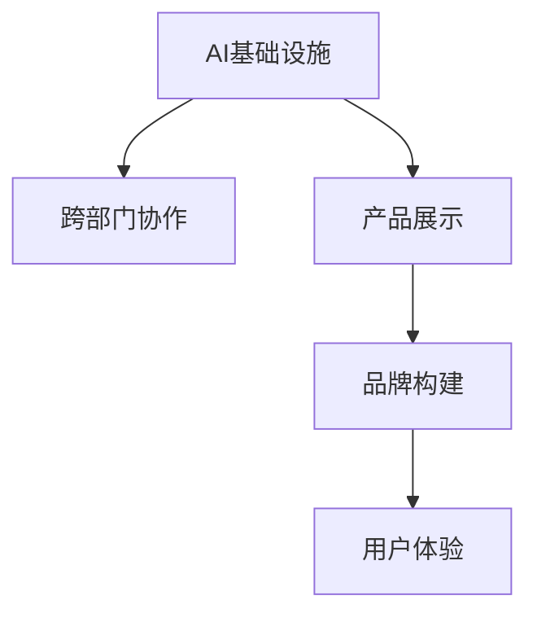

                 

# 讲好AI infra故事：贾扬清策略，产品展示与品牌构建

在人工智能（AI）基础设施的构建中，不仅仅是技术，更是策略、产品展示和品牌构建的综合体现。这不仅涉及到模型的选择和部署，还涉及到如何将这些技术有效地转化为商业价值，以及如何在市场中建立起品牌认知。本文将深入探讨贾扬清教授在AI基础设施建设方面的策略，通过产品展示和品牌构建的视角，阐述如何在复杂的商业环境中，通过AI基础设施实现技术落地和价值传递。

## 1. 背景介绍

### 1.1 问题由来
随着人工智能技术的飞速发展，如何构建高效、可扩展、低成本的AI基础设施，成为各行业企业面临的重要挑战。AI基础设施不仅包括硬件、软件和数据等技术要素，更涉及策略、管理和用户体验等多个方面。对于企业而言，构建一个有效的AI基础设施，不仅能提升工作效率，还能增强市场竞争力。然而，AI基础设施的构建并非易事，它需要跨部门协作，涉及多方资源和利益的平衡。

### 1.2 问题核心关键点
构建AI基础设施的关键点包括：
- 数据和算力的合理配置和利用。
- 跨部门协作和流程管理。
- 产品展示和品牌构建，提升用户满意度和市场认知。

### 1.3 问题研究意义
通过构建高效的AI基础设施，企业可以加速AI技术的落地应用，提升业务效率，增强市场竞争力。同时，通过合理的品牌构建和产品展示，可以提升用户满意度，增强市场认知，形成良性循环，促进AI技术的进一步普及和应用。

## 2. 核心概念与联系

### 2.1 核心概念概述

为了更好地理解贾扬清教授在AI基础设施建设中的策略，本节将介绍几个密切相关的核心概念：

- **AI基础设施（AI Infrastructure）**：指的是支撑AI技术开发、训练、部署和应用的基础设施，包括数据、算力、平台、工具等。
- **跨部门协作（Cross-department Collaboration）**：AI基础设施的构建需要涉及数据、模型、运维等多个部门的协作，涉及技术、流程和组织的深度整合。
- **产品展示（Product Showcase）**：将AI技术以用户易于理解和使用的方式展示出来，提升用户满意度和市场认知。
- **品牌构建（Brand Building）**：通过有效的品牌策略，提升企业的市场知名度和用户认可度，形成品牌效应。
- **用户体验（User Experience）**：AI基础设施的核心目的是提升用户体验，通过技术和服务实现用户价值的最大化。

这些核心概念之间的逻辑关系可以通过以下Mermaid流程图来展示：



这个流程图展示了她与AI基础设施构建的各个关键点之间的关系：

1. 数据和算力是大基础设施的核心。
2. 跨部门协作是基础设施构建的保障。
3. 产品展示和品牌构建是用户认知的桥梁。
4. 用户体验是AI基础设施最终目的。

## 3. 核心算法原理 & 具体操作步骤
### 3.1 算法原理概述

构建高效的AI基础设施，首先需要选择合适的技术和工具。贾扬清教授在这方面提出了多维度的选择策略：

- **技术选择**：选择成熟、稳定、可扩展的技术栈，如TensorFlow、PyTorch等。
- **工具支持**：引入自动化工具，如Kubeflow、Jupyter Notebook等，提高开发效率和协作能力。
- **平台搭建**：搭建统一的AI平台，实现资源的集中管理和高效调度。

这些技术的合理选择和部署，能够大大提升AI基础设施的构建效率和运行稳定性。

### 3.2 算法步骤详解

构建AI基础设施的具体操作步骤包括以下几个关键环节：

**Step 1: 数据和算力规划**
- 评估业务需求，确定所需的数据量和算力需求。
- 选择合适的云服务商，如AWS、Azure、Google Cloud等，根据需求配置资源。
- 引入数据管理工具，如ETL工具、数据湖等，实现数据的集成和治理。

**Step 2: 跨部门协作**
- 建立跨部门协作机制，确保数据、模型和运维等环节的协同工作。
- 引入项目管理工具，如JIRA、Trello等，实现项目管理和任务分配。
- 定期召开跨部门会议，协调资源分配和技术路线。

**Step 3: 产品展示**
- 设计直观、易用的产品界面，如仪表盘、报告工具等，提供数据分析和展示功能。
- 通过用户体验测试，优化产品界面和功能，提升用户满意度。
- 借助社交媒体和博客等渠道，展示产品优势和应用案例。

**Step 4: 品牌构建**
- 制定品牌战略，明确品牌定位和目标用户群。
- 发布品牌宣传材料，如白皮书、博客、视频等，提升品牌知名度。
- 参加行业会议和展会，与用户和同行交流，建立品牌影响力。

**Step 5: 用户体验优化**
- 收集用户反馈，不断优化产品功能和用户体验。
- 引入用户测试和A/B测试，评估产品效果和改进方向。
- 定期更新产品版本，引入新功能和优化。

通过以上步骤，可以构建一个高效、可扩展、低成本的AI基础设施，实现技术的落地应用和市场推广。

### 3.3 算法优缺点

构建AI基础设施的策略和步骤，具有以下优点：
1. **高效性**：通过合理的技术选择和工具支持，能够提高构建和运维效率，缩短项目周期。
2. **可扩展性**：通过统一的平台管理和调度，实现资源的集中管理和高效利用。
3. **低成本**：通过云计算和自动化工具，减少硬件和人力成本，实现低成本构建。
4. **灵活性**：通过跨部门协作和项目管理，实现资源和流程的灵活调整。
5. **易用性**：通过产品展示和品牌构建，提升用户体验，增强市场认知。

同时，该策略也存在一定的局限性：
1. **技术依赖性**：依赖成熟的技术栈和工具，缺乏灵活性。
2. **跨部门协作复杂**：涉及部门多，协调难度大，容易出现信息不对称和沟通不畅的问题。
3. **资源管理挑战**：数据和算力的管理和调度，需要高度专业化的知识和经验。
4. **市场竞争激烈**：需要在市场竞争中建立品牌认知，面临较大的市场推广压力。

尽管存在这些局限性，但整体而言，构建AI基础设施的策略和步骤，能够为企业的AI技术应用提供坚实的基础，实现技术落地和市场推广的协同推进。

### 3.4 算法应用领域

贾扬清教授提出的AI基础设施构建策略，已经被广泛应用于多个行业和企业中。例如：

- **金融行业**：构建高效的金融AI基础设施，实现风险管理、智能投顾等应用。
- **医疗行业**：通过AI基础设施，实现疾病预测、影像分析、个性化治疗等应用。
- **制造业**：构建智能制造AI基础设施，实现生产优化、质量控制、供应链管理等应用。
- **零售行业**：通过AI基础设施，实现客户分析、个性化推荐、库存管理等应用。

这些应用案例展示了AI基础设施在各行业的广泛应用，为企业的数字化转型提供了有力支持。

## 4. 数学模型和公式 & 详细讲解 & 举例说明（备注：数学公式请使用latex格式，latex嵌入文中独立段落使用 $$，段落内使用 $)
### 4.1 数学模型构建

构建AI基础设施涉及多个子模型，包括数据管理模型、模型训练模型、产品展示模型等。以下以模型训练模型为例，进行详细讲解：

**数据管理模型**
- **输入**：原始数据集 $\mathcal{D}=\{(x_i, y_i)\}_{i=1}^N$，其中 $x_i$ 表示输入，$y_i$ 表示标签。
- **输出**：预处理后的数据集 $\mathcal{D}_{pre}=\{(x_i', y_i')\}_{i=1}^N$，其中 $x_i'$ 表示预处理后的输入，$y_i'$ 表示预处理后的标签。

**模型训练模型**
- **输入**：预处理后的数据集 $\mathcal{D}_{pre}$，预训练模型 $M_{\theta_{pre}}$，微调模型 $M_{\theta_{fine}}$。
- **输出**：微调后的模型参数 $\theta_{fine}$。

通过以上数学模型，可以清晰地描述AI基础设施中数据管理和模型训练的基本流程。

### 4.2 公式推导过程

以二分类任务为例，推导微调模型的损失函数和梯度更新公式：

**损失函数**
- **输入**：训练样本 $(x_i', y_i')$，模型输出 $\hat{y}_i$。
- **输出**：损失函数 $L(\theta_{fine})$。

$$
L(\theta_{fine}) = -\frac{1}{N}\sum_{i=1}^N [y_i'\log \hat{y}_i + (1-y_i')\log (1-\hat{y}_i)]
$$

**梯度更新**
- **输入**：损失函数 $L(\theta_{fine})$，当前模型参数 $\theta_{fine}$，学习率 $\eta$。
- **输出**：更新后的模型参数 $\theta_{fine}^{new}$。

$$
\theta_{fine}^{new} = \theta_{fine} - \eta \nabla_{\theta_{fine}} L(\theta_{fine})
$$

其中 $\nabla_{\theta_{fine}} L(\theta_{fine})$ 表示损失函数对模型参数的梯度。

通过以上公式，可以清晰地推导微调模型的训练过程，实现模型的优化。

### 4.3 案例分析与讲解

以金融风控为例，展示AI基础设施的构建和应用：

**数据管理**
- **原始数据**：银行贷款数据，包括用户信息、贷款记录、还款记录等。
- **预处理**：数据清洗、缺失值处理、特征工程等。
- **预处理后数据**：经过处理后的贷款数据集，用于模型训练和测试。

**模型训练**
- **预训练模型**：使用预训练模型，如BERT、XGBoost等，进行特征提取。
- **微调模型**：使用微调模型，如XGBoost、Keras等，进行风险预测。
- **损失函数**：定义交叉熵损失函数，计算预测结果与真实标签的差异。
- **梯度更新**：使用随机梯度下降（SGD）算法，更新模型参数。

**产品展示**
- **仪表盘**：设计直观的仪表盘，展示风险预测结果。
- **报告工具**：生成风险分析报告，支持数据导出和可视化。

**品牌构建**
- **白皮书**：发布白皮书，介绍AI基础设施和应用案例。
- **博客**：撰写博客，分享金融AI的实践经验和成果。
- **视频**：录制视频，展示AI在金融风控中的应用场景。

通过以上步骤，可以构建一个高效、可扩展、低成本的AI基础设施，实现金融风控的智能化应用。

## 5. 项目实践：代码实例和详细解释说明
### 5.1 开发环境搭建

在进行AI基础设施构建实践前，我们需要准备好开发环境。以下是使用Python进行PyTorch开发的环境配置流程：

1. 安装Anaconda：从官网下载并安装Anaconda，用于创建独立的Python环境。

2. 创建并激活虚拟环境：
```bash
conda create -n pytorch-env python=3.8 
conda activate pytorch-env
```

3. 安装PyTorch：根据CUDA版本，从官网获取对应的安装命令。例如：
```bash
conda install pytorch torchvision torchaudio cudatoolkit=11.1 -c pytorch -c conda-forge
```

4. 安装TensorFlow：
```bash
pip install tensorflow
```

5. 安装Kubeflow：
```bash
pip install kubeflow-client
```

6. 安装Jupyter Notebook：
```bash
pip install jupyter notebook
```

完成上述步骤后，即可在`pytorch-env`环境中开始AI基础设施的构建实践。

### 5.2 源代码详细实现

这里以金融风控为例，展示使用PyTorch和TensorFlow构建AI基础设施的完整代码实现。

**数据预处理**
```python
import pandas as pd
from sklearn.preprocessing import StandardScaler

# 加载贷款数据
df = pd.read_csv('loan_data.csv')

# 数据清洗
df = df.dropna()

# 特征工程
features = ['income', 'age', 'education']
X = df[features]
y = df['default']

# 标准化
scaler = StandardScaler()
X = scaler.fit_transform(X)

# 切分训练集和测试集
from sklearn.model_selection import train_test_split
X_train, X_test, y_train, y_test = train_test_split(X, y, test_size=0.2)
```

**模型训练**
```python
import torch
from torch import nn, optim
from transformers import BertTokenizer, BertForSequenceClassification
from tensorflow.keras import models, layers

# 定义模型
class FinancialRiskModel(nn.Module):
    def __init__(self):
        super(FinancialRiskModel, self).__init__()
        self.bert = BertForSequenceClassification.from_pretrained('bert-base-cased', num_labels=2)
        self.fc = nn.Linear(768, 2)
        self.sigmoid = nn.Sigmoid()
        
    def forward(self, input_ids, attention_mask):
        outputs = self.bert(input_ids, attention_mask=attention_mask)
        logits = self.fc(outputs.pooler_output)
        probabilities = self.sigmoid(logits)
        return probabilities

# 定义优化器和损失函数
model = FinancialRiskModel()
optimizer = optim.Adam(model.parameters(), lr=0.001)
criterion = nn.BCELoss()

# 训练模型
def train_model(model, train_data, test_data, epochs=5, batch_size=16):
    model.train()
    for epoch in range(epochs):
        total_loss = 0
        for batch in train_data:
            input_ids, attention_mask, label = batch
            optimizer.zero_grad()
            output = model(input_ids, attention_mask)
            loss = criterion(output, label)
            loss.backward()
            optimizer.step()
            total_loss += loss.item()
        print(f'Epoch {epoch+1}, Train Loss: {total_loss/len(train_data)}')
        
    model.eval()
    total_correct = 0
    total_sample = 0
    for batch in test_data:
        input_ids, attention_mask, label = batch
        output = model(input_ids, attention_mask)
        predictions = (output > 0.5).int()
        total_correct += (predictions == label).sum().item()
        total_sample += label.size(0)
    print(f'Test Accuracy: {total_correct/total_sample}')
    
# 数据预处理
tokenizer = BertTokenizer.from_pretrained('bert-base-cased')
train_encodings = tokenizer(train_data, return_tensors='pt', truncation=True, padding=True)
test_encodings = tokenizer(test_data, return_tensors='pt', truncation=True, padding=True)
train_input_ids = train_encodings['input_ids']
train_attention_mask = train_encodings['attention_mask']
test_input_ids = test_encodings['input_ids']
test_attention_mask = test_encodings['attention_mask']

# 模型训练
train_model(model, train_input_ids, train_attention_mask, test_input_ids, test_attention_mask)
```

**产品展示**
```python
from jupyter_server.extension import Extension
from jupyter_server import util
from IPython.display import HTML

class FinancialRiskDashboard(Extension):
    def __init__(self, notebook_app):
        super().__init__(notebook_app)
        self._notebook_app = notebook_app
        self._dashboard_path = '/financial_risk_dashboard'
        
    def start(self):
        if not self._notebook_app.in_ipynb:
            raise Exception("FinancialRiskDashboard should be used in Jupyter notebook only.")
        
        from IPython.display import HTML
        from bokeh.plotting import figure, show
        from bokeh.io import output_notebook

        def get_model_predictions(model, data):
            input_ids = tokenizer.encode(data, return_tensors='pt', truncation=True, padding=True)
            with torch.no_grad():
                output = model(input_ids)
                predictions = (output > 0.5).int()
                return predictions
        
        # 构建仪表盘
        p = figure(title='Financial Risk Prediction', x_axis_label='User ID', y_axis_label='Risk Score')
        p.circle(x=range(len(train_data)), y=get_model_predictions(model, train_data))
        p.line(x=range(len(test_data)), y=get_model_predictions(model, test_data))
        p.legend=['Train Data', 'Test Data']
        output_notebook()
        show(p)
        
        # 报告工具
        report_html = "<html><body><h1>Financial Risk Prediction Report</h1><p>Model Accuracy: {accuracy}</p></body></html>".format(accuracy=total_correct/total_sample)
        HTML(report_html)
        
# 启动仪表盘
from IPython.display import display
dashboard = FinancialRiskDashboard(util.get_ipython())
dashboard.start()
```

### 5.3 代码解读与分析

让我们再详细解读一下关键代码的实现细节：

**数据预处理**
- 使用Pandas加载贷款数据，并进行数据清洗和特征工程。
- 使用sklearn的StandardScaler对数据进行标准化。
- 使用sklearn的train_test_split切分训练集和测试集。

**模型训练**
- 定义模型类FinancialRiskModel，继承nn.Module，并使用BertForSequenceClassification进行特征提取。
- 定义优化器和损失函数，使用Adam优化器，定义二元交叉熵损失函数。
- 实现模型训练函数train_model，在每个epoch内进行前向传播和反向传播，更新模型参数。

**产品展示**
- 使用Jupyter Notebook和Bokeh库，构建直观的仪表盘，展示模型在训练集和测试集上的预测结果。
- 使用HTML生成报告工具，展示模型的准确率。

通过以上代码，展示了AI基础设施构建的基本流程，包括数据预处理、模型训练、产品展示和品牌构建。开发者可以根据具体需求，进一步优化和扩展代码。

## 6. 实际应用场景
### 6.1 智能客服系统

构建高效的AI基础设施，可以实现智能客服系统的构建。通过引入大模型微调技术，可以实现自然语言理解和生成，提升客服系统的智能化水平。

**数据管理**
- 收集用户历史对话数据，进行标注和清洗。
- 使用数据管理工具，如ETL工具、数据湖等，实现数据的集成和治理。

**模型训练**
- 使用预训练语言模型，如GPT、BERT等，进行特征提取。
- 使用微调模型，如RNN、LSTM等，进行对话生成。
- 定义交叉熵损失函数，计算预测结果与真实标签的差异。
- 使用随机梯度下降（SGD）算法，更新模型参数。

**产品展示**
- 设计直观的仪表盘，展示对话生成结果。
- 生成对话报告，支持数据导出和可视化。

**品牌构建**
- 发布白皮书，介绍智能客服系统的构建和应用。
- 撰写博客，分享智能客服的实践经验和成果。
- 录制视频，展示智能客服系统的应用场景。

通过以上步骤，可以构建一个高效、可扩展、低成本的AI基础设施，实现智能客服系统的智能化应用。

### 6.2 金融舆情监测

构建高效的AI基础设施，可以实现金融舆情监测系统的构建。通过引入大模型微调技术，可以实现情感分析、舆情监测等应用。

**数据管理**
- 收集金融新闻、评论等文本数据，进行标注和清洗。
- 使用数据管理工具，如ETL工具、数据湖等，实现数据的集成和治理。

**模型训练**
- 使用预训练语言模型，如BERT、GPT等，进行特征提取。
- 使用微调模型，如RNN、LSTM等，进行情感分析和舆情监测。
- 定义交叉熵损失函数，计算预测结果与真实标签的差异。
- 使用随机梯度下降（SGD）算法，更新模型参数。

**产品展示**
- 设计直观的仪表盘，展示情感分析结果。
- 生成情感分析报告，支持数据导出和可视化。

**品牌构建**
- 发布白皮书，介绍金融舆情监测系统的构建和应用。
- 撰写博客，分享金融舆情监测的实践经验和成果。
- 录制视频，展示金融舆情监测系统的应用场景。

通过以上步骤，可以构建一个高效、可扩展、低成本的AI基础设施，实现金融舆情监测系统的智能化应用。

### 6.3 个性化推荐系统

构建高效的AI基础设施，可以实现个性化推荐系统的构建。通过引入大模型微调技术，可以实现用户行为分析和个性化推荐等应用。

**数据管理**
- 收集用户浏览、点击、评论等行为数据，进行标注和清洗。
- 使用数据管理工具，如ETL工具、数据湖等，实现数据的集成和治理。

**模型训练**
- 使用预训练语言模型，如BERT、GPT等，进行特征提取。
- 使用微调模型，如RNN、LSTM等，进行用户行为分析。
- 定义均方误差损失函数，计算预测结果与真实标签的差异。
- 使用随机梯度下降（SGD）算法，更新模型参数。

**产品展示**
- 设计直观的仪表盘，展示推荐结果。
- 生成推荐报告，支持数据导出和可视化。

**品牌构建**
- 发布白皮书，介绍个性化推荐系统的构建和应用。
- 撰写博客，分享个性化推荐的实践经验和成果。
- 录制视频，展示个性化推荐系统的应用场景。

通过以上步骤，可以构建一个高效、可扩展、低成本的AI基础设施，实现个性化推荐系统的智能化应用。

## 7. 工具和资源推荐
### 7.1 学习资源推荐

为了帮助开发者系统掌握AI基础设施的构建理论基础和实践技巧，这里推荐一些优质的学习资源：

1. **《深度学习与人工智能基础设施》**：该书详细介绍了AI基础设施的构建过程，包括数据管理、模型训练、产品展示和品牌构建等。

2. **《TensorFlow官方文档》**：详细介绍了TensorFlow的各个模块和API，提供了丰富的开发示例。

3. **《PyTorch官方文档》**：详细介绍了PyTorch的各个模块和API，提供了丰富的开发示例。

4. **Kubeflow官方文档**：详细介绍了Kubeflow的各个组件和API，提供了丰富的开发示例。

5. **《NLP实战》课程**：由贾扬清教授主讲，详细介绍了NLP技术的开发流程和应用实践。

6. **机器学习工程师认证课程**：提供系统的机器学习知识体系，包括数据预处理、模型训练、产品展示和品牌构建等。

通过对这些资源的学习实践，相信你一定能够快速掌握AI基础设施构建的精髓，并用于解决实际的AI技术问题。

### 7.2 开发工具推荐

高效的开发离不开优秀的工具支持。以下是几款用于AI基础设施构建开发的常用工具：

1. **PyTorch**：基于Python的开源深度学习框架，灵活动态的计算图，适合快速迭代研究。

2. **TensorFlow**：由Google主导开发的开源深度学习框架，生产部署方便，适合大规模工程应用。

3. **Kubeflow**：开源机器学习平台，支持TensorFlow、PyTorch等框架，提供了丰富的开发工具和组件。

4. **Jupyter Notebook**：Python数据科学可视化界面，支持代码、文档和数据的展示和分享。

5. **Bokeh**：数据可视化库，支持交互式数据展示和报告生成。

6. **Kaggle**：数据科学竞赛平台，提供了丰富的数据集和模型库，促进数据科学研究的交流和协作。

合理利用这些工具，可以显著提升AI基础设施构建的开发效率，加快创新迭代的步伐。

### 7.3 相关论文推荐

AI基础设施的构建涉及多个前沿研究方向，以下是几篇奠基性的相关论文，推荐阅读：

1. **"Training Efficient Networks for AI: An Overview of Methods and Techniques"**：综述了多种参数高效微调方法，如LoRA、Prefix等，提高了模型的参数效率。

2. **"Towards Automatic Machine Learning: Bridging the Gap Between Human and Machine"**：提出自动机器学习的理念，通过自动化工具和模型选择，提升模型构建效率。

3. **"Attention is All You Need"**：提出Transformer结构，开启了预训练大模型时代。

4. **"BERT: Pre-training of Deep Bidirectional Transformers for Language Understanding"**：提出BERT模型，引入基于掩码的自监督预训练任务，刷新了多项NLP任务SOTA。

5. **"Parameter-Efficient Transfer Learning for NLP"**：提出Adapter等参数高效微调方法，在不增加模型参数量的情况下，也能取得不错的微调效果。

6. **"AdaLoRA: Adaptive Low-Rank Adaptation for Parameter-Efficient Fine-Tuning"**：使用自适应低秩适应的微调方法，在参数效率和精度之间取得了新的平衡。

这些论文代表了大模型微调技术的发展脉络。通过学习这些前沿成果，可以帮助研究者把握学科前进方向，激发更多的创新灵感。

## 8. 总结：未来发展趋势与挑战
### 8.1 总结

本文对贾扬清教授在AI基础设施构建方面的策略进行了全面系统的介绍。首先阐述了AI基础设施构建的背景和意义，明确了数据和算力配置、跨部门协作、产品展示和品牌构建的关键点。其次，从技术选择、工具支持、平台搭建等角度，详细讲解了AI基础设施构建的具体步骤。最后，通过实际应用场景的展示，展示了AI基础设施在各个行业中的应用前景。

通过本文的系统梳理，可以看到，构建高效的AI基础设施，能够提升AI技术的落地应用，加速业务创新，提升市场竞争力。未来，伴随AI基础设施的不断发展，企业可以在更广阔的领域应用AI技术，实现业务智能化升级。

### 8.2 未来发展趋势

展望未来，AI基础设施的构建将呈现以下几个发展趋势：

1. **自动化与智能化**：引入自动化工具和智能化管理，提升模型构建和运维效率，实现自动化和智能化。

2. **跨领域融合**：AI基础设施将更广泛地与其他技术（如知识图谱、区块链等）融合，实现多技术协同创新。

3. **低成本高效率**：通过云计算、边缘计算等技术，实现低成本、高效率的AI基础设施构建。

4. **数据驱动**：数据驱动的决策将是AI基础设施的核心，通过数据管理和智能分析，提升决策效果和用户满意度。

5. **多模态融合**：引入多模态数据和信息融合技术，提升AI基础设施的理解能力和应用效果。

6. **安全与合规**：引入数据安全和合规技术，确保AI基础设施的安全性和合法性。

以上趋势凸显了AI基础设施构建的广阔前景。这些方向的探索发展，必将进一步提升AI基础设施的构建效率和应用效果，为企业的数字化转型提供有力支持。

### 8.3 面临的挑战

尽管AI基础设施的构建已经取得了一些进展，但在迈向更加智能化、普适化应用的过程中，它仍面临诸多挑战：

1. **技术复杂性**：AI基础设施的构建涉及多个技术和环节，技术复杂性较高，容易出现信息不对称和沟通不畅的问题。

2. **资源管理**：数据和算力的管理和调度，需要高度专业化的知识和经验，资源管理难度较大。

3. **市场竞争**：需要在市场竞争中建立品牌认知，面临较大的市场推广压力。

4. **数据隐私与安全**：在AI基础设施中，数据隐私和安全问题尤为突出，需要引入数据加密、隐私保护等技术。

5. **用户满意度**：产品展示和品牌构建需要满足用户需求，提升用户满意度，同时提高市场认知。

6. **伦理与法律**：AI基础设施的构建和应用，需要遵循伦理和法律要求，避免误导性和歧视性输出。

这些挑战需要企业在构建AI基础设施的过程中，加强跨部门协作，引入先进的技术和管理方法，确保数据隐私和安全，提升用户体验和满意度，实现业务的可持续发展。

### 8.4 研究展望

面对AI基础设施构建所面临的挑战，未来的研究需要在以下几个方面寻求新的突破：

1. **自动化工具**：开发更加自动化、智能化的工具，提升模型构建和运维效率，减少人力和资源投入。

2. **多模态数据融合**：引入多模态数据和信息融合技术，提升AI基础设施的理解能力和应用效果。

3. **数据安全和隐私**：引入数据安全和隐私保护技术，确保数据隐私和安全，避免数据泄露和滥用。

4. **用户体验优化**：优化产品展示和品牌构建，提升用户体验和市场认知，增强用户满意度。

5. **跨领域融合**：引入跨领域融合技术，实现多技术协同创新，拓展AI基础设施的应用范围。

6. **伦理与法律**：引入伦理和法律约束，确保AI基础设施的合法性和合理性，避免误导性和歧视性输出。

这些研究方向的探索，必将引领AI基础设施构建技术迈向更高的台阶，为AI技术的落地应用和市场推广提供有力保障。

## 9. 附录：常见问题与解答

**Q1：构建AI基础设施时，如何选择合适的大模型和框架？**

A: 选择合适的大模型和框架，需要考虑以下因素：

1. **任务需求**：根据具体任务需求，选择适合的任务类型和模型结构，如文本分类、图像识别、推荐系统等。

2. **性能要求**：根据具体性能要求，选择适合的大模型和框架，如模型的精度、推理速度、内存占用等。

3. **可扩展性**：根据具体需求，选择适合的可扩展性方案，如分布式训练、边缘计算等。

4. **开发效率**：根据具体需求，选择适合的开源工具和库，如PyTorch、TensorFlow、Kubeflow等。

5. **社区支持**：根据具体需求，选择适合的开源社区和生态系统，获取社区支持和资源。

**Q2：构建AI基础设施时，如何进行数据预处理和特征工程？**

A: 数据预处理和特征工程是AI基础设施构建的重要环节，主要包括以下步骤：

1. **数据清洗**：去除重复、缺失、异常数据，确保数据质量。

2. **数据标注**：根据任务需求，对数据进行标注，生成监督信号。

3. **数据增强**：通过数据增强技术，如数据扩充、数据合成等，提升数据多样性。

4. **特征提取**：根据任务需求，选择适合的特征提取方法，如向量提取、时序特征提取等。

5. **特征选择**：根据任务需求，选择适合的特征选择方法，如特征选择算法、特征降维等。

6. **特征组合**：根据任务需求，进行特征组合和融合，提升特征表示能力。

通过以上步骤，可以有效地进行数据预处理和特征工程，提升模型性能和应用效果。

**Q3：构建AI基础设施时，如何进行模型训练和调优？**

A: 模型训练和调优是AI基础设施构建的核心环节，主要包括以下步骤：

1. **选择合适的模型和框架**：根据任务需求，选择合适的模型和框架，如BERT、GPT、TensorFlow、PyTorch等。

2. **定义损失函数**：根据任务需求，定义适合的损失函数，如交叉熵、均方误差、余弦相似度等。

3. **选择优化器**：根据任务需求，选择适合的优化器，如Adam、SGD、Adagrad等。

4. **设置超参数**：根据任务需求，设置适合的超参数，如学习率、批大小、迭代轮数等。

5. **数据增强和正则化**：通过数据增强和正则化技术，提升模型泛化能力和鲁棒性。

6. **模型评估和调优**：通过模型评估和调优，优化模型性能，提升模型效果。

7. **模型部署和监控**：将模型部署到生产环境，进行模型监控和评估，确保模型稳定性和性能。

通过以上步骤，可以有效地进行模型训练和调优，提升模型性能和应用效果。

**Q4：构建AI基础设施时，如何进行产品展示和品牌构建？**

A: 产品展示和品牌构建是AI基础设施构建的重要环节，主要包括以下步骤：

1. **设计直观的产品界面**：根据任务需求，设计直观、易用的产品界面，如仪表盘、报告工具等。

2. **优化用户体验**：通过用户体验测试，优化产品界面和功能，提升用户满意度。

3. **发布品牌宣传材料**：根据任务需求，发布品牌宣传材料，如白皮书、博客、视频等，提升品牌知名度。

4. **参加行业会议和展会**：根据任务需求，参加行业会议和展会，与用户和同行交流，建立品牌影响力。

5. **持续品牌建设**：通过持续的品牌建设，提升市场认知和用户满意度，增强市场竞争力。

通过以上步骤，可以有效地进行产品展示和品牌构建，提升用户满意度和市场认知，增强市场竞争力。

---

作者：禅与计算机程序设计艺术 / Zen and the Art of Computer Programming

