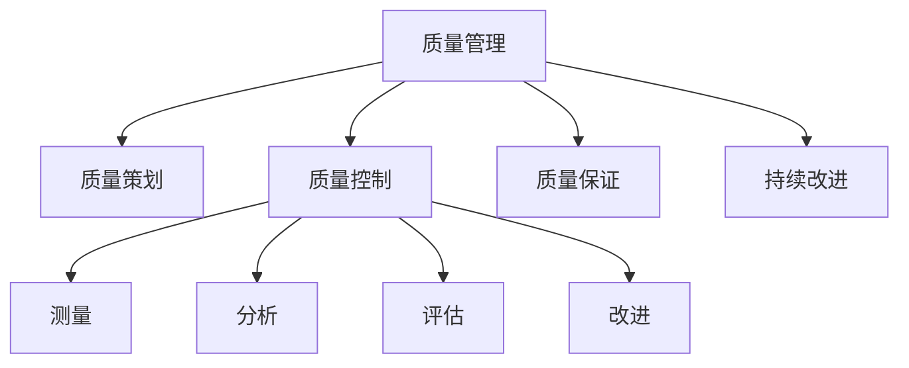

                 

# 质量管理：追求卓越的持续改进之路

> 关键词：质量管理,持续改进,卓越绩效,六西格玛,精益生产,ISO标准,系统思考,质量文化

## 1. 背景介绍

### 1.1 问题由来
质量管理是任何组织管理的核心部分之一，它关系到组织能否持续稳定地提供高质量的产品和服务，满足客户的需求和期望。随着市场竞争的加剧，越来越多的组织开始重视质量管理，以保持竞争优势和可持续发展。质量管理不仅仅局限于制造业，它同样适用于服务业、IT行业、金融业等多个领域。

### 1.2 问题核心关键点
质量管理的关键在于如何通过系统的流程和标准，确保产品或服务的质量达到预期标准。它涉及质量策划、质量控制、质量保证和持续改进等多个环节。质量管理的目标是实现卓越绩效，不断提高组织的核心能力，增强市场竞争力。

### 1.3 问题研究意义
质量管理的研究和实践具有重要的理论和实践意义：
1. **理论意义**：质量管理理论为组织提供了系统的质量管理框架和方法，有助于组织理解和应用质量管理的核心思想。
2. **实践意义**：质量管理方法如六西格玛、精益生产、ISO标准等，已经成为组织提升质量水平、降低成本、提高效率的重要工具。

## 2. 核心概念与联系

### 2.1 核心概念概述

为了更好地理解质量管理，我们需要介绍几个核心概念：

- **质量管理**：指通过确定质量方针、目标和职责，实施质量策划、质量控制、质量保证和持续改进等一系列管理活动，实现组织总体目标的一系列管理职能。
- **质量策划**：制定质量目标和质量计划，确定实现质量目标的过程和方法。
- **质量控制**：通过规定和实施质量管理过程，对质量活动和结果进行测量、分析、评估和改进。
- **质量保证**：通过设定质量标准和检查制度，保证产品和服务的质量达到规定标准。
- **持续改进**：通过不断寻找改进机会，改进组织的质量管理体系，提高组织绩效和客户满意度。

这些概念之间的逻辑关系可以通过以下Mermaid流程图来展示：



这个流程图展示了质量管理的各个环节：

1. 质量管理是所有质量活动的总称。
2. 质量策划和质量控制是质量管理的核心环节。
3. 质量保证是质量控制的延伸，确保质量达到规定标准。
4. 持续改进是质量管理的永恒主题，通过不断改进提升质量水平。

这些概念共同构成了质量管理的基本框架，帮助组织实现卓越绩效。

## 3. 核心算法原理 & 具体操作步骤

### 3.1 算法原理概述

质量管理涉及多个环节，其中持续改进是关键的一环。持续改进通过系统地分析和改进组织的质量管理体系，实现质量的不断提升。持续改进的核心思想是PDCA循环（Plan-Do-Check-Act），即计划-执行-检查-行动，通过不断的循环迭代，实现质量的持续提升。

### 3.2 算法步骤详解

持续改进的PDCA循环可以具体分为以下几个步骤：

1. **计划（Plan）**：确定改进目标、方法和计划，明确改进的方向和资源。
2. **执行（Do）**：实施改进计划，按照计划执行质量管理活动。
3. **检查（Check）**：对执行结果进行测量、分析、评估，确认改进措施的有效性。
4. **行动（Act）**：根据检查结果，对改进措施进行修正、优化和推广，形成新的改进计划。

这个过程是不断循环迭代的，每次循环都会带来一次新的质量提升。

### 3.3 算法优缺点

持续改进的方法具有以下优点：
1. 有助于提高产品质量和客户满意度。
2. 能够发现和纠正潜在的质量问题，防止问题的扩大。
3. 通过不断改进，提高组织的整体绩效和市场竞争力。

同时，持续改进也存在一些缺点：
1. 改进过程可能比较繁琐，需要投入大量资源和时间。
2. 需要全员参与和支持，否则难以实现持续改进的效果。
3. 需要不断的培训和教育，确保全员理解和掌握质量管理方法。

### 3.4 算法应用领域

持续改进的方法适用于各种组织和行业，包括制造业、服务业、IT行业、金融业等。以下是几个具体的应用领域：

- **制造业**：通过持续改进提高生产效率、降低成本、提升产品质量。
- **服务业**：通过持续改进提高客户服务质量，提升客户满意度和忠诚度。
- **IT行业**：通过持续改进提升软件开发质量和系统性能，降低故障率和维护成本。
- **金融行业**：通过持续改进提升风险管理能力，提高金融产品的质量和客户体验。

## 4. 数学模型和公式 & 详细讲解 & 举例说明

### 4.1 数学模型构建

质量管理的核心目标是通过不断改进，实现质量的持续提升。这可以通过数学模型进行量化和分析。常用的质量管理模型包括控制图、过程能力指数、六西格玛等。

控制图是一种用来监测过程稳定性的工具，可以帮助组织及时发现和纠正过程异常。其基本原理是通过绘制Xbar-R图、Xbar-S图等，判断过程是否稳定。

控制图的基本模型为：

$$
Xbar=\frac{1}{n}\sum_{i=1}^n X_i
$$

其中，$X_i$ 表示第 $i$ 个样本值，$n$ 表示样本数量，$Xbar$ 表示样本均值。

### 4.2 公式推导过程

控制图的原理基于中心极限定理和假设检验。中心极限定理表明，无论总体分布如何，随着样本数量的增加，样本均值将逐渐接近总体均值，且样本均值的抽样分布将趋近于正态分布。假设检验则通过统计量和p值来判断过程是否稳定。

控制图的具体推导过程如下：

1. 绘制Xbar-R图：计算样本均值$Xbar$和样本标准偏差R，将样本均值和标准偏差绘制在控制图上，判断过程是否稳定。
2. 绘制Xbar-S图：计算样本均值$Xbar$和样本标准偏差S，将样本均值和标准偏差绘制在控制图上，判断过程是否稳定。

### 4.3 案例分析与讲解

下面以制造行业为例，分析如何应用控制图进行质量管理。

某制造企业生产某种产品，为了确保产品质量，企业决定使用控制图进行质量监控。首先，随机抽取一定数量的样本，计算样本均值和标准偏差，绘制控制图。假设控制图的控制界限为上下3σ，即上下3倍标准偏差。

通过绘制控制图，可以观察到以下情况：

- 如果样本均值始终在控制界限内，说明过程稳定，产品质量良好。
- 如果样本均值超出控制界限，说明过程异常，需要立即查找原因，并采取纠正措施。

## 5. 项目实践：代码实例和详细解释说明

### 5.1 开发环境搭建

为了进行质量管理的实践，我们需要搭建相应的开发环境。以下是Python环境搭建的基本步骤：

1. 安装Anaconda：从官网下载并安装Anaconda，用于创建独立的Python环境。

2. 创建并激活虚拟环境：
```bash
conda create -n quality-management python=3.8 
conda activate quality-management
```

3. 安装相关工具包：
```bash
pip install numpy pandas matplotlib scikit-learn matplotlib
```

4. 准备数据集：下载质量管理相关的数据集，如制造行业的生产数据、服务行业的服务评价数据等。

完成上述步骤后，即可在`quality-management`环境中开始质量管理的实践。

### 5.2 源代码详细实现

以下是一个使用Python绘制控制图的示例代码：

```python
import numpy as np
import matplotlib.pyplot as plt

# 模拟生产数据
np.random.seed(0)
x = np.random.normal(0, 1, 100)
y = np.random.normal(0, 1, 100)

# 计算样本均值和标准偏差
x_mean = np.mean(x)
x_std = np.std(x)
y_mean = np.mean(y)
y_std = np.std(y)

# 绘制控制图
plt.figure(figsize=(8, 6))
plt.plot(x_mean, label='Xbar')
plt.plot(y_mean, label='Xbar')
plt.axhline(y_mean - 3*x_std, color='red', linestyle='--', label='Lower limit')
plt.axhline(y_mean + 3*x_std, color='red', linestyle='--', label='Upper limit')
plt.axhline(y_mean - 3*y_std, color='green', linestyle='--', label='Lower limit')
plt.axhline(y_mean + 3*y_std, color='green', linestyle='--', label='Upper limit')
plt.legend()
plt.title('Control Chart')
plt.xlabel('Sample Number')
plt.ylabel('Sample Mean')
plt.show()
```

### 5.3 代码解读与分析

让我们再详细解读一下关键代码的实现细节：

**控制图代码**：
- 首先，使用numpy生成100个随机样本，模拟生产数据。
- 然后，计算样本均值和标准偏差，并绘制控制图。
- 控制图的横坐标为样本数，纵坐标为样本均值，控制界限为上下3倍标准偏差。

**代码解释**：
- `np.random.normal()`：生成正态分布的随机样本。
- `np.mean()` 和 `np.std()`：计算样本均值和标准偏差。
- `plt.figure()` 和 `plt.plot()`：绘制控制图。
- `plt.axhline()`：绘制控制界限。
- `plt.legend()` 和 `plt.title()`：添加图例和标题。
- `plt.xlabel()` 和 `plt.ylabel()`：设置坐标轴标签。

通过这段代码，可以简单地实现控制图的绘制，帮助组织及时发现和纠正过程异常，确保产品质量。

## 6. 实际应用场景

### 6.1 制造业

制造业是质量管理的重要应用领域之一。在制造业中，控制图、过程能力指数、六西格玛等方法被广泛应用于质量监控和改进。例如，某汽车制造企业通过使用控制图，发现生产过程中某工序的零件尺寸超出控制界限，立即采取措施进行调整，保证了产品质量。

### 6.2 服务业

服务业中的质量管理主要关注客户体验和服务效率。通过使用持续改进方法，如服务标准化、客户反馈分析等，可以提高服务质量，提升客户满意度和忠诚度。例如，某酒店通过持续改进，优化服务流程，减少了客户投诉，提高了客户满意度。

### 6.3 IT行业

IT行业的质量管理主要关注软件开发和系统性能。通过使用持续改进方法，如代码审查、单元测试、敏捷开发等，可以提高软件质量和系统稳定性，降低故障率和维护成本。例如，某软件公司通过持续改进，优化代码质量，提高了软件系统的稳定性和可靠性。

### 6.4 金融行业

金融行业的质量管理主要关注风险管理和客户体验。通过使用持续改进方法，如风险评估、客户满意度调查等，可以提高风险管理能力，提升客户体验。例如，某银行通过持续改进，优化风险管理流程，提高了客户信任度和满意度。

## 7. 工具和资源推荐

### 7.1 学习资源推荐

为了帮助组织系统掌握质量管理的方法，这里推荐一些优质的学习资源：

1. **《质量管理》系列书籍**：由质量管理专家编写，详细介绍了质量管理的理论基础和实践方法，适合各层级的管理者学习和应用。
2. **ISO 9000系列标准**：国际标准化组织制定的质量管理体系标准，提供系统化的质量管理框架和指南。
3. **六西格玛培训课程**：通过系统的培训课程，帮助组织全面理解六西格玛方法，掌握质量管理的关键技能。
4. **精益生产培训课程**：通过系统的培训课程，帮助组织掌握精益生产方法，提升生产效率和产品质量。
5. **质量管理软件**：如Minitab、JMP等软件，提供丰富的质量管理工具和分析方法，支持组织的质量管理工作。

通过对这些资源的学习实践，相信组织一定能够系统掌握质量管理的方法，实现卓越绩效。

### 7.2 开发工具推荐

高效的质量管理离不开优秀的工具支持。以下是几款用于质量管理开发的常用工具：

1. **Minitab**：一款强大的质量管理软件，提供丰富的统计分析工具和控制图绘制功能。
2. **JMP**：一款流行的质量管理软件，支持多种统计分析和质量管理方法。
3. **Excel**：一款通用的电子表格软件，支持控制图绘制和基本的统计分析功能。
4. **R**：一款免费的统计分析软件，提供丰富的统计分析和可视化工具。
5. **Python**：一款流行的编程语言，支持多种质量管理工具和算法，易于定制开发。

合理利用这些工具，可以显著提升质量管理的效率和效果，帮助组织实现卓越绩效。

### 7.3 相关论文推荐

质量管理的研究涉及多个领域，以下是几篇奠基性的相关论文，推荐阅读：

1. **《质量控制图：一种用于控制质量过程的工具》**：探讨了控制图的基本原理和应用方法，是质量管理领域的重要经典。
2. **《六西格玛管理：实现零缺陷的持续改进》**：介绍了六西格玛方法的基本原理和应用案例，是质量管理的重要理论基础。
3. **《精益生产：消除浪费，实现卓越绩效》**：介绍了精益生产方法的基本原理和实践案例，是制造业质量管理的重要理论基础。
4. **《ISO 9000标准：质量管理体系要求》**：介绍了ISO 9000系列标准的基本框架和要求，是质量管理的重要参考。
5. **《持续改进：质量管理的核心》**：探讨了持续改进方法的基本原理和应用方法，是质量管理的重要理论基础。

这些论文代表了大质量管理的研究方向，通过学习这些前沿成果，可以帮助组织把握质量管理的核心思想和实践方法。

## 8. 总结：未来发展趋势与挑战

### 8.1 总结

本文对质量管理的核心概念和方法进行了全面系统的介绍。首先阐述了质量管理的研究背景和意义，明确了持续改进在质量管理中的核心作用。其次，从原理到实践，详细讲解了持续改进的PDCA循环，给出了质量管理任务开发的完整代码实例。同时，本文还广泛探讨了质量管理在制造业、服务业、IT行业、金融业等多个行业领域的应用前景，展示了质量管理范式的巨大潜力。此外，本文精选了质量管理的各类学习资源，力求为组织提供全方位的技术指引。

通过本文的系统梳理，可以看到，质量管理已经成为组织管理的重要组成部分，通过系统的流程和标准，确保产品或服务的质量达到预期标准，实现卓越绩效。未来，伴随质量管理方法的持续演进，相信质量管理必将在更广阔的领域得到应用，为组织和社会的可持续发展提供重要保障。

### 8.2 未来发展趋势

展望未来，质量管理技术将呈现以下几个发展趋势：

1. **质量数据驱动**：随着信息技术的发展，质量管理将更加依赖数据驱动，通过大数据和AI技术，实现质量过程的实时监控和预测。
2. **全面质量管理**：质量管理将从单个过程扩展到整个组织，涵盖设计、制造、服务、运营等多个环节，实现全生命周期的质量管理。
3. **质量文化建设**：质量文化将成为组织的核心竞争力，通过全员参与和持续改进，提升组织的核心能力和市场竞争力。
4. **质量认证和标准化**：质量管理将更加注重认证和标准化，通过ISO、六西格玛等认证体系，提升组织的质量管理水平和市场信任度。
5. **质量管理工具和技术**：质量管理工具和技术将更加先进和高效，如AI驱动的质量管理、质量管理系统、质量管理软件等，提升质量管理的效率和效果。

以上趋势凸显了质量管理的广阔前景。这些方向的探索发展，必将进一步提升组织的质量管理水平，为组织和社会的可持续发展提供重要保障。

### 8.3 面临的挑战

尽管质量管理已经取得了显著的进展，但在迈向更加智能化、普适化应用的过程中，它仍面临着诸多挑战：

1. **数据收集和管理**：质量管理依赖大量的数据，如何有效收集和管理数据，将是质量管理的重要挑战。
2. **技术工具的集成**：质量管理涉及多种技术和工具，如何有效集成这些工具，提升质量管理的效率和效果，将是重要的研究课题。
3. **全员参与和培训**：质量管理需要全员的参与和支持，如何提高全员的质量管理意识和技能，将是重要的挑战。
4. **跨部门协同**：质量管理涉及多个部门和过程，如何实现跨部门的协同和整合，将是重要的研究课题。
5. **持续改进的动态管理**：质量管理需要不断改进，如何动态管理质量改进过程，实现持续改进的效果，将是重要的挑战。

### 8.4 研究展望

面对质量管理面临的这些挑战，未来的研究需要在以下几个方面寻求新的突破：

1. **数据驱动的质量管理**：利用大数据和AI技术，实现质量过程的实时监控和预测，提升质量管理的效率和效果。
2. **全面的质量管理系统**：构建全面的质量管理系统，涵盖设计、制造、服务、运营等多个环节，实现全生命周期的质量管理。
3. **质量文化建设**：通过质量文化建设，提升全员的质量管理意识和技能，实现质量管理的持续改进。
4. **质量认证和标准化**：推动质量认证和标准化，提升组织的质量管理水平和市场信任度。
5. **质量管理工具和技术的集成**：开发更加先进和高效的质量管理工具和技术，提升质量管理的效率和效果。

这些研究方向的探索，必将引领质量管理技术迈向更高的台阶，为组织和社会的可持续发展提供重要保障。面向未来，质量管理技术还需要与其他信息技术进行更深入的融合，共同推动质量管理的进步。

## 9. 附录：常见问题与解答

**Q1：质量管理是否适用于所有组织？**

A: 质量管理适用于各种类型的组织，包括制造业、服务业、IT行业、金融业等。不同类型的组织需要根据自身的特点，选择合适的方法和工具，实现质量管理的目标。

**Q2：质量管理是否需要全员参与？**

A: 是的，质量管理需要全员的参与和支持。只有通过全员的共同努力，才能实现质量管理的持续改进。

**Q3：质量管理是否可以与其他管理系统整合？**

A: 是的，质量管理可以与其他管理系统，如项目管理、人力资源管理等进行整合，实现全员、全过程的管理。

**Q4：质量管理是否可以持续改进？**

A: 是的，质量管理需要不断改进，通过PDCA循环不断优化质量管理体系，实现质量的持续提升。

**Q5：质量管理是否可以与其他技术融合？**

A: 是的，质量管理可以与其他技术，如大数据、AI、物联网等进行融合，实现质量管理的智能化和高效化。

通过这些常见问题的解答，可以看到，质量管理已经成为组织管理的重要组成部分，通过系统的流程和标准，确保产品或服务的质量达到预期标准，实现卓越绩效。未来，伴随质量管理方法的持续演进，相信质量管理必将在更广阔的领域得到应用，为组织和社会的可持续发展提供重要保障。总之，质量管理需要系统的规划和执行，全员的参与和支持，持续的改进和优化，才能实现卓越绩效。

