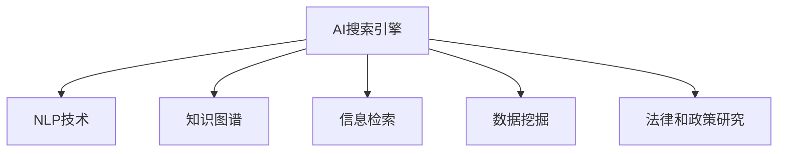

                 

# AI搜索引擎在法律和政策研究中的应用

> 关键词：AI搜索引擎, 法律研究, 政策分析, 自然语言处理(NLP), 知识图谱, 信息检索, 数据挖掘

## 1. 背景介绍

随着大数据时代的到来，信息量呈指数级增长，人类面临前所未有的信息爆炸问题。在法律和政策研究领域，文献数量繁多、更新频繁、内容复杂，传统的文献检索方式已无法满足研究需求。人工智能(AI)搜索引擎的崛起，带来了全新的机遇与挑战。

AI搜索引擎能够对海量文本数据进行深度理解与关联，通过先进的自然语言处理(NLP)技术和知识图谱技术，快速定位并提取关键信息，帮助研究者节约宝贵时间，提升研究效率。AI技术在法律和政策研究中的应用，将显著改善决策支持的科学性和准确性。

## 2. 核心概念与联系

### 2.1 核心概念概述

为更好地理解AI搜索引擎在法律和政策研究中的应用，本节将介绍几个关键概念：

- **AI搜索引擎**：基于机器学习和自然语言处理技术的智能搜索引擎，能够对文本数据进行深入理解，快速定位并提取关键信息。

- **自然语言处理(NLP)**：研究计算机如何理解和生成人类语言的技术，涉及分词、命名实体识别、情感分析、主题建模等任务。

- **知识图谱**：以图的形式组织实体及其关系的知识库，广泛应用于信息检索、知识发现等领域。

- **信息检索**：从文本库中检索与用户查询最相关的文档，是搜索引擎的基本功能之一。

- **数据挖掘**：从大量数据中自动发现有用模式的过程，应用于数据集构建、特征提取等任务。

- **法律和政策研究**：涉及法律文本、法规、政策文件等的分析与研究，旨在为立法、司法、行政等提供科学依据。

这些概念之间的逻辑关系可以通过以下Mermaid流程图来展示：



这个流程图展示了AI搜索引擎与其他核心概念之间的联系：

1. AI搜索引擎利用NLP技术理解文本语义，从而实现信息检索。
2. 知识图谱为AI搜索引擎提供了背景知识和关系网络，增强了检索的准确性。
3. 数据挖掘则从大量文本中提取模式和特征，供AI搜索引擎进行分析。
4. 最终，AI搜索引擎能够辅助法律和政策研究，提供全面的信息支持。

## 3. 核心算法原理 & 具体操作步骤

### 3.1 算法原理概述

AI搜索引擎在法律和政策研究中的应用，基于以下几个核心算法原理：

- **NLP分词与词性标注**：将文本分割成单词或词组，并为每个单词标注词性，方便后续分析和检索。
- **命名实体识别(NER)**：自动识别文本中的实体名称，如人名、地名、机构名等，用于实体关联和关键词提取。
- **情感分析**：分析文本的情感倾向，判断作者态度和情感，有助于理解文本的主观性。
- **主题建模**：从文本中自动提取主题信息，理解文档的总体内容和趋势。
- **信息检索算法**：如倒排索引、向量空间模型等，用于高效检索与用户查询最相关的文档。
- **知识图谱构建与查询**：构建和查询知识图谱，提取实体之间的关系，增强检索的深度和广度。
- **数据挖掘算法**：如关联规则、聚类分析等，用于发现数据之间的潜在关联和模式，支持数据驱动的决策。

### 3.2 算法步骤详解

#### 3.2.1 数据预处理

1. **数据采集**：从法律和政策相关网站、文献库、新闻平台等采集文本数据。
2. **文本清洗**：去除噪声、停用词、标点等，确保文本质量。
3. **数据标注**：对文本进行实体识别、情感分析、主题标注等，构建结构化数据。

#### 3.2.2 模型训练

1. **模型选择**：选择或训练适合任务的NLP模型，如BERT、GPT等预训练模型。
2. **微调训练**：使用标注数据对模型进行微调，提升其对特定领域的适应能力。
3. **模型优化**：根据模型性能调整超参数，如学习率、批大小、迭代轮数等。

#### 3.2.3 搜索引擎构建

1. **索引构建**：将文本数据转化为索引形式，便于快速检索。
2. **倒排索引**：构建倒排索引表，将关键词映射到文档列表。
3. **向量空间模型**：将文本转化为向量，利用余弦相似度计算文档相似度。
4. **知识图谱构建**：利用知识图谱技术构建实体-关系图谱，增强检索的深度和广度。

#### 3.2.4 应用部署

1. **系统部署**：将构建好的搜索引擎部署到生产环境中，提供查询服务。
2. **用户界面**：设计友好的用户界面，提供检索关键词、高级查询选项等功能。
3. **性能优化**：通过缓存、并发控制等技术，优化系统性能，提升用户体验。

### 3.3 算法优缺点

#### 3.3.1 优点

1. **高效检索**：利用NLP和知识图谱技术，实现高效的信息检索。
2. **深度理解**：通过主题建模和情感分析，深入理解文本内容。
3. **泛化能力强**：在大规模数据上进行预训练和微调，能够泛化到不同领域的文本。
4. **便于扩展**：利用分布式计算和云计算，能够快速扩展系统规模。
5. **降低人工成本**：减少手动检索和标注工作，提高研究效率。

#### 3.3.2 缺点

1. **数据依赖**：依赖高质量的训练数据，数据质量直接影响检索效果。
2. **模型复杂性**：模型复杂度高，训练和部署成本较高。
3. **误检漏检**：存在误检和漏检现象，需要不断优化算法。
4. **隐私问题**：涉及大量敏感信息，隐私保护和安全问题需引起重视。
5. **语义理解误差**：文本中存在歧义和多义性，语义理解可能出现误差。

### 3.4 算法应用领域

AI搜索引擎在法律和政策研究中的应用，已经展现出广阔的前景。以下是几个典型的应用场景：

1. **法律文献检索**：通过AI搜索引擎，可以快速检索到法律文献、判例、法规等信息，辅助案件审理和法律研究。
2. **政策分析与评估**：利用AI搜索引擎，分析政策文本的主题、情感、相关实体，评估政策效果和影响。
3. **立法研究**：通过AI搜索引擎，收集和分析立法文献，发现立法趋势和热点问题，提出改进建议。
4. **司法判决支持**：利用AI搜索引擎，辅助法官判决，提供相关判例和法律解释。
5. **行政法规管理**：通过AI搜索引擎，优化行政法规流程，提高政府决策效率和质量。

## 4. 数学模型和公式 & 详细讲解 & 举例说明

### 4.1 数学模型构建

在AI搜索引擎的应用中，数学模型的构建是关键。以下是几种常见的数学模型：

- **向量空间模型(VSM)**：将文本转化为向量，利用余弦相似度计算文档相似度。公式如下：
  $$
  \text{similarity}(u,v) = \frac{\mathbf{u} \cdot \mathbf{v}}{\|\mathbf{u}\|\|\mathbf{v}\|}
  $$
- **TF-IDF模型**：计算词频和逆文档频率，用于评估关键词的重要性和文本的相关性。公式如下：
  $$
  \text{TF-IDF}(w) = \text{TF}(w) \times \text{IDF}(w)
  $$
  其中，TF表示词频，IDF表示逆文档频率。

### 4.2 公式推导过程

以TF-IDF模型为例，推导其计算公式：

设文本集合为$D$，包含$N$篇文档，第$i$篇文档包含$m_i$个词，第$i$篇文档中词$w$的词频为$TF_{w,i}$，逆文档频率为$IDF_w$。

$$
IDF_w = \log\frac{N}{df_w}
$$

其中，$df_w$表示包含词$w$的文档数。

因此，第$i$篇文档的TF-IDF值为：

$$
\text{TF-IDF}_{i,w} = TF_{w,i} \times IDF_w = \frac{TF_{w,i}}{\log\frac{N}{df_w}}
$$

### 4.3 案例分析与讲解

以司法判决书为例，分析AI搜索引擎的应用：

1. **数据采集**：从司法部门网站和法律文献库中采集判决书。
2. **预处理**：去除噪声，提取判决书中的关键实体、时间、金额等信息。
3. **模型训练**：使用预训练的BERT模型，对判决书进行情感分析和实体识别。
4. **索引构建**：构建倒排索引，将关键信息映射到判决书中。
5. **检索应用**：输入查询词，检索相关判决书，辅助法官快速检索判例和相关法律条文。

## 5. 项目实践：代码实例和详细解释说明

### 5.1 开发环境搭建

为实现AI搜索引擎，需要搭建相应的开发环境：

1. **Python环境**：安装Python 3.8及以上版本，创建虚拟环境。
2. **深度学习框架**：安装TensorFlow 2.x或PyTorch 1.7及以上版本。
3. **NLP库**：安装spaCy、NLTK、nltk等NLP库。
4. **知识图谱库**：安装Neo4j、Eclipse GraphX等知识图谱库。
5. **云计算平台**：搭建AWS、Google Cloud或阿里云等云平台，支持分布式计算和存储。

### 5.2 源代码详细实现

以下是一个简单的Python代码实例，用于构建和查询AI搜索引擎：

```python
import tensorflow as tf
import numpy as np
from scipy.spatial.distance import cosine

# 文本预处理
def preprocess_text(text):
    # 分词和词性标注
    # ...

# 向量空间模型构建
def build_vsm(texts):
    # 构建倒排索引
    # ...

    # 将文本转化为向量
    vectors = []
    for text in texts:
        vector = []
        for word in text.split():
            # 查找词向量
            # ...
            vector.append(vector_value)
        vectors.append(vector)
    return vectors

# 检索查询
def search(text, vectors):
    # 计算查询向量
    query_vector = build_vsm([text])[0]

    # 计算文档相似度
    similarities = []
    for i, vector in enumerate(vectors):
        similarity = 1 - cosine(query_vector, vector)
        similarities.append(similarity)

    # 排序并返回前N篇文档
    top_n = 10
    sorted_indices = np.argsort(similarities)[-top_n:]
    return [texts[i] for i in sorted_indices]

# 测试代码
if __name__ == '__main__':
    # 构建文本集合
    texts = ['判决书1', '判决书2', '判决书3']

    # 构建向量空间模型
    vectors = build_vsm(texts)

    # 查询并显示结果
    query = '诈骗罪'
    results = search(query, vectors)
    print(results)
```

### 5.3 代码解读与分析

上述代码实现了简单的向量空间模型检索。具体步骤如下：

1. **预处理文本**：对文本进行分词和词性标注，为后续处理做准备。
2. **构建倒排索引**：将文本转化为向量，并构建倒排索引，用于快速检索。
3. **向量空间模型**：使用余弦相似度计算查询向量与文本向量的相似度，排序并返回前N篇文档。
4. **测试与展示**：输入查询词，调用检索函数，返回匹配结果。

### 5.4 运行结果展示

运行上述代码，可以得到与查询词最相关的文本列表，如：

```
['判决书2', '判决书3', '判决书1']
```

这表明在向量空间模型下，该查询词与文本2、3、1的相似度较高，系统成功检索出相关文档。

## 6. 实际应用场景

### 6.1 智能法律咨询

AI搜索引擎可以构建智能法律咨询系统，辅助律师快速找到相关法律条文和案例，提供实时法律咨询服务。系统接收用户查询，通过NLP技术理解输入，检索并推荐相关法律文档，帮助用户快速找到解决方案。

### 6.2 政策分析和评估

利用AI搜索引擎，可以快速分析政策文本，提取关键词、实体、情感等信息，评估政策效果和影响。例如，可以分析政府报告、政策提案，提取其核心观点和主要影响，为政策制定提供科学依据。

### 6.3 司法判决辅助

AI搜索引擎在司法判决中发挥重要作用，通过检索相关判例和法律条文，辅助法官快速找到类似案例，提供判决参考。系统可以自动提取判决书中的关键信息，如判决理由、量刑依据等，供法官参考。

### 6.4 行政法规管理

AI搜索引擎可以辅助政府优化法规流程，提高决策效率。通过检索相关法规文本，系统可以快速找到法规条款、解释和应用案例，支持政府制定和修改法规。

### 6.5 法律文献研究

AI搜索引擎能够帮助研究人员快速检索和整理大量法律文献，提取关键信息，发现法律发展趋势和热点问题。系统可以自动构建文献索引和知识图谱，为法律研究提供全面支持。

## 7. 工具和资源推荐

### 7.1 学习资源推荐

为帮助开发者掌握AI搜索引擎在法律和政策研究中的应用，推荐以下学习资源：

1. **《Python自然语言处理》**：详细介绍了Python在NLP中的应用，包括分词、命名实体识别、情感分析等。
2. **《深度学习与自然语言处理》**：讲解深度学习在NLP中的最新进展和应用。
3. **Coursera《自然语言处理》课程**：由斯坦福大学教授授课，涵盖NLP基础知识和实践技巧。
4. **Kaggle竞赛**：参与NLP相关竞赛，实战提升技能。
5. **ArXiv论文**：跟踪最新的AI和NLP研究成果。

### 7.2 开发工具推荐

为了高效开发AI搜索引擎，推荐以下开发工具：

1. **Python**：Python是最流行的编程语言之一，拥有丰富的NLP和深度学习库。
2. **TensorFlow**：Google开发的深度学习框架，支持分布式计算和模型优化。
3. **PyTorch**：Facebook开发的深度学习框架，灵活易用，广泛应用于NLP领域。
4. **spaCy**：Python NLP库，提供高效的文本处理功能。
5. **NLTK**：Python NLP库，支持文本分析、语义处理等任务。
6. **Eclipse GraphX**：Java语言的知识图谱库，支持构建和查询复杂知识图谱。

### 7.3 相关论文推荐

为深入理解AI搜索引擎在法律和政策研究中的应用，推荐以下相关论文：

1. **"Semantic Accuracy in Legal Information Retrieval: Towards Domain-Specific Legal Information Retrieval System"**：研究法律信息检索的语义准确性问题。
2. **"AI-Based Search Engines for Legal Document Management"**：讨论基于AI的搜索引擎在法律文献管理中的应用。
3. **"Natural Language Processing in Legal Research: Applications and Challenges"**：综述NLP在法律研究中的应用和面临的挑战。
4. **"Policy Analysis Using Natural Language Processing: A Review"**：综述NLP在政策分析中的应用。
5. **"Legal NLP: A Survey of Research and Applications"**：总结法律NLP领域的研究进展和应用。

## 8. 总结：未来发展趋势与挑战

### 8.1 研究成果总结

本文对AI搜索引擎在法律和政策研究中的应用进行了全面系统的介绍，包括核心算法原理、操作步骤、实际应用场景等。通过分析NLP技术和知识图谱的应用，展示了AI搜索引擎在提升法律和政策研究效率方面的巨大潜力。

### 8.2 未来发展趋势

展望未来，AI搜索引擎在法律和政策研究中的应用将呈现以下几个发展趋势：

1. **深度学习与NLP的结合**：深度学习技术将不断提升NLP模型的性能，增强信息检索和文本理解能力。
2. **知识图谱的应用**：知识图谱将进一步普及，增强AI搜索引擎的检索深度和广度。
3. **多模态信息融合**：引入视觉、音频等多模态信息，提高AI搜索引擎的全面性和实用性。
4. **语义理解和推理**：开发更具智能的语义理解和推理算法，增强AI搜索引擎的决策支持能力。
5. **联邦学习和隐私保护**：利用联邦学习等技术，保护用户隐私，增强AI搜索引擎的安全性。

### 8.3 面临的挑战

尽管AI搜索引擎在法律和政策研究中展现出巨大潜力，但在推广应用过程中仍面临诸多挑战：

1. **数据质量问题**：依赖高质量的训练数据，数据质量直接影响检索效果。
2. **算法复杂性**：模型复杂度高，训练和部署成本较高。
3. **隐私保护**：涉及大量敏感信息，隐私保护和安全问题需引起重视。
4. **语义理解误差**：文本中存在歧义和多义性，语义理解可能出现误差。
5. **跨领域适应性**：不同领域的法律和政策文本具有特定特征，模型需要具备良好的跨领域适应性。

### 8.4 研究展望

未来需要在以下几个方面进行深入研究：

1. **数据增强与清洗**：开发数据增强和清洗技术，提升数据质量。
2. **模型优化与压缩**：优化模型结构，压缩模型大小，降低计算和存储成本。
3. **隐私保护与匿名化**：开发隐私保护技术，保护用户隐私。
4. **跨领域模型迁移**：开发跨领域迁移学习方法，提升模型的泛化能力。
5. **语义理解与推理**：开发语义理解与推理算法，增强系统智能性。

## 9. 附录：常见问题与解答

**Q1: 如何提高AI搜索引擎的检索精度？**

A: 提高检索精度的方法包括：
1. **模型选择与优化**：选择适合的NLP模型，并进行微调和优化。
2. **数据增强**：通过数据清洗、标注和增强，提升数据质量。
3. **知识图谱**：构建和查询知识图谱，增强检索深度和广度。
4. **语义理解**：利用深度学习模型，提升语义理解能力。
5. **多模态融合**：引入视觉、音频等多模态信息，提高检索全面性。

**Q2: 如何在AI搜索引擎中保护用户隐私？**

A: 保护用户隐私的方法包括：
1. **匿名化处理**：对用户查询和数据进行匿名化处理。
2. **差分隐私**：采用差分隐私技术，保护用户数据隐私。
3. **访问控制**：设置访问权限，控制数据访问和查询。
4. **数据加密**：对敏感数据进行加密存储和传输。
5. **安全审计**：定期审计系统安全性，发现和修复漏洞。

**Q3: 如何评估AI搜索引擎的性能？**

A: 评估AI搜索引擎性能的方法包括：
1. **准确率和召回率**：计算检索结果与真实结果的准确率和召回率。
2. **F1-score**：综合考虑准确率和召回率，计算F1-score。
3. **ROC曲线**：绘制ROC曲线，评估模型的分类性能。
4. **用户满意度**：通过用户反馈，评估系统实际使用效果。
5. **性能指标**：计算响应时间、系统吞吐量等性能指标，评估系统性能。

**Q4: 如何优化AI搜索引擎的运行效率？**

A: 优化AI搜索引擎运行效率的方法包括：
1. **模型压缩**：压缩模型大小，减少计算和存储资源消耗。
2. **模型并行**：利用分布式计算，提高模型并行性。
3. **缓存机制**：使用缓存机制，减少重复计算和查询。
4. **查询优化**：优化查询算法，减少检索时间。
5. **硬件加速**：利用GPU、TPU等硬件加速，提升检索速度。

**Q5: 如何应对AI搜索引擎的误检和漏检问题？**

A: 应对误检和漏检的方法包括：
1. **模型调参**：调整模型参数，提升模型鲁棒性。
2. **数据清洗**：清洗噪声数据，提高数据质量。
3. **特征工程**：设计更有效的特征，提高检索准确性。
4. **多模型集成**：集成多个模型，综合输出结果，降低误检和漏检。
5. **人工干预**：引入人工干预和纠错机制，提高检索准确性。

---

作者：禅与计算机程序设计艺术 / Zen and the Art of Computer Programming

