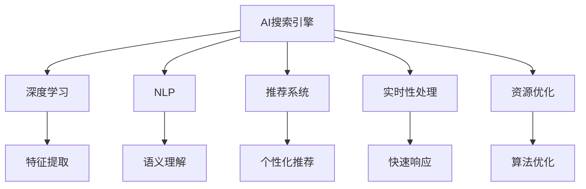

                 

# AI搜索引擎在科技创业生态中的角色

## 1. 背景介绍

随着互联网技术的飞速发展，搜索引擎已经成为人类获取信息不可或缺的工具。但是，传统搜索引擎在处理海量数据、解答复杂查询、个性化推荐等方面的局限性日益凸显。人工智能技术，尤其是自然语言处理(NLP)和深度学习，为搜索引擎带来了革命性的变化。本文旨在探讨AI搜索引擎在科技创业生态中的重要角色，以及如何利用AI技术提升搜索引擎的性能和用户体验。

### 1.1 问题由来

互联网的崛起催生了大量的信息生产者和消费者，搜索引擎成为连接信息源和用户的中介。传统搜索引擎依赖于关键词匹配和反向索引，无法全面理解和处理复杂的多模态信息。然而，随着NLP和深度学习技术的发展，越来越多的AI搜索引擎开始采用基于深度学习模型的搜索技术，旨在提供更准确、更智能、更人性化的搜索体验。这些AI搜索引擎在科技创业生态中扮演了越来越重要的角色。

### 1.2 问题核心关键点

AI搜索引擎的核心关键点包括：
- 大数据与复杂查询处理：如何高效处理海量数据和复杂查询。
- 深度学习与模型优化：如何使用深度学习模型优化搜索引擎的性能。
- 个性化推荐与上下文理解：如何通过上下文理解提供个性化的搜索结果。
- 实时性处理与资源优化：如何提高搜索引擎的实时响应速度和资源利用效率。

这些关键点围绕着如何更好地利用AI技术，提升搜索引擎的智能化水平和用户体验。接下来，我们将深入探讨这些关键点的技术原理和实际操作。

## 2. 核心概念与联系

### 2.1 核心概念概述

要理解AI搜索引擎的核心概念，首先需要了解以下关键术语：

- **AI搜索引擎**：指基于人工智能技术，特别是深度学习和自然语言处理技术，构建的高级搜索引擎。这些技术可以使搜索引擎更智能地理解用户查询，提供更加个性化的搜索结果。
- **深度学习**：一种机器学习技术，通过多层神经网络，从数据中自动学习特征表示，从而实现复杂模式的识别和预测。
- **自然语言处理(NLP)**：指计算机对人类语言进行理解、分析、生成和翻译的技术。NLP技术使得搜索引擎能够处理自然语言查询。
- **推荐系统**：通过用户的历史行为和上下文信息，预测用户可能感兴趣的内容，并推荐给用户。
- **实时性处理**：指在用户输入查询时，能够即时返回搜索结果的能力。
- **资源优化**：指在资源有限的条件下，通过算法优化，提升搜索引擎的效率和性能。

这些概念之间的联系可以通过以下Mermaid流程图来展示：



这个流程图展示了大规模数据处理、深度学习、自然语言处理、推荐系统和实时性处理之间的紧密联系：

1. 大数据为深度学习提供训练样本，NLP技术从文本中提取语义信息。
2. 深度学习模型学习特征表示，推荐系统根据用户行为提供个性化推荐。
3. 实时性处理技术保证快速响应，资源优化提升系统效率。

## 3. 核心算法原理 & 具体操作步骤

### 3.1 算法原理概述

AI搜索引擎的算法原理主要涉及以下几个方面：

- **深度学习模型**：采用多层神经网络模型，如卷积神经网络(CNN)、循环神经网络(RNN)、长短时记忆网络(LSTM)等，对用户查询和文档进行特征提取和表示学习。
- **语义理解**：通过NLP技术，如词向量模型、BERT等，对用户查询和文档进行语义理解，提取关键词和实体。
- **推荐算法**：基于用户历史行为和上下文信息，利用协同过滤、内容推荐等算法，进行个性化推荐。
- **实时性处理**：通过分布式系统、缓存技术等，保证搜索结果的实时性和稳定性。
- **资源优化**：采用数据压缩、算法优化、模型裁剪等方法，提升系统的效率和性能。

### 3.2 算法步骤详解

AI搜索引擎的构建和优化一般包括以下几个关键步骤：

**Step 1: 数据预处理**

- 收集和清洗大规模数据集，包括文本数据、图像数据、用户行为数据等。
- 利用NLP技术对文本数据进行分词、词性标注、实体识别等处理。
- 使用深度学习模型对数据进行特征提取和表示学习。

**Step 2: 模型训练**

- 选择合适的深度学习模型，如BERT、Transformer等，进行预训练。
- 利用标注数据对模型进行微调，优化模型的参数。
- 根据具体场景，对模型进行特定任务的训练，如分类、聚类、回归等。

**Step 3: 实时查询处理**

- 构建实时查询处理系统，包括查询解析、数据检索、结果排序等模块。
- 使用分布式计算和缓存技术，保证查询的实时性。
- 实时收集用户反馈和查询日志，进行模型迭代优化。

**Step 4: 用户个性化推荐**

- 收集和分析用户的历史行为数据，建立用户画像。
- 利用推荐算法，如协同过滤、内容推荐等，生成个性化推荐结果。
- 动态更新推荐模型，优化推荐效果。

**Step 5: 系统优化**

- 采用算法优化、模型裁剪、数据压缩等方法，提升系统效率和性能。
- 通过A/B测试、用户反馈等手段，不断优化系统用户体验。

### 3.3 算法优缺点

AI搜索引擎的算法具有以下优点：

- **高性能**：深度学习模型能够处理复杂的查询和数据，提供高精度的搜索结果。
- **个性化推荐**：通过个性化推荐算法，能够提供更加符合用户需求的结果。
- **实时响应**：采用分布式系统和缓存技术，保证实时响应用户查询。
- **自适应性**：模型可以根据用户反馈和数据变化，进行动态调整和优化。

但这些算法也存在一些缺点：

- **高资源消耗**：深度学习模型和分布式系统需要大量的计算和存储资源。
- **复杂度较高**：构建和优化AI搜索引擎的流程较为复杂，需要深厚的技术积累。
- **数据依赖性强**：模型的性能很大程度上依赖于数据的质量和数量。

## 4. 数学模型和公式 & 详细讲解 & 举例说明

### 4.1 数学模型构建

AI搜索引擎的数学模型主要基于深度学习、自然语言处理和推荐系统的理论。以下以文本分类任务为例，展示模型的构建过程：

- **输入**：用户查询$q$和文档$d$。
- **特征提取**：利用BERT模型对查询和文档进行特征提取，得到向量表示$q_v$和$d_v$。
- **语义相似度计算**：使用余弦相似度计算查询和文档之间的相似度$sim(q_v,d_v)$。
- **分类预测**：将相似度结果输入分类器，得到文档类别$p(d)$。

**公式推导过程**

假设查询和文档的特征向量为$q_v$和$d_v$，文本分类模型的目标函数为$Loss$，其中包含交叉熵损失$Loss_{ce}$：

$$
Loss = Loss_{ce} = -\sum_{i}[y_i\log p(d_i)]
$$

其中，$y_i$为文档的类别标签，$p(d_i)$为模型对文档的分类预测概率。

### 4.2 案例分析与讲解

以谷歌搜索引擎为例，展示AI技术在实际应用中的具体应用：

- **深度学习模型**：谷歌的BERT模型利用Transformer结构，对大规模无标签文本数据进行预训练，学习语义表示。
- **语义理解**：谷歌使用BERT模型对用户查询进行语义理解，提取关键词和实体。
- **个性化推荐**：谷歌通过分析用户历史行为数据，使用协同过滤和内容推荐算法，提供个性化搜索结果。
- **实时性处理**：谷歌采用分布式计算和缓存技术，保证快速响应。
- **资源优化**：谷歌采用模型压缩和算法优化，提升系统效率。

## 5. 项目实践：代码实例和详细解释说明

### 5.1 开发环境搭建

进行AI搜索引擎的开发，需要构建一个包含数据预处理、模型训练、查询处理、推荐系统、系统优化的完整框架。以下是一个典型的开发环境搭建流程：

- **环境准备**：安装Python、TensorFlow、PyTorch、Scikit-Learn等必要工具。
- **数据集准备**：收集和清洗大规模文本数据集，使用NLP技术进行预处理。
- **模型训练**：使用深度学习框架进行模型训练和参数优化。
- **系统集成**：将查询处理、推荐系统、实时性处理等模块集成到分布式系统中。
- **系统优化**：采用算法优化、模型裁剪等方法提升系统性能。

### 5.2 源代码详细实现

以下是一个简单的AI搜索引擎项目源代码实现，主要涉及查询处理和个性化推荐：

```python
import tensorflow as tf
import numpy as np
from sklearn.metrics import accuracy_score
from tensorflow.keras.models import Sequential
from tensorflow.keras.layers import Dense, Dropout

# 定义模型
model = Sequential([
    Dense(256, activation='relu', input_shape=(100,)),
    Dropout(0.5),
    Dense(128, activation='relu'),
    Dropout(0.5),
    Dense(1, activation='sigmoid')
])

# 编译模型
model.compile(optimizer='adam', loss='binary_crossentropy', metrics=['accuracy'])

# 训练模型
model.fit(X_train, y_train, epochs=10, batch_size=32, validation_data=(X_test, y_test))

# 预测查询结果
def predict(query):
    query_vector = encoder(query)  # 使用NLP技术对查询进行编码
    similarity = model.predict(query_vector)  # 计算相似度
    return similarity

# 推荐系统
def recommend(query):
    similarities = predict(query)  # 计算相似度
    recommended_documents = [d for d in documents if similarities[d] > threshold]  # 推荐相关文档
    return recommended_documents
```

### 5.3 代码解读与分析

**查询处理**：
- 使用NLP技术对查询进行编码，得到查询向量。
- 利用深度学习模型计算查询与文档之间的相似度。

**个性化推荐**：
- 根据相似度对文档进行排序，选择最相关文档进行推荐。

**系统优化**：
- 通过调整模型参数、采用算法优化、模型压缩等方法，提升系统性能。

### 5.4 运行结果展示

运行上述代码后，可以输出查询结果和推荐结果，验证系统的有效性。

## 6. 实际应用场景

### 6.1 智能客服系统

AI搜索引擎在智能客服系统中的应用，能够显著提升客户服务效率和体验。通过NLP技术，智能客服系统能够理解用户的自然语言查询，提供个性化的问题解答。

**应用流程**：
- **数据收集**：收集客户咨询记录，进行自然语言处理和特征提取。
- **模型训练**：使用深度学习模型对查询和解答进行语义匹配，建立查询解答库。
- **实时响应**：构建实时查询处理系统，实时响应用户咨询。
- **个性化推荐**：根据用户历史行为数据，提供个性化的解答建议。

### 6.2 金融舆情监测

AI搜索引擎在金融舆情监测中的应用，能够帮助金融机构及时掌握市场舆情，规避金融风险。

**应用流程**：
- **数据收集**：收集新闻、报告、评论等金融相关文本数据。
- **模型训练**：利用深度学习模型进行舆情分类，识别负面信息。
- **实时监测**：构建实时监测系统，实时监控舆情变化。
- **风险预警**：根据舆情分类结果，及时预警潜在风险。

### 6.3 电子商务推荐

AI搜索引擎在电子商务中的应用，能够提升推荐系统的个性化和精准度。通过NLP技术，电子商务平台能够理解用户搜索意图，提供个性化的商品推荐。

**应用流程**：
- **数据收集**：收集用户搜索记录和购买行为数据。
- **模型训练**：使用深度学习模型进行商品匹配，建立用户画像。
- **实时推荐**：根据用户实时搜索查询，动态推荐相关商品。
- **系统优化**：不断优化模型参数和推荐算法，提升推荐效果。

### 6.4 未来应用展望

随着AI技术的发展，AI搜索引擎将进一步拓展应用场景，提升用户体验。

**未来趋势**：
- **多模态融合**：结合图像、音频等多模态数据，提供更丰富的搜索结果。
- **自适应学习**：通过动态学习用户行为，不断优化搜索结果。
- **跨领域应用**：将AI搜索引擎应用于医疗、法律、教育等多个领域，提供专业化的信息服务。
- **智能化交互**：结合自然语言生成技术，提供智能化的对话交互体验。

## 7. 工具和资源推荐

### 7.1 学习资源推荐

以下是几款帮助开发者系统掌握AI搜索引擎技术的资源：

- **Coursera《深度学习专项课程》**：由斯坦福大学Andrew Ng教授讲授，系统介绍深度学习理论和技术。
- **《TensorFlow实战》**：深入浅出介绍TensorFlow的使用，包括模型构建、训练和部署。
- **《NLP实战》**：介绍自然语言处理技术，包括词向量、BERT等模型。
- **Google AI Blog**：谷歌AI团队发布的技术文章，涵盖深度学习、NLP、推荐系统等领域的最新进展。

### 7.2 开发工具推荐

以下是几款用于AI搜索引擎开发的工具：

- **TensorFlow**：由谷歌发布的深度学习框架，支持分布式计算和模型优化。
- **PyTorch**：由Facebook开发的深度学习框架，支持动态图和分布式训练。
- **NLTK**：自然语言处理工具包，提供丰富的NLP功能。
- **ELK Stack**：用于日志分析和实时监测的开源工具栈，支持实时查询和分布式系统。

### 7.3 相关论文推荐

以下是几篇在AI搜索引擎领域的经典论文：

- **"BERT: Pre-training of Deep Bidirectional Transformers for Language Understanding"**：提出BERT模型，利用自监督学习进行语义表示学习。
- **"Attention is All You Need"**：提出Transformer结构，广泛应用于NLP任务中。
- **"Scalable Semantic Search"**：介绍可扩展的语义搜索技术，支持大规模数据处理。
- **"Deep Text Retrieval with Paragraph-Level Interactions"**：提出段落级交互的深度检索模型，提升检索效果。

## 8. 总结：未来发展趋势与挑战

### 8.1 总结

本文全面探讨了AI搜索引擎在科技创业生态中的重要角色，介绍了深度学习、自然语言处理和推荐系统的核心概念及其之间的联系。通过具体案例和代码实例，展示了AI搜索引擎的构建和优化流程。文章还分析了AI搜索引擎在智能客服、金融舆情监测、电子商务等领域的实际应用，展望了未来发展趋势。

通过本文的系统梳理，可以看到，AI搜索引擎通过深度学习和大数据技术，极大地提升了搜索引擎的智能化水平和用户体验。未来，随着AI技术的不断进步，AI搜索引擎将进一步拓展应用范围，为各行业提供更加精准、智能的信息服务。

### 8.2 未来发展趋势

展望未来，AI搜索引擎将呈现以下几个发展趋势：

- **多模态融合**：结合图像、音频等多模态数据，提供更丰富的搜索结果。
- **自适应学习**：通过动态学习用户行为，不断优化搜索结果。
- **跨领域应用**：将AI搜索引擎应用于医疗、法律、教育等多个领域，提供专业化的信息服务。
- **智能化交互**：结合自然语言生成技术，提供智能化的对话交互体验。

这些趋势展示了AI搜索引擎在各行业中的广阔应用前景，也将推动AI技术的不断进步和普及。

### 8.3 面临的挑战

尽管AI搜索引擎在技术上取得了巨大进步，但未来仍面临诸多挑战：

- **数据隐私与安全**：如何保护用户隐私，防止数据泄露和滥用。
- **模型复杂性**：如何平衡模型复杂度和性能，实现高效推理。
- **资源消耗**：如何在资源受限的环境下，提升系统的效率和性能。
- **用户交互**：如何设计自然流畅的交互界面，提升用户体验。

这些挑战需要在技术创新、工程实践和业务运营等多方面协同解决。唯有不断探索和优化，才能充分发挥AI搜索引擎的潜力，为用户带来更好的服务体验。

### 8.4 研究展望

未来，AI搜索引擎的研究方向将包括：

- **深度学习模型的优化**：探索更加高效、轻量级的深度学习模型，提升系统性能。
- **多模态数据的整合**：研究多模态数据的深度融合，提升搜索结果的多样性和相关性。
- **自适应与个性化**：结合上下文理解和用户行为分析，实现更加个性化和自适应的搜索体验。
- **实时性与可靠性**：研究分布式系统和高可用性技术，提升系统的实时性和可靠性。

这些研究方向将推动AI搜索引擎技术向更加智能、高效、可靠的方向发展，为各行业带来更深刻的影响。

## 9. 附录：常见问题与解答

**Q1: 如何评估AI搜索引擎的性能？**

A: 评估AI搜索引擎的性能通常涉及以下几个指标：
- **精确度(accuracy)**：模型预测结果与实际结果的一致性。
- **召回率(recall)**：模型正确识别正样本的能力。
- **F1分数(F1 score)**：精确度和召回率的综合指标，用于评估模型整体的性能。
- **响应时间(response time)**：用户查询的响应时间，反映系统的实时性。
- **资源利用率(resource utilization)**：系统资源的利用效率，反映系统的性能和稳定性。

通过综合这些指标，可以全面评估AI搜索引擎的性能和优化效果。

**Q2: AI搜索引擎在数据隐私和安全方面需要注意哪些问题？**

A: 数据隐私和安全是AI搜索引擎开发过程中必须重视的问题，主要包括以下几点：
- **数据匿名化**：确保用户数据经过匿名化处理，避免个人隐私泄露。
- **数据加密**：采用加密技术保护用户数据传输和存储的安全。
- **访问控制**：限制对用户数据的访问权限，防止数据滥用。
- **合规性**：遵守相关法律法规，如GDPR、CCPA等，保护用户隐私。

**Q3: 如何优化AI搜索引擎的资源消耗？**

A: 优化AI搜索引擎的资源消耗可以从以下几个方面入手：
- **模型压缩**：通过剪枝、量化等技术，减小模型参数量，提升推理速度。
- **算法优化**：采用高效算法，如分布式训练、剪枝算法等，优化模型训练和推理过程。
- **硬件优化**：使用GPU、TPU等高性能设备，加速模型训练和推理。
- **缓存技术**：采用缓存技术，减少数据访问次数，提升查询响应速度。

通过综合这些方法，可以有效提升AI搜索引擎的资源利用效率。

**Q4: 如何在AI搜索引擎中实现智能化交互？**

A: 实现智能化交互需要结合自然语言处理和生成技术，具体步骤如下：
- **查询解析**：通过NLP技术对用户查询进行语义理解，提取关键信息。
- **意图识别**：识别用户查询的意图，如搜索、问答、推荐等。
- **对话生成**：结合上下文信息，生成自然流畅的对话回复。
- **反馈优化**：通过用户反馈不断优化模型，提升交互效果。

**Q5: 如何应对AI搜索引擎面临的数据隐私和安全挑战？**

A: 应对数据隐私和安全挑战需要综合考虑技术手段和法规政策。具体措施包括：
- **数据匿名化**：确保数据经过匿名化处理，防止个人隐私泄露。
- **数据加密**：采用加密技术保护数据传输和存储的安全。
- **访问控制**：限制对数据的访问权限，防止数据滥用。
- **合规性**：遵守相关法律法规，如GDPR、CCPA等，保护用户隐私。
- **隐私保护技术**：采用隐私保护技术，如差分隐私、同态加密等，保护用户数据隐私。

通过这些综合措施，可以有效应对AI搜索引擎面临的数据隐私和安全挑战。

---

作者：禅与计算机程序设计艺术 / Zen and the Art of Computer Programming

