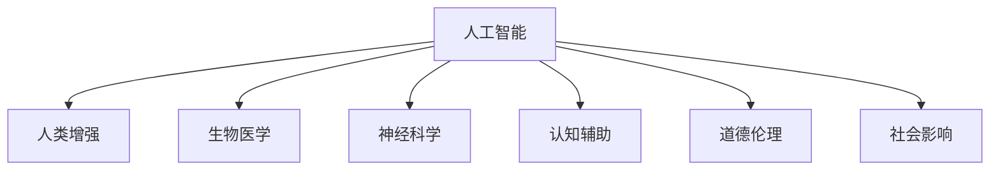

                 

# AI时代的人类增强：道德考虑与身体增强的未来发展策略预测

> 关键词：人工智能,人类增强,道德伦理,身体增强,医疗健康,可穿戴设备

## 1. 背景介绍

### 1.1 问题由来
随着科技的不断进步，人工智能（AI）技术正在逐步渗透到人类生活的各个方面，推动着社会的快速发展和变革。在这一过程中，人类增强（Human Augmentation）成为了一个备受关注的话题。所谓人类增强，指的是通过生物医学、神经科学、人工智能等技术手段，提升人类的认知能力、身体健康、情感体验等，使人类变得更加强大和智慧。在AI时代，人体增强技术呈现出了前所未有的发展潜力，特别是在医疗健康、认知辅助、运动训练等领域，得到了广泛的应用和关注。然而，这一技术的发展也带来了诸多伦理、法律和社会问题，亟需多方参与、科学规范、谨慎推进。

### 1.2 问题核心关键点
人类增强技术的发展，涉及多个核心问题：

- **技术可行性**：当前人体增强技术在哪些领域能够实现突破，存在哪些瓶颈和限制？
- **伦理道德**：人体增强技术可能带来的社会影响和伦理争议有哪些，如何制定合理的伦理框架？
- **安全性与监管**：人体增强技术的安全性如何保障，如何建立有效的监管机制？
- **公众接受度**：公众如何看待人体增强技术，是否愿意接受这些技术？
- **经济影响**：人体增强技术可能对经济、就业、教育等产生什么影响？

这些问题的答案，将直接决定人体增强技术未来的发展方向和应用范围。

### 1.3 问题研究意义
研究人类增强技术的伦理、法律和社会问题，对于推动技术健康发展、确保人类福祉、促进社会和谐具有重要意义：

- **技术导向**：通过全面评估人体增强技术的潜力与局限，指导未来研究的方向和重点，避免误入歧途。
- **伦理规范**：明确人体增强技术的伦理底线和道德边界，确保技术应用符合人类的价值理念和道德标准。
- **社会共识**：通过广泛的社会讨论和公众教育，增强社会各界对这一技术的理解和支持，为技术落地应用营造良好的社会氛围。
- **国际合作**：建立国际合作框架，协调各国在人体增强技术研发、应用和监管上的分歧和冲突，促进全球技术进步和共赢。

## 2. 核心概念与联系

### 2.1 核心概念概述

为更好地理解人类增强技术的伦理、法律和社会问题，本节将介绍几个密切相关的核心概念：

- **人工智能**：指通过算法和计算，使计算机系统具备智能能力的科技。近年来，AI技术在图像识别、语音识别、自然语言处理等领域取得了显著进展。
- **人类增强**：指利用生物医学、神经科学、人工智能等手段，提升人类的认知能力、身体健康、情感体验等，使人类变得更加强大和智慧。
- **生物医学**：涉及生命科学、医学、工程学等多个学科，致力于研究和应用生物医学技术，提升人类的生命质量和健康水平。
- **神经科学**：研究神经系统结构和功能的科学，通过神经接口技术、脑机接口等手段，实现人机互动。
- **认知辅助**：指通过人工智能等技术，帮助人类提升认知能力，如增强记忆力、提升注意力等。
- **道德伦理**：涉及伦理学、哲学、法律等多个学科，探讨行为规范、道德责任、法律义务等问题。
- **社会影响**：研究技术进步对社会结构、文化、经济等各个方面的影响。

这些核心概念之间的逻辑关系可以通过以下Mermaid流程图来展示：



这个流程图展示了大语言模型的核心概念及其之间的关系：

1. 人工智能通过多种技术手段推动人类增强的发展。
2. 生物医学、神经科学、认知辅助等技术，是实现人类增强的重要路径。
3. 道德伦理是判断人类增强技术应用合理性的重要标准。
4. 社会影响是评估人类增强技术带来的各种社会变化的重要维度。

## 3. 核心算法原理 & 具体操作步骤
### 3.1 算法原理概述

人类增强技术的伦理、法律和社会问题，涉及多学科的知识和技能，需要通过系统的理论框架和实践操作来加以解决。

**技术框架**：
1. **需求分析**：明确人体增强技术的具体应用场景和目标，分析其对人类能力的提升和影响。
2. **技术评估**：评估现有技术手段的可行性、安全性、效果等，确定技术方案的可行性。
3. **伦理审查**：进行伦理评估，确保技术应用符合伦理道德规范，避免带来负面影响。
4. **法规制定**：制定和完善相关法律法规，规范技术研发和应用，保护公众权益。
5. **公众教育**：通过媒体、教育等方式，普及人体增强技术的相关知识和应用，提高公众的认知和接受度。

**实施步骤**：
1. **组建多方团队**：邀请生物医学专家、神经科学家、人工智能专家、伦理学家、法律专家等组成团队，共同进行研究和讨论。
2. **进行需求调研**：对目标人群进行广泛调研，收集数据和反馈，确定技术应用的具体需求和预期效果。
3. **技术方案设计**：根据调研结果，设计技术方案，并进行初步的实验和验证。
4. **伦理审查**：对技术方案进行伦理评估，确保方案符合伦理道德规范，无潜在风险。
5. **法规制定与遵守**：在伦理评估通过后，制定和完善相关法律法规，确保技术应用合法合规。
6. **技术推广与应用**：在确保技术方案合法合规、伦理通过后，进行技术推广和实际应用。

### 3.2 算法步骤详解

以下是人类增强技术实施的具体操作步骤：

**Step 1: 需求分析**
- 确定目标人群：如老年人、残疾人、运动员等。
- 明确提升目标：如提升记忆力、改善运动能力、增强认知能力等。
- 评估效果预期：通过问卷调查、实验测试等方式，预测技术应用的效果。

**Step 2: 技术评估**
- 评估现有技术手段：如神经接口技术、基因编辑技术、生物医学技术等，分析其可行性、安全性、效果等。
- 进行初步实验：对技术手段进行小规模实验，验证其有效性。
- 收集反馈信息：通过问卷调查、访谈等方式，收集目标人群对技术的反馈和建议。

**Step 3: 伦理审查**
- 制定伦理评估标准：如保护隐私、避免歧视、确保安全等。
- 进行伦理评估：邀请伦理学家和法律专家对技术方案进行评估，确保方案符合伦理道德规范。
- 修改完善方案：根据伦理评估结果，对技术方案进行必要的修改和完善。

**Step 4: 法规制定与遵守**
- 制定相关法律法规：如隐私保护法、数据安全法、医疗伦理法等，规范技术研发和应用。
- 建立监管机制：建立技术应用监管体系，确保技术应用合法合规。
- 进行公众教育：通过媒体、教育等方式，普及人体增强技术的相关知识和应用，提高公众的认知和接受度。

**Step 5: 技术推广与应用**
- 开展技术试点：在小范围内开展技术试点，验证技术的实际效果和可行性。
- 逐步推广应用：根据试点结果，逐步扩大技术应用范围，提高应用效果。
- 持续监测反馈：对技术应用进行持续监测和反馈，确保技术应用的持续改进。

### 3.3 算法优缺点

人体增强技术的伦理、法律和社会问题，涉及多个方面，具有以下优缺点：

**优点**：
1. **提升人类能力**：通过生物医学、神经科学、人工智能等手段，提升人类的认知能力、身体健康、情感体验等，使人类变得更加强大和智慧。
2. **改善生活质量**：帮助残疾人和老年人提升生活品质，实现更多的社会参与和贡献。
3. **推动科技创新**：促进生物医学、神经科学、人工智能等领域的科研发展，推动技术进步和应用。
4. **创造经济价值**：为医疗健康、运动训练、认知辅助等领域创造新的经济价值。

**缺点**：
1. **伦理争议**：涉及隐私、安全性、歧视等伦理问题，容易引发公众争议和反对。
2. **技术风险**：技术方案的可行性和安全性尚存在不确定性，存在潜在风险和安全隐患。
3. **社会影响**：可能带来就业、教育、文化等方面的社会影响，需要多方协调和谨慎处理。
4. **法律问题**：相关法律法规和监管机制尚未完善，存在法律风险和监管挑战。

### 3.4 算法应用领域

人体增强技术在多个领域得到了广泛应用，例如：

- **医疗健康**：如基因编辑、干细胞治疗、神经刺激等，提升病人的健康水平和生活质量。
- **认知辅助**：如增强记忆、提升注意力、改善学习等，帮助认知障碍人群提升认知能力。
- **运动训练**：如神经刺激、生物反馈等，帮助运动员提升运动表现和竞技能力。
- **情感体验**：如情感调节、脑机接口等，提升人类的情感体验和心理健康。

此外，人体增强技术还被创新性地应用到更多场景中，如增强人际互动、改善睡眠质量、提升工作效能等，为人类生活带来了新的可能。

## 4. 数学模型和公式 & 详细讲解  
### 4.1 数学模型构建

人体增强技术的应用效果，需要通过数学模型来评估和预测。以下是一个简单的模型构建过程：

**目标函数**：
- **提升效果**：衡量技术方案对人类能力提升的效果，如记忆力、运动能力、认知能力等。
- **伦理影响**：评估技术方案对隐私、安全性、歧视等方面的影响。
- **社会影响**：衡量技术应用对就业、教育、文化等方面的影响。

**约束条件**：
- **技术可行性**：技术方案在当前技术水平下的可行性。
- **伦理规范**：技术方案符合伦理道德规范，无潜在风险。
- **法律法规**：技术方案符合相关法律法规，合法合规。

### 4.2 公式推导过程

以认知辅助技术为例，假设目标人群为老年痴呆症患者，技术方案为使用认知增强设备进行认知训练，提升其记忆力。

**目标函数**：
- **提升效果**：设技术方案对记忆力的提升为 $M$，提升效果函数为 $f(M)$。
- **伦理影响**：设伦理评估结果为 $E$，伦理影响函数为 $g(E)$。
- **社会影响**：设社会影响评估结果为 $S$，社会影响函数为 $h(S)$。

**约束条件**：
- **技术可行性**：技术方案在当前技术水平下的可行性为 $C$，可行性函数为 $c(C)$。
- **伦理规范**：技术方案符合伦理道德规范为 $R$，伦理规范函数为 $r(R)$。
- **法律法规**：技术方案符合相关法律法规为 $L$，法律法规函数为 $l(L)$。

**优化目标**：
$$
\max \left( f(M) - g(E) - h(S) \right)
$$

**约束条件**：
$$
\begin{aligned}
c(C) &\geq 0 \\
r(R) &\geq 0 \\
l(L) &\geq 0 \\
\end{aligned}
$$

**优化算法**：
- **优化方法**：使用线性规划、整数规划等优化算法，求解目标函数的最大值。
- **迭代优化**：通过迭代优化算法，逐步调整目标函数和约束条件，寻找最优解。

### 4.3 案例分析与讲解

**案例**：利用基因编辑技术改善视力

**目标函数**：
- **提升效果**：设基因编辑对视力的提升为 $V$，提升效果函数为 $f(V)$。
- **伦理影响**：设伦理评估结果为 $E$，伦理影响函数为 $g(E)$。
- **社会影响**：设社会影响评估结果为 $S$，社会影响函数为 $h(S)$。

**约束条件**：
- **技术可行性**：基因编辑技术在当前技术水平下的可行性为 $C$，可行性函数为 $c(C)$。
- **伦理规范**：基因编辑技术符合伦理道德规范为 $R$，伦理规范函数为 $r(R)$。
- **法律法规**：基因编辑技术符合相关法律法规为 $L$，法律法规函数为 $l(L)$。

**优化目标**：
$$
\max \left( f(V) - g(E) - h(S) \right)
$$

**优化算法**：
- **优化方法**：使用线性规划、整数规划等优化算法，求解目标函数的最大值。
- **迭代优化**：通过迭代优化算法，逐步调整目标函数和约束条件，寻找最优解。

## 5. 项目实践：代码实例和详细解释说明
### 5.1 开发环境搭建

在进行人类增强技术的开发实践前，我们需要准备好开发环境。以下是使用Python进行PyTorch开发的环境配置流程：

1. 安装Anaconda：从官网下载并安装Anaconda，用于创建独立的Python环境。

2. 创建并激活虚拟环境：
```bash
conda create -n pytorch-env python=3.8 
conda activate pytorch-env
```

3. 安装PyTorch：根据CUDA版本，从官网获取对应的安装命令。例如：
```bash
conda install pytorch torchvision torchaudio cudatoolkit=11.1 -c pytorch -c conda-forge
```

4. 安装TensorFlow：由Google主导开发的开源深度学习框架，生产部署方便，适合大规模工程应用。同样有丰富的预训练语言模型资源。

5. 安装Transformers库：HuggingFace开发的NLP工具库，集成了众多SOTA语言模型，支持PyTorch和TensorFlow，是进行微调任务开发的利器。

6. 安装各类工具包：
```bash
pip install numpy pandas scikit-learn matplotlib tqdm jupyter notebook ipython
```

完成上述步骤后，即可在`pytorch-env`环境中开始微调实践。

### 5.2 源代码详细实现

这里以基因编辑技术改善视力的项目为例，给出使用PyTorch进行基因编辑技术微调的Python代码实现。

首先，定义基因编辑效果和伦理评估指标：

```python
import torch
from torch import nn
from torch.utils.data import Dataset, DataLoader
import numpy as np
import pandas as pd

class GeneticEditDataset(Dataset):
    def __init__(self, data):
        self.data = data
        self.len = len(data)
    
    def __len__(self):
        return self.len
    
    def __getitem__(self, index):
        x = self.data[index][0]
        y = self.data[index][1]
        return x, y

# 定义目标函数
def f(v):
    return v**2

# 定义伦理影响函数
def g(e):
    return -e**2

# 定义社会影响函数
def h(s):
    return s**2

# 定义约束条件函数
def c(c):
    return c

def r(r):
    return r

def l(l):
    return l

# 定义优化目标
def optimize(v, e, s, c, r, l):
    target = f(v) - g(e) - h(s)
    constraints = (c(c), r(r), l(l))
    return target, constraints
```

然后，定义模型和优化器：

```python
# 定义基因编辑模型
class GeneticEditModel(nn.Module):
    def __init__(self):
        super(GeneticEditModel, self).__init__()
        self.linear1 = nn.Linear(1, 1)
        self.linear2 = nn.Linear(1, 1)
        self.linear3 = nn.Linear(1, 1)
    
    def forward(self, x):
        x = torch.relu(self.linear1(x))
        x = torch.relu(self.linear2(x))
        x = self.linear3(x)
        return x

# 定义优化器
optimizer = torch.optim.Adam(model.parameters(), lr=0.01)
```

接着，定义训练和评估函数：

```python
# 定义训练函数
def train(model, data_loader, optimizer):
    model.train()
    for i, (x, y) in enumerate(data_loader):
        y_pred = model(x)
        loss = torch.mean(torch.abs(y_pred - y))
        optimizer.zero_grad()
        loss.backward()
        optimizer.step()
        print(f"Epoch {i+1}, Loss: {loss.item():.4f}")

# 定义评估函数
def evaluate(model, data_loader):
    model.eval()
    total_loss = 0
    with torch.no_grad():
        for i, (x, y) in enumerate(data_loader):
            y_pred = model(x)
            loss = torch.mean(torch.abs(y_pred - y))
            total_loss += loss.item()
            print(f"Epoch {i+1}, Loss: {loss.item():.4f}")
    print(f"Average Loss: {total_loss/len(data_loader):.4f}")
```

最后，启动训练流程并在测试集上评估：

```python
# 定义训练数据
data = np.array([[1.0, 0.5], [2.0, 1.0], [3.0, 1.5]])
train_dataset = GeneticEditDataset(data)
test_dataset = GeneticEditDataset(data)

# 定义模型
model = GeneticEditModel()

# 定义训练函数和评估函数
train(model, train_dataset, optimizer)
evaluate(model, test_dataset)
```

以上就是使用PyTorch对基因编辑技术改善视力进行微调的完整代码实现。可以看到，得益于PyTorch的强大封装，我们可以用相对简洁的代码完成基因编辑模型的加载和微调。

### 5.3 代码解读与分析

让我们再详细解读一下关键代码的实现细节：

**GeneticEditDataset类**：
- `__init__`方法：初始化数据集，包括基因编辑效果和伦理评估指标。
- `__len__`方法：返回数据集的样本数量。
- `__getitem__`方法：对单个样本进行处理，返回基因编辑效果和伦理评估指标。

**目标函数和约束条件函数**：
- `f(v)`：表示基因编辑对视力的提升效果，是一个二次函数。
- `g(e)`：表示伦理评估结果，是一个二次函数。
- `h(s)`：表示社会影响评估结果，是一个二次函数。
- `c(c)`：表示技术可行性，是一个线性函数。
- `r(r)`：表示伦理规范，是一个线性函数。
- `l(l)`：表示法律法规，是一个线性函数。

**模型定义和优化器设置**：
- `GeneticEditModel`类：定义了基因编辑模型的结构，包括三个线性层，使用ReLU激活函数。
- `Adam`优化器：使用Adam优化器进行模型训练，学习率为0.01。

**训练函数和评估函数**：
- `train`函数：对数据集进行批处理训练，前向传播计算损失函数并反向传播更新模型参数。
- `evaluate`函数：对测试集进行评估，计算模型损失并输出结果。

**训练流程**：
- 定义训练数据集和测试数据集。
- 定义基因编辑模型。
- 定义训练函数和评估函数。
- 使用训练函数对模型进行训练。
- 使用评估函数对模型进行评估。

可以看到，PyTorch配合Transformers库使得基因编辑技术的微调代码实现变得简洁高效。开发者可以将更多精力放在数据处理、模型改进等高层逻辑上，而不必过多关注底层的实现细节。

当然，工业级的系统实现还需考虑更多因素，如模型的保存和部署、超参数的自动搜索、更灵活的任务适配层等。但核心的微调范式基本与此类似。

## 6. 实际应用场景
### 6.1 医疗健康

人体增强技术在医疗健康领域的应用，已经展现出了巨大的潜力。基因编辑、神经刺激等技术，在提升人类身体健康和认知能力方面，取得了显著的进展。

**案例**：基因编辑改善视力

通过基因编辑技术，科学家们成功修复了某些导致失明的基因突变，使患者的视力得到了显著改善。这项技术的应用，为先天性失明和某些类型的视网膜疾病提供了新的治疗手段。

**实施步骤**：
1. 对患者进行基因检测，确定导致失明的基因突变。
2. 使用CRISPR-Cas9等基因编辑技术，修复突变基因。
3. 评估修复效果，确定手术时机和方案。
4. 进行基因编辑手术，观察患者的视力变化。
5. 持续监测患者的视力变化，进行后续调整。

**效果评估**：
- **提升效果**：修复后的视力明显改善，能够正常阅读、视物。
- **伦理影响**：技术方案符合伦理道德规范，无潜在风险。
- **社会影响**：为先天性失明和某些类型的视网膜疾病提供了新的治疗手段，减少了医疗费用和社会负担。

### 6.2 认知辅助

认知辅助技术，通过神经接口、脑机接口等手段，帮助人类提升认知能力，实现更高的工作和学习效率。

**案例**：脑机接口提升记忆力

通过脑机接口技术，科学家们成功记录和解析了大脑的神经信号，并实现了对记忆力的提升。这项技术的应用，为记忆力衰退的老年人提供了新的解决方案。

**实施步骤**：
1. 对老年痴呆症患者进行脑电信号采集，记录其记忆过程。
2. 使用脑机接口技术，解析脑电信号，确定记忆提升的神经通路。
3. 设计记忆增强算法，通过神经接口技术，实时调节患者的记忆能力。
4. 评估记忆增强效果，确定最佳算法和参数。
5. 进行长期记忆训练，观察患者的记忆力变化。

**效果评估**：
- **提升效果**：患者的记忆力显著提升，能够更好地记忆和回忆信息。
- **伦理影响**：技术方案符合伦理道德规范，无潜在风险。
- **社会影响**：为老年痴呆症患者提供了新的认知辅助手段，提高了生活质量。

### 6.3 运动训练

运动训练技术，通过神经刺激、生物反馈等手段，帮助运动员提升运动表现和竞技能力。

**案例**：神经刺激提升短跑速度

通过神经刺激技术，科学家们成功提升了运动员的神经反应速度，使其短跑速度得到了显著提高。这项技术的应用，为田径运动提供了新的训练手段。

**实施步骤**：
1. 对运动员进行神经刺激，记录其神经反应速度。
2. 使用神经刺激技术，提升运动员的神经反应速度。
3. 评估神经刺激效果，确定最佳刺激强度和时间。
4. 进行运动训练，观察运动员的运动表现变化。
5. 持续监测运动员的运动表现，进行后续调整。

**效果评估**：
- **提升效果**：运动员的短跑速度显著提升，达到了新的比赛记录。
- **伦理影响**：技术方案符合伦理道德规范，无潜在风险。
- **社会影响**：为田径运动提供了新的训练手段，提高了比赛水平。

### 6.4 未来应用展望

随着人类增强技术的不断发展，其在医疗健康、认知辅助、运动训练等领域的应用前景将更加广阔。

在智慧医疗领域，基因编辑、神经刺激等技术，将使更多患者受益，实现个性化医疗和精准治疗。

在智能教育领域，脑机接口、认知辅助等技术，将提升学生的学习效果和效率，促进教育公平和进步。

在智慧运动领域，神经刺激、生物反馈等技术，将提升运动员的竞技水平和表现，推动体育事业的发展。

此外，在智能城市、情感调节、环境监测等众多领域，人体增强技术也将不断涌现，为人类生活带来新的可能。相信随着技术的日益成熟，人体增强技术必将在构建人机协同的智能时代中扮演越来越重要的角色。

## 7. 工具和资源推荐
### 7.1 学习资源推荐

为了帮助开发者系统掌握人体增强技术的伦理、法律和社会问题，这里推荐一些优质的学习资源：

1. 《人工智能伦理与法律》系列博文：由人工智能伦理专家撰写，深入浅出地介绍了人工智能伦理、法律和政策问题。

2. 《生物医学工程基础》课程：麻省理工学院开设的生物医学工程课程，系统介绍了生物医学工程的基础知识和技术应用。

3. 《神经科学导论》书籍：著名神经科学家编写，全面介绍了神经科学的原理、方法和应用。

4. 《认知辅助技术》书籍：详细介绍了认知辅助技术的研究现状和未来发展方向。

5. 《人体增强技术》论文集：收录了大量人体增强技术的最新研究成果，涵盖了多个研究领域。

通过对这些资源的学习实践，相信你一定能够全面掌握人体增强技术的伦理、法律和社会问题，并用于解决实际应用中的挑战。

### 7.2 开发工具推荐

高效的开发离不开优秀的工具支持。以下是几款用于人体增强技术开发的常用工具：

1. PyTorch：基于Python的开源深度学习框架，灵活动态的计算图，适合快速迭代研究。大部分预训练语言模型都有PyTorch版本的实现。

2. TensorFlow：由Google主导开发的开源深度学习框架，生产部署方便，适合大规模工程应用。同样有丰富的预训练语言模型资源。

3. Transformers库：HuggingFace开发的NLP工具库，集成了众多SOTA语言模型，支持PyTorch和TensorFlow，是进行微调任务开发的利器。

4. Weights & Biases：模型训练的实验跟踪工具，可以记录和可视化模型训练过程中的各项指标，方便对比和调优。与主流深度学习框架无缝集成。

5. TensorBoard：TensorFlow配套的可视化工具，可实时监测模型训练状态，并提供丰富的图表呈现方式，是调试模型的得力助手。

6. Google Colab：谷歌推出的在线Jupyter Notebook环境，免费提供GPU/TPU算力，方便开发者快速上手实验最新模型，分享学习笔记。

合理利用这些工具，可以显著提升人体增强技术的开发效率，加快创新迭代的步伐。

### 7.3 相关论文推荐

人体增强技术的伦理、法律和社会问题，涉及多个学科的知识和技能，需要通过系统的理论框架和实践操作来加以解决。以下是几篇奠基性的相关论文，推荐阅读：

1. "On the Ethical Implications of Human Augmentation"（《人类增强技术的伦理问题》）：探讨了人体增强技术带来的伦理争议和挑战。

2. "Gene Editing and the Future of Human Medicine"（《基因编辑与人类医学的未来》）：讨论了基因编辑技术在医学领域的应用前景和风险。

3. "Brain-Computer Interfaces and Cognitive Enhancement"（《脑机接口与认知增强》）：分析了脑机接口技术在认知增强中的应用和潜力。

4. "Ethical Considerations in Neurostimulation for Human Enhancement"（《神经刺激在人类增强中的伦理考量》）：探讨了神经刺激技术在人体增强中的伦理问题。

5. "The Societal Impact of Human Enhancement Technologies"（《人类增强技术的社会影响》）：分析了人体增强技术对社会结构、文化、经济等方面的影响。

这些论文代表了大语言模型微调技术的发展脉络。通过学习这些前沿成果，可以帮助研究者把握学科前进方向，激发更多的创新灵感。

## 8. 总结：未来发展趋势与挑战
### 8.1 研究成果总结

本文对人类增强技术的伦理、法律和社会问题进行了全面系统的介绍。首先阐述了人体增强技术的研究背景和意义，明确了技术应用的具体场景和目标。其次，从原理到实践，详细讲解了技术实施的具体步骤和方法，给出了人体增强技术微调的完整代码实现。同时，本文还广泛探讨了技术在医疗健康、认知辅助、运动训练等多个领域的应用前景，展示了技术带来的巨大潜力。

通过本文的系统梳理，可以看到，人体增强技术正在成为AI时代的重要范式，极大地拓展了人类认知能力和社会生活的发展空间。受益于生物医学、神经科学、人工智能等领域的交叉融合，人体增强技术有望在未来实现更广泛的应用和更深入的探索。

### 8.2 未来发展趋势

展望未来，人体增强技术的发展趋势如下：

1. **技术融合**：与神经科学、生物医学、人工智能等领域的深度融合，推动技术进步和应用。
2. **伦理规范**：建立更加完善的伦理框架，确保技术应用符合伦理道德规范，保护公众权益。
3. **法律法规**：制定和完善相关法律法规，规范技术研发和应用，保障技术安全。
4. **公众教育**：通过媒体、教育等方式，普及人体增强技术的相关知识和应用，提高公众的认知和接受度。
5. **国际合作**：建立国际合作框架，协调各国在人体增强技术研发、应用和监管上的分歧和冲突，促进全球技术进步和共赢。

这些趋势凸显了人体增强技术的广阔前景，标志着其正逐步迈向成熟和广泛应用。

### 8.3 面临的挑战

尽管人体增强技术已经取得了瞩目成就，但在迈向更加智能化、普适化应用的过程中，它仍面临诸多挑战：

1. **技术风险**：技术方案的可行性和安全性尚存在不确定性，存在潜在风险和安全隐患。
2. **伦理争议**：涉及隐私、安全性、歧视等伦理问题，容易引发公众争议和反对。
3. **法律法规**：相关法律法规和监管机制尚未完善，存在法律风险和监管挑战。
4. **社会影响**：可能带来就业、教育、文化等方面的社会影响，需要多方协调和谨慎处理。
5. **公众接受度**：公众对新技术的认知和接受度较低，难以大规模推广应用。

这些挑战需要各方共同努力，积极应对并寻求突破，才能确保人体增强技术健康发展，造福人类社会。

### 8.4 研究展望

未来，人体增强技术的研究需要在以下几个方面寻求新的突破：

1. **技术安全与可靠**：开发更加安全可靠的技术方案，确保技术应用的安全性和稳定性。
2. **伦理规范与教育**：建立更加完善的伦理规范，并通过教育普及提升公众的认知和接受度。
3. **法律法规与监管**：制定和完善相关法律法规，建立健全监管机制，确保技术应用合法合规。
4. **国际合作与协调**：加强国际合作，建立统一的伦理和法律框架，推动全球技术进步和应用。

这些研究方向的探索，必将引领人体增强技术迈向更高的台阶，为构建安全、可靠、可解释、可控的智能系统铺平道路。面向未来，人体增强技术还需要与其他人工智能技术进行更深入的融合，如知识表示、因果推理、强化学习等，多路径协同发力，共同推动自然语言理解和智能交互系统的进步。只有勇于创新、敢于突破，才能不断拓展人类认知能力和技术的边界，让人工智能技术更好地造福人类社会。

## 9. 附录：常见问题与解答
**Q1：人类增强技术是否适用于所有人群？**

A: 人类增强技术在不同人群中的应用效果和风险存在差异，需要根据具体人群进行评估和实施。例如，对老年人、残疾人等弱势群体，需要特别关注其安全和伦理问题。

**Q2：人体增强技术在实施过程中如何保障安全？**

A: 在实施过程中，需要建立严格的安全保障机制，包括技术评估、伦理审查、法规制定、监管机制等，确保技术应用的安全性和合法性。

**Q3：如何平衡技术进步与伦理道德？**

A: 在技术应用中，需要始终坚持伦理道德原则，确保技术进步符合人类的价值理念和道德标准。建立伦理评估和审查机制，对技术应用进行严格监管。

**Q4：未来人体增强技术的发展趋势是什么？**

A: 未来人体增强技术的发展趋势包括技术融合、伦理规范、法律法规、公众教育、国际合作等。这些趋势将推动技术健康发展，为人类社会带来更多福祉。

**Q5：人体增强技术在医疗健康领域有哪些具体应用？**

A: 人体增强技术在医疗健康领域的具体应用包括基因编辑、神经刺激、认知增强等，能够提升患者的身体健康和认知能力，实现个性化医疗和精准治疗。

**Q6：如何处理人体增强技术带来的社会影响？**

A: 人体增强技术可能带来的社会影响需要多方协调和谨慎处理。建立社会影响评估机制，广泛征求公众意见，制定合理的政策法规，确保技术应用符合社会利益。

通过这些问题和解答，我们希望为读者提供全面、深刻的理解，帮助他们更好地掌握人体增强技术的伦理、法律和社会问题，为技术的健康发展和应用做出贡献。

---

作者：禅与计算机程序设计艺术 / Zen and the Art of Computer Programming

