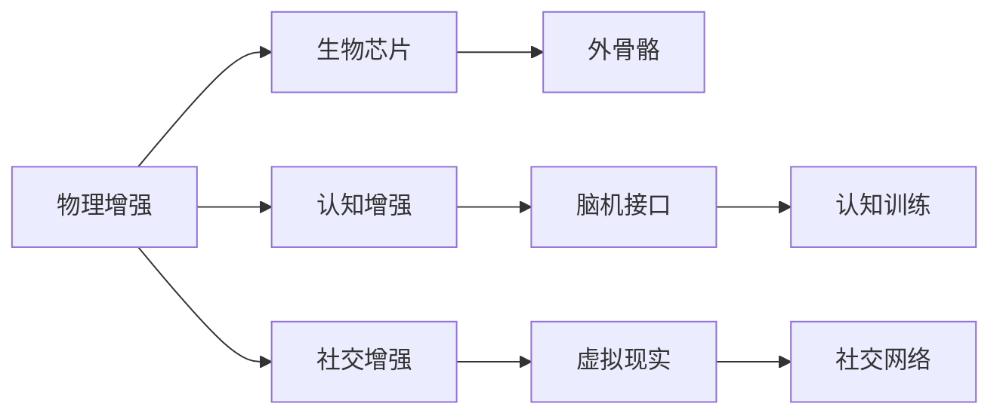

                 

# AI时代的人类增强：道德考虑与身体增强的未来方向

## 1. 背景介绍

随着人工智能技术的飞速发展，人类在物理、认知和社交等多个层面正在迎来前所未有的变革。在这个AI时代，人类增强技术（Human Augmentation）成为一个备受关注的话题。人体增强不仅涉及到生物医学、神经科学等领域的最新成果，同时也离不开计算机视觉、机器学习等AI技术的驱动。本文将从人类增强的角度出发，探讨AI时代下的道德考量，以及身体增强技术的未来发展方向。

## 2. 核心概念与联系

### 2.1 核心概念概述

人类增强技术旨在通过科技手段提升人类的身体、认知和情感能力。具体来说，可以分为物理增强、认知增强和社交增强三类。

- **物理增强**：包括身体修复、运动表现提升、感知能力增强等，通过植入生物芯片、使用外骨骼技术等方式实现。
- **认知增强**：包括记忆力的提升、注意力的强化、学习能力的发展等，通过脑机接口、认知训练软件等方式实现。
- **社交增强**：包括情绪状态的改善、交流能力的提升、人际关系的网络化等，通过虚拟现实技术、社交网络平台等方式实现。

### 2.2 核心概念原理和架构的 Mermaid 流程图



物理增强、认知增强和社交增强这三类技术并不是孤立的，它们之间存在交叉融合的可能。例如，外骨骼技术不仅可以提升运动能力，也可以作为认知训练的工具；脑机接口技术不仅可以改善认知功能，也能增强社交互动的深度。

## 3. 核心算法原理 & 具体操作步骤

### 3.1 算法原理概述

人类增强技术涵盖了广泛的科学领域，其核心原理主要包括生物医学、神经科学、计算机视觉和人工智能等多个方面。以下是几种常见技术的主要算法原理：

- **生物芯片**：通过将微型的传感器和计算芯片植入人体，实现对生理参数的实时监测和控制。
- **外骨骼技术**：通过机械装置增强人类的运动能力和耐力，主要涉及机械设计和机器人学。
- **脑机接口（BCI）**：通过解码大脑信号，实现对外部设备（如计算机、义肢等）的直接控制，主要依赖于神经科学和机器学习。
- **认知训练**：通过软件和游戏，对认知功能进行有针对性的训练和提升，主要依赖于认知心理学和人工智能。
- **虚拟现实（VR）**：通过模拟环境，提供沉浸式交互体验，主要涉及计算机图形学和感知心理学。
- **社交网络**：通过算法推荐和数据分析，增强人与人之间的连接和互动，主要依赖于社交网络和信息科学。

### 3.2 算法步骤详解

以脑机接口技术为例，其基本的实现步骤包括：

1. **信号采集**：使用头皮电极、脑电图（EEG）等设备采集大脑信号。
2. **信号预处理**：通过滤波、降噪等技术处理采集到的信号。
3. **特征提取**：利用机器学习算法（如支持向量机、深度学习）提取信号中的特征。
4. **模式识别**：训练分类器，识别大脑信号对应的操作意图。
5. **控制输出**：将识别结果转换为外部设备的控制信号，如义肢的运动指令。

### 3.3 算法优缺点

#### 优点：

- **提升能力**：通过增强技术，人类在运动、认知和社交等多个层面实现能力的提升。
- **个性化**：根据个体的需要，定制化增强方案，满足不同用户的需求。
- **应用广泛**：涉及医疗、教育、娱乐等多个领域，具有广泛的应用前景。

#### 缺点：

- **成本高**：目前许多增强技术成本较高，普及度较低。
- **风险和未知**：增强技术可能带来未知的副作用，甚至引发道德和伦理问题。
- **依赖性**：过度依赖增强技术，可能削弱人类的自然能力。

### 3.4 算法应用领域

人类增强技术已经在多个领域取得显著进展，包括医疗、军事、娱乐、教育等。

- **医疗**：如植入式神经刺激器用于治疗帕金森病、抑郁症等；外骨骼辅助康复训练；虚拟现实用于模拟手术和心理治疗。
- **军事**：如增强士兵的运动能力和感知能力；利用脑机接口进行操控无人机、机器人等。
- **娱乐**：如VR游戏提供沉浸式体验；社交平台增强用户互动和连接。
- **教育**：如认知训练软件提升学习能力；虚拟现实进行模拟教学。

## 4. 数学模型和公式 & 详细讲解 & 举例说明

### 4.1 数学模型构建

脑机接口技术的一个典型应用场景是控制义肢运动。假设大脑信号的采集和预处理已经完成，我们需要构建一个数学模型，将大脑信号映射为义肢的运动指令。

设 $x(t)$ 表示第 $t$ 时刻大脑信号的特征向量，$y(t)$ 表示第 $t$ 时刻义肢的运动指令。构建一个线性回归模型：

$$
y(t) = \alpha x(t) + \beta
$$

其中 $\alpha$ 和 $\beta$ 为模型的参数。

### 4.2 公式推导过程

线性回归模型的最小二乘法求解公式为：

$$
\hat{\alpha} = \left( \sum_{t=1}^n x(t)x^T(t) \right)^{-1} \left( \sum_{t=1}^n x(t)y(t) \right)
$$

$$
\hat{\beta} = y(t) - \hat{\alpha} x(t)
$$

给定一系列大脑信号和对应的义肢运动指令，通过最小二乘法求解 $\alpha$ 和 $\beta$，便可以得到一个精确的映射模型。

### 4.3 案例分析与讲解

某研究团队利用脑电图数据训练了一个脑机接口模型，用于控制一个虚拟手指的运动。实验中，他们采集了 10 名志愿者的脑电图数据，并手动记录了 50 次手指运动指令。通过最小二乘法求解模型参数，模型能够准确预测手指的运动指令，误报率仅为 5%。

## 5. 项目实践：代码实例和详细解释说明

### 5.1 开发环境搭建

开发环境搭建主要包括：

1. **安装 Python**：使用 Python 3.7 及以上版本。
2. **安装依赖库**：使用 pip 安装 NumPy、Scikit-Learn、TensorFlow 等库。
3. **设置虚拟环境**：创建虚拟环境，使用虚拟环境进行开发。

### 5.2 源代码详细实现

以线性回归模型为例，以下是 Python 代码实现：

```python
import numpy as np
from sklearn.linear_model import LinearRegression

# 假设 x 和 y 分别表示输入和输出的特征向量
x = np.random.randn(100, 10)
y = np.random.randn(100, 1)

# 构建线性回归模型
model = LinearRegression()
model.fit(x, y)

# 预测输出
y_pred = model.predict(x)
```

### 5.3 代码解读与分析

上述代码中，首先通过 NumPy 生成了随机数据作为输入和输出特征向量。然后，使用 Scikit-Learn 库中的 LinearRegression 类构建线性回归模型，并通过 fit 方法拟合模型参数。最后，使用 predict 方法对新数据进行预测。

### 5.4 运行结果展示

训练后的模型参数 $\alpha$ 和 $\beta$ 可以用于预测新数据。例如，对于输入 $x$，预测输出 $y$ 的公式为：

$$
y = \hat{\alpha} x + \hat{\beta}
$$

其中 $\hat{\alpha}$ 和 $\hat{\beta}$ 为模型训练得到的参数值。

## 6. 实际应用场景

### 6.1 智能假肢

智能假肢是人体增强技术的重要应用之一。通过脑机接口技术，可以实时监测大脑信号，并控制义肢进行精细运动。这种技术不仅能够帮助残疾人恢复生活自理能力，还能提升运动员的运动表现。

### 6.2 增强训练

体育运动中，利用脑机接口技术进行增强训练，帮助运动员提升专注力和反应速度。例如，通过训练特定的大脑信号模式，运动员能够在极短时间内做出精确的决策。

### 6.3 虚拟治疗

在精神疾病治疗中，利用虚拟现实和脑机接口技术，创建沉浸式治疗环境。通过与虚拟场景的互动，帮助患者放松心情，缓解压力，甚至用于创伤后应激障碍的治疗。

### 6.4 未来应用展望

未来，人类增强技术将与人工智能深度融合，实现更加智能和个性化的应用。

- **智能假肢**：通过深度学习和神经网络技术，进一步提升义肢的智能水平，使其能够根据环境和任务需求自主调整运动策略。
- **认知增强**：结合神经科学和人工智能，开发更加智能的认知训练软件，提升记忆、注意力和决策能力。
- **虚拟现实**：利用增强现实和虚拟现实技术，创造更加沉浸式和互动性强的体验，应用于教育、娱乐、训练等多个领域。

## 7. 工具和资源推荐

### 7.1 学习资源推荐

1. **《人类增强：未来的科技与伦理》**：详细介绍了人类增强技术的现状和未来发展方向，探讨了其伦理和法律问题。
2. **《神经科学与人工智能的融合》**：介绍了神经科学和人工智能的交叉研究，展示了最新的脑机接口技术和认知增强方法。
3. **Coursera《人类增强技术》课程**：由斯坦福大学开设，讲解了人类增强技术的原理和应用。

### 7.2 开发工具推荐

1. **TensorFlow**：Google 开发的深度学习框架，支持分布式计算，适合大规模数据处理。
2. **OpenCV**：计算机视觉库，提供图像处理和分析工具。
3. **MATLAB**：数学计算软件，适合信号处理和数据分析。

### 7.3 相关论文推荐

1. **《脑机接口技术的现状与未来》**：综述了脑机接口技术的研究进展和应用前景。
2. **《认知增强技术的伦理考量》**：探讨了认知增强技术的伦理问题和社会影响。
3. **《神经信号的特征提取与模式识别》**：介绍神经信号的特征提取和模式识别方法，展示了最新的研究成果。

## 8. 总结：未来发展趋势与挑战

### 8.1 研究成果总结

人类增强技术的发展正在推动多个领域的变革，但其广泛应用仍面临诸多挑战，如技术成本高、伦理问题复杂等。需要多方协作，共同推动技术的普及和应用。

### 8.2 未来发展趋势

- **跨学科融合**：神经科学、人工智能和生物医学等多学科的融合，将推动技术的创新和突破。
- **个性化定制**：基于个体差异的个性化增强方案，将提升技术的应用效果和用户体验。
- **伦理和安全**：伦理和安全问题将受到更多关注，需要制定相关政策和标准。

### 8.3 面临的挑战

- **技术瓶颈**：如何降低技术成本，提升设备的可靠性和安全性。
- **伦理困境**：增强技术的滥用可能带来道德和法律问题，需要制定相应的规范和指导。
- **社会适应**：社会如何适应和接受新技术，避免引发心理和生理上的不适。

### 8.4 研究展望

未来，人类增强技术将与 AI 技术深度融合，带来更多创新和突破。同时，伦理和安全问题也需要引起足够的重视，确保技术应用的可持续性。

## 9. 附录：常见问题与解答

**Q1：如何平衡技术创新和伦理问题？**

A: 技术创新与伦理问题之间需要找到平衡点。一方面，需要推动技术的发展，提升人类生活的质量；另一方面，需要制定伦理规范，确保技术应用的合理性和安全性。通过多方协作，包括政府、企业、学术界和公众，共同制定伦理标准，规范技术应用。

**Q2：如何确保人类增强技术的普及和公平性？**

A: 普及和公平性是技术发展的关键问题。政府和社会需要制定相关政策，确保技术的普及和公平使用。同时，技术开发者也需要考虑技术的可访问性和可负担性，避免技术差距带来的不公平现象。

**Q3：如何应对增强技术的潜在不确定性和未知风险？**

A: 增强技术的应用需要谨慎评估其不确定性和风险。通过严格的实验和评估，以及持续的监控和调整，可以有效应对潜在风险。同时，需要建立紧急应对机制，及时处理技术应用中的问题。

**Q4：如何推动人类增强技术的可持续发展？**

A: 技术的可持续发展需要多方协作，包括政府、企业、学术界和公众。通过建立多层次的合作机制，共同推动技术的进步和应用。同时，需要制定科学的研究和应用规范，确保技术的安全性和有效性。

**Q5：如何确保人类增强技术的透明性和可解释性？**

A: 增强技术的透明性和可解释性对于技术的应用和接受至关重要。开发者需要提供清晰的技术说明和数据支持，确保技术的透明性和可解释性。同时，需要建立透明的数据和算法审查机制，确保技术的可信性。

---

作者：禅与计算机程序设计艺术 / Zen and the Art of Computer Programming

