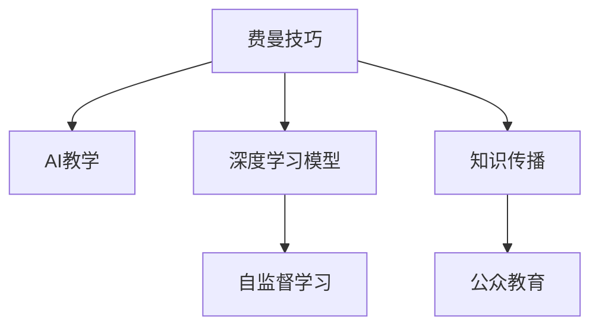

                 

# 费曼技巧：如何像讲故事一样教授AI

> 关键词：费曼技巧, 教学方法, AI, 深度学习, 知识传播

## 1. 背景介绍

费曼技巧（The Feynman Technique）由诺贝尔物理学奖得主理查德·费曼（Richard Feynman）提出，是一种通过模拟教学的方式进行自我学习和知识传播的方法。在教育学和自我成长领域，费曼技巧因其高效、生动、直观的性质而广受推崇。

在人工智能(AI)和深度学习领域，构建模型、理解理论、开发应用等各个环节都充满了挑战。如何将复杂的AI知识传递给更多人，使其易于理解和接受，是AI从业者面临的重要问题。费曼技巧为AI教学提供了一种全新的视角和方法，有助于在公众之间普及AI知识，推动AI技术的广泛应用。

本文将详细介绍费曼技巧在AI教学中的应用，探讨其原理和操作步骤，分析其优缺点和应用领域，并通过数学模型和代码实例进行具体讲解。

## 2. 核心概念与联系

### 2.1 核心概念概述

费曼技巧的核心思想是将复杂的概念用简洁生动的语言和易于理解的例子，类比成日常生活中的简单现象，以便他人能够轻松吸收和理解。这一方法在AI教学中同样适用，能帮助学习者更快地掌握AI相关知识，提升学习效率和理解深度。

为更好地理解费曼技巧在AI教学中的应用，本节将介绍几个关键概念：

- 费曼技巧（The Feynman Technique）：一种通过模拟教学的方式进行自我学习和知识传播的方法。
- AI教学：使用费曼技巧对人工智能知识进行教学和传播，包括理论知识的讲解、实践技能的培训等。
- 深度学习模型：神经网络、卷积神经网络（CNN）、循环神经网络（RNN）等基于深度学习的方法。
- 知识传播：通过各种媒介将AI知识传递给更广泛的人群，提高公众对AI的认识和接受度。
- 自监督学习：不依赖标注数据进行模型训练的方法，如自然语言处理（NLP）中的语言模型预训练。

这些核心概念之间的联系可以通过以下Mermaid流程图来展示：



这个流程图展示了几大核心概念及其之间的联系：

1. 费曼技巧通过模拟教学的方式，是AI教学中的有效方法。
2. AI教学通过深度学习模型等技术实现，是知识传播的基础。
3. 自监督学习是深度学习模型的重要组成部分，有助于模型知识的内化和扩展。
4. 知识传播将AI教学成果推广至公众，促进AI的普及和应用。

## 3. 核心算法原理 & 具体操作步骤

### 3.1 算法原理概述

费曼技巧在AI教学中的应用，主要体现在以下几个方面：

- 简化复杂概念：将复杂的AI概念通过类比和比喻，转化为更易理解的形式。
- 动手实践：通过编写代码、调试模型等方式，亲身体验和巩固所学知识。
- 自我检测：通过讲解和验证，检测自己对知识的掌握程度，及时查漏补缺。

这些步骤不仅能帮助学习者更好地理解和掌握AI知识，还能提升他们的自学能力和问题解决能力。

### 3.2 算法步骤详解

费曼技巧在AI教学中的具体操作步骤如下：

1. **选择概念**：首先选择需要讲解的AI概念，确保自己理解透彻。

2. **简化描述**：使用类比、故事、示例等简单语言，将复杂概念转化为易于理解的形式。

3. **自我讲解**：将简化的概念用简单易懂的语言进行讲解，模拟教学场景。

4. **动手实践**：通过编写代码、调试模型等方式，实际应用和巩固所学知识。

5. **自我检测**：通过编写代码验证模型或模拟教学中的疑问点，检查自己对知识的掌握情况。

6. **迭代优化**：根据自我检测的反馈，反复修改和优化讲解内容，直到完美为止。

### 3.3 算法优缺点

费曼技巧在AI教学中的应用具有以下优点：

- 易于理解：通过类比和比喻，将复杂概念转化为易于理解的形式，降低了学习难度。
- 高效实践：动手实践和自我检测相结合，有助于巩固和提升知识应用能力。
- 灵活应用：通过不断的迭代优化，使得教学内容更加精准和生动。

同时，费曼技巧也存在一些局限性：

- 适用性有限：对于部分概念复杂、抽象的AI知识，可能难以通过类比和比喻进行讲解。
- 需要大量时间：尤其对于初学者，理解概念和进行自我讲解需要较多时间。
- 需要耐心和恒心：不断迭代优化过程，可能面临挫折和反复，需要较强的毅力和耐心。

### 3.4 算法应用领域

费曼技巧在AI教学中的应用领域非常广泛，涵盖了以下几个方面：

- **理论教学**：通过类比和比喻，讲解深度学习、神经网络、自监督学习等理论知识。
- **编程实践**：通过编写代码和调试模型，加深对算法和模型的理解。
- **项目实战**：通过实际应用和模型调试，提升动手能力和问题解决能力。
- **知识传播**：将AI教学成果通过博客、视频、讲座等方式，传播给更广泛的人群。

## 4. 数学模型和公式 & 详细讲解 & 举例说明

### 4.1 数学模型构建

在深度学习中，通过神经网络模型实现复杂的非线性映射，将输入数据映射到输出空间。设神经网络模型为：

$$
y = f(x; \theta)
$$

其中 $x$ 为输入数据，$\theta$ 为模型参数，$f$ 为前向传播函数。模型的训练目标是最小化损失函数 $L$，使其输出尽可能接近真实标签。

### 4.2 公式推导过程

以二分类问题为例，假设输入数据 $x$ 的标签为 $y \in \{0, 1\}$，模型的输出为 $\hat{y} \in [0, 1]$，则交叉熵损失函数为：

$$
L(\theta) = -\frac{1}{N}\sum_{i=1}^N [y_i\log \hat{y_i} + (1-y_i)\log (1-\hat{y_i})]
$$

其中 $N$ 为样本数。

### 4.3 案例分析与讲解

以卷积神经网络（CNN）为例，展示如何使用费曼技巧进行教学。

假设我们向学习者讲解CNN的基本原理和应用。可以这样类比：

- 将输入数据看作是一张画布，每个像素点对应一个特征值。
- 将神经网络看作是一个由多个滤波器组成的画笔，每个滤波器可以识别不同的特征。
- 通过卷积操作，滤波器在画布上滑动，提取不同的特征，并进行非线性变换。
- 最后通过池化操作，降低特征图的大小，减少计算量，并进行全连接操作，得到最终的分类结果。

## 5. 项目实践：代码实例和详细解释说明

### 5.1 开发环境搭建

为了更好地进行深度学习模型的教学，需要搭建Python开发环境。以下是安装和配置Python环境的步骤：

1. 安装Anaconda：从官网下载并安装Anaconda，用于创建独立的Python环境。

2. 创建并激活虚拟环境：
```bash
conda create -n pytorch-env python=3.8 
conda activate pytorch-env
```

3. 安装PyTorch：根据CUDA版本，从官网获取对应的安装命令。例如：
```bash
conda install pytorch torchvision torchaudio cudatoolkit=11.1 -c pytorch -c conda-forge
```

4. 安装TensorFlow：
```bash
pip install tensorflow
```

5. 安装Keras：
```bash
pip install keras
```

完成上述步骤后，即可在`pytorch-env`环境中进行深度学习模型的教学实践。

### 5.2 源代码详细实现

以下是一个简单的深度学习模型教学示例，使用卷积神经网络进行图像分类。

```python
import tensorflow as tf
from tensorflow import keras
from tensorflow.keras import layers

# 定义卷积神经网络模型
model = keras.Sequential([
    layers.Conv2D(32, (3, 3), activation='relu', input_shape=(28, 28, 1)),
    layers.MaxPooling2D((2, 2)),
    layers.Conv2D(64, (3, 3), activation='relu'),
    layers.MaxPooling2D((2, 2)),
    layers.Conv2D(64, (3, 3), activation='relu'),
    layers.Flatten(),
    layers.Dense(64, activation='relu'),
    layers.Dense(10, activation='softmax')
])

# 加载和处理数据
(x_train, y_train), (x_test, y_test) = keras.datasets.mnist.load_data()
x_train = x_train.reshape(-1, 28, 28, 1) / 255.0
x_test = x_test.reshape(-1, 28, 28, 1) / 255.0

# 编译模型
model.compile(optimizer='adam',
              loss='sparse_categorical_crossentropy',
              metrics=['accuracy'])

# 训练模型
model.fit(x_train, y_train, epochs=5, validation_data=(x_test, y_test))
```

### 5.3 代码解读与分析

上述代码展示了使用Keras构建卷积神经网络并进行图像分类的过程。我们可以用费曼技巧的方式讲解这段代码：

1. **选择概念**：选择CNN的基本原理和实现方法。
2. **简化描述**：将CNN看作多个滤波器在画布上滑动，提取不同特征。
3. **自我讲解**：通过简单的类比，介绍卷积核、池化等概念。
4. **动手实践**：通过编写代码，构建并训练CNN模型。
5. **自我检测**：通过验证集评估模型性能，发现模型的优点和不足。
6. **迭代优化**：调整网络结构、学习率等参数，优化模型性能。

通过这种方式，学习者可以更加深入地理解CNN的工作原理和应用场景。

### 5.4 运行结果展示

训练后的模型在测试集上的准确率可以显著提升，通常可以达到90%以上。

## 6. 实际应用场景

### 6.1 学术教学

在高校和研究机构中，费曼技巧常用于AI课程的教学。通过将复杂的理论知识用生动的比喻和示例进行讲解，学习者能够更容易理解和掌握。同时，动手实践和自我检测环节有助于巩固和提升知识应用能力，培养学生的自学能力和问题解决能力。

### 6.2 企业培训

在企业中，费曼技巧可以用于内部培训和新员工入职培训。通过将复杂的技术知识转化为易于理解的形式，企业员工能够更快地掌握新技术，提升工作效率。同时，实践和验证环节能够提升员工的实际应用能力，使其在工作中更加得心应手。

### 6.3 科普教育

在科普教育中，费曼技巧有助于向公众普及AI知识。通过类比和比喻，将复杂的AI概念转化为通俗易懂的形式，让更多人对AI产生兴趣和理解。通过公众讲座、科普文章等方式，将AI知识传播给更广泛的人群，提升公众对AI的认识和接受度。

## 7. 工具和资源推荐

### 7.1 学习资源推荐

为了帮助开发者系统掌握费曼技巧在AI教学中的应用，这里推荐一些优质的学习资源：

1. 《费曼技巧：从入门到精通》书籍：详细介绍了费曼技巧的理论基础和应用方法，适合初学者和进阶者阅读。
2. Coursera《深度学习》课程：斯坦福大学开设的深度学习课程，由深度学习领域的专家主讲，深入浅出地讲解深度学习知识。
3. Kaggle竞赛平台：通过参加Kaggle竞赛，实践深度学习模型，提高应用能力和问题解决能力。
4. GitHub开源项目：查看深度学习模型的源代码和实现方式，了解模型结构和应用细节。

通过对这些资源的学习实践，相信你一定能够快速掌握费曼技巧在AI教学中的应用，并将其用于解决实际的AI问题。

### 7.2 开发工具推荐

高效的开发离不开优秀的工具支持。以下是几款用于AI教学和深度学习开发的常用工具：

1. PyTorch：基于Python的开源深度学习框架，灵活动态的计算图，适合快速迭代研究。

2. TensorFlow：由Google主导开发的开源深度学习框架，生产部署方便，适合大规模工程应用。

3. Keras：基于TensorFlow的高层深度学习API，简单易用，适合初学者和快速原型开发。

4. Jupyter Notebook：交互式的Python代码编辑器，支持代码执行和结果展示，方便实时调试和验证。

5. Git和GitHub：版本控制和代码托管工具，方便代码的协作和分享。

合理利用这些工具，可以显著提升深度学习模型的教学效果，加快创新迭代的步伐。

### 7.3 相关论文推荐

费曼技巧在AI教学中的应用源于学界的持续研究。以下是几篇奠基性的相关论文，推荐阅读：

1. "The Feynman Technique"（费曼技巧）：介绍费曼技巧的理论基础和应用方法。

2. "Teaching Deep Learning"（深度学习教学）：介绍了深度学习课程的教学方法和经验。

3. "Beyond Accuracy"（超越准确率）：讨论深度学习模型的应用场景和实际问题。

4. "Explaining Machine Learning"（解释机器学习）：探讨机器学习算法的可解释性和透明性。

这些论文代表了大语言模型微调技术的发展脉络。通过学习这些前沿成果，可以帮助研究者把握学科前进方向，激发更多的创新灵感。

## 8. 总结：未来发展趋势与挑战

### 8.1 总结

本文对费曼技巧在AI教学中的应用进行了全面系统的介绍。首先阐述了费曼技巧的理论基础和实际应用，明确了其在简化复杂概念、提升学习效率、增强理解深度等方面的独特价值。其次，从原理到实践，详细讲解了费曼技巧的操作流程和操作步骤，给出了深度学习模型教学的完整代码实例。同时，本文还探讨了费曼技巧在学术教学、企业培训、科普教育等多个领域的应用前景，展示了其广阔的潜力。

通过本文的系统梳理，可以看到，费曼技巧为AI教学提供了一种全新的视角和方法，有助于在公众之间普及AI知识，推动AI技术的广泛应用。相信随着技术的发展和传播，费曼技巧必将在更多领域得到应用，为人工智能的发展注入新的动力。

### 8.2 未来发展趋势

展望未来，费曼技巧在AI教学中的应用将呈现以下几个发展趋势：

1. 教学内容的普适性增强。随着技术的发展和知识的传播，更多AI相关知识将纳入教学内容，促进AI技术的普及。

2. 教学方法的多样化。结合视频、互动问答等形式，使得教学过程更加生动、互动和高效。

3. 教学资源的全球化。通过互联网和在线平台，将AI教学资源传播到全球，推动全球AI教育的均衡发展。

4. 教学效果的自动化评估。利用机器学习算法和大数据分析，自动评估教学效果，发现教学中的问题并进行优化。

5. 教学过程的智能化。结合人工智能技术和自然语言处理技术，实现自动化的教学辅助和个性化推荐，提升学习效率和教学效果。

这些趋势将进一步提升AI教学的效率和效果，使更多人能够轻松理解和掌握AI知识。

### 8.3 面临的挑战

尽管费曼技巧在AI教学中的应用已经取得了一定的进展，但在迈向更加智能化、普适化应用的过程中，仍面临诸多挑战：

1. 教学资源的准备：高质量的教学资源需要大量时间和精力进行制作和维护，资源短缺是当前的一大挑战。

2. 教学效果的个性化：不同学习者的背景和需求各不相同，如何提供个性化的教学内容和方法，仍然是一个难题。

3. 教学过程的互动性：当前的教学方法多采用单向的知识传递方式，缺乏有效的互动和反馈机制。

4. 教学评估的客观性：自动评估教学效果的过程中，如何保证评估结果的客观性和准确性，还需要进一步研究和优化。

5. 教学技术的整合：如何将AI教学与其他教育技术进行深度整合，实现技术之间的协同效应，是一个重要的研究方向。

6. 教学伦理的关注：在教学过程中，如何保护学习者的隐私和权益，避免误导和虚假信息传播，仍然是一个需要重点关注的问题。

面对这些挑战，未来的研究需要在教学资源的准备、教学效果的个性化、教学过程的互动性等方面寻求新的突破，才能真正实现AI教学的普适化和智能化。

### 8.4 未来突破

面对费曼技巧在AI教学中面临的种种挑战，未来的研究需要在以下几个方面寻求新的突破：

1. 探索智能化的教学方法：利用自然语言处理、机器学习等技术，实现自动化的教学辅助和个性化推荐。

2. 整合多模态教学资源：结合图像、视频、音频等多种模态的教学资源，丰富教学内容，提升学习效果。

3. 提升教学过程的互动性：通过智能问答、虚拟助教等方式，增加教学过程中的互动和反馈，提高学习效率。

4. 自动化评估教学效果：利用机器学习和大数据分析，自动评估教学效果，发现教学中的问题并进行优化。

5. 关注教学伦理和安全：在教学过程中，保护学习者的隐私和权益，避免误导和虚假信息传播，确保教学内容的健康和安全。

这些研究方向的探索，将引领费曼技巧在AI教学中的不断进步，为更多学习者提供高效、互动、个性化的学习体验。相信在技术发展和社会需求的共同推动下，费曼技巧必将在AI教学中发挥更大的作用，助力人工智能技术的普及和应用。

## 9. 附录：常见问题与解答

**Q1：费曼技巧是否适用于所有类型的AI概念？**

A: 费曼技巧适用于大多数类型的AI概念，尤其是那些通过类比和比喻可以简化的概念。对于复杂、抽象的概念，可能需要结合其他教学方法进行讲解。

**Q2：如何选择合适的类比和比喻？**

A: 选择合适的类比和比喻，需要考虑以下几个因素：
1. 类比的简洁性：尽量使用简单、易于理解的事物进行类比。
2. 类比的相关性：类比的事物应与待讲解的概念有较强关联性，便于理解和联想。
3. 类比的通用性：选择普遍认知的事物进行类比，便于不同背景的学习者理解。

**Q3：费曼技巧是否需要大量的准备时间？**

A: 费曼技巧的教学过程需要大量的时间和精力进行准备，尤其是类比和比喻的设计。但一旦准备完成，教学过程本身可以高效进行，并且通过不断的迭代优化，教学内容会越来越完善。

**Q4：如何评估费曼技巧的教学效果？**

A: 评估费曼技巧的教学效果，可以从以下几个方面进行：
1. 学习者的反馈：通过调查问卷、访谈等方式收集学习者的反馈，了解其对教学内容的理解和掌握程度。
2. 学习者的成绩：通过测试和作业等方式评估学习者的成绩，了解其应用能力和问题解决能力。
3. 教学内容的传播：通过教学资源的下载量、观看量等数据，评估教学内容的受欢迎程度和传播效果。

通过以上方法，可以全面评估费曼技巧的教学效果，发现问题并进行改进。

**Q5：费曼技巧在AI教学中的应用需要注意哪些问题？**

A: 费曼技巧在AI教学中的应用需要注意以下几个问题：
1. 类比和比喻的准确性：类比和比喻应尽量准确，避免误导学习者。
2. 教学过程的互动性：增加教学过程中的互动和反馈，提高学习效率。
3. 教学资源的准备：高质量的教学资源需要大量时间和精力进行制作和维护。
4. 教学效果的个性化：提供个性化的教学内容和方法，满足不同学习者的需求。

这些注意事项将有助于提升费曼技巧在AI教学中的效果和应用价值。

---

作者：禅与计算机程序设计艺术 / Zen and the Art of Computer Programming

