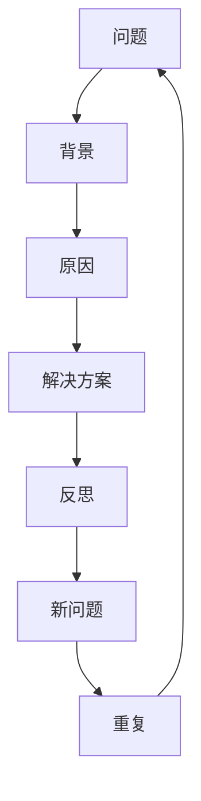

                 

# 费曼提问:唤醒管理者主动思考

---

## 1. 背景介绍

管理者作为组织的中流砥柱，其决策和思考方式直接决定了企业的战略方向和执行效率。然而，在传统的组织架构和管理方式下，管理者往往被琐碎的事务性工作所困，难以从全局视角审视问题，缺乏主动思考的意识和能力。费曼提问法（Feynman Technique）作为一种以传授知识为目标的思考工具，不仅适用于科学研究，也能够广泛应用于管理者主动思考的训练中。本文将详细解析费曼提问法的原理和实践步骤，探讨如何通过费曼提问法唤醒管理者主动思考，提升管理效率。

## 2. 核心概念与联系

### 2.1 核心概念概述

费曼提问法（Feynman Technique）由诺贝尔物理学家理查德·费曼提出，旨在通过将复杂问题简化为易于理解的问题，从而增强思考的深度和广度。其核心在于，通过提问的方式，将知识内化为自身的理解，再以简洁明了的语言传递给他人。费曼提问法对管理者的意义在于，通过有效的提问和回答，促进管理者对问题本质的深入思考，培养其批判性思维和创新性思维。

### 2.2 核心概念原理和架构的 Mermaid 流程图

### 2.3 核心概念联系

费曼提问法与管理者思考之间存在着内在的联系：

- **提问-思考-回答**的循环：通过提问引导思考，通过回答进行反思和总结，不断迭代优化思维模式。
- **深度理解**：将复杂问题拆解为简单问题，使管理者能够深入理解问题的本质，并找到根本性的解决方案。
- **创新思维**：通过提问打破固有思维定势，激发管理者的创新性思维，带来全新的视角和灵感。
- **主动学习**：管理者的主动提问和反思，促进其积极学习和知识积累，提升个人和团队的整体竞争力。

## 3. 核心算法原理 & 具体操作步骤

### 3.1 算法原理概述

费曼提问法基于费曼学习法（Feynman Method），将知识内化与输出的过程转换为主动思考与表达的过程。其核心在于，通过提问和回答的互动，促使管理者深入思考问题，不断优化思维框架。具体来说，费曼提问法的原理可以概括为以下几点：

1. **简化问题**：将复杂问题简化为易于理解的问题，使管理者能够快速抓住问题本质。
2. **深度理解**：通过自问自答的方式，深入理解问题的背景和原因，找出解决方案。
3. **表达能力**：以简洁明了的语言表达思考结果，促进知识传递和分享。
4. **持续迭代**：通过不断提问和反思，优化思维模式，提高问题解决能力。

### 3.2 算法步骤详解

费曼提问法具体执行步骤如下：

1. **选定问题**：选择当前管理中需要解决的复杂问题。
2. **简化问题**：将问题简化为易于理解的形式，找出问题的关键要素。
3. **自我提问**：针对简化后的问题进行自我提问，找出问题的背景和原因。
4. **自我回答**：以简洁明了的语言回答自我提问，梳理解决问题的思路。
5. **迭代优化**：将自我回答中的思考过程和解决方案传递给团队成员，接收反馈，优化思维框架。
6. **持续迭代**：不断重复以上步骤，直到找到最优解决方案。

### 3.3 算法优缺点

费曼提问法的优点包括：

- **提高思考深度**：通过深度提问和自我反思，帮助管理者深入理解问题本质。
- **促进知识传递**：通过简洁明了的表达，促进知识在团队中的传递和分享。
- **培养创新思维**：打破固有思维定势，激发管理者的创新性思维。

费曼提问法的缺点包括：

- **时间成本高**：实施费曼提问法需要花费大量时间和精力，特别是在复杂问题上。
- **执行难度大**：对管理者的思维能力和表达能力要求较高，不适用于所有管理者。
- **缺乏即时反馈**：管理者需要在迭代过程中不断调整思维框架，可能缺乏即时反馈。

### 3.4 算法应用领域

费曼提问法适用于所有需要深入思考和解决问题的情况，特别是在以下领域：

- **战略规划**：通过费曼提问法，帮助管理者深入分析市场环境、竞争态势，制定有效的战略规划。
- **项目管理**：在项目管理和执行过程中，通过费曼提问法，优化项目目标、资源配置和风险管理。
- **团队协作**：通过费曼提问法，促进团队成员之间的知识共享和协作，提升团队整体能力。
- **创新管理**：帮助管理者打破传统思维模式，激发创新灵感，推动技术和管理创新。

## 4. 数学模型和公式 & 详细讲解 & 举例说明

### 4.1 数学模型构建

费曼提问法没有严格的数学模型，其核心在于通过提问和回答的互动，促进思考和知识传递。不过，为了更好地理解和应用费曼提问法，可以将问题的解决过程建模如下：

- **问题简化**：$P_{simplified} = P_{complex} \rightarrow P_{simple}$
- **深度理解**：$U_{deep} = P_{simple} \times Q_{self}$
- **表达能力**：$E_{express} = U_{deep} \times A_{simple}$
- **持续迭代**：$I_{iterate} = (E_{express}, F_{feedback})$

### 4.2 公式推导过程

以一个简单的项目管理问题为例，推导费曼提问法的应用过程：

1. **问题简化**：假设项目管理的复杂问题为 $P_{complex}$，简化为 $P_{simple}$，例如：“项目预算超支”。
2. **深度理解**：通过自问自答，找出问题的背景和原因。例如：“为什么项目预算超支？”，答案可能是“人员成本超支”。
3. **表达能力**：将问题简化和深度理解的结果表达出来，例如：“项目预算超支的原因是人员成本超支”。
4. **持续迭代**：将表达结果反馈给团队成员，接收反馈，优化思维框架。例如：“团队建议优化人员配置，提高效率”。
5. **优化解决方案**：将团队建议应用到实际项目中，例如：“调整人员配置，重新制定预算”。

### 4.3 案例分析与讲解

假设某公司面临销售增长放缓的问题，管理层可以通过费曼提问法进行深入分析：

1. **问题简化**：简化为“销售增长放缓”。
2. **深度理解**：“为什么销售增长放缓？”，可能的答案包括市场竞争加剧、产品创新不足等。
3. **表达能力**：“销售增长放缓的原因是市场竞争加剧和产品创新不足”。
4. **持续迭代**：将表达结果反馈给市场和产品团队，优化市场策略和产品线。
5. **优化解决方案**：市场团队进行市场分析，产品团队开发新产品，提高销售增长。

## 5. 项目实践：代码实例和详细解释说明

费曼提问法的实践更多依赖于管理者的思考和表达能力，而非具体的代码实现。不过，为了更好地帮助管理者理解费曼提问法的应用，本文将提供一个简化的案例分析过程。

### 5.1 开发环境搭建

费曼提问法的实践不需要特定的开发环境，管理者可以在任何环境下进行思考和表达。不过，为了更好地进行案例分析，建议使用电子表格或项目管理工具，例如Microsoft Excel、Trello等。

### 5.2 源代码详细实现

由于费曼提问法的核心在于思考和表达，而非具体的代码实现，因此无需编写代码。不过，可以使用电子表格或项目管理工具辅助进行问题分析和解决方案的可视化。

### 5.3 代码解读与分析

费曼提问法的代码实现主要涉及对问题的简化、深度理解、表达和迭代优化等环节的逻辑分析。以下是简化的分析过程：

1. **问题简化**：使用电子表格或项目管理工具列出问题的主要要素，进行分类和归纳。
2. **深度理解**：通过自我提问和回答，使用电子表格或项目管理工具进行问题的背景和原因分析。
3. **表达能力**：在电子表格或项目管理工具中，以简洁明了的语言描述问题的简化和深度理解结果。
4. **持续迭代**：在电子表格或项目管理工具中，接收团队反馈，优化解决方案，并进行新的迭代分析。

### 5.4 运行结果展示

运行费曼提问法的结果展示主要通过电子表格或项目管理工具进行，例如：

- 问题简化表：列出问题的关键要素，并进行分类。
- 深度理解表：记录自我提问和回答的结果，分析问题的背景和原因。
- 表达能力表：将问题的简化和深度理解结果以简洁明了的语言表达出来。
- 持续迭代表：记录团队的反馈和新的解决方案，并进行新的迭代分析。

## 6. 实际应用场景

### 6.1 智能制造

在智能制造领域，费曼提问法可以帮助管理者深入理解智能制造系统的技术瓶颈和应用场景，制定有效的智能化战略。例如，通过提问“智能制造的核心技术是什么？”，找到技术瓶颈，进而优化技术方案和资源配置。

### 6.2 智慧医疗

在智慧医疗领域，费曼提问法可以帮助管理者深入分析医疗数据的复杂性和应用场景，制定有效的数据驱动策略。例如，通过提问“如何利用医疗数据提升诊疗效果？”，找到数据应用的关键要素，进而优化数据治理和应用方案。

### 6.3 数字营销

在数字营销领域，费曼提问法可以帮助管理者深入理解消费者行为和市场环境，制定有效的市场推广策略。例如，通过提问“消费者为什么不愿意购买我们的产品？”，找到市场推广的痛点和解决方案，进而优化市场推广方案。

## 7. 工具和资源推荐

### 7.1 学习资源推荐

1. **《费曼学习法》**：理查德·费曼的著作，详细介绍了费曼学习法的核心原理和实践步骤。
2. **《深度思考的艺术》**：阐述了深度思考的技巧和方法，适合管理者学习应用。
3. **《创新者的窘境》**：分析了企业管理创新的难点和策略，帮助管理者激发创新思维。

### 7.2 开发工具推荐

1. **电子表格工具**：如Microsoft Excel、Google Sheets，方便记录和管理问题简化、深度理解和表达能力的结果。
2. **项目管理工具**：如Trello、Asana，方便团队协作和持续迭代优化解决方案。

### 7.3 相关论文推荐

1. **《费曼学习法在教育中的应用》**：分析了费曼学习法在教育中的具体应用，提供了丰富的案例和方法。
2. **《问题驱动的管理》**：探讨了问题驱动的管理方法，适合管理者学习和实践。

## 8. 总结：未来发展趋势与挑战

### 8.1 研究成果总结

费曼提问法作为提升管理者主动思考的工具，已经被广泛应用于多个行业领域，并取得了显著效果。通过费曼提问法，管理者能够深入理解问题的本质，促进知识传递和团队协作，推动组织战略和运营优化。

### 8.2 未来发展趋势

未来，费曼提问法将呈现出以下几个发展趋势：

1. **数字化工具应用**：随着数字化工具的普及，费曼提问法将更加便捷高效，便于管理和团队协作。
2. **跨领域应用**：费曼提问法不仅应用于企业管理，还将拓展到更多领域，如智慧城市、智能制造等。
3. **技术融合**：费曼提问法将与人工智能、大数据等技术进行深度融合，提升问题的分析和解决能力。

### 8.3 面临的挑战

尽管费曼提问法具有诸多优点，但在实际应用中仍面临一些挑战：

1. **执行难度高**：费曼提问法的实施需要管理者的深度思考和表达能力，可能对部分管理者构成挑战。
2. **缺乏即时反馈**：在迭代过程中，可能需要花费较长的时间才能得到团队反馈，影响效率。
3. **文化差异**：不同组织文化和管理风格对费曼提问法的接受度不同，需要灵活应用。

### 8.4 研究展望

未来，如何克服费曼提问法的挑战，推动其在更多领域的应用，将是重要的研究方向。以下是一些可能的探索方向：

1. **个性化培训**：针对不同管理者的思维特点，设计个性化的费曼提问培训课程，提升其应用能力。
2. **数字化工具优化**：开发更加便捷、易用的数字化工具，促进费曼提问法的普及和应用。
3. **跨领域应用研究**：将费曼提问法应用于更多领域，如智慧城市、智能制造等，推动跨领域的知识共享和创新。

## 9. 附录：常见问题与解答

**Q1：如何选择合适的费曼提问问题？**

A: 选择合适的费曼提问问题应该从管理中存在的复杂问题出发，选择影响重大的问题进行深入分析和思考。问题的复杂度应适中，既不能太简单，也不能过于复杂，以便于深度理解和表达。

**Q2：如何保证费曼提问的有效性？**

A: 保证费曼提问的有效性需要注重以下几个方面：
1. 问题的简化和深度理解应该尽可能全面，涵盖问题的各个方面。
2. 自我提问和回答应该简洁明了，避免冗长复杂的表达。
3. 团队反馈和持续迭代应该及时，以便快速优化解决方案。

**Q3：如何提高费曼提问法的应用效果？**

A: 提高费曼提问法的应用效果可以从以下几个方面入手：
1. 定期进行费曼提问法的培训，提升管理者的思考能力和表达能力。
2. 使用数字化工具辅助问题分析和解决方案的记录和管理。
3. 鼓励团队协作，共享问题和解决方案，促进知识共享和创新。

**Q4：费曼提问法与传统管理方法的区别是什么？**

A: 费曼提问法与传统管理方法的区别在于，费曼提问法强调主动思考和知识传递，通过深度提问和自我反思，促使管理者深入理解问题本质，找到最优解决方案。而传统管理方法更多依赖于经验和规范，缺乏深度思考和创新性思维。

---

作者：禅与计算机程序设计艺术 / Zen and the Art of Computer Programming

