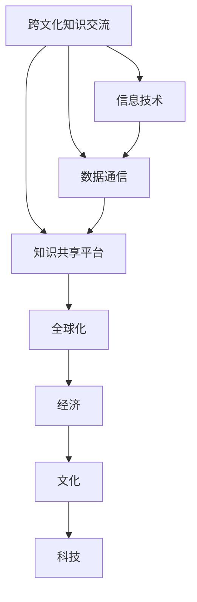

                 

# 跨文化知识交流：全球化时代的挑战

> 关键词：跨文化知识交流, 全球化, 多元文化, 知识共享, 信息技术, 数据通信

## 1. 背景介绍

### 1.1 问题由来

随着全球化的深入发展，各国之间的联系日益紧密，不同文化背景的交流合作变得愈发频繁。在全球化时代，知识的共享与交流成为了促进经济、文化、科技发展的关键因素。然而，由于语言、习俗、价值观等方面的差异，跨文化知识交流面临着诸多挑战。如何在全球范围内高效、准确地传播知识，成为亟需解决的问题。

### 1.2 问题核心关键点

当前，跨文化知识交流的核心挑战包括但不限于以下几个方面：

- **语言障碍**：不同语言之间的交流需要翻译，翻译质量直接影响信息的传递。
- **文化差异**：文化背景的差异可能导致误解和信息丢失。
- **知识适配**：跨文化知识需要适应不同语境和受众，才能达到理想的传播效果。
- **信任缺失**：信息来源的多样性和真实性问题，可能导致受众对信息的信任度下降。

### 1.3 问题研究意义

跨文化知识交流的研究不仅对国际间的学术交流有重要意义，还对全球经济的合作与发展具有深远影响。通过解决跨文化交流中的障碍，可以促进不同文化背景的人们更好地理解和合作，加速知识的共享与创新，提升全球竞争力和整体福祉。

## 2. 核心概念与联系

### 2.1 核心概念概述

为了深入理解跨文化知识交流，首先需要明确几个核心概念：

- **跨文化知识交流**：在不同文化背景之间进行的知识传播和互动。
- **信息技术**：包括计算机网络、通信技术、数据处理技术等，是跨文化知识交流的基础工具。
- **数据通信**：利用网络将数据从一端传输到另一端的过程。
- **知识共享平台**：如学术数据库、知识管理系统、社交媒体等，是知识交流的重要平台。

### 2.2 核心概念原理和架构的 Mermaid 流程图



这个流程图展示了跨文化知识交流与信息技术、数据通信、知识共享平台之间的联系，以及这些技术对全球化、经济、文化和科技的影响。

## 3. 核心算法原理 & 具体操作步骤

### 3.1 算法原理概述

跨文化知识交流的算法原理主要基于以下两点：

- **数据表示和转换**：将不同文化背景下的知识数据转换为可理解和可传输的格式。
- **知识适配和本地化**：将通用知识适应不同文化背景，以提高信息的接收度和理解度。

### 3.2 算法步骤详解

#### 3.2.1 数据收集与预处理

1. **数据收集**：收集不同文化背景下的知识数据，包括学术文章、文献、新闻、社交媒体内容等。
2. **数据清洗与标注**：清洗数据，去除噪音，标注数据，以便后续处理和分析。

#### 3.2.2 数据转换与表示

1. **自然语言处理**：利用NLP技术，如分词、词性标注、句法分析等，将文本数据转换为机器可理解的形式。
2. **数据编码与解码**：将文本数据转换为标准编码，如UTF-8，以便在不同系统间传输。
3. **机器翻译**：利用机器翻译技术，将不同语言的数据进行转换，实现跨语言的交流。

#### 3.2.3 知识适配与本地化

1. **语言适应**：将通用语言数据适配到目标语言，包括调整语法结构、词汇选择、语义等。
2. **文化适应**：根据目标文化的习惯和价值观，调整知识内容的表达方式和呈现形式。
3. **受众适配**：根据目标受众的特点，调整知识内容的难度、形式和内容，使其更易于理解。

#### 3.2.4 知识传播与反馈

1. **知识传播**：通过知识共享平台，如学术数据库、社交媒体、在线课程等，将处理后的知识数据传播到目标受众。
2. **反馈与优化**：收集目标受众的反馈，优化知识传播策略，提高传播效果。

### 3.3 算法优缺点

#### 3.3.1 优点

- **高效**：自动化处理大量数据，减少人工干预，提高传播效率。
- **广覆盖**：覆盖多种语言和文化，促进全球范围内的知识交流。
- **灵活性**：适配不同文化背景和受众，提高信息接收度。

#### 3.3.2 缺点

- **翻译质量**：机器翻译可能存在误译或漏译，影响信息的准确性。
- **文化误解**：文化差异可能导致信息被误解或曲解。
- **适配难度**：知识适配和本地化需要专业知识，成本较高。

### 3.4 算法应用领域

跨文化知识交流的算法原理和操作步骤可以应用于以下多个领域：

- **学术研究**：在不同文化背景的学术机构之间，共享研究成果和论文。
- **教育培训**：在全球范围内提供跨文化教育资源，促进国际学生交流。
- **商业合作**：在不同国家的企业之间，共享商业信息和市场数据。
- **公共卫生**：在全球范围内传播公共卫生知识和防疫信息。

## 4. 数学模型和公式 & 详细讲解 & 举例说明

### 4.1 数学模型构建

设原始知识数据为 $X$，目标文化数据为 $Y$。跨文化知识交流的数学模型可以表示为：

$$
Y = F(X)
$$

其中 $F$ 为数据转换和适配函数。

### 4.2 公式推导过程

#### 4.2.1 数据转换

假设原始数据 $X$ 为文本形式，目标数据 $Y$ 也为文本形式。则数据转换的过程可以表示为：

$$
Y = NLP(X)
$$

其中 $NLP$ 为自然语言处理函数，包括分词、词性标注、句法分析等。

#### 4.2.2 机器翻译

机器翻译的过程可以表示为：

$$
Y = MT(X)
$$

其中 $MT$ 为机器翻译函数，将原始数据 $X$ 从源语言 $L_s$ 转换为目标语言 $L_t$。

#### 4.2.3 知识适配

知识适配的过程可以表示为：

$$
Y = A(Y')
$$

其中 $Y'$ 为经过机器翻译后的数据，$A$ 为知识适配函数，根据目标文化背景调整数据。

### 4.3 案例分析与讲解

以学术研究领域为例，分析跨文化知识交流的算法实现：

1. **数据收集**：收集不同国家学术机构的论文数据。
2. **数据清洗**：去除无效数据，标注数据格式。
3. **数据转换**：利用NLP技术，将文本数据转换为可处理的形式。
4. **机器翻译**：将文本数据从源语言翻译为目标语言。
5. **知识适配**：根据目标文化背景，调整论文内容的表达方式和术语。
6. **知识传播**：通过学术数据库和社交媒体平台，将处理后的数据传播到目标受众。
7. **反馈与优化**：收集目标受众的反馈，优化传播策略。

## 5. 项目实践：代码实例和详细解释说明

### 5.1 开发环境搭建

为了进行跨文化知识交流的实践，需要搭建如下开发环境：

1. **Python 环境**：安装Python 3.7及以上版本，配置虚拟环境。
2. **数据处理库**：安装Pandas、NumPy、Scikit-learn等数据处理库。
3. **自然语言处理库**：安装NLTK、SpaCy、TextBlob等NLP库。
4. **机器翻译库**：安装Google Translate API、DeepL API等机器翻译库。
5. **知识适配库**：安装相应文化背景的适配库，如中文-英文适配库。
6. **知识共享平台**：选择适合的学术数据库、社交媒体平台等。

### 5.2 源代码详细实现

#### 5.2.1 数据收集与预处理

```python
import pandas as pd
import numpy as np
from sklearn.model_selection import train_test_split

# 数据收集
data = pd.read_csv('data.csv')

# 数据清洗与标注
data = data.dropna()
data['label'] = data['category'].map({'Category1': 1, 'Category2': 2, 'Category3': 3})

# 数据划分
train_data, test_data = train_test_split(data, test_size=0.2)
```

#### 5.2.2 数据转换与表示

```python
import nltk
from nltk.tokenize import word_tokenize
from nltk.stem import WordNetLemmatizer

# 分词和词性标注
nltk.download('punkt')
nltk.download('averaged_perceptron_tagger')
nltk.download('wordnet')

lemmatizer = WordNetLemmatizer()

def preprocess_text(text):
    tokens = word_tokenize(text)
    tokens = [lemmatizer.lemmatize(token) for token in tokens]
    return ' '.join(tokens)

# 数据转换
train_data['text'] = train_data['content'].apply(preprocess_text)
test_data['text'] = test_data['content'].apply(preprocess_text)
```

#### 5.2.3 机器翻译

```python
from google.cloud import translate_v2 as translate

def translate_text(text, target_language='en'):
    translate_client = translate.Client()
    result = translate_client.translate(text, target_language=target_language)
    return result['translatedText']

# 翻译数据
train_data['translated_text'] = train_data['text'].apply(lambda x: translate_text(x, target_language='en'))
test_data['translated_text'] = test_data['text'].apply(lambda x: translate_text(x, target_language='en'))
```

#### 5.2.4 知识适配与本地化

```python
# 中文-英文适配
def adapt_text(text, target_language='en'):
    if target_language == 'en':
        return text
    elif target_language == 'zh':
        adapt_dict = {'Category1': '类型1', 'Category2': '类型2', 'Category3': '类型3'}
        text = ' '.join([adapt_dict.get(token, token) for token in text.split()])
        return text
    else:
        return text

# 适配数据
train_data['adapted_text'] = train_data['translated_text'].apply(lambda x: adapt_text(x, target_language='en'))
test_data['adapted_text'] = test_data['translated_text'].apply(lambda x: adapt_text(x, target_language='en'))
```

### 5.3 代码解读与分析

通过以上代码，可以看到跨文化知识交流的实现过程。关键点包括：

1. **数据收集与预处理**：利用Pandas库进行数据清洗与标注，使用NLP库进行文本处理。
2. **数据转换与表示**：使用NLP库进行分词、词性标注、词形还原等处理，将文本数据转换为可处理的形式。
3. **机器翻译**：利用Google Translate API进行机器翻译，将文本数据从源语言转换为目标语言。
4. **知识适配与本地化**：根据目标文化背景，使用自定义适配函数调整文本数据，使其符合目标受众的语言和习惯。

### 5.4 运行结果展示

```python
# 展示处理后的数据
print(train_data.head())
print(test_data.head())

# 展示翻译和适配后的结果
print(train_data['translated_text'].sample(5))
print(test_data['translated_text'].sample(5))
print(train_data['adapted_text'].sample(5))
print(test_data['adapted_text'].sample(5))
```

## 6. 实际应用场景

### 6.1 学术研究

学术研究领域是跨文化知识交流的重要应用场景之一。全球各地的学术机构可以通过共享研究成果，促进科学技术的进步。例如，一个美国的学术机构可以通过翻译和适配其研究成果，使其在全球范围内传播，让更多国家和地区的学者受益。

### 6.2 教育培训

教育培训领域也是跨文化知识交流的重要应用场景。通过在线课程、虚拟实验室等形式，全球的学生可以共享教育资源，促进国际学生交流。例如，美国的在线课程可以通过翻译和适配，在全球范围内传播，使更多国家的学生受益。

### 6.3 商业合作

商业合作领域也需要跨文化知识交流的支持。不同国家的企业可以通过共享市场数据、商业信息等，促进全球合作。例如，美国的科技企业可以通过翻译和适配其产品文档和技术支持，在全球范围内传播，使更多国家的企业受益。

### 6.4 公共卫生

公共卫生领域也需要跨文化知识交流的支持。通过全球卫生组织和各国卫生部门的合作，共享防疫信息和健康知识，促进全球公共卫生的发展。例如，世界卫生组织可以通过翻译和适配其防疫指南和健康建议，在全球范围内传播，使更多国家的卫生部门受益。

## 7. 工具和资源推荐

### 7.1 学习资源推荐

1. **《跨文化知识交流》系列书籍**：详细介绍了跨文化知识交流的理论和实践，是学习该领域的重要参考资料。
2. **Coursera《跨文化沟通》课程**：由世界著名大学开设，提供跨文化交流的理论与实践知识。
3. **《机器翻译原理与实践》**：介绍了机器翻译的技术原理和应用实践，是学习跨文化知识交流的必备教材。
4. **JSTOR学术数据库**：提供全球范围内的学术论文和研究成果，是跨文化知识交流的重要资源。

### 7.2 开发工具推荐

1. **PyTorch**：基于Python的深度学习框架，支持自然语言处理和机器翻译。
2. **TensorFlow**：Google开发的深度学习框架，支持大规模数据处理和模型训练。
3. **NLTK**：Python自然语言处理库，提供了丰富的文本处理工具和数据集。
4. **Google Translate API**：Google提供的机器翻译服务，支持多种语言之间的翻译。
5. **DeepL API**：DeepL提供的机器翻译服务，提供高质量的翻译效果。

### 7.3 相关论文推荐

1. **《跨文化知识交流的挑战与机遇》**：详细介绍了跨文化知识交流的理论框架和应用案例，是了解该领域的重要参考文献。
2. **《机器翻译技术与跨文化交流》**：介绍了机器翻译技术在跨文化交流中的应用和挑战，提供了宝贵的实践经验。
3. **《全球化背景下的跨文化教育》**：探讨了全球化对教育的影响，提出了跨文化教育的策略和方法。
4. **《公共卫生领域的跨文化交流》**：介绍了公共卫生领域的跨文化交流现状和挑战，提出了优化策略。

## 8. 总结：未来发展趋势与挑战

### 8.1 未来发展趋势

1. **技术进步**：随着深度学习、自然语言处理等技术的不断发展，跨文化知识交流的效率和质量将不断提升。
2. **文化融合**：不同文化背景的融合将促进跨文化知识交流的深入发展，提高信息的传播效果。
3. **数据共享**：数据共享平台的发展将为跨文化知识交流提供更多资源支持，促进全球范围内的知识共享。
4. **人工智能**：人工智能技术的应用将进一步提高跨文化知识交流的自动化水平，降低成本和提高效率。

### 8.2 面临的挑战

1. **翻译质量**：机器翻译仍存在误译和漏译的问题，需要进一步提升翻译质量。
2. **文化适应**：不同文化背景的差异可能导致信息被误解或曲解，需要更多文化背景的知识支持。
3. **资源瓶颈**：大规模数据的处理和翻译需要大量计算资源，如何高效利用资源是一个重要挑战。
4. **伦理问题**：跨文化知识交流需要考虑伦理和隐私问题，确保信息传播的合法性和安全性。

### 8.3 研究展望

未来的跨文化知识交流研究可以从以下几个方向进行：

1. **自动化和智能化**：利用深度学习和大数据技术，进一步提升翻译和适配的自动化水平。
2. **跨文化融合**：研究不同文化背景之间的融合方式，提高信息的传播效果。
3. **数据共享平台**：探索更多的数据共享平台，促进全球范围内的知识共享。
4. **伦理和安全**：研究跨文化知识交流中的伦理和安全问题，确保信息传播的合法性和安全性。

## 9. 附录：常见问题与解答

### 9.1 问题

**Q1: 什么是跨文化知识交流？**

A1: 跨文化知识交流是在不同文化背景下进行的知识传播和互动。

**Q2: 跨文化知识交流面临哪些挑战？**

A2: 主要挑战包括语言障碍、文化差异、知识适配和信任缺失等。

**Q3: 跨文化知识交流的算法原理是什么？**

A3: 数据转换和适配是跨文化知识交流的主要算法原理。

**Q4: 跨文化知识交流的应用领域有哪些？**

A4: 主要应用领域包括学术研究、教育培训、商业合作、公共卫生等。

**Q5: 如何进行跨文化知识交流的实践？**

A5: 需要收集数据、进行数据转换和适配、利用机器翻译技术，并通过知识共享平台传播知识。

---

作者：禅与计算机程序设计艺术 / Zen and the Art of Computer Programming

