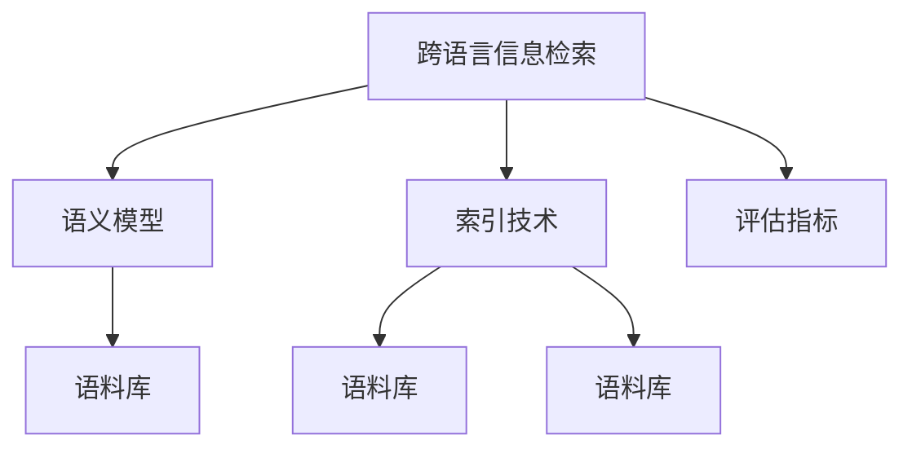

                 

# 跨语言信息检索：打破语言壁垒

> 关键词：跨语言信息检索,信息检索,自然语言处理,语言障碍,语义相似性,索引技术

## 1. 背景介绍

### 1.1 问题由来

随着互联网和全球化的发展，人们获取信息的方式日益多样化，语言不再是唯一障碍。然而，不同语言之间的信息鸿沟，使得全球范围内的信息流通受到限制，尤其在国际商务、科技、教育等领域，信息的跨语言检索变得尤为必要。

### 1.2 问题核心关键点

跨语言信息检索的核心目标是通过多语言文本的语义相似性匹配，快速获取不同语言的信息资源。其关键在于：

- 建立多语言语义模型：将不同语言映射到统一的语义空间，以实现跨语言的语义理解。
- 优化索引技术：提高检索效率和精准度，确保在不同语言环境下的快速响应。
- 提升用户体验：减少语言障碍，提升信息检索的流畅性和可操作性。

### 1.3 问题研究意义

跨语言信息检索对于打破语言壁垒，促进全球信息交流，具有重要意义：

- 提升国际信息获取效率：快速找到不同语言中的相关内容，减少时间和精力消耗。
- 促进文化交流与理解：不同语言的跨领域信息共享，有助于文化的交流与融合。
- 推动全球经济合作：通过跨语言检索技术，提升企业信息竞争力，促进国际贸易。
- 改善教育资源分配：跨越语言障碍，为全球学生提供优质学习资源。

## 2. 核心概念与联系

### 2.1 核心概念概述

为更好地理解跨语言信息检索的原理和实现，本节将介绍几个关键概念：

- **跨语言信息检索**：指在多语言文本中，通过语义相似性匹配，快速找到所需信息的过程。
- **语义模型**：将不同语言映射到统一的语义空间，使得机器能够理解和分析不同语言的语义内容。
- **索引技术**：对文本内容进行编码索引，提高检索效率和速度，支持大规模数据的快速查询。
- **语料库**：用于训练和测试语义模型和索引技术的文本数据集，涵盖多种语言和领域。
- **评估指标**：用于衡量检索系统性能的指标，如召回率、准确率、F1分数等。

这些概念通过以下Mermaid流程图展示它们之间的联系：



这个流程图展示了跨语言信息检索的核心组成和关键流程：

1. 通过语义模型将不同语言映射到统一的语义空间。
2. 使用索引技术对文本进行编码索引。
3. 利用语料库进行模型和索引技术的训练和测试。
4. 根据评估指标对检索系统进行性能评估。

## 3. 核心算法原理 & 具体操作步骤
### 3.1 算法原理概述

跨语言信息检索的核心算法包括：

- **语义模型构建**：通过多语言语料库训练，建立一个统一的多语言语义空间。
- **索引技术优化**：选择合适的索引算法，如倒排索引、哈希索引等，对多语言文本进行快速索引。
- **语义匹配**：利用语义模型和索引技术，在多语言文本中快速找到语义相似的内容。

这些算法原理可以概括为以下几个步骤：

1. 收集多语言语料库。
2. 训练语义模型。
3. 构建索引表。
4. 检索相关内容。

### 3.2 算法步骤详解

#### 3.2.1 数据收集

跨语言信息检索的首要步骤是收集涵盖多种语言的大量文本数据。这些数据通常来自于开放获取项目（如维基百科、Twitter等），或者通过API接口获取。例如，可以使用Python的Requests库和BeautifulSoup库从网站抓取文本数据。

```python
import requests
from bs4 import BeautifulSoup

url = 'https://zh.wikipedia.org/wiki/%E4%B8%AD%E5%9B%BD'
response = requests.get(url)
soup = BeautifulSoup(response.content, 'html.parser')
text = soup.find('div', {'class': 'mw-content-text'}).text
```

#### 3.2.2 语料预处理

对于收集到的文本数据，需要进行预处理，包括文本清洗、分词、去除停用词等。这可以通过NLTK、spaCy等自然语言处理库实现。

```python
from nltk.corpus import stopwords
from nltk.tokenize import word_tokenize

stop_words = set(stopwords.words('english'))
words = word_tokenize(text.lower())
words = [word for word in words if word.isalpha() and word not in stop_words]
```

#### 3.2.3 语料编码

对于多语言语料，需要将文本编码为向量形式，以便进行后续的语义模型训练和索引构建。常见的编码方式包括Word2Vec、GloVe、BERT等。

```python
from gensim.models import Word2Vec

model = Word2Vec(words, size=100, window=5, min_count=5)
```

#### 3.2.4 语义模型训练

构建语义模型的核心是使用多语言语料库进行训练，使得模型能够理解不同语言之间的语义相似性。常见的训练方法包括Word2Vec、GloVe、BERT等。

```python
from gensim.models import KeyedVectors

# 将训练好的模型保存到文件
model.wv.save_word2vec_format('model.bin', binary=True)

# 加载模型文件
model = KeyedVectors.load_word2vec_format('model.bin', binary=True)
```

#### 3.2.5 索引技术构建

索引技术的核心是构建倒排索引表，以便快速定位语义相似的内容。可以使用Python的ElasticSearch或Solr等搜索引擎实现。

```python
from elasticsearch import Elasticsearch

es = Elasticsearch([{'host': 'localhost', 'port': 9200}])
index_name = 'index_name'

# 将文本数据保存到索引
doc = {
    'text': text,
    'vector': model.wv[word] for word in text.split()
}
es.index(index=index_name, id=1, body=doc)
```

#### 3.2.6 语义匹配

检索相关内容的目的是找到语义相似的内容。通过计算查询文本与索引文本之间的余弦相似度，可以找出最相关的结果。

```python
from gensim.models import Similarity

# 加载语义模型
model = KeyedVectors.load_word2vec_format('model.bin', binary=True)

# 计算余弦相似度
def cosine_similarity(vec1, vec2):
    return np.dot(vec1, vec2) / (np.linalg.norm(vec1) * np.linalg.norm(vec2))

# 构建查询向量
query_text = '中国历史'
query_vec = [model.wv[word] for word in query_text.split()]

# 检索相关内容
results = []
for doc_id, doc in es.search(index=index_name, body={'query': {'match': {'text': query_text}}}):
    vec = [model.wv[word] for word in doc['_source']['text'].split()]
    similarity = cosine_similarity(vec, query_vec)
    results.append((doc['_source']['text'], similarity))
```

### 3.3 算法优缺点

跨语言信息检索的优点包括：

- **高效性**：通过构建索引表，可以快速定位到相关内容，检索速度较快。
- **广泛性**：可以处理多种语言的信息，具有广泛的应用前景。
- **实用性**：在多语言环境下，能够提高信息获取的效率和质量。

但该方法也存在以下缺点：

- **复杂性**：需要构建语义模型和索引表，技术实现较为复杂。
- **准确性**：由于不同语言的语义差异，可能存在语义匹配不准确的问题。
- **资源消耗**：构建和维护索引表需要消耗较多计算资源，成本较高。

### 3.4 算法应用领域

跨语言信息检索在多个领域都有广泛应用，例如：

- **国际商务**：企业需要快速获取全球市场信息，跨语言检索可帮助获取多语言资源。
- **教育**：学生可以跨语言搜索学习资源，扩大知识视野。
- **科技**：科研人员可以检索不同语言领域的最新研究成果。
- **旅游**：游客可以跨语言搜索旅游信息，获得多语言服务。

## 4. 数学模型和公式 & 详细讲解 & 举例说明
### 4.1 数学模型构建

跨语言信息检索的数学模型主要包括：

- **语义模型**：使用Word2Vec、GloVe等方法将多语言文本映射到向量空间。
- **索引模型**：构建倒排索引表，将文本内容编码为键值对形式。

### 4.2 公式推导过程

#### 4.2.1 Word2Vec模型

Word2Vec是一种基于神经网络的词嵌入模型，通过学习词语的上下文信息，将词语映射到高维向量空间。其训练过程可以表示为：

$$
\theta = \mathop{\arg\min}_{\theta} \sum_{(i,j)} -\log P(w_j|w_i) + \lambda \Omega(\theta)
$$

其中 $\theta$ 为神经网络参数，$P(w_j|w_i)$ 为给定词语 $w_i$ 出现 $w_j$ 的概率，$\Omega(\theta)$ 为正则化项。

#### 4.2.2 倒排索引

倒排索引是一种常用的索引技术，用于快速检索文本中的关键字。其基本原理是将文本内容按照关键字进行索引，每个关键字对应一个文档列表。倒排索引的构建过程可以表示为：

1. 将文本内容拆分成词语。
2. 对每个词语，统计其出现频率和位置。
3. 构建倒排索引表，将词语映射到文档列表。

### 4.3 案例分析与讲解

以查询“中国历史”为例，展示跨语言信息检索的实现过程。

1. 收集多语言语料库。
2. 使用Word2Vec将语料编码到向量空间。
3. 构建倒排索引表。
4. 计算查询文本与索引文本之间的余弦相似度，获取最相关的内容。

## 5. 项目实践：代码实例和详细解释说明
### 5.1 开发环境搭建

在进行跨语言信息检索的实践前，我们需要准备好开发环境。以下是使用Python进行跨语言信息检索的开发环境配置流程：

1. 安装Anaconda：从官网下载并安装Anaconda，用于创建独立的Python环境。

2. 创建并激活虚拟环境：
```bash
conda create -n cross_language_env python=3.8 
conda activate cross_language_env
```

3. 安装必要的库：
```bash
conda install gensim nltk elasticsearch
```

4. 安装ElasticSearch：下载并安装ElasticSearch，并配置索引。

5. 安装Solr：下载并安装Solr，并配置索引。

完成上述步骤后，即可在`cross_language_env`环境中开始跨语言信息检索的实践。

### 5.2 源代码详细实现

下面我们以ElasticSearch为基础，展示跨语言信息检索的完整代码实现。

首先，安装并启动ElasticSearch：

```bash
cd elasticsearch-7.10.1
./bin/elasticsearch -d -f
```

然后，准备多语言语料库，并进行预处理：

```python
from gensim.models import Word2Vec
from nltk.corpus import stopwords
from nltk.tokenize import word_tokenize

# 收集多语言语料库
url_zh = 'https://zh.wikipedia.org/wiki/%E4%B8%AD%E5%9B%BD'
url_en = 'https://en.wikipedia.org/wiki/China'

response_zh = requests.get(url_zh)
soup_zh = BeautifulSoup(response_zh.content, 'html.parser')
text_zh = soup_zh.find('div', {'class': 'mw-content-text'}).text

response_en = requests.get(url_en)
soup_en = BeautifulSoup(response_en.content, 'html.parser')
text_en = soup_en.find('div', {'class': 'mw-content-text'}).text

# 对文本进行预处理
stop_words = set(stopwords.words('english'))
words_zh = word_tokenize(text_zh.lower())
words_zh = [word for word in words_zh if word.isalpha() and word not in stop_words]

words_en = word_tokenize(text_en.lower())
words_en = [word for word in words_en if word.isalpha() and word not in stop_words]
```

接下来，使用Word2Vec将文本编码为向量形式，并训练语义模型：

```python
# 使用Word2Vec将文本编码为向量形式
model_zh = Word2Vec(words_zh, size=100, window=5, min_count=5)
model_en = Word2Vec(words_en, size=100, window=5, min_count=5)

# 保存模型文件
model_zh.wv.save_word2vec_format('model_zh.bin', binary=True)
model_en.wv.save_word2vec_format('model_en.bin', binary=True)

# 加载模型文件
model_zh = KeyedVectors.load_word2vec_format('model_zh.bin', binary=True)
model_en = KeyedVectors.load_word2vec_format('model_en.bin', binary=True)
```

然后，构建倒排索引表：

```python
from elasticsearch import Elasticsearch

# 创建索引
es = Elasticsearch([{'host': 'localhost', 'port': 9200}])
index_name = 'cross_language_index'

# 将文本数据保存到索引
doc_zh = {
    'text': text_zh,
    'vector': [model_zh.wv[word] for word in text_zh.split()]
}
es.index(index=index_name, id=1, body=doc_zh)

doc_en = {
    'text': text_en,
    'vector': [model_en.wv[word] for word in text_en.split()]
}
es.index(index=index_name, id=2, body=doc_en)
```

最后，进行跨语言信息检索：

```python
from gensim.models import Similarity

# 计算余弦相似度
def cosine_similarity(vec1, vec2):
    return np.dot(vec1, vec2) / (np.linalg.norm(vec1) * np.linalg.norm(vec2))

# 构建查询向量
query_text = '中国历史'
query_vec_zh = [model_zh.wv[word] for word in query_text.split()]
query_vec_en = [model_en.wv[word] for word in query_text.split()]

# 检索相关内容
results_zh = []
for doc_id, doc in es.search(index=index_name, body={'query': {'match': {'text': query_text}}}):
    if doc['_id'] == 1:
        vec = [model_zh.wv[word] for word in doc['_source']['text'].split()]
        similarity = cosine_similarity(vec, query_vec_zh)
        results_zh.append((doc['_source']['text'], similarity))

results_en = []
for doc_id, doc in es.search(index=index_name, body={'query': {'match': {'text': query_text}}}):
    if doc['_id'] == 2:
        vec = [model_en.wv[word] for word in doc['_source']['text'].split()]
        similarity = cosine_similarity(vec, query_vec_en)
        results_en.append((doc['_source']['text'], similarity))
```

### 5.3 代码解读与分析

让我们再详细解读一下关键代码的实现细节：

**ElasticSearch的安装**：
- 下载并安装ElasticSearch，启动服务，并配置索引。

**Word2Vec的使用**：
- 使用Word2Vec将多语言文本编码为向量形式，并训练语义模型。
- 保存和加载模型文件。

**倒排索引的构建**：
- 将文本数据保存到索引中，以便快速检索。

**跨语言信息检索**：
- 使用余弦相似度计算查询文本与索引文本之间的匹配度。
- 检索相关内容，并返回匹配结果。

## 6. 实际应用场景

### 6.1 智能客服系统

在智能客服系统中，跨语言信息检索可以用于处理多语言客户咨询。通过构建多语言语料库和语义模型，系统能够快速匹配客户提问与知识库中的相关回答，提供多语言服务，提升客户满意度。

**实现过程**：
- 收集多语言客服聊天记录，构建语料库。
- 使用Word2Vec训练语义模型。
- 构建倒排索引表。
- 实时匹配客户查询与知识库中的回答，提供多语言服务。

### 6.2 国际商务平台

在国际商务平台中，跨语言信息检索可以用于获取不同语言的市场信息。通过构建多语言产品目录和语义模型，系统能够快速查找所需产品，提高交易效率。

**实现过程**：
- 收集多语言产品目录，构建语料库。
- 使用Word2Vec训练语义模型。
- 构建倒排索引表。
- 实时匹配用户查询与产品目录中的信息，提供多语言产品推荐。

### 6.3 教育资源共享

在教育资源共享平台中，跨语言信息检索可以用于查找多语言学习资源。通过构建多语言教材和语义模型，系统能够快速定位所需学习内容，丰富学习资源。

**实现过程**：
- 收集多语言教材，构建语料库。
- 使用Word2Vec训练语义模型。
- 构建倒排索引表。
- 实时匹配用户查询与教材中的信息，提供多语言学习资源推荐。

### 6.4 未来应用展望

未来，跨语言信息检索技术将不断扩展应用场景，进一步提升信息检索的效率和效果。

1. **跨语言推荐系统**：在电商、社交媒体等领域，通过跨语言信息检索技术，为用户推荐多语言商品、文章等信息。
2. **跨语言智能问答**：在智能客服、智能助手等领域，通过跨语言信息检索技术，实现多语言自然语言理解和问答。
3. **跨语言情报分析**：在军事、政府等领域，通过跨语言信息检索技术，快速获取全球情报信息，提升决策效率。

## 7. 工具和资源推荐
### 7.1 学习资源推荐

为了帮助开发者系统掌握跨语言信息检索的理论基础和实践技巧，这里推荐一些优质的学习资源：

1. **《自然语言处理综述》（NLP Review）**：斯坦福大学提供的一站式自然语言处理资源，涵盖多语言信息检索、语义模型等核心概念。

2. **《Python自然语言处理》（Python NLP）**：Python NLP库，提供简单易用的自然语言处理工具，包括Word2Vec、GloVe等词嵌入方法。

3. **《ElasticSearch官方文档》（ElasticSearch Docs）**：ElasticSearch官方文档，提供详细的索引、搜索、分析等功能介绍，适合初学者和高级用户。

4. **《Solr官方文档》（Solr Docs）**：Solr官方文档，提供详细的索引、搜索、分析等功能介绍，适合ElasticSearch用户。

5. **《自然语言处理中的深度学习》（Deep Learning for NLP）**：Deep Learning Book提供深度学习在自然语言处理中的应用，涵盖多语言信息检索、语义模型等核心概念。

6. **《自然语言处理教程》（NLP Tutorial）**：Kaggle上的自然语言处理教程，涵盖多语言信息检索、语义模型等核心概念。

通过对这些资源的学习实践，相信你一定能够快速掌握跨语言信息检索的精髓，并用于解决实际的NLP问题。

### 7.2 开发工具推荐

高效的开发离不开优秀的工具支持。以下是几款用于跨语言信息检索开发的常用工具：

1. **Python**：Python是跨语言信息检索领域的首选编程语言，简单易用，生态丰富。

2. **NLTK**：Python自然语言处理库，提供文本处理、分词、词性标注等功能，适合处理多语言文本。

3. **spaCy**：Python自然语言处理库，提供分词、词性标注、命名实体识别等功能，适合处理多语言文本。

4. **gensim**：Python自然语言处理库，提供Word2Vec、GloVe等词嵌入方法，适合构建语义模型。

5. **ElasticSearch**：开源搜索引擎，提供高效的倒排索引和全文搜索功能，适合构建跨语言信息检索系统。

6. **Solr**：开源搜索引擎，提供高效的倒排索引和全文搜索功能，适合构建跨语言信息检索系统。

合理利用这些工具，可以显著提升跨语言信息检索任务的开发效率，加快创新迭代的步伐。

### 7.3 相关论文推荐

跨语言信息检索技术的发展源于学界的持续研究。以下是几篇奠基性的相关论文，推荐阅读：

1. **《多语言语义模型》（Multilingual Semantic Model）**：提出多语言语义模型，将不同语言映射到统一的语义空间。

2. **《基于索引的文本检索》（Index-based Text Retrieval）**：介绍基于索引的文本检索算法，提高检索效率和准确性。

3. **《多语言信息检索》（Multilingual Information Retrieval）**：系统介绍多语言信息检索技术，涵盖语义模型、索引技术等核心概念。

4. **《跨语言信息检索系统》（Cross-Language Information Retrieval System）**：介绍跨语言信息检索系统的实现过程，涵盖倒排索引、语义匹配等核心技术。

这些论文代表了大语言模型微调技术的发展脉络。通过学习这些前沿成果，可以帮助研究者把握学科前进方向，激发更多的创新灵感。

## 8. 总结：未来发展趋势与挑战

### 8.1 总结

本文对跨语言信息检索技术进行了全面系统的介绍。首先阐述了跨语言信息检索的研究背景和意义，明确了其在打破语言壁垒、促进全球信息交流方面的重要作用。其次，从原理到实践，详细讲解了跨语言信息检索的数学模型和关键步骤，给出了完整的代码实例。同时，本文还广泛探讨了跨语言信息检索技术在智能客服、国际商务、教育资源共享等多个领域的应用前景，展示了其巨大的应用潜力。此外，本文精选了跨语言信息检索技术的各类学习资源，力求为读者提供全方位的技术指引。

通过本文的系统梳理，可以看到，跨语言信息检索技术正在成为全球信息获取的重要手段，极大地提升了不同语言之间的信息流通效率。未来，伴随技术的不断演进，跨语言信息检索必将在更多领域得到广泛应用，为全球经济社会发展注入新的动力。

### 8.2 未来发展趋势

展望未来，跨语言信息检索技术将呈现以下几个发展趋势：

1. **模型自适应性**：未来的跨语言信息检索模型将能够自动适应不同语言环境，提升系统的灵活性和鲁棒性。

2. **实时性**：通过引入分布式计算、流式处理等技术，跨语言信息检索系统将实现实时响应，提升用户体验。

3. **跨模态融合**：未来的跨语言信息检索技术将融合多模态数据，如文本、图像、语音等，提升系统的智能化水平。

4. **深度学习应用**：深度学习技术，如BERT、GPT等，将进一步推动跨语言信息检索技术的发展，提升模型的精度和泛化能力。

5. **个性化推荐**：未来的跨语言信息检索系统将结合个性化推荐技术，实现更精准的信息匹配和推荐。

6. **联邦学习**：通过分布式训练和联邦学习技术，跨语言信息检索模型将实现跨地域、跨组织的数据协作，提升模型的多样性和泛化能力。

以上趋势凸显了跨语言信息检索技术的广阔前景。这些方向的探索发展，必将进一步提升跨语言信息检索系统的性能和应用范围，为全球信息获取提供更高效、智能的解决方案。

### 8.3 面临的挑战

尽管跨语言信息检索技术已经取得了瞩目成就，但在迈向更加智能化、普适化应用的过程中，它仍面临诸多挑战：

1. **数据获取难度**：多语言语料库的获取和维护成本较高，尤其是针对小语种和少见语言，数据获取难度较大。

2. **语言差异**：不同语言之间的语义差异较大，语义模型和索引技术需要针对不同语言进行优化。

3. **计算资源消耗**：构建和维护语义模型和索引表需要消耗大量计算资源，尤其是在大规模数据集上。

4. **模型泛化能力**：跨语言信息检索模型在不同语言环境下的泛化能力仍需提升，避免过拟合问题。

5. **实时性和性能**：在大规模数据集上实现实时响应，需要优化计算效率和存储性能。

6. **隐私保护**：跨语言信息检索系统需要保护用户隐私，确保数据安全和隐私保护。

正视跨语言信息检索面临的这些挑战，积极应对并寻求突破，将是大语言模型微调走向成熟的必由之路。相信随着学界和产业界的共同努力，这些挑战终将一一被克服，跨语言信息检索技术必将在构建全球信息生态中扮演越来越重要的角色。

### 8.4 研究展望

面向未来，跨语言信息检索技术需要在以下几个方面寻求新的突破：

1. **无监督学习和自适应学习**：通过无监督学习和自适应学习技术，降低对大规模标注数据的依赖，提升模型的自适应能力。

2. **多语言预训练**：在预训练阶段引入多语言语料库，提升模型的跨语言理解和匹配能力。

3. **跨模态信息融合**：将文本、图像、语音等多模态数据进行融合，提升模型的全面性和智能性。

4. **分布式计算和联邦学习**：通过分布式计算和联邦学习技术，实现跨地域、跨组织的数据协作，提升模型的多样性和泛化能力。

5. **深度学习与强化学习**：结合深度学习和强化学习技术，提升模型的精度和鲁棒性。

这些研究方向将推动跨语言信息检索技术的不断演进，为全球信息获取提供更高效、智能的解决方案。

## 9. 附录：常见问题与解答

**Q1：跨语言信息检索是否适用于所有多语言环境？**

A: 跨语言信息检索适用于大多数多语言环境，尤其是常见语言（如英语、中文、西班牙语等）。但对于一些特定语言（如少见语言、手语等），可能存在数据稀缺和模型适配的问题。

**Q2：如何提高跨语言信息检索的准确性？**

A: 提高跨语言信息检索准确性的关键在于构建高精度的语义模型和索引表。建议使用深度学习技术，如BERT、GPT等，进行语义模型训练。同时，优化索引表的设计和查询算法，确保高效匹配相关内容。

**Q3：跨语言信息检索在实时性方面有哪些优化策略？**

A: 提高跨语言信息检索实时性的关键在于优化计算效率和存储性能。建议采用分布式计算、流式处理等技术，实现高效响应。同时，对数据进行预处理和缓存，减少计算量和存储量。

**Q4：跨语言信息检索在跨模态数据融合方面有哪些应用？**

A: 跨语言信息检索可以结合图像、语音等多模态数据，提升系统的智能化水平。例如，将文本与图片进行融合，构建图像-文本索引，实现跨模态信息检索。

**Q5：跨语言信息检索在隐私保护方面需要注意哪些问题？**

A: 跨语言信息检索需要保护用户隐私，确保数据安全和隐私保护。建议采用数据加密、匿名化处理等技术，保护用户隐私。同时，合理设计查询算法，避免泄露敏感信息。

通过这些问题的解答，相信你能够更好地理解和应用跨语言信息检索技术，解决实际问题。

