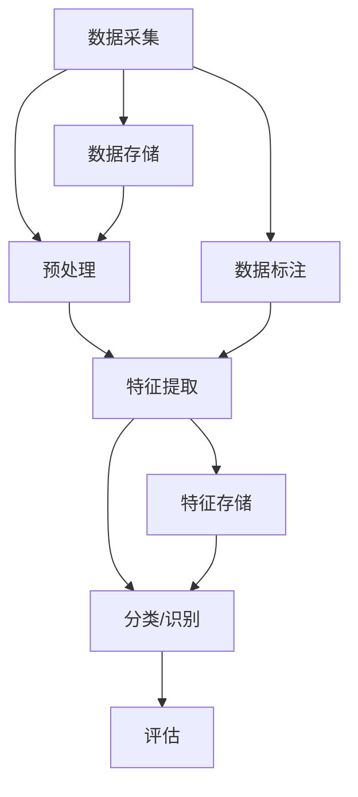

                 

- 深度学习
- 卷积神经网络
- 图像识别
- 语音识别
- 自然语言处理
- 机器学习
- 计算机视觉

## 1. 背景介绍

在当今信息爆炸的时代，图像和语音数据已成为我们日常生活和工作中最常见的数据形式之一。如何有效地理解和处理这些数据，是计算机科学面临的重大挑战。图像识别和语音识别技术的发展，为我们提供了有效处理和理解这些数据的手段。本文将深入探讨软件 2.0 在图像识别和语音识别领域的应用，并提供实践指南和工具推荐。

## 2. 核心概念与联系

软件 2.0 的核心是深度学习，它是一种机器学习方法，受人类大脑结构和功能的启发。深度学习模型通常由多个相连的层组成，每层都学习抽象的表示，从而提取更高级别的特征。图像识别和语音识别都是计算机视觉和听觉领域的关键任务，深度学习技术在其中发挥着至关重要的作用。

以下是图像识别和语音识别系统的架构 Mermaid 流程图：



## 3. 核心算法原理 & 具体操作步骤

### 3.1 算法原理概述

图像识别和语音识别的核心算法是卷积神经网络（CNN）和循环神经网络（RNN）及其变种，如长短期记忆网络（LSTM）和门控循环单元（GRU）。CNN 专门设计用于处理网格结构数据，如图像，而 RNN 则适用于序列数据，如语音。

### 3.2 算法步骤详解

1. **数据预处理**：对图像数据进行缩放、归一化、增强等操作，对语音数据进行分帧、滤波、降噪等操作。
2. **特征提取**：使用 CNN 提取图像特征，使用 RNN/LSTM/GRU 提取语音特征。
3. **分类/识别**：使用全连接层或其他分类器对提取的特征进行分类或识别。
4. **评估**：使用准确率、精确度、召回率、F1 分数等指标评估模型性能。

### 3.3 算法优缺点

**优点**：深度学习模型在图像和语音识别任务上取得了显著的成功，能够学习复杂的特征表示，具有很强的泛化能力。

**缺点**：深度学习模型通常需要大量的标注数据和计算资源进行训练，易受过拟合和模型解释性差等问题的影响。

### 3.4 算法应用领域

图像识别和语音识别技术在安全、医疗、娱乐、通信等领域有着广泛的应用，如人脸识别、语音助手、自动驾驶、疾病诊断等。

## 4. 数学模型和公式 & 详细讲解 & 举例说明

### 4.1 数学模型构建

图像识别和语音识别的数学模型通常是多层感知机（MLP）或 CNN/RNN/LSTM/GRU 等深度学习模型。这些模型可以表示为以下形式：

$$y = f(x; W, b) = f(\ldots f(x_0; W_1, b_1) \ldots; W_L, b_L)$$

其中，$x$ 是输入数据，$y$ 是输出结果，$W$ 和 $b$ 分别是权重和偏置，$f$ 是激活函数，$L$ 是模型的层数。

### 4.2 公式推导过程

深度学习模型的训练过程通常使用反向传播算法，其目标是最小化损失函数。损失函数通常是交叉熵损失函数：

$$L(y, \hat{y}) = -\sum_{c=1}^{C} y_{c} \log(\hat{y}_{c})$$

其中，$y$ 是真实标签，$\hat{y}$ 是模型预测，$C$ 是类别数。

### 4.3 案例分析与讲解

例如，在图像识别任务中，输入数据 $x$ 是图像，$y$ 是图像的类别标签。模型的第一层通常是 CNN 层，用于提取图像特征。之后是全连接层，用于分类。在训练过程中，模型会学习调整权重和偏置，以最小化损失函数。

## 5. 项目实践：代码实例和详细解释说明

### 5.1 开发环境搭建

建议使用 Python 语言，配合 TensorFlow、PyTorch、Keras 等深度学习框架。还需要安装 NumPy、Matplotlib、Scikit-learn 等常用库。

### 5.2 源代码详细实现

以下是一个简单的图像识别示例，使用 CNN 进行手写数字识别：

```python
import tensorflow as tf
from tensorflow.keras import datasets, layers, models

# 导入并预处理数据
(train_images, train_labels), (test_images, test_labels) = datasets.mnist.load_data()
train_images = train_images.reshape((60000, 28, 28, 1))
test_images = test_images.reshape((10000, 28, 28, 1))

# 创建 CNN 模型
model = models.Sequential()
model.add(layers.Conv2D(32, (3, 3), activation='relu', input_shape=(28, 28, 1)))
model.add(layers.MaxPooling2D((2, 2)))
model.add(layers.Conv2D(64, (3, 3), activation='relu'))
model.add(layers.MaxPooling2D((2, 2)))
model.add(layers.Conv2D(64, (3, 3), activation='relu'))

# 添加全连接层
model.add(layers.Flatten())
model.add(layers.Dense(64, activation='relu'))
model.add(layers.Dense(10))

# 编译模型
model.compile(optimizer='adam',
              loss=tf.keras.losses.SparseCategoricalCrossentropy(from_logits=True),
              metrics=['accuracy'])

# 训练模型
history = model.fit(train_images, train_labels, epochs=10,
                    validation_data=(test_images, test_labels))
```

### 5.3 代码解读与分析

该示例使用 CNN 进行手写数字识别。模型由三个 CNN 层和两个全连接层组成。在训练过程中，模型会学习调整权重和偏置，以最小化损失函数。

### 5.4 运行结果展示

模型的准确率可以在训练过程中使用 `history.history['accuracy']` 查看，验证集准确率可以使用 `history.history['val_accuracy']` 查看。

## 6. 实际应用场景

### 6.1 图像识别

图像识别技术在安全、医疗、娱乐等领域有着广泛的应用。例如，人脸识别技术可以用于安保系统，医学图像识别技术可以用于疾病诊断，图像搜索技术可以用于娱乐和商业。

### 6.2 语音识别

语音识别技术在通信、娱乐、人机交互等领域有着广泛的应用。例如，语音助手可以用于日常生活，语音搜索可以用于娱乐和商业，语音识别技术还可以用于听力障碍者的通信。

### 6.3 未来应用展望

未来，图像识别和语音识别技术将继续发展，并与其他技术结合，如物联网、人工智能、虚拟现实等。这些技术的结合将为我们带来更智能、更便捷的生活和工作方式。

## 7. 工具和资源推荐

### 7.1 学习资源推荐

- 深度学习书籍：[“深度学习”](https://www.deeplearningbook.org/)（Goodfellow, Bengio, & Courville, 2016）
- 图像识别书籍：[“计算机视觉：模式识别和机器学习”](https://www.robots.ox.ac.uk/~vgg/book/)（Szegedy et al., 2005）
- 语音识别书籍：[“语音识别与合成”](https://www.amazon.com/Voice-Recognition-Synthesis-Second-Edition/dp/0470022967)（Rabiner & Juang, 1993）

### 7.2 开发工具推荐

- TensorFlow：<https://www.tensorflow.org/>
- PyTorch：<https://pytorch.org/>
- Keras：<https://keras.io/>
- Scikit-learn：<https://scikit-learn.org/>
- Matplotlib：<https://matplotlib.org/>

### 7.3 相关论文推荐

- [“ImageNet Classification with Deep Convolutional Neural Networks”](https://arxiv.org/abs/1207.0582) (Krizhevsky et al., 2012)
- [“Long Short-Term Memory”](https://arxiv.org/abs/1409.3518) (Hochreiter & Schmidhuber, 1997)
- [“A Tutorial on Deep Learning for Speech Recognition”](https://arxiv.org/abs/1412.3565) (Amodei et al., 2014)

## 8. 总结：未来发展趋势与挑战

### 8.1 研究成果总结

本文介绍了软件 2.0 在图像识别和语音识别领域的应用，并提供了实践指南和工具推荐。我们讨论了深度学习在图像和语音识别中的核心作用，并提供了数学模型、算法原理、项目实践等内容。

### 8.2 未来发展趋势

未来，图像识别和语音识别技术将继续发展，并与其他技术结合，如物联网、人工智能、虚拟现实等。这些技术的结合将为我们带来更智能、更便捷的生活和工作方式。

### 8.3 面临的挑战

然而，图像识别和语音识别技术仍面临着挑战，如数据标注的成本高、模型解释性差、计算资源需求大等。此外，隐私保护和安全性也是需要考虑的关键问题。

### 8.4 研究展望

未来的研究方向包括但不限于：更高效的模型训练方法、更好的模型解释性、更好的隐私保护和安全性、更广泛的应用领域等。

## 9. 附录：常见问题与解答

**Q1：什么是软件 2.0？**

**A1：软件 2.0 是一种新型软件开发方法，它强调使用深度学习和其他人工智能技术来开发智能软件系统。**

**Q2：图像识别和语音识别技术有什么应用？**

**A2：图像识别和语音识别技术有着广泛的应用，如安全、医疗、娱乐、通信等领域。**

**Q3：如何评估图像识别和语音识别模型？**

**A3：通常使用准确率、精确度、召回率、F1 分数等指标评估模型性能。**

**Q4：如何解决图像识别和语音识别技术面临的挑战？**

**A4：未来的研究方向包括但不限于：更高效的模型训练方法、更好的模型解释性、更好的隐私保护和安全性、更广泛的应用领域等。**

## 作者：禅与计算机程序设计艺术 / Zen and the Art of Computer Programming

