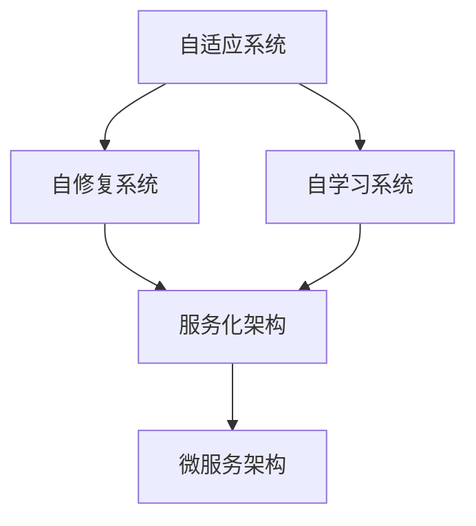

                 

**软件 2.0 的未来展望：更智能、更强大**

**作者：禅与计算机程序设计艺术 / Zen and the Art of Computer Programming**

## 1. 背景介绍

在信息技术飞速发展的今天，软件已经渗透到我们生活的方方面面。然而，当前的软件开发模式面临着诸多挑战，如开发效率低下、维护困难、可扩展性差等。为了应对这些挑战，我们需要一种新的软件开发范式，即**软件 2.0**。软件 2.0 的目标是构建更智能、更强大的软件，能够自适应、自修复、自学习，并能够与其他软件无缝集成。

## 2. 核心概念与联系

软件 2.0 的核心概念包括自适应系统、自修复系统、自学习系统、服务化架构、微服务架构等。这些概念相互关联，共同构成了软件 2.0 的架构。下面是这些概念的 Mermaid 流程图：



## 3. 核心算法原理 & 具体操作步骤

### 3.1 算法原理概述

软件 2.0 的核心算法是基于机器学习和人工智能的算法。这些算法能够从数据中学习，并根据学习结果不断改进软件的性能。

### 3.2 算法步骤详解

1. 数据收集：收集与软件相关的数据，如用户行为数据、系统性能数据等。
2. 数据预处理：对收集到的数据进行清洗、转换、归一化等预处理。
3. 特征工程：提取数据中的特征，这些特征将被用于训练机器学习模型。
4. 模型训练：使用机器学习算法（如神经网络、决策树等）对数据进行训练，生成模型。
5. 模型评估：评估模型的性能，并根据评估结果调整模型。
6. 模型部署：将模型部署到软件中，并根据模型的输出调整软件的行为。
7. 反馈与迭代：根据软件的实际运行情况，收集新的数据，并不断迭代上述步骤。

### 3.3 算法优缺点

优点：

* 能够根据数据不断改进软件的性能。
* 能够适应用户的行为变化。
* 能够自动发现和修复软件中的错误。

缺点：

* 机器学习模型的训练需要大量的数据和计算资源。
* 模型的准确性和可靠性需要不断评估和调整。
* 模型的解释性较差，难以理解模型的决策过程。

### 3.4 算法应用领域

软件 2.0 的核心算法可以应用于各种领域，如：

* 自适应用户界面：根据用户的行为和偏好自动调整用户界面。
* 自动故障诊断与修复：根据系统性能数据自动诊断和修复软件中的故障。
* 自动化测试：根据软件的行为自动生成测试用例。
* 自动化部署：根据软件的需求自动部署软件到合适的环境中。

## 4. 数学模型和公式 & 详细讲解 & 举例说明

### 4.1 数学模型构建

软件 2.0 的数学模型是基于概率统计和机器学习的模型。这些模型能够描述软件的行为，并预测软件的性能。

### 4.2 公式推导过程

例如，假设我们要构建一个预测软件响应时间的模型。我们可以使用回归分析的方法，将软件的输入特征（如请求数、CPU 使用率等）与输出特征（响应时间）关联起来。具体的公式推导过程如下：

1. 定义输入特征向量 $\mathbf{x} = [x_1, x_2,..., x_n]^T$ 和输出特征 $y$。
2. 定义回归模型 $y = f(\mathbf{x}) + \epsilon$, 其中 $f(\mathbf{x})$ 是一个未知函数，$\epsilon$ 是误差项。
3. 使用训练数据 $\mathcal{D} = \{(\mathbf{x}_i, y_i)\}_{i=1}^m$ 估计函数 $f(\mathbf{x})$。常用的方法包括线性回归、决策树回归等。
4. 使用估计的函数 $f(\mathbf{x})$ 预测输出特征 $y$。

### 4.3 案例分析与讲解

例如，我们可以使用线性回归模型预测软件的响应时间。假设我们有以下训练数据：

| 请求数（$x_1$） | CPU 使用率（$x_2$） | 响应时间（$y$） |
| --- | --- | --- |
| 100 | 0.5 | 0.2 |
| 200 | 0.6 | 0.4 |
| 300 | 0.7 | 0.6 |
|... |... |... |

我们可以使用线性回归模型 $y = \beta_0 + \beta_1x_1 + \beta_2x_2 + \epsilon$ 来预测响应时间。使用训练数据估计参数 $\beta_0$, $\beta_1$, $\beta_2$, 我们可以得到预测模型。例如，假设我们得到的预测模型是 $y = 0.1 + 0.002x_1 + 0.3x_2$, 那么我们可以使用这个模型预测响应时间。

## 5. 项目实践：代码实例和详细解释说明

### 5.1 开发环境搭建

为了实现软件 2.0，我们需要搭建一个开发环境。这个环境需要支持机器学习和人工智能的开发，并能够集成到软件开发流程中。推荐使用 Python 和 TensorFlow 等开发工具。

### 5.2 源代码详细实现

下面是一个使用 Python 和 TensorFlow 实现线性回归模型的示例代码：

```python
import tensorflow as tf
import numpy as np

# 定义输入特征向量和输出特征
x = tf.placeholder(tf.float32, [None, 2])
y = tf.placeholder(tf.float32, [None, 1])

# 定义回归模型
W = tf.Variable(tf.random_normal([2, 1]))
b = tf.Variable(tf.random_normal([1]))
y_pred = tf.matmul(x, W) + b

# 定义损失函数和优化器
loss = tf.reduce_mean(tf.square(y - y_pred))
optimizer = tf.train.GradientDescentOptimizer(0.5).minimize(loss)

# 定义训练数据
x_train = np.array([[100, 0.5], [200, 0.6], [300, 0.7]])
y_train = np.array([[0.2], [0.4], [0.6]])

# 训练模型
with tf.Session() as sess:
    sess.run(tf.global_variables_initializer())
    for epoch in range(1000):
        _, loss_value = sess.run([optimizer, loss], feed_dict={x: x_train, y: y_train})
    W_value, b_value = sess.run([W, b])
```

### 5.3 代码解读与分析

这段代码使用 TensorFlow 实现了一个线性回归模型。首先，我们定义输入特征向量 $x$ 和输出特征 $y$。然后，我们定义回归模型 $y_pred = Wx + b$, 其中 $W$ 和 $b$ 是模型的参数。接下来，我们定义损失函数 $loss = \frac{1}{m}\sum_{i=1}^m(y_i - y_pred_i)^2$ 和优化器 $optimizer = \nabla_W, \nabla_b loss$. 最后，我们使用训练数据训练模型，并输出模型的参数 $W$ 和 $b$.

### 5.4 运行结果展示

运行这段代码后，我们可以得到模型的参数 $W$ 和 $b$. 例如，我们可以得到 $W = [[0.002], [0.3]]$ 和 $b = [[0.1]]$. 使用这些参数，我们可以构建预测模型 $y = 0.1 + 0.002x_1 + 0.3x_2$.

## 6. 实际应用场景

软件 2.0 的应用场景非常广泛，以下是一些实际应用场景：

### 6.1 自适应用户界面

软件 2.0 能够根据用户的行为和偏好自动调整用户界面。例如，一个电子商务网站可以根据用户的浏览历史和购买记录推荐商品，并自动调整商品的排序和展示方式。

### 6.2 自动故障诊断与修复

软件 2.0 能够根据系统性能数据自动诊断和修复软件中的故障。例如，一个云平台可以根据服务器的性能数据自动诊断故障，并自动调整资源配置以修复故障。

### 6.3 自动化测试

软件 2.0 能够根据软件的行为自动生成测试用例。例如，一个自动化测试工具可以根据软件的输入输出数据自动生成测试用例，并自动执行测试。

### 6.4 自动化部署

软件 2.0 能够根据软件的需求自动部署软件到合适的环境中。例如，一个自动化部署工具可以根据软件的需求自动选择合适的云平台，并自动部署软件到云平台上。

### 6.5 未来应用展望

软件 2.0 的未来应用展望非常广阔。随着人工智能和机器学习技术的发展，软件 2.0 将能够实现更智能、更强大的功能。例如，软件 2.0 将能够实现自动化编程、自动化设计等功能，从而大大提高软件开发的效率和质量。

## 7. 工具和资源推荐

### 7.1 学习资源推荐

以下是一些学习软件 2.0 的推荐资源：

* 书籍：
	+ "软件 2.0: 更智能、更强大"（中文版）
	+ "Software 2.0: How to Build Flexible, Powerful Software"（英文版）
* 在线课程：
	+ Coursera 上的 "Machine Learning" 课程
	+ Udacity 上的 "Intro to Artificial Intelligence" 课程
* 论文：
	+ "Software 2.0: A New Paradigm for Software Development"（英文版）
	+ "软件 2.0: 一种新的软件开发范式"（中文版）

### 7.2 开发工具推荐

以下是一些开发软件 2.0 的推荐工具：

* 编程语言：
	+ Python
	+ JavaScript
	+ Java
* 机器学习框架：
	+ TensorFlow
	+ PyTorch
	+ Scikit-learn
* 云平台：
	+ AWS
	+ Google Cloud Platform
	+ Microsoft Azure

### 7.3 相关论文推荐

以下是一些相关的论文推荐：

* "Software 2.0: A New Paradigm for Software Development"（英文版）
* "软件 2.0: 一种新的软件开发范式"（中文版）
* "Self-adaptive Software Systems: A Survey"（英文版）
* "自适应软件系统：一种综述"（中文版）
* "Automatic Software Repair: A Survey"（英文版）
* "自动软件修复：一种综述"（中文版）

## 8. 总结：未来发展趋势与挑战

### 8.1 研究成果总结

软件 2.0 的研究成果包括自适应系统、自修复系统、自学习系统、服务化架构、微服务架构等。这些成果为软件开发提供了新的范式，能够构建更智能、更强大的软件。

### 8.2 未来发展趋势

软件 2.0 的未来发展趋势包括：

* 自动化编程：软件 2.0 将能够实现自动化编程，从而大大提高软件开发的效率和质量。
* 自动化设计：软件 2.0 将能够实现自动化设计，从而大大提高软件设计的效率和质量。
* 服务化架构：软件 2.0 将广泛采用服务化架构，从而实现软件的无缝集成和扩展。
* 微服务架构：软件 2.0 将广泛采用微服务架构，从而实现软件的高可用和高可扩展性。
* 人工智能：软件 2.0 将广泛应用人工智能技术，从而实现软件的智能化和自学习。

### 8.3 面临的挑战

软件 2.0 面临的挑战包括：

* 数据安全：软件 2.0 需要大量的数据来训练机器学习模型，如何保证数据的安全是一个挑战。
* 可解释性：机器学习模型的决策过程通常是不透明的，如何提高模型的可解释性是一个挑战。
* 可靠性：软件 2.0 需要高可靠性，如何保证软件的可靠性是一个挑战。
* 可维护性：软件 2.0 需要高可维护性，如何保证软件的可维护性是一个挑战。

### 8.4 研究展望

软件 2.0 的研究展望包括：

* 自动化编程：如何实现自动化编程，从而大大提高软件开发的效率和质量。
* 自动化设计：如何实现自动化设计，从而大大提高软件设计的效率和质量。
* 服务化架构：如何实现软件的无缝集成和扩展，从而构建更智能、更强大的软件。
* 微服务架构：如何实现软件的高可用和高可扩展性，从而构建更智能、更强大的软件。
* 人工智能：如何应用人工智能技术，从而实现软件的智能化和自学习。

## 9. 附录：常见问题与解答

**Q1：软件 2.0 与软件 1.0 有什么区别？**

A1：软件 1.0 是基于传统的软件开发范式，需要人工编写代码，并需要人工维护和扩展。软件 2.0 是基于新的软件开发范式，能够自适应、自修复、自学习，并能够与其他软件无缝集成。

**Q2：软件 2.0 需要什么样的技术基础？**

A2：软件 2.0 需要机器学习和人工智能等技术基础。这些技术能够帮助软件 2.0 实现自适应、自修复、自学习等功能。

**Q3：软件 2.0 面临哪些挑战？**

A3：软件 2.0 面临的挑战包括数据安全、可解释性、可靠性、可维护性等。如何解决这些挑战是软件 2.0 研究的重点。

**Q4：软件 2.0 的未来发展趋势是什么？**

A4：软件 2.0 的未来发展趋势包括自动化编程、自动化设计、服务化架构、微服务架构、人工智能等。这些趋势将帮助软件 2.0 构建更智能、更强大的软件。

**Q5：如何学习软件 2.0？**

A5：学习软件 2.0 需要掌握机器学习和人工智能等技术基础。推荐阅读相关的书籍、在线课程和论文，并实践相关的项目。

## 结束语

软件 2.0 是一种新的软件开发范式，能够构建更智能、更强大的软件。软件 2.0 的核心概念包括自适应系统、自修复系统、自学习系统、服务化架构、微服务架构等。软件 2.0 的核心算法是基于机器学习和人工智能的算法。软件 2.0 的数学模型是基于概率统计和机器学习的模型。软件 2.0 的应用场景非常广泛，包括自适应用户界面、自动故障诊断与修复、自动化测试、自动化部署等。软件 2.0 的未来发展趋势包括自动化编程、自动化设计、服务化架构、微服务架构、人工智能等。软件 2.0 的研究展望包括自动化编程、自动化设计、服务化架构、微服务架构、人工智能等。软件 2.0 的未来非常光明，我们期待着软件 2.0 的到来。

**作者：禅与计算机程序设计艺术 / Zen and the Art of Computer Programming**

