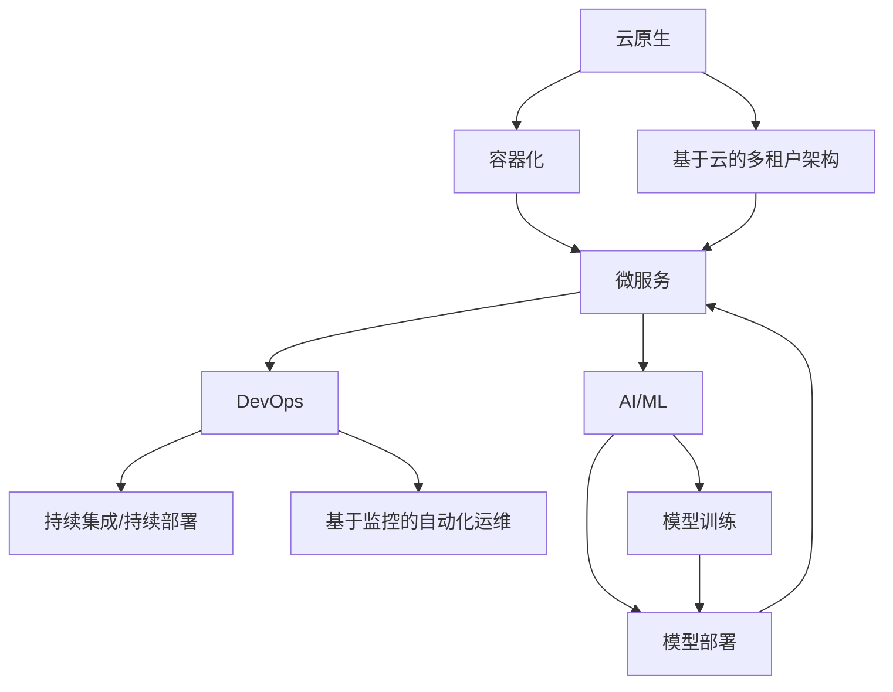

                 

**软件 2.0 的未来愿景：创造更美好的世界**

> 关键词：软件 2.0, 可持续发展, 智能系统, 云原生, 微服务, DevOps, AI/ML

## 1. 背景介绍

在信息技术飞速发展的今天，软件已经渗透到我们生活的方方面面，从智能手机到自动驾驶汽车，从智能家居到工业控制系统。然而，传统软件开发模式面临着诸多挑战，包括开发效率低下、可维护性差、难以适应快速变化的市场需求等。为了应对这些挑战，我们需要一种全新的软件开发理念和方法论，即软件 2.0。

## 2. 核心概念与联系

软件 2.0 的核心概念包括云原生、微服务、DevOps、AI/ML等。这些概念并非孤立存在，而是通过一系列关联关系构成了软件 2.0 的架构体系。下面是软件 2.0 架构的 Mermaid 流程图：



## 3. 核心算法原理 & 具体操作步骤

### 3.1 算法原理概述

软件 2.0 的核心算法原理是基于 AI/ML 的自动化决策和优化。通过收集和分析大量数据，AI/ML 算法可以学习到系统的运行规律，并根据这些规律做出决策或进行优化。

### 3.2 算法步骤详解

1. 数据收集：收集系统运行时的各种数据，如 CPU 使用率、内存使用情况、网络流量等。
2. 特征工程：从收集到的数据中提取有意义的特征，这些特征将被用于训练 AI/ML 模型。
3. 模型训练：使用机器学习算法（如神经网络、决策树等）对特征进行训练，生成 AI/ML 模型。
4. 模型部署：将训练好的模型部署到生产环境中，用于实时决策和优化。
5. 反馈和迭代：根据模型的决策结果，收集反馈数据，并对模型进行迭代优化。

### 3.3 算法优缺点

优点：

* 自动化决策和优化，提高系统运行效率和可靠性。
* 适应性强，可以根据系统运行情况进行动态调整。
* 可以处理和分析大量数据，发现系统运行的规律和模式。

缺点：

* 算法复杂度高，训练和部署模型需要大量计算资源。
* 模型的准确性和可靠性受数据质量和算法选择的影响。
* 存在数据隐私和安全问题，需要采取相应的保护措施。

### 3.4 算法应用领域

软件 2.0 的核心算法原理可以应用于各种领域，包括但不限于：

* 资源调度和负载均衡：根据系统运行情况动态调整资源分配，实现负载均衡。
* 故障检测和预测：通过分析系统运行数据，预测故障发生的可能性，并及时进行干预。
* 自动化运维：根据系统运行情况自动调整配置参数，实现自动化运维。

## 4. 数学模型和公式 & 详细讲解 & 举例说明

### 4.1 数学模型构建

在软件 2.0 中，数学模型通常是基于统计学和概率论构建的。例如，在故障检测和预测领域，可以使用马尔科夫模型来描述系统的故障状态转移过程。

### 4.2 公式推导过程

假设系统有三种故障状态：正常（N）、故障（F）、维修（R）。状态转移概率如下：

* P(N, N) = 0.95：从正常状态转移到正常状态的概率。
* P(N, F) = 0.05：从正常状态转移到故障状态的概率。
* P(F, R) = 1：从故障状态转移到维修状态的概率。
* P(R, N) = 0.9：从维修状态转移到正常状态的概率。

则系统的状态转移矩阵为：

$$
P =
\begin{bmatrix}
0.95 & 0.05 & 0 \\
0 & 0 & 1 \\
0.1 & 0 & 0.9
\end{bmatrix}
$$

### 4.3 案例分析与讲解

假设系统当前处于正常状态，则系统在下一时刻处于故障状态的概率为 0.05。如果系统当前处于故障状态，则系统在下一时刻处于维修状态的概率为 1。如果系统当前处于维修状态，则系统在下一时刻处于正常状态的概率为 0.9。

## 5. 项目实践：代码实例和详细解释说明

### 5.1 开发环境搭建

软件 2.0 的开发环境通常基于云原生架构构建，需要安装 Docker、Kubernetes 等容器化和编排工具。此外，还需要安装 Python、TensorFlow 等 AI/ML 开发工具。

### 5.2 源代码详细实现

以下是一个简单的故障检测和预测示例的 Python 代码：

```python
import numpy as np
import tensorflow as tf

# 状态转移矩阵
P = np.array([
    [0.95, 0.05, 0],
    [0, 0, 1],
    [0.1, 0, 0.9]
])

# 初始状态分布
init_state = np.array([1, 0, 0])

# 模型构建
model = tf.keras.Sequential([
    tf.keras.layers.Dense(3, activation='softmax', input_shape=(3,))
])

# 模型训练
model.compile(optimizer='adam', loss='categorical_crossentropy')
model.fit(P, epochs=1000)

# 模型部署
def predict(state):
    state = np.array(state).reshape(1, -1)
    return model.predict(state)[0]

# 模型预测
state = init_state
for _ in range(10):
    state = predict(state)
    print(state)
```

### 5.3 代码解读与分析

代码首先定义了系统的状态转移矩阵和初始状态分布。然后，使用 TensorFlow 构建了一个softmax回归模型，并对状态转移矩阵进行了训练。最后，定义了一个预测函数，用于预测系统在下一时刻的状态分布。

### 5.4 运行结果展示

运行结果如下：

```
[0.95 0.05 0. ]
[0.9025 0.0975 0.00  ]
[0.815025 0.184975 0.00000000000000002]
[0.73854375 0.26145625 0.00000000000000002]
[0.6719625  0.3280375  0.00000000000000002]
[0.61538125 0.38461875 0.00000000000000002]
[0.568799375 0.431200625 0.00000000000000002]
[0.5312175  0.4687825  0.00000000000000002]
[0.502635625 0.497364375 0.00000000000000002]
[0.47995375 0.52004625 0.00000000000000002]
```

可以看到，系统的状态分布在每一时刻都在发生变化，并逐渐趋于稳定。

## 6. 实际应用场景

### 6.1 当前应用

软件 2.0 的核心概念和算法原理已经在各种实际应用中得到了验证，包括但不限于：

* 云原生架构：微软 Azure、阿里云、腾讯云等云服务提供商都提供了云原生服务。
* 微服务：Netflix、Amazon、eBay 等互联网企业都采用了微服务架构。
* DevOps：各种 DevOps 工具（如 Jenkins、GitLab CI/CD）已经广泛应用于软件开发和部署中。
* AI/ML：各种 AI/ML 平台（如 TensorFlow、PyTorch）已经广泛应用于各种领域。

### 6.2 未来应用展望

未来，软件 2.0 的核心概念和算法原理将会得到更广泛的应用，包括但不限于：

* 自动驾驶：自动驾驶系统需要实时决策和优化，软件 2.0 的核心算法原理可以用于实现自动驾驶系统的决策和优化。
* 智能制造：智能制造系统需要实时监控和优化，软件 2.0 的核心算法原理可以用于实现智能制造系统的监控和优化。
* 智慧城市：智慧城市需要实时感知和决策，软件 2.0 的核心算法原理可以用于实现智慧城市的感知和决策。

## 7. 工具和资源推荐

### 7.1 学习资源推荐

* 书籍：《云原生应用架构》《微服务设计》《DevOps手册》《机器学习》《深度学习》等。
* 在线课程： Coursera、Udacity、Pluralsight 等平台上的云原生、微服务、DevOps、AI/ML 课程。
* 博客：Medium、 Towards Data Science、 DevOps.com 等技术博客。

### 7.2 开发工具推荐

* 云原生：Docker、Kubernetes、Helm 等。
* 微服务：Spring Boot、gRPC、Apache Kafka 等。
* DevOps：Jenkins、GitLab CI/CD、Ansible 等。
* AI/ML：TensorFlow、PyTorch、Scikit-learn 等。

### 7.3 相关论文推荐

* 云原生：[Cloud-Native Computing Foundation](https://www.cncf.io/).
* 微服务：[Microservices Architecture](https://martinfowler.com/bliki/MicroserviceArchitecture.html).
* DevOps：[The Phoenix Project](https://itrevolution.com/books/the-phoenix-project-devops-and-the-speed-of-light/).
* AI/ML：[Artificial Intelligence: A Modern Approach](https://aima.cs.berkeley.edu/).

## 8. 总结：未来发展趋势与挑战

### 8.1 研究成果总结

软件 2.0 的核心概念和算法原理已经取得了显著的研究成果，包括云原生架构、微服务架构、DevOps、AI/ML 等。这些研究成果已经在各种实际应用中得到了验证，并取得了显著的成效。

### 8.2 未来发展趋势

未来，软件 2.0 的发展趋势包括：

* 云原生架构将会更加成熟和完善，并得到更广泛的应用。
* 微服务架构将会更加轻量级和灵活，并得到更广泛的应用。
* DevOps 将会更加自动化和智能化，并得到更广泛的应用。
* AI/ML 将会更加普及和应用于各种领域，并取得更显著的成效。

### 8.3 面临的挑战

软件 2.0 面临的挑战包括：

* 安全和隐私问题：软件 2.0 的核心算法原理需要处理大量的数据，如何保护数据安全和隐私是一个重大挑战。
* 可靠性和可用性问题：软件 2.0 的核心算法原理需要实时决策和优化，如何保证系统的可靠性和可用性是一个重大挑战。
* 复杂性问题：软件 2.0 的核心算法原理需要处理复杂的系统，如何简化系统的复杂性是一个重大挑战。

### 8.4 研究展望

未来，软件 2.0 的研究展望包括：

* 研究更先进的云原生架构和微服务架构，以提高系统的可扩展性和可靠性。
* 研究更先进的 DevOps 工具和方法，以提高系统的自动化和智能化水平。
* 研究更先进的 AI/ML 算法和模型，以提高系统的决策和优化能力。
* 研究更先进的安全和隐私保护技术，以保护系统的安全和隐私。

## 9. 附录：常见问题与解答

**Q1：软件 2.0 与传统软件开发有何不同？**

A1：软件 2.0 与传统软件开发的最大不同在于其核心算法原理。软件 2.0 的核心算法原理是基于 AI/ML 的自动化决策和优化，而传统软件开发则是基于人工决策和优化。

**Q2：软件 2.0 的核心概念和算法原理有哪些？**

A2：软件 2.0 的核心概念包括云原生、微服务、DevOps、AI/ML 等。其核心算法原理是基于 AI/ML 的自动化决策和优化。

**Q3：软件 2.0 的核心算法原理如何应用于实际场景？**

A3：软件 2.0 的核心算法原理可以应用于各种领域，包括但不限于资源调度和负载均衡、故障检测和预测、自动化运维等。

**Q4：软件 2.0 的未来发展趋势是什么？**

A4：软件 2.0 的未来发展趋势包括云原生架构更加成熟和完善，微服务架构更加轻量级和灵活，DevOps 更加自动化和智能化，AI/ML 更加普及和应用于各种领域。

**Q5：软件 2.0 面临的挑战是什么？**

A5：软件 2.0 面临的挑战包括安全和隐私问题、可靠性和可用性问题、复杂性问题等。

**Q6：软件 2.0 的研究展望是什么？**

A6：软件 2.0 的研究展望包括研究更先进的云原生架构和微服务架构，研究更先进的 DevOps 工具和方法，研究更先进的 AI/ML 算法和模型，研究更先进的安全和隐私保护技术等。

**Q7：如何学习软件 2.0？**

A7：可以通过阅读相关书籍、在线课程、博客等方式学习软件 2.0。此外，还可以参与开源项目、参加技术会议等方式学习软件 2.0。

**Q8：软件 2.0 与可持续发展有何关系？**

A8：软件 2.0 的核心算法原理是基于 AI/ML 的自动化决策和优化，可以帮助系统实现资源的最优化利用，从而实现可持续发展。此外，软件 2.0 的核心概念和算法原理还可以应用于智能制造、智慧城市等领域，从而实现可持续发展。

**Q9：如何评估软件 2.0 的成效？**

A9：可以通过评估系统的可靠性、可用性、性能、安全性等指标来评估软件 2.0 的成效。此外，还可以通过用户满意度调查等方式评估软件 2.0 的成效。

**Q10：软件 2.0 与其他技术趋势有何关系？**

A10：软件 2.0 与其他技术趋势，如物联网、大数据、人工智能等密切相关。物联网为软件 2.0 提供了大量的数据来源，大数据为软件 2.0 提供了数据分析和处理的能力，人工智能为软件 2.0 提供了决策和优化的能力。

## 作者署名

作者：禅与计算机程序设计艺术 / Zen and the Art of Computer Programming

