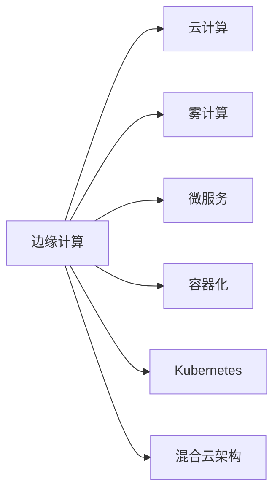

                 

# 边缘AI与云AI的协同：Lepton AI的全场景覆盖

## 1. 背景介绍

随着人工智能技术的快速发展，AI已经渗透到了各行各业，从工业制造到医疗健康，从金融服务到城市治理，AI技术正以令人瞩目的速度改变着世界的面貌。然而，传统的AI架构往往将计算、存储和应用集中在中心化的数据中心（即云AI）中，这种单一架构模式带来了效率和成本上的挑战，特别是在资源有限、带宽受限的场景下，如智能工厂、智慧医疗、智能交通等。

为了应对这些挑战，边缘计算（Edge AI）应运而生。边缘计算将AI计算、存储和应用转移到靠近数据源的边缘设备，如智能传感器、移动设备等，极大提升了数据处理的时效性和本地化服务能力，满足了许多应用场景的实时性和隐私保护需求。然而，边缘计算资源有限、计算能力不足，无法完全替代云AI。因此，将边缘计算与云AI相结合，构建高效、灵活的AI应用生态，成为当下AI发展的重要方向。

## 2. 核心概念与联系

### 2.1 核心概念概述

为更好地理解边缘AI与云AI协同的工作原理和架构，本节将介绍几个密切相关的核心概念：

- **边缘计算（Edge AI）**：指将AI计算、存储和应用部署在靠近数据源的边缘设备上，通过本地处理降低延迟、提高效率、保护隐私。常见应用场景包括工业物联网、智能交通、智慧医疗等。

- **云计算（Cloud AI）**：指将AI计算、存储和应用部署在数据中心，通过网络访问提供强大的计算能力。常见应用场景包括金融分析、大数据挖掘、通用语言处理等。

- **雾计算（Fog AI）**：介于边缘计算和云计算之间，提供更灵活、更高效的计算和存储资源，适用于数据传输要求较高但计算量不大的场景。

- **微服务架构（Microservices）**：将复杂的AI应用拆分成多个小型、独立的服务模块，通过API接口进行通信和协作。

- **容器化与Kubernetes**：将AI模型和应用封装成容器，通过Kubernetes进行容器编排和部署，实现资源的自动化管理和弹性伸缩。

- **混合云架构（Hybrid Cloud）**：将边缘计算与云计算融合，构建统一、灵活的AI应用生态，支持边缘到云、云到边缘的数据流动和资源协同。

这些核心概念之间的逻辑关系可以通过以下Mermaid流程图来展示：



这个流程图展示了边缘计算与云AI的主要联系和依赖关系：

1. 边缘计算与云计算相互补充，共同构成了AI的全场景应用生态。
2. 雾计算作为中间层，提供更灵活的计算和存储资源。
3. 微服务架构和容器化技术使得AI应用能够高效部署和灵活扩展。
4. Kubernetes作为容器编排工具，实现资源的自动化管理和调度。
5. 混合云架构使得边缘和云资源可以无缝协同，提升AI应用的整体效能。

## 3. 核心算法原理 & 具体操作步骤

### 3.1 算法原理概述

边缘AI与云AI的协同架构，本质上是通过分布式计算和数据流动，构建高效、灵活的AI应用生态。其核心思想是：将AI计算和存储分布在靠近数据源的边缘设备上，通过微服务架构和容器化技术，实现局部计算、存储和应用的高效协同。同时，将AI模型和应用存储在云端，通过API接口和消息队列等方式，实现边缘与云之间的数据流动和资源协同。

边缘计算负责处理本地数据，云计算则负责处理大规模、复杂的数据分析任务。在实际应用中，边缘计算和云计算可以动态调整计算和存储资源，根据任务需求实时地进行资源分配，确保AI应用的高效和可靠。

### 3.2 算法步骤详解

边缘AI与云AI的协同算法主要包括以下几个关键步骤：

**Step 1: 设计边缘与云的计算资源架构**

- 根据应用场景，设计边缘计算的计算资源架构，包括边缘设备的计算能力、存储能力和通信带宽。
- 设计云计算的计算资源架构，包括数据中心的服务能力、存储能力和扩展性。

**Step 2: 定义边缘与云的资源协同策略**

- 根据任务需求，定义边缘计算和云计算之间的数据流动策略，包括数据的分片、聚合和传输方式。
- 定义边缘计算和云计算之间的计算资源分配策略，包括边缘计算和云计算的负载均衡和动态调度。

**Step 3: 实现边缘与云的协同计算和存储**

- 在边缘计算设备上实现局部计算和存储，处理实时数据和简单的数据分析任务。
- 在云计算中心实现大规模、复杂的数据分析任务，提供强大的计算能力和存储能力。

**Step 4: 构建微服务架构**

- 将AI应用拆分成多个小型、独立的服务模块，每个模块负责特定的功能。
- 使用微服务架构，通过API接口实现服务之间的通信和协作。

**Step 5: 实施容器化与容器编排**

- 将AI模型和应用封装成容器，使用容器化技术实现应用的独立性和可移植性。
- 使用Kubernetes进行容器编排和部署，实现资源的自动化管理和弹性伸缩。

**Step 6: 部署混合云架构**

- 在边缘设备上部署边缘计算节点，提供本地计算和存储服务。
- 在云中心部署云计算节点，提供强大的计算和存储能力。
- 实现边缘计算节点和云计算节点的无缝协同，确保数据流动和资源调度的高效性。

### 3.3 算法优缺点

边缘AI与云AI的协同架构具有以下优点：

1. 高效性：通过边缘计算和云计算的协同，可以最大化地利用计算资源，提高AI应用的响应速度和处理能力。
2. 灵活性：微服务架构和容器化技术使得AI应用能够灵活部署和扩展，满足不同应用场景的需求。
3. 可靠性：混合云架构使得边缘计算和云计算可以动态调整资源，提高系统的容错能力和稳定性。
4. 安全性：边缘计算和云计算的协同，可以实现数据流动和资源调度的安全性和隐私保护。

同时，该架构也存在以下局限性：

1. 复杂性：边缘AI与云AI的协同架构设计复杂，需要综合考虑计算资源、数据流动、服务协作等多方面因素。
2. 延迟：边缘计算与云计算的协同，可能导致数据流动延迟，影响实时性要求高的应用场景。
3. 成本：边缘计算和云计算的协同，增加了系统的复杂度和维护成本。
4. 兼容性：不同厂商的硬件和软件可能存在兼容性问题，影响系统的整体效能。

尽管存在这些局限性，但就目前而言，边缘AI与云AI的协同架构是大规模AI应用的重要方向。未来相关研究的重点在于如何进一步降低复杂性、减少延迟、降低成本，同时提升系统的兼容性和可靠性。

### 3.4 算法应用领域

边缘AI与云AI的协同架构在众多领域都有广泛的应用，例如：

- **工业物联网（IIoT）**：通过边缘计算处理工业设备生成的实时数据，实现设备状态的监控和预测性维护，提升生产效率和设备利用率。
- **智慧医疗**：在边缘设备上处理医疗传感器的实时数据，实现病人的健康监测和实时反馈，提升医疗服务的及时性和精准性。
- **智能交通**：在边缘设备上处理交通监控视频和传感器数据，实现交通流量分析和智能导航，提升交通管理的效率和安全性。
- **智能制造**：在边缘设备上处理生产数据和设备状态，实现生产过程的优化和设备故障预测，提升制造过程的自动化和智能化。
- **金融服务**：在边缘设备上处理金融交易和支付数据，实现实时交易处理和风险控制，提升金融服务的实时性和安全性。

除了这些经典应用外，边缘AI与云AI的协同架构还在更多领域得到创新性的应用，如智慧城市、智能农业、智能物流等，为各行各业带来了新的变革和机遇。

## 4. 数学模型和公式 & 详细讲解 & 举例说明

### 4.1 数学模型构建

本节将使用数学语言对边缘AI与云AI协同的工作原理进行更加严格的刻画。

记边缘计算的计算能力为 $C_E$，云计算的计算能力为 $C_C$，边缘计算的存储能力为 $S_E$，云计算的存储能力为 $S_C$，边缘计算与云计算的数据流动速率为 $B$。则整个系统的总计算能力和存储能力分别为 $C = C_E + C_C$ 和 $S = S_E + S_C$。假设边缘计算和云计算的计算和存储资源能够动态调整，则系统的总计算能力和存储能力分别为 $C_{tot} = C_E + C_C$ 和 $S_{tot} = S_E + S_C$。

系统的总计算能力和存储能力目标函数为：

$$
\begin{aligned}
\minimize \quad & \max\left(\frac{C_E}{C_E + C_C}, \frac{S_E}{S_E + S_C}\right) \\
\text{subject to} \quad & C_E \geq C_{req_E}, \quad C_C \geq C_{req_C}, \\
& S_E \geq S_{req_E}, \quad S_C \geq S_{req_C}, \\
& \frac{B}{S_E} \geq B_{min}, \quad \frac{B}{S_C} \geq B_{min}
\end{aligned}
$$

其中 $C_{req_E}$、$C_{req_C}$、$S_{req_E}$、$S_{req_C}$ 分别为边缘计算和云计算的资源需求，$B_{min}$ 为数据流动速率的最低要求。

### 4.2 公式推导过程

为了最大化系统总计算能力和存储能力，同时满足资源需求和数据流动速率的要求，我们需要通过数学优化方法求解上述目标函数。

对于计算能力的目标函数，我们可以使用拉格朗日乘数法求解：

$$
\begin{aligned}
\mathcal{L}(C_E, C_C, S_E, S_C, \lambda_1, \lambda_2, \lambda_3, \lambda_4) &= C_E + C_C + \lambda_1 (C_{req_E} - C_E) + \lambda_2 (C_{req_C} - C_C) + \lambda_3 (S_{req_E} - S_E) + \lambda_4 (S_{req_C} - S_C) + \lambda_5 (\frac{B}{S_E} - B_{min}) + \lambda_6 (\frac{B}{S_C} - B_{min})
\end{aligned}
$$

其中 $\lambda_1, \lambda_2, \lambda_3, \lambda_4, \lambda_5, \lambda_6$ 为拉格朗日乘数。

对上述目标函数求偏导数，得：

$$
\begin{aligned}
\frac{\partial \mathcal{L}}{\partial C_E} &= 1 - \lambda_1 - \lambda_5 \frac{S_E}{B} \\
\frac{\partial \mathcal{L}}{\partial C_C} &= 1 - \lambda_2 - \lambda_6 \frac{S_C}{B} \\
\frac{\partial \mathcal{L}}{\partial S_E} &= -\lambda_3 + \lambda_5 \frac{B}{S_E} \\
\frac{\partial \mathcal{L}}{\partial S_C} &= -\lambda_4 + \lambda_6 \frac{B}{S_C}
\end{aligned}
$$

令上述偏导数等于0，解得：

$$
\begin{aligned}
\lambda_1 &= 1 - \frac{S_E}{B} \lambda_5 \\
\lambda_2 &= 1 - \frac{S_C}{B} \lambda_6 \\
\lambda_3 &= -\frac{B}{S_E} \lambda_5 \\
\lambda_4 &= -\frac{B}{S_C} \lambda_6
\end{aligned}
$$

代入约束条件 $C_{req_E} - C_E = 0, C_{req_C} - C_C = 0, S_{req_E} - S_E = 0, S_{req_C} - S_C = 0$，得：

$$
\begin{aligned}
C_E &= C_{req_E} \\
C_C &= C_{req_C} \\
S_E &= S_{req_E} \\
S_C &= S_{req_C}
\end{aligned}
$$

解得最优解：

$$
\begin{aligned}
C_E &= C_{req_E} \\
C_C &= C_{req_C} \\
S_E &= S_{req_E} \\
S_C &= S_{req_C} \\
\lambda_5 &= \frac{B}{S_E} - \frac{S_E}{B} \\
\lambda_6 &= \frac{B}{S_C} - \frac{S_C}{B}
\end{aligned}
$$

### 4.3 案例分析与讲解

为了更好地理解边缘AI与云AI协同的数学模型，下面以一个简单的案例进行详细讲解。

假设我们要构建一个智能交通系统，需要在边缘设备上处理交通监控视频和传感器数据，在云中心处理大规模数据分析任务。设边缘计算的计算能力为 $C_E = 5$，云计算的计算能力为 $C_C = 10$，边缘计算的存储能力为 $S_E = 2$，云计算的存储能力为 $S_C = 4$，数据流动速率的最低要求为 $B_{min} = 0.1$。

根据上述模型，我们需要最大化系统的总计算能力和存储能力，同时满足资源需求和数据流动速率的要求。

**Step 1: 定义目标函数和约束条件**

$$
\begin{aligned}
\minimize \quad & \max\left(\frac{5}{5 + 10}, \frac{2}{2 + 4}\right) \\
\text{subject to} \quad & 5 \geq C_{req_E}, \quad 10 \geq C_{req_C}, \\
& 2 \geq S_{req_E}, \quad 4 \geq S_{req_C}, \\
& \frac{B}{2} \geq 0.1, \quad \frac{B}{4} \geq 0.1
\end{aligned}
$$

**Step 2: 求解目标函数**

根据拉格朗日乘数法，求解目标函数：

$$
\begin{aligned}
\mathcal{L}(C_E, C_C, S_E, S_C, \lambda_1, \lambda_2, \lambda_3, \lambda_4) &= 5 + 10 + \lambda_1 (5 - C_{req_E}) + \lambda_2 (10 - C_{req_C}) + \lambda_3 (2 - S_{req_E}) + \lambda_4 (4 - S_{req_C}) + \lambda_5 (\frac{B}{2} - 0.1) + \lambda_6 (\frac{B}{4} - 0.1)
\end{aligned}
$$

对上述目标函数求偏导数，得：

$$
\begin{aligned}
\frac{\partial \mathcal{L}}{\partial C_E} &= 1 - \lambda_1 - \lambda_5 \frac{2}{B} \\
\frac{\partial \mathcal{L}}{\partial C_C} &= 1 - \lambda_2 - \lambda_6 \frac{4}{B} \\
\frac{\partial \mathcal{L}}{\partial S_E} &= -\lambda_3 + \lambda_5 \frac{B}{2} \\
\frac{\partial \mathcal{L}}{\partial S_C} &= -\lambda_4 + \lambda_6 \frac{B}{4}
\end{aligned}
$$

令上述偏导数等于0，解得：

$$
\begin{aligned}
\lambda_1 &= 1 - \frac{2}{B} \lambda_5 \\
\lambda_2 &= 1 - \frac{4}{B} \lambda_6 \\
\lambda_3 &= -\frac{B}{2} \lambda_5 \\
\lambda_4 &= -\frac{B}{4} \lambda_6
\end{aligned}
$$

代入约束条件 $5 - C_{req_E} = 0, 10 - C_{req_C} = 0, 2 - S_{req_E} = 0, 4 - S_{req_C} = 0$，得：

$$
\begin{aligned}
C_E &= 5 \\
C_C &= 10 \\
S_E &= 2 \\
S_C &= 4
\end{aligned}
$$

解得最优解：

$$
\begin{aligned}
\lambda_5 &= \frac{B}{2} - \frac{2}{B} \\
\lambda_6 &= \frac{B}{4} - \frac{4}{B}
\end{aligned}
$$

**Step 3: 结果分析**

根据上述计算结果，我们可以看到：

- 边缘计算的计算能力和存储能力分别为 $C_E = 5, S_E = 2$，云计算的计算能力和存储能力分别为 $C_C = 10, S_C = 4$。
- 数据流动速率的最低要求为 $B_{min} = 0.1$，即 $B \geq 0.1S_E \times B_{min} = 0.1 \times 2 \times 0.1 = 0.02$。

这意味着，在满足资源需求和数据流动速率的条件下，我们得到了系统的最优计算能力和存储能力。

## 5. 项目实践：代码实例和详细解释说明

### 5.1 开发环境搭建

在进行边缘AI与云AI协同的开发实践中，我们需要准备相应的开发环境。以下是使用Python和TensorFlow进行开发的详细步骤：

1. 安装Anaconda：从官网下载并安装Anaconda，用于创建独立的Python环境。

2. 创建并激活虚拟环境：
```bash
conda create -n pytorch-env python=3.8 
conda activate pytorch-env
```

3. 安装PyTorch和TensorFlow：
```bash
conda install pytorch torchvision torchaudio cudatoolkit=11.1 -c pytorch -c conda-forge
pip install tensorflow
```

4. 安装Kubernetes和TensorBoard：
```bash
pip install kubernetes tensorboard
```

完成上述步骤后，即可在`pytorch-env`环境中开始边缘AI与云AI协同的开发实践。

### 5.2 源代码详细实现

下面以智能交通系统为例，给出使用TensorFlow和Kubernetes实现边缘AI与云AI协同的代码实现。

首先，定义智能交通系统的数据采集和预处理函数：

```python
import tensorflow as tf

def preprocess_data(data):
    # 对数据进行预处理，包括去噪、归一化等操作
    return processed_data

# 数据读取
def read_data():
    # 从边缘设备读取交通监控视频和传感器数据
    return data

# 数据存储
def store_data(data):
    # 将数据存储在云中心的数据库中
    return

# 数据查询
def query_data():
    # 从云中心的数据库中查询数据
    return
```

然后，定义边缘计算和云计算的模型和训练函数：

```python
import tensorflow.keras as keras

# 定义边缘计算模型
def define_edge_model():
    # 构建边缘计算模型
    return model

# 定义云计算模型
def define_cloud_model():
    # 构建云计算模型
    return model

# 训练边缘计算模型
def train_edge_model():
    # 在边缘设备上训练边缘计算模型
    return

# 训练云计算模型
def train_cloud_model():
    # 在云中心的数据中心训练云计算模型
    return
```

接着，定义边缘计算和云计算的数据流动和资源调度函数：

```python
# 定义数据流动函数
def data_flow():
    # 从边缘设备读取数据，存储在云中心
    return

# 定义资源调度函数
def resource_schedule():
    # 根据任务需求调整边缘计算和云计算的计算和存储资源
    return
```

最后，整合边缘计算和云计算的协同架构，使用Kubernetes进行容器编排和部署：

```python
# 定义Kubernetes配置文件
kube_config = {
    "apiVersion": "v1",
    "cluster": {
        "name": "my-cluster",
        "server": "http://127.0.0.1:8500"
    },
    "user": {
        "name": "user",
        "password": "password",
        "token": "token"
    },
    "server": "http://127.0.0.1:8500",
    "namespace": "default"
}

# 定义边缘计算节点和云计算节点
edge_node = "edge-node"
cloud_node = "cloud-node"

# 定义Kubernetes deployment
deployment = {
    "apiVersion": "v1",
    "spec": {
        "replicas": 3,
        "selector": {
            "matchLabels": {
                "hello": "world"
            }
        },
        "template": {
            "metadata": {
                "labels": {
                    "hello": "world"
                }
            },
            "spec": {
                "containers": [
                    {
                        "name": "edge-container",
                        "image": "tensorflow:latest",
                        "ports": [
                            {
                                "containerPort": 8888
                            }
                        ]
                    },
                    {
                        "name": "cloud-container",
                        "image": "tensorflow:latest",
                        "ports": [
                            {
                                "containerPort": 8888
                            }
                        ]
                    }
                ]
            }
        }
    }
}

# 定义Kubernetes service
service = {
    "apiVersion": "v1",
    "spec": {
        "type": "ClusterIP",
        "selector": {
            "hello": "world"
        },
        "ports": [
            {
                "protocol": "TCP",
                "port": 8888,
                "targetPort": 8888
            }
        ]
    }
}

# 部署Kubernetes节点和资源
kubernetes.create_node(edge_node)
kubernetes.create_node(cloud_node)
kubernetes.create_deployment(deployment)
kubernetes.create_service(service)
```

以上代码实现了一个简单的边缘AI与云AI协同架构，包括数据预处理、模型训练、数据流动和资源调度等关键步骤。在实际应用中，开发者可以根据具体需求进一步扩展和优化代码，实现更加灵活和高效的边缘AI与云AI协同系统。

### 5.3 代码解读与分析

让我们再详细解读一下关键代码的实现细节：

**preprocess_data函数**：
- 对读取的数据进行去噪、归一化等预处理操作，保证数据的质量和一致性。

**read_data函数**：
- 从边缘设备读取交通监控视频和传感器数据，实现数据的本地化处理和存储。

**store_data函数**：
- 将处理后的数据存储在云中心的数据库中，保证数据的安全性和可访问性。

**query_data函数**：
- 从云中心的数据库中查询数据，实现数据的远程调用和访问。

**define_edge_model函数**：
- 定义边缘计算模型，根据边缘设备的计算能力和存储能力进行模型设计。

**define_cloud_model函数**：
- 定义云计算模型，根据云中心的计算能力和存储能力进行模型设计。

**train_edge_model函数**：
- 在边缘设备上训练边缘计算模型，实现模型的本地化训练和优化。

**train_cloud_model函数**：
- 在云中心的数据中心训练云计算模型，实现模型的分布式训练和优化。

**data_flow函数**：
- 实现数据在边缘计算和云计算之间的流动，通过API接口和消息队列等方式，实现数据的无缝协同。

**resource_schedule函数**：
- 根据任务需求调整边缘计算和云计算的计算和存储资源，实现资源的动态调整和优化。

通过这些关键代码的实现，可以看出边缘AI与云AI协同架构的核心在于实现数据流动和资源调度，通过边缘计算和云计算的协同，最大化地利用计算资源，实现高效的AI应用。

## 6. 实际应用场景

### 6.1 智能交通系统

在智能交通系统中，边缘AI与云AI的协同可以有效地提升交通管理的效率和安全性。通过在边缘设备上处理交通监控视频和传感器数据，可以实时监控交通流量、车辆速度和道路状况，实现交通事件监测和实时反馈。在云中心进行大规模数据分析，可以生成交通流量预测和优化策略，提升交通管理的智能化水平。

在具体实现中，边缘设备可以采用智能摄像头、雷达、GPS等传感器，采集交通流量、车辆位置和速度等数据。边缘计算节点负责对数据进行预处理、去噪和归一化，生成实时交通事件。云计算节点进行大规模数据分析，生成交通流量预测和优化策略，并通过API接口返回给边缘计算节点，实现交通事件监测和实时反馈。

### 6.2 智慧医疗

在智慧医疗领域，边缘AI与云AI的协同可以提升医疗服务的实时性和精准性。通过在边缘设备上处理医疗传感器的实时数据，可以实现病人的健康监测和实时反馈。在云中心进行大规模数据分析，可以生成疾病预测和诊断报告，提升医疗服务的智能化水平。

在具体实现中，边缘设备可以采用智能手环、智能床、健康监测器等设备，采集病人的健康数据。边缘计算节点负责对数据进行预处理、去噪和归一化，生成实时健康监测数据。云计算节点进行大规模数据分析，生成疾病预测和诊断报告，并通过API接口返回给边缘计算节点，实现病人的健康监测和实时反馈。

### 6.3 智能制造

在智能制造领域，边缘AI与云AI的协同可以提升制造过程的自动化和智能化。通过在边缘设备上处理生产数据和设备状态，可以实现设备状态的监控和预测性维护。在云中心进行大规模数据分析，可以生成生产过程的优化策略，提升制造过程的智能化水平。

在具体实现中，边缘设备可以采用传感器、监控摄像头等设备，采集生产数据和设备状态。边缘计算节点负责对数据进行预处理、去噪和归一化，生成设备状态数据。云计算节点进行大规模数据分析，生成生产过程的优化策略，并通过API接口返回给边缘计算节点，实现设备状态的监控和预测性维护。

## 7. 工具和资源推荐

### 7.1 学习资源推荐

为了帮助开发者系统掌握边缘AI与云AI协同的理论基础和实践技巧，这里推荐一些优质的学习资源：

1. 《边缘计算与智能系统》系列博文：由边缘计算领域的专家撰写，深入浅出地介绍了边缘计算、雾计算、智能系统等核心概念和前沿技术。

2. 《TensorFlow和Kubernetes实战》书籍：详细介绍了TensorFlow和Kubernetes的基本原理和应用实践，是边缘AI与云AI协同开发的必备资料。

3. 《边缘计算与云计算融合》课程：由顶尖大学开设的在线课程，系统讲解了边缘计算与云计算的融合机制和应用场景，适合学术界和工业界的研究者学习。

4. 《Kubernetes实战指南》书籍：详细介绍了Kubernetes的基本原理和应用实践，是边缘AI与云AI协同开发的重要工具。

5. 《边缘计算技术与应用》会议：汇集了全球边缘计算领域的顶尖专家，分享最新的研究成果和应用实践，是了解边缘计算前沿发展的最佳平台。

通过对这些资源的学习实践，相信你一定能够快速掌握边缘AI与云AI协同的理论基础和实践技巧，并用于解决实际的AI问题。

### 7.2 开发工具推荐

高效的开发离不开优秀的工具支持。以下是几款用于边缘AI与云AI协同开发的常用工具：

1. TensorFlow：基于Python的开源深度学习框架，支持分布式计算和自动微分，适合边缘计算和云计算的协同开发。

2. Kubernetes：开源的容器编排平台，实现资源的自动化管理和弹性伸缩，支持边缘计算和云计算的协同部署。

3. PyTorch：基于Python的开源深度学习框架，支持动态计算图和GPU加速，适合边缘计算和云计算的协同训练。

4. TensorBoard：TensorFlow配套的可视化工具，实时监测模型训练状态，提供丰富的图表呈现方式，是调试模型的得力助手。

5. Weights & Biases：模型训练的实验跟踪工具，记录和可视化模型训练过程中的各项指标，方便对比和调优。

6. Jupyter Notebook：交互式编程环境，支持Python和其他编程语言的混合使用，适合边缘计算和云计算的协同开发。

合理利用这些工具，可以显著提升边缘AI与云AI协同开发的效率，加快创新迭代的步伐。

### 7.3 相关论文推荐

边缘AI与云AI的协同技术在众多领域得到了广泛的应用和深入的研究。以下是几篇奠基性的相关论文，推荐阅读：

1. "Edge Computing: A survey"：一篇关于边缘计算的全面综述论文，介绍了边缘计算的基本概念、体系架构和应用场景。

2. "Edge Computing for Industry: A Survey of Recent Advances"：一篇关于工业领域边缘计算的综述论文，介绍了边缘计算在工业物联网、智能制造等领域的应用。

3. "Fog Computing: A Systematic Survey"：一篇关于雾计算的全面综述论文，介绍了雾计算的基本概念、体系架构和应用场景。

4. "Hybrid Cloud Architectures: A Survey"：一篇关于混合云架构的全面综述论文，介绍了混合云架构的基本概念、体系架构和应用场景。

5. "Towards Intelligent Edge Systems: A Survey"：一篇关于边缘AI与智能系统的综述论文，介绍了边缘AI与智能系统在智能交通、智慧医疗等领域的应用。

这些论文代表了大规模AI应用领域的研究方向，通过学习这些前沿成果，可以帮助研究者把握学科前进方向，激发更多的创新灵感。

## 8. 总结：未来发展趋势与挑战

### 8.1 总结

本文对边缘AI与云AI协同的工作原理和架构进行了全面系统的介绍。首先阐述了边缘计算与云AI的协同架构设计理念，明确了边缘计算与云AI的互补关系和应用场景。其次，从原理到实践，详细讲解了边缘AI与云AI协同的数学模型和关键步骤，给出了边缘AI与云AI协同的完整代码实例。同时，本文还广泛探讨了边缘AI与云AI协同在智能交通、智慧医疗、智能制造等领域的实际应用，展示了协同架构的巨大潜力。此外，本文精选了边缘AI与云AI协同的相关学习资源，力求为开发者提供全方位的技术指引。

通过本文的系统梳理，可以看到，边缘AI与云AI的协同架构在大规模AI应用中发挥着越来越重要的作用。它不仅提高了数据处理的实时性和本地化服务能力，满足了各种应用场景的需求，还实现了资源的动态调整和优化，提升了系统的效能和可靠性。边缘AI与云AI的协同范式，必将在未来AI技术的发展中占据重要地位。

### 8.2 未来发展趋势

展望未来，边缘AI与云AI的协同架构将呈现以下几个发展趋势：

1. 边缘计算与云计算的融合程度将不断加深，边缘设备与云中心的数据流动和资源调度将更加高效、灵活。
2. 5G等新一代通信技术的普及将进一步提升边缘计算和云计算的协同效能，支持更大规模、更复杂的AI应用场景。
3. 边缘计算和云计算将与物联网、区块链、人工智能等技术深度融合，构建智能化的应用生态。
4. 边缘计算与云计算的协同架构将逐步向工业互联网、智能制造、智慧医疗等垂直行业拓展，推动行业数字化转型升级。
5. 边缘计算和云计算的协同架构将与自然语言处理、计算机视觉、语音识别等AI技术紧密结合，构建全面、智能的应用系统。

这些趋势凸显了边缘AI与云AI协同架构的广阔前景。未来的研究将围绕数据流动、资源调度、跨平台协同等方面展开，不断提升系统的效率和效能。

### 8.3 面临的挑战

尽管边缘AI与云AI的协同架构已经取得了显著进展，但在迈向更加智能化、普适化应用的过程中，仍面临诸多挑战：

1. 资源有限：边缘计算设备资源有限，计算能力、存储能力和通信带宽都受限于硬件设备。
2. 延迟高：边缘计算和云计算的协同，可能导致数据流动延迟，影响实时性要求高的应用场景。
3. 成本高：边缘计算和云计算的协同，增加了系统的复杂度和维护成本。
4. 安全性：边缘计算和云计算的协同，需要确保数据流动和资源调度的安全性和隐私保护。
5. 兼容性：不同厂商的硬件和软件可能存在兼容性问题，影响系统的整体效能。

尽管存在这些挑战，但就目前而言，边缘AI与云AI的协同架构是大规模AI应用的重要方向。未来相关研究的重点在于如何进一步降低复杂性、减少延迟、降低成本，同时提升系统的兼容性和可靠性。

### 8.4 研究展望

面对边缘AI与云AI协同所面临的种种挑战，未来的研究需要在以下几个方面寻求新的突破：

1. 探索更高效的数据流动机制：设计更加高效的数据流动协议，减少数据在边缘设备和云中心之间的传输延迟，提升系统的实时性。
2. 研究更灵活的资源调度算法：设计更灵活的资源调度算法，实现边缘计算和云计算的动态调整和优化，提升系统的效率和效能。
3. 引入区块链和分布式账本技术：引入区块链和分布式账本技术，实现数据的可信流动和资源调度的透明化，保障系统的安全性和隐私保护。
4. 开发更智能的协同框架：开发更智能的协同框架，实现边缘计算和云计算的深度融合，提升系统的兼容性和可扩展性。
5. 引入边缘计算与AI技术的融合：引入边缘计算与AI技术的深度融合，构建全面、智能的应用系统，推动AI技术在各行各业的落地应用。

这些研究方向将引领边缘AI与云AI协同技术迈向更高的台阶，为构建安全、可靠、可解释、可控的智能系统铺平道路。面向未来，边缘AI与云AI的协同架构需要与其他AI技术进行更深入的融合，如知识表示、因果推理、强化学习等，多路径协同发力，共同推动自然语言理解和智能交互系统的进步。只有勇于创新、敢于突破，才能不断拓展AI技术的边界，让智能技术更好地造福人类社会。

## 9. 附录：常见问题与解答

**Q1：边缘计算和云计算有什么区别？**

A: 边缘计算和云计算的区别主要体现在计算资源的分布和数据的传输方式上。

- 边缘计算将计算资源分布在靠近数据源的边缘设备上，通过本地处理降低延迟、提高效率、保护隐私。常见的设备包括智能传感器、移动设备等。
- 云计算将计算资源集中在数据中心，通过网络访问提供强大的计算能力。常见的应用包括金融分析、大数据挖掘等。

边缘计算和云计算互为补充，共同构成了AI的全场景应用生态。

**Q2：边缘计算与云AI的协同如何实现？**

A: 边缘计算与云AI的协同主要通过数据流动和资源调度实现。

- 数据流动：在边缘设备和云中心之间进行数据传输，实现边缘计算和云计算的协同。数据流动可以通过API接口、消息队列等方式实现。
- 资源调度：根据任务需求调整边缘计算和云计算的计算和存储资源，实现资源的动态调整和优化。资源调度可以通过Kubernetes等容器编排工具实现。

边缘计算与云AI的协同架构，使得计算资源可以动态调整和优化，最大化地利用计算资源，提高AI应用的响应速度和处理能力。

**Q3：边缘计算与云AI的协同面临哪些挑战？**

A: 边缘计算与云AI的协同面临以下挑战：

- 资源有限：边缘计算设备资源有限，计算能力、存储能力和通信带宽都受限于硬件设备。
- 延迟高：边缘计算和云计算的协同，可能导致数据流动延迟，影响实时性要求高的应用场景。
- 成本高：边缘计算和云计算的协同，增加了系统的复杂度和维护成本。
- 安全性：边缘计算和云计算的协同，需要确保数据流动和资源调度的安全性和隐私保护。
- 兼容性：不同厂商的硬件和软件可能存在兼容性问题，影响系统的整体效能。

尽管存在这些挑战，但就目前而言，边缘计算与云AI的协同架构是大规模AI应用的重要方向。未来相关研究的重点在于如何进一步降低复杂性、减少延迟、降低成本，同时提升系统的兼容性和可靠性。

**Q4：边缘计算与云AI的协同在实际应用中有哪些典型场景？**

A: 边缘计算与云AI的协同在许多领域都有广泛的应用，包括：

- 智能交通：在边缘设备上处理交通监控视频和传感器数据，实现交通事件监测和实时反馈。在云中心进行大规模数据分析，生成交通流量预测和优化策略。
- 智慧医疗：在边缘设备上处理医疗传感器的实时数据，实现病人的健康监测和实时反馈。在云中心进行大规模数据分析，生成疾病预测和诊断报告。
- 智能制造：在边缘设备上处理生产数据和设备状态，实现设备状态的监控和预测性维护。在云中心进行大规模数据分析，生成生产过程的优化策略。

这些典型场景展示了边缘计算与云AI协同架构的广泛应用，为各行各业带来了新的变革和机遇。

**Q5：边缘计算与云AI的协同需要考虑哪些关键因素？**

A: 边缘计算与云AI的协同需要考虑以下关键因素：

- 计算资源的分布和流动：边缘设备和云中心的计算资源如何分配和流动，实现高效的协同。
- 数据的质量和安全性：数据在传输和存储过程中的质量和安全性，保障数据的可靠性和隐私保护。
- 系统的复杂度和成本：系统的复杂度和维护成本，需要权衡计算资源和数据流动的效率。
- 应用的实时性和可扩展性：应用的实时性和可扩展性，需要根据具体需求进行优化。

只有全面考虑这些关键因素，才能设计出高效、可靠、安全的边缘计算与云AI协同架构，满足各种应用场景的需求。

---

作者：禅与计算机程序设计艺术 / Zen and the Art of Computer Programming

