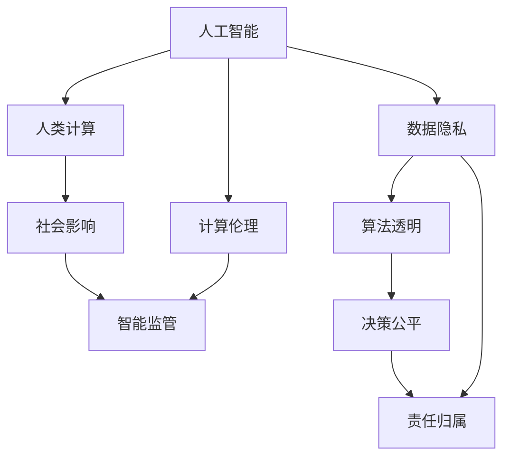

                 

# AI时代的人类计算：未来的道德边界

> 关键词：人工智能,道德边界,人机协同,计算伦理,智能技术,社会影响

## 1. 背景介绍

### 1.1 问题由来

随着人工智能(AI)技术的迅猛发展，人类计算正进入一个全新时代。从机器翻译到图像识别，从自然语言处理到自动驾驶，AI技术的广泛应用正在深刻改变着人类的生产生活方式。然而，在AI赋予我们巨大便利的同时，其潜在的道德风险和伦理挑战也不容忽视。

如何确保AI技术的发展方向，使其既能造福社会，又能保障人类的基本权益？如何在追求技术进步的同时，维护社会的公平正义？这些问题迫切需要我们从理论、实践和技术等各个层面进行深入探讨和系统应对。

### 1.2 问题核心关键点

AI时代的人类计算面临的核心问题包括：

- **技术进步与道德伦理的冲突**：如何在技术创新和伦理约束之间找到平衡，确保AI技术的健康发展？
- **数据隐私与算法透明**：如何在追求数据驱动的AI技术中，保护个人隐私和数据安全，增强算法的透明度和可解释性？
- **决策公平与偏见消除**：如何在AI决策系统中，避免种族、性别等偏见，确保公平公正？
- **责任归属与法律责任**：如何在AI辅助或自动决策的情境下，清晰界定各方的责任，保障法律与伦理的界线？
- **社会影响与伦理监管**：AI技术对社会经济、文化、就业等诸多方面产生的影响，如何引导和监管？

这些核心问题贯穿了AI技术的每一个层面，深刻影响着AI的实际应用效果和社会的接受程度。本文旨在深入探讨这些关键问题，提出应对策略，以期在AI时代构建一个更加公正、透明、安全的计算环境。

## 2. 核心概念与联系

### 2.1 核心概念概述

要深入理解AI时代的人类计算及其道德边界，首先需要明确几个核心概念：

- **人工智能(AI)**：通过模拟人类智能行为，实现信息处理、逻辑推理、自然语言理解、视觉识别等任务的技术系统。
- **人类计算**：指人类使用AI技术进行计算和决策的过程，是技术与人类智慧的融合。
- **计算伦理**：指导AI技术应用中应当遵循的伦理准则和道德规范。
- **社会影响**：AI技术在推动社会进步的同时，可能带来的负面影响，如就业冲击、隐私侵犯、算法偏见等。
- **智能监管**：对AI系统进行监督和管理的机制和手段，确保其在法律和伦理框架下运行。

这些概念之间相互联系，共同构成了AI时代人类计算的完整框架。以下使用Mermaid流程图，展示它们之间的内在联系：



## 3. 核心算法原理 & 具体操作步骤

### 3.1 算法原理概述

AI时代的人类计算，其核心算法原理可以分为以下三个部分：

1. **数据驱动的机器学习**：通过大量的标注数据训练AI模型，使其能够识别、分类、预测、生成等。
2. **人机协同**：将人的决策与AI的自动化推理相结合，实现更高效、更准确的任务处理。
3. **计算伦理**：在模型训练和应用过程中，遵循伦理准则，保护数据隐私，消除偏见，确保责任明确。

这三者共同作用，使得AI技术能够以更加人性化的方式服务于人类社会。

### 3.2 算法步骤详解

AI时代的人类计算主要包括以下步骤：

1. **数据采集与预处理**：收集与任务相关的数据，进行清洗、归一化、标签化等预处理工作。
2. **模型选择与训练**：选择合适的算法模型，利用标注数据进行训练，得到初始的AI模型。
3. **人机协同优化**：在模型应用过程中，引入人类的反馈和干预，进行模型的微调和优化，提升模型性能。
4. **伦理审核与监督**：对模型进行伦理审核，确保其不违反数据隐私、算法透明、决策公平等原则，符合社会规范。

### 3.3 算法优缺点

AI时代的人类计算具有以下优点：

1. **高效准确**：通过机器学习算法，能够快速处理大量数据，得出准确的预测和决策。
2. **自动化决策**：在确定的数据和算法基础上，AI能够自主进行决策，减少人为错误。
3. **人机协同**：结合人类智慧和机器能力，使得计算过程更加高效和智能化。

同时，也存在一些缺点：

1. **数据依赖性强**：AI的性能依赖于高质量的标注数据，数据质量不高时，容易产生错误。
2. **算法复杂度高**：高级算法模型的训练和优化复杂，对计算资源要求较高。
3. **伦理风险**：AI模型的决策过程和输出结果可能涉及伦理问题，需谨慎处理。

### 3.4 算法应用领域

AI时代的人类计算已经在多个领域得到应用，如医疗、金融、交通、教育等：

- **医疗领域**：利用AI进行疾病诊断、患者监护、药物研发等。
- **金融领域**：通过AI进行风险评估、欺诈检测、智能投顾等。
- **交通领域**：应用AI进行交通预测、自动驾驶、智慧物流等。
- **教育领域**：利用AI进行个性化教学、智能评估、智能辅导等。

这些应用展示了AI技术在提高效率、减少成本、提升服务质量等方面的巨大潜力。然而，如何平衡技术进步与伦理约束，确保AI技术的健康发展，仍然是一个巨大的挑战。

## 4. 数学模型和公式 & 详细讲解

### 4.1 数学模型构建

在AI模型训练中，常用的数学模型包括线性回归、逻辑回归、决策树、神经网络等。以神经网络为例，其数学模型构建如下：

设训练样本为 $(x_i, y_i)$，其中 $x_i$ 为输入特征向量，$y_i$ 为输出标签。神经网络模型由输入层、隐藏层和输出层组成，模型参数为 $\theta$，则模型预测的输出为：

$$
\hat{y} = \sigma(\mathbf{W}_n \sigma(\mathbf{W}_h \mathbf{W}_x x + b_x) + b_h) + b_y
$$

其中 $\mathbf{W}_x, \mathbf{W}_h, \mathbf{W}_n$ 分别为输入层、隐藏层、输出层的权重矩阵，$b_x, b_h, b_y$ 分别为各层的偏置向量，$\sigma$ 为激活函数。

### 4.2 公式推导过程

假设训练集为 $D = \{(x_i, y_i)\}_{i=1}^N$，模型的损失函数为 $L(\theta)$，常用的损失函数包括均方误差（MSE）、交叉熵（CE）等。以均方误差为例：

$$
L(\theta) = \frac{1}{2N} \sum_{i=1}^N (\hat{y}_i - y_i)^2
$$

通过梯度下降算法更新模型参数，具体步骤如下：

1. 计算预测输出 $\hat{y}_i$。
2. 计算损失函数的梯度 $\frac{\partial L}{\partial \theta}$。
3. 更新模型参数：$\theta \leftarrow \theta - \eta \frac{\partial L}{\partial \theta}$。

其中 $\eta$ 为学习率，$\frac{\partial L}{\partial \theta}$ 为损失函数对模型参数的梯度，可通过反向传播算法计算。

### 4.3 案例分析与讲解

以图像分类为例，假设训练数据集包含两类图片，利用卷积神经网络（CNN）模型进行分类。首先对图片进行预处理，将其转化为向量 $x$。模型预测输出为：

$$
\hat{y} = \sigma(\mathbf{W}_n \sigma(\mathbf{W}_h \mathbf{W}_x x + b_x) + b_h) + b_y
$$

其中 $\mathbf{W}_x$ 为卷积层权重矩阵，$\mathbf{W}_h$ 为池化层权重矩阵，$\mathbf{W}_n$ 为全连接层权重矩阵，$b_x, b_h, b_y$ 分别为各层偏置向量，$\sigma$ 为激活函数。训练过程中，利用均方误差损失函数进行优化，最终得到训练好的模型，用于新图片的分类预测。

## 5. 项目实践：代码实例和详细解释说明

### 5.1 开发环境搭建

在进行AI项目实践前，需要准备好开发环境。以下是使用Python进行TensorFlow开发的完整环境配置流程：

1. 安装Anaconda：从官网下载并安装Anaconda，用于创建独立的Python环境。
2. 创建并激活虚拟环境：
```bash
conda create -n tf-env python=3.8
conda activate tf-env
```
3. 安装TensorFlow：根据CUDA版本，从官网获取对应的安装命令。例如：
```bash
conda install tensorflow-gpu=2.5.0 -c conda-forge -c pypi
```
4. 安装各类工具包：
```bash
pip install numpy pandas scikit-learn matplotlib tqdm jupyter notebook ipython
```

完成上述步骤后，即可在`tf-env`环境中开始AI项目实践。

### 5.2 源代码详细实现

以下以图像分类为例，给出使用TensorFlow进行CNN模型训练的PyTorch代码实现。

```python
import tensorflow as tf
from tensorflow.keras import layers, models

# 定义模型
model = models.Sequential([
    layers.Conv2D(32, (3,3), activation='relu', input_shape=(28,28,1)),
    layers.MaxPooling2D((2,2)),
    layers.Conv2D(64, (3,3), activation='relu'),
    layers.MaxPooling2D((2,2)),
    layers.Flatten(),
    layers.Dense(64, activation='relu'),
    layers.Dense(10)
])

# 编译模型
model.compile(optimizer='adam', loss='categorical_crossentropy', metrics=['accuracy'])

# 加载数据集
(x_train, y_train), (x_test, y_test) = tf.keras.datasets.mnist.load_data()

# 预处理数据
x_train = x_train.reshape(-1, 28, 28, 1) / 255.0
x_test = x_test.reshape(-1, 28, 28, 1) / 255.0
y_train = tf.keras.utils.to_categorical(y_train, num_classes=10)
y_test = tf.keras.utils.to_categorical(y_test, num_classes=10)

# 训练模型
model.fit(x_train, y_train, epochs=10, batch_size=64, validation_data=(x_test, y_test))

# 评估模型
model.evaluate(x_test, y_test)
```

以上就是使用TensorFlow对CNN进行图像分类的完整代码实现。可以看到，TensorFlow的Keras API使得模型定义和训练变得简洁高效，开发者可以专注于模型结构和训练策略的设计。

### 5.3 代码解读与分析

让我们再详细解读一下关键代码的实现细节：

**模型定义**：
- 利用Sequential模型定义卷积神经网络，包含卷积层、池化层、全连接层。
- 卷积层参数为32、64，使用ReLU激活函数。
- 池化层为2x2的最大池化。
- 输出层为10个神经元，对应10个分类。

**模型编译**：
- 使用Adam优化器，交叉熵损失函数，准确率作为评估指标。
- 编译过程自动生成了反向传播图和计算图。

**数据加载与预处理**：
- 使用MNIST数据集，将28x28的灰度图片转化为4维张量。
- 对像素值进行归一化处理。
- 使用to_categorical函数将标签转化为one-hot编码。

**模型训练**：
- 使用fit方法训练模型，设定训练轮数和批量大小。
- 利用验证集评估模型性能，避免过拟合。

**模型评估**：
- 使用evaluate方法评估模型在测试集上的性能。

可以看到，TensorFlow使得模型定义、编译、训练、评估等过程变得简单易懂，代码量极少。这正是深度学习框架的优势所在。

## 6. 实际应用场景

### 6.1 医疗领域

在医疗领域，AI技术已经广泛应用于疾病诊断、患者监护、药物研发等方面。例如，利用卷积神经网络对医学影像进行分类，可以显著提升医生的诊断效率和准确性。AI辅助诊断系统，能够快速识别病灶，辅助医生制定治疗方案，提升患者满意度。

### 6.2 金融领域

在金融领域，AI技术被用于风险评估、欺诈检测、智能投顾等。通过深度学习模型，能够分析大量的金融数据，预测市场趋势，帮助投资者进行决策。AI风控系统，能够实时监测交易行为，识别异常交易，预防金融欺诈。

### 6.3 交通领域

在交通领域，AI技术被用于交通预测、自动驾驶、智慧物流等。例如，通过深度学习模型，可以实时分析交通流量，预测拥堵情况，优化交通信号控制。自动驾驶技术，能够利用高精度地图和传感器数据，实现自主驾驶，提升交通安全和效率。

### 6.4 教育领域

在教育领域，AI技术被用于个性化教学、智能评估、智能辅导等。通过深度学习模型，可以分析学生的学习行为和成绩，推荐适合的课程和学习路径。AI辅导系统，能够实时回答学生问题，提供个性化辅导，提高学习效果。

### 6.5 未来应用展望

随着AI技术的不断进步，其在各领域的深度应用将会更加广泛。未来，AI技术将在更多领域发挥重要作用，如智能制造、智慧城市、智能农业等。AI将与人类社会更加紧密地融合，成为推动人类进步的重要力量。

## 7. 工具和资源推荐

### 7.1 学习资源推荐

为了帮助开发者系统掌握AI技术及其应用，这里推荐一些优质的学习资源：

1. **Coursera《深度学习专项课程》**：由斯坦福大学Andrew Ng教授主讲的深度学习课程，涵盖从入门到高级的深度学习知识。
2. **Udacity《深度学习纳米学位》**：由Google等公司提供，深度学习工程师的职业培训课程。
3. **DeepLearning.AI《深度学习》**：由周志华、李宏毅等专家编写的深度学习教材，系统讲解深度学习原理与应用。
4. **Kaggle竞赛平台**：全球最大的数据科学竞赛平台，提供丰富的数据集和挑战任务，锻炼实战能力。
5. **TensorFlow官方文档**：TensorFlow的官方文档，包含详细的API文档、教程和示例代码，是学习TensorFlow的重要资源。

通过对这些资源的学习实践，相信你一定能够快速掌握AI技术的精髓，并用于解决实际的NLP问题。

### 7.2 开发工具推荐

高效的开发离不开优秀的工具支持。以下是几款用于AI开发的工具：

1. **TensorFlow**：Google主导开发的开源深度学习框架，适合大规模工程应用。
2. **PyTorch**：Facebook开发的深度学习框架，灵活性高，支持动态计算图。
3. **Keras**：基于TensorFlow和Theano的高级API，简化了深度学习模型的定义和训练过程。
4. **Jupyter Notebook**：交互式编程环境，支持Python、R等多种编程语言，便于编写和执行代码。
5. **Weights & Biases**：模型训练的实验跟踪工具，可以记录和可视化模型训练过程中的各项指标，方便对比和调优。

合理利用这些工具，可以显著提升AI开发效率，加快创新迭代的步伐。

### 7.3 相关论文推荐

AI技术的发展源于学界的持续研究。以下是几篇奠基性的相关论文，推荐阅读：

1. **DeepMind AlphaGo**：提出基于深度学习的AlphaGo系统，在围棋领域取得突破。
2. **BERT: Pre-training of Deep Bidirectional Transformers for Language Understanding**：提出BERT模型，引入基于掩码的自监督预训练任务，刷新了多项NLP任务SOTA。
3. **GANs for Smart Pricing in Online Marketplaces**：利用生成对抗网络（GAN）优化在线市场定价策略，提升平台收益。
4. **One-shot Learning**：提出一阶段学习（One-shot Learning）方法，提升模型在小样本条件下的学习效果。
5. **Adversarial Machine Learning**：介绍对抗生成网络（Adversarial Networks），研究如何生成对抗样本，对抗深度学习模型。

这些论文代表了大规模深度学习技术的发展脉络。通过学习这些前沿成果，可以帮助研究者把握学科前进方向，激发更多的创新灵感。

## 8. 总结：未来发展趋势与挑战

### 8.1 总结

本文对AI时代的人类计算及其道德边界进行了全面系统的介绍。首先阐述了AI技术在各领域的应用背景和伦理挑战，明确了计算伦理在AI技术中的重要性。其次，从原理到实践，详细讲解了AI技术的主要算法和具体操作步骤，提供了完整的代码实例和详细解释。同时，本文还探讨了AI技术在医疗、金融、交通、教育等领域的实际应用，展示了AI技术在提高效率、减少成本、提升服务质量等方面的巨大潜力。最后，本文精选了AI技术的各类学习资源和开发工具，力求为读者提供全方位的技术指引。

通过本文的系统梳理，可以看到，AI时代的人类计算正在带来巨大的变革，但也面临着诸多伦理和道德问题。如何平衡技术进步与伦理约束，确保AI技术的健康发展，仍然是一个巨大的挑战。

### 8.2 未来发展趋势

展望未来，AI时代的人类计算将呈现以下几个发展趋势：

1. **计算效率的提升**：随着计算硬件的不断进步，AI模型的计算速度将大幅提升，处理能力将更加强大。
2. **模型结构的优化**：未来的AI模型将更加注重结构优化和参数压缩，以减少计算资源消耗。
3. **人机协同的深化**：随着AI技术的发展，人机协同的深度将不断加深，AI将更加智能地辅助人类决策。
4. **伦理监管的加强**：未来AI技术将面临更多的伦理监管和法律约束，确保其发展符合社会规范。
5. **多模态融合的推进**：未来的AI技术将更加注重多模态融合，融合视觉、听觉、触觉等多模态数据，提升AI的理解和推理能力。
6. **社会影响的重视**：未来的AI技术将更加注重社会影响，确保其带来的好处大于风险。

这些趋势展示了AI技术的发展方向，预示着AI将为人类社会带来更大的便利和进步。

### 8.3 面临的挑战

尽管AI技术在多个领域取得了突破性进展，但在迈向更加智能化、普适化应用的过程中，仍然面临诸多挑战：

1. **数据隐私问题**：AI技术需要大量的数据进行训练，如何在保护数据隐私的前提下，获取高质量的标注数据，是一个巨大的挑战。
2. **算法透明性**：AI模型的决策过程往往难以解释，如何在保证算法透明性的前提下，增强模型的可信度，是一个亟待解决的问题。
3. **偏见和歧视**：AI模型在训练过程中可能会学习到偏见和歧视，如何在模型设计中消除这些偏见，确保公平公正，是一个重要的研究方向。
4. **伦理和法律责任**：在AI辅助或自动决策的情境下，如何界定各方的责任，确保法律和伦理的界线，是一个复杂的问题。
5. **技术滥用问题**：AI技术可能被用于不正当用途，如攻击、诈骗等，如何防止技术滥用，确保技术的安全性，是一个重要的研究方向。
6. **计算资源消耗**：AI模型通常需要大量的计算资源进行训练和推理，如何降低计算资源消耗，提高模型的实用性，是一个重要的研究方向。

这些挑战展示了AI技术在发展过程中需要解决的问题，需要各方面的共同努力才能克服。

### 8.4 研究展望

面对AI技术面临的诸多挑战，未来的研究需要在以下几个方面寻求新的突破：

1. **计算伦理的研究**：加强计算伦理的理论研究，构建更加公平、透明、安全的AI技术框架。
2. **数据隐私保护**：开发数据隐私保护技术，确保数据在传输和存储过程中的安全。
3. **算法透明性提升**：研究可解释的AI算法，提升模型的透明度和可信度。
4. **偏见消除方法**：研究消除算法偏见的方法，确保模型在不同群体上的公平性。
5. **责任界定机制**：研究AI技术的责任界定机制，确保法律和伦理的界线清晰。
6. **技术滥用防范**：开发技术滥用防范技术，确保AI技术的安全性。

这些研究方向将引领AI技术的健康发展，确保其在各个领域的广泛应用。

## 9. 附录：常见问题与解答

**Q1：AI技术是否会对人类就业产生负面影响？**

A: AI技术在提高生产效率的同时，可能对一些传统职业产生冲击，但同时也会创造新的就业机会。关键在于如何引导和适应这种变化，确保社会整体的就业稳定。

**Q2：AI技术在医疗领域的应用有哪些？**

A: AI技术在医疗领域的应用包括疾病诊断、患者监护、药物研发、智能手术等方面。通过AI技术，可以提高诊断的准确性和效率，改善患者监护的效果，加速药物研发的进程。

**Q3：如何保护AI技术中的数据隐私？**

A: 保护AI技术中的数据隐私，主要通过数据加密、匿名化、差分隐私等技术手段，确保数据在传输和存储过程中的安全。

**Q4：AI技术如何实现人机协同？**

A: 实现人机协同，主要通过强化学习、自然语言理解等技术，使AI能够理解和执行人类的指令。同时，结合人类的反馈和干预，不断优化模型的决策过程。

**Q5：AI技术在金融领域的应用有哪些？**

A: AI技术在金融领域的应用包括风险评估、欺诈检测、智能投顾、智能客服等方面。通过AI技术，可以实时监测金融风险，预防金融欺诈，提升服务质量。

这些问题的答案展示了AI技术在各领域的应用和面临的挑战，强调了在AI技术发展中，伦理和道德的必要性和紧迫性。

---

作者：禅与计算机程序设计艺术 / Zen and the Art of Computer Programming

