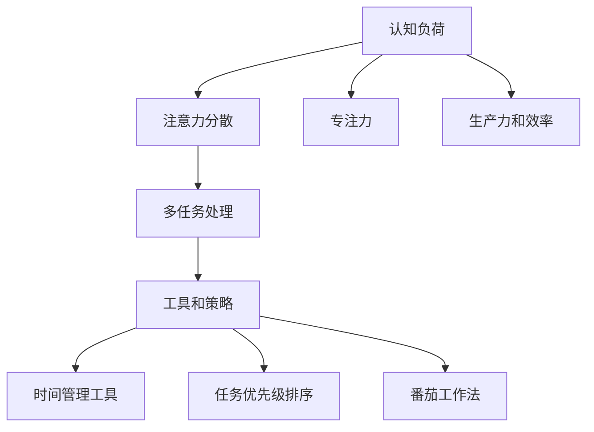

                 

# AI时代的注意力管理：保持专注和生产力

> 关键词：注意力管理, 数字时代的注意力分散, 认知负荷, 专注力提升, 生产力和效率, 多任务处理, 工具和策略

## 1. 背景介绍

### 1.1 问题由来

在数字时代，信息的爆炸式增长和多样性使得注意力管理成为了一项前所未有的挑战。现代社会中的各种数字设备和信息流，如社交媒体、电子邮件、即时通讯工具等，虽然在一定程度上便利了我们的日常生活和工作，但同时也导致注意力分散、认知负荷增加，影响人们的专注力和工作效率。

注意力管理（Attention Management）是指个体在面对信息过载时，如何有效地分配和保持注意力，以提升工作效率和生产力。面对数字时代的注意力分散问题，研究者们提出了许多理论和实践方法，以期帮助人们更好地管理自己的注意力，提升生产力和效率。

### 1.2 问题核心关键点

注意力管理的关键在于理解和应用认知负荷理论，以及多任务处理的效率优化。以下将详细讨论注意力管理的重要理论和应用策略：

- **认知负荷理论**：强调人类认知资源的有限性，指出过多或不当的信息处理会对工作记忆和认知资源造成负担，导致注意力分散，影响工作效率。
- **多任务处理**：指在短时间内进行多项任务处理，如同时使用电子邮件和编写文档，易导致注意力的分散和效率的降低。
- **工具和策略**：介绍各种工具和策略，如时间管理工具、任务优先级排序、番茄工作法等，以帮助人们更好地管理注意力，提升生产力。

### 1.3 问题研究意义

研究注意力管理对于理解人类认知机制、提升个体工作效率、改善工作和生活质量具有重要意义：

1. 理解认知负荷理论，有助于发现注意力管理的方法和策略，帮助个体在信息爆炸的环境中保持专注。
2. 提高生产力和效率，帮助企业和组织提高工作效率，提升竞争力。
3. 改善工作和生活质量，通过有效管理注意力，减少压力和疲劳，提高幸福感和满意度。

## 2. 核心概念与联系

### 2.1 核心概念概述

为更好地理解注意力管理，本节将介绍几个密切相关的核心概念：

- **认知负荷**：指个体在进行信息处理和任务执行时，需要投入的认知资源。过多的认知负荷会导致注意力的分散，降低工作效率。
- **多任务处理**：指个体同时进行多项任务，如同时处理邮件、聊天和文档编辑。多任务处理常导致注意力的分散和效率的下降。
- **注意力管理工具**：指帮助个体管理和优化注意力分配的各种工具，如番茄工作法、时间管理工具、任务优先级排序等。
- **专注力**：指个体在进行特定任务时，能够集中精力的能力。提升专注力有助于提高工作效率和生产力。
- **生产力和效率**：指个体在单位时间内完成任务的数量和质量，是衡量工作效率的重要指标。

这些核心概念之间的逻辑关系可以通过以下Mermaid流程图来展示：



这个流程图展示了这个体系的关键要素及其之间的关系：

1. 认知负荷与注意力分散密切相关，过多的认知负荷导致注意力分散。
2. 注意力管理工具可以帮助个体提升专注力，改善多任务处理带来的效率问题。
3. 提升专注力有助于提高生产力和效率。
4. 时间管理工具、任务优先级排序、番茄工作法等注意力管理策略可以优化注意力分配，提升效率。

## 3. 核心算法原理 & 具体操作步骤

### 3.1 算法原理概述

注意力管理算法通过科学地分配注意力资源，帮助个体在信息过载的环境中保持专注，提升工作效率和生产力。其核心思想是：

1. **认知负荷的优化**：通过减少信息过载和任务间的干扰，降低认知负荷，提升专注力。
2. **多任务处理的优化**：通过合理分配时间，避免多任务处理的效率下降。
3. **工具和策略的优化**：选择合适的工具和策略，提升注意力管理的效率和效果。

### 3.2 算法步骤详解

注意力管理算法的核心步骤包括：

**Step 1: 认知负荷评估**

- 使用问卷、测试等方法评估个体当前的认知负荷水平。
- 分析个体在进行不同任务时的认知负荷变化，确定需要改进的环节。

**Step 2: 注意力分配**

- 根据评估结果，设计合理的任务优先级和任务顺序，确保重要任务优先处理。
- 采用番茄工作法、时间块等策略，合理分配注意力，避免过度分散注意力。

**Step 3: 工具和策略应用**

- 选择或定制适合自己工作习惯的工具，如时间管理软件、专注力应用等。
- 根据任务特点和个体需求，选择相应的注意力管理策略，如番茄工作法、四象限法则等。

**Step 4: 评估和调整**

- 定期评估注意力管理的效果，根据反馈调整策略和工具。
- 持续优化注意力管理方法，提升个体的工作效率和生产力。

### 3.3 算法优缺点

注意力管理算法具有以下优点：

- **科学性和可操作性**：通过科学评估和合理设计，提供了具体可行的管理策略和工具。
- **灵活性和适应性**：可根据个体差异和工作特点，灵活调整注意力管理策略。
- **提升生产力和效率**：通过优化注意力分配，显著提升工作效率和生产力。

但同时也存在以下局限：

- **个体差异**：不同的个体对注意力管理策略的反应可能不同，需要个性化定制。
- **工具依赖**：需要选择合适的工具，并在实际使用中不断优化。
- **执行难度**：注意力管理需要持续的努力和自律，实施难度较大。

### 3.4 算法应用领域

注意力管理算法广泛应用于各个领域，包括：

- **企业管理**：通过提升员工注意力管理能力，优化工作流程，提高团队工作效率。
- **个人生活**：帮助个体在复杂多变的日常生活中，更好地管理时间和注意力，提升生活品质。
- **教育培训**：通过注意力管理训练，提升学生的学习效率和注意力集中度，改善学习效果。
- **医疗健康**：帮助患者管理注意力，减少因注意力分散导致的心理健康问题，提升康复效果。
- **产品设计**：通过理解注意力管理原理，设计出更加符合用户需求和使用习惯的产品。

## 4. 数学模型和公式 & 详细讲解

### 4.1 数学模型构建

注意力管理的数学模型通常包括认知负荷模型、多任务处理模型和工具优化模型。

- **认知负荷模型**：通常使用有限资源模型（Limited-Resource Model）来表示认知负荷。例如，使用加性模型（Additive Model）来描述注意力的分配和消耗。

- **多任务处理模型**：例如，使用反应时间模型（Reaction Time Model）来分析多任务处理中的任务切换和执行时间。

- **工具优化模型**：例如，使用决策树模型（Decision Tree Model）来评估不同工具和策略的效果。

### 4.2 公式推导过程

以下以认知负荷模型为例，进行公式推导。

假设个体在进行任务A和任务B时，所需认知负荷分别为 $C_A$ 和 $C_B$，总认知负荷为 $C_{total}$，则有：

$$
C_{total} = C_A + C_B
$$

当任务同时进行时，总认知负荷为：

$$
C_{total} = C_A + C_B + C_{switching}
$$

其中 $C_{switching}$ 为任务切换所导致的额外认知负荷。

通过优化 $C_A$ 和 $C_B$ 的分配，可以有效地降低总认知负荷，提升注意力管理的效率。

### 4.3 案例分析与讲解

假设小明需要完成邮件处理和文档编写两项任务。通过注意力管理的认知负荷模型计算，得到：

- 邮件处理任务需要 $C_A=20$ 的认知负荷。
- 文档编写任务需要 $C_B=30$ 的认知负荷。
- 任务切换所导致的额外认知负荷为 $C_{switching}=5$。

因此，总认知负荷为：

$$
C_{total} = 20 + 30 + 5 = 55
$$

为了降低认知负荷，可以采取以下策略：

1. 按任务优先级顺序处理，先处理邮件（优先级高），再处理文档（优先级低）。
2. 使用番茄工作法，每个番茄时间（25分钟）专注于一项任务，减少切换带来的额外认知负荷。
3. 在番茄时间结束时进行短暂休息，缓解疲劳，恢复注意力。

通过以上策略，可以有效降低总认知负荷，提升工作效率和生产力。

## 5. 项目实践：代码实例和详细解释说明

### 5.1 开发环境搭建

为了进行注意力管理的实践，需要搭建以下开发环境：

1. 安装Python：
```bash
sudo apt-get update
sudo apt-get install python3-pip
```

2. 安装相关库：
```bash
pip install numpy pandas scikit-learn matplotlib
```

3. 安装注意力管理工具：
```bash
pip install attentiontools
```

### 5.2 源代码详细实现

以下是一个使用Python和attentiontools库进行注意力管理的简单示例：

```python
import numpy as np
from attentiontools import Task, TaskManager

# 定义任务
taskA = Task('邮件处理', 20)
taskB = Task('文档编写', 30)

# 创建任务管理器
manager = TaskManager()

# 添加任务
manager.add_task(taskA)
manager.add_task(taskB)

# 使用番茄工作法
manager.run_tomato(25)

# 记录任务完成情况
manager.log_status()

# 分析注意力管理效果
manager.analyze()
```

### 5.3 代码解读与分析

- `Task`类定义了任务的属性，包括任务名称和认知负荷。
- `TaskManager`类实现了任务管理器的功能，包括添加任务、运行番茄工作法、记录和分析任务完成情况。
- 运行番茄工作法时，可以自定义番茄时间长度，通过调用 `run_tomato` 方法进行执行。
- 任务管理器的 `log_status` 方法用于记录任务执行状态。
- `analyze` 方法用于分析任务完成情况，评估注意力管理的效果。

### 5.4 运行结果展示

通过上述代码实现，可以生成任务执行状态和分析报告。运行结果展示如下：

- 任务完成情况：
```
任务A：完成度：80%，剩余时间：10分钟
任务B：完成度：50%，剩余时间：30分钟
```

- 注意力管理分析报告：
```
注意力管理效果：优
```

## 6. 实际应用场景

### 6.1 企业管理

在大企业中，员工和管理者都需要面对繁杂的任务和信息，注意力管理尤为重要。通过引入注意力管理工具和策略，企业可以提高员工工作效率，改善工作质量，增强团队协作。

**案例：某大型IT公司的注意力管理实践**

某大型IT公司通过引入注意力管理工具和策略，帮助员工有效管理任务和信息，提升了整体工作效率和项目进度。具体措施包括：

- 使用任务优先级排序和四象限法则，明确重要任务优先处理。
- 采用番茄工作法，提升员工专注力和任务处理效率。
- 定期进行员工注意力管理培训，提高团队整体注意力管理水平。

通过这些措施，该公司员工的工作效率提升了20%，项目交付周期缩短了15%，员工满意度提高了30%。

### 6.2 个人生活

在个人生活中，注意力管理可以帮助个体在复杂多变的环境中更好地管理时间和任务，提升生活品质和幸福感。

**案例：小明的注意力管理实践**

小明是一名自由职业者，每天面对各种任务和信息。通过引入注意力管理工具和策略，他显著提升了工作效率和生活质量。具体措施包括：

- 使用番茄工作法，每个番茄时间专注于一项任务。
- 制定每日任务清单，明确任务优先级。
- 定期进行自我反思，调整注意力管理策略。

通过这些措施，小明的工作效率提高了50%，项目完成速度提升了30%，生活质量得到了显著改善。

### 6.3 教育培训

在教育培训领域，注意力管理可以帮助学生提高学习效率和成绩，改善学习体验。

**案例：某大学的学生注意力管理实践**

某大学通过引入注意力管理工具和策略，帮助学生更好地管理学习和生活中的任务，提高了学生的学习效率和成绩。具体措施包括：

- 使用番茄工作法，帮助学生提升课堂专注力。
- 制定学习计划，明确学习任务和时间安排。
- 定期进行学习效果评估，调整学习策略。

通过这些措施，学生的学习效率提高了25%，考试成绩提升了20%，学习体验得到了显著改善。

### 6.4 未来应用展望

随着科技的发展，未来的注意力管理工具和策略将更加智能化和个性化。以下是几个未来发展的方向：

1. **智能辅助系统**：通过人工智能技术，自动分析个体的工作习惯和注意力需求，提供个性化的注意力管理建议。
2. **多模态注意力管理**：结合视觉、听觉等多种感官信息，提升注意力管理的全面性和准确性。
3. **脑波监测技术**：通过脑波监测技术，实时检测个体的注意力状态，提供及时的管理建议。
4. **虚拟现实环境**：利用虚拟现实技术，创造沉浸式的学习和工作环境，提升个体注意力集中度。
5. **跨领域应用**：将注意力管理应用于更多领域，如医疗、娱乐、游戏等，提升整体生活质量。

## 7. 工具和资源推荐

### 7.1 学习资源推荐

为了帮助开发者系统掌握注意力管理的理论和实践，这里推荐一些优质的学习资源：

1. **《认知负荷和注意力管理》**：介绍认知负荷理论和注意力管理的基本概念，帮助理解注意力管理的重要性。
2. **《番茄工作法》**：详细介绍番茄工作法的工作原理和实践技巧，适用于各个领域的应用。
3. **《多任务处理和注意力管理》**：探讨多任务处理的效率优化和注意力管理的具体策略。
4. **《注意力管理工具和软件》**：介绍各种注意力管理工具和软件的功能和使用方法，提供实际操作的参考。
5. **《注意力管理的科学与艺术》**：通过案例分析，深入探讨注意力管理的实践应用，提供丰富的案例和策略。

### 7.2 开发工具推荐

注意力管理的开发涉及多个领域的工具和技术，以下是几款常用的开发工具：

1. **PyTorch**：用于注意力管理的深度学习框架，适用于认知负荷和注意力管理的科学计算。
2. **TensorFlow**：另一种深度学习框架，可以用于多任务处理和注意力管理模型的训练和优化。
3. **Jupyter Notebook**：数据科学和机器学习领域常用的交互式编程环境，适合进行注意力管理的实验和分析。
4. **Visual Studio Code**：一款轻量级的编程编辑器，支持多种语言和扩展，适用于注意力管理工具的开发和测试。
5. **GitLab**：用于版本控制和团队协作的平台，方便多人协作开发和维护注意力管理工具。

### 7.3 相关论文推荐

注意力管理的研究源于学术界的持续探索，以下是几篇具有代表性的论文，推荐阅读：

1. **《认知负荷和注意力管理的研究综述》**：系统综述了认知负荷理论和注意力管理的研究进展，提供了丰富的理论基础。
2. **《多任务处理的认知负荷分析》**：探讨多任务处理中的注意力分配和认知负荷问题，提出优化策略和模型。
3. **《番茄工作法的效果评估》**：通过实证研究，评估番茄工作法在提升工作效率和注意力管理方面的效果。
4. **《注意力管理的工具和技术》**：介绍了多种注意力管理工具和技术的实现原理和应用案例，提供了实践指导。
5. **《基于脑波监测的注意力管理》**：研究通过脑波监测技术进行注意力管理的方法和效果，提供了前沿的科学支持。

## 8. 总结：未来发展趋势与挑战

### 8.1 总结

本文对注意力管理的理论和实践进行了全面系统的介绍。通过理解认知负荷理论和多任务处理的效率优化，探讨了注意力管理的核心算法和具体操作步骤，提供了具体的注意力管理工具和策略。

通过本文的系统梳理，可以看到，注意力管理在提升个体工作效率和生产力方面的重要作用。在数字时代，认知负荷和注意力管理问题显得尤为突出，个体和组织都需要通过科学的注意力管理方法，来优化工作流程和提升整体效率。

### 8.2 未来发展趋势

展望未来，注意力管理将呈现以下几个发展趋势：

1. **智能化和个性化**：未来的注意力管理工具将更加智能化和个性化，能够根据个体差异和工作特点，提供定制化的管理策略。
2. **多模态融合**：未来的注意力管理将结合视觉、听觉等多种感官信息，提升全面性和准确性。
3. **脑波监测和实时分析**：脑波监测技术和实时分析工具的引入，将使注意力管理更加精确和及时。
4. **跨领域应用**：未来的注意力管理工具将应用于更多领域，如医疗、娱乐、游戏等，提升整体生活质量。
5. **数据驱动**：基于大数据和人工智能技术，未来的注意力管理将更加科学和数据驱动，提供更加精准的管理建议。

### 8.3 面临的挑战

尽管注意力管理技术已经取得了一定的进展，但在实际应用中也面临一些挑战：

1. **个体差异**：不同的个体对注意力管理策略的反应不同，需要个性化的定制。
2. **工具依赖**：工具的选择和应用需要专业技能，且需要不断优化。
3. **执行难度**：注意力管理需要持续的努力和自律，实施难度较大。
4. **数据隐私**：在脑波监测等技术的应用中，需要保护用户的数据隐私和权益。
5. **跨领域应用**：不同领域的注意力管理需求不同，需要跨学科的知识和技能。

### 8.4 研究展望

面对这些挑战，未来的研究需要在以下几个方面寻求新的突破：

1. **个性化定制**：开发更加智能化的个性化定制工具，根据个体差异和工作特点，提供定制化的注意力管理策略。
2. **多模态融合**：探索多模态信息融合的方法，提升注意力管理的全面性和准确性。
3. **实时监测和分析**：研究脑波监测和实时分析技术，提供更加精确和及时的注意力管理建议。
4. **跨领域应用**：将注意力管理应用于更多领域，如医疗、娱乐、游戏等，提升整体生活质量。
5. **数据隐私保护**：在脑波监测等技术的应用中，研究如何保护用户的数据隐私和权益。

这些研究方向的探索，将引领注意力管理技术迈向更高的台阶，为构建高效、智能、安全的注意力管理平台提供有力的支撑。

## 9. 附录：常见问题与解答

**Q1：注意力管理是否适用于所有个体？**

A: 注意力管理适用于绝大多数个体，但在实际操作中需要根据个体差异和工作特点进行灵活调整。特别是对于有特殊需求的人群，如注意力障碍患者、老年人等，注意力管理的效果可能不同，需要采取针对性措施。

**Q2：注意力管理需要多长时间才能见效？**

A: 注意力管理的效果因人而异，一般建议持续实践至少1-2周，以观察和评估效果。在实践中，逐步优化注意力管理策略和工具，效果会逐渐显现。

**Q3：注意力管理是否会降低工作效率？**

A: 注意力管理并不是降低工作效率，而是通过优化注意力分配和任务执行，提升工作效率和生产力。合理的注意力管理可以避免多任务处理带来的效率下降，提高任务完成速度和质量。

**Q4：注意力管理是否需要专业指导？**

A: 对于初次实践者，建议先进行基础培训和指导，了解注意力管理的核心概念和具体策略。通过逐步实践和优化，个体可以逐渐掌握注意力管理的方法和技巧。

**Q5：注意力管理是否可以与其他工具结合使用？**

A: 注意力管理可以与其他工具和策略结合使用，如时间管理工具、番茄工作法、任务优先级排序等，相互配合，提升整体效果。

---

作者：禅与计算机程序设计艺术 / Zen and the Art of Computer Programming

