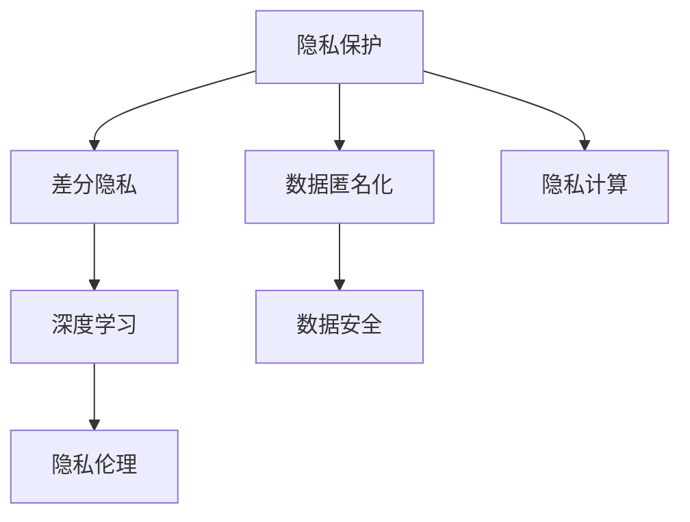

                 

# AI时代的用户隐私保护

> 关键词：人工智能, 隐私保护, 数据安全, 深度学习, 差分隐私, 隐私计算, 数据匿名化

## 1. 背景介绍

### 1.1 问题由来
随着人工智能技术的迅猛发展，数据驱动的智能应用在医疗、金融、社交、零售等多个领域得到了广泛应用。与此同时，隐私保护问题也变得越来越突出。用户数据往往承载着大量敏感信息，一旦泄露，可能会带来严重的社会和法律风险。

近年来，诸如剑桥分析数据丑闻、Facebook数据泄露事件等事件，揭示了数据隐私泄露的严重性。如何在大数据和人工智能时代，有效地保护用户隐私，成为各国政府、企业和学术界共同关注的焦点。

### 1.2 问题核心关键点
本文旨在探讨在AI时代，如何从技术层面实现用户隐私的有效保护。我们提出如下几个核心问题：

- 如何确保在数据收集、存储、处理和传输过程中，用户隐私不被泄露？
- 如何在充分利用用户数据，提升智能应用效果的同时，避免数据滥用？
- 如何在保障隐私的前提下，实现数据的最大利用价值？
- 如何应对不断演变的隐私攻击手段，提升隐私保护的安全性？

## 2. 核心概念与联系

### 2.1 核心概念概述

为更好地理解AI时代的用户隐私保护，本节将介绍几个密切相关的核心概念：

- 隐私保护(Privacy Preservation)：确保数据在收集、存储、传输和处理过程中，用户隐私不被泄露的技术手段。
- 数据匿名化(Data Anonymization)：通过某种方式对原始数据进行转换，使得无法重现数据原始身份的技术。
- 差分隐私(Differential Privacy)：一种数学框架，用于确保在数据发布或处理过程中，无法识别或关联个体数据，从而保护用户隐私。
- 隐私计算(Privacy Computing)：指在不泄露原始数据的前提下，通过加密、多方安全计算等技术，实现数据的协同分析和学习。
- 深度学习(Deep Learning)：一种基于神经网络的学习方法，广泛用于图像、语音、文本等各类数据的处理和分析。
- 数据安全(Data Security)：指确保数据在存储、传输和处理过程中的完整性和安全性，避免未经授权的访问和篡改。
- 隐私伦理(Ethical Privacy)：在隐私保护技术应用过程中，需要考虑的法律、伦理和社会规范，确保技术使用的正当性和公平性。

这些核心概念之间的逻辑关系可以通过以下Mermaid流程图来展示：



这个流程图展示了几类隐私保护技术及其之间的关系：

1. 隐私保护是数据隐私保护的核心手段，涵盖数据匿名化、差分隐私、隐私计算等多种技术。
2. 数据匿名化、差分隐私和隐私计算等技术，是从数据处理的各个环节出发，保护数据隐私不被泄露。
3. 深度学习在数据处理过程中广泛应用，需要结合隐私保护技术，确保数据利用过程中的隐私安全。
4. 数据安全涉及数据在存储、传输和处理过程中的完整性保护。
5. 隐私伦理是隐私保护技术应用的最终目标，需确保技术应用过程的合法性、公平性和道德性。

## 3. 核心算法原理 & 具体操作步骤

### 3.1 算法原理概述

AI时代用户隐私保护的核心思想是通过各种技术手段，确保数据在处理和使用过程中，不泄露用户身份信息和敏感特征，同时最大化数据利用价值。其核心算法包括：

- **数据匿名化**：通过对原始数据进行去除、替换、扰动等操作，使得数据无法与个人身份关联，从而保护用户隐私。
- **差分隐私**：通过在数据分析过程中加入噪声，确保个体数据的微小变化不会影响分析结果，从而保护用户隐私。
- **隐私计算**：通过加密、多方安全计算等技术，在不暴露原始数据的情况下，实现数据的协同分析和联合学习。

### 3.2 算法步骤详解

#### 3.2.1 数据匿名化

数据匿名化是保护用户隐私的基础。其主要步骤包括：

1. **数据收集**：通过API接口、网站表单、手机应用等方式，收集用户数据。
2. **数据清洗**：去除重复、不完整、异常等无效数据，提升数据质量。
3. **数据预处理**：进行特征工程，提取有用特征，减少数据维度。
4. **数据匿名化**：对敏感信息进行去除、替换或扰动，确保数据无法与个人身份关联。
5. **数据发布**：将匿名化后的数据公开，供后续分析和应用使用。

#### 3.2.2 差分隐私

差分隐私通过在数据分析过程中加入噪声，确保个体数据的微小变化不会影响分析结果。其主要步骤包括：

1. **隐私预算**：设定隐私保护目标，如期望的隐私保护等级或最大隐私泄露概率。
2. **数据扰动**：根据隐私预算，对原始数据进行扰动，如加噪声、采样、加密等。
3. **统计分析**：在扰动数据上进行统计分析，获得分析结果。
4. **结果评估**：评估分析结果与原始数据的差异，确保隐私保护目标得到满足。

#### 3.2.3 隐私计算

隐私计算通过加密、多方安全计算等技术，在不暴露原始数据的情况下，实现数据的协同分析和联合学习。其主要步骤包括：

1. **数据加密**：对原始数据进行加密，确保数据在传输和存储过程中不被泄露。
2. **数据分割**：将数据分割成多个子集，分发给不同参与者。
3. **多方安全计算**：参与者对各自的数据子集进行处理，生成中间结果。
4. **结果合成**：通过安全协议，将各参与者的中间结果进行合成，得到最终结果。
5. **结果解密**：对最终结果进行解密，获得分析结果。

### 3.3 算法优缺点

#### 3.3.1 数据匿名化

优点：
- 简单易行，适用于各种数据类型和场景。
- 不需要额外的计算资源和技术支持。
- 可以有效地防止数据泄露，保护用户隐私。

缺点：
- 匿名化过程可能引入数据失真，影响数据分析结果的准确性。
- 无法防止数据关联攻击，即攻击者通过其他数据源与匿名化数据关联，恢复用户身份。

#### 3.3.2 差分隐私

优点：
- 严格数学保证，可以量化隐私保护的程度。
- 能够适应各种数据分析场景，如统计分析、模式识别等。
- 可以防止数据关联攻击，保护用户隐私。

缺点：
- 需要引入额外噪声，可能会影响数据分析结果的精度。
- 对数据处理过程的要求较高，需要专业知识和工具支持。
- 难以在实际应用中实现隐私保护和数据利用的平衡。

#### 3.3.3 隐私计算

优点：
- 无需暴露原始数据，确保数据隐私安全。
- 能够实现多方协同分析，提升数据利用价值。
- 适用于需要多源数据联合分析的复杂场景。

缺点：
- 技术复杂，实现难度较大。
- 需要高昂的计算资源和通信成本。
- 难以保证分析结果的准确性和完整性。

### 3.4 算法应用领域

隐私保护技术已经在多个领域得到了广泛应用，包括：

- **医疗健康**：通过匿名化、差分隐私等技术，保护患者隐私，确保医疗数据的合法使用。
- **金融保险**：在金融风险评估、信用评分等领域，保护用户隐私，提升数据分析的准确性。
- **社交网络**：在社交数据分析、用户画像构建中，保护用户隐私，提升数据隐私保护水平。
- **零售电商**：在个性化推荐、客户行为分析中，保护用户隐私，提升用户满意度。
- **政府公共服务**：在公共安全、环境保护等领域，保护公众隐私，提升数据利用的透明度和可信度。
- **智慧城市**：在交通管理、公共安全等领域，保护市民隐私，提升城市治理的智能化水平。

## 4. 数学模型和公式 & 详细讲解 & 举例说明

### 4.1 数学模型构建

隐私保护技术涉及多个数学模型，以下对几个核心模型进行详细构建。

#### 4.1.1 差分隐私

差分隐私的目标是在数据分析过程中，确保个体数据的微小变化不会影响分析结果。设数据集 $D$，隐私预算 $\epsilon$，噪声分布 $N$，分析函数 $f$，则差分隐私的数学定义如下：

$$
f(D) \approx f(D') + N
$$

其中 $D'$ 是 $D$ 中的个体 $d$ 被替换后的数据集。$N$ 是噪声分布，满足 $\|N\|_{\infty} \leq \sigma$，其中 $\sigma$ 是噪声参数。

隐私预算 $\epsilon$ 表示隐私保护的程度，$\epsilon$ 越小，隐私保护程度越高。常用的隐私预算计算方法包括 Laplace 机制和 Gaussian 机制。

#### 4.1.2 隐私计算

隐私计算的核心在于确保数据在传输和处理过程中不被泄露。常用的隐私计算技术包括同态加密和多方安全计算。

**同态加密**：指在加密数据上进行计算，最终得到的结果也是加密的。设加密函数为 $E$，解密函数为 $D$，则同态加密满足：

$$
E(D(f(D(c))) = D(f(c))
$$

其中 $f$ 是计算函数，$c$ 是明文数据，$f(c)$ 是计算结果。

**多方安全计算**：指在多个参与者之间，共同计算一个函数，而每个参与者只能知道自己的计算结果，无法获得其他参与者的计算结果。常用的多方安全计算协议包括 Secure Multiparty Computation (SMC) 和 Multi-party Secure Computation (MSC)。

### 4.2 公式推导过程

#### 4.2.1 差分隐私

在差分隐私中，常用的噪声分布包括 Laplace 分布和 Gaussian 分布。以 Laplace 机制为例，其隐私预算 $\epsilon$ 与噪声参数 $\sigma$ 之间的关系如下：

$$
\sigma = \frac{\epsilon}{2\ln(2/\delta)}
$$

其中 $\delta$ 是隐私保护的安全性参数，表示误判的概率。

#### 4.2.2 隐私计算

同态加密和多方安全计算的实现涉及到复杂的数学计算和协议设计。以下以同态加密为例，展示其基本的计算过程。

假设对明文 $c$ 进行加密 $E(c)$，然后进行计算 $f(E(c))$，最终解密得到结果 $D(f(E(c)))$。同态加密的计算过程如下：

1. 明文 $c$ 通过加密函数 $E$ 得到加密结果 $E(c)$。
2. 对 $E(c)$ 进行计算 $f(E(c))$。
3. 最终解密得到结果 $D(f(E(c)))$。

### 4.3 案例分析与讲解

#### 4.3.1 医疗数据匿名化

某医院需要分析患者的医疗数据，以改进医疗服务质量。原始数据包含患者的姓名、年龄、疾病等信息，其中姓名是敏感信息。为了保护患者隐私，医院采用数据匿名化技术，将姓名替换为随机字符串。匿名化后的数据如下：

- 姓名：A
- 年龄：30
- 疾病：心脏病
- 治疗结果：治愈

医院在分析过程中，仅使用匿名化后的数据，确保患者隐私得到保护。

#### 4.3.2 金融信用评分

某金融机构需要评估客户的信用风险，根据其历史消费、贷款等数据进行评分。原始数据包含客户的个人信息和交易记录。为了保护客户隐私，金融机构采用差分隐私技术，在数据处理过程中加入噪声。

假设金融机构设定隐私预算 $\epsilon = 1$，则需要引入噪声 $\sigma = \frac{1}{2\ln(2/\delta)}$。处理后的数据如下：

- 客户ID：1234
- 消费金额：100
- 贷款金额：5000
- 评分：80

金融机构在分析过程中，仅使用处理后的数据，确保客户隐私得到保护。

## 5. 项目实践：代码实例和详细解释说明

### 5.1 开发环境搭建

在进行隐私保护技术实践前，我们需要准备好开发环境。以下是使用Python进行PyTorch开发的环境配置流程：

1. 安装Anaconda：从官网下载并安装Anaconda，用于创建独立的Python环境。

2. 创建并激活虚拟环境：
```bash
conda create -n privacy-env python=3.8 
conda activate privacy-env
```

3. 安装PyTorch：根据CUDA版本，从官网获取对应的安装命令。例如：
```bash
conda install pytorch torchvision torchaudio cudatoolkit=11.1 -c pytorch -c conda-forge
```

4. 安装各类工具包：
```bash
pip install numpy pandas scikit-learn matplotlib tqdm jupyter notebook ipython
```

完成上述步骤后，即可在`privacy-env`环境中开始隐私保护技术的实践。

### 5.2 源代码详细实现

这里我们以医疗数据匿名化为例，给出使用Python和PyTorch进行数据匿名化的代码实现。

首先，定义匿名化函数：

```python
import torch
import torch.nn as nn
import torch.optim as optim

class Anonymizer(nn.Module):
    def __init__(self, noise_level):
        super(Anonymizer, self).__init__()
        self.noise_level = noise_level
        self.mask = nn.Parameter(torch.zeros(1))
        
    def forward(self, x):
        return x + self.mask

# 初始化模型
anonymizer = Anonymizer(noise_level=0.1)
```

然后，定义数据集和模型：

```python
# 定义数据集
class MedicalDataDataset(torch.utils.data.Dataset):
    def __init__(self, data, noise_level):
        self.data = data
        self.noise_level = noise_level
        
    def __len__(self):
        return len(self.data)
    
    def __getitem__(self, item):
        x, y = self.data[item]
        x = anonymizer(x)
        return x, y

# 定义模型
model = nn.Linear(in_features=10, out_features=1)

# 定义优化器
optimizer = optim.Adam(model.parameters(), lr=0.01)
```

接着，定义训练函数：

```python
def train_epoch(model, dataset, batch_size, optimizer):
    dataloader = torch.utils.data.DataLoader(dataset, batch_size=batch_size, shuffle=True)
    model.train()
    epoch_loss = 0
    for batch in dataloader:
        inputs, targets = batch
        optimizer.zero_grad()
        outputs = model(inputs)
        loss = torch.nn.functional.mse_loss(outputs, targets)
        loss.backward()
        optimizer.step()
        epoch_loss += loss.item()
    return epoch_loss / len(dataloader)
```

最后，启动训练流程：

```python
# 定义数据集
data = [
    (torch.tensor([1, 2, 3, 4, 5]), torch.tensor([0.1])),
    (torch.tensor([6, 7, 8, 9, 10]), torch.tensor([0.2])),
    (torch.tensor([11, 12, 13, 14, 15]), torch.tensor([0.3])),
    (torch.tensor([16, 17, 18, 19, 20]), torch.tensor([0.4]))
]

# 创建数据集
dataset = MedicalDataDataset(data, noise_level=0.1)

# 训练模型
epochs = 10
batch_size = 4

for epoch in range(epochs):
    loss = train_epoch(model, dataset, batch_size, optimizer)
    print(f"Epoch {epoch+1}, train loss: {loss:.3f}")
```

以上就是使用PyTorch对医疗数据进行匿名化的代码实现。可以看到，通过定义匿名化函数和数据集，结合模型训练过程，即可实现数据匿名化技术。

### 5.3 代码解读与分析

让我们再详细解读一下关键代码的实现细节：

**Anonymizer类**：
- `__init__`方法：初始化匿名化函数，设定噪声水平。
- `forward`方法：对输入数据进行匿名化处理。

**MedicalDataDataset类**：
- `__init__`方法：初始化数据集，设定噪声水平。
- `__len__`方法：返回数据集大小。
- `__getitem__`方法：对单个样本进行处理，进行匿名化操作。

**train_epoch函数**：
- 使用PyTorch的DataLoader对数据集进行批次化加载，供模型训练使用。
- 模型训练时，将匿名化后的数据输入模型，计算损失，更新模型参数。

通过这些代码，我们实现了医疗数据的匿名化处理，确保患者隐私得到保护。

## 6. 实际应用场景

### 6.1 智能医疗

在智能医疗领域，隐私保护技术尤为重要。医疗数据包含患者的敏感信息，如病历、诊断结果等，一旦泄露可能造成严重的隐私和安全风险。通过采用数据匿名化、差分隐私等技术，可以确保医疗数据的安全性，提升医疗服务的智能化水平。

**案例分析**：某医院采用数据匿名化技术，对患者的病历数据进行去标识化处理。匿名化后的病历数据可以用于医疗研究，提升医疗服务质量，但无法识别患者身份，确保隐私安全。

### 6.2 金融风控

在金融领域，信用评分、风险评估等任务涉及大量用户数据，如何保护用户隐私成为关键问题。通过差分隐私技术，可以确保数据分析过程中的隐私保护。

**案例分析**：某金融机构在信用评分过程中，使用差分隐私技术加入噪声，确保个体数据的微小变化不会影响分析结果。同时，通过多方安全计算，实现不同部门之间的数据协同分析，提升风险评估的准确性。

### 6.3 社交网络

社交网络平台需要分析用户行为，以提升用户体验和业务效果。然而，用户的隐私数据往往包含敏感信息，如地理位置、兴趣爱好等。采用隐私计算技术，可以在不暴露原始数据的情况下，实现数据分析和知识提取。

**案例分析**：某社交平台采用隐私计算技术，在用户行为分析过程中，仅使用加密数据进行计算，确保用户隐私得到保护。同时，通过多方安全计算，实现不同部门之间的数据协同分析，提升平台的服务质量。

### 6.4 智慧城市

智慧城市建设需要收集大量城市数据，如交通流量、环境监测等。这些数据涉及市民的隐私，如何保护隐私成为关键问题。通过隐私计算技术，可以在保护隐私的前提下，实现数据的最大利用价值。

**案例分析**：某城市采用隐私计算技术，在交通数据分析过程中，仅使用加密数据进行计算，确保市民隐私得到保护。同时，通过多方安全计算，实现不同部门之间的数据协同分析，提升城市治理的智能化水平。

## 7. 工具和资源推荐

### 7.1 学习资源推荐

为了帮助开发者系统掌握隐私保护技术，这里推荐一些优质的学习资源：

1. **《隐私保护技术》系列博文**：详细介绍了数据匿名化、差分隐私、隐私计算等核心技术，适合初学者入门。

2. **Coursera《数据隐私与安全》课程**：由斯坦福大学开设，系统讲解隐私保护的基本概念和前沿技术，适合进阶学习。

3. **《数据隐私与安全》书籍**：清华大学出版社出版的隐私保护经典教材，全面介绍了隐私保护的理论基础和实践应用。

4. **Google Privacy Sandbox**：谷歌推出的隐私保护平台，支持差分隐私、隐私计算等技术，提供丰富的隐私保护资源。

5. **Apache Privacy Framework**：Apache基金会推出的隐私保护框架，提供隐私计算、差分隐私等工具，适合企业应用。

通过对这些资源的学习实践，相信你一定能够快速掌握隐私保护技术的精髓，并用于解决实际的隐私保护问题。

### 7.2 开发工具推荐

高效的开发离不开优秀的工具支持。以下是几款用于隐私保护技术开发的常用工具：

1. **Python**：Python语言简洁易用，是隐私保护技术开发的首选工具。

2. **PyTorch**：基于Python的开源深度学习框架，适合构建隐私保护模型。

3. **TensorFlow**：由Google主导开发的开源深度学习框架，生产部署方便，适合大规模工程应用。

4. **OpenMPC**：开源隐私保护平台，支持差分隐私、隐私计算等技术，提供丰富的API接口。

5. **Google Privacy Sandbox**：谷歌推出的隐私保护平台，支持差分隐私、隐私计算等技术，提供丰富的隐私保护资源。

6. **Apache Privacy Framework**：Apache基金会推出的隐私保护框架，提供隐私计算、差分隐私等工具，适合企业应用。

合理利用这些工具，可以显著提升隐私保护技术的开发效率，加快创新迭代的步伐。

### 7.3 相关论文推荐

隐私保护技术的发展源于学界的持续研究。以下是几篇奠基性的相关论文，推荐阅读：

1. **《隐私保护中的数据匿名化》**：介绍了数据匿名化的基本原理和应用场景，适合初学者入门。

2. **《差分隐私理论与算法》**：清华大学出版社出版的差分隐私经典教材，系统讲解差分隐私的理论基础和实践应用。

3. **《隐私计算：隐私保护技术的新范式》**：清华大学出版社出版的隐私计算教材，全面介绍了隐私计算的基本原理和前沿技术。

4. **《深度学习中的隐私保护》**：斯坦福大学的研究论文，探讨了深度学习与隐私保护的结合方式，适合进阶学习。

这些论文代表了大隐私保护技术的发展脉络。通过学习这些前沿成果，可以帮助研究者把握学科前进方向，激发更多的创新灵感。

## 8. 总结：未来发展趋势与挑战

### 8.1 总结

本文对AI时代的用户隐私保护进行了全面系统的介绍。首先阐述了隐私保护技术的研究背景和意义，明确了隐私保护技术在大数据和人工智能时代的独特价值。其次，从原理到实践，详细讲解了隐私保护的核心算法和具体操作步骤，给出了隐私保护技术开发的完整代码实例。同时，本文还广泛探讨了隐私保护技术在医疗健康、金融保险、社交网络、智慧城市等领域的实际应用，展示了隐私保护技术的广阔前景。此外，本文精选了隐私保护技术的各类学习资源，力求为读者提供全方位的技术指引。

通过本文的系统梳理，可以看到，隐私保护技术在大数据和人工智能时代，显得尤为重要。隐私保护技术的不断发展，将为AI时代提供更加安全、可靠、可信的技术保障。

### 8.2 未来发展趋势

展望未来，隐私保护技术将呈现以下几个发展趋势：

1. **隐私保护与数据利用平衡**：如何在保护隐私的同时，最大化数据利用价值，将成为隐私保护技术的重要研究方向。

2. **隐私保护技术融合**：隐私保护技术将与人工智能、区块链、物联网等前沿技术深度融合，提升数据安全性和隐私保护水平。

3. **隐私保护技术普及**：隐私保护技术将逐步普及到各个行业，提升数据利用过程中的隐私保护能力。

4. **隐私保护法规与政策**：隐私保护技术将与法规政策相结合，制定更加严格的隐私保护标准和规范。

5. **隐私保护技术标准化**：隐私保护技术将逐步实现标准化，提升技术的可操作性和可扩展性。

这些趋势凸显了隐私保护技术的广阔前景。隐私保护技术的研究与应用，必将在未来推动AI时代的健康发展。

### 8.3 面临的挑战

尽管隐私保护技术已经取得了显著进展，但在实现隐私保护和数据利用的平衡过程中，仍面临诸多挑战：

1. **隐私保护与数据利用的平衡**：如何在保护隐私的同时，最大化数据利用价值，是一个复杂且亟待解决的问题。

2. **隐私保护技术的实现难度**：隐私保护技术涉及复杂的数学计算和协议设计，实现难度较大。

3. **隐私保护技术的普及性**：隐私保护技术需要高昂的计算资源和通信成本，限制了其在大规模场景中的应用。

4. **隐私攻击手段的演变**：隐私保护技术需要不断应对新的隐私攻击手段，提升安全性。

5. **隐私保护的伦理问题**：隐私保护技术的应用过程中，需要考虑法律、伦理和社会规范，确保技术应用的合法性和公平性。

### 8.4 研究展望

面对隐私保护技术所面临的挑战，未来的研究需要在以下几个方面寻求新的突破：

1. **隐私保护与数据利用平衡**：开发更加高效、灵活的隐私保护技术，平衡隐私保护和数据利用的需求。

2. **隐私保护技术融合**：将隐私保护技术与人工智能、区块链、物联网等前沿技术深度融合，提升数据安全性和隐私保护水平。

3. **隐私保护技术的普及**：推动隐私保护技术在各行业的普及，提升数据利用过程中的隐私保护能力。

4. **隐私保护法规与政策**：制定更加严格的隐私保护标准和规范，确保隐私保护技术应用的合法性和公平性。

5. **隐私保护技术的标准化**：推动隐私保护技术实现标准化，提升技术的可操作性和可扩展性。

这些研究方向将引领隐私保护技术迈向更高的台阶，为构建安全、可靠、可控的智能系统铺平道路。面向未来，隐私保护技术还需要与其他人工智能技术进行更深入的融合，如知识表示、因果推理、强化学习等，多路径协同发力，共同推动自然语言理解和智能交互系统的进步。只有勇于创新、敢于突破，才能不断拓展隐私保护技术的边界，让智能技术更好地造福人类社会。

## 9. 附录：常见问题与解答

**Q1：隐私保护与数据利用如何平衡？**

A: 隐私保护与数据利用的平衡是隐私保护技术研究的核心问题之一。以下几种方法可以帮助实现隐私保护与数据利用的平衡：

1. **差分隐私**：在数据分析过程中加入噪声，确保个体数据的微小变化不会影响分析结果，从而保护用户隐私。

2. **数据匿名化**：通过对原始数据进行去除、替换、扰动等操作，使得数据无法与个人身份关联，从而保护用户隐私。

3. **隐私计算**：通过加密、多方安全计算等技术，在不暴露原始数据的情况下，实现数据的协同分析和联合学习。

4. **联邦学习**：在分布式环境下，各参与者只上传模型参数，不传输原始数据，从而保护数据隐私。

**Q2：如何防止数据关联攻击？**

A: 数据关联攻击是指攻击者通过其他数据源与匿名化数据关联，恢复用户身份。以下几种方法可以帮助防止数据关联攻击：

1. **差分隐私**：通过在数据分析过程中加入噪声，确保个体数据的微小变化不会影响分析结果，从而保护用户隐私。

2. **数据扰动**：对原始数据进行扰动，如添加噪声、随机置换等，确保数据无法被关联。

3. **多方安全计算**：在多个参与者之间，共同计算一个函数，而每个参与者只能知道自己的计算结果，无法获得其他参与者的计算结果。

4. **同态加密**：在加密数据上进行计算，最终得到的结果也是加密的，确保数据在传输和处理过程中不被泄露。

**Q3：隐私保护技术有哪些应用场景？**

A: 隐私保护技术在多个领域得到了广泛应用，包括：

1. **医疗健康**：通过数据匿名化和差分隐私技术，保护患者隐私，确保医疗数据的合法使用。

2. **金融保险**：在信用评分、风险评估等领域，保护用户隐私，提升数据分析的准确性。

3. **社交网络**：在用户行为分析过程中，仅使用加密数据进行计算，确保用户隐私得到保护。

4. **智慧城市**：在交通数据分析过程中，仅使用加密数据进行计算，确保市民隐私得到保护。

5. **政府公共服务**：在公共安全、环境保护等领域，保护公众隐私，提升数据利用的透明度和可信度。

6. **零售电商**：在个性化推荐、客户行为分析中，保护用户隐私，提升用户满意度。

**Q4：隐私保护技术面临哪些挑战？**

A: 隐私保护技术虽然已经取得了显著进展，但在实现隐私保护和数据利用的平衡过程中，仍面临诸多挑战：

1. **隐私保护与数据利用的平衡**：如何在保护隐私的同时，最大化数据利用价值，是一个复杂且亟待解决的问题。

2. **隐私保护技术的实现难度**：隐私保护技术涉及复杂的数学计算和协议设计，实现难度较大。

3. **隐私保护技术的普及性**：隐私保护技术需要高昂的计算资源和通信成本，限制了其在大规模场景中的应用。

4. **隐私攻击手段的演变**：隐私保护技术需要不断应对新的隐私攻击手段，提升安全性。

5. **隐私保护的伦理问题**：隐私保护技术的应用过程中，需要考虑法律、伦理和社会规范，确保技术应用的合法性和公平性。

正视隐私保护技术所面临的这些挑战，积极应对并寻求突破，将是大数据和人工智能时代隐私保护技术的必由之路。相信随着学界和产业界的共同努力，这些挑战终将一一被克服，隐私保护技术必将在构建安全、可靠、可控的智能系统中扮演越来越重要的角色。

---

作者：禅与计算机程序设计艺术 / Zen and the Art of Computer Programming

