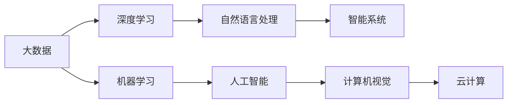

                 

# AI时代的程序员技能投资指南

> 关键词：人工智能(AI), 机器学习(ML), 深度学习(DL), 大数据, 云计算, 自然语言处理(NLP), 计算机视觉(CV), 智能系统, 开发者工具, 技能提升

## 1. 背景介绍

### 1.1 问题由来
随着人工智能(AI)技术的飞速发展，程序员的技能需求也在快速变化。过去，程序员的主要任务是编写和维护软件，而现在，越来越多的企业开始依赖AI技术来解决实际问题，这也使得AI相关的技能成为了必需。

### 1.2 问题核心关键点
- 技术发展迅速：AI技术正以令人瞩目的速度演进，因此程序员需要不断学习和更新技能。
- 跨学科知识：AI涉及数学、统计学、计算机科学等多个领域，程序员需要具备跨学科的知识。
- 应用广泛：AI技术被广泛应用于自动驾驶、语音识别、自然语言处理、医疗诊断等众多领域，程序员需要了解这些应用场景。
- 高效学习：AI的模型复杂，更新迅速，程序员需要掌握高效的学习方法。

### 1.3 问题研究意义
掌握AI相关的技能，不仅能够增强程序员的竞争力，还能够在未来的工作中更具价值。同时，AI技能的学习也将对公司业务的发展产生深远影响，推动公司向智能化方向转型。

## 2. 核心概念与联系

### 2.1 核心概念概述

AI时代的程序员技能投资指南，涵盖了以下几个关键概念：

- 人工智能(AI)：通过模拟人类智能，使计算机能够进行学习、推理、感知等智能活动的技术。
- 机器学习(ML)：AI的一个分支，使用算法让计算机从数据中学习规律，并用于预测、分类等任务。
- 深度学习(DL)：ML的一个子领域，使用多层神经网络进行学习，在图像识别、自然语言处理等领域取得了显著成果。
- 大数据：AI和ML的基础，通过处理大量数据，从中挖掘有价值的信息。
- 云计算：提供计算资源、存储服务的技术平台，使得AI模型的训练和部署更加便捷。
- 自然语言处理(NLP)：使计算机能够理解和生成自然语言的技术。
- 计算机视觉(CV)：使计算机能够理解和分析图像和视频的技术。
- 智能系统：利用AI技术实现智能化的应用系统，如智能推荐、智能客服等。

这些概念之间通过各种算法和技术手段紧密相连，形成一个相互支撑的AI生态系统。

### 2.2 核心概念原理和架构的 Mermaid 流程图



## 3. 核心算法原理 & 具体操作步骤

### 3.1 算法原理概述

AI技能的核心是算法，以下是几个关键算法的概述：

- 监督学习(Supervised Learning)：通过有标注的数据进行学习，适用于分类、回归等任务。
- 无监督学习(Unsupervised Learning)：从未标注的数据中学习规律，适用于聚类、降维等任务。
- 强化学习(Reinforcement Learning)：通过与环境的交互学习最优策略，适用于游戏、机器人控制等任务。
- 迁移学习(Transfer Learning)：将一个领域学到的知识迁移到另一个领域，减少重新训练的成本。
- 深度学习(Deep Learning)：通过多层神经网络进行学习，适用于图像、语音、文本等复杂任务。

### 3.2 算法步骤详解

#### 3.2.1 数据预处理
1. 数据收集：从不同的数据源收集数据，如数据库、爬虫等。
2. 数据清洗：处理缺失值、异常值，确保数据质量。
3. 数据增强：通过数据扩充、生成对抗网络等手段，增加训练数据量。
4. 特征工程：从原始数据中提取有用特征，如文本的词向量表示、图像的卷积特征等。

#### 3.2.2 模型选择
1. 选择适当的模型架构，如全连接神经网络、卷积神经网络、循环神经网络等。
2. 选择合适的损失函数，如交叉熵、均方误差等。
3. 设置超参数，如学习率、批大小、迭代轮数等。

#### 3.2.3 模型训练
1. 将数据集分为训练集、验证集和测试集。
2. 使用梯度下降等优化算法，最小化损失函数。
3. 周期性在验证集上评估模型性能，避免过拟合。
4. 根据验证集性能调整模型参数，最终在测试集上评估模型效果。

#### 3.2.4 模型部署和优化
1. 将模型保存和部署到生产环境。
2. 根据实际应用需求进行模型优化，如模型压缩、量化等。
3. 持续监控模型性能，定期更新模型以适应数据变化。

### 3.3 算法优缺点

#### 3.3.1 优点
1. 自动化：AI技术可以自动处理大量数据，降低人工干预的复杂度。
2. 精确度高：AI模型经过大量数据训练，能够获得高精度的结果。
3. 适应性强：AI模型可以灵活适应不同应用场景，具有高度的可扩展性。

#### 3.3.2 缺点
1. 数据依赖：AI模型的效果高度依赖于训练数据的质量和数量。
2. 模型复杂：AI模型通常具有复杂的结构和参数，训练和调优难度较大。
3. 解释困难：AI模型的内部机制难以解释，不利于调试和优化。

### 3.4 算法应用领域

AI技能广泛应用于以下领域：

- 自动驾驶：使用计算机视觉、深度学习等技术，实现车辆自主导航。
- 语音识别：使用NLP和深度学习技术，实现语音到文本的转换。
- 自然语言处理：使用NLP和机器学习技术，实现文本分析、情感分析、机器翻译等任务。
- 医疗诊断：使用深度学习和计算机视觉技术，辅助医生进行疾病诊断和医学图像分析。
- 金融分析：使用机器学习和大数据技术，进行风险评估和市场预测。
- 智能客服：使用NLP和自然语言生成技术，实现自动客服和智能对话。

## 4. 数学模型和公式 & 详细讲解 & 举例说明

### 4.1 数学模型构建

AI技能的学习离不开数学模型的构建和理解。以下是几个常见的数学模型及其构建方式：

#### 4.1.1 线性回归模型
- 形式化定义：$y = \theta_0 + \theta_1x_1 + \theta_2x_2 + \cdots + \theta_nx_n + \epsilon$
- 最小二乘法：$\theta = (X^TX)^{-1}X^Ty$
- 预测值：$y_{pred} = \theta_0 + \theta_1x_1 + \theta_2x_2 + \cdots + \theta_nx_n$
- 误差平方和：$J = \frac{1}{2m}\sum_{i=1}^m(y_i - y_{pred_i})^2$

#### 4.1.2 逻辑回归模型
- 形式化定义：$y = \frac{1}{1+e^{-\theta^Tx}}$
- 损失函数：$J = -\frac{1}{m}\sum_{i=1}^m(y_i\log(y_{pred_i}) + (1-y_i)\log(1-y_{pred_i}))$
- 梯度下降：$\theta \leftarrow \theta - \eta\frac{1}{m}\sum_{i=1}^m(\theta^Tx_i - y_i)x_i$
- 预测值：$y_{pred} = \frac{1}{1+e^{-\theta^Tx}}$

#### 4.1.3 卷积神经网络模型
- 形式化定义：$y = W \ast x + b$
- 卷积操作：$y_{ij} = \sum_{p=-s}^{s}\sum_{q=-t}^{t}W_{pq}x_{i+p,j+q} + b$
- 池化操作：$y_{ij} = max(0, \sum_{p=-s}^{s}\sum_{q=-t}^{t}W_{pq}x_{i+p,j+q} + b)$
- 损失函数：$J = \frac{1}{m}\sum_{i=1}^m(y_i - y_{pred_i})^2$

### 4.2 公式推导过程

#### 4.2.1 线性回归模型的推导
- 最小二乘法推导：
  $$
  J(\theta) = \frac{1}{2m}\sum_{i=1}^m(y_i - \theta_0 - \theta_1x_1 - \theta_2x_2 - \cdots - \theta_nx_n)^2
  $$
  对 $\theta$ 求导：
  $$
  \frac{\partial J}{\partial \theta} = \frac{1}{m}\sum_{i=1}^m(-y_i + \theta_0 + \theta_1x_1 + \theta_2x_2 + \cdots + \theta_nx_n)x_i
  $$
  令 $\frac{\partial J}{\partial \theta} = 0$ 得到：
  $$
  \theta = (X^TX)^{-1}X^Ty
  $$

#### 4.2.2 逻辑回归模型的推导
- 损失函数推导：
  $$
  J(\theta) = -\frac{1}{m}\sum_{i=1}^m(y_i\log(y_{pred_i}) + (1-y_i)\log(1-y_{pred_i}))
  $$
  对 $\theta$ 求导：
  $$
  \frac{\partial J}{\partial \theta} = -\frac{1}{m}\sum_{i=1}^m(y_i - y_{pred_i})x_i
  $$
  令 $\frac{\partial J}{\partial \theta} = 0$ 得到：
  $$
  \theta = \frac{1}{m}\sum_{i=1}^m(y_i - y_{pred_i})x_i
  $$

#### 4.2.3 卷积神经网络模型的推导
- 卷积操作推导：
  $$
  y_{ij} = W \ast x + b
  $$
  其中 $W$ 为卷积核，$x$ 为输入数据，$b$ 为偏置项。
  $$
  y_{ij} = \sum_{p=-s}^{s}\sum_{q=-t}^{t}W_{pq}x_{i+p,j+q} + b
  $$
  $$
  y_{ij} = max(0, \sum_{p=-s}^{s}\sum_{q=-t}^{t}W_{pq}x_{i+p,j+q} + b)
  $$
  损失函数推导：
  $$
  J = \frac{1}{m}\sum_{i=1}^m(y_i - y_{pred_i})^2
  $$

### 4.3 案例分析与讲解

#### 4.3.1 案例一：房价预测
- 数据集：波士顿房价数据
- 模型：线性回归模型
- 数据预处理：缺失值处理、特征缩放
- 模型构建：$y = \theta_0 + \theta_1x_1 + \theta_2x_2 + \cdots + \theta_nx_n$
- 模型训练：梯度下降优化
- 结果展示：房价预测误差分析

#### 4.3.2 案例二：手写数字识别
- 数据集：MNIST数据集
- 模型：卷积神经网络模型
- 数据预处理：图像预处理、归一化
- 模型构建：$y = W \ast x + b$
- 模型训练：反向传播算法
- 结果展示：手写数字识别准确率

## 5. 项目实践：代码实例和详细解释说明

### 5.1 开发环境搭建

#### 5.1.1 环境要求
- Python 3.x
- 深度学习框架：PyTorch、TensorFlow、Keras
- 数据分析框架：NumPy、Pandas、Scikit-Learn
- 云计算平台：AWS、Google Cloud、阿里云等

#### 5.1.2 环境配置
- 安装 Anaconda：`conda install anaconda`
- 创建虚拟环境：`conda create --name env python=3.7`
- 激活环境：`conda activate env`
- 安装依赖包：`pip install torch torchvision torchtext numpy pandas scikit-learn`

### 5.2 源代码详细实现

#### 5.2.1 线性回归模型
```python
import numpy as np
import torch
import torch.nn as nn
import torch.optim as optim

# 定义线性回归模型
class LinearRegression(nn.Module):
    def __init__(self, input_dim, output_dim):
        super(LinearRegression, self).__init__()
        self.linear = nn.Linear(input_dim, output_dim)

    def forward(self, x):
        out = self.linear(x)
        return out

# 定义数据集
train_X = np.array([[1, 2, 3], [4, 5, 6], [7, 8, 9]])
train_y = np.array([1, 2, 3])
test_X = np.array([[2, 3, 4], [5, 6, 7], [8, 9, 10]])

# 定义模型和优化器
model = LinearRegression(input_dim=3, output_dim=1)
optimizer = optim.SGD(model.parameters(), lr=0.01)

# 定义损失函数
criterion = nn.MSELoss()

# 训练模型
for epoch in range(1000):
    inputs = torch.tensor(train_X, dtype=torch.float32)
    targets = torch.tensor(train_y, dtype=torch.float32)

    optimizer.zero_grad()
    outputs = model(inputs)
    loss = criterion(outputs, targets)
    loss.backward()
    optimizer.step()

    if epoch % 100 == 0:
        print(f"Epoch: {epoch}, Loss: {loss.item()}")

# 预测测试集
test_inputs = torch.tensor(test_X, dtype=torch.float32)
predictions = model(test_inputs)
print(f"Test predictions: {predictions}")
```

#### 5.2.2 卷积神经网络模型
```python
import numpy as np
import torch
import torch.nn as nn
import torch.optim as optim
import torchvision.transforms as transforms
from torch.utils.data import DataLoader, Dataset

# 定义数据集
class MNISTDataset(Dataset):
    def __init__(self, data, transform=None):
        self.data = data
        self.transform = transform

    def __len__(self):
        return len(self.data)

    def __getitem__(self, idx):
        img, label = self.data[idx]
        if self.transform:
            img = self.transform(img)
        return img, label

transform = transforms.Compose([
    transforms.ToTensor(),
    transforms.Normalize((0.5,), (0.5,))
])

train_dataset = MNISTDataset(train_data, transform=transform)
test_dataset = MNISTDataset(test_data, transform=transform)

# 定义模型
class CNNModel(nn.Module):
    def __init__(self):
        super(CNNModel, self).__init__()
        self.conv1 = nn.Conv2d(1, 32, kernel_size=3, stride=1, padding=1)
        self.pool = nn.MaxPool2d(kernel_size=2, stride=2)
        self.fc1 = nn.Linear(32 * 8 * 8, 128)
        self.fc2 = nn.Linear(128, 10)

    def forward(self, x):
        x = self.conv1(x)
        x = nn.functional.relu(x)
        x = self.pool(x)
        x = x.view(-1, 32 * 8 * 8)
        x = self.fc1(x)
        x = nn.functional.relu(x)
        x = self.fc2(x)
        return x

model = CNNModel()

# 定义优化器和损失函数
optimizer = optim.SGD(model.parameters(), lr=0.001, momentum=0.9)
criterion = nn.CrossEntropyLoss()

# 定义训练循环
for epoch in range(1000):
    model.train()
    for inputs, labels in data_loader:
        optimizer.zero_grad()
        outputs = model(inputs)
        loss = criterion(outputs, labels)
        loss.backward()
        optimizer.step()

    if epoch % 100 == 0:
        print(f"Epoch: {epoch}, Loss: {loss.item()}")

# 测试模型
with torch.no_grad():
    model.eval()
    correct = 0
    total = 0
    for inputs, labels in test_data_loader:
        outputs = model(inputs)
        _, predicted = torch.max(outputs.data, 1)
        total += labels.size(0)
        correct += (predicted == labels).sum().item()

    print(f"Accuracy: {correct/total * 100}%")
```

### 5.3 代码解读与分析

#### 5.3.1 线性回归模型代码解析
- 定义线性回归模型类：继承 `nn.Module`，定义线性层 `self.linear`。
- 定义数据集：创建训练和测试数据集，并进行数据预处理。
- 定义模型和优化器：创建模型实例，使用随机梯度下降优化器。
- 定义损失函数：使用均方误差损失函数。
- 训练模型：在每个epoch中，对训练集进行前向传播和反向传播，更新模型参数。
- 预测测试集：对测试集进行前向传播，输出预测结果。

#### 5.3.2 卷积神经网络模型代码解析
- 定义数据集：继承 `Dataset` 类，实现 `__len__` 和 `__getitem__` 方法，加载和预处理数据。
- 定义模型：继承 `nn.Module`，定义卷积层、池化层和全连接层。
- 定义优化器和损失函数：创建模型实例，使用随机梯度下降优化器，交叉熵损失函数。
- 定义训练循环：在每个epoch中，对训练集进行前向传播和反向传播，更新模型参数。
- 测试模型：在测试集上进行预测，输出准确率。

## 6. 实际应用场景

### 6.1 智能推荐系统
智能推荐系统可以为用户提供个性化的内容推荐，如电影、音乐、书籍等。利用AI算法，根据用户的历史行为数据和兴趣偏好，生成推荐列表。例如，使用协同过滤算法，将相似用户和物品进行匹配，生成推荐列表。

### 6.2 金融风险评估
金融机构可以利用AI技术进行风险评估和市场预测。通过分析历史交易数据和市场趋势，构建风险预测模型。例如，使用逻辑回归和决策树算法，对贷款申请进行风险评估。

### 6.3 医疗影像诊断
AI技术在医疗影像诊断中有着广泛应用，通过分析影像数据，辅助医生进行疾病诊断和预测。例如，使用卷积神经网络模型，对CT和MRI影像进行分析和诊断。

### 6.4 自动驾驶系统
自动驾驶系统通过计算机视觉和深度学习技术，实现车辆自主导航。例如，使用卷积神经网络和RNN模型，对道路场景进行分析和识别，生成驾驶指令。

## 7. 工具和资源推荐

### 7.1 学习资源推荐
- 《深度学习》 by Ian Goodfellow、Yoshua Bengio、Aaron Courville：介绍深度学习的基本概念和算法。
- Coursera上的深度学习课程：由深度学习领域的大师级专家讲授，涵盖深度学习的基础和应用。
- Kaggle：提供大量的数据集和竞赛，学习者可以在竞赛中实践和提升AI技能。

### 7.2 开发工具推荐
- PyTorch：一个灵活的深度学习框架，易于使用和扩展。
- TensorFlow：一个强大的深度学习框架，支持分布式计算和动态图。
- Jupyter Notebook：一个交互式的开发环境，支持代码编辑、执行和输出。

### 7.3 相关论文推荐
- 《ImageNet Classification with Deep Convolutional Neural Networks》：提出卷积神经网络模型，并应用于图像分类任务。
- 《Learning Deep Architectures for AI》：介绍深度学习模型，如RNN和CNN。
- 《ImageNet Large Scale Visual Recognition Challenge》：介绍ImageNet数据集，并提出AlexNet模型。

## 8. 总结：未来发展趋势与挑战

### 8.1 研究成果总结
AI技术在各个领域的应用已经初具规模，但依然面临诸多挑战。未来AI技术的发展将更加注重以下几个方面：

- 模型的可解释性：如何让AI模型更加透明，更容易理解。
- 模型的安全性：如何防止模型被恶意利用，保护用户隐私和数据安全。
- 模型的鲁棒性：如何提高AI模型的泛化能力，避免过拟合和灾难性遗忘。
- 模型的适应性：如何使AI模型更加灵活，适应不同应用场景。

### 8.2 未来发展趋势
- 跨领域融合：AI技术将与其他技术如物联网、区块链等进行更加紧密的融合，拓展应用范围。
- 自监督学习：通过自监督学习，减少对标注数据的依赖，提高模型的泛化能力。
- 联邦学习：通过分布式计算，保护数据隐私，提高模型效率。
- 多模态学习：融合视觉、语音、文本等多种模态数据，提高模型的感知能力。

### 8.3 面临的挑战
- 数据隐私：如何在保护用户隐私的同时，充分利用数据进行模型训练。
- 计算资源：大规模模型的训练和部署需要强大的计算资源，如何降低计算成本。
- 技术标准化：如何建立统一的技术标准，促进不同AI模型的互操作性。
- 伦理和法律：如何在AI技术应用中，确保伦理和法律的合规性。

### 8.4 研究展望
- 多模态学习：融合视觉、语音、文本等多种模态数据，提高模型的感知能力。
- 自监督学习：通过自监督学习，减少对标注数据的依赖，提高模型的泛化能力。
- 联邦学习：通过分布式计算，保护数据隐私，提高模型效率。
- 可解释性AI：使AI模型更加透明，更容易理解，提升用户信任度。

## 9. 附录：常见问题与解答

**Q1：如何提升AI模型的准确率？**

A: 提升AI模型的准确率可以从以下几个方面入手：
- 增加数据量：通过数据增强和合成数据，增加训练数据量。
- 优化模型结构：使用更深的模型，增加网络层数，调整网络结构。
- 改进优化器：使用更加高效的优化器，如Adam、Adagrad等。
- 调整超参数：调整学习率、批大小、迭代轮数等超参数，找到最优参数组合。
- 引入正则化：使用L2正则化、Dropout等技术，防止过拟合。

**Q2：AI技能需要掌握哪些编程语言？**

A: 目前主流的编程语言包括：
- Python：AI领域的通用编程语言，提供丰富的库和框架。
- R：主要用于统计分析和数据处理，适用于数据科学。
- Julia：适用于高性能科学计算和数据分析。
- Scala：适用于大数据处理和分布式计算。

**Q3：AI技术有哪些发展方向？**

A: AI技术的发展方向包括：
- 自监督学习：通过无监督学习，减少对标注数据的依赖。
- 联邦学习：通过分布式计算，保护数据隐私。
- 多模态学习：融合视觉、语音、文本等多种模态数据。
- 跨领域融合：与其他技术如物联网、区块链等进行融合。

**Q4：如何高效学习AI技能？**

A: 高效学习AI技能可以从以下几个方面入手：
- 参加线上课程：通过在线学习平台，如Coursera、Udacity等，系统学习AI知识。
- 参加竞赛：通过Kaggle等平台参加AI竞赛，实践和提升技能。
- 阅读经典文献：通过阅读经典论文和书籍，深入理解AI理论和算法。
- 参与开源项目：通过GitHub等平台参与开源项目，实践和提升技能。
- 参加行业会议：通过参加AI领域的行业会议，了解最新的研究进展和应用案例。

---

作者：禅与计算机程序设计艺术 / Zen and the Art of Computer Programming

