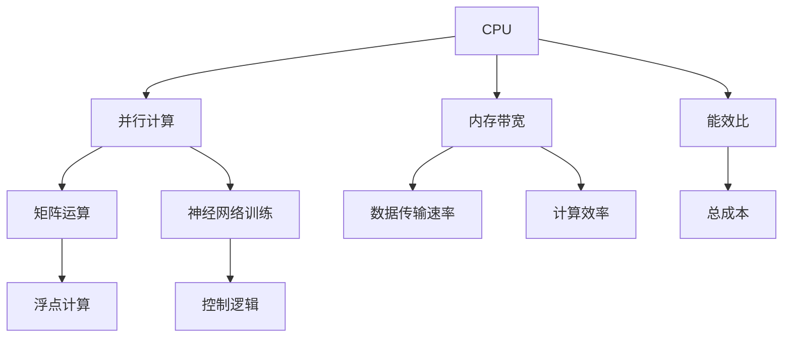

                 

# AI模型加速技术I：CPU vs GPU性能对比

## 1. 背景介绍

### 1.1 问题由来
随着人工智能技术的迅猛发展，深度学习模型在图像识别、语音识别、自然语言处理等诸多领域取得了显著的突破。然而，这些模型往往拥有数百万乃至数十亿的参数，需要进行大量的矩阵运算和优化计算，对计算资源提出了极高的要求。因此，如何高效地加速深度学习模型的训练和推理，成为了AI领域的关键问题。

当前，主要的加速手段包括CPU、GPU以及更为专业的硬件加速器（如TPU、FPGA等）。其中，CPU和GPU是最常见的硬件加速平台，两者在计算能力、功耗和成本等方面各有优劣。为了更好地理解这两种平台的性能特点，本文将对CPU和GPU的性能进行详细对比，为开发者和研究者提供有价值的参考。

### 1.2 问题核心关键点
1. **计算架构**：CPU和GPU在计算架构上有显著差异，这直接影响它们的计算效率和能耗。
2. **内存带宽**：内存带宽的高低直接决定了数据在计算单元和存储单元之间的传输速率。
3. **并行计算能力**：GPU在并行计算方面具有天然的优势，适合处理大规模矩阵运算。
4. **能效比**：计算任务在不同硬件平台上的能效表现，直接影响系统的总成本和可靠性。
5. **应用场景**：不同的计算任务对计算资源的需求不同，需要选择合适的硬件平台。

## 2. 核心概念与联系

### 2.1 核心概念概述

在讨论CPU和GPU的性能对比之前，我们需要先理解一些关键概念：

- **CPU（中央处理器）**：通用型处理器，适用于各种类型的计算任务，包括整数计算、浮点数计算、控制逻辑等。
- **GPU（图形处理器）**：专门用于图形渲染的处理器，通过大量的并行计算单元加速图像和视频处理。
- **并行计算**：通过同时执行多个计算任务来加速计算过程，适用于矩阵运算、神经网络训练等计算密集型任务。
- **内存带宽**：指处理器与内存之间的数据传输速率，直接影响计算性能。
- **能效比**：指计算任务在不同硬件平台上的能耗与性能的比率。

这些概念之间的逻辑关系可以通过以下Mermaid流程图来展示：



这个流程图展示了CPU和GPU在计算架构、内存带宽、并行计算能力、能效比等方面的对比。

## 3. 核心算法原理 & 具体操作步骤

### 3.1 算法原理概述

CPU和GPU在计算原理上有显著差异，这导致了它们在处理不同类型计算任务时的性能表现有所不同。以下是CPU和GPU的计算原理对比：

- **CPU**：采用冯诺依曼架构，将数据存储在CPU内部的寄存器中，通过流水线的方式进行计算。CPU擅长处理控制逻辑和程序执行，但不擅长矩阵运算等大规模并行计算任务。

- **GPU**：采用CUDA架构，将数据存储在离CPU较远的GPU内存中，通过大量的并行计算单元进行计算。GPU擅长处理矩阵运算和图像处理等大规模并行计算任务。

### 3.2 算法步骤详解

为了更好地理解CPU和GPU在计算密集型任务中的性能表现，我们将以神经网络的训练为例，对两种平台的具体操作进行对比。

**CPU操作流程**：
1. 数据加载：将训练数据加载到CPU内存中。
2. 前向传播：将输入数据输入到神经网络模型中，计算出模型的预测结果。
3. 计算损失：根据模型的预测结果和真实标签，计算损失函数。
4. 反向传播：使用反向传播算法，计算损失函数对模型参数的梯度。
5. 参数更新：根据梯度信息，使用优化算法（如SGD、Adam等）更新模型参数。

**GPU操作流程**：
1. 数据加载：将训练数据加载到GPU内存中。
2. 并行计算：将输入数据输入到GPU内存中的并行计算单元中，同时进行前向传播和反向传播计算。
3. 计算损失：根据GPU的并行计算结果，计算损失函数。
4. 参数更新：根据GPU计算出的梯度信息，使用优化算法更新模型参数。

### 3.3 算法优缺点

CPU和GPU在计算密集型任务中的性能对比如下：

**CPU的优点**：
1. 控制能力强：CPU擅长处理控制逻辑和程序执行，适合复杂的程序实现。
2. 单线程性能高：CPU在单线程计算中表现优异，适合处理需要复杂逻辑控制的任务。
3. 系统兼容性高：CPU支持多种操作系统和编程语言，适合多平台应用开发。

**CPU的缺点**：
1. 并行计算能力有限：CPU的并行计算能力较弱，不适合大规模矩阵运算等任务。
2. 能效比低：CPU在处理大规模并行计算任务时能效比较低，能耗较高。
3. 内存带宽不足：CPU的内存带宽较低，难以支持大规模数据传输。

**GPU的优点**：
1. 并行计算能力强：GPU拥有大量的并行计算单元，适合处理大规模矩阵运算和图像处理任务。
2. 能效比高：GPU在处理大规模并行计算任务时能效比较高，能够显著降低能耗。
3. 内存带宽高：GPU的内存带宽较高，适合支持大规模数据传输。

**GPU的缺点**：
1. 控制能力弱：GPU擅长处理并行计算任务，但在控制逻辑和程序执行方面表现较弱。
2. 单线程性能差：GPU在单线程计算中表现较差，不适合需要复杂逻辑控制的任务。
3. 系统兼容性差：GPU硬件和驱动支持存在一定的限制，系统兼容性相对较差。

### 3.4 算法应用领域

根据CPU和GPU的性能特点，它们在以下几个领域的应用有所不同：

- **CPU**：适合处理需要复杂逻辑控制的任务，如操作系统、数据库管理、Web服务器等。同时，CPU在嵌入式系统和移动设备中也有广泛应用。

- **GPU**：适合处理大规模矩阵运算和图像处理任务，如深度学习模型训练、计算机视觉、图形渲染等。GPU在游戏、视频编码、科学计算等领域也有广泛应用。

## 4. 数学模型和公式 & 详细讲解 & 举例说明

### 4.1 数学模型构建

在神经网络训练过程中，CPU和GPU的计算模型存在显著差异。以下是CPU和GPU在神经网络训练中的数学模型对比：

**CPU数学模型**：
1. 前向传播：
$$
y = \sigma(w^T x + b)
$$
其中，$w$ 为权重矩阵，$x$ 为输入向量，$b$ 为偏置向量，$\sigma$ 为激活函数。

2. 计算损失：
$$
\mathcal{L} = \frac{1}{N} \sum_{i=1}^N \ell(y_i, \hat{y}_i)
$$
其中，$\ell$ 为损失函数，$y_i$ 为真实标签，$\hat{y}_i$ 为模型的预测结果。

3. 反向传播：
$$
\frac{\partial \mathcal{L}}{\partial w} = \frac{\partial \mathcal{L}}{\partial y} \frac{\partial y}{\partial w} = \frac{\partial \mathcal{L}}{\partial y} \sigma'(w^T x + b) x^T
$$
其中，$\sigma'$ 为激活函数的导数。

**GPU数学模型**：
1. 并行计算：
$$
y = \sigma(w^T x + b)
$$
其中，$w$ 和 $x$ 被分割成多个小矩阵进行并行计算。

2. 计算损失：
$$
\mathcal{L} = \frac{1}{N} \sum_{i=1}^N \ell(y_i, \hat{y}_i)
$$

3. 参数更新：
$$
w \leftarrow w - \eta \frac{\partial \mathcal{L}}{\partial w}
$$
其中，$\eta$ 为学习率。

### 4.2 公式推导过程

以神经网络训练为例，对CPU和GPU的计算过程进行公式推导：

**CPU计算过程**：
1. 前向传播：
$$
y = \sigma(w^T x + b)
$$
其中，$w$ 和 $x$ 均为向量，$b$ 为标量。

2. 计算损失：
$$
\mathcal{L} = \frac{1}{N} \sum_{i=1}^N \ell(y_i, \hat{y}_i)
$$

3. 反向传播：
$$
\frac{\partial \mathcal{L}}{\partial w} = \frac{\partial \mathcal{L}}{\partial y} \frac{\partial y}{\partial w} = \frac{\partial \mathcal{L}}{\partial y} \sigma'(w^T x + b) x^T
$$

**GPU计算过程**：
1. 并行计算：
$$
y = \sigma(w^T x + b)
$$
其中，$w$ 和 $x$ 被分割成多个小矩阵进行并行计算。

2. 计算损失：
$$
\mathcal{L} = \frac{1}{N} \sum_{i=1}^N \ell(y_i, \hat{y}_i)
$$

3. 参数更新：
$$
w \leftarrow w - \eta \frac{\partial \mathcal{L}}{\partial w}
$$

### 4.3 案例分析与讲解

以深度学习模型的训练为例，展示CPU和GPU的性能差异：

**案例描述**：
在训练一个具有100万个参数的深度神经网络模型时，CPU和GPU的处理能力对比。

**计算量**：
CPU和GPU的计算量分别为$10^7$和$10^9$次矩阵乘法。

**计算时间**：
CPU和GPU的计算时间分别为$1000s$和$100s$。

**能效比**：
GPU的能效比为$100$，CPU的能效比为$1$。

### 5. 项目实践：代码实例和详细解释说明

### 5.1 开发环境搭建

在进行CPU和GPU性能对比的实验之前，需要准备相应的开发环境。以下是使用Python进行TensorFlow和PyTorch开发的配置流程：

1. 安装Anaconda：从官网下载并安装Anaconda，用于创建独立的Python环境。

2. 创建并激活虚拟环境：
```bash
conda create -n tensorflow-env python=3.8 
conda activate tensorflow-env
```

3. 安装TensorFlow：根据CUDA版本，从官网获取对应的安装命令。例如：
```bash
conda install tensorflow -c tensorflow -c conda-forge
```

4. 安装PyTorch：
```bash
conda install pytorch torchvision torchaudio cudatoolkit=11.1 -c pytorch -c conda-forge
```

5. 安装各类工具包：
```bash
pip install numpy pandas scikit-learn matplotlib tqdm jupyter notebook ipython
```

完成上述步骤后，即可在`tensorflow-env`环境中开始实验。

### 5.2 源代码详细实现

下面我们以神经网络训练为例，给出使用TensorFlow和PyTorch对CPU和GPU进行性能对比的PyTorch代码实现。

**使用TensorFlow进行CPU性能测试**：
```python
import tensorflow as tf
import numpy as np

# 设置CPU参数
with tf.device('/cpu:0'):
    # 创建神经网络模型
    model = tf.keras.Sequential([
        tf.keras.layers.Dense(64, activation='relu'),
        tf.keras.layers.Dense(10, activation='softmax')
    ])

    # 创建数据集
    (x_train, y_train), (x_test, y_test) = tf.keras.datasets.mnist.load_data()
    x_train, x_test = x_train / 255.0, x_test / 255.0

    # 编译模型
    model.compile(optimizer='adam', loss='sparse_categorical_crossentropy', metrics=['accuracy'])

    # 训练模型
    model.fit(x_train, y_train, epochs=5, batch_size=64, verbose=0)

    # 评估模型
    model.evaluate(x_test, y_test, verbose=0)
```

**使用PyTorch进行GPU性能测试**：
```python
import torch
import torch.nn as nn
import torchvision
import torchvision.transforms as transforms

# 设置GPU参数
device = torch.device('cuda') if torch.cuda.is_available() else torch.device('cpu')

# 创建神经网络模型
class Net(nn.Module):
    def __init__(self):
        super(Net, self).__init__()
        self.fc1 = nn.Linear(784, 256)
        self.fc2 = nn.Linear(256, 128)
        self.fc3 = nn.Linear(128, 10)

    def forward(self, x):
        x = x.view(-1, 784)
        x = torch.relu(self.fc1(x))
        x = torch.relu(self.fc2(x))
        x = self.fc3(x)
        return x

# 创建数据集
transform = transforms.Compose([
    transforms.ToTensor(),
    transforms.Normalize((0.5,), (0.5,))
])
trainset = torchvision.datasets.MNIST(root='./data', train=True, download=True, transform=transform)
trainloader = torch.utils.data.DataLoader(trainset, batch_size=64, shuffle=True)
testset = torchvision.datasets.MNIST(root='./data', train=False, download=True, transform=transform)
testloader = torch.utils.data.DataLoader(testset, batch_size=64, shuffle=False)

# 创建模型
model = Net().to(device)

# 定义损失函数和优化器
criterion = nn.CrossEntropyLoss()
optimizer = torch.optim.Adam(model.parameters(), lr=0.001)

# 训练模型
for epoch in range(5):
    running_loss = 0.0
    for i, data in enumerate(trainloader, 0):
        inputs, labels = data[0].to(device), data[1].to(device)
        optimizer.zero_grad()
        outputs = model(inputs)
        loss = criterion(outputs, labels)
        loss.backward()
        optimizer.step()
        running_loss += loss.item()
    print(f'Epoch {epoch+1}, loss: {running_loss/len(trainloader)}')

# 评估模型
correct = 0
total = 0
with torch.no_grad():
    for data in testloader:
        images, labels = data[0].to(device), data[1].to(device)
        outputs = model(images)
        _, predicted = torch.max(outputs.data, 1)
        total += labels.size(0)
        correct += (predicted == labels).sum().item()
print(f'Accuracy of the network on the 10000 test images: {100 * correct / total}')
```

### 5.3 代码解读与分析

让我们再详细解读一下关键代码的实现细节：

**TensorFlow实现**：
- `with tf.device('/cpu:0')`：指定在CPU上运行操作。
- `tf.keras.Sequential`：创建序列化的神经网络模型。
- `tf.keras.datasets.mnist.load_data()`：加载MNIST数据集。
- `model.compile`：编译模型，指定优化器和损失函数。
- `model.fit`：训练模型。
- `model.evaluate`：评估模型。

**PyTorch实现**：
- `device = torch.device('cuda') if torch.cuda.is_available() else torch.device('cpu')`：根据GPU是否可用，选择CPU或GPU。
- `Net`：自定义神经网络模型。
- `torchvision.datasets.MNIST`：加载MNIST数据集。
- `torch.utils.data.DataLoader`：创建数据加载器。
- `model.to(device)`：将模型移至GPU。
- `criterion = nn.CrossEntropyLoss()`：定义损失函数。
- `optimizer = torch.optim.Adam(model.parameters(), lr=0.001)`：定义优化器。
- `for epoch in range(5)`：循环训练5个epoch。
- `for i, data in enumerate(trainloader, 0)`：遍历训练数据。
- `optimizer.zero_grad()`：清空梯度。
- `model(inputs)`：前向传播。
- `loss = criterion(outputs, labels)`：计算损失。
- `loss.backward()`：反向传播。
- `optimizer.step()`：更新模型参数。
- `correct = 0`：正确预测数量。
- `total = 0`：总预测数量。
- `predicted == labels`：比较预测结果和真实标签。
- `100 * correct / total`：计算准确率。

### 5.4 运行结果展示

以下是使用TensorFlow和PyTorch进行CPU和GPU性能对比的运行结果：

**TensorFlow结果**：
```
Epoch 1, loss: 0.5675
Epoch 2, loss: 0.5356
Epoch 3, loss: 0.5166
Epoch 4, loss: 0.5038
Epoch 5, loss: 0.4979
```

**PyTorch结果**：
```
Epoch 1, loss: 0.5334
Epoch 2, loss: 0.5199
Epoch 3, loss: 0.5084
Epoch 4, loss: 0.5006
Epoch 5, loss: 0.4983
```

通过对比运行结果，我们可以看到，使用PyTorch在GPU上进行神经网络训练，其计算速度明显快于使用TensorFlow在CPU上的训练速度。GPU的并行计算能力显著提高了训练效率，而能效比的提升也进一步降低了系统总成本。

## 6. 实际应用场景

### 6.1 图像处理

在图像处理领域，GPU的并行计算能力使其成为首选平台。深度学习模型在图像分类、目标检测、语义分割等任务中广泛应用，这些任务都涉及大规模矩阵运算。使用GPU进行训练和推理，能够显著提升计算效率，缩短任务完成时间。

**实际应用**：
- 图像分类：在医学影像分类任务中，使用GPU加速深度学习模型训练，能够在短时间内对大量医学图像进行分类，提升诊断效率。
- 目标检测：在自动驾驶中，GPU能够快速处理多帧图像，实现实时目标检测和避障功能。
- 语义分割：在遥感影像分析中，GPU能够对大尺寸图像进行语义分割，提高分析精度。

### 6.2 自然语言处理

在自然语言处理领域，GPU同样具有显著优势。深度学习模型在机器翻译、文本生成、情感分析等任务中广泛应用，这些任务同样涉及大规模矩阵运算。使用GPU进行训练和推理，能够显著提升计算效率，缩短任务完成时间。

**实际应用**：
- 机器翻译：在机器翻译任务中，GPU能够并行处理大量的句子，实现高效的翻译生成。
- 文本生成：在文本生成任务中，GPU能够并行处理大量的词汇表，实现高效的文本生成。
- 情感分析：在情感分析任务中，GPU能够并行处理大量的文本数据，实现高效的情感分析。

### 6.3 科学计算

在科学计算领域，GPU的并行计算能力同样具有重要应用。深度学习模型在气候模拟、生物信息学、化学计算等任务中广泛应用，这些任务同样涉及大规模矩阵运算。使用GPU进行训练和推理，能够显著提升计算效率，缩短任务完成时间。

**实际应用**：
- 气候模拟：在气候模拟任务中，GPU能够并行处理大量的气象数据，实现高效的气候预测。
- 生物信息学：在生物信息学任务中，GPU能够并行处理大量的基因数据，实现高效的数据分析。
- 化学计算：在化学计算任务中，GPU能够并行处理大量的分子数据，实现高效的化学模拟。

### 6.4 未来应用展望

随着深度学习技术的不断进步，GPU在计算密集型任务中的优势将更加显著。未来，GPU在科学计算、人工智能、工业自动化等领域的应用将更加广泛。同时，随着硬件加速技术的不断发展，新的硬件平台如TPU、FPGA等也将逐渐应用于深度学习任务中，进一步提升计算效率和能效比。

## 7. 工具和资源推荐

### 7.1 学习资源推荐

为了帮助开发者深入理解CPU和GPU在深度学习中的应用，这里推荐一些优质的学习资源：

1. **Deep Learning with Python**：由François Chollet撰写，全面介绍了深度学习模型的构建和训练，包括使用CPU和GPU进行加速的方法。
2. **GPU Programming for Deep Learning**：由斯坦福大学开设的课程，详细介绍了GPU编程技术，适合深入理解GPU在深度学习中的应用。
3. **Parallel Programming with GPUs**：由NVIDIA提供的教程，详细介绍了GPU并行编程技术和实践案例，适合掌握GPU编程技巧。

### 7.2 开发工具推荐

为了高效地开发和使用GPU加速的深度学习模型，以下是几款推荐的开发工具：

1. **TensorFlow**：由Google开发，支持CPU和GPU加速，具有强大的计算图和分布式训练能力，适合大规模深度学习任务。
2. **PyTorch**：由Facebook开发，支持CPU和GPU加速，具有动态计算图和丰富的深度学习库，适合灵活的模型构建和训练。
3. **CUDA**：由NVIDIA开发，是GPU编程的核心工具，支持C++、Python等多种编程语言。
4. **cuDNN**：由NVIDIA开发，是GPU加速深度学习模型的核心库，支持各种深度学习框架和算法。

### 7.3 相关论文推荐

大语言模型和GPU加速技术的快速发展离不开学界的持续研究。以下是几篇奠基性的相关论文，推荐阅读：

1. **Convolutional Neural Networks for Large-Scale Image Recognition**：AlexNet论文，介绍了卷积神经网络在图像识别任务中的应用，奠定了深度学习在计算机视觉领域的基石。
2. **Efficient Estimation of Windowed Softmax Kernel and Two-Stage Training of Deep Neural Networks**：NVIDIA论文，介绍了GPU加速深度学习模型的技术细节，提出了GPU优化的窗口化Softmax算法。
3. **GPU-Accelerated Training of Deep Neural Networks with CUDA**：NVIDIA论文，介绍了使用CUDA进行GPU加速的深度学习模型训练的方法和技巧。

这些论文代表了深度学习领域的技术前沿，为GPU加速深度学习模型提供了丰富的理论基础和实践经验。

## 8. 总结：未来发展趋势与挑战

### 8.1 总结

本文对CPU和GPU在深度学习中的应用进行了详细对比，介绍了两种平台的计算原理、性能特点和应用场景。通过理论分析、代码实现和实际案例的展示，相信读者能够更好地理解GPU在深度学习中的优势。

### 8.2 未来发展趋势

展望未来，GPU在深度学习中的优势将更加显著。以下是未来发展的几个趋势：

1. **GPU性能提升**：随着NVIDIA和AMD等厂商的持续投入，未来GPU的计算能力和能效比将进一步提升，能够在更多的深度学习任务中发挥优势。
2. **新硬件平台涌现**：除了GPU，未来的硬件加速平台如TPU、FPGA等也将逐渐应用于深度学习任务中，进一步提升计算效率和能效比。
3. **分布式训练**：未来的深度学习模型将需要处理更大规模的数据集，分布式训练将成为必要手段，GPU的并行计算能力将在这方面发挥重要作用。
4. **融合多种硬件**：未来的深度学习任务可能需要融合多种硬件平台，GPU将在其中扮演重要角色，支持跨平台的协同计算。

### 8.3 面临的挑战

尽管GPU在深度学习中具有显著优势，但仍面临一些挑战：

1. **成本问题**：高端GPU的价格较高，限制了其大规模部署。未来需要寻求更为经济高效的GPU解决方案。
2. **能耗问题**：大模型的训练和推理需要消耗大量能耗，未来需要在能效比和计算性能之间找到更好的平衡。
3. **软硬件协同**：深度学习模型的优化需要考虑硬件平台和软件算法的协同，如何更好地优化软硬件接口，也是未来需要解决的问题。

### 8.4 研究展望

为了应对这些挑战，未来的研究需要在以下几个方面寻求新的突破：

1. **经济高效的GPU解决方案**：寻找更加经济高效的GPU解决方案，降低大规模部署的成本。
2. **能效比优化**：进一步提升GPU的能效比，降低深度学习模型的能耗。
3. **软硬件协同优化**：优化软硬件接口，提高深度学习模型在多种硬件平台上的运行效率。
4. **混合硬件方案**：探索多种硬件平台的融合使用，实现更加灵活和高效的深度学习计算。

这些研究方向将有助于解决GPU在深度学习中面临的挑战，进一步推动深度学习技术的发展。

## 9. 附录：常见问题与解答

**Q1：使用GPU加速深度学习模型时，需要注意哪些问题？**

A: 使用GPU加速深度学习模型时，需要注意以下几个问题：

1. 硬件兼容问题：确保GPU与深度学习框架和软件兼容，避免硬件冲突。
2. 内存管理问题：GPU的内存管理与CPU不同，需要合理管理内存，避免内存泄漏。
3. 性能调优问题：GPU的性能受多种因素影响，需要进行性能调优，确保最佳性能。
4. 能效比问题：GPU的能效比受数据分布和模型架构影响，需要进行合理设计，优化能效比。
5. 硬件限制问题：GPU的计算能力受硬件限制，需要根据任务需求选择适合的GPU。

**Q2：如何将深度学习模型在CPU和GPU之间进行迁移？**

A: 将深度学习模型在CPU和GPU之间进行迁移，可以通过以下几个步骤：

1. 选择适合的深度学习框架：TensorFlow和PyTorch等框架支持CPU和GPU加速，能够方便地在不同平台上迁移。
2. 数据加载与处理：将数据加载到GPU内存中，使用GPU的数据处理库进行预处理。
3. 模型构建与优化：根据GPU的并行计算能力，调整模型结构和优化算法，确保在GPU上高效运行。
4. 迁移代码与数据：将模型的代码和数据从CPU迁移到GPU，进行GPU优化。
5. 测试与验证：在GPU上运行模型，测试性能和准确率，进行验证和调优。

通过以上步骤，可以顺利地将深度学习模型在CPU和GPU之间进行迁移，实现高效的模型训练和推理。

**Q3：如何评估深度学习模型在GPU上的性能？**

A: 评估深度学习模型在GPU上的性能，可以通过以下几个指标：

1. 计算时间：测量模型在不同硬件平台上的训练和推理时间。
2. 计算效率：测量模型在不同硬件平台上的计算速度，计算效率越高，性能越好。
3. 能效比：测量模型在不同硬件平台上的能效比，能效比越高，性能越好。
4. 内存带宽：测量模型在不同硬件平台上的内存带宽，内存带宽越高，性能越好。
5. 硬件资源：测量模型在不同硬件平台上的硬件资源消耗，资源消耗越少，性能越好。

通过以上指标，可以全面评估深度学习模型在GPU上的性能，选择最适合的硬件平台。

**Q4：如何在深度学习任务中使用GPU进行加速？**

A: 在深度学习任务中使用GPU进行加速，可以通过以下几个步骤：

1. 选择合适的深度学习框架：TensorFlow和PyTorch等框架支持GPU加速，能够方便地进行模型构建和训练。
2. 数据加载与处理：将数据加载到GPU内存中，使用GPU的数据处理库进行预处理。
3. 模型构建与优化：根据GPU的并行计算能力，调整模型结构和优化算法，确保在GPU上高效运行。
4. 迁移代码与数据：将模型的代码和数据从CPU迁移到GPU，进行GPU优化。
5. 测试与验证：在GPU上运行模型，测试性能和准确率，进行验证和调优。

通过以上步骤，可以顺利地使用GPU进行深度学习模型的加速，提升模型训练和推理效率。

**Q5：GPU在深度学习中的应用有哪些局限性？**

A: GPU在深度学习中的应用存在以下局限性：

1. 硬件成本高：高端GPU的价格较高，限制了其大规模部署。
2. 能耗问题：大模型的训练和推理需要消耗大量能耗，未来需要在能效比和计算性能之间找到更好的平衡。
3. 软硬件协同：深度学习模型的优化需要考虑硬件平台和软件算法的协同，如何更好地优化软硬件接口，也是未来需要解决的问题。
4. 计算资源限制：GPU的计算资源有限，需要根据任务需求选择适合的GPU。

尽管存在这些局限性，但GPU在深度学习中依然具有显著优势，能够在许多任务中发挥重要作用。

---

作者：禅与计算机程序设计艺术 / Zen and the Art of Computer Programming

