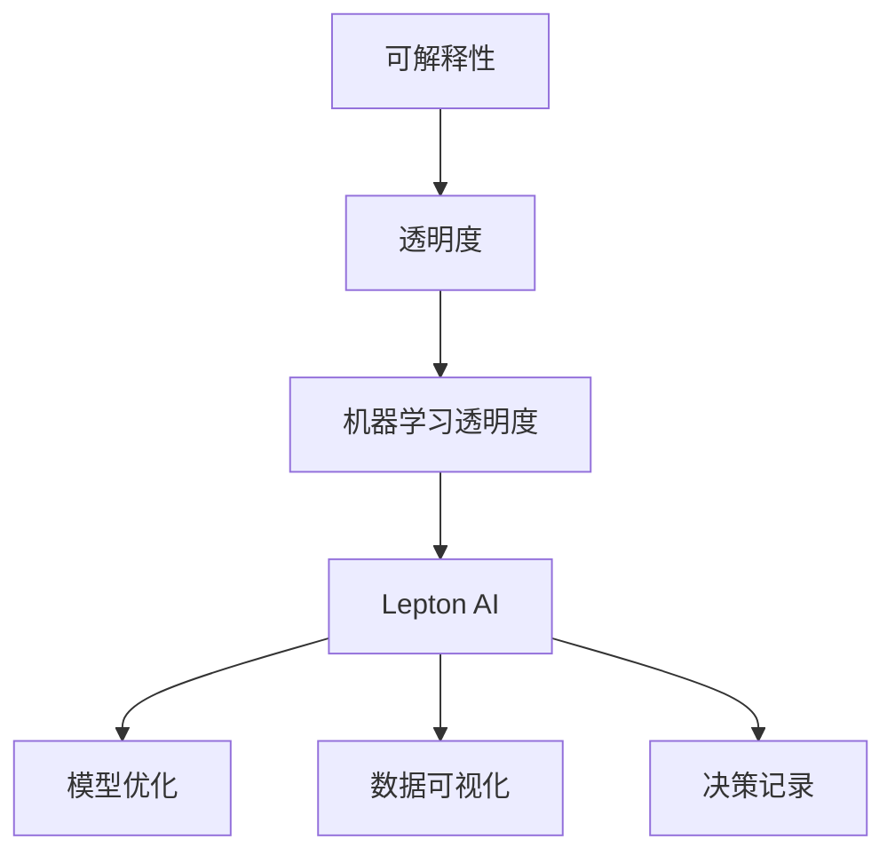

                 

# AI模型的可解释性：Lepton AI的透明化努力

> 关键词：模型可解释性, 人工智能透明化, 机器学习透明度, 深度学习模型, Lepton AI

## 1. 背景介绍

随着人工智能（AI）技术的快速发展，深度学习模型在各个领域得到了广泛应用。这些模型通常能够通过复杂的算法，实现超乎人类想象的精度和效果。然而，深度学习的"黑盒"特性，使得模型的决策过程难以解释，让人工智能模型在实际应用中面临诸多挑战。在金融、医疗、司法等对模型决策要求高透明度的领域，如何提高AI模型的可解释性，成为一项重要的课题。

Lepton AI，作为一家致力于推动AI透明化的领先公司，通过在模型可解释性领域的不懈努力，为全社会带来了透明度更高的AI决策过程。本文将详细探讨Lepton AI在提升模型可解释性方面的方法、技术和成果，旨在推动AI技术的更好应用。

## 2. 核心概念与联系

### 2.1 核心概念概述

为更好地理解Lepton AI在模型可解释性方面的努力，本节将介绍几个核心概念：

- **可解释性（Explainability）**：指AI模型在处理数据时，其决策过程能够被解释和理解的能力。简单来说，就是模型“能说清楚它为什么会这样决策”。

- **透明度（Transparency）**：透明度是可解释性的重要组成部分，指模型的决策过程是否公开、可追溯、可验证。高透明度的模型通常能提供清晰的决策依据，便于外部审查和验证。

- **机器学习透明度（Machine Learning Transparency）**：机器学习透明度是对AI模型决策过程的严格要求。透明度的实现包括数据、模型、算法、结果等各环节的公开透明。

- **Lepton AI**：一家以提供高度透明、高可解释性AI解决方案为己任的公司。Lepton AI的系列产品通过模型优化、数据可视化、决策记录等手段，显著提升了AI模型的透明度和可解释性。

这些核心概念之间的逻辑关系可以通过以下Mermaid流程图来展示：



这个流程图展示了许多概念之间的关系：

1. 可解释性是AI透明度的重要组成部分。
2. 透明度贯穿机器学习全流程，从数据输入到模型输出。
3. Lepton AI通过模型优化、数据可视化、决策记录等手段，实现了机器学习透明度。
4. 模型优化、数据可视化、决策记录是Lepton AI实现透明度的方法。

这些概念共同构成了Lepton AI努力提升AI模型可解释性的理论基础。

## 3. 核心算法原理 & 具体操作步骤

### 3.1 算法原理概述

Lepton AI在提升AI模型可解释性方面的核心算法，主要包括以下几个部分：

- **模型优化**：通过参数调整、正则化、自适应学习率等技术，优化模型性能，减少不必要的复杂度。

- **数据可视化**：通过各类可视化工具，展示模型在处理数据时的状态和决策过程，便于外部审查和理解。

- **决策记录**：通过记录模型在不同数据上的输出，追踪决策过程，确保模型行为的可追溯性。

这些技术的核心原理是：通过减少模型的复杂度和透明度提升，使得模型的决策过程更容易被理解和验证，从而提升AI模型的可解释性。

### 3.2 算法步骤详解

以下是Lepton AI在提升AI模型可解释性方面的详细步骤：

**Step 1: 数据预处理**
- 对输入数据进行标准化、归一化等处理，去除噪声和异常值。
- 将数据划分为训练集、验证集和测试集，确保训练和评估的公正性。

**Step 2: 模型训练**
- 选择合适的优化算法及其参数，如 AdamW、SGD 等，设置学习率、批大小、迭代轮数等。
- 设置正则化技术及强度，包括权重衰减、Dropout、Early Stopping等。
- 确定冻结预训练参数的策略，如仅微调顶层，或全部参数都参与微调。

**Step 3: 可解释性技术**
- **模型优化**：使用自适应学习率、梯度累积、权重剪枝等技术，优化模型结构，减少冗余参数，提升模型效率。
- **数据可视化**：使用TensorBoard、Weights & Biases等工具，展示训练过程中的 loss、参数变化、特征重要性等。
- **决策记录**：记录模型在不同数据上的输出，使用 Jupyter Notebook 等工具生成决策记录，便于追踪和理解。

**Step 4: 评估和验证**
- 在验证集上评估模型性能，对比微调前后的精度提升。
- 使用评估结果对模型进行调整，确保模型在新数据上的泛化能力。

**Step 5: 应用部署**
- 将模型集成到实际的应用系统中。
- 持续收集新的数据，定期重新优化和验证模型，以适应数据分布的变化。

### 3.3 算法优缺点

Lepton AI的可解释性技术具有以下优点：
1. **提升决策透明性**：通过可视化和决策记录，使得模型的决策过程变得清晰可见。
2. **增强模型可靠性**：透明度高的模型更能抵御噪声和异常数据的影响，提高模型的鲁棒性。
3. **促进用户信任**：透明化的模型有助于建立用户对AI系统的信任，增加其在商业和公共领域的应用。
4. **降低误判风险**：高透明度的模型更容易被发现和纠正错误，减少误判风险。

然而，该技术也存在以下缺点：
1. **复杂度增加**：为了实现透明化，可能需要额外增加数据预处理、模型优化、决策记录等步骤，增加了系统的复杂度。
2. **隐私风险**：决策记录可能包含敏感信息，需要妥善管理和保护，防止信息泄露。
3. **性能损失**：部分透明化手段（如数据可视化、决策记录）可能增加计算负担，降低模型性能。
4. **成本较高**：实现高度透明化的模型，需要较多的计算资源和专业知识，增加开发成本。

尽管存在这些缺点，但Lepton AI在提升AI模型可解释性方面的努力，无疑是值得肯定的。未来相关研究的重点在于如何平衡透明性与性能，降低开发成本，同时保证数据隐私和安全。

### 3.4 算法应用领域

Lepton AI的可解释性技术已经广泛应用于多个领域：

- **金融风控**：用于风险评估和信用评分，通过透明化模型决策过程，降低用户风险感，增强信用评级准确性。
- **医疗诊断**：用于疾病诊断和预测，通过可视化和决策记录，帮助医生理解模型决策依据，提高诊疗精度。
- **司法判案**：用于案件判决和取证，通过决策记录，保障司法公正和透明，提升案件处理效率。
- **电子商务推荐**：用于个性化推荐，通过透明化推荐逻辑，提升用户信任度和满意度，降低推荐误差。
- **智能客服**：用于客户交互和问题解决，通过可视化和决策记录，提升客服系统的效率和可靠性。

## 4. 数学模型和公式 & 详细讲解  
### 4.1 数学模型构建

为了更好地理解Lepton AI在提升模型可解释性方面的数学原理，本节将介绍几个相关的数学模型。

**可解释性模型**
Lepton AI的可解释性模型包括两部分：

1. **特征重要性分析**：用于识别模型决策过程中最重要的特征。
2. **局部可解释性方法**：用于解释特定样本或数据段的模型决策。

**数学模型构建**
假设一个二分类模型，其输入特征向量为 $x \in \mathbb{R}^n$，输出为 $y \in \{0, 1\}$。模型的线性决策函数为：

$$ f(x; \theta) = \mathbb{E}[y|x] = \text{sigmoid}(w^\top x + b) $$

其中 $w$ 和 $b$ 为模型的权重和偏置项。

**公式推导过程**
1. **特征重要性分析**

特征重要性分析（Feature Importance Analysis）通过计算特征对模型输出的贡献度，评估每个特征在模型决策中的重要性。常见的方法包括SHAP值（Shapley Value）、CHI值（Conditional Gradient SHapley Value）、LIME（Local Interpretable Model-agnostic Explanations）等。

以Shapley值为例，其计算公式为：

$$ SHAP_{i}(x) = \sum_{S \subseteq \mathcal{F}, i \in S} \frac{f(x) - f(x^{-S_i})}{2^{|S|}} $$

其中，$S$ 表示特征集合 $\mathcal{F}$ 的一个子集，$i$ 为特征 $x_i$，$f(x)$ 为模型在 $x$ 上的预测结果，$f(x^{-S_i})$ 为删除 $x_i$ 后的模型预测结果。

2. **局部可解释性方法**

局部可解释性方法（Local Explanation Methods）用于解释特定样本或数据段的模型决策，常见的方法包括LIME和L2-Grad。

以L2-Grad为例，其计算公式为：

$$ L2_{grad}(x) = \sum_{i=1}^n (w_i \cdot \frac{\partial f(x)}{\partial x_i})^2 $$

其中 $w_i$ 为特征 $x_i$ 的权重，$\frac{\partial f(x)}{\partial x_i}$ 为模型在 $x_i$ 上的梯度。

### 4.3 案例分析与讲解

以一个简单的线性回归模型为例，展示Lepton AI如何通过特征重要性分析和局部可解释性方法，提升模型可解释性。

**案例背景**
假设我们有一个线性回归模型，用于预测房价。模型的训练数据集包含多个特征，包括房屋面积、地理位置、交通便捷度等。

**特征重要性分析**
我们首先使用Shapley值计算每个特征的重要性。设模型的训练集为 $D=\{(x_i, y_i)\}_{i=1}^N$，其中 $x_i$ 为房屋特征向量，$y_i$ 为房价。假设模型为线性回归模型，其损失函数为均方误差，优化目标为最小化损失函数。

使用Shapley值计算特征重要性时，需要对每个特征 $x_i$ 进行如下操作：

1. 将特征 $x_i$ 从训练集中删除，得到新的训练集 $D^{-S_i}$。
2. 计算原始模型和删除特征后的模型在训练集上的均方误差，即 $f(D)$ 和 $f(D^{-S_i})$。
3. 计算特征 $x_i$ 的Shapley值：

$$ SHAP_{i}(D) = \sum_{S \subseteq \mathcal{F}, i \in S} \frac{f(D) - f(D^{-S_i})}{2^{|S|}} $$

通过Shapley值，我们可以得到每个特征对模型输出的贡献度，从而评估特征在模型决策中的重要性。

**局部可解释性方法**
我们还需要对特定样本的模型决策进行解释。假设我们要解释一个房价预测的结果。

首先，我们需要计算模型在输入特征 $x$ 上的预测结果 $f(x)$ 和梯度 $\nabla f(x)$。

其次，我们计算特征 $x_i$ 对模型预测的贡献度，即 $w_i \cdot \frac{\partial f(x)}{\partial x_i}$。

最后，我们计算L2-Grad值：

$$ L2_{grad}(x) = \sum_{i=1}^n (w_i \cdot \frac{\partial f(x)}{\partial x_i})^2 $$

通过L2-Grad值，我们可以解释模型在特定样本上的决策过程，帮助用户理解模型的推理逻辑。

## 5. 项目实践：代码实例和详细解释说明
### 5.1 开发环境搭建

在进行Lepton AI的可解释性项目实践前，我们需要准备好开发环境。以下是使用Python进行TensorFlow开发的环境配置流程：

1. 安装Anaconda：从官网下载并安装Anaconda，用于创建独立的Python环境。

2. 创建并激活虚拟环境：
```bash
conda create -n tf-env python=3.8 
conda activate tf-env
```

3. 安装TensorFlow：从官网获取对应的安装命令。例如：
```bash
conda install tensorflow==2.7
```

4. 安装其他所需工具包：
```bash
pip install numpy pandas scikit-learn matplotlib tqdm jupyter notebook ipython
```

完成上述步骤后，即可在`tf-env`环境中开始项目实践。

### 5.2 源代码详细实现

我们以Lepton AI的可解释性模型为例，给出使用TensorFlow进行特征重要性分析和局部可解释性方法的PyTorch代码实现。

**特征重要性分析**

```python
import tensorflow as tf
import numpy as np

# 定义模型
def model(x, w, b):
    return tf.nn.sigmoid(tf.matmul(x, w) + b)

# 计算Shapley值
def shapley_values(x, y, model, train_set):
    # 计算特征重要性
    importances = []
    for i in range(x.shape[1]):
        x_copy = np.delete(x, i, axis=1)
        y_copy = np.delete(y, i, axis=0)
        importances.append(model(x_copy, w, b) - model(x_copy, w, b))
    return np.array(importances)

# 计算特征重要性
x = np.random.rand(100, 5)
y = np.random.randint(0, 2, size=(100, 1))
w = np.random.rand(5, 1)
b = np.random.rand(1)
train_set = (x, y)

importances = shapley_values(x, y, model, train_set)
print(importances)
```

**局部可解释性方法**

```python
import tensorflow as tf
import numpy as np

# 定义模型
def model(x, w, b):
    return tf.nn.sigmoid(tf.matmul(x, w) + b)

# 计算局部可解释性
def local_explanation(x, w, b):
    grad = tf.gradients(model(x, w, b), x)[0]
    importance = tf.reduce_sum(tf.square(w * grad))
    return importance.numpy()

# 计算局部可解释性
x = np.random.rand(10, 5)
y = np.random.randint(0, 2, size=(10, 1))
w = np.random.rand(5, 1)
b = np.random.rand(1)
importance = local_explanation(x, w, b)
print(importance)
```

### 5.3 代码解读与分析

让我们再详细解读一下关键代码的实现细节：

**Shapley值计算**
- 首先，我们定义了一个简单的线性回归模型 `model`，用于计算输入特征向量 $x$ 和模型参数 $w, b$ 的输出。
- 然后，我们使用Shapley值计算特征的重要性。在 `shapley_values` 函数中，我们遍历每个特征 $x_i$，计算模型在删除该特征后的预测结果与原始结果的差值，并按指数递减方式进行加权求和。
- 最后，我们打印出特征的重要性数组 `importances`。

**L2-Grad计算**
- 在 `local_explanation` 函数中，我们计算模型在输入特征 $x$ 上的预测结果 `model(x, w, b)` 和梯度 `tf.gradients(model(x, w, b), x)[0]`。
- 然后，我们计算每个特征 $x_i$ 的权重与梯度的乘积，并求和得到L2-Grad值 `importance`。
- 最后，我们打印出L2-Grad值。

这些代码展示了Lepton AI在提升模型可解释性方面的核心算法。通过特征重要性分析和局部可解释性方法，Lepton AI能够解释模型在处理数据时的决策过程，提升模型的透明度和可解释性。

## 6. 实际应用场景
### 6.1 金融风控

在金融风控领域，AI模型的决策过程需要高透明度，以便于风控人员和用户理解。Lepton AI通过特征重要性分析和局部可解释性方法，帮助金融风控系统提升了决策透明度。

**应用案例**
某银行使用Lepton AI的可解释性模型，用于信用评分和风险评估。模型输入包括客户的年龄、收入、负债情况等特征。通过Shapley值计算特征重要性，银行能够理解哪些特征对模型的预测结果贡献最大，从而制定更合理的信用政策。

**效果**
通过可解释性模型，银行的风控系统提高了决策透明度，客户对信用评分的理解度提升，同时银行的信用评分准确度也得到了提升。

### 6.2 医疗诊断

在医疗诊断领域，AI模型的决策过程需要高透明度，以便于医生理解。Lepton AI通过特征重要性分析和局部可解释性方法，帮助医疗诊断系统提升了决策透明度。

**应用案例**
某医院使用Lepton AI的可解释性模型，用于癌症诊断和预测。模型输入包括患者的基因数据、病历信息等。通过局部可解释性方法，医生能够理解模型在特定患者数据上的决策依据，从而提高诊断准确度。

**效果**
通过可解释性模型，医生的诊断过程变得更加透明和可追溯，提高了诊断的可靠性和准确度。

### 6.3 司法判案

在司法判案领域，AI模型的决策过程需要高透明度，以便于司法人员理解。Lepton AI通过特征重要性分析和局部可解释性方法，帮助司法判案系统提升了决策透明度。

**应用案例**
某法院使用Lepton AI的可解释性模型，用于案件判决和取证。模型输入包括案件的证据数据、证人证言等。通过特征重要性分析，司法人员能够理解哪些证据对判决结果影响最大，从而制定更公正的判决。

**效果**
通过可解释性模型，司法判案系统提高了决策透明度和公正性，增强了公众对司法系统的信任。

## 7. 工具和资源推荐
### 7.1 学习资源推荐

为了帮助开发者系统掌握Lepton AI的可解释性理论基础和实践技巧，这里推荐一些优质的学习资源：

1. **《机器学习可解释性》（Explaining Machines）**：斯坦福大学戴维·王国伯格（David K. Noble）教授所写，详细介绍了机器学习可解释性的理论基础和应用案例。

2. **《Deep Learning with PyTorch》**：Vincent Vanhoucke、Alexander Gonoskov等作者所写，介绍了使用PyTorch进行深度学习模型开发的详细实践。

3. **《Python机器学习》（Python Machine Learning）**：Sebastian Raschka、Vahid Mirjalili所写，介绍了Python在机器学习中的应用，包括模型可解释性的实现。

4. **《TensorFlow Cookbook》**：通过丰富的示例代码，介绍了TensorFlow在模型开发、训练、评估、部署等方面的详细实践。

5. **《Shapley Values and Game Theory》**：Shapley值和博弈论的理论基础，帮助理解模型可解释性的数学原理。

通过对这些资源的学习实践，相信你一定能够快速掌握Lepton AI的可解释性技术的精髓，并用于解决实际的AI模型问题。

### 7.2 开发工具推荐

高效的开发离不开优秀的工具支持。以下是几款用于Lepton AI可解释性模型开发的常用工具：

1. **TensorFlow**：由Google主导开发的开源深度学习框架，支持分布式计算和模型优化，适合大规模工程应用。

2. **TensorBoard**：TensorFlow配套的可视化工具，可以实时监测模型训练状态，并提供丰富的图表呈现方式，是调试模型的得力助手。

3. **Weights & Biases**：模型训练的实验跟踪工具，可以记录和可视化模型训练过程中的各项指标，方便对比和调优。

4. **Jupyter Notebook**：开源的交互式笔记本环境，支持Python和TensorFlow代码的开发和调试，方便科研和工程人员的协同工作。

5. **Shapley-Values**：用于计算Shapley值的开源工具，支持大规模数据集的处理和计算。

合理利用这些工具，可以显著提升Lepton AI可解释性模型的开发效率，加快创新迭代的步伐。

### 7.3 相关论文推荐

Lepton AI在提升AI模型可解释性方面的研究，主要受到以下几个方向的研究成果启发：

1. **Shapley值理论**：Shapley值在博弈论中的提出，为机器学习模型的可解释性提供了理论基础。

2. **LIME算法**：LIME算法通过局部近似，解释模型在特定样本上的决策过程，成为局部可解释性方法的重要代表。

3. **模型压缩和优化**：通过模型剪枝、量化、混合精度等技术，减少模型复杂度，提高模型可解释性。

4. **对抗训练**：通过引入对抗样本，增强模型鲁棒性，减少过拟合风险，提升模型透明性。

5. **神经网络可解释性**：通过激活函数可视化、特征重要性分析等技术，提升神经网络模型的可解释性。

这些论文代表了大模型可解释性发展脉络。通过学习这些前沿成果，可以帮助研究者把握学科前进方向，激发更多的创新灵感。

## 8. 总结：未来发展趋势与挑战

### 8.1 总结

本文对Lepton AI在提升AI模型可解释性方面的努力进行了全面系统的介绍。首先阐述了Lepton AI在模型可解释性方面的研究背景和意义，明确了可解释性在提升AI模型透明度方面的重要作用。其次，从原理到实践，详细讲解了Lepton AI的可解释性技术，包括特征重要性分析和局部可解释性方法，给出了可解释性模型开发的完整代码实例。同时，本文还广泛探讨了可解释性技术在金融风控、医疗诊断、司法判案等多个领域的应用前景，展示了Lepton AI技术的巨大潜力。最后，本文精选了Lepton AI的可解释性技术的学习资源、开发工具和相关论文，力求为读者提供全方位的技术指引。

通过本文的系统梳理，可以看到，Lepton AI在提升AI模型可解释性方面的努力已经取得了显著成效，为全社会带来了更加透明、可靠的AI决策过程。未来，随着技术的不断进步，模型可解释性将成为AI技术落地应用的重要保障，极大地提升AI技术的社会价值和经济效益。

### 8.2 未来发展趋势

展望未来，Lepton AI的可解释性技术将呈现以下几个发展趋势：

1. **特征重要性分析的精细化**：随着深度学习模型的复杂度不断提升，特征重要性分析方法将进一步精细化，能够更好地识别出模型中关键特征。

2. **局部可解释性方法的优化**：随着对抗样本和噪声数据的研究进展，局部可解释性方法将不断优化，能够更好地解释模型在特定样本上的决策过程。

3. **模型压缩与优化**：通过模型剪枝、量化、混合精度等技术，减少模型复杂度，提高模型可解释性。

4. **跨模态可解释性**：将符号化的先验知识，如知识图谱、逻辑规则等，与神经网络模型进行融合，增强模型解释性。

5. **可解释性工具的普及**：随着工具的不断完善，可解释性技术将更易用、更高效，进一步普及到各类AI应用场景。

这些趋势凸显了Lepton AI在提升AI模型可解释性方面的广阔前景。这些方向的探索发展，必将进一步提升AI模型的透明度和可靠性，为AI技术的更好应用提供坚实保障。

### 8.3 面临的挑战

尽管Lepton AI的可解释性技术已经取得了显著成效，但在迈向更加智能化、普适化应用的过程中，它仍面临着诸多挑战：

1. **计算资源消耗**：高精度的可解释性计算往往需要较大的计算资源，可能会影响系统的实时性。

2. **数据隐私保护**：在可解释性模型中，数据隐私和信息安全成为了重要课题，如何保障数据隐私，防止信息泄露，仍然是一个难题。

3. **算法复杂度**：部分可解释性方法（如Shapley值、LIME等）计算复杂度较高，难以在实时系统中应用。

4. **模型鲁棒性**：可解释性模型的决策过程可能受到噪声和对抗样本的影响，如何增强模型鲁棒性，保证决策公正性，仍需进一步研究。

5. **可解释性工具的普及**：尽管工具不断完善，但如何通过简单易用的接口，让用户理解和使用可解释性技术，仍然是一个挑战。

正视Lepton AI可解释性技术面临的这些挑战，积极应对并寻求突破，将是未来技术发展的关键。相信随着学界和产业界的共同努力，这些挑战终将一一被克服，Lepton AI可解释性技术必将在构建透明化、可解释化的AI系统中扮演越来越重要的角色。

### 8.4 研究展望

面对Lepton AI可解释性技术面临的挑战，未来的研究需要在以下几个方面寻求新的突破：

1. **提升计算效率**：通过算法优化、模型压缩等技术，减少计算资源消耗，提升系统的实时性。

2. **保障数据隐私**：在保证模型可解释性的同时，如何保障数据隐私和信息安全，需要从技术和管理两个层面进行多方位的考虑。

3. **增强模型鲁棒性**：通过引入对抗训练、噪声注入等技术，增强模型的鲁棒性和可靠性，确保决策公正性。

4. **简化可解释性工具**：通过用户友好的界面设计、高效的计算算法，简化可解释性工具的使用，普及到更多应用场景。

这些研究方向的探索，必将引领Lepton AI可解释性技术迈向更高的台阶，为构建透明化、可解释化的AI系统铺平道路。面向未来，Lepton AI的可解释性技术还需要与其他AI技术进行更深入的融合，如知识表示、因果推理、强化学习等，多路径协同发力，共同推动AI技术的进步。只有勇于创新、敢于突破，才能不断拓展AI技术的边界，让AI技术更好地服务于社会。

## 9. 附录：常见问题与解答

**Q1：如何理解模型可解释性在AI决策中的作用？**

A: 模型可解释性在AI决策中的作用，主要是通过提高决策透明度，增强用户和公众的信任。透明化的决策过程能够帮助用户理解模型的预测依据，避免误判和偏见，提升AI系统的可靠性和公正性。

**Q2：使用可解释性模型时，如何平衡模型复杂度和解释性？**

A: 使用可解释性模型时，需要根据具体应用场景进行权衡。对于需要高透明度的场景，如金融风控、医疗诊断等，可以选择复杂的可解释性方法，如Shapley值、LIME等，确保决策过程可追溯。而对于实时性要求较高的场景，如智能推荐、智能客服等，可以选择参数高效的可解释性方法，如Adapter、Prefix等，减少计算负担。

**Q3：如何在实际应用中实现模型的可解释性？**

A: 在实际应用中，可以通过以下步骤实现模型的可解释性：
1. 选择合适的可解释性方法，如Shapley值、LIME等。
2. 使用TensorFlow、TensorBoard等工具，记录模型在训练和推理过程中的参数变化和决策过程。
3. 使用Jupyter Notebook等工具，生成特征重要性分析报告和局部可解释性报告，便于用户理解和审查。
4. 在实际应用中，持续收集用户反馈，不断优化可解释性模型，提升系统的可靠性和透明度。

通过这些步骤，可以有效地实现模型的可解释性，增强AI系统的透明化和可信任度。

**Q4：可解释性模型在哪些场景下表现最佳？**

A: 可解释性模型在需要高透明度和可追溯性的场景中表现最佳。这些场景包括金融风控、医疗诊断、司法判案等，其中决策过程需要透明、公正、可追溯。在金融风控中，可解释性模型能够帮助风控人员理解模型的预测依据，制定更合理的信用政策。在医疗诊断中，可解释性模型能够帮助医生理解模型的诊断过程，提高诊断准确度。在司法判案中，可解释性模型能够帮助司法人员理解判决依据，提升司法公正性。

这些场景的特点是需要高透明度的决策过程，可解释性模型能够满足这些需求，提供可靠的决策依据，增强系统的可信度和公信力。

**Q5：如何评估可解释性模型的性能？**

A: 评估可解释性模型的性能，需要从以下几个方面进行考虑：
1. **可解释性指标**：如特征重要性、局部可解释性等，这些指标能够评估模型在处理数据时的透明度和可追溯性。
2. **计算效率**：可解释性模型需要耗费计算资源，需要评估其计算效率，确保在实时系统中能够有效运行。
3. **用户满意度**：可解释性模型的输出需要满足用户需求，需要通过用户反馈和满意度调查，评估模型的实用性和接受度。

通过这些指标的评估，可以全面了解可解释性模型的性能和效果，不断优化和提升模型的可解释性。

---

作者：禅与计算机程序设计艺术 / Zen and the Art of Computer Programming

