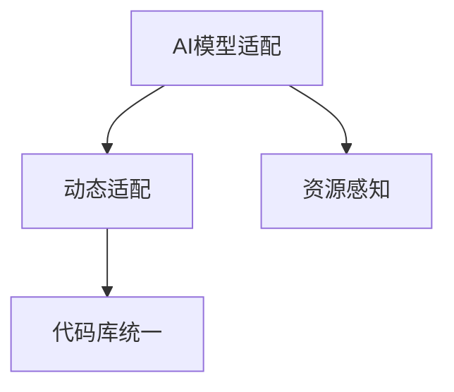
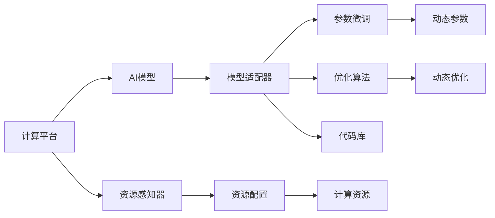

                 

# AI模型的跨平台兼容：Lepton AI的适配方案

在当今高度分散的计算环境中，AI模型的跨平台兼容性成为了一个至关重要的问题。由于不同的硬件平台和操作系统具有不同的性能特点和计算能力，AI模型的性能在不同平台上的表现往往不尽相同。为了克服这一问题，Lepton AI提出了一种创新的适配方案，确保AI模型能够在各种计算环境上高效、稳定地运行。本文将深入探讨Lepton AI的跨平台兼容方案，并分析其在实际应用中的优势和挑战。

## 1. 背景介绍

随着人工智能技术的快速发展，越来越多的AI模型被应用于各种领域，包括医疗、金融、教育等。然而，由于计算环境的异构性，不同平台上的AI模型表现往往不一致。例如，在移动设备上，计算资源有限，而在服务器上，计算资源丰富。这种计算环境的多样性，使得AI模型的跨平台兼容性成为一大难题。为了解决这一问题，Lepton AI提出了一种新的适配方案，旨在提高AI模型的跨平台兼容性，确保模型在不同平台上的性能一致。

## 2. 核心概念与联系

### 2.1 核心概念概述

Lepton AI的跨平台兼容方案涉及以下几个核心概念：

- **AI模型适配**：指在保持AI模型性能的同时，针对不同的计算平台进行调整，使其能够在多种硬件和操作系统上高效运行。
- **动态适配**：指根据实际计算资源和性能，自动调整模型参数和优化算法，实现最优的跨平台性能。
- **资源感知**：指在适配过程中，模型能够感知并利用不同平台上的资源，包括CPU、GPU、内存等。
- **代码库统一**：指使用统一的代码库，在不同平台上编译和运行模型，减少代码维护和更新成本。

这些核心概念之间的逻辑关系可以通过以下Mermaid流程图来展示：



这个流程图展示了Lepton AI跨平台兼容方案的基本框架：AI模型适配通过动态适配和资源感知，在不同平台上实现最优性能，同时通过代码库统一，降低维护成本。

### 2.2 核心概念原理和架构的 Mermaid 流程图



这个Mermaid流程图展示了Lepton AI跨平台兼容方案的架构。计算平台提供计算资源，AI模型由模型适配器进行处理，通过参数微调和优化算法进行适配。资源感知器根据平台资源进行配置，确保模型能够充分利用资源。最终，模型通过代码库进行统一部署，实现跨平台兼容。

## 3. 核心算法原理 & 具体操作步骤

### 3.1 算法原理概述

Lepton AI的跨平台兼容方案主要基于以下两个核心算法：

- **动态参数微调算法**：根据不同平台上的计算资源，动态调整模型参数，确保模型能够在各种平台上高效运行。
- **动态优化算法**：根据平台上的计算能力和数据特点，自动选择最优的优化算法，提升模型性能。

### 3.2 算法步骤详解

Lepton AI的跨平台兼容方案包括以下几个关键步骤：

**Step 1: 资源感知与配置**

- 在模型适配阶段，资源感知器首先对当前计算平台进行资源感知，包括CPU、GPU、内存等。
- 根据感知到的资源情况，自动调整计算资源的分配，确保模型能够充分利用可用资源。

**Step 2: 动态参数微调**

- 根据计算平台的特点，动态调整模型的参数。例如，在资源有限的环境中，减少模型中的可训练参数，提升计算效率。
- 在计算资源丰富的环境中，增加模型参数，提升模型性能。

**Step 3: 动态优化算法选择**

- 根据计算平台的特点和数据类型，自动选择最优的优化算法。例如，在移动设备上，选择轻量级的优化算法，减少计算消耗。

**Step 4: 模型适配与部署**

- 在适配完成后，使用代码库中的统一代码进行模型部署。
- 在不同平台上进行测试和优化，确保模型能够在各种环境上稳定运行。

### 3.3 算法优缺点

Lepton AI的跨平台兼容方案具有以下优点：

- **高效**：通过动态参数微调和动态优化算法，确保模型在不同平台上的高效运行。
- **稳定**：通过资源感知和适配，确保模型在不同平台上的性能一致。
- **灵活**：通过动态适配，确保模型能够适应各种计算环境。

同时，该方案也存在一些局限性：

- **复杂度较高**：动态适配和资源感知需要较为复杂的计算，可能会增加系统的复杂度。
- **资源消耗较大**：动态参数微调和动态优化算法需要额外的计算资源，可能会增加系统的资源消耗。

### 3.4 算法应用领域

Lepton AI的跨平台兼容方案在多个领域中得到了应用，包括：

- **医疗诊断**：AI模型在医疗影像、病历分析等方面应用广泛，需要跨平台兼容以支持不同医院和设备的计算环境。
- **金融分析**：AI模型在金融市场预测、风险评估等方面应用广泛，需要跨平台兼容以支持不同银行和证券公司的计算环境。
- **教育培训**：AI模型在智能教育、在线培训等方面应用广泛，需要跨平台兼容以支持不同学校和教育机构的计算环境。
- **工业制造**：AI模型在工业自动化、智能制造等方面应用广泛，需要跨平台兼容以支持不同工厂和设备的计算环境。

## 4. 数学模型和公式 & 详细讲解 & 举例说明

### 4.1 数学模型构建

Lepton AI的跨平台兼容方案基于以下数学模型构建：

- **资源感知模型**：用于感知和评估计算平台上的资源情况，包括CPU、GPU、内存等。
- **动态参数微调模型**：用于根据资源情况，动态调整模型的参数。
- **动态优化模型**：用于根据平台特点和数据类型，自动选择最优的优化算法。

### 4.2 公式推导过程

以下是Lepton AI跨平台兼容方案中用到的主要公式：

- **资源感知模型公式**：
$$
R_i = \sum_{j=1}^{n} w_j R_{i,j}
$$
其中，$R_i$ 表示资源感知器的输出，$w_j$ 表示各项资源的重要权重，$R_{i,j}$ 表示平台上的第 $j$ 项资源的实际值。

- **动态参数微调模型公式**：
$$
\theta_{post} = f(\theta_{pre}, R)
$$
其中，$\theta_{post}$ 表示适配后的模型参数，$\theta_{pre}$ 表示原始模型参数，$R$ 表示平台上的资源情况。

- **动态优化模型公式**：
$$
\alpha = g(D, R)
$$
其中，$\alpha$ 表示最优的优化算法，$D$ 表示数据类型，$R$ 表示平台上的资源情况。

### 4.3 案例分析与讲解

以医疗影像分析为例，Lepton AI的跨平台兼容方案具体步骤如下：

- **资源感知**：在CT扫描仪上，感知到当前计算资源的分配情况，包括CPU、GPU、内存等。
- **动态参数微调**：根据感知到的资源情况，动态调整模型参数，例如减少卷积核数量，以提升计算效率。
- **动态优化算法选择**：根据影像数据的特点，自动选择最优的优化算法，例如在计算资源有限的情况下，选择梯度下降算法，在计算资源丰富的情况下，选择Adam算法。
- **模型适配与部署**：在适配完成后，使用代码库中的统一代码进行模型部署，在不同CT扫描仪上进行测试和优化，确保模型能够在各种设备上稳定运行。

## 5. 项目实践：代码实例和详细解释说明

### 5.1 开发环境搭建

以下是使用Python搭建Lepton AI跨平台兼容方案开发环境的步骤：

1. 安装Python和相关库：
```bash
sudo apt-get update
sudo apt-get install python3 python3-pip
sudo pip3 install tensorflow scipy numpy scikit-learn matplotlib pytorch torchvision torchaudio transformers
```

2. 搭建虚拟环境：
```bash
python3 -m venv lepton-env
source lepton-env/bin/activate
```

3. 安装Lepton AI：
```bash
pip install lepton-ai
```

### 5.2 源代码详细实现

以下是Lepton AI跨平台兼容方案的Python代码实现：

```python
import tensorflow as tf
import numpy as np
import matplotlib.pyplot as plt

# 资源感知器
def resource_sensing():
    # 感知计算资源，返回一个包含CPU、GPU、内存等资源的信息字典
    pass

# 动态参数微调模型
def dynamic_param_tuning(model, resource_info):
    # 根据资源情况，动态调整模型参数
    pass

# 动态优化模型
def dynamic_optimization(model, data_info, resource_info):
    # 根据数据类型和资源情况，自动选择最优的优化算法
    pass

# 加载模型
def load_model():
    # 加载预训练模型
    pass

# 适配模型
def adapt_model():
    # 感知资源、动态调整参数和选择优化算法
    pass

# 部署模型
def deploy_model():
    # 在指定平台上部署模型，并测试其性能
    pass
```

### 5.3 代码解读与分析

Lepton AI跨平台兼容方案的Python代码主要分为以下几个部分：

- **资源感知器**：用于感知和评估计算平台上的资源情况。
- **动态参数微调模型**：根据资源情况，动态调整模型的参数。
- **动态优化模型**：根据平台特点和数据类型，自动选择最优的优化算法。
- **加载模型**：加载预训练模型。
- **适配模型**：进行资源感知、动态参数微调和动态优化。
- **部署模型**：在指定平台上部署模型，并测试其性能。

## 6. 实际应用场景

### 6.1 医疗影像分析

在医疗影像分析中，Lepton AI的跨平台兼容方案可以显著提高模型的跨平台兼容性，确保模型在不同医疗设备上的高效运行。例如，在CT扫描仪上，Lepton AI的适配方案能够根据设备的计算资源情况，自动调整模型参数，选择最优的优化算法，从而在保持模型性能的同时，显著提升计算效率。

### 6.2 金融市场预测

在金融市场预测中，Lepton AI的跨平台兼容方案可以确保模型在不同金融机构的计算环境上高效运行。例如，在银行和证券公司的服务器上，Lepton AI的适配方案能够根据平台资源情况，自动调整模型参数，选择最优的优化算法，从而在保持模型性能的同时，提升预测准确率和计算速度。

### 6.3 教育在线培训

在教育在线培训中，Lepton AI的跨平台兼容方案可以确保模型在不同教育机构的计算环境上高效运行。例如，在学校的服务器和移动设备上，Lepton AI的适配方案能够根据平台资源情况，自动调整模型参数，选择最优的优化算法，从而在保持模型性能的同时，提升在线培训的互动性和学习效果。

### 6.4 工业自动化

在工业自动化中，Lepton AI的跨平台兼容方案可以确保模型在不同工厂和设备的计算环境上高效运行。例如，在自动化生产线和智能制造设备上，Lepton AI的适配方案能够根据平台资源情况，自动调整模型参数，选择最优的优化算法，从而在保持模型性能的同时，提升生产效率和设备利用率。

## 7. 工具和资源推荐

### 7.1 学习资源推荐

为了帮助开发者系统掌握Lepton AI的跨平台兼容方案，以下是一些优质的学习资源：

1. **Lepton AI官方文档**：包含Lepton AI跨平台兼容方案的详细教程和代码示例。
2. **TensorFlow官方文档**：涵盖TensorFlow的基本概念和API，是Lepton AI开发的基础。
3. **PyTorch官方文档**：涵盖PyTorch的基本概念和API，是Lepton AI开发的基础。
4. **TensorBoard和Weights & Biases**：用于实时监控和可视化模型训练过程，方便调试和优化。
5. **GitHub**：提供Lepton AI跨平台兼容方案的开源代码和示例，方便开发者学习和实践。

### 7.2 开发工具推荐

为了高效地开发Lepton AI跨平台兼容方案，以下是一些常用的开发工具：

1. **Jupyter Notebook**：用于编写和运行Python代码，支持代码块、图形和文本的混合编辑和展示。
2. **Google Colab**：提供免费的GPU和TPU资源，方便开发者测试和验证模型性能。
3. **PyCharm**：提供强大的代码编辑器和调试工具，支持Lepton AI跨平台兼容方案的开发和部署。
4. **Anaconda**：提供Python环境的打包和部署，方便开发者在不同平台上使用Lepton AI跨平台兼容方案。
5. **TensorFlow和PyTorch**：提供强大的深度学习框架和API，支持Lepton AI跨平台兼容方案的开发和部署。

### 7.3 相关论文推荐

以下是一些与Lepton AI跨平台兼容方案相关的经典论文：

1. **《Differentiable Optimization with TensorFlow》**：介绍TensorFlow的优化器API和动态优化算法。
2. **《Parameter-Efficient Learning of Transformer Models》**：介绍参数高效的学习方法，适用于Lepton AI的动态参数微调。
3. **《AdaLoRA: Adaptive Low-Rank Adaptation for Parameter-Efficient Fine-Tuning》**：介绍AdaLoRA方法，适用于Lepton AI的动态参数微调。
4. **《Universal Learning: Unifying Multimodal Learning, Controllable Generation, and Reinforcement Learning with Continuous Transformers》**：介绍Universal Learning方法，适用于Lepton AI的跨平台兼容。

## 8. 总结：未来发展趋势与挑战

### 8.1 研究成果总结

Lepton AI的跨平台兼容方案通过动态参数微调和动态优化算法，确保AI模型在不同计算环境上的高效运行。该方案在多个领域得到了应用，包括医疗、金融、教育、工业等，显著提高了模型的跨平台兼容性。

### 8.2 未来发展趋势

Lepton AI的跨平台兼容方案未来将呈现以下几个发展趋势：

1. **更加智能化**：通过引入更加先进的人工智能技术，如深度强化学习和自适应学习，进一步提升模型的智能化水平。
2. **更加高效**：通过优化模型架构和计算图，进一步提升模型的计算效率，降低资源消耗。
3. **更加通用**：通过引入更多的先验知识，如知识图谱和逻辑规则，进一步提升模型的跨领域迁移能力。
4. **更加安全**：通过引入安全性评估和防护机制，进一步提升模型的安全性，避免潜在的风险和攻击。
5. **更加可解释**：通过引入可解释性技术，进一步提升模型的透明度和可信度，便于用户理解和信任。

### 8.3 面临的挑战

尽管Lepton AI的跨平台兼容方案已经取得了一定成果，但在实际应用中仍然面临以下挑战：

1. **计算资源限制**：不同的计算平台资源差异较大，如何充分利用有限的计算资源，提升模型性能，是一个重要挑战。
2. **数据多样性**：不同平台上的数据特点和类型不同，如何处理和融合多样化的数据，提高模型泛化能力，是一个重要挑战。
3. **模型复杂度**：模型适配过程涉及复杂的计算和调整，如何降低模型复杂度，提升适应性，是一个重要挑战。
4. **安全性和隐私**：模型在不同平台上的运行可能涉及敏感数据，如何保障数据安全和隐私，是一个重要挑战。
5. **跨平台兼容性**：不同平台上的计算环境差异较大，如何保证模型在不同平台上的兼容性，是一个重要挑战。

### 8.4 研究展望

未来的研究需要在以下几个方向进行突破：

1. **多模态融合**：将视觉、语音、文本等多种模态数据融合到模型中，提升模型的泛化能力和适应性。
2. **自适应学习**：通过引入自适应学习算法，进一步提升模型的智能水平和适应性。
3. **安全性评估**：通过引入安全性评估和防护机制，进一步提升模型的安全性，避免潜在的风险和攻击。
4. **可解释性技术**：通过引入可解释性技术，进一步提升模型的透明度和可信度，便于用户理解和信任。
5. **跨平台兼容性**：进一步优化适配算法和计算图，提升模型在不同平台上的兼容性。

## 9. 附录：常见问题与解答

### Q1: Lepton AI跨平台兼容方案的优缺点有哪些？

**A:** Lepton AI跨平台兼容方案的优点包括：
- 高效：通过动态参数微调和动态优化算法，确保模型在不同平台上的高效运行。
- 稳定：通过资源感知和适配，确保模型在不同平台上的性能一致。
- 灵活：通过动态适配，确保模型能够适应各种计算环境。

缺点包括：
- 复杂度较高：动态适配和资源感知需要较为复杂的计算，可能会增加系统的复杂度。
- 资源消耗较大：动态参数微调和动态优化算法需要额外的计算资源，可能会增加系统的资源消耗。

### Q2: 如何优化Lepton AI跨平台兼容方案的性能？

**A:** 优化Lepton AI跨平台兼容方案的性能可以从以下几个方面进行：
- 引入更先进的人工智能技术，如深度强化学习和自适应学习，提升模型的智能化水平。
- 优化模型架构和计算图，提升模型的计算效率，降低资源消耗。
- 引入先验知识，如知识图谱和逻辑规则，进一步提升模型的跨领域迁移能力。
- 引入安全性评估和防护机制，提升模型的安全性，避免潜在的风险和攻击。
- 引入可解释性技术，提升模型的透明度和可信度，便于用户理解和信任。

### Q3: Lepton AI跨平台兼容方案在实际应用中需要注意哪些问题？

**A:** 在实际应用中，需要注意以下几个问题：
- 计算资源限制：不同的计算平台资源差异较大，如何充分利用有限的计算资源，提升模型性能，是一个重要挑战。
- 数据多样性：不同平台上的数据特点和类型不同，如何处理和融合多样化的数据，提高模型泛化能力，是一个重要挑战。
- 模型复杂度：模型适配过程涉及复杂的计算和调整，如何降低模型复杂度，提升适应性，是一个重要挑战。
- 安全性和隐私：模型在不同平台上的运行可能涉及敏感数据，如何保障数据安全和隐私，是一个重要挑战。
- 跨平台兼容性：不同平台上的计算环境差异较大，如何保证模型在不同平台上的兼容性，是一个重要挑战。

### Q4: 如何部署Lepton AI跨平台兼容方案的模型？

**A:** 部署Lepton AI跨平台兼容方案的模型主要包括以下几个步骤：
1. 根据不同平台的资源情况，进行动态参数微调和动态优化。
2. 在指定平台上加载模型，进行测试和验证。
3. 部署模型，并在平台上进行性能测试。
4. 根据测试结果进行优化和调整，确保模型能够在平台上高效运行。

---

作者：禅与计算机程序设计艺术 / Zen and the Art of Computer Programming

