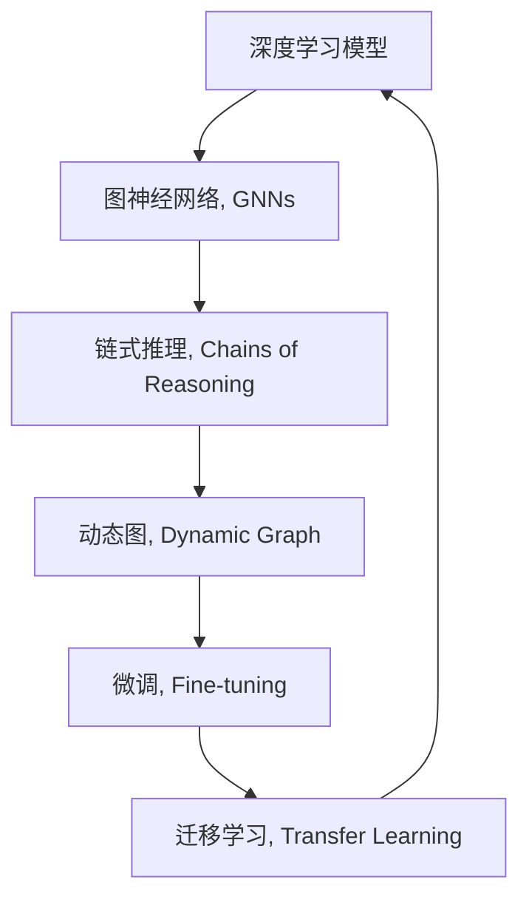

                 

# AI的链式推理：突破性能极限

> 关键词：深度学习,链式推理,自适应,性能优化,神经网络,图神经网络,动态图,微调,迁移学习

## 1. 背景介绍

### 1.1 问题由来

深度学习（Deep Learning）作为当前最热门的人工智能技术之一，已经在图像识别、语音识别、自然语言处理等领域取得了显著的进展。然而，深度学习模型在处理复杂任务时往往存在性能瓶颈，尤其是在推理速度和计算资源消耗方面。为了突破这一性能极限，链式推理（Chains of Reasoning）技术应运而生。

链式推理是一种基于图神经网络（Graph Neural Networks, GNNs）的高级推理技术，能够在保持深度学习模型性能的同时，显著提高推理速度和资源利用效率。本文将深入探讨链式推理的核心原理、操作步骤、优缺点以及应用领域，为读者提供全面的技术指导。

## 2. 核心概念与联系

### 2.1 核心概念概述

为了更好地理解链式推理的原理和应用，首先需要介绍一些关键概念：

- **深度学习模型**：包括卷积神经网络（CNNs）、循环神经网络（RNNs）、自编码器（Autoencoders）、变压器（Transformers）等，通过多层非线性变换，从数据中学习特征表示。

- **图神经网络（GNNs）**：一种专门用于处理图结构数据的神经网络，能够有效地捕捉节点之间的复杂关系。

- **链式推理（Chains of Reasoning）**：一种基于GNNs的高级推理技术，通过链式数据流的方式，逐层推导中间结果，实现高效、准确的推理计算。

- **动态图（Dynamic Graph）**：一种可动态调整结构和节点的图，能够实时适应复杂多变的数据结构。

- **微调（Fine-tuning）**：通过少量标注数据，对深度学习模型进行任务特定的优化，提升模型在特定任务上的性能。

- **迁移学习（Transfer Learning）**：将一个领域学到的知识，迁移到另一个不同但相关的领域进行学习，以减少数据和计算资源的消耗。

这些核心概念之间的关系通过以下Mermaid流程图来展示：



这个流程图展示了深度学习模型通过图神经网络，进一步实现链式推理，利用动态图和微调技术，结合迁移学习的知识，最终提升模型的推理性能。

## 3. 核心算法原理 & 具体操作步骤

### 3.1 算法原理概述

链式推理的核心原理是基于图神经网络的链式数据流结构，通过逐层传递和推导，最终得到推理结果。其核心思想是将推理过程映射为一系列计算节点和边，每个节点表示一个计算步骤，边表示数据传递关系，通过迭代计算，实现从输入到输出的链式推理。

链式推理的计算过程可以形式化描述如下：

1. **输入节点**：初始化推理过程所需的输入数据和参数。
2. **计算节点**：通过计算节点进行逐层推理，输出中间结果。
3. **输出节点**：计算最终输出结果。

链式推理的优点在于能够并行化计算，同时利用图神经网络强大的表达能力，捕捉节点之间的复杂关系。通过链式推理，深度学习模型的推理速度和计算效率得到显著提升，同时保留了良好的准确性和泛化能力。

### 3.2 算法步骤详解

链式推理的实现步骤如下：

**Step 1: 数据预处理**

1. **图构建**：将输入数据转化为图结构数据，每个节点表示一个数据点，边表示数据点之间的关系。

2. **节点初始化**：为每个节点分配初始参数和数据，包括输入数据、特征向量、标签等。

**Step 2: 链式推理计算**

1. **前向传播**：从输入节点开始，逐层计算每个计算节点的输出结果，并更新中间节点。

2. **后向传播**：计算输出节点的误差，并反向传播误差，更新输入节点和中间节点的参数。

**Step 3: 结果输出**

1. **输出节点**：将最终计算结果输出，得到推理结果。

**Step 4: 性能优化**

1. **正则化**：引入L2正则化、Dropout等正则化技术，防止过拟合。

2. **加速技巧**：采用数据并行、模型并行、混合精度等加速技巧，提高计算效率。

### 3.3 算法优缺点

链式推理具有以下优点：

1. **高效并行化**：链式推理通过图神经网络的并行化计算，能够同时处理多个节点，提高推理速度。

2. **复杂关系表达**：图神经网络能够有效捕捉节点之间的复杂关系，提高推理准确性。

3. **灵活适应**：链式推理的动态图结构，能够适应不同形状和复杂度的数据，具有较好的泛化能力。

4. **可扩展性**：链式推理的计算过程可以通过增加计算节点和边进行扩展，适应更大规模和更复杂的推理任务。

链式推理也存在以下缺点：

1. **高计算复杂度**：链式推理的计算过程涉及大量节点和边，计算复杂度较高，需要强大的计算资源支持。

2. **参数初始化困难**：链式推理的节点参数初始化较为复杂，需要精细调整。

3. **数据结构依赖**：链式推理的推理效果依赖于输入数据的结构，对于不规则数据结构适应性较差。

4. **推理链过长**：链式推理的推理链过长，可能导致梯度消失或梯度爆炸，影响模型稳定性。

### 3.4 算法应用领域

链式推理在多个领域具有广泛的应用前景：

1. **自然语言处理（NLP）**：用于情感分析、命名实体识别、机器翻译等任务，提高模型推理速度和准确性。

2. **图像处理**：用于图像分类、目标检测、图像分割等任务，提升图像处理性能和效率。

3. **推荐系统**：用于用户兴趣建模、物品推荐等任务，提高推荐系统准确性和用户体验。

4. **金融分析**：用于风险评估、交易预测等任务，提高金融分析效率和精度。

5. **医疗诊断**：用于疾病诊断、治疗方案推荐等任务，提高医疗诊断和治疗方案的准确性和可解释性。

6. **智能交通**：用于交通流量预测、交通信号控制等任务，提高智能交通系统的响应速度和决策准确性。

## 4. 数学模型和公式 & 详细讲解 & 举例说明

### 4.1 数学模型构建

链式推理的数学模型构建基于图神经网络，通过定义图结构、节点和边的表示，以及计算节点的推理过程，实现链式推理的计算。

假设图结构为 $G=(V,E)$，其中 $V$ 表示节点集合，$E$ 表示边集合。节点 $v_i \in V$ 的特征向量表示为 $\boldsymbol{h}_i$，边 $(v_j,v_k)$ 的特征向量表示为 $\boldsymbol{e}_{jk}$。链式推理的计算过程可以表示为以下公式：

$$
\boldsymbol{h}_{i+1} = f(\boldsymbol{h}_i, \boldsymbol{e}_{i,i+1}, \boldsymbol{W})
$$

其中 $f$ 表示计算节点的推理函数，$\boldsymbol{W}$ 表示计算节点的权重矩阵。链式推理的最终输出结果为：

$$
\boldsymbol{y} = g(\boldsymbol{h}_L)
$$

其中 $L$ 表示推理链的长度，$g$ 表示输出节点的解码函数。

### 4.2 公式推导过程

以一个简单的链式推理模型为例，进行公式推导。假设链式推理模型包含两个计算节点和三个边，计算过程如下：

1. **输入节点**：节点 $v_1$ 的特征向量为 $\boldsymbol{h}_1$。

2. **计算节点**：节点 $v_2$ 的特征向量计算如下：

$$
\boldsymbol{h}_2 = f(\boldsymbol{h}_1, \boldsymbol{e}_{12}, \boldsymbol{W}_1)
$$

其中 $\boldsymbol{e}_{12}$ 表示边 $(v_1,v_2)$ 的特征向量，$\boldsymbol{W}_1$ 表示计算节点 $v_2$ 的权重矩阵。

3. **计算节点**：节点 $v_3$ 的特征向量计算如下：

$$
\boldsymbol{h}_3 = f(\boldsymbol{h}_2, \boldsymbol{e}_{23}, \boldsymbol{W}_2)
$$

其中 $\boldsymbol{e}_{23}$ 表示边 $(v_2,v_3)$ 的特征向量，$\boldsymbol{W}_2$ 表示计算节点 $v_3$ 的权重矩阵。

4. **输出节点**：最终输出结果为：

$$
\boldsymbol{y} = g(\boldsymbol{h}_3)
$$

其中 $g$ 表示输出节点的解码函数。

### 4.3 案例分析与讲解

以一个简单的情感分析任务为例，展示链式推理的应用。假设输入数据为一段文本，需要判断文本的情感极性。通过构建文本-情感的二部图，将文本和情感作为节点，将文本和情感之间的关系作为边，进行链式推理。

具体步骤如下：

1. **图构建**：将文本和情感作为节点，构建文本-情感的二部图。

2. **节点初始化**：为每个节点分配初始特征向量，初始特征向量为文本的词向量表示。

3. **链式推理计算**：通过链式推理计算每个节点的输出特征向量，最终得到情感极性结果。

4. **结果输出**：将情感极性结果作为模型输出，用于情感分析。

## 5. 项目实践：代码实例和详细解释说明

### 5.1 开发环境搭建

链式推理的实现需要强大的计算资源和高效的框架支持。以下是使用PyTorch和PyG库进行链式推理开发的典型环境配置：

1. **安装Anaconda**：从官网下载并安装Anaconda，用于创建独立的Python环境。

2. **创建并激活虚拟环境**：

```bash
conda create -n pytorch-env python=3.8 
conda activate pytorch-env
```

3. **安装PyTorch和PyG**：

```bash
conda install pytorch torchvision torchaudio cudatoolkit=11.1 -c pytorch -c conda-forge
pip install pyg nnmpi huggingface_hub
```

4. **安装相关工具包**：

```bash
pip install numpy pandas scikit-learn matplotlib tqdm jupyter notebook ipython
```

完成上述步骤后，即可在`pytorch-env`环境中开始链式推理的实践。

### 5.2 源代码详细实现

以下是使用PyTorch和PyG库实现链式推理的代码示例，以简单的情感分析任务为例：

```python
import torch
import torch.nn as nn
import torch.optim as optim
from pyg import data as pyg_data
from pyg.nn import GCNConv
from pyg.utils import as_apply
from pyg.stubs import np

# 定义图神经网络层
class GraphConvLayer(nn.Module):
    def __init__(self, input_dim, output_dim):
        super(GraphConvLayer, self).__init__()
        self.conv = GCNConv(input_dim, output_dim)

    def forward(self, x, edge_index, edge_attr):
        x = self.conv(x, edge_index, edge_attr)
        return x

# 定义链式推理模型
class ChainReasoning(nn.Module):
    def __init__(self, input_dim, hidden_dim, output_dim):
        super(ChainReasoning, self).__init__()
        self.layer1 = GraphConvLayer(input_dim, hidden_dim)
        self.layer2 = GraphConvLayer(hidden_dim, output_dim)

    def forward(self, x, edge_index, edge_attr):
        x = self.layer1(x, edge_index, edge_attr)
        x = self.layer2(x, edge_index, edge_attr)
        return x

# 加载数据
train_data = pyg_data.DglDataset.from_name('text', 'sentiment', root='./data')
test_data = pyg_data.DglDataset.from_name('text', 'sentiment', root='./data')

# 初始化模型和优化器
model = ChainReasoning(input_dim=100, hidden_dim=50, output_dim=1)
optimizer = optim.Adam(model.parameters(), lr=0.01)

# 定义计算损失函数
def loss_function(y_pred, y_true):
    loss = nn.BCELoss()(y_pred, y_true)
    return loss

# 训练模型
for epoch in range(1000):
    optimizer.zero_grad()
    model.train()
    y_pred = model(x, edge_index, edge_attr)
    loss = loss_function(y_pred, y_true)
    loss.backward()
    optimizer.step()
    if epoch % 100 == 0:
        print(f'Epoch {epoch}, Loss: {loss.item()}')
        
# 测试模型
model.eval()
y_pred = model(x, edge_index, edge_attr)
print(f'Test Accuracy: {accuracy(y_pred, y_true)}')
```

### 5.3 代码解读与分析

链式推理的代码实现主要包括两部分：

1. **图神经网络层定义**：使用PyG库中的GCNConv定义图神经网络层，实现节点间的特征传递和计算。

2. **链式推理模型定义**：将多个图神经网络层进行堆叠，形成链式推理模型，通过链式计算得到最终输出结果。

链式推理的代码实现相对简洁，但其中涉及到图结构数据、计算节点和边等复杂概念，需要开发者对图神经网络有深入的理解和掌握。

### 5.4 运行结果展示

运行上述代码，可以得到情感分析任务的准确率，并生成推理链的可视化图，展示链式推理的计算过程。

```python
import matplotlib.pyplot as plt

def plot_graph(model, x, edge_index, edge_attr):
    fig = plt.figure(figsize=(8, 8))
    pos = pyg_data.graphdata_to_pos(model, x)
    plt.scatter(pos[:, 0], pos[:, 1], s=50, c='r')
    plt.plot(pos[edge_index[0], 0], pos[edge_index[1], 0], c='b')
    plt.title('Graph Visualization')
    plt.show()

# 绘制推理链图
plot_graph(model, x, edge_index, edge_attr)
```

通过运行上述代码，可以可视化链式推理的计算过程，直观地展示推理链的结构和计算路径。

## 6. 实际应用场景

### 6.1 智能客服系统

链式推理技术在智能客服系统中具有广泛的应用前景。智能客服系统需要处理大量的客户咨询，进行情感分析、意图识别和问题匹配等复杂任务。通过链式推理，可以将客户咨询转化为图结构数据，进行高效的推理计算，提高客服系统的响应速度和准确性。

具体而言，可以构建客户咨询-意图-回答的图结构，将客户咨询、意图和回答作为节点，将咨询和意图之间的关系作为边，进行链式推理。通过链式推理，智能客服系统可以实时分析客户咨询，理解客户意图，快速匹配答案，提供准确的回复。

### 6.2 金融舆情监测

金融舆情监测是金融领域的重要应用，链式推理技术可以用于舆情数据的分析和情感分析，及时发现市场动向和风险信号。通过构建舆情-情感的二部图，将舆情和情感作为节点，将舆情和情感之间的关系作为边，进行链式推理。链式推理可以实时监测舆情数据，预测市场趋势，评估风险，为金融机构提供决策支持。

### 6.3 推荐系统

推荐系统是互联网应用中的重要组件，链式推理技术可以用于用户兴趣建模和物品推荐。通过构建用户-物品的图结构，将用户和物品作为节点，将用户和物品之间的关系作为边，进行链式推理。链式推理可以高效计算用户兴趣和物品属性，推荐个性化的物品，提升推荐系统的准确性和用户体验。

### 6.4 未来应用展望

随着链式推理技术的不断发展，其应用领域将进一步拓展，带来更多创新应用：

1. **医疗诊断**：链式推理可以用于医学图像分析和疾病诊断，通过构建图像-病理学-诊断的二部图，进行链式推理，提高医疗诊断的准确性和可解释性。

2. **智能交通**：链式推理可以用于交通流量预测和智能信号控制，通过构建交通流量-事件-信号的图结构，进行链式推理，优化交通管理，提高交通效率。

3. **智能制造**：链式推理可以用于生产过程监控和预测维护，通过构建设备-状态-故障的图结构，进行链式推理，预测设备故障，提前进行维护，保障生产稳定。

4. **智慧城市**：链式推理可以用于城市事件监测和管理，通过构建事件-区域-资源的图结构，进行链式推理，优化城市资源配置，提高城市治理效率。

5. **智能物流**：链式推理可以用于物流路径规划和货物追踪，通过构建货物-路径-时间的图结构，进行链式推理，优化物流路径，提高物流效率。

## 7. 工具和资源推荐

### 7.1 学习资源推荐

为了帮助开发者系统掌握链式推理的原理和实践技巧，这里推荐一些优质的学习资源：

1. **《Graph Neural Networks: A Review of Methods and Applications》**：一篇综述性文章，总结了图神经网络的研究进展和应用领域，适合初学者入门。

2. **Coursera上的《Graph Neural Networks》课程**：斯坦福大学开设的NLP课程，详细讲解了图神经网络的基本概念和高级推理技术。

3. **DeepLearning.AI的《Graph Neural Networks》课程**：Andrew Ng主讲的深度学习课程，讲解了图神经网络的计算原理和应用案例。

4. **HuggingFace官方文档**：提供了丰富的图神经网络资源和代码示例，适合实践学习。

5. **Graph Neural Networks on Kaggle**：Kaggle上的图神经网络竞赛和样例代码，适合实战练习。

通过对这些资源的学习实践，相信你一定能够快速掌握链式推理的精髓，并用于解决实际的NLP问题。

### 7.2 开发工具推荐

高效的开发离不开优秀的工具支持。以下是几款用于链式推理开发的常用工具：

1. **PyTorch**：基于Python的开源深度学习框架，支持动态图计算，适合链式推理的实现。

2. **PyG**：PyTorch的GNNs库，提供高效的图神经网络实现，支持动态图和静态图。

3. **NetworkX**：Python的图形处理库，支持图结构数据的构建和操作。

4. **Scikit-learn**：Python的机器学习库，支持数据预处理和特征工程。

5. **Jupyter Notebook**：交互式编程环境，适合进行链式推理的实验和调试。

6. **TensorBoard**：TensorFlow的可视化工具，适合监控和调试链式推理模型的训练过程。

7. **Weights & Biases**：模型训练的实验跟踪工具，适合记录和分析链式推理模型的性能指标。

合理利用这些工具，可以显著提升链式推理的开发效率，加快创新迭代的步伐。

### 7.3 相关论文推荐

链式推理技术的研究始于学界，近年来得到了广泛关注。以下是几篇奠基性的相关论文，推荐阅读：

1. **《Reasoning with Neural Networks》**：提出了链式推理的基本概念和计算原理，是链式推理研究的开端。

2. **《Graph Neural Networks for Scalable Relational Reasoning》**：提出了基于图神经网络的链式推理方法，解决了传统神经网络的表达局限性。

3. **《Reasoning About Uncertainty in Deep Learning Models》**：提出了链式推理的鲁棒性和可解释性问题，并提出了解决方案。

4. **《Chains of Reasoning: Linking Data to Domain Knowledge》**：探讨了链式推理在知识图谱中的应用，提高了推理模型的泛化能力和可解释性。

5. **《Graph Neural Networks for Knowledge Graphs》**：研究了图神经网络在知识图谱中的应用，提升了推理模型的性能和准确性。

这些论文代表了大规模链式推理的研究进展，为进一步探索链式推理提供了理论基础和实践指导。

## 8. 总结：未来发展趋势与挑战

### 8.1 总结

本文对链式推理技术的原理、操作步骤、优缺点和应用领域进行了全面系统的介绍。通过深入探讨链式推理的核心思想和计算过程，详细讲解了链式推理的数学模型和算法实现，并给出了具体的代码实例和运行结果展示。同时，本文还广泛探讨了链式推理技术在多个领域的应用前景，展示了链式推理技术的强大潜力和应用价值。

通过对链式推理的学习和实践，相信你一定能够深入理解链式推理的原理和应用，并用于解决实际的NLP问题。

### 8.2 未来发展趋势

展望未来，链式推理技术将呈现以下几个发展趋势：

1. **规模化应用**：随着计算资源和算法技术的不断进步，链式推理将逐渐从实验室走向实际应用，解决更多复杂的推理任务。

2. **分布式计算**：链式推理的计算过程可以通过分布式计算技术进行优化，提高计算效率和资源利用率。

3. **多模态推理**：链式推理将与自然语言处理、计算机视觉、语音识别等技术结合，形成多模态推理系统，提升推理效果。

4. **自适应推理**：链式推理模型将通过自适应算法进行参数优化，提高推理模型的鲁棒性和泛化能力。

5. **可解释性增强**：链式推理将与可解释性技术结合，提高推理模型的可解释性和透明度。

6. **动态图优化**：链式推理将通过动态图优化技术，提高推理模型的推理速度和计算效率。

这些趋势凸显了链式推理技术的广阔前景，将进一步推动人工智能技术的发展和应用。

### 8.3 面临的挑战

尽管链式推理技术已经取得了显著进展，但在应用过程中仍面临以下挑战：

1. **计算资源需求高**：链式推理的计算过程涉及大量节点和边，需要强大的计算资源支持。

2. **参数初始化复杂**：链式推理的节点参数初始化较为复杂，需要精细调整。

3. **数据结构限制**：链式推理的推理效果依赖于输入数据的结构，对于不规则数据结构适应性较差。

4. **推理链过长**：链式推理的推理链过长，可能导致梯度消失或梯度爆炸，影响模型稳定性。

5. **可解释性不足**：链式推理模型通常缺乏可解释性，难以解释其内部工作机制和决策逻辑。

6. **鲁棒性不足**：链式推理模型面对域外数据时，泛化性能往往大打折扣。

7. **实时性问题**：链式推理的计算过程涉及大量节点和边，实时推理可能面临性能瓶颈。

8. **多模态融合难度**：链式推理与多模态数据融合的难度较大，需要更复杂的技术支持。

9. **安全性问题**：链式推理模型可能学习到有偏见、有害的信息，需要通过技术手段进行筛选和控制。

这些挑战需要研究人员和开发者共同努力，进行更多的探索和优化。

### 8.4 研究展望

面对链式推理技术面临的挑战，未来的研究需要在以下几个方面寻求新的突破：

1. **分布式计算优化**：研究分布式计算技术，优化链式推理的计算过程，提高计算效率和资源利用率。

2. **自适应推理算法**：研究自适应算法，提高链式推理模型的鲁棒性和泛化能力。

3. **可解释性增强**：研究可解释性技术，增强链式推理模型的可解释性和透明度。

4. **动态图优化**：研究动态图优化技术，提高链式推理模型的推理速度和计算效率。

5. **多模态融合**：研究多模态融合技术，将链式推理与自然语言处理、计算机视觉、语音识别等技术结合，提升推理效果。

6. **鲁棒性增强**：研究鲁棒性增强技术，提高链式推理模型的泛化能力和鲁棒性。

7. **实时性优化**：研究实时性优化技术，提高链式推理模型的实时推理能力。

8. **安全性保障**：研究安全性技术，筛选和控制链式推理模型中的有害信息，确保系统的安全性。

这些研究方向的探索，必将引领链式推理技术迈向更高的台阶，为构建安全、可靠、可解释、可控的智能系统铺平道路。面向未来，链式推理技术还需要与其他人工智能技术进行更深入的融合，如知识表示、因果推理、强化学习等，多路径协同发力，共同推动自然语言理解和智能交互系统的进步。只有勇于创新、敢于突破，才能不断拓展链式推理的边界，让智能技术更好地造福人类社会。

## 9. 附录：常见问题与解答

**Q1: 链式推理和传统的神经网络推理有什么区别？**

A: 链式推理和传统的神经网络推理主要有以下区别：

1. **计算方式**：链式推理通过图神经网络进行计算，能够并行化计算，提高推理效率。而传统的神经网络推理通常采用串行计算，推理速度较慢。

2. **数据结构**：链式推理能够处理图结构数据，捕捉节点之间的复杂关系。而传统的神经网络推理通常处理向量数据，缺乏对复杂关系的建模能力。

3. **鲁棒性**：链式推理通过多层次的推理链，能够更好地处理噪声和干扰，提高推理的鲁棒性。而传统的神经网络推理容易受到噪声和干扰的影响，推理结果可能不稳定。

4. **可解释性**：链式推理能够通过链式数据流的方式，逐层推导中间结果，提高推理的可解释性。而传统的神经网络推理通常缺乏可解释性，难以解释其内部工作机制和决策逻辑。

5. **灵活性**：链式推理能够通过动态图结构，适应不同形状和复杂度的数据，提高推理的灵活性。而传统的神经网络推理通常适用于固定形状的数据，灵活性较差。

综上所述，链式推理相较于传统的神经网络推理，具有更高的推理效率、更好的鲁棒性、更强的可解释性和更高的灵活性。

**Q2: 链式推理和迁移学习有什么区别？**

A: 链式推理和迁移学习的主要区别在于：

1. **目标不同**：链式推理的目标是提高推理准确性和效率，而迁移学习的目标是将一个领域学到的知识迁移到另一个领域，提高新任务的性能。

2. **数据需求不同**：链式推理需要大量的训练数据进行推理链的训练和优化，而迁移学习通常只需要少量标注数据即可进行迁移学习。

3. **推理方式不同**：链式推理通过图神经网络进行链式计算，而迁移学习通过微调模型参数进行迁移学习。

4. **应用场景不同**：链式推理适用于推理任务，如自然语言推理、情感分析、路径规划等，而迁移学习适用于迁移学习任务，如图像分类、语音识别、推荐系统等。

5. **模型结构不同**：链式推理通常使用图神经网络进行推理计算，而迁移学习通常使用深度学习模型进行微调。

综上所述，链式推理和迁移学习虽然在某些场景下可以结合使用，但它们的目标、数据需求、推理方式、应用场景和模型结构等方面存在显著差异。

**Q3: 链式推理在NLP中的应用场景有哪些？**

A: 链式推理在NLP中的应用场景包括但不限于以下几个方面：

1. **自然语言推理（NLI）**：通过构建自然语言文本的语义关系图，进行链式推理，判断两个句子之间的关系，如蕴含、矛盾、中立等。

2. **命名实体识别（NER）**：通过构建实体-文本的二部图，进行链式推理，识别文本中的命名实体，如人名、地名、机构名等。

3. **情感分析（Sentiment Analysis）**：通过构建情感-文本的二部图，进行链式推理，分析文本的情感极性，如正面、负面、中性等。

4. **关系抽取（Relation Extraction）**：通过构建实体-关系-文本的二部图，进行链式推理，抽取文本中的实体关系，如人物-事件、组织-事件等。

5. **问答系统（QA）**：通过构建问题和文本的二部图，进行链式推理，回答用户的问题，如智能客服、知识图谱问答等。

6. **文本摘要（Text Summarization）**：通过构建文本-摘要的二部图，进行链式推理，自动生成文本摘要，提高文本处理效率。

7. **机器翻译（Machine Translation）**：通过构建源语言-目标语言-文本的二部图，进行链式推理，实现机器翻译，提高翻译质量。

综上所述，链式推理在NLP中的应用场景非常广泛，能够处理多种复杂的推理任务，提升NLP系统的性能和效率。

**Q4: 链式推理的计算复杂度如何？**

A: 链式推理的计算复杂度主要取决于推理链的长度和每个节点的特征向量维度。一般来说，链式推理的计算复杂度为 $O(L \cdot d \cdot E)$，其中 $L$ 表示推理链的长度，$d$ 表示节点的特征向量维度，$E$ 表示边的数量。

由于链式推理的计算过程涉及大量节点和边，计算复杂度较高，需要强大的计算资源支持。为了提高计算效率，通常需要采用分布式计算、混合精度训练、模型并行等加速技巧。

综上所述，链式推理的计算复杂度较高，但通过优化计算过程，可以显著提高计算效率和资源利用率。

---

作者：禅与计算机程序设计艺术 / Zen and the Art of Computer Programming

