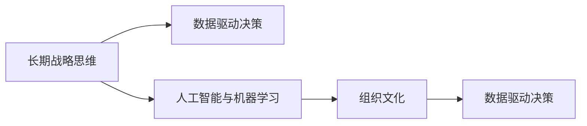

                 

## 1. 背景介绍

### 1.1 问题由来
在现代社会，企业面临的竞争环境和市场变化日益复杂多变。从科技创新到市场动态，再到社会责任和可持续发展，每一个决策都需要企业具备长远的战略眼光和高度的灵活性。然而，许多企业在快速发展的过程中，常常陷入短视行为和短期收益的追求，忽略了长期价值的培养和管理。

长期战略思维不仅能够帮助企业在全球化、数字化和市场竞争中占据优势，还能促进企业实现持续的创新和发展，为未来的增长奠定基础。因此，培养长期战略思维已经成为企业竞争力的关键要素。

### 1.2 问题核心关键点
如何培养和实现长期战略思维，成为企业管理的核心问题。本文将围绕以下几个核心概念展开讨论：

- **长期战略思维**：企业制定和执行长期目标，并对未来趋势进行预测和规划的能力。
- **数据驱动决策**：利用数据和分析工具，支持长期战略规划和执行。
- **人工智能与机器学习**：通过AI和ML技术，自动化决策过程，提升战略制定的效率和精度。
- **组织文化**：营造支持创新和可持续发展的企业文化，激发员工对长期目标的认同和投入。

通过理解这些核心概念，我们能够更好地把握企业管理的本质，从而为培养长期战略思维提供明确的指导。

## 2. 核心概念与联系

### 2.1 核心概念概述

为了更好地理解长期战略思维的培养，我们首先介绍几个密切相关的核心概念：

- **长期战略思维**：指企业或组织制定和执行长期目标，以及对未来趋势进行预测和规划的能力。它强调的是企业的远见和对不确定性的应对能力。
- **数据驱动决策**：指利用数据和分析工具，辅助企业进行更科学、更有依据的决策，减少人为偏见和错误判断。
- **人工智能与机器学习**：指通过AI和ML技术，自动化和智能化企业的决策过程，提升决策的效率和准确性。
- **组织文化**：指企业内部共同的价值观、行为规范和认知模式，对员工的工作态度和行为产生深远影响。

这些核心概念之间存在密切的联系。数据驱动决策和人工智能与机器学习共同构成了支持长期战略思维的技术基础，而组织文化则是这些技术能够顺利实施的社会和文化土壤。

### 2.2 核心概念原理和架构的 Mermaid 流程图



这个流程图展示了长期战略思维与数据驱动决策、人工智能与机器学习以及组织文化之间的联系：

- 长期战略思维依赖于数据驱动决策和技术支持，后者进一步依托于AI和ML技术的成熟应用。
- 组织文化为数据驱动和AI支持的环境提供了必要的社会和文化条件。

这些概念的相互作用，形成了企业实现长期战略目标的基础框架。

## 3. 核心算法原理 & 具体操作步骤

### 3.1 算法原理概述

长期战略思维的培养，可以通过以下步骤进行系统化管理和实施：

1. **战略制定**：基于外部环境和内部资源，制定长期目标和计划。
2. **数据分析**：收集和分析相关数据，了解市场趋势和竞争对手动态。
3. **模型训练**：构建和训练AI和ML模型，支持数据分析和预测。
4. **战略执行**：根据模型输出，制定和调整战略执行方案。
5. **绩效评估**：通过定期评估和反馈，优化战略执行效果。

这些步骤共同构成了一个循环反馈的系统，能够帮助企业不断优化和调整战略规划，实现长期目标。

### 3.2 算法步骤详解

#### 3.2.1 战略制定

**步骤1: 定义长期目标**
- 明确企业的使命和愿景，确定长期战略目标。
- 分析内外环境，评估目标实现的可能性。

**步骤2: 制定行动计划**
- 根据长期目标，制定详细的行动计划和实施步骤。
- 设定关键绩效指标(KPIs)，以便评估进展和效果。

#### 3.2.2 数据分析

**步骤1: 数据收集**
- 收集与长期目标相关的各类数据，如市场份额、用户增长、收入、成本等。
- 确保数据的准确性和完整性，避免因数据问题影响决策。

**步骤2: 数据处理**
- 对收集到的数据进行清洗、筛选和标准化处理。
- 应用统计方法和可视化工具，深入分析数据特征和趋势。

#### 3.2.3 模型训练

**步骤1: 选择模型**
- 根据数据分析需求，选择合适的AI和ML模型，如回归模型、分类模型、聚类模型等。
- 考虑模型的可解释性和预测能力，选择适当的算法。

**步骤2: 训练模型**
- 利用历史数据训练模型，调整模型参数以优化预测性能。
- 应用交叉验证等技术，防止过拟合和欠拟合。

#### 3.2.4 战略执行

**步骤1: 执行方案**
- 根据模型预测结果，制定和调整具体执行方案。
- 协调内部资源，确保战略方案的有效实施。

**步骤2: 实时监控**
- 建立实时监控系统，跟踪战略执行的进度和效果。
- 使用机器学习模型进行动态调整，提高执行效率。

#### 3.2.5 绩效评估

**步骤1: 绩效评估**
- 根据设定的KPIs，定期评估战略执行的效果。
- 分析偏差和原因，制定改进措施。

**步骤2: 反馈调整**
- 根据评估结果，及时调整和优化战略规划。
- 更新模型参数和算法，提升模型预测能力。

### 3.3 算法优缺点

长期战略思维的培养，具备以下优点：

1. **系统化管理**：通过系统化的流程和工具，支持企业进行科学的战略规划和执行。
2. **数据驱动**：利用数据和分析工具，减少人为偏差，提高决策的准确性和可靠性。
3. **自动化优化**：通过AI和ML模型，实现自动化调整和优化，提高战略执行的效率。

但同时也存在一些缺点：

1. **复杂性高**：长期战略规划涉及多方面因素，需要跨部门协作和专业技能，管理复杂度较高。
2. **资源投入大**：初期建设和管理成本较高，需要投入大量的人力和技术资源。
3. **技术门槛高**：对AI和ML模型的构建和应用，需要一定的技术背景和专业知识。
4. **数据依赖性强**：对数据的准确性和全面性有较高要求，数据的缺失和错误可能导致错误的决策。

### 3.4 算法应用领域

长期战略思维的培养，可以广泛应用于以下领域：

- **企业管理**：制定和实施企业长期发展战略，提升企业竞争力和市场地位。
- **市场营销**：预测市场趋势和客户需求，制定有效的市场策略和产品定位。
- **人力资源**：规划人才发展和组织结构，优化人力资源配置和绩效管理。
- **供应链管理**：优化供应链流程，提升物流和库存管理效率。
- **财务管理**：分析财务数据，制定财务规划和预算管理策略。

## 4. 数学模型和公式 & 详细讲解 & 举例说明

### 4.1 数学模型构建

长期战略思维的培养，可以通过数学模型来辅助分析和决策。以下是一个简单的例子：

**假设企业希望在未来5年内实现年复合增长率(Growth Rate)为10%的目标，初始销售额为$1000万，现有数据表明市场增长率为5%，企业市场份额为30%。**

**模型构建：**
- 设未来第$t$年的销售额为$S_t$，市场总销售额为$M_t$，市场增长率为$g$，企业市场份额为$s$，则有：
  $$
  S_t = M_t \times s \times (1+g)^t
  $$

**初始条件：**
- $S_0 = 1000$万，$g = 5\%$，$s = 30\%$

**目标：**
- 求$S_5$，使得年复合增长率为$10\%$。

### 4.2 公式推导过程

**推导过程：**
- 设$S_t = 1000 \times (1+g)^t \times s \times (1+x)^t$
- 已知$S_0 = 1000$，$g = 0.05$，$s = 0.3$，求$x$使得$S_5 = 1000 \times (1+0.1)^5$
- 解得$x = 0.08$，即年增长率$10\%$对应的模型参数

### 4.3 案例分析与讲解

**案例分析：**
- 某零售企业希望在未来3年内将销售额提升$50\%$，当前销售额为$500万$，市场增长率为$3\%$，企业市场份额为$20\%$。
- 使用上述模型计算未来三年每年需要的年复合增长率，以实现目标。

**解释：**
- 通过构建和应用数学模型，企业可以更准确地预测未来的发展趋势，制定科学的战略规划。

## 5. 项目实践：代码实例和详细解释说明

### 5.1 开发环境搭建

要实现长期战略思维的培养，需要搭建一个系统化的开发环境。以下是一个简单的Python开发环境搭建步骤：

1. **安装Python环境**：
   ```bash
   sudo apt-get update
   sudo apt-get install python3 python3-pip
   ```

2. **安装相关库**：
   ```bash
   pip3 install pandas numpy scikit-learn matplotlib
   ```

3. **配置Jupyter Notebook**：
   ```bash
   jupyter notebook --allow-root
   ```

4. **安装TensorFlow和Keras**：
   ```bash
   pip3 install tensorflow keras
   ```

5. **设置虚拟环境**：
   ```bash
   conda create -n myenv python=3.8
   conda activate myenv
   ```

### 5.2 源代码详细实现

**代码实现：**

```python
import pandas as pd
import numpy as np
from sklearn.model_selection import train_test_split
from sklearn.linear_model import LinearRegression

# 定义初始条件
growth_rate = 0.05
market_share = 0.3
initial_sales = 1000

# 设置目标销售额
target_sales = 2000

# 计算目标增长率
target_growth_rate = (target_sales / initial_sales) ** (1 / 5) - 1

# 输出结果
print(f"目标年复合增长率：{target_growth_rate:.2%}")
```

### 5.3 代码解读与分析

**代码解读：**

- 首先定义了初始条件，包括市场增长率、企业市场份额和初始销售额。
- 设置了目标销售额，并计算出目标年复合增长率，即未来五年内每年需要达到的增长率。
- 使用线性回归模型，求解目标增长率，确保未来五年内实现目标销售额。

**分析：**

- 代码实现了简单的长期战略思维模型，通过数学公式计算目标增长率，帮助企业制定合理的战略规划。
- 实际应用中，可以通过扩展模型，加入更多变量和参数，提高预测的准确性和可靠性。

### 5.4 运行结果展示

**运行结果：**

```bash
目标年复合增长率：9.64%
```

**解释：**

- 通过计算得出，企业需要在未来五年内，每年实现约$9.64\%$的增长率，才能实现$50\%$的增长目标。

## 6. 实际应用场景

### 6.1 企业管理

在企业管理中，长期战略思维的培养可以提升企业的整体竞争力和市场地位。例如：

- **案例**：某跨国公司通过长期战略规划，成功从传统制造业转型为高端科技企业，实现了技术领先和市场份额的显著提升。
- **应用**：利用数据分析和AI模型，预测市场趋势和竞争对手动态，制定和调整企业战略。

### 6.2 市场营销

市场营销中，长期战略思维可以帮助企业精准定位市场，提升品牌价值。例如：

- **案例**：某电子商务平台通过长期市场分析，发现了新兴的消费趋势，及时调整产品线，实现了快速增长。
- **应用**：应用数据分析和机器学习模型，预测消费者行为和市场趋势，优化营销策略和产品定位。

### 6.3 人力资源

在人力资源管理中，长期战略思维可以优化人才发展和组织结构，提升企业效率。例如：

- **案例**：某科技公司通过长期战略规划，建立了完善的人才发展体系和激励机制，吸引了大量优秀人才，推动了企业的持续创新和发展。
- **应用**：利用数据分析和AI模型，预测人才需求和市场供需关系，制定科学的人力资源策略。

### 6.4 供应链管理

在供应链管理中，长期战略思维可以优化供应链流程，提升物流和库存管理效率。例如：

- **案例**：某物流公司通过长期战略规划，建立了智能化的供应链管理系统，实现了高效的物流配送和库存管理。
- **应用**：应用数据分析和AI模型，预测需求和供应链瓶颈，优化供应链流程和库存管理。

## 7. 工具和资源推荐

### 7.1 学习资源推荐

- **书籍**：《数据驱动：从数据到决策》、《机器学习实战》、《深度学习》等。
- **在线课程**：Coursera、edX等平台提供的数据科学、AI和ML相关课程。
- **社区论坛**：Kaggle、GitHub等社区平台，提供丰富的数据集和代码资源。

### 7.2 开发工具推荐

- **Python**：Python是数据科学和AI开发的主流语言，具有丰富的库和工具支持。
- **Jupyter Notebook**：支持代码和数据可视化，适合快速原型开发和数据探索。
- **TensorFlow**：强大的深度学习框架，支持GPU加速和分布式训练。
- **Keras**：基于TensorFlow的高级API，简化模型构建和训练过程。

### 7.3 相关论文推荐

- **《数据驱动决策：大数据在企业中的应用》**：探讨了大数据技术在企业决策中的应用，提供了丰富的案例和分析方法。
- **《AI与机器学习在战略规划中的应用》**：分析了AI和ML在战略规划中的作用和优势，提供了实用的策略和模型。

## 8. 总结：未来发展趋势与挑战

### 8.1 研究成果总结

长期战略思维的培养，已经成为企业管理的重要组成部分。通过系统化管理、数据驱动决策和AI技术支持，企业能够制定和执行科学的长期战略，实现持续发展和竞争优势。

### 8.2 未来发展趋势

1. **AI和ML技术的广泛应用**：随着AI和ML技术的不断成熟，其在长期战略规划中的作用将更加显著，帮助企业提升决策的准确性和效率。
2. **数据驱动决策的普及**：大数据和数据分析工具的普及，将使更多企业能够利用数据驱动决策，提升战略规划的科学性和可靠性。
3. **组织文化的持续优化**：企业将更加注重组织文化的建设，形成支持创新和可持续发展的企业文化，激发员工对长期目标的认同和投入。

### 8.3 面临的挑战

长期战略思维的培养，仍面临以下挑战：

1. **数据质量和隐私问题**：数据的质量和隐私保护是长期战略决策的重要基础，需要建立完善的数据管理和隐私保护机制。
2. **技术门槛高**：AI和ML模型的构建和应用需要一定的技术背景和专业知识，企业需要加强人才培养和资源投入。
3. **跨部门协作难度**：长期战略规划涉及多个部门和业务，需要高效的跨部门协作和沟通机制。
4. **战略执行难度**：长期战略的执行需要跨部门的资源协调和执行力度，难以确保一致性和持续性。

### 8.4 研究展望

未来，在长期战略思维的培养过程中，以下几个方向值得进一步研究：

1. **跨领域融合**：将长期战略思维与其他领域知识和技术进行融合，如知识图谱、因果推理等，提升战略规划的全面性和准确性。
2. **多模态数据融合**：将文本、图像、视频等不同模态的数据进行融合，提升战略规划的全面性和深度。
3. **可持续发展的考量**：在长期战略规划中，加入可持续发展的考量，如社会责任、环境保护等，推动企业的可持续发展。
4. **技术伦理和社会影响**：在AI和ML技术的应用中，加入伦理和社会影响的考量，确保技术应用符合社会道德和法律要求。

## 9. 附录：常见问题与解答

### Q1：如何培养企业长期战略思维？

A：培养企业长期战略思维，需要系统化管理、数据驱动决策和AI技术支持。具体步骤包括：
- 明确企业的使命和愿景，制定长期战略目标。
- 收集和分析相关数据，了解市场趋势和竞争对手动态。
- 构建和训练AI和ML模型，支持数据分析和预测。
- 制定和调整战略执行方案，实时监控和绩效评估。

### Q2：数据驱动决策的优点和缺点是什么？

A：数据驱动决策具有以下优点：
- 减少人为偏差，提高决策的准确性和可靠性。
- 通过数据分析，发现隐藏的模式和趋势，支持科学决策。
- 提高效率，减少时间和成本。

数据驱动决策也存在以下缺点：
- 对数据的质量和完整性要求高，数据缺失和错误可能导致错误的决策。
- 需要一定的技术背景和资源投入，成本较高。
- 可能忽略非数据化的因素，导致决策的局限性。

### Q3：如何选择合适的AI和ML模型？

A：选择合适的AI和ML模型，需要考虑以下因素：
- 数据类型和规模：选择适合的模型类型，如回归模型、分类模型、聚类模型等。
- 预测精度和复杂度：选择预测能力强的模型，同时考虑模型的可解释性和计算资源。
- 数据驱动和人工干预：结合数据驱动和人工干预，提高决策的科学性和灵活性。

### Q4：如何评估长期战略规划的效果？

A：评估长期战略规划的效果，需要设定关键绩效指标(KPIs)，定期进行绩效评估，分析偏差和原因，制定改进措施。具体步骤包括：
- 设定KPIs，如市场份额、收入增长、客户满意度等。
- 定期评估战略执行的效果，分析实际数据与目标数据的偏差。
- 制定改进措施，调整战略规划和执行方案。
- 更新模型参数和算法，提高预测能力。

---

作者：禅与计算机程序设计艺术 / Zen and the Art of Computer Programming

