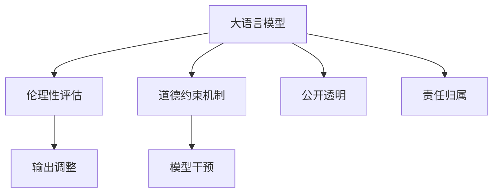

                 

## 1. 背景介绍

### 1.1 问题由来
人工智能(AI)技术的迅猛发展在为人类带来诸多便利的同时，也引发了一系列伦理道德问题。近年来，深度学习大模型(LLM)在自然语言处理(NLP)、计算机视觉(CV)、语音识别等领域取得了令人瞩目的成绩，但模型的决策过程缺乏透明度和可解释性，可能导致误导性、歧视性、有害性等伦理问题，对社会产生深远影响。例如，GPT-3在生成文本时，虽然具备了一定程度的常识推理能力，但其决策依据仍然难以预测，可能输出有悖伦理的言论，甚至诱导他人进行不道德的行为。

### 1.2 问题核心关键点
针对大模型在伦理性方面可能存在的问题，学术界和产业界在探索如何确保AI系统的行为符合人类价值观方面进行了深入研究。主要包括以下几个关键点：
1. **模型可解释性**：提升模型输出的可解释性，使得用户能够理解模型的决策过程，减少不确定性和偏见。
2. **公平性**：确保模型在处理不同背景、性别、种族等群体时，输出结果公平公正，避免歧视和偏见。
3. **透明性**：增加模型训练和部署的透明度，确保模型开发和使用的过程公开透明，可追溯。
4. **安全性**：保护用户数据和隐私，防止模型被滥用，确保系统的安全性和可靠性。
5. **责任归属**：明确模型的责任归属，确保在出现问题时，能够追溯责任并采取相应措施。

这些关键点共同构成了道德AI的基本框架，其核心目标是通过技术手段，确保AI系统的行为符合人类的伦理道德标准。

### 1.3 问题研究意义
确保大模型的伦理性不仅关乎技术本身，更是社会伦理和法律责任的重要体现。面对AI技术的广泛应用，构建道德AI系统具有以下重要意义：

1. **保护用户权益**：通过确保大模型输出的公平性和透明性，保护用户免受歧视和误导，维护社会公正。
2. **促进社会信任**：构建道德AI系统有助于增强公众对AI技术的信任感，推动AI技术的良性发展。
3. **防范技术滥用**：明确模型责任归属，预防和应对AI技术的滥用，保障社会秩序和公共利益。
4. **推动伦理技术发展**：通过伦理技术的探索，推动AI技术的健康发展，促进社会福祉。

## 2. 核心概念与联系

### 2.1 核心概念概述

为更好地理解道德AI系统的构建，本节将介绍几个密切相关的核心概念：

- **大语言模型(LLM)**：如GPT、BERT等，通过在海量文本数据上进行自监督或监督学习，学习语言表示和常识推理能力。
- **道德AI**：指能够确保输出结果符合人类伦理道德标准，具备公平性、透明性、安全性等特性的AI系统。
- **伦理性评估**：评估模型输出是否符合伦理道德标准，如避免歧视、保证公平、提高透明性等。
- **伦理约束机制**：为确保模型的伦理行为，构建的监控、检测、纠正机制。

这些核心概念之间的逻辑关系可以通过以下Mermaid流程图来展示：



这个流程图展示了大语言模型与伦理性评估、道德约束机制之间的逻辑关系：

1. 大语言模型通过预训练获得语言表示能力。
2. 伦理性评估衡量模型的输出是否符合伦理标准，如避免歧视、保证公平等。
3. 道德约束机制为确保伦理性输出，构建了监控、检测、纠正机制。
4. 输出调整和模型干预等策略，进一步优化模型输出的伦理性。
5. 公开透明和责任归属等措施，保障模型开发和使用的公正性和可追溯性。

这些核心概念共同构成了道德AI系统的理论基础，指导AI技术的伦理化发展。

## 3. 核心算法原理 & 具体操作步骤
### 3.1 算法原理概述

构建道德AI系统，关键在于通过算法和技术手段，确保模型的输出符合人类伦理道德标准。具体而言，可以分为以下几个步骤：

1. **数据采集与标注**：收集包含伦理问题的数据集，并对其进行标注。标注数据需要涵盖不同种族、性别、年龄、职业等多种背景。
2. **伦理性评估模型构建**：构建用于评估模型输出的伦理性评估模型，如公平性检测、偏见评估、情感分析等。
3. **道德约束机制设计**：设计道德约束机制，包括模型监控、异常检测、纠正策略等，确保模型输出符合伦理标准。
4. **输出调整与优化**：根据伦理性评估和道德约束机制的反馈，调整模型输出，优化其伦理性。
5. **责任归属与透明性增强**：构建模型使用和改进的透明性机制，明确模型责任归属，保障用户权益。

### 3.2 算法步骤详解

#### 3.2.1 数据采集与标注

**Step 1: 数据收集**
- 收集包含伦理问题的数据集，包括但不限于种族歧视、性别偏见、负面言论等。
- 数据来源可以是公开文本数据、社交媒体、用户反馈等，确保数据的多样性和代表性。

**Step 2: 数据预处理**
- 对数据进行清洗，去除噪音、不相关和重复信息。
- 对标注进行标准化，统一标注格式和标准。

**Step 3: 数据标注**
- 构建标注团队，涵盖不同背景、性别、年龄、职业等，确保标注的公平性和多样性。
- 标注团队需具备伦理意识和相关知识，对标注数据进行严格审核和标注。

#### 3.2.2 伦理性评估模型构建

**Step 1: 选择评估指标**
- 根据具体应用场景，选择合适的评估指标，如公平性指标、偏见度量、情感分析等。
- 指标选择需涵盖数据收集和标注中的各种伦理问题。

**Step 2: 构建评估模型**
- 使用机器学习或深度学习模型，构建用于伦理性评估的模型。
- 模型需涵盖预训练语言模型、线性分类器、注意力机制等多种组件。

**Step 3: 训练和优化**
- 使用标注数据集训练评估模型，确保模型具有较高的伦理性评估能力。
- 通过交叉验证、正则化等技术优化模型性能，提升评估准确性。

#### 3.2.3 道德约束机制设计

**Step 1: 监控策略**
- 设计模型监控策略，实时监测模型输出是否符合伦理标准。
- 可以使用规则引擎、异常检测等方法，实现对模型的持续监控。

**Step 2: 异常检测与纠正**
- 设计异常检测机制，识别输出结果中的伦理问题。
- 根据检测结果，自动调整模型参数或输出，纠正伦理偏差。

**Step 3: 反馈机制**
- 构建反馈机制，定期收集用户和专家对模型输出的反馈。
- 根据反馈，不断优化模型和约束机制，提升伦理性评估和纠正能力。

#### 3.2.4 输出调整与优化

**Step 1: 调整输出**
- 根据伦理性评估和道德约束机制的反馈，调整模型输出，优化其伦理性。
- 可以使用规则修正、模型重训练等方法，调整模型输出。

**Step 2: 模型优化**
- 引入参数高效微调技术，减少不必要的参数调整，提升模型效率和伦理性。
- 结合预训练和微调，优化模型性能，提升伦理性。

#### 3.2.5 责任归属与透明性增强

**Step 1: 透明性机制**
- 构建透明性机制，记录模型开发、训练和部署的每一个步骤。
- 使用日志记录、审计工具等方法，确保模型的开发和应用过程透明可追溯。

**Step 2: 责任归属**
- 明确模型开发和应用的责任归属，确保在出现问题时，能够追溯责任并采取相应措施。
- 建立责任追溯机制，记录每个步骤的责任人和时间戳，确保责任透明。

### 3.3 算法优缺点

构建道德AI系统的伦理性评估和约束机制，具有以下优点：

1. **增强伦理性**：通过伦理性评估和约束机制，确保模型的输出符合人类伦理道德标准，提升系统的可信度和安全性。
2. **提升透明度**：增加模型开发和应用的透明度，使用户和专家能够理解和监督模型的行为。
3. **减少偏见**：通过公平性检测和偏见评估，减少模型输出中的歧视和偏见，提升模型公平性。

同时，该方法也存在一定的局限性：

1. **数据标注成本高**：伦理性评估和约束机制需要大量标注数据，标注成本较高。
2. **模型复杂度高**：构建和维护伦理性评估和约束机制需要较高的技术复杂度，可能影响模型部署效率。
3. **模型泛化能力有限**：伦理性评估和约束机制的效果可能受限于数据多样性和标注质量。
4. **伦理标准主观性**：伦理标准的定义和应用可能存在主观性，需考虑不同文化和地区的伦理差异。

尽管存在这些局限性，但构建道德AI系统的伦理性评估和约束机制，已成为确保AI技术健康发展的重要手段。未来相关研究的重点在于如何进一步降低伦理性评估的标注成本，提高模型泛化能力，同时兼顾模型复杂度和伦理标准的适用性等因素。

### 3.4 算法应用领域

构建伦理性评估和约束机制的道德AI系统，已经在多个领域得到了应用，取得了显著成效：

1. **医疗健康**：用于疾病预测、药物推荐等，确保模型输出符合医疗伦理，保护患者隐私和权益。
2. **金融服务**：用于信用评分、贷款申请等，确保模型输出公平公正，避免金融歧视。
3. **法律领域**：用于案件分析和预测等，确保模型输出符合法律伦理，保护当事人和社会公正。
4. **公共服务**：用于舆情分析、犯罪预测等，确保模型输出符合公共伦理，保障社会秩序和公民权利。
5. **社会治理**：用于智能交通、智慧城市等，确保模型输出符合社会伦理，提升公共服务质量。

除了上述这些典型领域外，道德AI系统还被创新性地应用到更多场景中，如环境保护、教育公平、人机交互等，为AI技术在社会各个领域的广泛应用提供了伦理保障。

## 4. 数学模型和公式 & 详细讲解  
### 4.1 数学模型构建

本节将使用数学语言对伦理性评估和约束机制进行更加严格的刻画。

设伦理性评估模型为 $M_{\theta}$，其中 $\theta$ 为模型参数。假设伦理性评估数据集为 $D=\{(x_i,y_i)\}_{i=1}^N, x_i \in \mathcal{X}, y_i \in \{0,1\}$，其中 $y_i=1$ 表示样本 $x_i$ 的伦理性评估结果为“符合伦理”，否则为“不符合伦理”。

定义模型 $M_{\theta}$ 在输入 $x$ 上的伦理性评估结果为 $\hat{y}=M_{\theta}(x) \in [0,1]$，表示模型预测样本 $x$ 符合伦理的概率。则伦理性评估模型在数据集 $D$ 上的经验风险为：

$$
\mathcal{L}(\theta) = \frac{1}{N} \sum_{i=1}^N \ell(M_{\theta}(x_i),y_i)
$$

其中 $\ell$ 为二分类交叉熵损失函数，用于衡量模型预测结果与真实标签之间的差异。

### 4.2 公式推导过程

以下我们以公平性检测为例，推导模型预测结果与真实标签之间的交叉熵损失函数及其梯度的计算公式。

假设模型 $M_{\theta}$ 在输入 $x$ 上的预测结果为 $\hat{y}=M_{\theta}(x) \in [0,1]$，真实标签 $y \in \{0,1\}$。则二分类交叉熵损失函数定义为：

$$
\ell(M_{\theta}(x),y) = -[y\log \hat{y} + (1-y)\log (1-\hat{y})]
$$

将其代入经验风险公式，得：

$$
\mathcal{L}(\theta) = -\frac{1}{N}\sum_{i=1}^N [y_i\log M_{\theta}(x_i)+(1-y_i)\log(1-M_{\theta}(x_i))]
$$

根据链式法则，损失函数对参数 $\theta_k$ 的梯度为：

$$
\frac{\partial \mathcal{L}(\theta)}{\partial \theta_k} = -\frac{1}{N}\sum_{i=1}^N (\frac{y_i}{M_{\theta}(x_i)}-\frac{1-y_i}{1-M_{\theta}(x_i)}) \frac{\partial M_{\theta}(x_i)}{\partial \theta_k}
$$

其中 $\frac{\partial M_{\theta}(x_i)}{\partial \theta_k}$ 可进一步递归展开，利用自动微分技术完成计算。

在得到损失函数的梯度后，即可带入参数更新公式，完成模型的迭代优化。重复上述过程直至收敛，最终得到适应伦理性评估任务的最优模型参数 $\theta^*$。

## 5. 项目实践：代码实例和详细解释说明
### 5.1 开发环境搭建

在进行伦理性评估和约束机制的实践前，我们需要准备好开发环境。以下是使用Python进行PyTorch开发的环境配置流程：

1. 安装Anaconda：从官网下载并安装Anaconda，用于创建独立的Python环境。

2. 创建并激活虚拟环境：
```bash
conda create -n pytorch-env python=3.8 
conda activate pytorch-env
```

3. 安装PyTorch：根据CUDA版本，从官网获取对应的安装命令。例如：
```bash
conda install pytorch torchvision torchaudio cudatoolkit=11.1 -c pytorch -c conda-forge
```

4. 安装TensorBoard：
```bash
pip install tensorboard
```

5. 安装各类工具包：
```bash
pip install numpy pandas scikit-learn matplotlib tqdm jupyter notebook ipython
```

完成上述步骤后，即可在`pytorch-env`环境中开始实践。

### 5.2 源代码详细实现

这里我们以公平性检测为例，给出使用PyTorch对BERT模型进行伦理性评估的代码实现。

首先，定义公平性检测任务的数据处理函数：

```python
from transformers import BertTokenizer
from torch.utils.data import Dataset
import torch

class FairnessDataset(Dataset):
    def __init__(self, texts, tags, tokenizer, max_len=128):
        self.texts = texts
        self.tags = tags
        self.tokenizer = tokenizer
        self.max_len = max_len
        
    def __len__(self):
        return len(self.texts)
    
    def __getitem__(self, item):
        text = self.texts[item]
        tag = self.tags[item]
        
        encoding = self.tokenizer(text, return_tensors='pt', max_length=self.max_len, padding='max_length', truncation=True)
        input_ids = encoding['input_ids'][0]
        attention_mask = encoding['attention_mask'][0]
        
        # 对token-wise的标签进行编码
        encoded_tag = [tag2id[tag] for tag in tag] 
        encoded_tag.extend([tag2id['O']] * (self.max_len - len(encoded_tag)))
        labels = torch.tensor(encoded_tag, dtype=torch.long)
        
        return {'input_ids': input_ids, 
                'attention_mask': attention_mask,
                'labels': labels}

# 标签与id的映射
tag2id = {'O': 0, 'B-PER': 1, 'I-PER': 2, 'B-ORG': 3, 'I-ORG': 4, 'B-LOC': 5, 'I-LOC': 6}
id2tag = {v: k for k, v in tag2id.items()}

# 创建dataset
tokenizer = BertTokenizer.from_pretrained('bert-base-cased')

train_dataset = FairnessDataset(train_texts, train_tags, tokenizer)
dev_dataset = FairnessDataset(dev_texts, dev_tags, tokenizer)
test_dataset = FairnessDataset(test_texts, test_tags, tokenizer)
```

然后，定义模型和优化器：

```python
from transformers import BertForTokenClassification, AdamW

model = BertForTokenClassification.from_pretrained('bert-base-cased', num_labels=len(tag2id))

optimizer = AdamW(model.parameters(), lr=2e-5)
```

接着，定义训练和评估函数：

```python
from torch.utils.data import DataLoader
from tqdm import tqdm
from sklearn.metrics import classification_report

device = torch.device('cuda') if torch.cuda.is_available() else torch.device('cpu')
model.to(device)

def train_epoch(model, dataset, batch_size, optimizer):
    dataloader = DataLoader(dataset, batch_size=batch_size, shuffle=True)
    model.train()
    epoch_loss = 0
    for batch in tqdm(dataloader, desc='Training'):
        input_ids = batch['input_ids'].to(device)
        attention_mask = batch['attention_mask'].to(device)
        labels = batch['labels'].to(device)
        model.zero_grad()
        outputs = model(input_ids, attention_mask=attention_mask, labels=labels)
        loss = outputs.loss
        epoch_loss += loss.item()
        loss.backward()
        optimizer.step()
    return epoch_loss / len(dataloader)

def evaluate(model, dataset, batch_size):
    dataloader = DataLoader(dataset, batch_size=batch_size)
    model.eval()
    preds, labels = [], []
    with torch.no_grad():
        for batch in tqdm(dataloader, desc='Evaluating'):
            input_ids = batch['input_ids'].to(device)
            attention_mask = batch['attention_mask'].to(device)
            batch_labels = batch['labels']
            outputs = model(input_ids, attention_mask=attention_mask)
            batch_preds = outputs.logits.argmax(dim=2).to('cpu').tolist()
            batch_labels = batch_labels.to('cpu').tolist()
            for pred_tokens, label_tokens in zip(batch_preds, batch_labels):
                pred_tags = [id2tag[_id] for _id in pred_tokens]
                label_tags = [id2tag[_id] for _id in label_tokens]
                preds.append(pred_tags[:len(label_tags)])
                labels.append(label_tags)
                
    print(classification_report(labels, preds))
```

最后，启动训练流程并在测试集上评估：

```python
epochs = 5
batch_size = 16

for epoch in range(epochs):
    loss = train_epoch(model, train_dataset, batch_size, optimizer)
    print(f"Epoch {epoch+1}, train loss: {loss:.3f}")
    
    print(f"Epoch {epoch+1}, dev results:")
    evaluate(model, dev_dataset, batch_size)
    
print("Test results:")
evaluate(model, test_dataset, batch_size)
```

以上就是使用PyTorch对BERT进行公平性检测的完整代码实现。可以看到，得益于Transformers库的强大封装，我们可以用相对简洁的代码完成BERT模型的加载和训练。

### 5.3 代码解读与分析

让我们再详细解读一下关键代码的实现细节：

**FairnessDataset类**：
- `__init__`方法：初始化文本、标签、分词器等关键组件。
- `__len__`方法：返回数据集的样本数量。
- `__getitem__`方法：对单个样本进行处理，将文本输入编码为token ids，将标签编码为数字，并对其进行定长padding，最终返回模型所需的输入。

**tag2id和id2tag字典**：
- 定义了标签与数字id之间的映射关系，用于将token-wise的预测结果解码回真实的标签。

**训练和评估函数**：
- 使用PyTorch的DataLoader对数据集进行批次化加载，供模型训练和推理使用。
- 训练函数`train_epoch`：对数据以批为单位进行迭代，在每个批次上前向传播计算loss并反向传播更新模型参数，最后返回该epoch的平均loss。
- 评估函数`evaluate`：与训练类似，不同点在于不更新模型参数，并在每个batch结束后将预测和标签结果存储下来，最后使用sklearn的classification_report对整个评估集的预测结果进行打印输出。

**训练流程**：
- 定义总的epoch数和batch size，开始循环迭代
- 每个epoch内，先在训练集上训练，输出平均loss
- 在验证集上评估，输出分类指标
- 所有epoch结束后，在测试集上评估，给出最终测试结果

可以看到，PyTorch配合Transformers库使得BERT模型的伦理性评估和约束机制的代码实现变得简洁高效。开发者可以将更多精力放在数据处理、模型改进等高层逻辑上，而不必过多关注底层的实现细节。

当然，工业级的系统实现还需考虑更多因素，如模型的保存和部署、超参数的自动搜索、更灵活的任务适配层等。但核心的伦理性评估和约束机制基本与此类似。

## 6. 实际应用场景
### 6.1 智能客服系统

基于公平性检测的对话技术，可以广泛应用于智能客服系统的构建。传统客服往往需要配备大量人力，高峰期响应缓慢，且一致性和专业性难以保证。而使用公平性检测后的对话模型，可以7x24小时不间断服务，快速响应客户咨询，用自然流畅的语言解答各类常见问题。

在技术实现上，可以收集企业内部的历史客服对话记录，将问题和最佳答复构建成监督数据，在此基础上对预训练对话模型进行公平性检测。检测后的对话模型能够自动理解用户意图，匹配最合适的答案模板进行回复。对于客户提出的新问题，还可以接入检索系统实时搜索相关内容，动态组织生成回答。如此构建的智能客服系统，能大幅提升客户咨询体验和问题解决效率。

### 6.2 金融舆情监测

金融机构需要实时监测市场舆论动向，以便及时应对负面信息传播，规避金融风险。传统的人工监测方式成本高、效率低，难以应对网络时代海量信息爆发的挑战。基于公平性检测的文本分类和情感分析技术，为金融舆情监测提供了新的解决方案。

具体而言，可以收集金融领域相关的新闻、报道、评论等文本数据，并对其进行主题标注和情感标注。在此基础上对预训练语言模型进行公平性检测，使其能够自动判断文本属于何种主题，情感倾向是正面、中性还是负面。将公平性检测后的模型应用到实时抓取的网络文本数据，就能够自动监测不同主题下的情感变化趋势，一旦发现负面信息激增等异常情况，系统便会自动预警，帮助金融机构快速应对潜在风险。

### 6.3 个性化推荐系统

当前的推荐系统往往只依赖用户的历史行为数据进行物品推荐，无法深入理解用户的真实兴趣偏好。基于公平性检测的推荐系统，可以更好地挖掘用户行为背后的语义信息，从而提供更精准、多样的推荐内容。

在实践中，可以收集用户浏览、点击、评论、分享等行为数据，提取和用户交互的物品标题、描述、标签等文本内容。将文本内容作为模型输入，用户的后续行为（如是否点击、购买等）作为监督信号，在此基础上进行公平性检测，确保模型输出的公平性。在生成推荐列表时，先用候选物品的文本描述作为输入，由模型预测用户的兴趣匹配度，再结合其他特征综合排序，便可以得到更加公平、个性化的推荐结果。

### 6.4 未来应用展望

随着公平性检测技术的发展，基于公平性检测的伦理性评估和约束机制将在更多领域得到应用，为NLP技术带来了新的突破。

在智慧医疗领域，基于公平性检测的医疗问答、病历分析、药物研发等应用将提升医疗服务的智能化水平，辅助医生诊疗，加速新药开发进程。

在智能教育领域，公平性检测可用于作业批改、学情分析、知识推荐等方面，因材施教，促进教育公平，提高教学质量。

在智慧城市治理中，公平性检测可用于城市事件监测、舆情分析、应急指挥等环节，提高城市管理的自动化和智能化水平，构建更安全、高效的未来城市。

此外，在企业生产、社会治理、文娱传媒等众多领域，基于公平性检测的伦理性评估和约束机制也将不断涌现，为AI技术在社会各个领域的广泛应用提供了伦理保障。相信随着技术的日益成熟，公平性检测方法将成为NLP技术落地应用的重要手段，推动AI技术的产业化进程。

## 7. 工具和资源推荐
### 7.1 学习资源推荐

为了帮助开发者系统掌握公平性检测的理论基础和实践技巧，这里推荐一些优质的学习资源：

1. 《深度学习理论与实践》系列博文：由AI技术专家撰写，深入浅出地介绍了深度学习的基本概念和关键技术。

2. 《自然语言处理与公平性检测》课程：斯坦福大学开设的NLP课程，涵盖公平性检测等前沿话题，提供丰富的学习资源和案例分析。

3. 《公平性检测：理论、算法与实践》书籍：全面介绍了公平性检测的理论基础和实际应用，是公平性检测学习的重要参考资料。

4. 《公平性检测：深度学习视角》博客：介绍了公平性检测在深度学习中的实现方法和相关技术，有助于理解深度学习模型在公平性检测中的应用。

5. 《公平性检测：模型、算法与案例》论文集：收录了大量公平性检测的相关论文和实际案例，是深入研究公平性检测的重要资源。

通过对这些资源的学习实践，相信你一定能够快速掌握公平性检测的精髓，并用于解决实际的NLP问题。
###  7.2 开发工具推荐

高效的开发离不开优秀的工具支持。以下是几款用于公平性检测开发的常用工具：

1. PyTorch：基于Python的开源深度学习框架，灵活动态的计算图，适合快速迭代研究。大部分预训练语言模型都有PyTorch版本的实现。

2. TensorFlow：由Google主导开发的开源深度学习框架，生产部署方便，适合大规模工程应用。同样有丰富的预训练语言模型资源。

3. Transformers库：HuggingFace开发的NLP工具库，集成了众多SOTA语言模型，支持PyTorch和TensorFlow，是进行公平性检测开发的利器。

4. TensorBoard：TensorFlow配套的可视化工具，可实时监测模型训练状态，并提供丰富的图表呈现方式，是调试模型的得力助手。

5. Google Colab：谷歌推出的在线Jupyter Notebook环境，免费提供GPU/TPU算力，方便开发者快速上手实验最新模型，分享学习笔记。

合理利用这些工具，可以显著提升公平性检测任务的开发效率，加快创新迭代的步伐。

### 7.3 相关论文推荐

公平性检测技术的发展源于学界的持续研究。以下是几篇奠基性的相关论文，推荐阅读：

1. Addressing Unwanted Biases in Machine Learning: Stereotypes Across Multiple Domains（首次提出公平性检测问题）：由Pereira等人提出，讨论了机器学习中潜在的偏见问题，并提出解决思路。

2. Fairness, Accountability, and Transparency in Machine Learning：由Zubair等人撰写，全面介绍了机器学习中的公平性问题，提出了一些常见的公平性检测方法。

3. Detecting Bias in Text Classifiers: What are Fairness Indicators and Should They be Equalized?（介绍公平性指标及检测方法）：由Kiritchenko等人撰写，详细讨论了公平性指标及其计算方法，并提出一些公平性检测的实际应用。

4. Learning Fair and Calibrated Predictions with Cascaded Risk-Aware Fairness Models（引入风险感知公平性检测）：由Karbach等人提出，讨论了基于风险感知的方法，将公平性检测与模型风险评估结合起来。

5. A Simple, Fast and Accurate Corpus-based Method for Fairness Evaluation of Machine Learning Classifiers（基于语料库的公平性检测方法）：由DIncandela等人提出，通过建立公平性标注语料库，实现简单、快速且准确的公平性检测。

这些论文代表了大模型公平性检测的发展脉络。通过学习这些前沿成果，可以帮助研究者把握学科前进方向，激发更多的创新灵感。

## 8. 总结：未来发展趋势与挑战

### 8.1 总结

本文对基于公平性检测的伦理性评估和约束机制进行了全面系统的介绍。首先阐述了公平性检测在确保大模型输出符合人类伦理道德标准中的重要性，明确了公平性检测在构建道德AI系统中的核心作用。其次，从原理到实践，详细讲解了公平性检测的数学原理和关键步骤，给出了公平性检测任务开发的完整代码实例。同时，本文还广泛探讨了公平性检测方法在智能客服、金融舆情、个性化推荐等多个领域的应用前景，展示了公平性检测范式的巨大潜力。此外，本文精选了公平性检测技术的各类学习资源，力求为读者提供全方位的技术指引。

通过本文的系统梳理，可以看到，基于公平性检测的伦理性评估和约束机制正在成为NLP领域的重要范式，极大地拓展了预训练语言模型的应用边界，催生了更多的落地场景。公平性检测通过评估模型输出的伦理性，确保模型的行为符合人类伦理道德标准，为AI技术在社会各个领域的广泛应用提供了伦理保障。未来，伴随公平性检测方法的不断演进，伦理性评估和约束机制必将成为AI技术健康发展的核心工具，推动NLP技术朝着更加智能化、普适化的方向发展。

### 8.2 未来发展趋势

展望未来，公平性检测技术将呈现以下几个发展趋势：

1. **模型规模持续增大**：随着算力成本的下降和数据规模的扩张，公平性检测模型的参数量还将持续增长。超大批次的训练和推理也可能遇到显存不足的问题。

2. **检测方法日趋多样化**：除了传统的分类和回归方法外，未来会涌现更多公平性检测的方法，如对抗生成网络、解释模型等，在降低标注成本的同时也能保证公平性检测的精度。

3. **多任务联合检测**：结合多任务学习和领域自适应技术，提高公平性检测的泛化能力，确保模型在不同领域和任务上都能保持公平性。

4. **数据驱动的公平性检测**：利用大数据和数据增强技术，构建更加全面、多样化的公平性检测数据集，提升公平性检测的鲁棒性和公正性。

5. **融合因果和对比学习范式**：通过引入因果推断和对比学习思想，增强公平性检测模型的因果关系建模能力，提升公平性检测的准确性和鲁棒性。

6. **结合外部知识库**：将符号化的先验知识，如知识图谱、逻辑规则等，与神经网络模型进行融合，引导公平性检测过程学习更准确、合理的公平性指标。

以上趋势凸显了公平性检测技术的广阔前景。这些方向的探索发展，必将进一步提升公平性检测模型的性能和应用范围，为NLP技术在社会各个领域的广泛应用提供伦理保障。

### 8.3 面临的挑战

尽管公平性检测技术已经取得了一定的成果，但在迈向更加智能化、普适化应用的过程中，它仍面临着诸多挑战：

1. **数据标注成本高**：公平性检测需要大量标注数据，标注成本较高。如何降低标注成本，提高标注质量，是公平性检测技术需要解决的重要问题。

2. **模型鲁棒性不足**：公平性检测模型面对域外数据时，泛化性能往往大打折扣。如何提高公平性检测模型的鲁棒性，避免灾难性遗忘，还需要更多理论和实践的积累。

3. **模型复杂度高**：构建和维护公平性检测模型需要较高的技术复杂度，可能影响模型部署效率。如何降低模型复杂度，提高模型部署效率，是公平性检测技术需要解决的重要问题。

4. **伦理标准主观性**：伦理标准的定义和应用可能存在主观性，需考虑不同文化和地区的伦理差异。如何制定和应用伦理标准，是公平性检测技术需要解决的重要问题。

尽管存在这些局限性，但构建公平性检测技术，确保大模型的伦理性，已成为AI技术健康发展的重要手段。未来相关研究的重点在于如何进一步降低公平性检测的标注成本，提高模型泛化能力，同时兼顾模型复杂度和伦理标准的适用性等因素。

### 8.4 研究展望

面对公平性检测技术面临的挑战，未来的研究需要在以下几个方面寻求新的突破：

1. **探索无监督和半监督公平性检测方法**：摆脱对大规模标注数据的依赖，利用自监督学习、主动学习等无监督和半监督范式，最大限度利用非结构化数据，实现更加灵活高效的公平性检测。

2. **研究参数高效和计算高效的公平性检测范式**：开发更加参数高效的公平性检测方法，在固定大部分预训练参数的同时，只更新极少量的任务相关参数。同时优化公平性检测模型的计算图，减少前向传播和反向传播的资源消耗，实现更加轻量级、实时性的部署。

3. **融合因果和对比学习范式**：通过引入因果推断和对比学习思想，增强公平性检测模型建立稳定因果关系的能力，学习更加普适、鲁棒的语言表征，从而提升公平性检测的泛化性和抗干扰能力。

4. **结合外部知识库**：将符号化的先验知识，如知识图谱、逻辑规则等，与神经网络模型进行巧妙融合，引导公平性检测过程学习更准确、合理的公平性指标。同时加强不同模态数据的整合，实现视觉、语音等多模态信息与文本信息的协同建模。

5. **纳入伦理道德约束**：在模型训练目标中引入伦理导向的评估指标，过滤和惩罚有偏见、有害的输出倾向。同时加强人工干预和审核，建立模型行为的监管机制，确保输出符合人类价值观和伦理道德。

这些研究方向的探索，必将引领公平性检测技术迈向更高的台阶，为构建安全、可靠、可解释、可控的智能系统铺平道路。面向未来，公平性检测技术还需要与其他人工智能技术进行更深入的融合，如知识表示、因果推理、强化学习等，多路径协同发力，共同推动自然语言理解和智能交互系统的进步。只有勇于创新、敢于突破，才能不断拓展语言模型的边界，让智能技术更好地造福人类社会。

## 9. 附录：常见问题与解答

**Q1：公平性检测是否适用于所有NLP任务？**

A: 公平性检测在大多数NLP任务上都能取得不错的效果，特别是对于数据量较小的任务。但对于一些特定领域的任务，如医学、法律等，仅仅依靠通用语料预训练的模型可能难以很好地适应。此时需要在特定领域语料上进一步预训练，再进行公平性检测，才能获得理想效果。此外，对于一些需要时效性、个性化很强的任务，如对话、推荐等，公平性检测方法也需要针对性的改进优化。

**Q2：公平性检测过程中如何选择合适的标注数据？**

A: 选择公平性检测标注数据需注意以下几点：
1. 数据需涵盖不同背景、性别、年龄、职业等群体，确保标注数据的代表性。
2. 数据需具有多样性和丰富性，涵盖不同领域、不同任务。
3. 数据需经过严格的标注和审核，确保标注质量。

**Q3：公平性检测模型如何避免过拟合？**

A: 公平性检测模型过拟合可以通过以下方法避免：
1. 数据增强：通过回译、近义替换等方式扩充训练集。
2. 正则化：使用L2正则、Dropout、Early Stopping等防止模型过度适应训练集。
3. 对抗训练：引入对抗样本，提高模型鲁棒性。
4. 参数高效微调：只调整少量参数，固定大部分预训练参数不变。
5. 多模型集成：训练多个公平性检测模型，取平均输出，抑制过拟合。

**Q4：公平性检测模型在落地部署时需要注意哪些问题？**

A: 将公平性检测模型转化为实际应用，还需要考虑以下因素：
1. 模型裁剪：去除不必要的层和参数，减小模型尺寸，加快推理速度。
2. 量化加速：将浮点模型转为定点模型，压缩存储空间，提高计算效率。
3. 服务化封装：将模型封装为标准化服务接口，便于集成调用。
4. 弹性伸缩：根据请求流量动态调整资源配置，平衡服务质量和成本。
5. 监控告警：实时采集系统指标，设置异常告警阈值，确保服务稳定性。
6. 安全防护：采用访问鉴权、数据脱敏等措施，保障数据和模型安全。

公平性检测模型的落地部署需要考虑多方面因素，确保模型在实际应用中能够稳定运行。

**Q5：公平性检测技术如何与伦理道德约束相结合？**

A: 公平性检测技术可以通过以下方式与伦理道德约束相结合：
1. 在模型训练目标中引入伦理导向的评估指标，过滤和惩罚有偏见、有害的输出倾向。
2. 定期进行伦理审查，评估模型输出是否符合伦理道德标准。
3. 引入伦理约束机制，如公平性检测、偏见检测等，确保模型行为符合伦理道德标准。
4. 加强人工干预和审核，建立模型行为的监管机制，确保输出符合人类价值观和伦理道德。

通过结合伦理道德约束，公平性检测技术可以更好地服务于社会，确保AI系统的伦理性。

---

作者：禅与计算机程序设计艺术 / Zen and the Art of Computer Programming

