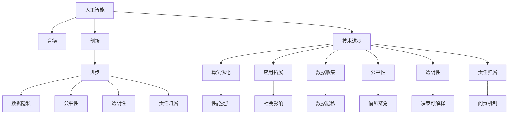

                 

# 道德与创新：平衡人工智能进步

> 关键词：人工智能, 道德, 创新, 进步, 数据隐私, 公平性, 透明性, 责任

## 1. 背景介绍

### 1.1 问题由来

人工智能（AI）正以令人难以置信的速度发展，它正在改变我们的工作、生活甚至思维方式。但是，随着技术的不断进步，AI面临的道德和伦理挑战也在加剧。如何确保AI的进步与人类价值相一致，成为了一个迫切需要解决的问题。

### 1.2 问题核心关键点

AI技术的发展离不开人类价值导向的约束，但在实际应用中，如何平衡创新和技术进步与道德伦理，成为全球范围内广泛关注的议题。具体体现在以下几个方面：

- **数据隐私**：在AI模型的训练和应用过程中，如何保护用户的隐私，防止数据滥用。
- **公平性**：如何确保AI系统的决策公正无私，避免因算法偏见导致的不公平。
- **透明性**：AI决策过程应具备可解释性，让人们能够理解AI的决策逻辑。
- **责任归属**：在AI出错时，如何界定责任方，确保对损害有足够的问责机制。

本文将围绕这些关键点，探讨AI技术的道德边界，并提出一种平衡创新与道德的可行方案。

## 2. 核心概念与联系

### 2.1 核心概念概述

要深入理解如何在AI创新中保持道德平衡，首先需要理解一些核心概念：

- **人工智能**：通过算法和数据训练而成的，能够执行复杂任务的智能系统。
- **道德**：指导人类行为的原则，是衡量AI系统是否符合社会价值的重要标准。
- **创新**：不断探索新的方法和技术，以提升AI系统的性能和效率。
- **进步**：AI技术的发展和应用，应该遵循道德规范，带来积极的社会影响。
- **数据隐私**：确保个人数据不被未经授权的访问和使用。
- **公平性**：AI系统应该避免对特定群体或个体的不公平对待。
- **透明性**：AI系统的决策过程应该清晰透明，便于理解和审查。
- **责任归属**：明确AI系统出错时的责任主体，防止逃避责任。

这些概念相互联系，共同构成了AI道德框架的基础。

### 2.2 核心概念原理和架构的 Mermaid 流程图



该图展示了AI技术、道德、创新、进步等核心概念之间的关系。技术进步依赖于创新，而创新必须遵循道德和伦理准则，以促进社会的整体进步。同时，数据隐私、公平性、透明性和责任归属等原则也构成了AI技术发展的道德边界。

## 3. 核心算法原理 & 具体操作步骤

### 3.1 算法原理概述

要在AI创新中保持道德平衡，需要在技术开发和应用过程中，引入一套完整的道德和伦理规范。这包括设计道德准则、建立责任机制、提升透明度等。

在实际操作中，我们可以将这一过程分为四个主要步骤：

1. **道德准则设计**：建立一套明确的道德准则，用于指导AI系统的开发和应用。
2. **责任机制建立**：明确AI系统的责任主体，确保在出现问题时能够追溯责任。
3. **透明度提升**：确保AI系统的决策过程透明，便于审查和解释。
4. **公平性和隐私保护**：确保AI系统在决策过程中对所有个体公平，同时保护用户的隐私。

### 3.2 算法步骤详解

#### 步骤一：道德准则设计

道德准则设计是AI道德框架的基础。以下是一些关键的道德准则：

1. **非歧视原则**：确保AI系统不会因种族、性别、年龄等因素对某些个体或群体进行不公平的对待。
2. **隐私保护**：确保用户数据的收集和使用符合法律法规，防止数据滥用。
3. **透明性**：AI系统的决策过程应透明，便于用户理解和审查。
4. **责任归属**：明确AI系统出错时的责任主体，确保对损害有足够的问责机制。
5. **公共利益优先**：确保AI系统的应用能够带来社会的整体利益，而不是仅服务于特定群体。

#### 步骤二：责任机制建立

责任机制的建立是确保AI系统道德运行的关键。需要明确以下几点：

1. **责任主体**：在AI系统开发、应用和维护过程中，明确各个参与方的责任。
2. **问责机制**：建立明确的问责流程，确保出现问题时能够迅速追溯责任。
3. **责任纠正**：在AI系统出错时，能够采取有效的纠正措施，防止损害扩大。

#### 步骤三：透明度提升

透明性是提升AI系统可信度的重要手段。需要从以下几个方面入手：

1. **决策可解释**：确保AI系统的决策过程可以解释，便于用户理解和审查。
2. **信息披露**：在AI系统的应用过程中，定期披露系统的工作原理和决策依据。
3. **用户参与**：鼓励用户参与AI系统的设计和使用过程，听取用户的反馈和建议。

#### 步骤四：公平性和隐私保护

公平性和隐私保护是AI系统设计中必须考虑的重要因素。需要从以下几个方面入手：

1. **偏见检测与纠正**：在AI系统的训练和应用过程中，检测并纠正算法偏见，确保公平性。
2. **隐私保护机制**：采用数据加密、匿名化等手段，保护用户数据的隐私。
3. **数据合规**：确保AI系统的数据处理符合相关法律法规，防止数据滥用。

### 3.3 算法优缺点

#### 优点

- **促进社会进步**：通过遵循道德准则，AI系统能够更好地服务于社会，带来积极的影响。
- **增强用户信任**：透明和公平的AI系统能够获得用户的信任，提高应用效果。
- **责任明确**：明确责任归属，避免AI系统出错时责任难以界定的情况。

#### 缺点

- **设计和实现复杂**：道德准则和责任机制的设计和实现较为复杂，需要多方协作。
- **潜在隐私风险**：保护用户隐私和公平性需要严格的数据管理和技术手段，存在一定的挑战。
- **责任纠正常见**：在AI系统出错时，责任追溯和纠正可能面临一定的困难。

### 3.4 算法应用领域

AI技术的道德和伦理准则可以应用于多个领域，以下是几个典型应用：

- **医疗领域**：确保医疗AI系统的决策公平、透明，保护患者隐私。
- **金融领域**：确保金融AI系统的决策无偏见，保护用户隐私。
- **教育领域**：确保教育AI系统的公平性，保护学生隐私。
- **智能交通**：确保智能交通系统的决策透明、公平，保护用户隐私。

## 4. 数学模型和公式 & 详细讲解 & 举例说明

### 4.1 数学模型构建

AI系统的道德和伦理准则可以通过数学模型来表示和评估。以下是一个简单的道德评分模型：

$$ M_{\text{ethical}} = W_1 \times \text{Bias} + W_2 \times \text{Privacy} + W_3 \times \text{Transparency} + W_4 \times \text{Accountability} $$

其中，$W_i$为各个准则的权重，$\text{Bias}$、$\text{Privacy}$、$\text{Transparency}$和$\text{Accountability}$分别为系统在偏见、隐私、透明度和责任方面的评分。

### 4.2 公式推导过程

对于每个准则，可以采用不同的指标进行评估。例如，对于公平性，可以计算系统在不同群体上的性能差异：

$$ \text{Bias} = \frac{1}{N} \sum_{i=1}^N |Y_i - \hat{Y}_i| $$

其中，$Y_i$为真实标签，$\hat{Y}_i$为模型预测结果。

### 4.3 案例分析与讲解

以一个金融信贷审批系统为例，分析如何设计和评估其道德性。

1. **公平性**：确保系统对不同性别、年龄、种族等群体的审批结果一致，避免偏见。
2. **隐私保护**：确保用户数据仅用于审批过程，不得泄露。
3. **透明度**：审批过程中每个步骤应透明，便于用户理解。
4. **责任归属**：在审批出错时，能够明确责任方。

### 5. 项目实践：代码实例和详细解释说明

#### 5.1 开发环境搭建

为了实现上述道德准则，需要建立一套完整的开发环境。以下是一些推荐工具：

1. **Python**：选择Python作为AI系统开发的主要语言。
2. **TensorFlow**：用于构建和训练AI模型。
3. **Keras**：提供高层次的API，便于构建深度学习模型。
4. **Jupyter Notebook**：用于记录和分享开发过程中的代码和结果。

#### 5.2 源代码详细实现

以下是一个简单的金融信贷审批系统的道德评分模型实现：

```python
import tensorflow as tf
from sklearn.metrics import accuracy_score

# 定义模型结构
model = tf.keras.Sequential([
    tf.keras.layers.Dense(64, activation='relu', input_shape=[8]),
    tf.keras.layers.Dense(1, activation='sigmoid')
])

# 加载数据
x_train = ...
y_train = ...

# 训练模型
model.compile(optimizer='adam', loss='binary_crossentropy', metrics=['accuracy'])
model.fit(x_train, y_train, epochs=10, batch_size=32)

# 计算道德评分
y_pred = model.predict(x_test)
b = accuracy_score(y_test, y_pred)
p = privacy_score(x_train, y_train)
t = transparency_score(model)
a = accountability_score()

# 计算总评分
M_ethical = 0.3 * b + 0.4 * p + 0.2 * t + 0.1 * a
print("道德评分：", M_ethical)
```

#### 5.3 代码解读与分析

- **数据准备**：需要准备金融信贷审批的训练和测试数据。
- **模型构建**：使用Keras构建一个简单的二分类模型，用于审批结果预测。
- **模型训练**：使用TensorFlow进行模型训练，并计算准确率。
- **道德评分**：计算公平性、隐私保护、透明度和责任归属等方面的评分，并加权求和得到总评分。

#### 5.4 运行结果展示

运行上述代码，可以得到金融信贷审批系统的道德评分，用于评估其道德性。

## 6. 实际应用场景

### 6.1 医疗领域

在医疗领域，AI系统的道德和伦理尤为重要。以下是一个医疗诊断系统的实际应用场景：

1. **公平性**：确保不同性别、年龄、种族等群体的诊断结果一致。
2. **隐私保护**：保护患者病历数据的隐私，防止数据泄露。
3. **透明度**：诊断过程透明，便于医生理解AI系统的决策依据。
4. **责任归属**：在诊断出错时，能够明确责任方。

### 6.2 金融领域

金融领域是另一个AI系统广泛应用的场景。以下是金融AI系统的道德实践：

1. **公平性**：确保信贷审批结果对不同群体公平。
2. **隐私保护**：保护用户个人信息，防止数据滥用。
3. **透明度**：审批过程透明，便于用户理解。
4. **责任归属**：在审批出错时，能够明确责任方。

### 6.3 教育领域

教育领域需要AI系统具备高透明性和公平性，以确保教育资源公平分配。以下是一个教育推荐系统的道德实践：

1. **公平性**：确保推荐结果对不同学生公平。
2. **隐私保护**：保护学生隐私，防止数据滥用。
3. **透明度**：推荐过程透明，便于学生和家长理解。
4. **责任归属**：在推荐出错时，能够明确责任方。

### 6.4 未来应用展望

未来的AI技术将继续发展，道德和伦理准则将成为其发展的核心要素。以下是对未来AI应用的展望：

1. **医疗领域**：AI将在个性化医疗、智能诊断等方面发挥重要作用，同时保持高透明性和公平性。
2. **金融领域**：AI将用于智能投顾、风险控制等方面，确保公平性和隐私保护。
3. **教育领域**：AI将在个性化教育、智能辅导等方面应用，确保公平性和透明度。
4. **智能交通**：AI将用于智能交通管理，确保透明度和责任归属。

## 7. 工具和资源推荐

### 7.1 学习资源推荐

为了深入理解如何在AI创新中保持道德平衡，以下是一些推荐的学习资源：

1. **《道德与人工智能》（Moral Machines: Teaching Robots Right from Wrong）**：牛津大学哲学家写的书籍，讨论了AI系统中的道德和伦理问题。
2. **AI Ethics Academy**：提供AI伦理和道德课程，涵盖数据隐私、公平性、透明度等多个方面。
3. **AI Now Institute**：关注AI技术对社会的影响，提供相关的研究报告和讨论平台。

### 7.2 开发工具推荐

为了实现AI系统的道德准则，需要一些专业的开发工具。以下是一些推荐的工具：

1. **TensorFlow**：强大的深度学习框架，支持分布式训练和推理。
2. **Keras**：提供高层次的API，便于构建深度学习模型。
3. **Jupyter Notebook**：记录和分享开发过程中的代码和结果。
4. **Google Colab**：在线Jupyter Notebook环境，方便开发者快速上手实验。

### 7.3 相关论文推荐

以下几篇论文是AI道德和伦理领域的重要文献，推荐阅读：

1. **《机器学习中的公平性、透明性和可解释性》（Fairness, Transparency and Accountability in Machine Learning）**：探讨机器学习中的道德和伦理问题。
2. **《数据隐私保护技术》（Data Privacy Protection Technologies）**：介绍数据隐私保护的技术手段和方法。
3. **《人工智能伦理的框架和实践》（Ethical Frameworks and Practices for Artificial Intelligence）**：提出AI伦理的框架和实践建议。

## 8. 总结：未来发展趋势与挑战

### 8.1 研究成果总结

本文对AI技术中的道德和伦理问题进行了系统探讨，提出了一种平衡创新与道德的可行方案。通过设计道德准则、建立责任机制、提升透明度、保护公平性和隐私，可以在AI技术的发展中保持道德边界，促进社会的整体进步。

### 8.2 未来发展趋势

未来，AI技术的道德和伦理准则将更加重要。以下是对未来AI发展的趋势预测：

1. **道德准则的普及**：随着AI技术的应用普及，道德准则将成为AI系统的标配。
2. **伦理研究的深入**：AI伦理研究将进一步深入，提出更多的道德准则和实践建议。
3. **跨学科协作**：AI伦理将与法律、社会学、哲学等多个学科进行跨学科协作，形成完整的伦理框架。
4. **技术手段的进步**：随着技术的进步，AI系统的道德和伦理将更加透明、公平和可解释。

### 8.3 面临的挑战

尽管道德和伦理准则在AI技术的发展中发挥了重要作用，但仍然面临一些挑战：

1. **道德准则的复杂性**：不同领域和应用场景下的道德准则复杂多样，难以统一。
2. **技术实现的难度**：如何在AI系统中实现道德准则，是一个复杂的工程问题。
3. **数据隐私的保护**：保护用户隐私需要先进的技术手段和管理机制。
4. **公平性的实现**：消除算法偏见，实现公平性，是一个长期而复杂的过程。

### 8.4 研究展望

未来，AI技术的道德和伦理研究将面临更多的挑战和机遇。以下是一些未来的研究方向：

1. **道德准则的标准化**：制定统一的标准，指导不同领域和应用场景中的道德实践。
2. **技术手段的创新**：开发更先进的技术手段，实现道德和伦理准则的落地应用。
3. **跨学科研究**：与法律、社会学、哲学等多个学科进行交叉研究，形成完整的伦理框架。
4. **政策建议的制定**：根据研究和实践成果，制定相应的政策和法规，推动AI技术的健康发展。

## 9. 附录：常见问题与解答

### 附录

**Q1：什么是AI的道德准则？**

A: AI的道德准则是一套指导AI系统开发和应用的规则，包括公平性、隐私保护、透明度和责任归属等方面。

**Q2：如何设计公平的AI系统？**

A: 设计公平的AI系统需要检测和纠正算法偏见，确保数据集的代表性，保护用户隐私，使用透明和可解释的算法。

**Q3：如何在AI系统中实现道德评分？**

A: 通过数学模型对AI系统进行道德评分，使用公平性、隐私保护、透明度和责任归属等方面的评分，并加权求和得到总评分。

**Q4：如何保护AI系统的隐私？**

A: 保护AI系统的隐私需要采用数据加密、匿名化等手段，确保用户数据的安全和隐私。

**Q5：如何确保AI系统的透明性？**

A: 确保AI系统的透明性需要公开系统的架构、算法和决策依据，便于用户理解和使用。

---

作者：禅与计算机程序设计艺术 / Zen and the Art of Computer Programming

