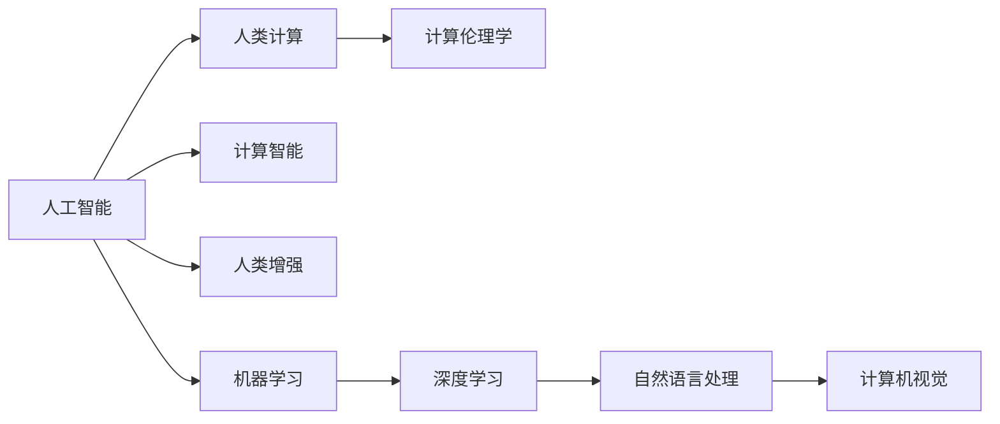

                 

# 释放人类潜力的无限可能：人类计算的最终目标

## 1. 背景介绍

在科技飞速发展的今天，人工智能(AI)已经成为改变世界的重要力量。人类计算，即利用计算资源进行大规模数据分析、建模和优化，正引领我们进入全新的信息时代。本系列文章旨在探讨人类计算的终极目标——如何通过计算，激发人类潜能，释放文明进步的无限可能。

### 1.1 问题由来

随着计算能力的不断提升，人们开始思考如何更好地利用计算机解决复杂问题，提升社会生产力和人类生活质量。从早期的数值计算，到现在的深度学习、自然语言处理、计算机视觉等，计算技术不断拓展其应用领域。

然而，人类计算的目标不仅仅是解决具体问题，而是通过计算，实现对世界的更深刻理解，从而推动文明的进步。人类计算的终极目标是解放人类的智力和体力，使每个人都能实现其最大潜力，构建更加公正、和谐、高效的社会。

### 1.2 问题核心关键点

为了达到这一目标，人类计算需要具备以下特点：

1. **普适性**：能够广泛适用于各种领域和应用，提升全社会的生产力。
2. **可解释性**：算法模型需具备较高的透明性和可解释性，避免“黑箱”模型。
3. **鲁棒性**：系统需要具备较强的鲁棒性，能够处理异常和噪声数据。
4. **可扩展性**：能够处理不断增长的数据规模和复杂性，实现持续的性能提升。
5. **伦理性**：在决策过程中，需考虑伦理和道德问题，避免有害输出。

这些核心关键点共同构成了人类计算的追求方向，驱动着相关技术的发展和应用。

## 2. 核心概念与联系

### 2.1 核心概念概述

为了更深刻地理解人类计算的目标，本节将介绍几个核心概念及其相互关系：

- **人工智能(AI)**：一种模拟人类智能的技术，通过机器学习、深度学习、自然语言处理等方法，实现对复杂问题的求解。
- **人类计算(Human Computation)**：利用计算资源，通过算法和模型，提升人类智力和体力，解决复杂问题，推动社会进步。
- **计算智能(Computational Intelligence, CI)**：结合生物启发算法、遗传算法等方法，实现智能决策和问题求解。
- **人类增强(Human Augmentation)**：通过计算技术和人工智能，增强人类的感知、判断和决策能力，提升工作和生活效率。
- **计算伦理学(Computational Ethics)**：研究如何在使用计算技术时，考虑伦理和道德问题，确保技术的健康发展。

这些概念之间的联系可以通过以下Mermaid流程图来展示：



这个流程图展示了人工智能、人类计算、计算智能、人类增强和计算伦理学的相互关系：

1. 人工智能通过机器学习和深度学习等方法，实现了对复杂问题的求解。
2. 人类计算利用这些智能技术，提升人类的智力和体力，解决实际问题。
3. 计算智能结合生物启发算法，实现更加灵活的智能决策。
4. 人类增强利用人工智能技术，提升人类的感知和判断能力。
5. 计算伦理学确保技术应用符合伦理和道德标准。

这些概念共同构成了人类计算的技术框架，推动着技术的不断进步和应用。

## 3. 核心算法原理 & 具体操作步骤

### 3.1 算法原理概述

人类计算的核心算法原理，主要体现在以下几个方面：

- **分布式计算**：利用大规模分布式集群，并行处理海量数据，提升计算效率。
- **大数据分析**：通过对大规模数据进行建模和分析，揭示隐藏规律和趋势，辅助决策。
- **深度学习**：通过多层神经网络模型，对复杂数据进行深度特征提取和表示学习。
- **自然语言处理**：通过语言模型和语义分析，实现对文本数据的理解和处理。
- **计算机视觉**：通过图像识别和理解技术，实现对视觉数据的分析和处理。

这些算法技术相互交织，构成了人类计算的技术体系。

### 3.2 算法步骤详解

基于人类计算的算法原理，我们可以将整个计算过程分为以下几个步骤：

1. **数据采集与预处理**：从不同渠道收集数据，进行清洗和标注，确保数据质量。
2. **模型设计与训练**：选择合适的算法和模型，进行训练和优化，提升模型性能。
3. **推理与决策**：利用训练好的模型，对新数据进行推理和决策，解决实际问题。
4. **反馈与改进**：根据决策结果和反馈信息，不断改进算法和模型，提升系统性能。

以下将以深度学习为例，详细介绍模型训练的详细步骤：

### 3.3 算法优缺点

人类计算的算法技术具有以下优点：

- **高效性**：利用分布式计算和大数据分析技术，可以高效处理大规模数据，提升计算效率。
- **泛化能力**：深度学习模型具有较强的泛化能力，能够在不同领域和任务上取得优异性能。
- **适应性**：通过算法改进和模型优化，能够适应不断变化的环境和需求。
- **鲁棒性**：通过正则化、Dropout等技术，增强模型的鲁棒性和泛化能力。

同时，人类计算的算法技术也存在一些局限性：

- **资源消耗大**：大规模计算和数据处理需要大量的硬件资源，成本较高。
- **计算复杂度高**：深度学习模型通常结构复杂，训练和推理耗时较长。
- **可解释性差**：某些算法模型（如黑盒模型）难以解释其决策过程，缺乏透明性。
- **伦理问题**：在使用算法时，需考虑伦理和道德问题，避免有害输出。

尽管存在这些局限性，但人类计算的技术体系仍在不断进步和完善，为解决复杂问题提供了强有力的工具。

### 3.4 算法应用领域

人类计算的算法技术在多个领域得到了广泛应用，例如：

- **医疗健康**：通过数据分析和建模，辅助诊断疾病、制定治疗方案。
- **金融风控**：利用大数据分析和机器学习技术，预测市场趋势、防范风险。
- **智能制造**：通过物联网和大数据分析，优化生产流程、提升产品质量。
- **智慧城市**：利用计算技术，实现城市交通管理、公共安全等智能化应用。
- **环境保护**：通过遥感数据和机器学习，监测环境变化、预测气候变化。

这些应用展示了人类计算技术在各行各业中的广泛影响力。

## 4. 数学模型和公式 & 详细讲解 & 举例说明

### 4.1 数学模型构建

为了更好地理解人类计算的算法原理，本节将从数学角度构建相关模型。

设 $D=\{(x_i,y_i)\}_{i=1}^N$ 为一批标注数据，其中 $x_i$ 为输入，$y_i$ 为标签。假设模型为 $M_\theta(x)$，其中 $\theta$ 为模型参数。

定义模型的损失函数为：

$$
\mathcal{L}(\theta) = \frac{1}{N} \sum_{i=1}^N \ell(M_\theta(x_i),y_i)
$$

其中 $\ell$ 为损失函数，用于衡量模型输出与真实标签之间的差异。常见的损失函数包括交叉熵损失、均方误差损失等。

### 4.2 公式推导过程

以交叉熵损失为例，其公式推导如下：

设模型输出为 $M_\theta(x) \in [0,1]$，表示样本属于正类的概率。真实标签 $y \in \{0,1\}$。则二分类交叉熵损失函数定义为：

$$
\ell(M_\theta(x),y) = -[y\log M_\theta(x) + (1-y)\log (1-M_\theta(x))]
$$

将其代入经验风险公式，得：

$$
\mathcal{L}(\theta) = -\frac{1}{N}\sum_{i=1}^N [y_i\log M_\theta(x_i)+(1-y_i)\log(1-M_\theta(x_i))]
$$

根据链式法则，损失函数对参数 $\theta_k$ 的梯度为：

$$
\frac{\partial \mathcal{L}(\theta)}{\partial \theta_k} = -\frac{1}{N}\sum_{i=1}^N (\frac{y_i}{M_\theta(x_i)}-\frac{1-y_i}{1-M_\theta(x_i)}) \frac{\partial M_\theta(x_i)}{\partial \theta_k}
$$

其中 $\frac{\partial M_\theta(x_i)}{\partial \theta_k}$ 可进一步递归展开，利用自动微分技术完成计算。

### 4.3 案例分析与讲解

以深度学习中的卷积神经网络(CNN)为例，讲解模型训练的详细步骤：

1. **数据预处理**：将图像数据归一化、裁剪、旋转，转换为模型所需格式。
2. **模型构建**：设计卷积层、池化层、全连接层等，构建神经网络模型。
3. **损失函数选择**：根据任务类型选择合适的损失函数，如交叉熵损失。
4. **模型训练**：利用标注数据进行反向传播，更新模型参数，最小化损失函数。
5. **模型评估**：在验证集上评估模型性能，防止过拟合。
6. **模型部署**：将训练好的模型部署到实际应用中，进行推理和决策。

CNN模型训练的详细步骤展示了深度学习算法在图像识别任务中的实现过程。

## 5. 项目实践：代码实例和详细解释说明

### 5.1 开发环境搭建

在进行深度学习项目实践前，我们需要准备好开发环境。以下是使用Python进行TensorFlow开发的环境配置流程：

1. 安装Anaconda：从官网下载并安装Anaconda，用于创建独立的Python环境。

2. 创建并激活虚拟环境：
```bash
conda create -n tf-env python=3.8 
conda activate tf-env
```

3. 安装TensorFlow：根据CUDA版本，从官网获取对应的安装命令。例如：
```bash
conda install tensorflow
```

4. 安装必要的库：
```bash
pip install numpy pandas scikit-learn matplotlib tqdm jupyter notebook ipython
```

完成上述步骤后，即可在`tf-env`环境中开始深度学习实践。

### 5.2 源代码详细实现

下面以图像分类任务为例，给出使用TensorFlow对卷积神经网络(CNN)进行训练的PyTorch代码实现。

首先，定义CNN模型：

```python
import tensorflow as tf

class CNN(tf.keras.Model):
    def __init__(self):
        super(CNN, self).__init__()
        self.conv1 = tf.keras.layers.Conv2D(32, (3, 3), activation='relu')
        self.pool1 = tf.keras.layers.MaxPooling2D((2, 2))
        self.conv2 = tf.keras.layers.Conv2D(64, (3, 3), activation='relu')
        self.pool2 = tf.keras.layers.MaxPooling2D((2, 2))
        self.flatten = tf.keras.layers.Flatten()
        self.dense1 = tf.keras.layers.Dense(128, activation='relu')
        self.dense2 = tf.keras.layers.Dense(10, activation='softmax')
        
    def call(self, x):
        x = self.conv1(x)
        x = self.pool1(x)
        x = self.conv2(x)
        x = self.pool2(x)
        x = self.flatten(x)
        x = self.dense1(x)
        x = self.dense2(x)
        return x
```

然后，定义训练和评估函数：

```python
from tensorflow.keras.datasets import mnist
from tensorflow.keras.utils import to_categorical

(x_train, y_train), (x_test, y_test) = mnist.load_data()

x_train = x_train.reshape((-1, 28, 28, 1))
x_test = x_test.reshape((-1, 28, 28, 1))
y_train = to_categorical(y_train, num_classes=10)
y_test = to_categorical(y_test, num_classes=10)

model = CNN()
optimizer = tf.keras.optimizers.Adam(learning_rate=0.001)
loss_fn = tf.keras.losses.CategoricalCrossentropy()

@tf.function
def train_step(inputs, targets):
    with tf.GradientTape() as tape:
        predictions = model(inputs)
        loss_value = loss_fn(targets, predictions)
    gradients = tape.gradient(loss_value, model.trainable_variables)
    optimizer.apply_gradients(zip(gradients, model.trainable_variables))
    return loss_value

@tf.function
def evaluate(inputs, targets):
    predictions = model(inputs)
    loss_value = loss_fn(targets, predictions)
    return loss_value

# 训练模型
model.compile(optimizer=optimizer, loss=loss_fn, metrics=['accuracy'])
model.fit(x_train, y_train, epochs=10, batch_size=64, validation_data=(x_test, y_test))

# 评估模型
test_loss = evaluate(x_test, y_test)
test_acc = model.evaluate(x_test, y_test)[1]
print(f'Test Loss: {test_loss:.4f}')
print(f'Test Accuracy: {test_acc:.4f}')
```

以上就是使用TensorFlow对CNN进行图像分类任务训练的完整代码实现。可以看到，得益于TensorFlow的强大封装，我们可以用相对简洁的代码完成CNN模型的加载和训练。

### 5.3 代码解读与分析

让我们再详细解读一下关键代码的实现细节：

**CNN类**：
- `__init__`方法：初始化卷积层、池化层、全连接层等关键组件。
- `call`方法：定义模型的前向传播过程。

**数据预处理**：
- 使用`tf.keras.datasets.mnist.load_data`加载MNIST数据集，并对其进行归一化和转换为模型所需格式。
- 使用`to_categorical`函数将标签转换为one-hot编码格式。

**训练和评估函数**：
- 定义`train_step`和`evaluate`函数，分别实现训练和评估过程。
- 使用`tf.function`装饰器进行图化优化，提升模型训练和推理效率。

**训练流程**：
- 使用`model.compile`配置模型训练参数。
- 使用`model.fit`进行模型训练，在每个epoch结束后在验证集上评估模型性能。
- 使用`model.evaluate`在测试集上评估模型性能。

可以看到，TensorFlow提供了一站式解决方案，使得深度学习模型的训练和评估变得非常简单。开发者可以将更多精力放在模型改进和应用设计上，而不必过多关注底层的实现细节。

当然，工业级的系统实现还需考虑更多因素，如模型的保存和部署、超参数的自动搜索、更灵活的任务适配层等。但核心的深度学习模型训练流程基本与此类似。

## 6. 实际应用场景

### 6.1 医疗健康

深度学习在医疗健康领域的应用日益广泛，通过大规模数据分析，辅助医生诊断疾病、制定治疗方案。

例如，利用卷积神经网络对医学影像进行分类和分割，自动识别病灶区域，帮助医生快速准确地诊断。在遗传病预测、药物研发等方面，深度学习模型也展现出了强大的能力。

### 6.2 金融风控

金融机构利用深度学习模型进行风险预测和信用评估，提升风险管理和客户服务水平。

通过分析客户行为数据、交易记录等，深度学习模型能够预测客户的违约风险，及时采取措施，降低不良贷款率。同时，利用自然语言处理技术，深度学习模型能够分析客户评论和反馈，提升客户服务体验。

### 6.3 智能制造

在智能制造领域，深度学习模型被广泛应用于质量控制、生产调度、设备维护等方面。

通过分析生产过程中的传感器数据和生产日志，深度学习模型能够预测设备故障，优化生产流程，提高生产效率。同时，利用自然语言处理技术，深度学习模型能够自动生成生产报告和维护建议，提升生产管理水平。

### 6.4 智慧城市

智慧城市利用深度学习模型进行交通管理、公共安全、环境监测等智能化应用。

通过分析城市交通数据、视频监控数据等，深度学习模型能够预测交通流量，优化交通信号灯，缓解交通拥堵。同时，利用计算机视觉技术，深度学习模型能够实现人脸识别、车辆识别等功能，提升城市公共安全水平。

### 6.5 环境保护

在环境保护领域，深度学习模型被广泛应用于气候预测、生态监测等方面。

通过分析卫星遥感数据、气象数据等，深度学习模型能够预测气候变化趋势，提供决策支持。同时，利用自然语言处理技术，深度学习模型能够自动分析环境报告和新闻，提供生态监测和预警信息。

这些应用展示了深度学习技术在各行各业中的广泛影响力。

## 7. 工具和资源推荐

### 7.1 学习资源推荐

为了帮助开发者系统掌握深度学习理论基础和实践技巧，这里推荐一些优质的学习资源：

1. 《深度学习》系列书籍：由Ian Goodfellow、Yoshua Bengio和Aaron Courville合著，系统介绍了深度学习的基本概念、算法和应用。
2. CS231n《卷积神经网络》课程：斯坦福大学开设的计算机视觉课程，涵盖了深度学习在图像处理中的应用。
3. CS224n《自然语言处理》课程：斯坦福大学开设的自然语言处理课程，系统介绍了自然语言处理的基本概念、算法和应用。
4. CS224h《序列模型》课程：斯坦福大学开设的序列模型课程，涵盖了深度学习在序列数据处理中的应用。
5. PyTorch官方文档：PyTorch框架的官方文档，提供了详尽的API和教程，帮助开发者快速上手。

通过对这些资源的学习实践，相信你一定能够快速掌握深度学习技术，并用于解决实际的计算问题。

### 7.2 开发工具推荐

高效的开发离不开优秀的工具支持。以下是几款用于深度学习开发的常用工具：

1. PyTorch：基于Python的开源深度学习框架，灵活动态的计算图，适合快速迭代研究。
2. TensorFlow：由Google主导开发的开源深度学习框架，生产部署方便，适合大规模工程应用。
3. Keras：基于TensorFlow的高级API，提供简单易用的接口，适合初学者入门。
4. MXNet：由亚马逊开发的深度学习框架，支持分布式训练和多种语言接口，适合跨平台应用。
5. Caffe：由加州大学伯克利分校开发的深度学习框架，适合计算机视觉任务。

合理利用这些工具，可以显著提升深度学习模型的开发效率，加快创新迭代的步伐。

### 7.3 相关论文推荐

深度学习技术的发展源于学界的持续研究。以下是几篇奠基性的相关论文，推荐阅读：

1. ImageNet Classification with Deep Convolutional Neural Networks：提出卷积神经网络，实现了图像分类的新突破。
2. Deep Speech 2：提出深度神经网络，实现了语音识别的新进展。
3. Attention Is All You Need：提出Transformer结构，开启了NLP领域的预训练大模型时代。
4. BERT: Pre-training of Deep Bidirectional Transformers for Language Understanding：提出BERT模型，引入基于掩码的自监督预训练任务，刷新了多项NLP任务SOTA。
5. Adversarial Examples in Deep Learning：提出对抗样本，揭示了深度学习模型的脆弱性，推动了对抗训练的研究。

这些论文代表了大深度学习技术的发展脉络。通过学习这些前沿成果，可以帮助研究者把握学科前进方向，激发更多的创新灵感。

## 8. 总结：未来发展趋势与挑战

### 8.1 总结

本文对人类计算的终极目标——释放人类潜力的无限可能进行了全面系统的介绍。首先阐述了人类计算的目标，明确了计算技术对人类生产力和生活质量的提升作用。其次，从原理到实践，详细讲解了深度学习模型的训练和应用流程，给出了深度学习任务开发的完整代码实例。同时，本文还广泛探讨了深度学习技术在医疗健康、金融风控、智能制造、智慧城市和环境保护等领域的广泛应用，展示了深度学习技术的巨大潜力。此外，本文精选了深度学习技术的各类学习资源，力求为读者提供全方位的技术指引。

通过本文的系统梳理，可以看到，深度学习技术在各个领域的应用正处于快速发展期，极大地推动了社会生产力的提升和人类生活质量的改善。未来，伴随深度学习技术的持续演进，其在各行各业的应用将更加广泛，为社会进步提供更强大的动力。

### 8.2 未来发展趋势

展望未来，深度学习技术将呈现以下几个发展趋势：

1. **多模态学习**：深度学习模型将结合视觉、语音、文本等多种模态数据，实现更全面的信息理解和处理。
2. **自监督学习**：利用大规模非标注数据，通过自监督学习技术，提升模型的泛化能力和鲁棒性。
3. **联邦学习**：通过分布式计算和隐私保护技术，实现模型在多个设备上的联合训练，保护数据隐私。
4. **迁移学习**：利用预训练模型，在少样本或无样本情况下，实现快速适应新任务。
5. **强化学习**：通过与环境的交互，实现智能决策和问题求解。

这些发展趋势展示了深度学习技术的广阔前景，预示着其在各行各业的应用将更加广泛和深入。

### 8.3 面临的挑战

尽管深度学习技术已经取得了瞩目成就，但在迈向更加智能化、普适化应用的过程中，它仍面临着诸多挑战：

1. **数据质量和多样性**：深度学习模型的性能依赖于高质量、多样性的数据，数据不足或数据质量差会导致模型性能下降。
2. **计算资源消耗**：深度学习模型通常需要大量的计算资源，成本较高，硬件瓶颈成为制约技术发展的主要因素。
3. **模型可解释性**：深度学习模型通常缺乏可解释性，难以理解其决策过程，对伦理和道德问题的考虑不足。
4. **鲁棒性和泛化性**：深度学习模型在面对噪声数据和异常情况时，容易出现鲁棒性不足和泛化能力差的问题。
5. **安全性**：深度学习模型可能存在漏洞，被恶意攻击者利用，导致安全问题。

这些挑战需要我们在实践中不断克服，才能推动深度学习技术的发展和应用。

### 8.4 研究展望

未来的深度学习研究需要在以下几个方面寻求新的突破：

1. **多模态数据融合**：结合视觉、语音、文本等多种模态数据，实现更全面的信息理解和处理。
2. **自监督学习**：利用非标注数据，通过自监督学习技术，提升模型的泛化能力和鲁棒性。
3. **联邦学习**：通过分布式计算和隐私保护技术，实现模型在多个设备上的联合训练，保护数据隐私。
4. **迁移学习**：利用预训练模型，在少样本或无样本情况下，实现快速适应新任务。
5. **强化学习**：通过与环境的交互，实现智能决策和问题求解。

这些研究方向的探索，将推动深度学习技术向更高层次迈进，为构建智能社会提供更强大的技术支持。

## 9. 附录：常见问题与解答

**Q1：深度学习技术是否适用于所有领域？**

A: 深度学习技术在多个领域得到了广泛应用，但也存在一些限制。例如，在医疗健康领域，需要考虑伦理和隐私问题；在金融风控领域，需要处理大量实时数据；在智能制造领域，需要结合物联网和传感器数据。因此，深度学习技术需要根据具体应用场景进行调整和优化。

**Q2：如何提高深度学习模型的泛化能力？**

A: 提高深度学习模型的泛化能力可以从以下几个方面入手：
1. **数据增强**：通过数据增强技术，扩充训练集，增加模型对多样性数据的适应性。
2. **正则化**：使用L2正则、Dropout等技术，防止过拟合，提升模型的泛化能力。
3. **迁移学习**：利用预训练模型，通过微调或零样本学习，提升模型在不同任务上的泛化能力。
4. **对抗训练**：通过对抗样本，提高模型鲁棒性，增强模型的泛化能力。

**Q3：深度学习技术在实际应用中如何保证模型安全性？**

A: 深度学习技术在实际应用中需要考虑模型安全性，可以从以下几个方面入手：
1. **数据隐私保护**：通过联邦学习等技术，保护数据隐私，防止数据泄露。
2. **模型鲁棒性**：通过对抗训练等技术，提高模型鲁棒性，防止模型被恶意攻击。
3. **安全验证**：通过模型验证和测试，发现和修复模型漏洞，保证模型安全性。
4. **伦理道德约束**：在模型设计和应用中，考虑伦理和道德问题，确保模型行为符合社会价值观。

**Q4：如何提高深度学习模型的可解释性？**

A: 提高深度学习模型的可解释性可以从以下几个方面入手：
1. **模型简化**：通过简化模型结构，减少层数和参数量，提升模型的可解释性。
2. **可视化技术**：通过可视化技术，展示模型内部特征和决策过程，增强模型的可解释性。
3. **逻辑回归**：通过逻辑回归等简单模型，辅助解释复杂模型的决策过程。
4. **知识图谱**：将知识图谱与深度学习模型结合，提升模型的可解释性和逻辑性。

这些技术手段可以帮助提升深度学习模型的可解释性，增强其在实际应用中的可靠性和透明性。

**Q5：深度学习技术在未来有哪些新的应用场景？**

A: 深度学习技术在未来有广泛的应用场景：
1. **自动驾驶**：利用计算机视觉和深度学习技术，实现自动驾驶和智能交通管理。
2. **医疗诊断**：通过深度学习技术，实现自动诊断和精准医疗。
3. **智慧教育**：利用自然语言处理和深度学习技术，实现智能辅导和个性化学习。
4. **智能家居**：通过自然语言处理和计算机视觉技术，实现智能家居和智慧生活。
5. **能源管理**：利用深度学习技术，实现智能电网和能源管理。

这些新的应用场景展示了深度学习技术在未来的广阔前景。

---

作者：禅与计算机程序设计艺术 / Zen and the Art of Computer Programming

