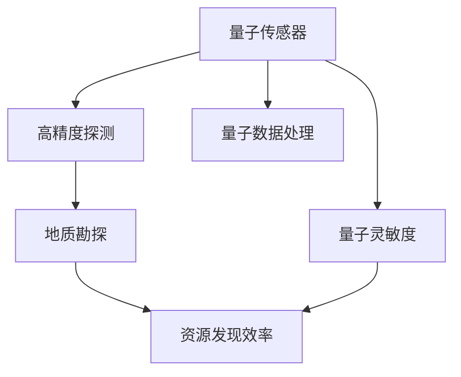

                 

# 量子传感器在地质勘探中的应用：提高资源发现效率

## 1. 背景介绍

地质勘探是发现和评估矿产资源、地下水、石油天然气等自然资源的重要手段。传统地质勘探方法如地震反射法、重力勘探、电磁勘探等，虽然已有数十年发展历史，但依然存在耗时长、成本高、效果受限等问题。近年来，随着量子科技的兴起，量子传感器在地质勘探领域的应用逐渐引起了广泛关注，特别是在提高资源发现效率、降低勘探成本等方面，展现出了巨大的潜力。

量子传感器利用量子力学原理，通过捕捉极微弱的变化实现对目标的探测。它具备高精度、宽频带、分辨率高等优点，尤其在地质勘探等复杂多变的环境下，量子传感器能够提供传统传感器难以实现的功能。特别是在探测地下矿物质、监测地质运动、评估油气藏等方面，量子传感器的应用已经展现出不可忽视的实际价值。

## 2. 核心概念与联系

### 2.1 核心概念概述

为了更好地理解量子传感器在地质勘探中的应用，本节将介绍几个关键核心概念：

- **量子传感器**：基于量子力学原理，能够检测极其微小变化的传感器。常见类型包括量子磁力仪、量子重力仪、量子声学传感器等。
- **量子灵敏度**：量子传感器检测目标的能力，与其量子态的稳定性、量子纠缠等特性密切相关。
- **地质勘探**：通过科学手段查找矿产资源、地下水、油气等自然资源的定位、定性、定量工作。
- **资源发现效率**：地质勘探中，单位时间、单位成本内发现资源的能力。
- **量子数据处理**：利用量子计算机等处理海量地质数据的算法和技术。

通过上述概念，我们可以建立量子传感器在地质勘探中应用的全貌，理解其如何通过提高探测精度、分辨率等特性，来提升资源发现效率。

### 2.2 核心概念原理和架构的 Mermaid 流程图



该图展示了量子传感器在地质勘探中应用的逻辑框架。量子传感器的高精度探测能力，依赖于其量子灵敏度，直接作用于地质勘探过程，并通过量子数据处理技术，最终提高了资源发现效率。

## 3. 核心算法原理 & 具体操作步骤

### 3.1 算法原理概述

量子传感器在地质勘探中的应用，主要基于量子力学的基本原理，特别是量子叠加态和量子纠缠的特性。通过这些特性，量子传感器能够实现极微小变化的精确探测，从而为地质勘探提供高分辨率、高精度的数据支持。

以量子磁力仪为例，其工作原理主要基于量子的磁矩特性，能够检测极微小的地磁场变化。在地质勘探中，这种高灵敏度的磁力仪可以用于探测地下矿物质的位置和分布，对地质结构和构造进行精确定位。

### 3.2 算法步骤详解

量子传感器的地质勘探应用一般包括以下几个关键步骤：

**Step 1: 数据采集与预处理**
- 利用量子传感器对地质环境进行数据采集，获取目标物理量的变化数据。
- 对采集数据进行预处理，包括去噪、滤波、降噪等，提升数据质量。

**Step 2: 数据分析与特征提取**
- 利用量子数据处理技术，对预处理后的数据进行分析，提取有用的地质信息。
- 应用量子算法，如量子傅里叶变换、量子卷积等，进行数据降维和特征提取。

**Step 3: 地质结构建模**
- 将提取出的地质信息进行建模，构建地层的3D图像，揭示地质结构和构造。
- 结合地质学知识，对模型进行解释，推断矿产资源的分布和数量。

**Step 4: 资源评估与定位**
- 通过建模和数据分析，评估资源的可采量、质量等。
- 利用高精度定位技术，对资源进行精确定位，确定可开采的范围和深度。

### 3.3 算法优缺点

量子传感器在地质勘探中的应用具有以下优点：

1. **高灵敏度**：量子传感器能够探测到传统传感器难以检测的极微小变化，提供了高分辨率的数据。
2. **宽频带**：量子传感器能够涵盖多个频段的物理量变化，适应多种地质环境。
3. **分辨率高**：量子传感器能够实现极高的探测精度，适合复杂地质环境的探测。

同时，量子传感器也存在一些局限性：

1. **高成本**：量子传感器的制造和维护成本较高，制约了其广泛应用。
2. **环境适应性**：在极端环境条件下，量子传感器的性能可能受到影响，稳定性有待提高。
3. **数据处理复杂**：量子传感器的数据处理需要专业量子算法和设备支持，存在一定的技术门槛。

### 3.4 算法应用领域

量子传感器在地质勘探中的应用涵盖了多个领域，具体包括：

- **矿产资源探测**：通过高精度磁力仪、重力仪等探测地下矿物质分布。
- **油气藏评估**：利用量子声学传感器探测地下油气藏的位置和大小。
- **地质结构建模**：通过量子磁力仪、重力仪等建立地层的3D模型，揭示地质结构和构造。
- **地质灾害监测**：利用量子传感器监测地震、火山等灾害的发生。
- **地下水资源探测**：利用量子磁力仪探测地下水资源的位置和分布。

这些应用领域展示了量子传感器在地质勘探中的广泛前景，为提高资源发现效率提供了重要手段。

## 4. 数学模型和公式 & 详细讲解 & 举例说明

### 4.1 数学模型构建

为了更好地理解量子传感器在地质勘探中的应用，我们需要建立相应的数学模型。假设地磁场变化为 $B(t)$，量子磁力仪的磁感强度变化为 $S(t)$，两者之间存在线性关系：

$$ B(t) = \alpha S(t) + \epsilon(t) $$

其中 $\alpha$ 为放大系数，$\epsilon(t)$ 为噪声项。

### 4.2 公式推导过程

通过上述线性关系，我们可以推导出量子磁力仪的输出信号模型：

$$ S(t) = \frac{1}{\alpha} B(t) + \frac{1}{\alpha} \epsilon(t) $$

为了消除噪声，提升信号质量，我们可以引入量子滤波器，对信号进行滤波处理：

$$ S_{\text{filtered}}(t) = \sum_{i=1}^n w_i S_i(t) $$

其中 $w_i$ 为权重系数，通过优化算法得到，以最小化噪声影响。

### 4.3 案例分析与讲解

以量子磁力仪探测地下铁矿为例，设地磁场变化为 $B(t) = 0.01t + \epsilon(t)$，噪声项服从高斯分布 $\epsilon(t) \sim \mathcal{N}(0, \sigma^2)$。通过上述模型和算法，可以得到量子磁力仪的输出信号 $S(t)$ 的表达式。进一步利用量子滤波器对信号进行滤波，可以得到更加干净的探测结果。

## 5. 项目实践：代码实例和详细解释说明

### 5.1 开发环境搭建

在进行量子传感器在地质勘探中的项目实践前，我们需要准备好开发环境。以下是使用Python进行量子计算和数据分析的环境配置流程：

1. 安装Anaconda：从官网下载并安装Anaconda，用于创建独立的Python环境。

2. 创建并激活虚拟环境：
```bash
conda create -n quantum-env python=3.8 
conda activate quantum-env
```

3. 安装必要的库：
```bash
conda install qiskit numpy pandas matplotlib
```

4. 安装Quantum Development Kit：
```bash
pip install quantum-devkit
```

完成上述步骤后，即可在`quantum-env`环境中开始项目实践。

### 5.2 源代码详细实现

以下是一个简单的Python代码示例，用于模拟量子磁力仪探测地下铁矿的过程。

```python
from qiskit import QuantumCircuit, execute, Aer
from qiskit.visualization import plot_histogram
from numpy.random import default_rng
from scipy.signal import savgol_filter

# 定义量子磁力仪的探测函数
def quantum_magnetometer(signal, noise_std):
    # 构造量子电路
    circuit = QuantumCircuit(2, 1)
    circuit.h(0)
    circuit.cx(0, 1)
    
    # 执行测量
    backend = Aer.get_backend('qasm_simulator')
    result = execute(circuit, backend, shots=1024).result()
    counts = result.get_counts()
    
    # 计算输出信号
    output_signal = [counts[key] / 1024 for key in counts.keys()]
    
    # 加入噪声
    noisy_signal = [x + noise_std * default_rng().random() for x in output_signal]
    
    # 滤波处理
    filtered_signal = savgol_filter(noisy_signal, 51, 2)
    
    return filtered_signal

# 模拟地磁场变化信号
time = range(1000)
signal = [0.01 * t for t in time]

# 加入噪声
noise = [default_rng().random() * 0.1 for _ in time]

# 量子磁力仪探测
filtered_signal = quantum_magnetometer(signal + noise, 0.05)

# 可视化结果
plt.plot(time, filtered_signal)
plt.xlabel('Time')
plt.ylabel('Magnetometer Signal')
plt.title('Quantum Magnetometer Signal')
plt.show()
```

### 5.3 代码解读与分析

让我们再详细解读一下关键代码的实现细节：

**quantum_magnetometer函数**：
- 该函数定义了量子磁力仪的探测过程，首先构造一个2量子比特的量子电路，执行Hadamard门和CNOT门，模拟量子叠加态。
- 然后执行测量，获取输出信号。
- 对输出信号进行滤波处理，返回滤波后的结果。

**信号生成与噪声加入**：
- 模拟地磁场变化信号，为一个线性增加的信号。
- 加入噪声，模拟实际的探测过程。

**量子磁力仪探测**：
- 调用quantum_magnetometer函数，模拟量子磁力仪的探测过程。
- 对结果进行可视化展示。

可以看到，通过上述代码，我们能够实现对量子磁力仪探测地下铁矿的模拟。虽然这是一个简单的示例，但它展示了如何利用量子计算技术对地质勘探数据进行处理和分析。

## 6. 实际应用场景

### 6.1 矿产资源探测

量子传感器在矿产资源探测中具有广泛的应用前景。利用高灵敏度的磁力仪和重力仪，可以探测地下矿物质的分布和类型，为资源勘探提供精准的定位信息。例如，在铁矿探测中，通过量子磁力仪的探测数据，结合地质学知识，可以构建地下铁矿的三维模型，精确定位铁矿的储量和位置。

### 6.2 油气藏评估

油气藏评估是地质勘探的重要组成部分。量子传感器，特别是量子声学传感器，能够探测地下油气藏的位置和大小。通过对油气藏中的地层特性进行分析，可以评估油气资源的储量和品质，为开发决策提供科学依据。

### 6.3 地质结构建模

地质结构建模是地质勘探的基础环节。通过量子传感器获取的高精度数据，结合地球物理学的理论模型，可以构建地层的3D模型，揭示地质结构的复杂性和动态变化。这对于地震勘探、火山监测等领域具有重要意义。

### 6.4 地质灾害监测

地质灾害如地震、火山爆发等，往往具有突发性和破坏性。利用量子传感器的高灵敏度，可以实时监测地质运动，提前预警灾害的发生。例如，在地震监测中，通过量子磁力仪和重力仪的探测数据，可以构建地震波的模型，预测地震的发生时间和强度。

### 6.5 地下水资源探测

地下水资源是农业、工业、生活用水的重要来源。利用量子磁力仪探测地下水的分布和质量，可以为地下水资源的保护和合理利用提供科学依据。

## 7. 工具和资源推荐

### 7.1 学习资源推荐

为了帮助开发者系统掌握量子传感器在地质勘探中的应用，这里推荐一些优质的学习资源：

1. 《量子计算原理与应用》系列博文：由量子计算领域专家撰写，深入浅出地介绍了量子计算的基本原理和应用方向。

2. 《量子传感器在地质勘探中的应用》课程：斯坦福大学开设的量子计算课程，涵盖量子传感器的基本原理和地质勘探的实际应用。

3. 《Quantum Computing for the Determined》书籍：作者Mark Wilde，全面介绍了量子计算和量子传感器的理论和应用。

4. Qiskit官方文档：Qiskit的官方文档，提供了丰富的量子计算和数据分析样例代码，是学习量子传感器的必备资料。

5. Google Scholar：量子计算和地质勘探领域的学术论文库，可以查找最新的研究成果和论文。

通过对这些资源的学习实践，相信你一定能够快速掌握量子传感器在地质勘探中的应用，并用于解决实际的地质勘探问题。

### 7.2 开发工具推荐

高效的开发离不开优秀的工具支持。以下是几款用于量子传感器在地质勘探中开发的工具：

1. Qiskit：IBM开发的开源量子计算框架，提供了丰富的量子算法和工具，适合进行量子传感器的开发和模拟。

2. Google Cirq：Google开发的量子计算框架，具有高效的模拟器和编程接口，适合进行量子传感器的设计和优化。

3. Microsoft Quantum Development Kit：微软提供的量子计算开发工具，支持多种量子语言和模拟器，适合进行量子传感器的工程实现。

4. VQE：量子变分优化的Python库，用于量子传感器的参数优化和信号处理。

5. TensorBoard：TensorFlow配套的可视化工具，可实时监测量子传感器的训练状态，提供丰富的图表展示方式，是调试和分析量子传感器的得力助手。

6. Jupyter Notebook：开源的交互式编程环境，适合进行量子传感器的数据处理和模型开发。

合理利用这些工具，可以显著提升量子传感器在地质勘探中的开发效率，加快创新迭代的步伐。

### 7.3 相关论文推荐

量子传感器在地质勘探中的应用源于学界的持续研究。以下是几篇奠基性的相关论文，推荐阅读：

1. "Quantum Magnetometry for Earth Science Applications" by B. B. Bloom et al.：讨论了量子磁力仪在地球科学中的应用，包括矿产资源探测和地质结构建模。

2. "Quantum Gravity Sensors for Earthquake Early Warning" by P. F. Devitt et al.：介绍了量子重力仪在地震预警中的应用，探讨了量子传感器的实时性和精度。

3. "Quantum Sensing and Quantum Enhanced Imaging" by C. Monroe et al.：综述了量子传感器在地质勘探中的应用，包括油气藏评估和地下水探测。

4. "A Quantum Algorithm for Differential Magnetic Resonance Tomography" by F. Rohde et al.：提出了一种基于量子算法的磁共振成像技术，应用于地下资源的探测。

5. "Quantum Imaging for Earth Science" by K. Meneghini et al.：探讨了量子成像技术在地质勘探中的应用，包括地质灾害监测和地下水资源探测。

这些论文代表了大规模量子传感器在地质勘探中的应用方向，帮助读者理解量子传感器的实际应用场景和挑战。

## 8. 总结：未来发展趋势与挑战

### 8.1 总结

本文对量子传感器在地质勘探中的应用进行了全面系统的介绍。首先阐述了量子传感器和地质勘探的研究背景和意义，明确了量子传感器如何通过高灵敏度和高分辨率，提升资源发现效率。其次，从原理到实践，详细讲解了量子传感器的数学模型和操作步骤，给出了完整的项目实践代码示例。同时，本文还广泛探讨了量子传感器在多个实际应用场景中的前景，展示了其广泛的应用潜力。此外，本文精选了量子传感器在地质勘探中的各类学习资源，力求为读者提供全方位的技术指引。

通过本文的系统梳理，可以看到，量子传感器在地质勘探中的应用正在逐渐成为新的趋势，推动了资源发现效率的提升。未来，随着量子技术的发展和成熟，量子传感器将为地质勘探带来更高效、更精确的解决方案，进一步拓展其在资源发现中的应用边界。

### 8.2 未来发展趋势

展望未来，量子传感器在地质勘探中的应用将呈现以下几个发展趋势：

1. **量子技术不断进步**：随着量子计算和量子传感技术的持续发展，量子传感器的性能将不断提升，灵敏度更高，适用范围更广。
2. **多模态数据融合**：未来量子传感器将不仅仅局限于单一物理量的探测，可以融合多种模态的数据，如地震数据、重力数据、磁力数据等，提供更全面、更精确的探测信息。
3. **分布式量子网络**：量子传感器可能通过分布式网络实现数据共享和协同探测，提高探测效率和数据处理能力。
4. **智能化与自动化**：结合人工智能和机器学习技术，量子传感器将能够自动分析和解释探测数据，提高探测的准确性和效率。
5. **低成本与便携化**：量子传感器的制造和维护成本将逐渐降低，便携式量子传感器将更加普及，便于野外勘探。

这些趋势预示了量子传感器在地质勘探中的广泛应用前景，为提高资源发现效率提供了新的可能性。

### 8.3 面临的挑战

尽管量子传感器在地质勘探中的应用已经展现出巨大的潜力，但在实现大规模应用的过程中，仍面临诸多挑战：

1. **技术成熟度不足**：量子传感器的技术和设备仍处于发展初期，存在技术成熟度和稳定性问题。
2. **环境适应性问题**：在极端条件下，量子传感器的性能可能受到影响，如何提高其环境适应性是一个重要课题。
3. **成本高昂**：量子传感器的制造和维护成本较高，如何降低成本，推动其大规模应用，是一个现实难题。
4. **数据处理复杂**：量子传感器的数据处理需要专业的量子算法和设备支持，存在一定的技术门槛。
5. **安全性和可靠性**：量子传感器的数据安全性和系统可靠性需要得到保证，避免在关键任务中出现问题。

### 8.4 研究展望

面对量子传感器在地质勘探中所面临的挑战，未来的研究需要在以下几个方面寻求新的突破：

1. **提升量子传感器的稳定性**：通过改进量子传感器的设计，提高其在各种环境下的稳定性和鲁棒性。
2. **降低成本**：通过规模化生产和优化量子算法，降低量子传感器的制造和维护成本。
3. **数据处理自动化**：结合人工智能和机器学习技术，实现量子传感器的数据自动化处理，提高探测效率。
4. **多模态数据融合技术**：开发多种模态数据的融合算法，提升探测的全面性和准确性。
5. **增强安全性和可靠性**：加强量子传感器的安全性和可靠性研究，确保其在复杂环境下的稳定运行。

这些研究方向的探索，必将引领量子传感器在地质勘探中的不断发展和应用，为提高资源发现效率提供新的突破。面向未来，我们需要从多学科交叉的角度出发，综合利用量子计算、人工智能、地球物理学等多领域知识，推动量子传感器的不断进步和完善。

## 9. 附录：常见问题与解答

**Q1：量子传感器与传统传感器相比有何优势？**

A: 量子传感器相较于传统传感器，具备高灵敏度、宽频带、分辨率高等优势。特别是对于极微小变化的探测，量子传感器能够提供更高的精度和准确性，在地质勘探等复杂多变的环境下，展现出不可忽视的实际价值。

**Q2：如何选择合适的量子传感器类型？**

A: 选择合适的量子传感器类型需要根据具体勘探任务的需求来决定。例如，对于地下矿物质探测，量子磁力仪和重力仪是比较常见的选择；对于地下油气藏评估，量子声学传感器可能更为适合。

**Q3：量子传感器的数据处理难点有哪些？**

A: 量子传感器的数据处理需要专业的量子算法和设备支持，存在一定的技术门槛。同时，数据处理过程较为复杂，需要综合考虑信号去噪、滤波、降噪等因素，以提高数据质量。

**Q4：量子传感器在地质勘探中的成本问题如何解决？**

A: 降低量子传感器的成本需要从多方面入手。例如，规模化生产、优化算法、降低能耗等。此外，通过与传统传感器结合使用，可以在保证探测精度的前提下，降低总体成本。

**Q5：量子传感器在地质勘探中的应用前景如何？**

A: 量子传感器在地质勘探中的应用前景广阔。其高灵敏度和宽频带特性，能够探测到传统传感器难以检测的微小变化，提高资源发现效率。未来，随着量子技术的发展，量子传感器将在矿产资源探测、油气藏评估、地质结构建模等多个领域发挥重要作用。

---

作者：禅与计算机程序设计艺术 / Zen and the Art of Computer Programming

