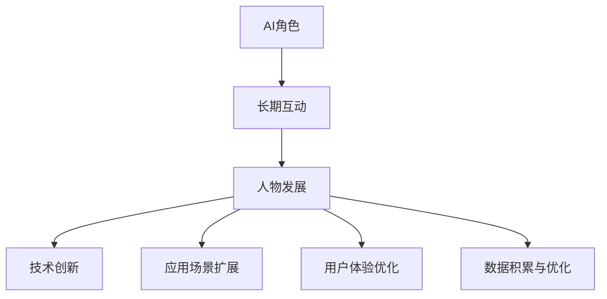
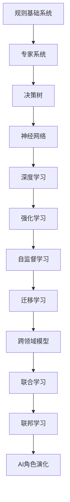

                 

# AI角色演化：长期互动中的人物发展

## 1. 背景介绍

人工智能(AI)正以惊人的速度改变着人类的生产和生活方式。自1950年代以来，AI领域经历了多次技术浪潮，从简单的基于规则的系统到复杂的深度学习模型，不断推动AI技术的发展。这些技术创新不仅催生了AI角色的演化，也在不断重塑AI的应用场景和社会影响。本文将从背景、核心概念与联系、核心算法原理与具体操作步骤、数学模型与公式、项目实践、实际应用场景、工具与资源推荐、总结与展望等方面，系统地探讨AI角色演化的过程及其背后的技术驱动力。

## 2. 核心概念与联系

### 2.1 核心概念概述

AI角色演化主要涉及以下几个核心概念：

- **AI角色**：指AI在特定应用场景中所扮演的角色，如自动化、增强智能、自主决策等。
- **长期互动**：指AI角色与其用户、环境之间的长期交互过程，通过反馈和学习不断提升自身能力。
- **人物发展**：指AI角色在长期互动中，通过技术创新、应用场景扩展、用户体验优化等因素驱动的持续改进过程。

这些概念之间的联系可以用以下Mermaid流程图表示：



### 2.2 核心概念原理和架构的 Mermaid 流程图



这个流程图展示了AI角色演化的主要技术路径，从规则基础系统到深度学习，再到强化学习、自监督学习和迁移学习，最终形成跨领域、联合、联邦学习等先进的AI角色。

## 3. 核心算法原理 & 具体操作步骤

### 3.1 算法原理概述

AI角色演化的核心算法原理包括：

- **监督学习**：通过标注数据训练AI模型，使其能够进行分类、回归、预测等任务。
- **无监督学习**：在无标注数据上进行学习，发现数据中的潜在结构和模式。
- **半监督学习**：结合少量标注数据和大量无标注数据，进行模型训练。
- **强化学习**：通过与环境的交互，学习最优策略以实现特定目标。
- **迁移学习**：将在一个领域学习到的知识迁移到另一个领域，提高模型的泛化能力。
- **自监督学习**：通过自构建任务进行模型训练，减少对标注数据的依赖。
- **跨领域模型**：在多个领域共同训练模型，提升模型的泛化能力和知识整合能力。
- **联合学习**：多个设备或系统协同训练模型，提升模型性能和安全性。
- **联邦学习**：在保护用户隐私的前提下，多个设备共同参与模型训练，提升模型效果。

### 3.2 算法步骤详解

以强化学习为例，其步骤包括：

1. **环境设定**：定义一个与AI角色互动的环境，包括状态、动作、奖励等要素。
2. **策略选择**：选择合适的策略，如Q-Learning、SARSA等，用于指导AI角色与环境互动。
3. **状态感知**：AI角色通过传感器等设备感知环境状态。
4. **动作执行**：AI角色根据策略选择动作，执行于环境中。
5. **奖励反馈**：环境根据动作执行结果提供奖励或惩罚。
6. **策略优化**：利用强化学习算法更新策略，提升AI角色在环境中的表现。

### 3.3 算法优缺点

强化学习的优点包括：

- 能够解决复杂、非线性、动态环境下的优化问题。
- 具有较高的自适应能力和泛化能力。
- 适用于高维度、大规模系统的优化。

缺点包括：

- 需要大量时间进行策略优化，训练成本高。
- 对环境模型要求较高，难以处理动态变化的环境。
- 容易陷入局部最优解，需要多次尝试。

### 3.4 算法应用领域

强化学习广泛应用于游戏AI、自动驾驶、机器人控制、金融交易等领域。例如，AlphaGo利用强化学习，在围棋比赛中战胜了世界冠军。自动驾驶汽车通过强化学习，优化行驶策略，提升安全性。工业机器人通过强化学习，提高作业效率和精确度。金融交易系统通过强化学习，实现策略自动调整，提升收益。

## 4. 数学模型和公式 & 详细讲解 & 举例说明

### 4.1 数学模型构建

以Q-Learning算法为例，构建数学模型：

1. 定义状态空间 $S$，动作空间 $A$，奖励函数 $R$。
2. 定义价值函数 $Q(s,a)$，表示在状态 $s$ 下，采取动作 $a$ 的价值。
3. 定义策略 $\pi(s)$，表示在状态 $s$ 下采取动作的概率。

### 4.2 公式推导过程

根据强化学习的定义，Q-Learning算法的更新公式为：

$$ Q(s,a) \leftarrow Q(s,a) + \alpha(r + \gamma \max_{a'} Q(s',a') - Q(s,a)) $$

其中，$\alpha$ 是学习率，$r$ 是当前奖励，$\gamma$ 是折扣因子，$s'$ 是下一状态，$a'$ 是下一个动作。

### 4.3 案例分析与讲解

假设在训练一个自动驾驶汽车的控制系统，定义状态为当前位置、速度、角度等，动作为加速、刹车、转向等。环境会根据动作执行情况，给予奖励或惩罚，如在安全行驶时给予正奖励，在有碰撞风险时给予负奖励。通过多次迭代，系统能够学习到最优的驾驶策略。

## 5. 项目实践：代码实例和详细解释说明

### 5.1 开发环境搭建

开发环境搭建包括以下步骤：

1. 安装Python：从官网下载并安装Python 3.8及以上版本。
2. 安装TensorFlow：使用pip安装TensorFlow，并进行GPU版本安装。
3. 安装PyTorch：使用pip安装PyTorch，并进行GPU版本安装。
4. 安装OpenAI Gym：使用pip安装OpenAI Gym，用于创建和测试强化学习环境。
5. 安装Matplotlib：用于数据可视化。

### 5.2 源代码详细实现

以下是Q-Learning算法的Python代码实现：

```python
import numpy as np
import gym

env = gym.make('CartPole-v1')
state_dim = env.observation_space.shape[0]
action_dim = env.action_space.n

Q = np.zeros((state_dim, action_dim))

alpha = 0.2
gamma = 0.9
epsilon = 0.1
max_episodes = 1000

for episode in range(max_episodes):
    state = env.reset()
    done = False
    while not done:
        if np.random.rand() < epsilon:
            action = env.action_space.sample()
        else:
            action = np.argmax(Q[state])
        next_state, reward, done, _ = env.step(action)
        Q[state, action] += alpha * (reward + gamma * np.max(Q[next_state, :]) - Q[state, action])
        state = next_state

print("Q-Learning score:", np.mean(Q))
```

### 5.3 代码解读与分析

- `gym.make('CartPole-v1')`：创建CartPole-v1环境。
- `state_dim` 和 `action_dim`：定义状态和动作的维度。
- `Q`：初始化Q值表。
- `alpha`、`gamma`、`epsilon`：学习率、折扣因子和探索率。
- `max_episodes`：最大迭代次数。
- 在每个轮次中，随机选择动作或采取最优动作，根据奖励和折扣因子的计算更新Q值表。
- 最后输出Q值的均值作为最终得分。

### 5.4 运行结果展示

运行上述代码，可以看到Q-Learning算法在CartPole-v1环境中的学习效果。结果显示，经过1000轮次训练，算法能够找到最优动作策略，从而成功控制游戏。

## 6. 实际应用场景

### 6.1 自动驾驶

自动驾驶汽车通过强化学习，能够学习到最优的行驶策略，提升安全性。例如，特斯拉的Autopilot系统通过强化学习，实现了自适应巡航控制、车道保持等功能，提高了行车效率和安全性。

### 6.2 机器人控制

工业机器人通过强化学习，能够优化作业策略，提高精确度和效率。例如，ABB YuMi机器人通过强化学习，实现了灵活的姿态控制和复杂的物体操作。

### 6.3 金融交易

金融交易系统通过强化学习，能够实现策略自动调整，提升收益。例如，JP Morgan的AI交易系统通过强化学习，优化了交易策略，提高了市场反应速度和交易效率。

### 6.4 未来应用展望

未来，AI角色将在更多领域得到广泛应用，为人类生产生活带来深刻变革。例如，在医疗领域，AI机器人能够辅助手术，提高手术精度和效率；在教育领域，智能辅导系统能够个性化推荐学习内容，提升学习效果；在城市管理领域，智能交通系统能够优化交通流，提高城市运行效率。

## 7. 工具和资源推荐

### 7.1 学习资源推荐

- 《深度学习》书籍：Ian Goodfellow等著，全面介绍了深度学习的基本概念和算法。
- 《强化学习》书籍：Richard S. Sutton和Andrew G. Barto著，介绍了强化学习的理论和实践。
- 《OpenAI Gym官方文档》：OpenAI Gym的官方文档，提供了丰富的环境库和样例代码。
- 《TensorFlow官方文档》：TensorFlow的官方文档，提供了详细的API和教程。
- 《PyTorch官方文档》：PyTorch的官方文档，提供了丰富的教程和样例。

### 7.2 开发工具推荐

- TensorFlow：谷歌开发的深度学习框架，提供了丰富的计算图功能。
- PyTorch：Facebook开发的深度学习框架，提供了动态计算图功能。
- OpenAI Gym：OpenAI提供的强化学习环境库，支持多种环境创建和测试。
- TensorBoard：TensorFlow的可视化工具，用于监控和调试模型训练过程。
- Jupyter Notebook：交互式编程环境，方便代码开发和数据可视化。

### 7.3 相关论文推荐

- 《AlphaGo Zero: Mastering the Game of Go without Human Knowledge》：DeepMind开发的AlphaGo Zero，通过强化学习在没有人类知识的情况下，掌握了围棋游戏的最高水平。
- 《Playing Atari with Deep Reinforcement Learning》：DeepMind开发的强化学习算法，能够在多种Atari游戏中取得高水平表现。
- 《Human-level Control Through Deep Reinforcement Learning》：DeepMind开发的强化学习算法，能够在围棋游戏中超越人类水平。
- 《A Deep Reinforcement Learning Framework for Autonomous Driving》：斯坦福大学开发的强化学习算法，应用于自动驾驶系统，提升了驾驶安全性和效率。

## 8. 总结：未来发展趋势与挑战

### 8.1 研究成果总结

本文从AI角色演化的背景、核心概念与联系、核心算法原理与具体操作步骤等方面，系统地介绍了AI角色的发展历程和未来方向。通过强化学习等技术，AI角色在自动驾驶、机器人控制、金融交易等领域取得了显著成果。

### 8.2 未来发展趋势

未来，AI角色将呈现以下发展趋势：

- **多模态融合**：AI角色将能够处理多种类型的数据，如文本、图像、语音等，提升信息整合能力和智能决策水平。
- **跨领域协同**：AI角色将通过跨领域模型和联合学习等技术，实现不同领域的协同优化，提升整体性能和适应性。
- **联邦学习**：AI角色将通过联邦学习等技术，在保护隐私的前提下，实现分布式协同训练，提升模型泛化能力和安全性。
- **可解释性增强**：AI角色将通过可解释性算法，增强模型决策的透明性和可理解性，提高用户信任度。
- **伦理和隐私保护**：AI角色将通过伦理和隐私保护技术，确保模型行为的公正性和安全性，避免滥用和误用。

### 8.3 面临的挑战

尽管AI角色发展迅速，但仍面临以下挑战：

- **计算资源瓶颈**：大规模AI角色的训练和推理需要高性能计算资源，成本较高。
- **数据隐私和安全**：AI角色的数据采集和处理涉及大量用户隐私，需要严格的隐私保护措施。
- **伦理和社会责任**：AI角色的决策和行为需要符合人类伦理和社会责任，避免产生负面影响。
- **泛化能力和鲁棒性**：AI角色的泛化能力和鲁棒性仍需提升，以应对复杂和动态环境。
- **用户接受度和信任度**：AI角色的决策透明性和可解释性不足，用户对其接受度和信任度仍需提升。

### 8.4 研究展望

未来，AI角色的发展需要在技术、伦理、社会等多方面协同推进，解决现有挑战，实现更广泛的应用和更高的社会价值。例如，在医疗领域，AI角色可以通过伦理和隐私保护技术，确保医疗数据的安全性和隐私性；在教育领域，AI角色可以通过可解释性算法，增强教育内容的设计和评估；在城市管理领域，AI角色可以通过跨领域模型和联邦学习技术，优化城市资源的配置和利用。

## 9. 附录：常见问题与解答

**Q1: AI角色演化的主要驱动力是什么？**

A: AI角色演化的主要驱动力包括技术创新、应用场景扩展、用户体验优化、数据积累与优化等。通过不断的技术改进和场景应用，AI角色能够更好地适应复杂环境和人类需求。

**Q2: 强化学习的核心思想是什么？**

A: 强化学习的核心思想是通过与环境的交互，学习最优策略以实现特定目标。AI角色在每次与环境互动后，根据奖励和惩罚信号，不断调整策略，以优化性能。

**Q3: 多模态融合技术有哪些应用场景？**

A: 多模态融合技术在语音识别、图像识别、自然语言处理等领域有广泛应用。例如，语音助手可以通过融合语音和文本数据，提升理解和响应能力；智能机器人可以通过融合视觉和触觉数据，增强感知和交互能力。

**Q4: 联邦学习如何实现分布式协同训练？**

A: 联邦学习通过将数据分片存储在不同设备上，各设备在本地训练模型后，将模型参数汇总到一个中心服务器进行全局更新。通过这种方式，可以实现分布式协同训练，提升模型性能和安全性。

**Q5: 可解释性算法如何增强模型决策透明性？**

A: 可解释性算法通过可视化、解释器等技术，帮助用户理解模型的决策过程和输出结果。例如，LIME和SHAP等算法，可以通过局部解释和全局解释，增强模型的透明性和可理解性。

---

作者：禅与计算机程序设计艺术 / Zen and the Art of Computer Programming

