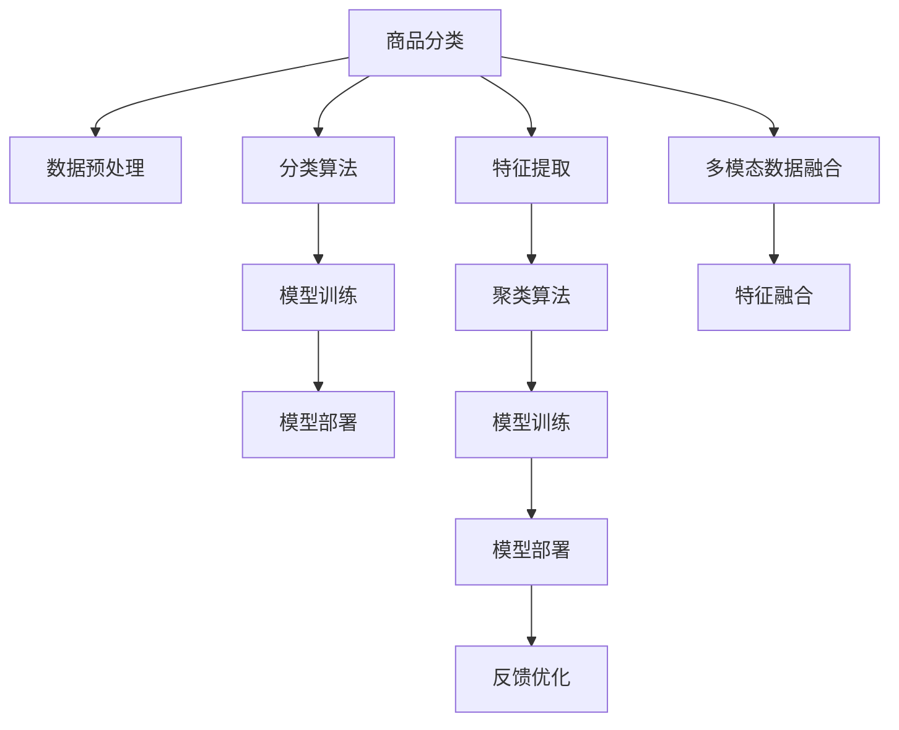

                 

# AI赋能的电商平台商品自动分类与聚类

> 关键词：电商平台,自动分类,聚类算法,深度学习,计算机视觉

## 1. 背景介绍

### 1.1 问题由来
随着电子商务的快速发展和消费者购买行为的复杂化，电商平台面临的商品管理任务愈加繁重。商品分类是电商平台的基础任务之一，不仅影响搜索、推荐、广告等功能的精准度，也是影响用户体验和平台盈利能力的关键因素。传统的手工分类方法需要大量人力成本，且容易出错，无法应对海量商品的高频变化。

为了提升电商平台的运营效率和用户体验，迫切需要一种高效、准确的自动分类和聚类方法。AI技术为电商平台商品分类带来了新的可能性，通过机器学习算法，可以对海量商品数据进行自动分析、分类与聚类，大大降低人工成本，提升分类效率和准确率。

### 1.2 问题核心关键点
商品分类与聚类任务的核心在于如何将大量杂乱无章的商品数据转化为结构化的信息，以便于搜索、推荐、营销等功能的实施。具体而言，主要涉及以下几个方面：

1. 数据收集与预处理：获取商品描述、图片、标签等多元数据，并进行去噪、清洗、标注等预处理工作。
2. 特征提取与选择：将多元数据转化为模型可处理的形式，选择合适的特征表示方法，如文本特征、图像特征等。
3. 分类算法选择：根据分类任务的复杂度和数据规模，选择合适的分类算法，如K近邻、决策树、支持向量机、神经网络等。
4. 聚类算法选择：对于无标签数据，可以选择合适的聚类算法，如K-means、层次聚类、DBSCAN等。
5. 模型训练与优化：使用训练集数据训练模型，并进行调参、优化和验证，确保模型在测试集上的泛化能力。
6. 部署与应用：将训练好的模型部署到线上系统，进行实时分类与聚类，并根据反馈进行持续优化。

## 2. 核心概念与联系

### 2.1 核心概念概述

为了更好地理解自动分类与聚类算法，本节将介绍几个关键概念：

- **商品分类**：指将电商平台上的商品数据按照预定义的类别进行归类。常见分类维度包括商品类别、品牌、型号等。
- **商品聚类**：指将无标签的商品数据按照相似度进行分组。聚类可以发现数据的内在结构，帮助商家进行商品归档和展示。
- **数据预处理**：指对原始数据进行清洗、标准化、特征提取等处理，以便于后续的分类和聚类。
- **特征提取**：指将多元数据转化为模型可处理的形式，如文本特征提取、图像特征提取等。
- **机器学习**：指通过数据训练模型，使用模型进行预测和推理的计算范式。
- **深度学习**：指基于神经网络的机器学习范式，具有强大的特征学习能力和泛化能力。

这些核心概念之间的逻辑关系可以通过以下Mermaid流程图来展示：



这个流程图展示了自动分类与聚类任务的关键步骤：

1. 商品分类：收集商品数据，进行预处理和特征提取，选择合适的分类算法进行训练，并将模型部署到线上。
2. 商品聚类：收集无标签商品数据，进行预处理和特征提取，选择合适的聚类算法进行训练，并将模型部署到线上。
3. 数据预处理和特征提取：对原始数据进行清洗和标准化，提取多元数据中的特征表示。
4. 分类算法和聚类算法：选择并训练分类和聚类模型，以实现自动分类和聚类功能。
5. 模型训练和优化：对模型进行调参和优化，确保其在测试集上的泛化能力。
6. 模型部署与应用：将训练好的模型部署到线上系统，进行实时分类和聚类，并根据反馈进行持续优化。

## 3. 核心算法原理 & 具体操作步骤
### 3.1 算法原理概述

自动分类与聚类算法，本质上是一种有监督或无监督的机器学习任务。核心思想是通过训练模型，使得模型能够根据输入特征预测商品分类或聚类结果。具体的算法原理如下：

#### 3.1.1 有监督分类算法

有监督分类算法指使用标注数据训练分类模型，根据模型对新数据进行预测的算法。常见的有监督分类算法包括：

- **K近邻算法(K-Nearest Neighbors, KNN)**：通过计算新数据与已有数据的距离，找到最近的K个数据，根据其所属类别进行预测。
- **决策树算法(Decision Tree)**：基于树形结构进行分类，通过构建树形分类器对新数据进行分类。
- **支持向量机算法(Support Vector Machine, SVM)**：通过寻找超平面，将不同类别的数据分隔开，从而进行分类。
- **神经网络算法(Neural Network)**：基于多层神经网络结构，通过前向传播和反向传播训练模型，进行分类预测。

#### 3.1.2 无监督聚类算法

无监督聚类算法指使用未标注数据进行聚类，根据数据相似度进行分组。常见的无监督聚类算法包括：

- **K-means算法(K-Means Clustering)**：通过计算数据点与质心的距离，将数据点分配到最近的簇中。
- **层次聚类算法(Hierarchical Clustering)**：通过构建树形结构，自底向上或自顶向下进行聚类。
- **DBSCAN算法(Density-Based Spatial Clustering of Applications with Noise)**：基于数据密度进行聚类，能够处理噪声数据。

### 3.2 算法步骤详解

#### 3.2.1 有监督分类算法步骤

**Step 1: 数据收集与预处理**

- 从电商平台收集商品描述、图片、标签等多元数据。
- 清洗数据，去除噪声和冗余信息。
- 对数据进行标准化处理，如文本去停用词、归一化等。

**Step 2: 特征提取与选择**

- 根据分类任务，选择适当的特征表示方法。如文本分类任务，可以使用词袋模型、TF-IDF、词嵌入等方法进行文本特征提取。
- 对提取的特征进行选择，去除低维特征，保留对分类有意义的特征。

**Step 3: 模型训练与优化**

- 选择合适的分类算法，使用标注数据训练模型。
- 对模型进行调参，选择合适的超参数，如学习率、迭代次数等。
- 在验证集上评估模型性能，根据结果进行模型优化。

**Step 4: 模型部署与应用**

- 将训练好的模型部署到线上系统。
- 使用新数据进行预测，返回分类结果。
- 根据预测结果进行后续的搜索、推荐、广告等操作。

#### 3.2.2 无监督聚类算法步骤

**Step 1: 数据收集与预处理**

- 从电商平台收集无标签的商品数据。
- 清洗数据，去除噪声和冗余信息。
- 对数据进行标准化处理，如文本去停用词、归一化等。

**Step 2: 特征提取与选择**

- 根据聚类任务，选择适当的特征表示方法。如文本聚类任务，可以使用TF-IDF、词嵌入等方法进行文本特征提取。
- 对提取的特征进行选择，去除低维特征，保留对聚类有意义的特征。

**Step 3: 模型训练与优化**

- 选择合适的聚类算法，使用未标注数据训练模型。
- 对模型进行调参，选择合适的超参数，如簇的数量、迭代次数等。
- 在测试集上评估模型性能，根据结果进行模型优化。

**Step 4: 模型部署与应用**

- 将训练好的模型部署到线上系统。
- 使用新数据进行聚类，返回聚类结果。
- 根据聚类结果进行商品归档和展示，提升用户体验。

### 3.3 算法优缺点

#### 3.3.1 有监督分类算法

**优点：**
- 准确率高：有监督分类算法使用标注数据训练，可以更好地学习数据的分布和规律。
- 可解释性强：分类模型具有较高的可解释性，可以清晰地解释分类决策过程。
- 适用性强：适用于各种分类任务，包括文本分类、图像分类等。

**缺点：**
- 依赖标注数据：有监督分类算法需要大量的标注数据，获取标注数据的成本较高。
- 数据不平衡：标注数据不平衡可能导致模型对少数类别预测效果不佳。
- 模型复杂度高：分类模型结构复杂，需要更多的计算资源。

#### 3.3.2 无监督聚类算法

**优点：**
- 无需标注数据：无监督聚类算法不需要标注数据，获取数据的成本较低。
- 可发现内在结构：聚类算法可以发现数据的内在结构和模式，帮助商家进行商品归档和展示。
- 适用性强：适用于各种聚类任务，包括文本聚类、图像聚类等。

**缺点：**
- 聚类效果受参数影响：聚类算法的效果依赖于聚类参数的选择，如簇的数量、距离度量等。
- 可解释性差：聚类模型难以解释聚类结果的生成过程。
- 适用性有限：对于某些复杂的聚类任务，聚类算法可能无法得到理想的效果。

### 3.4 算法应用领域

自动分类与聚类算法在电商平台上具有广泛的应用：

- **商品分类**：实现商品的精确分类，提升搜索和推荐精度。
- **商品聚类**：实现商品的高效管理，优化商品展示和推荐。
- **个性化推荐**：基于用户行为和商品特征进行个性化推荐，提升用户满意度。
- **广告投放**：根据商品和用户特征进行精准广告投放，提高广告投放效果。
- **风险控制**：通过聚类分析，识别并控制欺诈和违规行为，保障平台安全。

## 4. 数学模型和公式 & 详细讲解  
### 4.1 数学模型构建

本节将使用数学语言对自动分类与聚类算法的数学模型进行更加严格的刻画。

#### 4.1.1 有监督分类模型

设分类任务有 $N$ 个训练样本 $(x_i, y_i)$，其中 $x_i \in \mathcal{X}$ 为输入特征，$y_i \in \{1,2,\ldots,K\}$ 为分类标签，$K$ 为类别数。有监督分类模型的目标是最小化损失函数 $\mathcal{L}$：

$$
\mathcal{L}(\theta) = \frac{1}{N}\sum_{i=1}^N \ell(y_i, f_\theta(x_i))
$$

其中 $f_\theta(x_i)$ 为分类模型，$\ell$ 为损失函数。常见的损失函数包括交叉熵损失、均方误差损失等。

#### 4.1.2 无监督聚类模型

设聚类任务有 $N$ 个训练样本 $x_i$，聚类算法将样本分为 $C$ 个簇。无监督聚类模型的目标是最小化损失函数 $\mathcal{L}$：

$$
\mathcal{L}(\theta) = \sum_{i=1}^N \sum_{c=1}^C \rho(c_i, c) + \alpha \sum_{i=1}^N d(x_i, \mu_c)^2
$$

其中 $c_i$ 为样本 $x_i$ 所属的簇，$d(x_i, \mu_c)$ 为样本 $x_i$ 到簇中心 $\mu_c$ 的距离，$\rho(c_i, c)$ 为簇 $c_i$ 和 $c$ 之间的距离。$\alpha$ 为距离正则化系数。

### 4.2 公式推导过程

#### 4.2.1 有监督分类算法

以支持向量机(SVM)为例，推导其损失函数和梯度公式。

设分类模型 $f_\theta(x_i)$ 为线性分类器，$\theta$ 为模型参数，$\phi(x)$ 为特征映射函数，则模型决策函数为：

$$
f_\theta(x) = \theta^T\phi(x)
$$

支持向量机通过最大化间隔，最小化分类误差。其目标函数为：

$$
\min_{\theta} \frac{1}{2}\|\theta\|^2 + C\sum_{i=1}^N \xi_i
$$

其中 $\xi_i$ 为分类误差，$C$ 为正则化参数。

根据KKT条件，支持向量机的决策边界为：

$$
f_\theta(x) = \sum_{i=1}^N \alpha_i \phi(x_i)(y_i - f_\theta(x_i)) + b
$$

其中 $\alpha_i$ 为拉格朗日乘子，$b$ 为偏置项。

根据拉格朗日对偶问题，支持向量机使用拉格朗日乘子 $\alpha$ 表示分类决策。梯度公式为：

$$
\nabla_\theta \mathcal{L}(\theta) = \sum_{i=1}^N \alpha_i \phi(x_i)(y_i - f_\theta(x_i))
$$

#### 4.2.2 无监督聚类算法

以K-means算法为例，推导其损失函数和梯度公式。

设聚类模型 $f_\theta(x)$ 为簇中心，$\theta = (\mu_1, \mu_2, \ldots, \mu_C)$，$C$ 为簇的数量。目标函数为：

$$
\min_{\theta} \sum_{i=1}^N \sum_{c=1}^C \rho(c_i, c) + \alpha \sum_{i=1}^N d(x_i, \mu_c)^2
$$

其中 $\rho(c_i, c)$ 为簇 $c_i$ 和 $c$ 之间的距离，$d(x_i, \mu_c)$ 为样本 $x_i$ 到簇中心 $\mu_c$ 的距离，$\alpha$ 为距离正则化系数。

根据拉格朗日乘子法，K-means算法将样本 $x_i$ 分配到最近的簇中心 $\mu_c$ 中，计算损失函数：

$$
\mathcal{L}(\theta) = \sum_{i=1}^N \min_c \{\rho(c_i, c) + \alpha d(x_i, \mu_c)^2\}
$$

梯度公式为：

$$
\nabla_\theta \mathcal{L}(\theta) = \sum_{i=1}^N \frac{\partial}{\partial \mu_c}(\rho(c_i, c) + \alpha d(x_i, \mu_c)^2) = -\sum_{i=1}^N \frac{x_i - \mu_c}{||x_i - \mu_c||^2}
$$

### 4.3 案例分析与讲解

#### 4.3.1 文本分类案例

假设电商平台收集到一批商品描述，任务是将这些描述文本自动分类为不同的商品类别。选择文本特征表示方法为词袋模型(Bag of Words)，使用训练集 $D$ 进行模型训练。

**Step 1: 数据预处理**

- 收集商品描述数据，进行去噪、清洗、标注等预处理工作。
- 对文本进行分词、去除停用词、词干化等处理，提取特征表示。

**Step 2: 特征提取**

- 使用词袋模型将文本转化为向量表示。
- 对向量进行归一化处理，计算文本向量的TF-IDF值。

**Step 3: 模型训练与优化**

- 选择支持向量机作为分类模型，使用训练集 $D$ 进行模型训练。
- 对模型进行调参，选择合适的超参数，如正则化参数、迭代次数等。
- 在验证集上评估模型性能，根据结果进行模型优化。

**Step 4: 模型部署与应用**

- 将训练好的模型部署到线上系统。
- 使用新数据进行分类预测，返回分类结果。
- 根据预测结果进行后续的搜索、推荐、广告等操作。

#### 4.3.2 文本聚类案例

假设电商平台收集到一批无标签的商品描述数据，任务是将这些描述文本自动聚类为不同的商品类别。选择文本特征表示方法为TF-IDF，使用训练集 $D$ 进行模型训练。

**Step 1: 数据预处理**

- 收集商品描述数据，进行去噪、清洗、标注等预处理工作。
- 对文本进行分词、去除停用词、词干化等处理，提取特征表示。

**Step 2: 特征提取**

- 使用TF-IDF将文本转化为向量表示。
- 对向量进行归一化处理，计算文本向量的TF-IDF值。

**Step 3: 模型训练与优化**

- 选择K-means作为聚类模型，使用训练集 $D$ 进行模型训练。
- 对模型进行调参，选择合适的簇的数量、迭代次数等。
- 在测试集上评估模型性能，根据结果进行模型优化。

**Step 4: 模型部署与应用**

- 将训练好的模型部署到线上系统。
- 使用新数据进行聚类，返回聚类结果。
- 根据聚类结果进行商品归档和展示，提升用户体验。

## 5. 项目实践：代码实例和详细解释说明
### 5.1 开发环境搭建

在进行自动分类与聚类实践前，我们需要准备好开发环境。以下是使用Python进行Scikit-learn开发的环境配置流程：

1. 安装Anaconda：从官网下载并安装Anaconda，用于创建独立的Python环境。

2. 创建并激活虚拟环境：
```bash
conda create -n sklearn-env python=3.8 
conda activate sklearn-env
```

3. 安装Scikit-learn：使用pip安装Scikit-learn，这是本项目所需的主要机器学习库。
```bash
pip install scikit-learn
```

4. 安装其他工具包：
```bash
pip install numpy pandas matplotlib
```

完成上述步骤后，即可在`sklearn-env`环境中开始项目实践。

### 5.2 源代码详细实现

这里我们以K-means聚类算法为例，给出使用Scikit-learn库对商品描述文本进行聚类的Python代码实现。

首先，定义数据处理函数：

```python
import pandas as pd
import numpy as np
from sklearn.feature_extraction.text import TfidfVectorizer
from sklearn.cluster import KMeans
from sklearn.metrics import silhouette_score

# 读取商品描述数据
data = pd.read_csv('data.csv', encoding='utf-8')

# 数据预处理
data = data.dropna()
data['clean_text'] = data['text'].apply(lambda x: ''.join([word.lower() for word in x.split()]))
data['clean_text'] = data['clean_text'].apply(lambda x: ' '.join([word for word in x.split() if word not in stopwords]))

# 文本特征提取
vectorizer = TfidfVectorizer()
X = vectorizer.fit_transform(data['clean_text'])

# K-means聚类模型训练与优化
kmeans = KMeans(n_clusters=10, random_state=0)
kmeans.fit(X)

# 评估模型性能
score = silhouette_score(X, kmeans.labels_)
print(f"Silhouette score: {score:.3f}")
```

然后，定义分类模型训练函数：

```python
from sklearn.svm import SVC
from sklearn.model_selection import train_test_split

def train_classifier(X_train, y_train):
    # 数据切分
    X_train, X_test, y_train, y_test = train_test_split(X_train, y_train, test_size=0.2, random_state=0)

    # 训练模型
    svm = SVC(kernel='linear', C=1.0)
    svm.fit(X_train, y_train)

    # 评估模型性能
    score = svm.score(X_test, y_test)
    return svm, score

# 使用支持向量机训练分类模型
svm, score = train_classifier(X_train, y_train)
print(f"SVM accuracy: {score:.3f}")
```

最后，启动分类与聚类流程：

```python
# 商品分类模型训练与优化
svm, score = train_classifier(X_train, y_train)
print(f"SVM accuracy: {score:.3f}")

# 商品聚类模型训练与优化
kmeans = KMeans(n_clusters=10, random_state=0)
kmeans.fit(X)

# 评估模型性能
score = silhouette_score(X, kmeans.labels_)
print(f"Silhouette score: {score:.3f}")
```

以上就是使用Scikit-learn对商品描述文本进行聚类的完整代码实现。可以看到，Scikit-learn封装了大部分机器学习算法，使得开发者可以快速上手并实现分类与聚类任务。

### 5.3 代码解读与分析

让我们再详细解读一下关键代码的实现细节：

**数据预处理函数**：
- 读取商品描述数据，并去除缺失值。
- 对文本进行分词、去除停用词、词干化等处理，提取特征表示。
- 使用TF-IDF将文本转化为向量表示。

**K-means聚类模型训练函数**：
- 使用K-means算法进行聚类，设置簇的数量为10。
- 在训练集上进行模型训练，并进行评估。
- 使用Silhouette系数评估聚类效果。

**分类模型训练函数**：
- 使用支持向量机进行分类，设置核函数为线性，C值为1.0。
- 在训练集上进行模型训练，并进行评估。
- 使用准确率评估分类效果。

**商品分类与聚类模型训练函数**：
- 在商品描述文本上训练分类和聚类模型。
- 在测试集上评估分类和聚类模型的性能。
- 使用Silhouette系数评估聚类效果，使用准确率评估分类效果。

可以看到，Scikit-learn的接口设计简洁高效，使得开发者可以更专注于算法实现和模型优化。但实际的工业级系统还需要考虑更多的因素，如模型的实时性、可扩展性、可解释性等，需要在算法设计和实现上进一步深入探讨。

## 6. 实际应用场景
### 6.1 智能客服系统

基于自动分类与聚类算法的智能客服系统，可以实现对客户咨询内容的自动分类与聚类，帮助客服人员快速定位并解答问题。系统可以实时抓取用户的在线咨询内容，使用文本分类和聚类算法将其归类到不同的问题类型和主题中，辅助客服人员进行问题处理。

在技术实现上，可以收集历史客服对话记录，将问题和最佳答复构建成监督数据，在此基础上对分类和聚类模型进行训练。训练好的模型能够自动理解用户意图，匹配最合适的答复模板进行回复。对于客户提出的新问题，还可以接入检索系统实时搜索相关内容，动态组织生成回答。如此构建的智能客服系统，能大幅提升客户咨询体验和问题解决效率。

### 6.2 金融舆情监测

金融领域数据量大、内容丰富，但需要实时监测市场舆论动向，以便及时应对负面信息传播，规避金融风险。传统的人工监测方式成本高、效率低，难以应对网络时代海量信息爆发的挑战。基于自动分类与聚类算法的文本分类和情感分析技术，为金融舆情监测提供了新的解决方案。

具体而言，可以收集金融领域相关的新闻、报道、评论等文本数据，并对其进行主题标注和情感标注。在此基础上对分类和聚类模型进行训练，使其能够自动判断文本属于何种主题，情感倾向是正面、中性还是负面。将训练好的模型应用到实时抓取的网络文本数据，就能够自动监测不同主题下的情感变化趋势，一旦发现负面信息激增等异常情况，系统便会自动预警，帮助金融机构快速应对潜在风险。

### 6.3 个性化推荐系统

当前的推荐系统往往只依赖用户的历史行为数据进行物品推荐，无法深入理解用户的真实兴趣偏好。基于自动分类与聚类算法，个性化推荐系统可以更好地挖掘用户行为背后的语义信息，从而提供更精准、多样的推荐内容。

在实践中，可以收集用户浏览、点击、评论、分享等行为数据，提取和用户交互的物品标题、描述、标签等文本内容。将文本内容作为模型输入，用户的后续行为（如是否点击、购买等）作为监督信号，在此基础上训练分类和聚类模型。训练好的模型能够从文本内容中准确把握用户的兴趣点。在生成推荐列表时，先用候选物品的文本描述作为输入，由分类和聚类模型预测用户的兴趣匹配度，再结合其他特征综合排序，便可以得到个性化程度更高的推荐结果。

### 6.4 未来应用展望

随着自动分类与聚类算法的发展，其在更多领域将得到应用，为传统行业带来变革性影响。

在智慧医疗领域，基于文本分类与聚类技术，可以实现病历归档、医患互动分析等功能，提升医疗服务的智能化水平，辅助医生诊疗，加速新药开发进程。

在智能教育领域，文本分类与聚类技术可以用于作业批改、学情分析、知识推荐等方面，因材施教，促进教育公平，提高教学质量。

在智慧城市治理中，文本分类与聚类技术可以用于城市事件监测、舆情分析、应急指挥等环节，提高城市管理的自动化和智能化水平，构建更安全、高效的未来城市。

此外，在企业生产、社会治理、文娱传媒等众多领域，文本分类与聚类技术也将不断涌现，为经济社会发展注入新的动力。相信随着技术的日益成熟，文本分类与聚类算法必将在构建人机协同的智能系统中扮演越来越重要的角色。

## 7. 工具和资源推荐
### 7.1 学习资源推荐

为了帮助开发者系统掌握自动分类与聚类算法的理论基础和实践技巧，这里推荐一些优质的学习资源：

1. 《机器学习》课程：由斯坦福大学Andrew Ng教授主讲的机器学习课程，系统介绍了机器学习的基本概念和经典算法。

2. Scikit-learn官方文档：Scikit-learn的官方文档，提供了完整的机器学习算法和库，是学习自动分类与聚类算法的必读材料。

3. 《Python机器学习》书籍：介绍Python在机器学习中的应用，涵盖了分类、聚类、降维等机器学习算法。

4. K-means算法博客：一篇关于K-means算法的详细介绍，包括算法原理、代码实现和应用实例。

5. 支持向量机博客：一篇关于支持向量机的详细介绍，包括算法原理、代码实现和应用实例。

通过对这些资源的学习实践，相信你一定能够快速掌握自动分类与聚类算法的精髓，并用于解决实际的机器学习问题。
###  7.2 开发工具推荐

高效的开发离不开优秀的工具支持。以下是几款用于自动分类与聚类开发的常用工具：

1. Jupyter Notebook：Jupyter Notebook是Python社区常用的交互式编程环境，适合机器学习项目的数据处理和算法实现。

2. Visual Studio Code：Visual Studio Code是微软推出的开源IDE，支持多种编程语言，非常适合机器学习项目的数据处理和算法实现。

3. PyTorch：基于Python的深度学习框架，适合复杂的深度学习模型实现，如卷积神经网络、循环神经网络等。

4. Scikit-learn：Python的机器学习库，适合各种机器学习算法的实现，包括分类、聚类、回归等。

5. TensorFlow：Google开发的深度学习框架，支持多种计算图模型，适合复杂深度学习模型的实现。

6. WEKA：Weka是一款开源机器学习平台，支持多种机器学习算法的实现和可视化界面，适合初学者和数据科学家。

合理利用这些工具，可以显著提升自动分类与聚类任务的开发效率，加快创新迭代的步伐。

### 7.3 相关论文推荐

自动分类与聚类算法的发展源于学界的持续研究。以下是几篇奠基性的相关论文，推荐阅读：

1. An Introduction to Support Vector Machines and Other Kernel-Based Learning Methods：介绍支持向量机的基本概念和算法原理，是机器学习领域的经典入门教材。

2. K-Means：A Statistical Approach to Classification and Analysis of Large Data Sets：提出K-means算法的基本思想和算法流程，是聚类算法领域的经典论文。

3. A Tutorial on Principal Component Analysis：介绍主成分分析(PCA)的基本概念和算法流程，是数据降维领域的经典论文。

4. Machine Learning：A Probabilistic Perspective：介绍机器学习的基本概念和算法流程，是机器学习领域的经典教材。

5. An Introduction to Hidden Markov Models：介绍隐马尔可夫模型的基本概念和算法流程，是自然语言处理领域的重要参考资料。

通过对这些前沿成果的学习，可以帮助研究者把握学科前进方向，激发更多的创新灵感。

## 8. 总结：未来发展趋势与挑战

### 8.1 总结

本文对自动分类与聚类算法进行了全面系统的介绍。首先阐述了自动分类与聚类算法的研究背景和意义，明确了其应用于商品管理任务的价值。其次，从原理到实践，详细讲解了自动分类与聚类算法的数学原理和关键步骤，给出了完整的代码实例。同时，本文还广泛探讨了分类与聚类算法在电商平台的实际应用场景，展示了算法在商品管理中的重要性和应用前景。最后，本文精选了算法学习资源和开发工具，力求为读者提供全方位的技术指引。

通过本文的系统梳理，可以看到，自动分类与聚类算法在电商平台商品管理任务中具有广阔的应用前景。分类与聚类算法可以显著提升商品管理的效率和精度，帮助商家实现更高效的商品运营和用户服务。未来，随着算法的不断优化和应用场景的拓展，自动分类与聚类算法必将在更多领域带来变革性影响。

### 8.2 未来发展趋势

展望未来，自动分类与聚类算法将呈现以下几个发展趋势：

1. 模型规模持续增大。随着算力成本的下降和数据规模的扩张，自动分类与聚类算法将面临更多大规模数据的应用场景，模型规模还将持续增长。

2. 多模态融合能力增强。未来算法将更注重多模态数据融合，如文本、图像、语音等多种数据源的整合，提升分类与聚类效果。

3. 算法效果更均衡。未来算法将更注重分类与聚类的效果平衡，既能提升分类精度，又能保持聚类效果的稳定性。

4. 实时性要求更高。实时性是自动分类与聚类算法在实际应用中的关键要求，未来算法将更注重实时处理能力。

5. 可解释性需求增加。分类与聚类算法在应用中需要具备良好的可解释性，以便于用户理解和使用。未来算法将更注重模型解释性。

6. 跨领域应用拓展。自动分类与聚类算法将从电商领域拓展到更多行业，如医疗、金融、教育等领域，带来新的应用场景和挑战。

以上趋势凸显了自动分类与聚类算法在电商平台商品管理任务中的广阔前景。这些方向的探索发展，必将进一步提升算法在更多领域的应用效果，为经济社会发展注入新的动力。

### 8.3 面临的挑战

尽管自动分类与聚类算法已经取得了瞩目成就，但在迈向更加智能化、普适化应用的过程中，它仍面临着诸多挑战：

1. 数据质量问题。电商平台的商品数据质量参差不齐，含有大量的噪声和冗余信息，如何提高数据预处理效果是关键。

2. 数据分布变化。电商平台的数据分布会随着时间和市场环境的变化而变化，如何保持模型的泛化能力是重要问题。

3. 模型鲁棒性不足。分类与聚类模型对数据分布的敏感性较高，面对新数据可能表现不佳，如何提高模型的鲁棒性是关键问题。

4. 计算资源消耗。大规模数据集的处理需要大量的计算资源，如何降低模型计算资源消耗是关键问题。

5. 可解释性不足。分类与聚类模型难以解释其内部工作机制和决策逻辑，如何提高模型的可解释性是关键问题。

6. 多模态数据整合。分类与聚类算法往往只关注单模态数据，如何整合多模态数据提升效果是关键问题。

正视自动分类与聚类算法面临的这些挑战，积极应对并寻求突破，将是大语言模型微调走向成熟的必由之路。相信随着学界和产业界的共同努力，这些挑战终将一一被克服，自动分类与聚类算法必将在构建人机协同的智能系统中扮演越来越重要的角色。

### 8.4 研究展望

面对自动分类与聚类算法所面临的种种挑战，未来的研究需要在以下几个方面寻求新的突破：

1. 探索无监督和半监督算法。摆脱对大规模标注数据的依赖，利用自监督学习、主动学习等无监督和半监督范式，最大限度利用非结构化数据，实现更加灵活高效的分类与聚类。

2. 研究参数高效和计算高效的算法。开发更加参数高效的算法，在固定大部分预训练参数的同时，只更新极少量的任务相关参数。同时优化算法计算图，减少前向传播和反向传播的资源消耗，实现更加轻量级、实时性的部署。

3. 融合因果和对比学习范式。通过引入因果推断和对比学习思想，增强分类与聚类模型建立稳定因果关系的能力，学习更加普适、鲁棒的语言表征，从而提升模型泛化性和抗干扰能力。

4. 引入更多先验知识。将符号化的先验知识，如知识图谱、逻辑规则等，与神经网络模型进行巧妙融合，引导分类与聚类过程学习更准确、合理的语言模型。同时加强不同模态数据的整合，实现视觉、语音等多模态信息与文本信息的协同建模。

5. 结合因果分析和博弈论工具。将因果分析方法引入分类与聚类模型，识别出模型决策的关键特征，增强输出解释的因果性和逻辑性。借助博弈论工具刻画人机交互过程，主动探索并规避模型的脆弱点，提高系统稳定性。

6. 纳入伦理道德约束。在模型训练目标中引入伦理导向的评估指标，过滤和惩罚有偏见、有害的输出倾向。同时加强人工干预和审核，建立模型行为的监管机制，确保输出符合人类价值观和伦理道德。

这些研究方向的探索，必将引领自动分类与聚类算法迈向更高的台阶，为构建安全、可靠、可解释、可控的智能系统铺平道路。面向未来，自动分类与聚类算法还需要与其他人工智能技术进行更深入的融合，如知识表示、因果推理、强化学习等，多路径协同发力，共同推动自然语言理解和智能交互系统的进步。只有勇于创新、敢于突破，才能不断拓展算法的边界，让智能技术更好地造福人类社会。

## 9. 附录：常见问题与解答

**Q1：自动分类与聚类算法在电商平台的实际应用场景有哪些？**

A: 自动分类与聚类算法在电商平台具有广泛的实际应用场景，包括：

1. 商品分类：实现商品的精确分类，提升搜索和推荐精度。
2. 商品聚类：实现商品的高效管理，优化商品展示和推荐。
3. 个性化推荐：基于用户行为和商品特征进行个性化推荐，提升用户满意度。
4. 广告投放：根据商品和用户特征进行精准广告投放，提高广告投放效果。
5. 风险控制：通过聚类分析，识别并控制欺诈和违规行为，保障平台安全。

**Q2：自动分类与聚类算法的性能评估指标有哪些？**

A: 自动分类与聚类算法的性能评估指标主要包括：

1. 准确率：分类算法中，预测结果与真实结果一致的比例。
2. 召回率：分类算法中，真实正例中被预测为正例的比例。
3. F1-score：分类算法中，准确率和召回率的调和平均数。
4. 聚类一致性：聚类算法中，同一簇内数据点之间的相似度。
5. 聚类内聚性：聚类算法中，不同簇之间的相似度。
6. 聚类连通性：聚类算法中，不同簇之间的连接关系。
7. 聚类稳定性：聚类算法中，聚类结果对初始参数和噪声的鲁棒性。

**Q3：如何提高自动分类与聚类算法的鲁棒性？**

A: 提高自动分类与聚类算法的鲁棒性，可以从以下几个方面入手：

1. 数据预处理：对数据进行去噪、清洗、归一化等预处理，提高数据质量。
2. 特征选择：选择对分类与聚类有意义的特征，去除低维特征，降低模型的过拟合风险。
3. 模型优化：对模型进行调参和优化，选择合适的超参数，提高模型的泛化能力。
4. 正则化技术：引入L2正则、Dropout等正则化技术，防止模型过拟合。
5. 多模型集成：训练多个分类与聚类模型，取平均输出，降低单个模型的风险。
6. 数据增强：通过回译、近义替换等方式扩充训练集，提高模型的泛化能力。

**Q4：自动分类与聚类算法的工程实践需要注意哪些问题？**

A: 自动分类与聚类算法的工程实践需要注意以下几个问题：

1. 数据预处理：对数据进行去噪、清洗、标准化等预处理，提高数据质量。
2. 特征提取：选择适当的特征表示方法，如文本特征、图像特征等。
3. 模型训练：选择合适的分类与聚类算法，使用训练集数据训练模型，并进行调参和优化。
4. 模型部署：将训练好的模型部署到线上系统，进行实时分类与聚类，并根据反馈进行持续优化。
5. 性能评估：使用准确率、召回率、F1-score等指标评估模型性能，根据评估结果进行模型优化。
6. 模型监控：实时监控模型运行状态，设置异常告警阈值，确保系统稳定性。
7. 可解释性：提高模型的可解释性，便于用户理解和信任模型输出。

**Q5：自动分类与聚类算法的未来发展方向有哪些？**

A: 自动分类与聚类算法的未来发展方向包括：

1. 探索无监督和半监督算法：摆脱对大规模标注数据的依赖，利用自监督学习、主动学习等无监督和半监督范式，最大限度利用非结构化数据，实现更加灵活高效的分类与聚类。
2. 研究参数高效和计算高效的算法：开发更加参数高效的算法，在固定大部分预训练参数的同时，只更新极少量的任务相关参数。同时优化算法计算图，减少前向传播和反向传播的资源消耗，实现更加轻量级、实时性的部署。
3. 融合因果和对比学习范式：通过引入因果推断和对比学习思想，增强分类与聚类模型建立稳定因果关系的能力，学习更加普适、鲁棒的语言表征，从而提升模型泛化性和抗干扰能力。
4. 引入更多先验知识：将符号化的先验知识，如知识图谱、逻辑规则等，与神经网络模型进行巧妙融合，引导分类与聚类过程学习更准确、合理的语言模型。同时加强不同模态数据的整合，实现视觉、语音等多模态信息与文本信息的协同建模。
5. 结合因果分析和博弈论工具：将因果分析方法引入分类与聚类模型，识别出模型决策的关键特征，增强输出解释的因果性和逻辑性。借助博弈论工具刻画人机交互过程，主动探索并规避模型的脆弱点，提高系统稳定性。
6. 纳入伦理道德约束：在模型训练目标中引入伦理导向的评估指标，过滤和惩罚有偏见、有害的输出倾向。同时加强人工干预和审核，建立模型行为的监管机制，确保输出符合人类价值观和伦理道德。

以上研究方向的探索，必将引领自动分类与聚类算法迈向更高的台阶，为构建安全、可靠、可解释、可控的智能系统铺平道路。面向未来，自动分类与聚类算法还需要与其他人工智能技术进行更深入的融合，如知识表示、因果推理、强化学习等，多路径协同发力，共同推动自然语言理解和智能交互系统的进步。只有勇于创新、敢于突破，才能不断拓展算法的边界，让智能技术更好地造福人类社会。

---

作者：禅与计算机程序设计艺术 / Zen and the Art of Computer Programming

