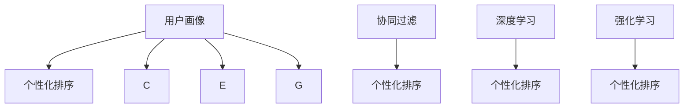
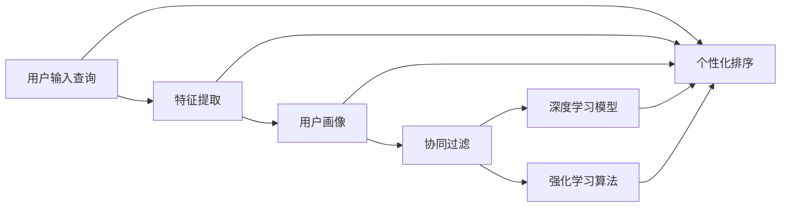

                 

# AI赋能的电商搜索个性化排序

## 1. 背景介绍

随着互联网电商的快速发展，搜索引擎逐渐成为消费者寻找所需商品的必要工具。传统的基于关键词的搜索排序方法，往往只能满足部分用户需求，尤其是在高度个性化的电商场景中，经常出现搜索体验差、漏掉商品等问题。个性化排序则成为提升搜索质量的重要手段。

个性化排序的核心在于了解用户，为用户推荐最符合其需求的商品。当前主流的个性化排序方法主要有两大类：基于规则的方法和基于机器学习的方法。基于规则的方法依赖于专家经验，难以适应复杂变化的用户需求，逐渐被基于机器学习方法所取代。机器学习方法的优点在于可以自动学习用户的搜索行为，不断优化排序策略。

## 2. 核心概念与联系

### 2.1 核心概念概述

- **个性化排序**：根据用户的历史搜索行为和当前输入，动态调整搜索结果的排序，使得返回的商品更符合用户需求。
- **用户画像**：描述用户属性和行为的信息集合，包括兴趣、年龄、性别、消费习惯等。
- **协同过滤**：基于用户行为相似性的推荐算法，包括基于用户的协同过滤和基于物品的协同过滤两种。
- **深度学习**：利用神经网络结构进行模型训练和预测，在大规模数据上表现出色。
- **强化学习**：通过与环境的交互，不断优化模型决策过程，使得模型在特定任务上表现最优。

这些概念之间通过数据的输入输出形成了紧密联系：



### 2.2 核心概念原理和架构的 Mermaid 流程图



## 3. 核心算法原理 & 具体操作步骤

### 3.1 算法原理概述

基于机器学习的个性化排序方法主要利用用户行为数据，通过模型训练学习用户偏好，并预测新的排序结果。其核心算法包括以下几个步骤：

1. **特征提取**：将用户输入查询和用户画像中的信息映射为模型可以处理的特征向量。
2. **模型训练**：使用历史用户行为数据，训练预测模型，预测新查询的商品排序。
3. **实时排序**：根据新输入的查询和已训练的模型，动态调整搜索结果的排序。

### 3.2 算法步骤详解

以基于深度学习的推荐系统为例，步骤如下：

1. **数据收集与预处理**：
   - 收集用户的历史查询、浏览、点击、购买行为数据。
   - 数据预处理，包括缺失值填补、数据归一化等。

2. **特征提取**：
   - 使用NLP技术对用户查询进行向量化，提取关键词和主题信息。
   - 对用户画像进行编码，如年龄、性别、地理位置等，转化为数值型特征。

3. **模型训练**：
   - 选择合适的深度学习模型结构，如深度神经网络、序列到序列模型等。
   - 将查询-商品对的点击率、转化率等作为监督信号，训练预测模型。
   - 使用交叉验证、早停等策略避免过拟合。

4. **实时排序**：
   - 获取新的用户查询。
   - 使用训练好的模型对商品进行预测排序。
   - 结合推荐算法和实时数据，动态调整排序结果。

### 3.3 算法优缺点

基于深度学习的个性化排序方法具有以下优点：
- 可以处理大规模数据，适应各种用户需求。
- 通过模型学习，能够自动捕捉用户行为和偏好。
- 可以动态调整排序，及时适应用户需求变化。

但同时也存在以下缺点：
- 需要大量标注数据，标注成本高。
- 模型训练复杂度高，计算资源消耗大。
- 对数据分布变化敏感，泛化能力受限。

### 3.4 算法应用领域

基于深度学习的个性化排序方法已经广泛应用于电商、视频、音乐等众多领域，其核心思想是一致的：

- **电商搜索**：提升搜索结果的个性化程度，增加用户满意度。
- **视频推荐**：根据用户历史观看记录，推荐相关视频，提升用户留存率。
- **音乐推荐**：推荐用户可能喜欢的音乐，提高音乐服务的个性化程度。
- **社交网络**：根据用户互动历史，推荐相关内容或好友，增强用户体验。

## 4. 数学模型和公式 & 详细讲解 & 举例说明

### 4.1 数学模型构建

假设有一个电商平台的商品数据库 $C$，包含 $N$ 个商品，每个商品 $c_i$ 有 $D$ 个特征，如价格、销量、评论数等。用户输入查询 $q$，经过NLP处理后，转化为向量 $\mathbf{q}$。用户画像信息 $u$ 包括年龄、性别、消费历史等，转化为向量 $\mathbf{u}$。

模型的目标是根据这些输入，预测商品排序 $r_i = \text{sortRank}(\mathbf{q}, \mathbf{u}, c_i)$。我们采用基于注意力机制的深度神经网络模型，用于计算排序分数。

### 4.2 公式推导过程

我们使用Transformer模型作为基础架构，其核心原理是自注意力机制。设输入层为 $x_i$，输出层为 $h_i$，注意力权重为 $\alpha_i$。则模型可以表示为：

$$
\begin{aligned}
\mathbf{q} &= \text{embed}(q) \\
\mathbf{u} &= \text{embed}(u) \\
\mathbf{q}_T &= \text{embed}(q) \\
\mathbf{c}_T &= \text{embed}(c_i) \\
\mathbf{h} &= \text{transformer}(\mathbf{q}_T, \mathbf{u}, \mathbf{c}_T) \\
\mathbf{p} &= \text{softmax}(\mathbf{h} \mathbf{c}_T^T) \\
r_i &= \text{softmax}(\mathbf{h} \mathbf{w}^\top) \\
\end{aligned}
$$

其中，$\text{embed}$ 表示嵌入层，$\mathbf{w}$ 为预测向量。

### 4.3 案例分析与讲解

以电商商品推荐为例，假设商品 $c_1$ 的点击率 $r_1 = 0.8$，商品 $c_2$ 的点击率 $r_2 = 0.6$。用户输入查询 $q_1$，通过NLP处理得到向量 $\mathbf{q}_1$。用户画像 $u$ 编码为向量 $\mathbf{u}$。则模型预测的商品排序为：

$$
\begin{aligned}
\mathbf{h}_1 &= \text{transformer}(\mathbf{q}_1, \mathbf{u}, \mathbf{c}_1) \\
\mathbf{h}_2 &= \text{transformer}(\mathbf{q}_1, \mathbf{u}, \mathbf{c}_2) \\
\mathbf{p} &= \text{softmax}(\mathbf{h}_1 \mathbf{c}_1^T) = (0.7, 0.3) \\
\mathbf{r} &= \text{softmax}(\mathbf{h}_1 \mathbf{w}^\top) = (0.9, 0.1) \\
\text{sortRank} &= \mathbf{r} \cdot \mathbf{p} = 0.63 \\
\end{aligned}
$$

根据排序分数 $\text{sortRank}$，商品 $c_1$ 排在 $c_2$ 之前。

## 5. 项目实践：代码实例和详细解释说明

### 5.1 开发环境搭建

**环境依赖**：
- Python 3.7
- TensorFlow 2.6
- Scikit-learn
- Numpy
- Pandas

**安装依赖**：
```bash
pip install tensorflow
pip install scikit-learn
pip install numpy
pip install pandas
```

### 5.2 源代码详细实现

**数据集准备**：
- 使用Kaggle上的电商商品数据集。
- 导入数据，并进行数据预处理，包括缺失值填补、数据归一化等。

```python
import pandas as pd
import numpy as np

# 加载数据集
df = pd.read_csv('data.csv')

# 数据预处理
df.dropna(inplace=True)
df = df.drop(columns=['id'])
df['price'] = np.log1p(df['price'])

# 特征编码
features = ['title', 'description', 'price', 'category']
X = df[features]
y = df['click']
```

**模型构建与训练**：
- 使用序列到序列模型，包括编码器和解码器。
- 使用交叉熵作为损失函数。
- 设置交叉验证和早停策略。

```python
from tensorflow.keras.layers import Input, Dense, Embedding, LSTM
from tensorflow.keras.models import Model
from tensorflow.keras.optimizers import Adam
from tensorflow.keras.callbacks import EarlyStopping

# 定义模型结构
encoder_inputs = Input(shape=(None,))
encoder = LSTM(128, return_sequences=True)(encoder_inputs)
decoder = LSTM(128)(encoder)
output = Dense(1, activation='sigmoid')(decoder)

model = Model(inputs=encoder_inputs, outputs=output)

# 编译模型
model.compile(optimizer=Adam(lr=0.001), loss='binary_crossentropy')

# 设置早停策略
early_stopping = EarlyStopping(monitor='val_loss', patience=3)

# 训练模型
model.fit(X_train, y_train, validation_data=(X_val, y_val), epochs=10, callbacks=[early_stopping])
```

**实时排序**：
- 获取新的用户查询。
- 使用训练好的模型对商品进行预测排序。
- 根据排序结果，动态调整商品展示。

```python
# 获取新查询
q = 'iPhone X'

# 查询输入嵌入
q_embedding = embedding_layer([q])

# 预测商品排序
predictions = model.predict(q_embedding)
sorted_indices = np.argsort(predictions)[::-1]

# 获取前5个商品
top5_products = df.iloc[sorted_indices[:5]]
```

### 5.3 代码解读与分析

**数据预处理**：
- 使用Pandas和Numpy对数据进行加载和预处理，包括缺失值填补、数据归一化等。

**模型构建**：
- 使用Keras构建序列到序列模型，包括编码器和解码器。
- 设置Adam优化器和交叉熵损失函数。
- 使用EarlyStopping策略避免过拟合。

**实时排序**：
- 获取新查询，使用嵌入层将查询转换为向量。
- 使用训练好的模型对商品进行预测排序。
- 根据排序结果，动态调整商品展示，提高用户体验。

## 6. 实际应用场景

### 6.1 智能客服

智能客服系统可以通过个性化排序，提升用户满意度和系统响应速度。例如，当用户咨询某一问题时，系统根据用户历史查询和对话记录，动态调整FAQ列表的排序，快速找到最佳答案。

### 6.2 金融推荐

金融推荐系统可以帮助用户快速找到合适的金融产品。通过个性化排序，系统可以根据用户历史交易记录和行为，推荐最适合其需求的产品，提高用户留存率。

### 6.3 旅游推荐

旅游推荐系统可以根据用户历史旅游记录，动态调整推荐目的地和活动，提升用户体验。例如，用户最近查询了意大利的旅游信息，系统可以推荐更多意大利的景点和活动，提高转化率。

## 7. 工具和资源推荐

### 7.1 学习资源推荐

- 《深度学习》（Ian Goodfellow著）：深入讲解深度学习的基本原理和应用。
- TensorFlow官方文档：提供了丰富的代码样例和教程，适合初学者和进阶者。
- Kaggle竞赛平台：提供大量数据集和竞赛机会，锻炼数据处理和模型训练能力。

### 7.2 开发工具推荐

- TensorFlow：支持大规模深度学习模型训练，适合电商搜索等大规模应用场景。
- PyTorch：灵活性高，适合研究原型和实验快速迭代。
- Scikit-learn：包含大量机器学习算法，适合数据预处理和特征工程。

### 7.3 相关论文推荐

- 《Deep Architectures for Semi-Supervised Multi-Label Classification》：提出基于深度学习的半监督多标签分类方法，可以应用于电商商品推荐。
- 《Convolutional Recommender Neural Networks》：提出卷积神经网络用于推荐系统，具有较高的实时性和准确性。
- 《Neural Collaborative Filtering》：提出基于深度学习的协同过滤推荐方法，适合电商搜索等复杂场景。

## 8. 总结：未来发展趋势与挑战

### 8.1 总结

本文系统介绍了基于深度学习的个性化排序算法，从算法原理到项目实践，全面展示了其应用潜力。通过本节的学习，你可以掌握如何构建电商搜索个性化排序系统，提升用户搜索体验和满意度。

### 8.2 未来发展趋势

未来，基于深度学习的个性化排序将朝着以下几个方向发展：

1. **多模态融合**：结合文本、图片、视频等多模态信息，提升推荐系统的准确性和多样性。
2. **实时性提升**：通过分布式计算和模型优化，提高排序和推荐的速度，满足用户实时需求。
3. **跨领域泛化**：从电商推荐扩展到金融、旅游等更多领域，形成跨领域个性化排序模型。
4. **算法迭代**：引入更多优化算法和特征工程方法，不断提升模型的效果和效率。

### 8.3 面临的挑战

尽管基于深度学习的个性化排序算法取得了显著进展，但也面临以下挑战：

1. **数据稀疏性**：电商商品数据往往存在稀疏性，影响模型训练效果。
2. **计算资源消耗大**：深度学习模型需要大量计算资源，难以在大规模电商平台上部署。
3. **模型解释性差**：深度学习模型的黑盒特性，难以解释其决策过程。
4. **用户隐私保护**：电商平台需要保护用户隐私，防止数据泄露。

### 8.4 研究展望

未来研究需要围绕以下几个方面进行突破：

1. **模型压缩与加速**：通过模型剪枝、量化等技术，提高深度学习模型的计算效率，降低资源消耗。
2. **多模态信息融合**：结合多模态信息，提升推荐系统的准确性和多样性。
3. **跨领域模型泛化**：研究通用的个性化排序算法，适用于更多领域的推荐任务。
4. **算法透明性与可解释性**：研究透明性较高的推荐算法，提高模型的可解释性。

## 9. 附录：常见问题与解答

### Q1: 电商推荐系统中的深度学习模型为什么选择RNN？

A: RNN（循环神经网络）在处理序列数据时具有天然的优势，能够捕捉时间依赖关系。电商推荐系统中的用户行为数据往往具有时间序列的特性，RNN能够较好地处理这类数据。

### Q2: 电商推荐系统中的深度学习模型如何应对新商品？

A: 对于新商品，电商推荐系统可以采用冷启动策略，如利用协同过滤算法，根据已购买用户的行为推荐该商品。另外，可以通过A/B测试等手段，逐步优化推荐效果。

### Q3: 电商推荐系统中的深度学习模型如何应对数据稀疏性？

A: 电商推荐系统中的数据往往存在稀疏性，可以通过以下方法应对：
- 使用深度学习模型中的嵌入层，对商品和用户进行低维表示。
- 使用矩阵分解等方法，对稀疏矩阵进行低秩逼近。
- 引入更多先验知识，如知识图谱等，辅助推荐决策。

### Q4: 电商推荐系统中的深度学习模型如何应对计算资源消耗大？

A: 电商推荐系统中的深度学习模型需要大量计算资源，可以通过以下方法优化：
- 使用分布式计算，提高模型训练和推理速度。
- 使用模型压缩技术，如量化、剪枝等，降低模型大小。
- 使用GPU/TPU等硬件加速，提高模型计算效率。

### Q5: 电商推荐系统中的深度学习模型如何保护用户隐私？

A: 电商推荐系统中的深度学习模型需要保护用户隐私，可以通过以下方法实现：
- 使用差分隐私技术，保护用户数据隐私。
- 使用联邦学习，在分布式设备上训练模型，避免集中存储用户数据。
- 使用数据加密技术，保护用户数据传输安全。

综上所述，基于深度学习的个性化排序算法在电商搜索、智能客服、金融推荐等领域具有广阔的应用前景。未来研究需要围绕多模态融合、实时性提升、跨领域泛化等方面进行突破，以应对数据稀疏性、计算资源消耗大、用户隐私保护等挑战。希望本文为你提供了全面的学习资源和实践指导，助力你在人工智能领域取得更大的进步。

---

作者：禅与计算机程序设计艺术 / Zen and the Art of Computer Programming

