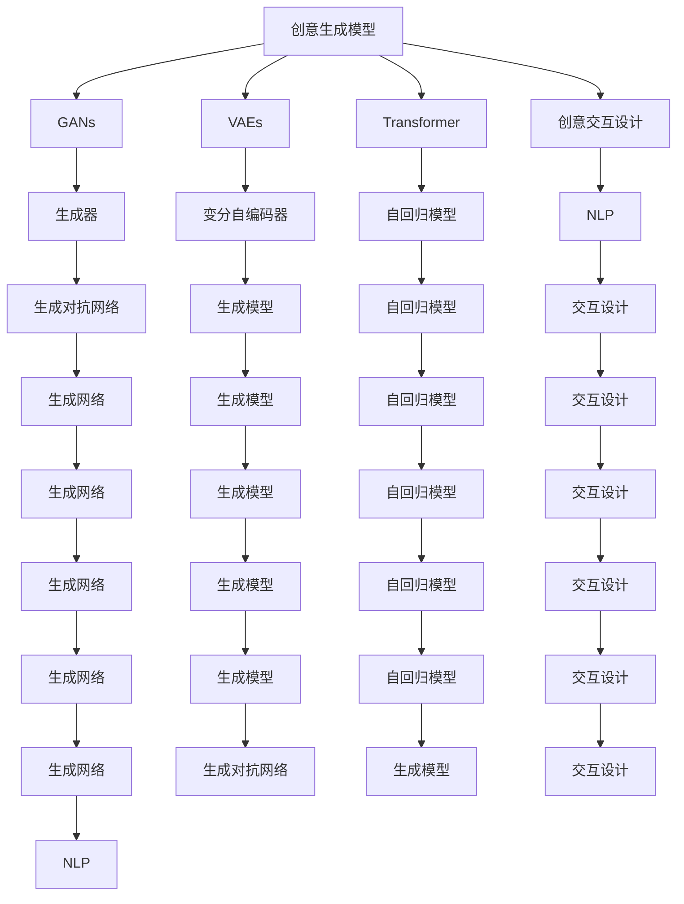

                 

# AI辅助创意：从灵感到实现

> 关键词：人工智能,创意生成,自然语言处理(NLP),深度学习,创造性思维,用户交互设计

## 1. 背景介绍

### 1.1 问题由来
随着人工智能技术的迅猛发展，人工智能在创意和设计领域的应用引起了广泛的关注。从早期的专家系统到当前的深度学习模型，AI辅助创意已经在各个领域展示了其独特价值。在视觉艺术、音乐创作、文学创作、建筑设计等多个创意领域，AI已经成为设计师的得力助手，极大地提升了创作效率和创意质量。

### 1.2 问题核心关键点
AI辅助创意的核心在于如何利用机器学习技术，将创造性思维与人类创意结合，生成具有高度原创性和创新性的作品。这包括两个关键点：
1. **创意生成模型**：通过学习海量数据，模型能够理解和生成新的创意内容，如生成艺术作品、音乐曲调、文本内容等。
2. **交互设计**：通过与用户的交互，模型能够理解用户需求，生成符合用户偏好的创意内容。

### 1.3 问题研究意义
AI辅助创意的研究对于推动创意产业的数字化、智能化转型，提升创意产出效率，以及探索创造性思维的边界，具有重要意义：

1. **提升创意产出效率**：AI能够快速生成大量创意内容，供设计师选择和迭代，极大地缩短了创意开发周期。
2. **拓宽创意表达形式**：AI可以生成复杂的视觉和声音效果，拓展了创意作品的表达形式，带来新的艺术风格和创作技法。
3. **支持个性化创意**：通过与用户的交互，AI可以生成个性化、定制化的创意内容，满足用户的独特需求。
4. **推动创意教育**：AI辅助创意可以用于教育和培训，帮助学生提升创意思维和技能，促进教育公平。
5. **促进跨界融合**：AI可以融合多种创意形式和技术，实现创意内容的多样化、跨界化，推动不同领域创意的融合和创新。

## 2. 核心概念与联系

### 2.1 核心概念概述

为了更好地理解AI辅助创意的原理和实现，本节将介绍几个关键概念：

- **创意生成模型**：通过学习创意数据，生成新的创意内容。常见的创意生成模型包括生成对抗网络(GANs)、变分自编码器(VAEs)、Transformer等。
- **创意交互设计**：通过用户交互，引导模型生成符合用户偏好的创意内容。交互设计技术包括自然语言处理(NLP)、视觉交互、音频交互等。
- **生成对抗网络(GANs)**：一种由生成器和判别器两个网络组成的生成模型，可以生成逼真的新数据。
- **变分自编码器(VAEs)**：一种生成模型，通过学习输入数据的潜在表示，可以生成新的数据样本。
- **Transformer**：一种用于序列建模的深度学习模型，广泛应用于机器翻译、文本生成等任务。

这些概念之间的关系可以通过以下Mermaid流程图来展示：



这个流程图展示了创意生成模型和创意交互设计之间的相互关系，以及各自在创意生成过程中的作用。

## 3. 核心算法原理 & 具体操作步骤
### 3.1 算法原理概述

AI辅助创意的算法原理可以分为两大类：创意生成和创意交互。

**创意生成**算法主要基于生成模型，通过学习大量创意数据，生成新的创意内容。例如，GANs模型通过对抗训练的方式，生成高质量的创意图像或音频。VAEs模型通过潜在表示学习，生成符合用户需求的创意内容。Transformer模型通过自回归生成，生成流畅自然的文本或音乐。

**创意交互**算法则主要基于自然语言处理(NLP)技术，通过与用户的交互，引导模型生成符合用户偏好的创意内容。例如，通过问答系统收集用户偏好，生成个性化音乐或艺术作品。通过对话系统，提供创意生成建议，辅助设计师进行创意设计。

### 3.2 算法步骤详解

#### 创意生成算法步骤

1. **数据准备**：收集创意领域的海量数据，如艺术作品、音乐曲目、文本作品等。
2. **模型训练**：选择合适的生成模型，如GANs、VAEs、Transformer等，训练模型以学习数据分布。
3. **创意生成**：使用训练好的模型生成新的创意内容，如艺术作品、音乐曲调、文本内容等。
4. **评估与优化**：通过用户反馈或预设的评估指标，不断调整模型参数，优化创意生成质量。

#### 创意交互算法步骤

1. **用户交互设计**：设计用户交互界面，收集用户偏好和需求。
2. **模型选择与融合**：选择合适的创意生成模型，与用户交互设计结合，形成完整的创意生成系统。
3. **创意生成与反馈**：根据用户输入，生成创意内容，并通过交互界面展示或播放。
4. **用户反馈与迭代**：收集用户反馈，不断优化模型和交互设计，提升创意生成效果。

### 3.3 算法优缺点

**创意生成算法优点**：
1. **自动化生成**：能够快速生成大量创意内容，极大提升创意产出效率。
2. **多样性与创新性**：生成多种风格的创意内容，提供多样化的创作选择。
3. **高效性**：模型训练一旦完成，创意生成过程高效快速。

**创意生成算法缺点**：
1. **创意可控性差**：生成的创意内容可能不符合用户特定需求，需要人工干预和优化。
2. **质量不稳定**：模型的生成效果受数据质量和训练策略影响，可能存在质量不稳定的问题。
3. **依赖数据**：模型生成依赖大量高质量的创意数据，数据不足可能影响生成效果。

**创意交互算法优点**：
1. **用户定制化**：能够根据用户偏好生成个性化创意内容，满足用户独特需求。
2. **高效交互**：通过自然语言处理技术，实现与用户的高效互动，提升用户体验。
3. **实时反馈**：用户可以实时反馈创意内容，模型根据反馈不断优化，生成更加符合用户期望的内容。

**创意交互算法缺点**：
1. **复杂度较高**：交互设计和模型融合需要较高技术门槛，实现难度较大。
2. **成本较高**：交互设计和模型训练需要较多人力和计算资源，开发成本较高。
3. **依赖用户**：用户交互质量直接影响创意生成效果，用户参与度不足可能影响效果。

### 3.4 算法应用领域

AI辅助创意算法已经在多个领域得到了广泛应用，如：

- **艺术创作**：利用GANs生成逼真的艺术图像，使用VAEs生成艺术作品，通过交互设计辅助艺术家进行创意创作。
- **音乐创作**：使用GANs生成音乐曲调，VAEs生成音乐旋律，通过自然语言处理技术与用户互动，生成个性化音乐作品。
- **文学创作**：利用Transformer生成小说段落或诗句，通过交互设计收集用户偏好，生成符合用户喜好的文学作品。
- **建筑设计**：使用GANs生成建筑外观图或内部布局，通过交互设计收集用户需求，生成符合用户期望的建筑方案。
- **游戏设计**：生成游戏角色、场景或故事情节，通过交互设计收集用户反馈，优化游戏设计。

## 4. 数学模型和公式 & 详细讲解  
### 4.1 数学模型构建

本节将使用数学语言对AI辅助创意的算法过程进行更加严格的刻画。

设创意生成模型为 $G$，创意交互模型为 $I$，创意内容为 $C$。创意生成过程可以表示为：

$$
C = G(I, \theta_G) + \epsilon
$$

其中，$\theta_G$ 为创意生成模型的参数，$\epsilon$ 为随机噪声。创意交互模型 $I$ 根据用户输入 $U$ 生成创意生成模型的输入 $I$。

创意交互过程可以表示为：

$$
I = I(U, \theta_I)
$$

其中，$\theta_I$ 为创意交互模型的参数，$U$ 为用户输入的偏好或需求。

### 4.2 公式推导过程

#### 创意生成模型

以GANs为例，创意生成模型由生成器和判别器两个网络组成：

- **生成器**：将随机噪声 $z$ 转化为创意内容 $x$。
- **判别器**：判断创意内容 $x$ 是否为真实创意内容。

生成器与判别器的对抗训练过程如下：

1. 生成器 $G(z)$ 生成创意内容 $x$。
2. 判别器 $D(x)$ 判断 $x$ 是否为真实创意内容。
3. 生成器 $G(z)$ 的损失函数为：
   $$
   L_G = -\mathbb{E}_{z}[\log D(G(z))]
   $$
4. 判别器 $D(x)$ 的损失函数为：
   $$
   L_D = -\mathbb{E}_x[\log D(x)] - \mathbb{E}_z[\log (1-D(G(z)))]
   $$
5. 训练过程中，生成器与判别器交替优化，直到生成器生成的创意内容能够欺骗判别器，生成高质量的创意内容。

#### 创意交互模型

以自然语言处理技术为例，创意交互模型 $I$ 可以表示为：

$$
I(U, \theta_I) = (U, \theta_I)
$$

其中，$U$ 为用户输入的偏好或需求，$\theta_I$ 为交互模型的参数。

### 4.3 案例分析与讲解

**案例分析：音乐创作**

1. **数据准备**：收集大量音乐作品，提取音乐特征，如旋律、节奏、和弦等。
2. **模型训练**：使用VAEs模型，学习音乐特征的潜在表示。
3. **创意生成**：根据用户偏好（如风格、节奏、调性等），生成新的音乐曲调。
4. **评估与优化**：通过用户反馈，不断调整VAEs模型参数，优化音乐创作效果。

**案例讲解：艺术创作**

1. **数据准备**：收集大量艺术作品，提取艺术特征，如色彩、形状、纹理等。
2. **模型训练**：使用GANs模型，学习艺术特征的生成分布。
3. **创意生成**：根据用户偏好（如风格、色彩、主题等），生成新的艺术作品。
4. **评估与优化**：通过专家评审和用户反馈，不断调整GANs模型参数，优化艺术创作效果。

## 5. 项目实践：代码实例和详细解释说明
### 5.1 开发环境搭建

在进行创意生成和交互设计实践前，我们需要准备好开发环境。以下是使用Python进行PyTorch开发的环境配置流程：

1. 安装Anaconda：从官网下载并安装Anaconda，用于创建独立的Python环境。

2. 创建并激活虚拟环境：
```bash
conda create -n pytorch-env python=3.8 
conda activate pytorch-env
```

3. 安装PyTorch：根据CUDA版本，从官网获取对应的安装命令。例如：
```bash
conda install pytorch torchvision torchaudio cudatoolkit=11.1 -c pytorch -c conda-forge
```

4. 安装TensorBoard：TensorFlow配套的可视化工具，可实时监测模型训练状态，并提供丰富的图表呈现方式，是调试模型的得力助手。

```bash
pip install tensorboard
```

5. 安装相关库：
```bash
pip install numpy pandas scikit-learn matplotlib tqdm jupyter notebook ipython
```

完成上述步骤后，即可在`pytorch-env`环境中开始创意生成和交互设计的实践。

### 5.2 源代码详细实现

这里我们以音乐创作为例，使用PyTorch和VAEs模型进行创意生成。

首先，定义VAEs模型的编码器和解码器：

```python
import torch.nn as nn
import torch

class VAE(nn.Module):
    def __init__(self, latent_dim=128, hidden_dim=256):
        super(VAE, self).__init__()
        self.encoder = nn.Sequential(
            nn.Linear(2, hidden_dim),
            nn.ReLU(),
            nn.Linear(hidden_dim, latent_dim),
            nn.ReLU()
        )
        self.decoder = nn.Sequential(
            nn.Linear(latent_dim, hidden_dim),
            nn.ReLU(),
            nn.Linear(hidden_dim, 2),
            nn.Sigmoid()
        )
        self.latent_dim = latent_dim
    
    def encode(self, x):
        mu, logvar = self.encoder(x)
        return mu, logvar
    
    def reparameterize(self, mu, logvar):
        std = torch.exp(0.5 * logvar)
        eps = torch.randn_like(std)
        return mu + eps * std
    
    def decode(self, z):
        return self.decoder(z)
    
    def forward(self, x):
        mu, logvar = self.encode(x)
        z = self.reparameterize(mu, logvar)
        x_recon = self.decode(z)
        return x_recon, mu, logvar
```

然后，定义VAEs模型的训练函数：

```python
def train_vae(model, data_loader, batch_size, learning_rate, num_epochs):
    device = torch.device('cuda' if torch.cuda.is_available() else 'cpu')
    model.to(device)
    
    optimizer = torch.optim.Adam(model.parameters(), lr=learning_rate)
    
    for epoch in range(num_epochs):
        for batch_idx, (data, _) in enumerate(data_loader):
            data = data.to(device)
            optimizer.zero_grad()
            x_recon, mu, logvar = model(data)
            loss = mse_loss(x_recon, data) + kl_div_loss(mu, logvar)
            loss.backward()
            optimizer.step()
            if (batch_idx+1) % 100 == 0:
                print(f'Epoch [{epoch+1}/{num_epochs}], Batch [{batch_idx+1}/{len(data_loader)}], Loss: {loss.item():.4f}')
```

接着，定义音乐生成函数：

```python
import torch
import numpy as np

def generate_music(model, num_samples, latent_dim):
    device = torch.device('cuda' if torch.cuda.is_available() else 'cpu')
    model.to(device)
    
    z = torch.randn(num_samples, latent_dim).to(device)
    x_recon = model(z)
    
    return x_recon.detach().cpu().numpy()
```

最后，启动VAEs模型的训练和音乐生成：

```python
latent_dim = 128
hidden_dim = 256
batch_size = 32
learning_rate = 1e-3
num_epochs = 100

model = VAE(latent_dim, hidden_dim)
data_loader = ...

train_vae(model, data_loader, batch_size, learning_rate, num_epochs)

num_samples = 10
music = generate_music(model, num_samples, latent_dim)
```

以上就是使用PyTorch和VAEs模型进行音乐创作的完整代码实现。可以看到，VAEs模型通过编码器和解码器实现创意内容的生成，训练函数负责模型参数的优化。

### 5.3 代码解读与分析

让我们再详细解读一下关键代码的实现细节：

**VAEs模型定义**：
- 定义VAEs模型结构，包括编码器、解码器和重参数化函数。
- 编码器将输入数据映射为潜在表示，解码器将潜在表示映射回原始数据。
- 重参数化函数用于引入随机性，确保模型生成多样化的结果。

**训练函数**：
- 定义训练函数，负责模型参数的优化。
- 使用Adam优化器，最小化重构误差和KL散度，优化模型参数。
- 在每个epoch和每个batch上打印损失值，跟踪训练过程。

**音乐生成函数**：
- 使用训练好的VAEs模型生成新的音乐曲调。
- 根据输入的潜在表示生成音乐样本，返回样本的numpy数组。

## 6. 实际应用场景

### 6.1 智能艺术创作

AI辅助创意技术在智能艺术创作中具有广泛的应用前景。智能艺术创作系统可以自动生成高水平的艺术作品，辅助艺术家进行创作和修改。

例如，可以使用GANs生成逼真的艺术图像，使用VAEs生成艺术作品的潜在表示，通过交互设计引导艺术家进行创意创作。系统可以自动完成一些基础的绘画、着色工作，艺术家只需进行后续的修改和润色，极大提升创作效率。

### 6.2 个性化音乐创作

AI辅助创意技术在个性化音乐创作中也取得了显著效果。个性化音乐创作系统可以根据用户的音乐偏好和情感需求，生成符合用户喜好的音乐曲调。

例如，可以使用VAEs生成音乐曲调，使用Transformer生成歌词和旋律，通过自然语言处理技术收集用户偏好和情感，生成符合用户需求的音乐作品。用户可以实时调整音乐风格、节奏和调性，获得个性化的音乐创作体验。

### 6.3 动态建筑设计

AI辅助创意技术在动态建筑设计中也得到了应用。动态建筑设计系统可以根据用户的建筑需求和偏好，生成符合用户期望的建筑方案。

例如，可以使用GANs生成建筑外观图或内部布局，使用VAEs生成建筑风格的潜在表示，通过交互设计收集用户需求和反馈，优化建筑设计方案。系统可以自动完成一些基础的设计工作，设计师只需进行后续的修改和优化，极大提升设计效率。

## 7. 工具和资源推荐
### 7.1 学习资源推荐

为了帮助开发者系统掌握AI辅助创意的理论基础和实践技巧，这里推荐一些优质的学习资源：

1. **《深度学习》第三版**：Ian Goodfellow等著，全面介绍了深度学习的基本概念和核心算法，是深度学习领域的经典教材。
2. **《Python深度学习》**：Francois Chollet著，介绍了使用Keras进行深度学习的实践方法，适合快速上手深度学习。
3. **《生成对抗网络入门》**：Alec Radford等著，介绍了生成对抗网络的基本原理和实际应用，适合初学者学习。
4. **《自然语言处理综述》**：Yoshua Bengio等著，介绍了自然语言处理的基本概念和核心技术，是NLP领域的经典教材。
5. **《TensorFlow官方文档》**：TensorFlow的官方文档，提供了丰富的教程和样例代码，适合深度学习实践。

通过对这些资源的学习实践，相信你一定能够快速掌握AI辅助创意的精髓，并用于解决实际的创意生成问题。

### 7.2 开发工具推荐

高效的开发离不开优秀的工具支持。以下是几款用于AI辅助创意开发的常用工具：

1. **PyTorch**：基于Python的开源深度学习框架，灵活动态的计算图，适合快速迭代研究。
2. **TensorFlow**：由Google主导开发的开源深度学习框架，生产部署方便，适合大规模工程应用。
3. **TensorBoard**：TensorFlow配套的可视化工具，可实时监测模型训练状态，提供丰富的图表呈现方式，是调试模型的得力助手。
4. **Jupyter Notebook**：交互式编程环境，支持Python、R等语言，适合进行实验和分析。

合理利用这些工具，可以显著提升AI辅助创意任务的开发效率，加快创新迭代的步伐。

### 7.3 相关论文推荐

AI辅助创意的研究源于学界的持续研究。以下是几篇奠基性的相关论文，推荐阅读：

1. **Generative Adversarial Nets**：Ian Goodfellow等著，介绍了生成对抗网络的基本原理和应用。
2. **Autoencoder: Denoising via Sparse Coding**：Hinton等著，介绍了自编码器的基本原理和应用。
3. **Attention Is All You Need**：Vaswani等著，介绍了Transformer模型和自回归生成。
4. **Adversarial Machine Learning**：Ian Goodfellow等著，介绍了对抗机器学习的基本原理和应用。
5. **Neural Text Generation with Coverage**：Ruslan Salakhutdinov等著，介绍了使用Transformer进行文本生成的覆盖技巧。

这些论文代表了大模型辅助创意技术的发展脉络。通过学习这些前沿成果，可以帮助研究者把握学科前进方向，激发更多的创新灵感。

## 8. 总结：未来发展趋势与挑战

### 8.1 总结

本文对AI辅助创意从灵感到实现的过程进行了全面系统的介绍。首先阐述了AI辅助创意的研究背景和意义，明确了创意生成模型和交互设计模型的核心作用。其次，从原理到实践，详细讲解了创意生成和交互设计的数学原理和关键步骤，给出了创意生成和交互设计的完整代码实例。同时，本文还广泛探讨了AI辅助创意技术在艺术创作、音乐创作、建筑设计等多个领域的应用前景，展示了AI辅助创意技术的巨大潜力。

通过本文的系统梳理，可以看到，AI辅助创意技术正在成为创意领域的重要范式，极大地拓展了创意作品的创作形式和表达方式，提升了创意生产的效率和质量。未来，伴随AI技术的进一步发展，AI辅助创意技术必将在更广阔的领域发挥更大的作用，为创意产业带来革命性变革。

### 8.2 未来发展趋势

展望未来，AI辅助创意技术将呈现以下几个发展趋势：

1. **创意生成模型多样化**：除了GANs和VAEs，未来还将涌现更多创意生成模型，如VAE-GAN、GANs-VAE等，提升创意生成效果。
2. **多模态创意生成**：创意生成技术将逐步拓展到多模态数据，如视觉、声音、文本等，实现更加丰富和全面的创意生成。
3. **实时创意生成**：创意生成技术将进一步提升实时性，实现即时生成创意内容，满足用户的即时需求。
4. **个性化创意**：通过更加精细的用户交互设计，实现更加个性化的创意生成，满足用户的独特需求。
5. **跨界创意融合**：创意生成技术将与其他领域的技术进行深度融合，实现跨界创意的生成和应用。

以上趋势凸显了AI辅助创意技术的广阔前景。这些方向的探索发展，必将进一步提升创意作品的创作效率和质量，为创意产业带来更深层次的变革。

### 8.3 面临的挑战

尽管AI辅助创意技术已经取得了显著成就，但在迈向更加智能化、普适化应用的过程中，它仍面临着诸多挑战：

1. **创意可控性不足**：生成的创意内容可能不符合用户特定需求，需要人工干预和优化。
2. **创意质量不稳定**：模型的生成效果受数据质量和训练策略影响，可能存在质量不稳定的问题。
3. **依赖数据**：创意生成依赖大量高质量的数据，数据不足可能影响生成效果。
4. **创意交互设计复杂**：交互设计和模型融合需要较高技术门槛，实现难度较大。
5. **成本较高**：交互设计和模型训练需要较多人力和计算资源，开发成本较高。
6. **用户参与度不足**：用户交互质量直接影响创意生成效果，用户参与度不足可能影响效果。

正视创意生成和交互设计面临的这些挑战，积极应对并寻求突破，将是大模型辅助创意技术走向成熟的必由之路。相信随着学界和产业界的共同努力，这些挑战终将一一被克服，AI辅助创意技术必将在构建智能创意产业中扮演越来越重要的角色。

### 8.4 未来突破

面对AI辅助创意技术所面临的种种挑战，未来的研究需要在以下几个方面寻求新的突破：

1. **多模态创意生成**：将创意生成技术拓展到多模态数据，如视觉、声音、文本等，实现更加丰富和全面的创意生成。
2. **创意生成模型优化**：开发更加高效、鲁棒的创意生成模型，提升创意生成效果。
3. **个性化创意设计**：通过更加精细的用户交互设计，实现更加个性化的创意生成，满足用户的独特需求。
4. **实时创意生成**：提升创意生成技术的实时性，实现即时生成创意内容，满足用户的即时需求。
5. **跨界创意融合**：创意生成技术将与其他领域的技术进行深度融合，实现跨界创意的生成和应用。
6. **伦理道德约束**：在创意生成过程中引入伦理导向的评估指标，过滤和惩罚有偏见、有害的输出倾向，确保创意生成内容的健康性和合理性。

这些研究方向的探索，必将引领AI辅助创意技术迈向更高的台阶，为创意产业带来更深层次的变革。面向未来，AI辅助创意技术还需要与其他人工智能技术进行更深入的融合，如知识表示、因果推理、强化学习等，多路径协同发力，共同推动创意产业的进步。只有勇于创新、敢于突破，才能不断拓展创意生成技术的边界，让智能技术更好地服务于人类创意工作。

## 9. 附录：常见问题与解答

**Q1：AI辅助创意技术是否会取代人类创意工作？**

A: AI辅助创意技术虽然能够生成高质量的创意内容，但目前仍然无法完全替代人类创意工作。AI更多地是作为人类创意的辅助工具，提升创作效率和质量，帮助人类更好地实现创意。人类创意工作的深度、广度和独特性，仍然需要依赖人类自身的创造力和智慧。

**Q2：AI辅助创意技术是否适用于所有创意领域？**

A: AI辅助创意技术在视觉艺术、音乐创作、文学创作等领域已经取得了显著效果，但对于一些高度依赖人类情感、情感体验的艺术形式（如绘画、雕塑等），仍然需要人类艺术家进行创意创作。未来AI技术在这些领域的深入应用还需要进一步探索和突破。

**Q3：AI辅助创意技术如何保障创意内容的原创性？**

A: AI辅助创意技术生成的创意内容需要结合人类创意工作者的原创性进行二次创作和润色。创意生成模型生成的是初稿或半成品，最终的作品需要人类进行审核和修改，确保内容的原创性和独特性。

**Q4：AI辅助创意技术如何保障创意内容的伦理道德？**

A: 在创意生成过程中，可以引入伦理导向的评估指标，过滤和惩罚有偏见、有害的输出倾向。同时，加强人工干预和审核，建立创意生成内容的监管机制，确保创意内容符合伦理道德标准。

通过本文的系统梳理，可以看到，AI辅助创意技术正在成为创意领域的重要范式，极大地拓展了创意作品的创作形式和表达方式，提升了创意生产的效率和质量。未来，伴随AI技术的进一步发展，AI辅助创意技术必将在更广阔的领域发挥更大的作用，为创意产业带来革命性变革。面向未来，AI辅助创意技术还需要与其他人工智能技术进行更深入的融合，如知识表示、因果推理、强化学习等，多路径协同发力，共同推动创意产业的进步。只有勇于创新、敢于突破，才能不断拓展创意生成技术的边界，让智能技术更好地服务于人类创意工作。

作者：禅与计算机程序设计艺术 / Zen and the Art of Computer Programming

