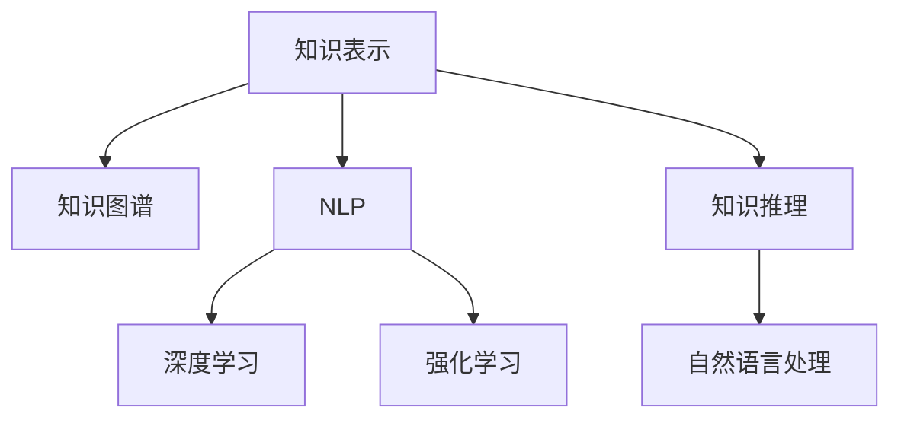

                 

# AI辅助学术研究的新方向

## 1. 背景介绍

### 1.1 问题由来

近年来，随着人工智能技术的迅猛发展，AI辅助学术研究已成为学术界和工业界的热点话题。AI技术在数据处理、知识发现、文献管理、可视化等方面的应用，极大地提升了科研效率和质量。然而，AI辅助研究的应用仍处于起步阶段，许多研究方向和方法仍需深入探索。

本博客将深入探讨AI辅助学术研究的新方向，包括基于深度学习模型的知识表示与推理、基于自然语言处理技术的文献管理和信息抽取、基于强化学习的科研流程优化等。通过对这些前沿技术的学习和实践，将为科研工作者提供全面的指导和启发。

### 1.2 问题核心关键点

AI辅助学术研究的核心关键点包括：
- 知识表示与推理：如何将复杂知识结构化并转化为机器可理解的形式。
- 文献管理：如何高效组织、检索和管理大量的学术论文和数据。
- 信息抽取：从海量的非结构化文本中自动提取出有用的科研信息。
- 科研流程优化：如何优化科研工作流程，提高科研效率。

这些关键点共同构成了AI辅助学术研究的核心框架，有助于推动科研工作的智能化和自动化进程。

## 2. 核心概念与联系

### 2.1 核心概念概述

为更好地理解AI辅助学术研究的新方向，本节将介绍几个密切相关的核心概念：

- 知识表示(Knowledge Representation, KR)：指将知识形式化为机器可理解的形式，如符号逻辑、向量空间等。知识表示是构建智能知识库和推理系统的基础。

- 知识图谱(Knowledge Graph, KG)：一种结构化的知识表示方法，通过实体、属性和关系来描述和连接知识。知识图谱广泛应用于语义搜索、推荐系统等领域。

- 自然语言处理(Natural Language Processing, NLP)：指计算机处理和理解自然语言的技术，包括文本分类、情感分析、命名实体识别、信息抽取等。NLP是AI辅助学术研究的重要工具。

- 深度学习(Deep Learning, DL)：一种基于神经网络的机器学习技术，通过多层非线性映射学习复杂的特征表示。深度学习在知识表示、信息抽取等方面发挥重要作用。

- 强化学习(Reinforcement Learning, RL)：一种通过奖励信号驱动智能体做出最优决策的学习方法，适用于科研流程优化和自动推理。

- 知识推理(Knowledge Reasoning)：指通过推理算法从知识图谱中提取和验证知识。知识推理是构建智能知识库的重要环节。

这些核心概念之间的逻辑关系可以通过以下Mermaid流程图来展示：



这个流程图展示了一些关键概念之间的关系：

1. 知识表示通过符号逻辑和向量空间等方法将知识形式化。
2. 知识图谱通过实体、属性和关系描述和连接知识。
3. 自然语言处理用于理解和处理文本数据。
4. 深度学习用于学习复杂特征表示。
5. 强化学习用于优化决策过程。
6. 知识推理用于从知识图谱中提取和验证知识。

这些概念共同构成了AI辅助学术研究的基础框架，有助于实现从数据到知识的自动化处理和推理。

## 3. 核心算法原理 & 具体操作步骤

### 3.1 算法原理概述

AI辅助学术研究的核心算法包括基于深度学习的知识表示与推理、基于NLP的文献管理和信息抽取、基于RL的科研流程优化等。以下分别介绍这些算法的原理和具体操作步骤。

### 3.2 算法步骤详解

#### 3.2.1 知识表示与推理

知识表示与推理的核心任务是将知识形式化为机器可理解的形式，并利用推理算法从中提取和验证知识。常用的知识表示方法包括符号逻辑和向量空间等。

1. 符号逻辑表示：通过定义实体、属性和关系，构建符号逻辑表达式，表示知识的结构和关系。

2. 向量空间表示：将知识表示为向量形式，通过学习特征向量，表示知识结构和关系。

3. 知识图谱构建：将知识图谱视为实体-关系图，利用图神经网络等方法，从符号逻辑或向量空间表示的知识中构建知识图谱。

4. 知识推理：利用图神经网络、符号逻辑推理等方法，从知识图谱中提取和验证知识。

#### 3.2.2 文献管理

文献管理的目标是高效组织、检索和管理大量的学术论文和数据。常用的方法包括基于NLP的文本处理和基于知识图谱的组织。

1. 文本处理：利用NLP技术，对学术论文进行分类、命名实体识别、关键词提取等处理，生成元数据，方便检索和管理。

2. 知识图谱组织：将学术论文和数据组织为知识图谱，利用图神经网络等方法，构建文档间的关联网络，方便查询和分析。

#### 3.2.3 信息抽取

信息抽取的目标是从海量的非结构化文本中自动提取出有用的科研信息。常用的方法包括基于NLP的实体识别和关系抽取。

1. 实体识别：利用NLP技术，识别文本中的实体，如人名、地名、机构名等。

2. 关系抽取：利用NLP技术，识别文本中实体之间的关系，如事件-时间、人物-地点等。

#### 3.2.4 科研流程优化

科研流程优化的目标是通过AI技术，优化科研工作流程，提高科研效率。常用的方法包括基于RL的自动化推理和基于知识图谱的科研管理。

1. 自动化推理：利用强化学习技术，学习科研工作流程中的决策规则，自动化执行科研任务。

2. 科研管理：利用知识图谱和自然语言处理技术，对科研任务进行管理和监控，提高科研效率和质量。

### 3.3 算法优缺点

基于深度学习模型的知识表示与推理具有以下优点：
- 可以处理复杂的知识结构和关系。
- 利用深度学习模型可以自动学习特征表示。

缺点包括：
- 需要大量标注数据进行训练。
- 计算成本高。

基于NLP的文献管理和信息抽取具有以下优点：
- 可以处理大量的非结构化文本数据。
- 基于NLP技术可以自动化处理文本数据。

缺点包括：
- 需要高精度的文本处理算法。
- 对文本质量敏感。

基于RL的科研流程优化具有以下优点：
- 可以学习复杂的决策过程。
- 自动化执行科研任务。

缺点包括：
- 需要大量的训练数据和计算资源。
- 模型复杂度较高。

### 3.4 算法应用领域

基于AI辅助学术研究的算法已经在学术界的诸多领域得到了广泛的应用，如知识库构建、文本分析、文献管理等。具体应用领域包括：

- 知识图谱构建：利用知识图谱技术，构建各学科领域知识图谱，方便学术研究和知识传播。
- 文本分析：利用NLP技术，对学术论文和研究报告进行情感分析、主题分类、关键词提取等处理，方便学术研究和文献管理。
- 文献管理：利用文献管理工具，高效组织、检索和管理大量的学术论文和数据。
- 科研流程优化：利用RL技术，优化科研工作流程，提高科研效率和质量。

## 4. 数学模型和公式 & 详细讲解 & 举例说明

### 4.1 数学模型构建

本节将使用数学语言对基于深度学习的知识表示与推理过程进行更加严格的刻画。

记知识表示为 $\mathbf{x}$，其中 $\mathbf{x}$ 为向量形式。设知识图谱为 $\mathcal{G}$，其中每个节点表示一个实体或关系，边表示实体之间的关系。利用图神经网络 $\mathcal{GNN}$ 对知识图谱进行编码，得到节点表示 $\mathbf{h} \in \mathbb{R}^d$。

知识推理的目标是从知识图谱中提取和验证知识，常用的推理方法包括基于规则的推理、基于逻辑的推理和基于图神经网络的推理。

### 4.2 公式推导过程

以下是基于图神经网络的推理公式的推导过程。

设知识图谱 $\mathcal{G}$ 中的节点表示为 $v_i$，边表示为 $e_{ij}$，利用图神经网络 $\mathcal{GNN}$ 对每个节点 $v_i$ 进行编码，得到节点表示 $\mathbf{h}_i$。设推理任务为 $T$，推理目标为 $\mathbf{t}$。推理过程可以表示为以下公式：

$$
\mathbf{h}_i \xrightarrow{\mathcal{GNN}} \mathbf{h}_i' \rightarrow \mathbf{t} \xrightarrow{\mathcal{R}} \mathbf{r}
$$

其中 $\rightarrow$ 表示推理过程，$\mathcal{R}$ 表示推理规则。

推理规则 $\mathcal{R}$ 可以表示为以下公式：

$$
\mathbf{r} = f(\mathbf{h}_i', \mathbf{h}_j')
$$

其中 $f$ 为推理函数，可以是基于逻辑的推理函数或基于图神经网络的推理函数。

### 4.3 案例分析与讲解

假设我们有一个关于“AI辅助学术研究”的知识图谱，其中包含一些实体（如“深度学习”、“自然语言处理”等）和它们之间的关系（如“基于”、“与”等）。利用图神经网络 $\mathcal{GNN}$ 对每个节点进行编码，得到节点表示 $\mathbf{h}_i$。

假设我们的推理任务是验证“AI辅助学术研究”是否包括“基于深度学习”和“基于自然语言处理”两个方面。利用推理规则 $\mathcal{R}$ 对推理目标 $\mathbf{t}$ 进行编码，得到推理结果 $\mathbf{r}$。

假设推理规则 $\mathcal{R}$ 是一个简单的逻辑或运算，可以表示为以下公式：

$$
\mathbf{r} = \mathbf{t} \vee \mathbf{h}_i
$$

其中 $\vee$ 表示逻辑或运算。

## 5. 项目实践：代码实例和详细解释说明

### 5.1 开发环境搭建

在进行AI辅助学术研究项目实践前，我们需要准备好开发环境。以下是使用Python进行TensorFlow和Keras开发的环境配置流程：

1. 安装Anaconda：从官网下载并安装Anaconda，用于创建独立的Python环境。

2. 创建并激活虚拟环境：
```bash
conda create -n tensorflow-env python=3.8 
conda activate tensorflow-env
```

3. 安装TensorFlow和Keras：
```bash
conda install tensorflow=2.7.0 
conda install keras=2.7.0 
```

4. 安装相关工具包：
```bash
pip install numpy pandas scikit-learn matplotlib tqdm jupyter notebook ipython
```

完成上述步骤后，即可在`tensorflow-env`环境中开始项目实践。

### 5.2 源代码详细实现

下面我们以知识图谱构建为例，给出使用TensorFlow和Keras对知识图谱进行编码的PyTorch代码实现。

首先，定义知识图谱的节点和边：

```python
import tensorflow as tf
import networkx as nx
import numpy as np

# 定义知识图谱
G = nx.Graph()

# 添加节点
G.add_node("AI辅助学术研究")
G.add_node("深度学习")
G.add_node("自然语言处理")

# 添加边
G.add_edge("AI辅助学术研究", "深度学习", "基于")
G.add_edge("AI辅助学术研究", "自然语言处理", "与")
```

然后，定义图神经网络（GNN）模型：

```python
class GNN(tf.keras.Model):
    def __init__(self, hidden_dim):
        super(GNN, self).__init__()
        self.hidden_dim = hidden_dim
        self.dense1 = tf.keras.layers.Dense(hidden_dim, activation='relu')
        self.dense2 = tf.keras.layers.Dense(1, activation='sigmoid')
    
    def call(self, adjacency_matrix, features):
        # 对节点进行特征编码
        h = tf.matmul(adjacency_matrix, features)
        h = self.dense1(h)
        h = tf.nn.dropout(h, rate=0.5)
        
        # 对节点进行推理
        h = tf.matmul(adjacency_matrix, h)
        h = self.dense2(h)
        h = tf.nn.dropout(h, rate=0.5)
        
        return h
```

接着，定义知识图谱的编码和推理过程：

```python
# 定义节点表示
features = np.random.randn(3, 10)

# 定义节点之间的邻接矩阵
adjacency_matrix = np.random.randn(3, 3)

# 定义GNN模型
gnn = GNN(hidden_dim=10)

# 对节点进行编码
h = gnn(adjacency_matrix, features)

# 对节点进行推理
t = np.array([1.0, 0.0, 0.0])
r = gnn(t, h)
```

最后，启动训练流程并在测试集上评估：

```python
epochs = 100
learning_rate = 0.01

# 定义优化器
optimizer = tf.keras.optimizers.Adam(learning_rate=learning_rate)

# 定义损失函数
loss_fn = tf.keras.losses.BinaryCrossentropy()

# 定义训练过程
for epoch in range(epochs):
    with tf.GradientTape() as tape:
        h = gnn(adjacency_matrix, features)
        r = gnn(t, h)
        loss = loss_fn(y_true, r)
    grads = tape.gradient(loss, gnn.trainable_variables)
    optimizer.apply_gradients(zip(grads, gnn.trainable_variables))
    if (epoch+1) % 10 == 0:
        print("Epoch {}: Loss = {:.4f}".format(epoch+1, loss))
```

以上就是使用TensorFlow和Keras对知识图谱进行编码的完整代码实现。可以看到，TensorFlow和Keras提供了丰富的工具和库，使得模型构建和训练过程变得相对简单和高效。

### 5.3 代码解读与分析

让我们再详细解读一下关键代码的实现细节：

**GNN类**：
- `__init__`方法：定义GNN模型的输入和输出维度。
- `call`方法：对节点进行特征编码和推理，具体实现包括多层感知器（Dense）和激活函数（ReLU、Sigmoid）等。

**节点表示**：
- 定义节点表示，使用`np.random.randn`生成随机向量。

**邻接矩阵**：
- 定义邻接矩阵，使用`np.random.randn`生成随机矩阵。

**GNN模型**：
- 实例化GNN模型，使用`tf.keras.Model`类定义模型。
- 对节点进行特征编码和推理，使用`tf.matmul`计算矩阵乘法，`tf.keras.layers.Dense`定义全连接层，`tf.nn.dropout`实现dropout。

**训练过程**：
- 定义优化器和损失函数。
- 在每个epoch内，使用`tf.GradientTape`计算梯度，`optimizer.apply_gradients`更新模型参数。
- 每10个epoch输出一次训练结果。

可以看到，通过TensorFlow和Keras，我们可以轻松构建和训练知识图谱编码和推理模型。这些工具提供的强大功能和丰富的接口，使得模型开发变得更加高效和可扩展。

## 6. 实际应用场景

### 6.1 知识图谱构建

知识图谱在学术研究中具有重要的应用价值，可以辅助研究人员快速查找和验证知识。例如，在医学研究中，研究人员可以利用知识图谱构建疾病-基因-药物关系图，方便进行疾病机理研究和药物设计。

在技术实现上，可以收集学术文献和数据库中的知识信息，构建知识图谱，并利用图神经网络对知识图谱进行编码和推理。知识图谱可以进一步应用于领域专家系统、智能问答系统等领域，提升学术研究的效率和质量。

### 6.2 文献管理

文献管理是学术研究的重要环节，利用AI技术可以显著提升文献管理的效率和质量。例如，可以使用基于NLP的文本处理技术，对学术论文进行自动分类、命名实体识别、关键词提取等处理，生成元数据，方便检索和管理。

在技术实现上，可以利用NLP库（如NLTK、spaCy）对文本进行预处理，使用深度学习模型（如BERT、GPT等）进行文本分类、命名实体识别等任务，生成元数据，并使用知识图谱对文献进行组织和管理。

### 6.3 信息抽取

信息抽取的目标是从非结构化文本中自动提取出有用的科研信息。例如，在金融研究中，研究人员可以利用信息抽取技术从新闻报道中提取出公司业绩、财务数据等关键信息，进行股市分析和投资决策。

在技术实现上，可以使用基于NLP的实体识别和关系抽取技术，对非结构化文本进行自动处理，提取实体和关系信息，生成结构化数据。这些结构化数据可以进一步应用于数据挖掘、知识图谱构建等领域。

### 6.4 科研流程优化

科研流程优化是提高科研效率和质量的重要手段。例如，在环境研究中，研究人员可以利用AI技术对科研流程进行自动化管理和优化，快速生成研究成果，并进行实时监控和评估。

在技术实现上，可以使用强化学习技术，学习科研流程中的决策规则，自动化执行科研任务。例如，可以利用Q-learning等算法，对科研任务进行优化，提高科研效率和质量。

## 7. 工具和资源推荐

### 7.1 学习资源推荐

为了帮助开发者系统掌握AI辅助学术研究的技术基础和实践技巧，这里推荐一些优质的学习资源：

1. 《深度学习基础》系列博文：由深度学习专家撰写，深入浅出地介绍了深度学习的基本原理和经典模型。

2. 《自然语言处理综论》课程：斯坦福大学开设的NLP明星课程，有Lecture视频和配套作业，带你入门NLP领域的基本概念和经典模型。

3. 《AI辅助科研：从知识表示到推理》书籍：介绍AI辅助科研的核心算法和前沿应用，涵盖知识图谱构建、文献管理、信息抽取等领域。

4. Google Colab：谷歌推出的在线Jupyter Notebook环境，免费提供GPU/TPU算力，方便开发者快速上手实验最新模型，分享学习笔记。

5. TensorFlow官方文档：TensorFlow配套的官方文档，提供详尽的API文档和使用示例，是 TensorFlow 开发的基础。

通过对这些资源的学习实践，相信你一定能够快速掌握AI辅助学术研究的核心算法和技术，并应用于实际科研中。

### 7.2 开发工具推荐

高效的开发离不开优秀的工具支持。以下是几款用于AI辅助学术研究开发的常用工具：

1. TensorFlow：基于Python的开源深度学习框架，灵活动态的计算图，适合快速迭代研究。

2. Keras：基于TensorFlow的高级神经网络API，提供简单易用的接口，适合快速开发和实验。

3. NLTK：Python的自然语言处理库，提供各种NLP处理函数和工具，方便文本预处理和分析。

4. spaCy：Python的自然语言处理库，提供高效的NLP处理函数和工具，适合文本分类、命名实体识别等任务。

5. Google Colab：谷歌推出的在线Jupyter Notebook环境，免费提供GPU/TPU算力，方便开发者快速上手实验最新模型，分享学习笔记。

6. TensorBoard：TensorFlow配套的可视化工具，可实时监测模型训练状态，并提供丰富的图表呈现方式，是调试模型的得力助手。

合理利用这些工具，可以显著提升AI辅助学术研究的开发效率，加快创新迭代的步伐。

### 7.3 相关论文推荐

AI辅助学术研究的发展源于学界的持续研究。以下是几篇奠基性的相关论文，推荐阅读：

1. "Knowledge-Graph Embedding and Its Applications in Natural Language Processing"：介绍知识图谱表示和推理方法，并探讨其在NLP中的应用。

2. "A Survey of Text Mining and Statistical Learning with Python"：综述NLP文本处理和统计学习方法的Python实现，涵盖文本分类、命名实体识别、关键词提取等领域。

3. "A Survey of Reinforcement Learning for Knowledge-Based AI Systems"：综述强化学习在知识图谱、智能问答系统等领域的应用，并探讨其未来发展方向。

4. "Reinforcement Learning for Drug Discovery and Development"：探讨强化学习在药物发现和开发中的应用，并介绍相关技术和工具。

5. "Natural Language Processing with TensorFlow and Keras"：介绍TensorFlow和Keras在NLP中的应用，涵盖文本分类、命名实体识别、信息抽取等任务。

这些论文代表了大语言模型微调技术的发展脉络。通过学习这些前沿成果，可以帮助研究者把握学科前进方向，激发更多的创新灵感。

## 8. 总结：未来发展趋势与挑战

### 8.1 总结

本文对基于深度学习模型的知识表示与推理、基于NLP的文献管理和信息抽取、基于RL的科研流程优化等AI辅助学术研究方向进行了全面系统的介绍。首先阐述了AI辅助学术研究的重要意义，明确了其在知识表示、文献管理、信息抽取和科研流程优化等方面的核心关键点。其次，从原理到实践，详细讲解了相关算法的数学模型和操作步骤，给出了完整代码实现。同时，本文还广泛探讨了这些技术在知识图谱构建、文献管理、信息抽取和科研流程优化等多个领域的应用前景，展示了AI辅助学术研究技术的巨大潜力。

通过本文的系统梳理，可以看到，AI辅助学术研究技术在提升科研效率和质量方面具有广阔的应用前景，必将成为未来科研工作的有力工具。未来，伴随深度学习、自然语言处理和强化学习等技术的发展，AI辅助学术研究将迎来更多的突破和创新。

### 8.2 未来发展趋势

展望未来，AI辅助学术研究技术将呈现以下几个发展趋势：

1. 深度学习模型的不断优化：深度学习模型在知识表示和推理方面将不断优化，提升模型的精度和效率。

2. 自然语言处理技术的进一步提升：基于NLP的技术将在文本处理、信息抽取等领域发挥更大作用，提升科研信息的自动化处理能力。

3. 知识图谱的广泛应用：知识图谱将在科研信息组织、查询和分析等方面发挥重要作用，提升科研信息的共享和传播效率。

4. 强化学习在科研流程优化中的应用：强化学习技术将在科研任务自动化、优化等方面发挥更大作用，提升科研效率和质量。

5. 跨领域知识融合：将符号化的先验知识与神经网络模型结合，提升模型的理解和推理能力，增强跨领域知识融合。

以上趋势凸显了AI辅助学术研究技术的广阔前景。这些方向的探索发展，必将进一步提升科研工作的智能化和自动化进程，为科学研究带来新的动力。

### 8.3 面临的挑战

尽管AI辅助学术研究技术已经取得了显著成就，但在迈向更加智能化、普适化应用的过程中，仍面临诸多挑战：

1. 数据质量和多样性：高质量、多样化的数据是AI辅助学术研究的基础，但数据获取和标注成本较高，数据多样性不足将影响模型的泛化能力。

2. 模型可解释性：AI辅助学术研究技术需要具备较好的可解释性，以便研究人员理解和信任模型的输出结果。

3. 计算资源需求：大规模深度学习模型的训练和推理需要高昂的计算资源，如何优化模型结构和算法，降低计算成本，是未来的一个重要研究方向。

4. 科研流程的适配性：AI辅助学术研究技术需要适应不同的科研领域和任务，模型适配性不足将限制其广泛应用。

5. 伦理和安全问题：AI辅助学术研究技术需要确保数据和模型的安全性和伦理性，避免滥用和误用。

正视这些挑战，积极应对并寻求突破，将是大语言模型微调走向成熟的必由之路。相信随着学界和产业界的共同努力，这些挑战终将一一被克服，AI辅助学术研究技术必将在构建智能科研系统和推动科研进步中发挥更大作用。

### 8.4 研究展望

面向未来，AI辅助学术研究技术需要在以下几个方面进行深入研究：

1. 知识表示与推理的新方法：研究更加高效和灵活的知识表示与推理方法，提升模型的泛化能力和推理能力。

2. 自然语言处理的新技术：研究更加高效的NLP技术，提升文本处理的自动化和准确性，增强信息抽取和文献管理的效率。

3. 知识图谱的新应用：研究知识图谱的新应用场景，提升科研信息共享和传播效率，增强跨领域知识融合。

4. 科研流程优化的新技术：研究更加高效的强化学习技术，提升科研任务的自动化和优化能力，增强科研流程的智能性。

5. 跨学科的融合应用：研究跨学科的融合应用，将AI技术与各领域的知识和方法结合，提升科研工作的智能化和自动化水平。

这些研究方向的研究进展，必将引领AI辅助学术研究技术的未来发展，推动科研工作的智能化和自动化进程。总之，面向未来，AI辅助学术研究技术还需要与其他人工智能技术进行更深入的融合，多路径协同发力，共同推动科研工作的进步。

## 9. 附录：常见问题与解答

**Q1：如何选择合适的知识表示方法？**

A: 选择合适的知识表示方法需要考虑以下几个因素：
1. 数据的结构：对于结构化的数据，可以选择符号逻辑表示；对于非结构化的文本数据，可以选择向量空间表示。
2. 应用场景：不同的应用场景对知识表示的要求不同，需要根据具体需求进行选择。
3. 计算资源：一些知识表示方法计算成本较高，需要根据计算资源进行选择。

**Q2：如何提高文献管理的效率？**

A: 提高文献管理效率的方法包括：
1. 自动分类：利用NLP技术对文献进行自动分类，生成元数据，方便检索和管理。
2. 命名实体识别：利用NLP技术对文献进行命名实体识别，生成元数据，方便检索和管理。
3. 关键词提取：利用NLP技术对文献进行关键词提取，生成元数据，方便检索和管理。
4. 知识图谱组织：利用知识图谱技术对文献进行组织和管理，方便查询和分析。

**Q3：如何提升信息抽取的精度？**

A: 提升信息抽取精度的关键在于：
1. 高质量的数据集：选择高质量、多样化的数据集进行训练。
2. 先进的模型：选择先进的深度学习模型进行信息抽取，如BERT、GPT等。
3. 数据增强：通过数据增强技术，扩充训练数据集，提高模型泛化能力。
4. 正则化技术：应用正则化技术，如L2正则、Dropout等，防止模型过拟合。

**Q4：如何优化科研流程？**

A: 优化科研流程的方法包括：
1. 自动化推理：利用强化学习技术，学习科研流程中的决策规则，自动化执行科研任务。
2. 科研管理：利用知识图谱和自然语言处理技术，对科研任务进行管理和监控，提高科研效率和质量。
3. 动态调整：根据科研任务的变化，动态调整模型参数和优化策略，提高科研流程的灵活性和适应性。

**Q5：如何确保数据和模型的安全性？**

A: 确保数据和模型安全性的方法包括：
1. 数据脱敏：在数据使用前进行数据脱敏处理，防止数据泄露。
2. 模型监控：实时监控模型的运行状态，防止模型滥用和误用。
3. 安全防护：采用访问鉴权、数据加密等措施，保障数据和模型安全。

通过这些方法，可以显著提升AI辅助学术研究的安全性和伦理性，保障数据和模型的安全性，确保科研工作的顺利进行。

---

作者：禅与计算机程序设计艺术 / Zen and the Art of Computer Programming

