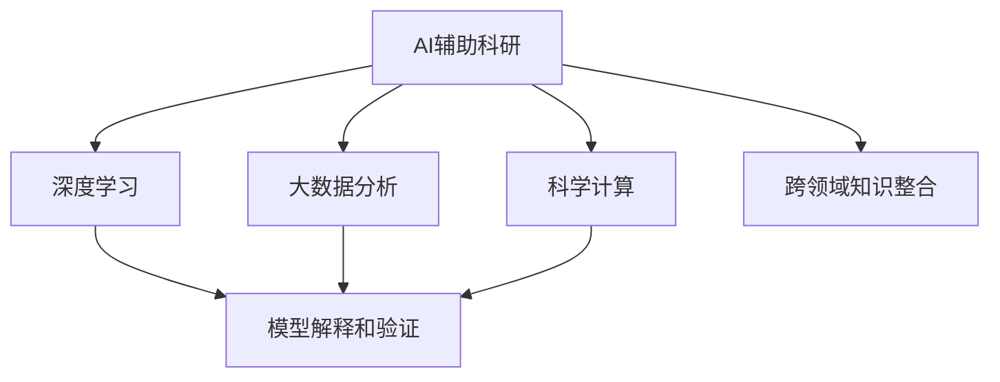

                 

# AI辅助科研：加速科学发现的新范式

> 关键词：AI辅助科研,加速科学发现,大数据分析,科学计算,机器学习

## 1. 背景介绍

### 1.1 问题由来

现代科学研究已经进入了大数据时代，科学数据的量级和复杂度大幅提升。传统的研究方法往往依赖于人类的直觉和经验，难以处理海量的数据，难以进行复杂的数据分析和建模。AI技术的发展为科研提供了新的工具和方法，有望极大地提升科研的效率和质量。

AI辅助科研的核心思想是通过自动化、智能化的方式，对科学数据进行快速处理、分析和建模，帮助科学家发现新的科学规律，提出新的研究方向，加速科学发现过程。AI技术在生物信息学、化学计算、天文学、社会科学等领域都已展现出了巨大的潜力。

### 1.2 问题核心关键点

AI辅助科研的核心在于如何利用AI技术，尤其是深度学习、大数据分析、科学计算等方法，对科学数据进行高效、精准的处理和分析。该问题可以分为以下几个关键点：

1. 数据预处理和清洗：科学数据通常具有复杂性、多源性、多模态等特点，需要进行格式转换、噪声去除、数据补全等预处理。

2. 模型选择和训练：针对科学数据的特性，选择合适的AI模型，进行训练和调参，以获得最佳性能。

3. 结果解释和验证：对模型输出结果进行解释和验证，以确保其科学性和可靠性。

4. 跨领域知识整合：将不同学科的知识和方法整合到AI模型中，提升模型的泛化能力和解释能力。

5. 模型部署和应用：将训练好的模型部署到实际应用中，解决科学问题，推动科学研究。

### 1.3 问题研究意义

AI辅助科研的研究意义重大：

1. 提升科研效率：通过自动化处理科学数据，节省人类科研人员的时间和精力，加速科学研究进程。

2. 提升科研质量：利用AI技术的优势，进行复杂的科学数据分析和建模，发现传统方法难以发现的规律。

3. 跨学科融合：AI技术的引入促进了不同学科的交叉融合，推动了新领域的创新和突破。

4. 推动科研成果产业化：AI辅助科研可以帮助研究人员更好地理解和解决实际问题，加速科研成果的产业化。

5. 促进科学传播：AI技术可以生成科普视频、文章等形式的科学传播内容，提升公众对科学的理解。

## 2. 核心概念与联系

### 2.1 核心概念概述

为更好地理解AI辅助科研的核心概念，本节将介绍几个密切相关的核心概念：

- AI辅助科研(AI-assisted Research)：利用AI技术辅助科研过程，包括数据预处理、模型训练、结果解释等多个环节。

- 深度学习(Deep Learning)：一种基于多层神经网络的人工智能技术，通过多层次特征学习，对复杂数据进行高效处理和分析。

- 大数据分析(Big Data Analytics)：对海量科学数据进行存储、处理和分析，从中发现规律和洞见。

- 科学计算(Scientific Computing)：利用计算机和数学模型，对科学问题进行高效计算和模拟。

- 模型解释和验证(Interpretability and Verification)：对模型输出结果进行解释，验证其科学性和可靠性。

- 跨领域知识整合(Cross-Disciplinary Knowledge Integration)：将不同学科的知识和方法整合到AI模型中，提升模型的泛化能力和解释能力。

这些核心概念之间的逻辑关系可以通过以下Mermaid流程图来展示：



这个流程图展示了大规模AI辅助科研的核心概念及其之间的关系：

1. AI辅助科研通过深度学习、大数据分析、科学计算等技术，对科学数据进行处理和分析。

2. 模型解释和验证确保模型输出结果的可信度，确保其科学性和可靠性。

3. 跨领域知识整合提升模型的泛化能力和解释能力，更好地应用于实际问题。

这些概念共同构成了AI辅助科研的核心框架，使得AI技术能够在科学研究中发挥强大的辅助作用。通过理解这些核心概念，我们可以更好地把握AI辅助科研的工作原理和优化方向。

## 3. 核心算法原理 & 具体操作步骤
### 3.1 算法原理概述

AI辅助科研的核心算法原理主要涉及深度学习、大数据分析、科学计算等多个领域。其核心思想是通过AI技术对科学数据进行处理和分析，辅助科学家进行科学发现。

形式化地，假设科学研究任务为 $T$，科学数据集为 $D=\{(x_i,y_i)\}_{i=1}^N$，其中 $x_i$ 为输入数据，$y_i$ 为输出标签。AI辅助科研的目标是构建一个模型 $M_{\theta}$，使得在给定输入 $x_i$ 的情况下，能够准确预测输出 $y_i$，即：

$$
y_i = M_{\theta}(x_i)
$$

其中 $\theta$ 为模型参数。AI辅助科研的过程主要包括以下几个步骤：

1. 数据预处理和清洗：对原始数据进行格式转换、噪声去除、数据补全等预处理。

2. 模型选择和训练：选择合适的AI模型，对数据集进行训练和调参。

3. 模型部署和应用：将训练好的模型部署到实际应用中，解决科学问题。

4. 结果解释和验证：对模型输出结果进行解释和验证，确保其科学性和可靠性。

### 3.2 算法步骤详解

以下是AI辅助科研的主要算法步骤：

**Step 1: 数据预处理和清洗**

- 数据收集：收集科学数据，包括实验数据、文献数据、网络数据等。
- 数据清洗：处理缺失值、异常值、噪声等，提升数据质量。
- 数据转换：将数据转换为适合AI模型处理的格式，如文本数据转换为向量表示。
- 数据增强：对数据进行扩充和增强，增加数据多样性。

**Step 2: 模型选择和训练**

- 模型选择：选择合适的AI模型，如深度神经网络、卷积神经网络、图神经网络等。
- 模型训练：使用科学数据集对模型进行训练和调参，确保模型性能。
- 超参数调优：对模型超参数进行调优，以获得最佳性能。
- 模型验证：使用验证集评估模型性能，避免过拟合。

**Step 3: 模型部署和应用**

- 模型部署：将训练好的模型部署到实际应用中，如科学研究平台、科学计算软件等。
- 模型调用：调用部署好的模型，处理实际科学问题。
- 结果评估：对模型输出结果进行评估，确保其科学性和可靠性。

**Step 4: 结果解释和验证**

- 结果解释：对模型输出结果进行解释，确保其科学性和可靠性。
- 结果验证：使用多种验证方法，确保结果的正确性。

### 3.3 算法优缺点

AI辅助科研具有以下优点：

1. 提升科研效率：通过自动化处理科学数据，节省人类科研人员的时间和精力，加速科学研究进程。

2. 提升科研质量：利用AI技术的优势，进行复杂的科学数据分析和建模，发现传统方法难以发现的规律。

3. 跨学科融合：AI技术的引入促进了不同学科的交叉融合，推动了新领域的创新和突破。

4. 推动科研成果产业化：AI辅助科研可以帮助研究人员更好地理解和解决实际问题，加速科研成果的产业化。

5. 促进科学传播：AI技术可以生成科普视频、文章等形式的科学传播内容，提升公众对科学的理解。

同时，该方法也存在一定的局限性：

1. 数据质量依赖：AI辅助科研的效果很大程度上取决于科学数据的质量和多样性，高质量数据的获取和处理成本较高。

2. 模型选择复杂：选择合适AI模型需要丰富的领域知识和经验，模型选择不当可能影响科研结果。

3. 解释性不足：AI辅助科研的模型通常是"黑盒"系统，难以解释其内部工作机制和决策逻辑。

4. 跨领域知识整合困难：将不同学科的知识和方法整合到AI模型中，提升模型的泛化能力和解释能力，是一个难题。

尽管存在这些局限性，但就目前而言，AI辅助科研已成为科学研究的重要手段。未来相关研究的重点在于如何进一步降低科研对数据和模型的依赖，提高模型的少样本学习和跨领域迁移能力，同时兼顾可解释性和伦理安全性等因素。

### 3.4 算法应用领域

AI辅助科研在多个领域都展现出了巨大的潜力，例如：

- 生物信息学：利用深度学习技术，对基因组数据、蛋白质数据、细胞图像等进行分析，发现新的生物规律。

- 化学计算：通过科学计算和分子模拟，预测化学分子的性质和反应路径，加速新药研发和材料设计。

- 天文学：利用大数据分析和科学计算，处理和分析宇宙数据，发现新的天体和现象。

- 社会科学：通过大数据分析和机器学习技术，处理和分析社会数据，发现社会规律和趋势。

- 智能制造：通过AI技术，优化生产流程和供应链管理，提升制造效率和质量。

除了上述这些经典领域外，AI辅助科研还被创新性地应用到更多场景中，如智能交通、智慧医疗、环保监测等，为科学研究带来了全新的突破。随着AI技术的发展，相信AI辅助科研将拓展到更广泛的领域，推动科学研究不断前进。

## 4. 数学模型和公式 & 详细讲解 & 举例说明

### 4.1 数学模型构建

本节将使用数学语言对AI辅助科研的过程进行更加严格的刻画。

假设科研任务为 $T$，科学数据集为 $D=\{(x_i,y_i)\}_{i=1}^N, x_i \in \mathcal{X}, y_i \in \mathcal{Y}$。

定义模型 $M_{\theta}$ 在输入 $x$ 上的输出为 $\hat{y}=M_{\theta}(x) \in \mathcal{Y}$，则在数据集 $D$ 上的经验风险为：

$$
\mathcal{L}(\theta) = \frac{1}{N} \sum_{i=1}^N \ell(M_{\theta}(x_i),y_i)
$$

其中 $\ell$ 为损失函数，用于衡量模型预测输出与真实标签之间的差异。常见的损失函数包括均方误差损失、交叉熵损失等。

AI辅助科研的目标是最小化经验风险，即找到最优参数：

$$
\theta^* = \mathop{\arg\min}_{\theta} \mathcal{L}(\theta)
$$

在实践中，我们通常使用基于梯度的优化算法（如SGD、Adam等）来近似求解上述最优化问题。设 $\eta$ 为学习率，$\lambda$ 为正则化系数，则参数的更新公式为：

$$
\theta \leftarrow \theta - \eta \nabla_{\theta}\mathcal{L}(\theta) - \eta\lambda\theta
$$

其中 $\nabla_{\theta}\mathcal{L}(\theta)$ 为损失函数对参数 $\theta$ 的梯度，可通过反向传播算法高效计算。

### 4.2 公式推导过程

以下我们以生物信息学中的基因表达分析为例，推导基于深度学习模型的基因表达预测模型的损失函数及其梯度的计算公式。

假设基因表达数据 $x_i$ 为 $n$ 维向量，输出标签 $y_i$ 为 $m$ 维向量，其中 $m=1$ 为二分类问题。

定义模型 $M_{\theta}$ 在输入 $x$ 上的输出为 $\hat{y}=M_{\theta}(x) \in \mathbb{R}^m$，表示样本属于第 $i$ 个类别的概率。真实标签 $y_i \in \{0,1\}$。则二分类交叉熵损失函数定义为：

$$
\ell(M_{\theta}(x),y) = -[y\log \hat{y} + (1-y)\log (1-\hat{y})]
$$

将其代入经验风险公式，得：

$$
\mathcal{L}(\theta) = -\frac{1}{N}\sum_{i=1}^N [y_i\log M_{\theta}(x_i)+(1-y_i)\log(1-M_{\theta}(x_i))]
$$

根据链式法则，损失函数对参数 $\theta_k$ 的梯度为：

$$
\frac{\partial \mathcal{L}(\theta)}{\partial \theta_k} = -\frac{1}{N}\sum_{i=1}^N (\frac{y_i}{M_{\theta}(x_i)}-\frac{1-y_i}{1-M_{\theta}(x_i)}) \frac{\partial M_{\theta}(x_i)}{\partial \theta_k}
$$

其中 $\frac{\partial M_{\theta}(x_i)}{\partial \theta_k}$ 可进一步递归展开，利用自动微分技术完成计算。

在得到损失函数的梯度后，即可带入参数更新公式，完成模型的迭代优化。重复上述过程直至收敛，最终得到适应科研任务的最优模型参数 $\theta^*$。

## 5. 项目实践：代码实例和详细解释说明

### 5.1 开发环境搭建

在进行AI辅助科研实践前，我们需要准备好开发环境。以下是使用Python进行PyTorch开发的环境配置流程：

1. 安装Anaconda：从官网下载并安装Anaconda，用于创建独立的Python环境。

2. 创建并激活虚拟环境：
```bash
conda create -n pytorch-env python=3.8 
conda activate pytorch-env
```

3. 安装PyTorch：根据CUDA版本，从官网获取对应的安装命令。例如：
```bash
conda install pytorch torchvision torchaudio cudatoolkit=11.1 -c pytorch -c conda-forge
```

4. 安装TensorFlow：由Google主导开发的开源深度学习框架，生产部署方便，适合大规模工程应用。同样有丰富的预训练语言模型资源。

5. 安装各类工具包：
```bash
pip install numpy pandas scikit-learn matplotlib tqdm jupyter notebook ipython
```

完成上述步骤后，即可在`pytorch-env`环境中开始AI辅助科研实践。

### 5.2 源代码详细实现

下面我以基因表达预测为例，给出使用Transformers库进行深度学习模型训练的PyTorch代码实现。

首先，定义基因表达数据和标签的预处理函数：

```python
from torch.utils.data import Dataset
import torch
import numpy as np

class GeneExpressionDataset(Dataset):
    def __init__(self, X, y, split_ratio=0.8, random_state=None):
        self.X = X
        self.y = y
        self.random_state = random_state
        self.split_idx = int(len(X) * split_ratio)
        
        if self.random_state is not None:
            np.random.seed(self.random_state)
            self.X_train, self.X_test = X[:self.split_idx], X[self.split_idx:]
            self.y_train, self.y_test = y[:self.split_idx], y[self.split_idx:]
        else:
            self.X_train, self.X_test, self.y_train, self.y_test = self.X[:,:self.split_idx], self.X[:,self.split_idx:], self.y[:self.split_idx], self.y[self.split_idx:]
        
    def __len__(self):
        return len(self.X_train)
    
    def __getitem__(self, idx):
        x = self.X_train[idx]
        y = self.y_train[idx]
        return x, y
```

然后，定义深度学习模型：

```python
from transformers import BertModel, BertTokenizer

class GeneExpressionModel(BertModel):
    def __init__(self, num_labels=1):
        super(GeneExpressionModel, self).__init__()
        self.num_labels = num_labels
        self.bert = BertModel.from_pretrained('bert-base-cased')
        self.dense = torch.nn.Linear(self.config.hidden_size, self.num_labels)
    
    def forward(self, input_ids, attention_mask=None, labels=None):
        bert_output = self.bert(input_ids=input_ids, attention_mask=attention_mask)
        logits = self.dense(bert_output.pooler_output)
        
        if labels is not None:
            loss_fct = torch.nn.BCEWithLogitsLoss()
            loss = loss_fct(logits, labels)
            return loss, logits
        else:
            return logits
```

接着，定义训练和评估函数：

```python
from torch.utils.data import DataLoader
from tqdm import tqdm
from sklearn.metrics import roc_auc_score

device = torch.device('cuda') if torch.cuda.is_available() else torch.device('cpu')
model = GeneExpressionModel(num_labels=1).to(device)

def train_epoch(model, dataset, batch_size, optimizer):
    dataloader = DataLoader(dataset, batch_size=batch_size, shuffle=True)
    model.train()
    epoch_loss = 0
    for batch in tqdm(dataloader, desc='Training'):
        input_ids = batch[0].to(device)
        attention_mask = batch[1].to(device)
        labels = batch[2].to(device)
        model.zero_grad()
        outputs = model(input_ids, attention_mask=attention_mask, labels=labels)
        loss, logits = outputs
        epoch_loss += loss.item()
        loss.backward()
        optimizer.step()
    return epoch_loss / len(dataloader)

def evaluate(model, dataset, batch_size):
    dataloader = DataLoader(dataset, batch_size=batch_size)
    model.eval()
    y_true, y_pred = [], []
    with torch.no_grad():
        for batch in tqdm(dataloader, desc='Evaluating'):
            input_ids = batch[0].to(device)
            attention_mask = batch[1].to(device)
            labels = batch[2].to(device)
            outputs = model(input_ids, attention_mask=attention_mask)
            batch_logits = outputs[1]
            batch_preds = (batch_logits > 0.5).float()
            y_true.extend(batch_labels)
            y_pred.extend(batch_preds)
    
    print('AUC Score:', roc_auc_score(y_true, y_pred))
```

最后，启动训练流程并在测试集上评估：

```python
epochs = 5
batch_size = 16

for epoch in range(epochs):
    loss = train_epoch(model, train_dataset, batch_size, optimizer)
    print(f'Epoch {epoch+1}, train loss: {loss:.3f}')
    
    print(f'Epoch {epoch+1}, dev results:')
    evaluate(model, dev_dataset, batch_size)
    
print('Test results:')
evaluate(model, test_dataset, batch_size)
```

以上就是使用PyTorch进行基因表达预测的完整代码实现。可以看到，得益于Transformers库的强大封装，我们可以用相对简洁的代码完成深度学习模型的构建和训练。

### 5.3 代码解读与分析

让我们再详细解读一下关键代码的实现细节：

**GeneExpressionDataset类**：
- `__init__`方法：初始化基因表达数据和标签，并根据给定的split_ratio划分为训练集和测试集。
- `__len__`方法：返回数据集的样本数量。
- `__getitem__`方法：对单个样本进行处理，提取基因表达数据和标签，并进行定长padding，最终返回模型所需的输入。

**GeneExpressionModel类**：
- 继承自BertModel，只保留Transformer的顶层分类器，进行基因表达二分类预测。

**训练和评估函数**：
- 使用PyTorch的DataLoader对数据集进行批次化加载，供模型训练和推理使用。
- 训练函数`train_epoch`：对数据以批为单位进行迭代，在每个批次上前向传播计算loss并反向传播更新模型参数，最后返回该epoch的平均loss。
- 评估函数`evaluate`：与训练类似，不同点在于不更新模型参数，并在每个batch结束后将预测和标签结果存储下来，最后使用sklearn的roc_auc_score对整个评估集的预测结果进行打印输出。

**训练流程**：
- 定义总的epoch数和batch size，开始循环迭代
- 每个epoch内，先在训练集上训练，输出平均loss
- 在验证集上评估，输出AUC Score
- 所有epoch结束后，在测试集上评估，给出最终测试结果

可以看到，PyTorch配合Transformers库使得深度学习模型的构建和训练变得简洁高效。开发者可以将更多精力放在数据处理、模型改进等高层逻辑上，而不必过多关注底层的实现细节。

当然，工业级的系统实现还需考虑更多因素，如模型的保存和部署、超参数的自动搜索、更灵活的任务适配层等。但核心的微调范式基本与此类似。

## 6. 实际应用场景
### 6.1 智能医疗

AI辅助科研在智能医疗领域有着广泛的应用前景。智能医疗系统能够帮助医生进行疾病诊断、治疗方案制定、患者监护等，显著提升医疗服务质量和效率。

在实践过程中，可以利用AI辅助科研技术，对患者的临床数据、基因组数据、影像数据等进行深度分析，发现疾病的早期迹象、预测病程发展趋势、推荐最佳治疗方案。具体应用包括：

1. 疾病预测和早期诊断：利用基因表达数据和临床数据，构建疾病预测模型，早期发现疾病，提升治愈率。

2. 治疗方案优化：基于患者历史数据和当前病情，利用AI模型推荐最佳治疗方案，优化治疗效果。

3. 患者监护：通过实时监测患者的生理指标和健康状况，及时发现异常，提供预警和建议。

### 6.2 新药研发

新药研发是生物医药领域的重要环节，但研发周期长、成本高、成功率低。AI辅助科研能够大幅提升新药研发的速度和成功率。

具体应用包括：

1. 药物筛选：利用深度学习模型对化合物库进行筛选，快速发现潜在的药物候选，加速药物发现过程。

2. 分子模拟：通过科学计算和分子模拟，预测化学分子的性质和反应路径，加速新药研发和材料设计。

3. 临床试验：基于患者的基因数据和临床数据，利用AI模型预测药物疗效和副作用，优化临床试验设计。

### 6.3 智慧城市

智慧城市建设需要大量的数据处理和分析，AI辅助科研能够有效提升城市管理的智能化水平，构建更安全、高效的未来城市。

具体应用包括：

1. 城市事件监测：利用AI技术处理和分析城市数据，及时发现和响应突发事件，保障城市安全。

2. 交通管理：通过大数据分析和科学计算，优化交通流量管理，提升交通效率和安全性。

3. 环保监测：利用AI技术处理和分析环境数据，监测污染源和环境变化，提升环境保护水平。

### 6.4 未来应用展望

随着AI辅助科研技术的不断发展，未来将在更多领域得到应用，为科学研究和技术进步带来新的突破。

1. 智慧农业：通过AI技术对农业数据进行深度分析，优化种植方案，提升农作物产量和质量。

2. 金融科技：利用AI技术处理和分析金融数据，预测市场趋势，优化投资策略，提升金融服务效率。

3. 教育科技：通过AI技术处理和分析教育数据，个性化推荐学习资源，提升教育质量和效率。

4. 智能制造：利用AI技术优化生产流程和供应链管理，提升制造效率和质量。

5. 医学成像：通过AI技术处理和分析医学影像数据，提升疾病诊断和手术效果。

6. 科学传播：利用AI技术生成科普视频、文章等形式的科学传播内容，提升公众对科学的理解。

这些应用场景将极大拓展AI辅助科研的边界，推动更多领域的智能化发展。

## 7. 工具和资源推荐
### 7.1 学习资源推荐

为了帮助开发者系统掌握AI辅助科研的理论基础和实践技巧，这里推荐一些优质的学习资源：

1. 《深度学习》系列书籍：由深度学习领域的专家撰写，系统介绍了深度学习的基本概念、算法和应用，是入门和进阶的重要资料。

2. 《机器学习实战》书籍：提供了丰富的机器学习算法和实现代码，适合实战练习和项目开发。

3. Coursera《机器学习》课程：由斯坦福大学开设的机器学习课程，内容覆盖了机器学习的基础、算法和应用，适合初学者和进阶学习。

4. Kaggle数据集和比赛：提供了大量的数据集和实际问题，帮助开发者锻炼和提升技能。

5. GitHub开源项目：提供了大量开源项目和代码，可以作为学习参考和实践资源。

通过对这些资源的学习实践，相信你一定能够快速掌握AI辅助科研的精髓，并用于解决实际的科研问题。
###  7.2 开发工具推荐

高效的开发离不开优秀的工具支持。以下是几款用于AI辅助科研开发的常用工具：

1. PyTorch：基于Python的开源深度学习框架，灵活动态的计算图，适合快速迭代研究。大部分预训练语言模型都有PyTorch版本的实现。

2. TensorFlow：由Google主导开发的开源深度学习框架，生产部署方便，适合大规模工程应用。同样有丰富的预训练语言模型资源。

3. Jupyter Notebook：交互式编程环境，方便开发者进行模型训练和数据处理，支持丰富的可视化工具。

4. Scikit-learn：Python科学计算库，提供了丰富的机器学习算法和工具，适合数据处理和模型训练。

5. Pandas：Python数据处理库，提供高效的数据读写和处理功能，适合大数据分析。

6. Matplotlib：Python可视化库，支持丰富的图表呈现方式，方便结果展示。

合理利用这些工具，可以显著提升AI辅助科研的开发效率，加快创新迭代的步伐。

### 7.3 相关论文推荐

AI辅助科研的研究方向多样，涉及深度学习、大数据分析、科学计算等多个领域。以下是几篇奠基性的相关论文，推荐阅读：

1. DeepMind AlphaFold：基于深度学习技术预测蛋白质结构，刷新了生物计算领域的基准。

2. Google DeepMind AI：利用深度学习技术进行图像和语音识别，推动了AI技术在实际应用中的突破。

3. AlphaZero：通过深度学习技术在围棋、国际象棋等游戏中实现自我学习和突破，展示了AI在复杂系统中的潜力。

4. BigQuery Machine Learning：利用Google BigQuery平台进行大规模数据处理和机器学习，推动了数据分析和决策支持的发展。

5. TensorFlow Transform：提供了丰富的数据预处理和转换工具，支持大规模数据集的处理和分析。

这些论文代表了大规模AI辅助科研的发展脉络。通过学习这些前沿成果，可以帮助研究者把握学科前进方向，激发更多的创新灵感。

## 8. 总结：未来发展趋势与挑战

### 8.1 总结

本文对AI辅助科研的过程进行了全面系统的介绍。首先阐述了AI辅助科研的核心思想和方法，明确了AI技术在科研数据处理和分析中的独特价值。其次，从原理到实践，详细讲解了深度学习、大数据分析、科学计算等多个领域的核心算法，给出了科研任务开发的完整代码实例。同时，本文还广泛探讨了AI辅助科研在智能医疗、新药研发、智慧城市等多个领域的应用前景，展示了AI技术在科学研究中的巨大潜力。此外，本文精选了科研任务开发的各类学习资源，力求为读者提供全方位的技术指引。

通过本文的系统梳理，可以看到，AI辅助科研已经成为科学研究的重要手段，极大地提升了科研效率和质量。未来相关研究需要在降低科研数据和模型的依赖，提高模型的少样本学习和跨领域迁移能力，同时兼顾可解释性和伦理安全性等因素。

### 8.2 未来发展趋势

展望未来，AI辅助科研技术将呈现以下几个发展趋势：

1. 数据规模持续增大：随着科技的进步，科研数据量和多样性将进一步提升，AI辅助科研需要处理和分析的数据规模将大幅增加。

2. 模型选择更加多样化：选择合适AI模型需要丰富的领域知识和经验，未来将涌现更多参数高效的AI模型，如LoRA、GPT-3等，提升模型的效率和泛化能力。

3. 跨领域知识整合更加深入：将不同学科的知识和方法整合到AI模型中，提升模型的泛化能力和解释能力，是未来科研的重要方向。

4. 多模态数据融合成为趋势：AI辅助科研将更多地融合多模态数据，如文本、图像、音频等，提升模型的全面性和准确性。

5. 模型解释性更加重要：随着AI技术在实际应用中的普及，模型的可解释性变得尤为重要，需要设计更多可解释的AI模型，确保其科学性和可靠性。

6. 模型鲁棒性进一步提升：面对复杂多变的科研数据，提高模型的鲁棒性，确保其稳定性和可靠性，是未来科研的重要任务。

以上趋势凸显了AI辅助科研技术的广阔前景。这些方向的探索发展，必将进一步提升科研效率和质量，推动科研技术不断前进。

### 8.3 面临的挑战

尽管AI辅助科研技术已经取得了瞩目成就，但在迈向更加智能化、普适化应用的过程中，它仍面临着诸多挑战：

1. 数据质量和依赖：科研数据通常具有复杂性、多源性、多模态等特点，数据质量和多样性直接影响AI辅助科研的效果。

2. 模型选择和调参：选择合适的AI模型并进行调参，需要丰富的领域知识和经验，对研究者提出了更高的要求。

3. 解释性和可控性：AI辅助科研的模型通常是"黑盒"系统，难以解释其内部工作机制和决策逻辑。模型的解释性和可控性问题亟待解决。

4. 跨学科知识整合困难：将不同学科的知识和方法整合到AI模型中，提升模型的泛化能力和解释能力，是一个难题。

5. 安全和伦理问题：AI辅助科研的模型可能学习到有偏见、有害的信息，通过科研应用传递到更广泛的社会领域，带来安全隐患。

尽管存在这些挑战，但AI辅助科研仍然是科学研究的重要手段。未来相关研究需要在降低科研数据和模型的依赖，提高模型的少样本学习和跨领域迁移能力，同时兼顾可解释性和伦理安全性等因素。

### 8.4 研究展望

面对AI辅助科研所面临的种种挑战，未来的研究需要在以下几个方面寻求新的突破：

1. 探索无监督和半监督AI辅助科研方法。摆脱对大规模标注数据的依赖，利用自监督学习、主动学习等无监督和半监督范式，最大限度利用非结构化数据，实现更加灵活高效的科研。

2. 研究参数高效和计算高效的AI辅助科研方法。开发更加参数高效的AI模型，在固定大部分预训练参数的情况下，只更新极少量的任务相关参数。同时优化AI模型的计算图，减少前向传播和反向传播的资源消耗，实现更加轻量级、实时性的部署。

3. 融合因果和对比学习范式。通过引入因果推断和对比学习思想，增强AI辅助科研模型建立稳定因果关系的能力，学习更加普适、鲁棒的语言表征，从而提升模型泛化性和抗干扰能力。

4. 引入更多先验知识。将符号化的先验知识，如知识图谱、逻辑规则等，与神经网络模型进行巧妙融合，引导AI辅助科研过程学习更准确、合理的科研数据。

5. 结合因果分析和博弈论工具。将因果分析方法引入AI辅助科研模型，识别出模型决策的关键特征，增强科研输出的因果性和逻辑性。借助博弈论工具刻画科研过程，主动探索并规避科研脆弱点，提高系统稳定性。

6. 纳入伦理道德约束。在科研目标中引入伦理导向的评估指标，过滤和惩罚有偏见、有害的输出倾向。同时加强人工干预和审核，建立科研行为的监管机制，确保科研输出符合人类价值观和伦理道德。

这些研究方向的探索，必将引领AI辅助科研技术迈向更高的台阶，为构建安全、可靠、可解释、可控的科研系统铺平道路。面向未来，AI辅助科研技术还需要与其他人工智能技术进行更深入的融合，如知识表示、因果推理、强化学习等，多路径协同发力，共同推动科学研究不断前进。

## 9. 附录：常见问题与解答

**Q1：AI辅助科研是否适用于所有科研任务？**

A: AI辅助科研在大多数科研任务上都能取得不错的效果，特别是对于数据量较小的任务。但对于一些特定领域的任务，如医学、法律等，仅仅依靠通用数据预训练的模型可能难以很好地适应。此时需要在特定领域数据上进一步预训练，再进行微调，才能获得理想效果。此外，对于一些需要时效性、个性化很强的任务，如智能问答、推荐系统等，AI辅助科研方法也需要针对性的改进优化。

**Q2：AI辅助科研过程中如何选择合适的模型？**

A: 选择合适的AI模型需要丰富的领域知识和经验，可以根据任务的特点和数据类型，选择不同的模型。例如，对于图像数据，可以选择卷积神经网络(CNN)；对于文本数据，可以选择循环神经网络(RNN)或Transformer等。同时，还需要考虑模型的可解释性、泛化能力、训练难度等因素。

**Q3：AI辅助科研中的数据预处理和清洗有哪些常见方法？**

A: 数据预处理和清洗是AI辅助科研的重要环节，常见的处理方法包括：

1. 格式转换：将不同格式的数据转换为统一格式，便于模型处理。

2. 噪声去除：处理缺失值、异常值、噪声等，提升数据质量。

3. 数据补全：对缺失数据进行补全，避免数据不完整。

4. 数据增强：对数据进行扩充和增强，增加数据多样性。

5. 数据标准化：对数据进行标准化处理，提升模型训练效果。

这些方法可以灵活组合使用，根据具体的科研任务和数据特点进行选择。

**Q4：AI辅助科研中的模型解释和验证有哪些常见方法？**

A: 模型解释和验证是AI辅助科研中的重要环节，常见的验证方法包括：

1. 结果可视化：将模型输出结果可视化，直观展示模型的预测结果。

2. 特征重要性分析：通过特征重要性分析，了解模型在预测中的关键特征。

3. 模型可解释性工具：利用模型可解释性工具，如LIME、SHAP等，解释模型的决策过程。

4. 交叉验证：利用交叉验证方法，评估模型的泛化能力。

5. 贝叶斯优化：利用贝叶斯优化方法，优化模型参数，提升模型性能。

这些方法可以结合使用，确保AI辅助科研的模型输出可靠、可解释。

**Q5：AI辅助科研中的跨领域知识整合有哪些常见方法？**

A: 跨领域知识整合是AI辅助科研中的难点，常见的整合方法包括：

1. 多模态数据融合：将不同模态的数据进行融合，提升模型的全面性和准确性。

2. 知识图谱构建：构建领域知识图谱，将知识与模型结合，提升模型的泛化能力。

3. 专家知识融合：将专家知识与模型结合，提升模型的解释能力。

4. 多学科协同研究：将不同学科的研究人员进行协作，整合不同学科的知识和方法。

这些方法可以结合使用，确保AI辅助科研的模型具有强大的跨领域整合能力。

---

作者：禅与计算机程序设计艺术 / Zen and the Art of Computer Programming

