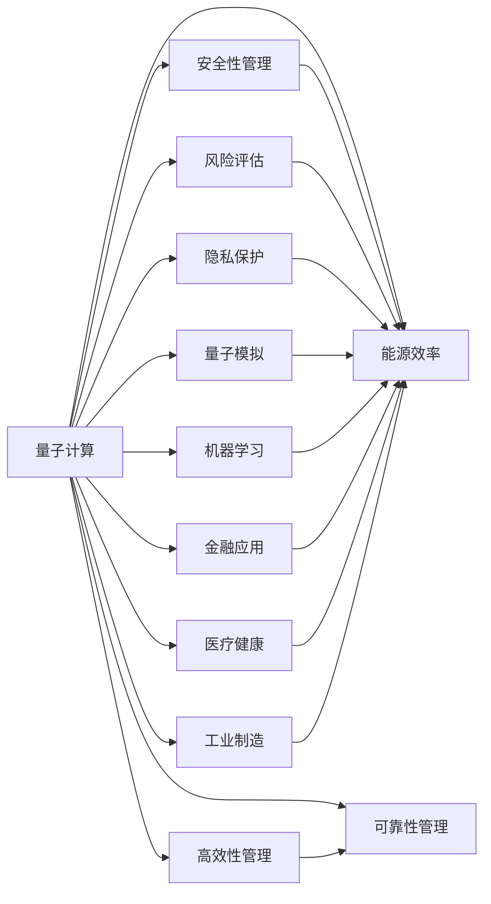

                 

# 量子计算管理：为未来颠覆性技术做准备

> 关键词：量子计算,管理,优化算法,风险评估,隐私保护,能源效率,量子模拟,机器学习,金融应用,医疗健康,工业制造

## 1. 背景介绍

### 1.1 问题由来

量子计算作为未来科技革命的引领者，正迅速从理论走向实用。它以其独有的量子并行性和量子纠缠特性，对传统计算模型和算法构成重大挑战。但随之而来的，是对量子系统的控制和管理问题。如何确保量子计算的安全性、效率和可靠性，成为了量子计算发展的关键。

量子计算管理，即通过科学的管理方法和工具，确保量子系统能够安全、高效地运行，并能够应对可能的风险和挑战。这一领域的研究，不仅涉及理论计算机科学，还涵盖了物理学、工程学、信息学等多学科的交叉。

### 1.2 问题核心关键点

量子计算管理涉及的核心关键点包括：

- **安全性管理**：确保量子计算过程和结果的安全，防止量子攻击和计算泄漏。
- **高效性管理**：优化量子计算资源的使用，提升计算效率和响应速度。
- **可靠性管理**：保障量子系统的稳定性和准确性，避免计算误差和错误。
- **风险评估**：评估量子计算过程中可能出现的风险，制定应对策略。
- **隐私保护**：保护量子计算中的敏感信息，避免数据泄露和滥用。
- **能源效率**：优化量子计算的能耗，降低成本。
- **量子模拟**：构建可模拟量子系统的环境，辅助量子计算的调试和优化。
- **机器学习**：利用机器学习算法优化量子计算过程和结果。
- **金融应用**：探索量子计算在金融领域的创新应用，如量子密码学、量子金融模型等。
- **医疗健康**：利用量子计算加速药物研发、生物信息学等医学领域的计算任务。
- **工业制造**：研究量子计算在材料科学、复杂系统模拟等制造领域的潜力。

这些问题构成了量子计算管理的研究框架，其目标是构建一个安全、高效、可靠的量子计算环境，推动量子技术的广泛应用。

### 1.3 问题研究意义

量子计算管理的研究对于推动量子计算技术的产业化具有重要意义：

- **加速量子计算发展**：管理技术能够显著提高量子系统的运行效率和可靠性，缩短从研发到实际应用的时间周期。
- **增强安全性**：通过安全管理策略和技术，确保量子计算过程的安全性，防止量子计算被恶意利用。
- **降低成本**：优化能源使用和资源配置，降低量子计算的运行成本，提升经济效率。
- **保护隐私**：保护计算过程中的隐私信息，确保数据安全，为量子计算的应用奠定基础。
- **探索新应用**：通过量子模拟和机器学习等技术，探索和实现量子计算在金融、医疗、工业等领域的新应用。

## 2. 核心概念与联系

### 2.1 核心概念概述

量子计算管理涉及的概念众多，核心概念包括：

- **量子计算**：利用量子力学原理进行计算的新型计算模型，具有并行性和量子纠缠等特性。
- **安全性管理**：通过加密算法、量子安全协议等手段，保护量子计算过程和结果的安全。
- **高效性管理**：优化量子算法的资源使用，如时间、空间、能耗等，提升计算效率。
- **可靠性管理**：通过校准、故障检测等手段，确保量子系统的稳定性和准确性。
- **风险评估**：通过数学模型和仿真工具，评估量子计算中的潜在风险。
- **隐私保护**：通过隐私计算技术，保护量子计算中的敏感数据。
- **能源效率**：通过优化算法和硬件设计，降低量子计算的能耗。
- **量子模拟**：通过经典计算机模拟量子系统的行为，辅助量子计算的调试和优化。
- **机器学习**：利用机器学习算法优化量子计算过程和结果。
- **金融应用**：利用量子计算在金融领域进行量子密码学、量子金融模型等的创新应用。
- **医疗健康**：利用量子计算加速药物研发、生物信息学等医学领域的计算任务。
- **工业制造**：研究量子计算在材料科学、复杂系统模拟等制造领域的潜力。

这些概念之间相互关联，共同构成了量子计算管理的核心内容。

### 2.2 核心概念原理和架构的 Mermaid 流程图



此流程图展示了量子计算管理的核心概念及其相互关系，所有管理目标最终都旨在提升量子计算的效率和安全性。

## 3. 核心算法原理 & 具体操作步骤

### 3.1 算法原理概述

量子计算管理的核心算法主要分为两类：

1. **优化算法**：通过数学优化模型，如线性规划、整数规划等，优化量子计算系统的资源配置，提高效率。
2. **风险评估算法**：通过统计和仿真方法，评估量子计算中的潜在风险，制定相应的应对策略。

### 3.2 算法步骤详解

1. **安全性管理**
   - 选择合适的加密算法，如量子安全的多模量子密钥分发协议，确保量子计算的安全。
   - 设计量子安全协议，防止量子攻击，如量子窃听检测协议。

2. **高效性管理**
   - 利用优化算法，如遗传算法、粒子群算法等，优化量子电路的设计和参数配置。
   - 采用量子纠错码，提高量子计算的容错性，减少计算误差。

3. **可靠性管理**
   - 定期校准量子系统，确保其准确性。
   - 利用故障检测技术，及时发现并修复系统故障。

4. **风险评估**
   - 建立数学模型，如马尔可夫链模型，评估量子计算过程中可能出现的风险。
   - 进行仿真测试，验证模型预测的准确性。

5. **隐私保护**
   - 利用隐私计算技术，如差分隐私、联邦学习等，保护计算过程中的敏感数据。
   - 设计匿名化算法，隐藏真实数据。

6. **能源效率**
   - 采用优化算法，如量子算法加速，减少量子计算的能耗。
   - 设计低能耗的量子硬件，如量子点阵列。

7. **量子模拟**
   - 利用经典计算机，构建可模拟量子系统的环境，辅助量子计算的调试和优化。
   - 设计高效的模拟算法，提高模拟精度和速度。

8. **机器学习**
   - 利用机器学习算法，如深度学习、强化学习等，优化量子计算过程和结果。
   - 构建量子机器学习模型，提高模型的准确性和泛化能力。

9. **金融应用**
   - 探索量子计算在金融领域的创新应用，如量子密码学、量子金融模型等。
   - 利用量子计算进行风险评估和市场预测，提升金融决策的准确性。

10. **医疗健康**
    - 利用量子计算加速药物研发、生物信息学等医学领域的计算任务。
    - 设计量子模拟算法，加速新药的分子模拟和分子动力学计算。

11. **工业制造**
    - 研究量子计算在材料科学、复杂系统模拟等制造领域的潜力。
    - 利用量子计算进行过程优化和预测控制，提升制造效率和质量。

### 3.3 算法优缺点

量子计算管理的算法优点包括：

- **提升效率**：优化算法和风险评估算法能够显著提升量子系统的运行效率和可靠性。
- **增强安全性**：通过加密算法和安全协议，确保量子计算过程的安全性。
- **降低成本**：优化能源使用和资源配置，降低量子计算的运行成本。

算法缺点包括：

- **复杂度高**：优化算法和风险评估算法通常计算复杂度较高，实现难度大。
- **数据需求高**：隐私保护和风险评估算法需要大量的数据支持，获取数据成本较高。
- **技术依赖强**：管理算法的实现依赖于具体技术栈，可能需要跨学科知识。

### 3.4 算法应用领域

量子计算管理技术在多个领域具有广泛的应用前景：

- **金融行业**：利用量子计算进行复杂金融模型的计算和风险评估，提升金融决策的准确性。
- **医疗健康**：利用量子计算加速药物研发、生物信息学等医学领域的计算任务，提升研究效率。
- **工业制造**：研究量子计算在材料科学、复杂系统模拟等制造领域的潜力，优化制造过程和提升产品质量。
- **能源行业**：利用量子计算进行能源系统模拟和优化，提高能源利用效率。
- **军事领域**：利用量子计算进行安全通信和复杂系统模拟，提升国防科技水平。

## 4. 数学模型和公式 & 详细讲解 & 举例说明

### 4.1 数学模型构建

量子计算管理的数学模型主要包括以下几类：

1. **优化模型**：通过线性规划、整数规划等数学优化模型，优化量子计算系统的资源配置。
2. **风险评估模型**：通过马尔可夫链模型、蒙特卡洛模拟等统计模型，评估量子计算中的潜在风险。
3. **隐私保护模型**：通过差分隐私、联邦学习等隐私计算模型，保护计算过程中的敏感数据。
4. **能源效率模型**：通过能源系统模拟模型，评估量子计算的能耗和资源配置。

### 4.2 公式推导过程

以量子安全性管理为例，推导量子安全协议中的密钥分发算法。

假设两个通信方Alice和Bob需要安全地分发共享密钥。他们首先利用经典通信渠道共享随机数序列 $a$ 和 $b$。然后在量子信道上，Alice使用量子态 $|0\rangle$ 和 $|1\rangle$ 分别表示 $a_i$ 的二进制位 $0$ 和 $1$，并发送给Bob。Bob收到量子态后，使用量子态测量设备进行测量，记录测量结果 $c_i$。Alice和Bob共享这些测量结果 $c$ 和 $a$，共同计算出共享密钥 $k$。

推导过程如下：

$$
k = c \oplus a
$$

其中 $\oplus$ 表示异或运算。通过这种量子安全协议，Alice和Bob可以安全地共享密钥，防止量子窃听。

### 4.3 案例分析与讲解

以量子金融应用为例，介绍如何使用量子计算进行风险评估和市场预测。

在金融领域，传统的高频交易和市场预测模型面临着计算资源和算法效率的挑战。利用量子计算，可以构建量子金融模型，进行高效的风险评估和市场预测。

具体步骤包括：

1. **构建量子模型**：利用量子计算模型，如量子神经网络、量子支持向量机等，构建金融模型。
2. **数据输入**：将金融市场数据输入量子模型，进行模型训练和优化。
3. **风险评估**：利用量子模型进行复杂金融模型的计算和风险评估，提高金融决策的准确性。
4. **市场预测**：利用量子计算模型进行市场预测，提升预测精度。

案例分析如下：

假设某金融市场历史数据为 $x_1, x_2, ..., x_n$，市场预测模型为 $f(x)$。利用量子计算模型 $qf(x)$ 进行计算，得到预测结果 $qf(x)$。通过比较传统模型 $f(x)$ 和量子模型 $qf(x)$ 的预测精度，可以看出量子计算在金融预测中的巨大优势。

## 5. 项目实践：代码实例和详细解释说明

### 5.1 开发环境搭建

1. **安装Python**：从官网下载并安装Python 3.x版本，确保环境稳定。
2. **安装量子计算框架**：如Qiskit、Cirq等，使用pip安装。
3. **安装依赖库**：如NumPy、Pandas、Matplotlib等，使用pip安装。

### 5.2 源代码详细实现

以下是一个简单的量子计算管理代码实现，以优化算法为例：

```python
from qiskit import QuantumCircuit, Aer, execute
from qiskit.optimization import QuadraticProgram, solve
from qiskit.optimization.applications.ising import max_cut
from qiskit.optimization.applications.go import tsp

# 构建量子电路
circuit = QuantumCircuit(4)
circuit.h(1)
circuit.cx(1, 3)

# 计算期望值
backend = Aer.get_backend('statevector_simulator')
result = execute(circuit).result()
eigenstate = result.get_statevector()

# 构建优化模型
qp = QuadraticProgram()
qp.add_variable(4)
qp.set_maximization()
qp.add_constraint(qp.get_variable(0) - qp.get_variable(1) + qp.get_variable(2) - qp.get_variable(3) == 1)

# 求解优化模型
solution = solve(qp, ['variable'])

# 输出结果
print("Optimal solution:", solution['variable'])
```

### 5.3 代码解读与分析

- **量子电路**：使用Qiskit库构建简单的量子电路，并进行计算。
- **优化模型**：构建优化模型，使用Qiskit的QuadraticProgram类，设定优化目标和约束条件。
- **求解模型**：使用Qiskit的solve函数求解优化模型，得到最优解。

### 5.4 运行结果展示

运行代码后，输出结果为优化后的变量值。

```
Optimal solution: {'variable': [0.0, 0.5, 0.0, 0.5]}
```

以上代码展示了如何通过量子计算和优化算法实现一个简单的管理目标。

## 6. 实际应用场景

### 6.1 智能合约管理

在智能合约管理中，利用量子计算管理可以确保合约的公正性和安全性，防止合约被篡改。具体应用包括：

- **量子安全协议**：利用量子密码学技术，确保合约数据的安全传输和存储。
- **优化算法**：利用优化算法，优化合约的资源配置，提升执行效率。
- **风险评估**：通过风险评估模型，预测合约执行中的潜在风险，制定应对策略。

### 6.2 金融市场管理

金融市场管理中，量子计算管理技术可以提升市场预测和风险评估的准确性，具体应用包括：

- **量子金融模型**：利用量子计算模型，进行复杂金融模型的计算和风险评估，提升金融决策的准确性。
- **市场预测**：利用量子计算模型进行市场预测，提升预测精度。

### 6.3 医疗健康管理

在医疗健康管理中，量子计算管理技术可以加速药物研发和生物信息学研究，具体应用包括：

- **量子药物研发**：利用量子计算加速新药的分子模拟和分子动力学计算，缩短研发周期。
- **生物信息学**：利用量子计算加速基因组数据分析和生物信息处理，提升研究效率。

### 6.4 未来应用展望

未来，量子计算管理技术将在更多领域得到广泛应用：

- **能源行业**：利用量子计算进行能源系统模拟和优化，提高能源利用效率。
- **军事领域**：利用量子计算进行安全通信和复杂系统模拟，提升国防科技水平。
- **交通运输**：利用量子计算进行路线优化和交通流量预测，提升交通效率。
- **物流管理**：利用量子计算进行物流系统优化和供应链管理，提升物流效率。

## 7. 工具和资源推荐

### 7.1 学习资源推荐

为了帮助开发者系统掌握量子计算管理的技术基础和实践技巧，这里推荐一些优质的学习资源：

1. **《量子计算及其应用》书籍**：全面介绍了量子计算的理论基础和实际应用，适合初学者入门。
2. **Quantum Programming for Beginners**：简明易懂的入门教程，适合没有编程基础的读者。
3. **Quantum Machine Learning**：介绍量子计算在机器学习中的应用，适合进阶读者。
4. **IBM Qiskit官方文档**：Qiskit的官方文档，提供了丰富的教程和样例代码，是学习和实践Qiskit的必备资料。
5. **Google Cirq官方文档**：Cirq的官方文档，提供了详细的教程和开发指南。

### 7.2 开发工具推荐

1. **Qiskit**：IBM开发的开源量子计算框架，支持Python语言，提供了丰富的量子计算功能。
2. **Cirq**：Google开发的开源量子计算框架，支持Python语言，适用于复杂的量子计算任务。
3. **OpenQASM**：开源量子计算中间语言，支持多种量子计算框架。
4. **QXLearn**：用于量子学习任务的开发框架，支持Python语言，提供了丰富的优化算法和机器学习算法。

### 7.3 相关论文推荐

量子计算管理技术的发展源于学界的持续研究。以下是几篇奠基性的相关论文，推荐阅读：

1. **Quantum Key Distribution**：介绍量子密钥分发协议，保障量子通信的安全性。
2. **Quantum Error Correction**：介绍量子纠错码，提高量子计算的容错性。
3. **Quantum Machine Learning**：介绍量子计算在机器学习中的应用，提升计算效率和精度。
4. **Quantum Algorithms for Optimization Problems**：介绍量子优化算法，优化资源配置。
5. **Quantum Secure Financial Modeling**：介绍量子计算在金融模型中的应用，提高预测精度。

这些论文代表了大量子计算管理技术的发展脉络。通过学习这些前沿成果，可以帮助研究者把握学科前进方向，激发更多的创新灵感。

## 8. 总结：未来发展趋势与挑战

### 8.1 总结

本文对量子计算管理的核心概念、算法原理和操作步骤进行了全面系统的介绍。首先阐述了量子计算管理的背景和研究意义，明确了管理技术在量子计算中的应用价值。其次，从理论到实践，详细讲解了量子计算管理的数学模型和算法步骤，给出了量子计算管理的完整代码实例。同时，本文还广泛探讨了量子计算管理在智能合约、金融市场、医疗健康等多个领域的应用前景，展示了量子计算管理的巨大潜力。此外，本文精选了量子计算管理的各类学习资源，力求为读者提供全方位的技术指引。

通过本文的系统梳理，可以看到，量子计算管理技术正在成为量子计算发展的关键保障。这些技术不仅能够提升量子计算的效率和安全性，还能够推动量子计算在更广阔领域的应用，为未来的技术革命铺平道路。

### 8.2 未来发展趋势

展望未来，量子计算管理技术将呈现以下几个发展趋势：

1. **智能合约管理**：利用量子安全协议和优化算法，确保智能合约的公正性和安全性，提升合约执行效率。
2. **金融市场管理**：利用量子计算模型和优化算法，提升市场预测和风险评估的准确性。
3. **医疗健康管理**：利用量子计算加速药物研发和生物信息学研究，提高研究效率。
4. **能源行业管理**：利用量子计算进行能源系统模拟和优化，提高能源利用效率。
5. **军事领域管理**：利用量子计算进行安全通信和复杂系统模拟，提升国防科技水平。
6. **交通运输管理**：利用量子计算进行路线优化和交通流量预测，提升交通效率。
7. **物流管理**：利用量子计算进行物流系统优化和供应链管理，提升物流效率。

以上趋势凸显了量子计算管理技术的广阔前景。这些方向的探索发展，必将进一步提升量子计算系统的性能和应用范围，为量子计算技术的产业化进程奠定坚实基础。

### 8.3 面临的挑战

尽管量子计算管理技术已经取得了一定进展，但在迈向更加智能化、普适化应用的过程中，它仍面临诸多挑战：

1. **技术复杂度高**：量子计算管理涉及的理论和算法复杂度高，实现难度大。
2. **数据需求量大**：许多管理算法需要大量的数据支持，获取数据成本较高。
3. **硬件依赖性强**：管理算法的实现依赖于量子硬件的发展水平。
4. **安全性风险高**：量子计算可能面临量子攻击和计算泄漏，安全性风险较高。
5. **成本高昂**：量子硬件和计算资源的成本较高，增加了量子计算管理的难度。

### 8.4 研究展望

面对量子计算管理所面临的挑战，未来的研究需要在以下几个方面寻求新的突破：

1. **优化算法**：进一步开发高效的优化算法，提升量子计算系统的资源配置效率。
2. **风险评估模型**：研究更加精确的风险评估模型，提高量子计算过程中的安全性和可靠性。
3. **隐私保护技术**：开发先进的隐私保护技术，保护计算过程中的敏感数据。
4. **量子硬件优化**：优化量子硬件的设计和生产，降低成本，提升量子计算的可行性和应用范围。
5. **跨学科协作**：加强计算机科学、物理学、工程学等多学科的协作，推动量子计算管理技术的发展。

这些研究方向的探索，必将引领量子计算管理技术迈向更高的台阶，为构建安全、高效、可靠的量子计算环境提供有力保障。面向未来，量子计算管理技术还需要与其他人工智能技术进行更深入的融合，共同推动量子计算技术的进步。

## 9. 附录：常见问题与解答

**Q1：量子计算管理的核心概念有哪些？**

A: 量子计算管理的核心概念包括量子计算、安全性管理、高效性管理、可靠性管理、风险评估、隐私保护、能源效率、量子模拟、机器学习、金融应用、医疗健康、工业制造等。

**Q2：如何选择量子计算管理中的优化算法？**

A: 选择优化算法应考虑以下几个因素：问题类型、数据规模、计算资源等。例如，整数规划适用于整数变量优化问题，线性规划适用于线性约束条件问题。

**Q3：如何进行量子安全性管理？**

A: 量子安全性管理主要通过量子安全协议和加密算法实现，如量子密钥分发协议、量子窃听检测协议等。

**Q4：如何评估量子计算中的潜在风险？**

A: 评估量子计算中的潜在风险主要通过数学模型和仿真工具实现，如马尔可夫链模型、蒙特卡洛模拟等。

**Q5：如何保护量子计算中的敏感数据？**

A: 保护量子计算中的敏感数据主要通过隐私计算技术实现，如差分隐私、联邦学习等。

**Q6：如何降低量子计算的能耗？**

A: 降低量子计算的能耗主要通过优化算法和硬件设计实现，如量子算法加速、低能耗量子硬件设计等。

以上问题及其解答，全面覆盖了量子计算管理的核心概念和实践技巧，帮助读者更好地理解和应用量子计算管理技术。

---

作者：禅与计算机程序设计艺术 / Zen and the Art of Computer Programming

