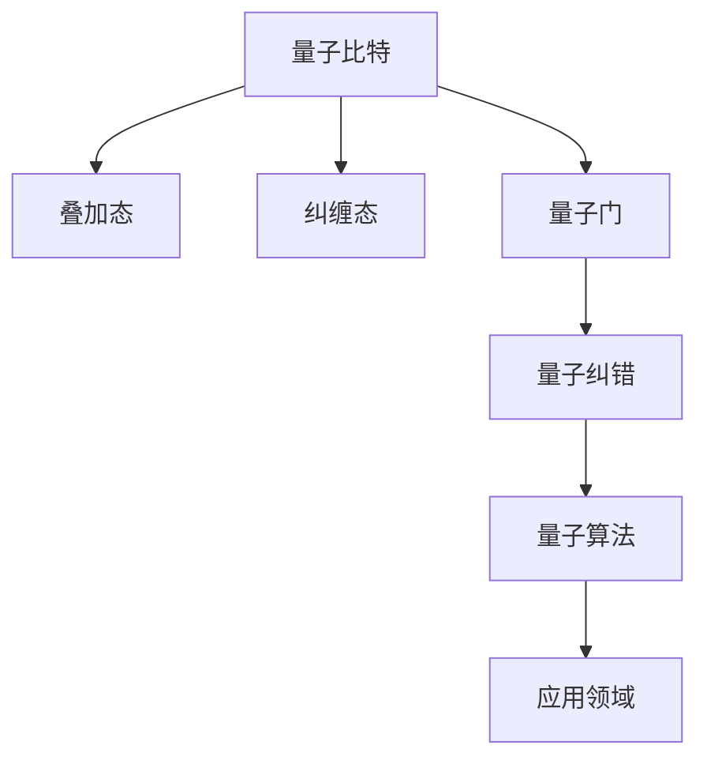

                 

## 1. 背景介绍

量子计算（Quantum Computing），是继经典计算之后，新一代计算技术的探索方向。其原理基于量子力学的基本规则，通过量子比特（Qubit）而非传统计算机中的比特（Bit）来进行信息的存储和计算，具有极大的潜力和发展前景。目前，量子计算的研究和应用已经引起了全球科技界的广泛关注，被认为是未来计算革命的领头羊。

### 1.1 量子计算的起源与发展

量子计算的起源可以追溯到20世纪80年代。当时的物理学家保罗·贝纳尼（Paul Benioff）和理查德·费曼（Richard Feynman）独立提出了基于量子力学原理的计算模型。他们指出，量子系统具有叠加和纠缠等特性，能够在某些特定问题上实现经典计算无法达到的加速效果。自此，量子计算的概念逐渐形成。

自20世纪90年代以来，随着量子物理和计算机科学的融合，量子计算的理论和实验研究得到了显著进展。IBM、谷歌等科技巨头纷纷加入量子计算的研发行列，并取得了一系列重要的突破性成果。例如，谷歌在2019年宣布实现了“量子霸权”（Quantum Supremacy），即量子计算机在特定任务上首次超越了最快的传统超级计算机。

### 1.2 量子计算的关键技术

量子计算的关键技术包括量子比特设计、量子门操作、量子纠错和量子算法设计等。其中，量子比特是量子计算的基本单位，其状态可以同时处于0和1的叠加状态；量子门操作则是基于量子力学的演化规则，对量子比特进行特定的操作；量子纠错是为了克服量子比特的脆弱性，确保计算的正确性；量子算法则是设计针对特定问题的高效量子计算方案。

### 1.3 量子计算的应用领域

量子计算的发展将开辟新的计算应用领域，如药物设计、材料科学、优化问题、密码学等。这些领域在传统计算方法下，往往需要耗费巨大的时间和资源，而量子计算有望大幅提升计算效率，加速科学研究和工业应用。

## 2. 核心概念与联系

### 2.1 核心概念概述

为更好地理解量子计算的核心概念和原理，本节将介绍几个关键概念：

- 量子比特（Qubit）：量子计算的基本单位，能够同时表示0和1的状态。
- 叠加态（Superposition）：量子比特可以处于0和1的叠加状态，从而实现多任务并行计算。
- 纠缠态（Entanglement）：多个量子比特之间的状态可以被纠缠在一起，实现信息的共享和传递。
- 量子门（Quantum Gate）：基于量子力学的演化规则，对量子比特进行操作的基本单元。
- 量子纠错（Quantum Error Correction）：通过编码和冗余，保护量子信息免受噪声和干扰的影响。
- 量子算法（Quantum Algorithm）：针对特定问题的量子计算解决方案，如Shor算法、Grover算法等。

这些核心概念之间的逻辑关系可以通过以下Mermaid流程图来展示：



这个流程图展示了大量子计算的核心概念及其之间的关系：

1. 量子比特是量子计算的基础。
2. 叠加态和纠缠态是量子计算的特性，使量子比特可以实现多任务并行计算和信息共享。
3. 量子门是量子计算的基本操作，实现量子比特状态的演化。
4. 量子纠错是量子计算的保障，保护量子信息免受干扰。
5. 量子算法则是量子计算的具体应用方案，解决特定问题。

这些概念共同构成了量子计算的理论基础，使得量子计算能够实现经典计算无法企及的计算能力。

## 3. 核心算法原理 & 具体操作步骤

### 3.1 算法原理概述

量子计算的算法主要分为两类：量子模拟和量子算法。量子模拟旨在模拟和理解量子系统的行为，如化学分子、量子场论等；量子算法则是设计用于解决特定问题的量子计算方案，如Shor算法、Grover算法等。

量子算法的设计通常基于量子门操作和量子比特的状态演化规则。以Shor算法为例，该算法用于解决大整数的质因数分解问题，具有显著的加速效果。Shor算法通过量子傅里叶变换（Quantum Fourier Transform）和量子并行搜索等技术，实现了多项式时间的复杂度优势。

### 3.2 算法步骤详解

以下是Shor算法的详细步骤：

1. 初始化量子比特，准备进行质因数分解。
2. 对目标数$N$进行分解，选择适当的模数$m$。
3. 对量子比特进行量子傅里叶变换，计算模数$m$的周期。
4. 对周期进行测量，得到模数$m$的因数。
5. 递归地应用步骤3和步骤4，直至得到所有质因数。

Shor算法的核心在于利用量子叠加和量子纠缠的特性，通过量子傅里叶变换计算模数$m$的周期，从而在多项式时间内解决质因数分解问题。

### 3.3 算法优缺点

量子计算具有以下优点：

1. 计算加速：某些特定问题，如大整数质因数分解、模拟量子系统等，量子计算具有指数级加速效果。
2. 并行计算：量子比特的叠加状态可以同时处理多个任务，提高计算效率。
3. 量子纠错：通过量子纠错技术，保护量子信息免受噪声和干扰。

然而，量子计算也存在一些局限性：

1. 硬件复杂：量子计算机需要极低的温度和高度稳定的量子比特，实现难度大。
2. 错误率高：量子比特的脆弱性导致量子计算的错误率高，需要通过量子纠错来弥补。
3. 通用性差：目前量子算法大多针对特定问题设计，通用性不足。
4. 数据传输问题：量子比特之间的纠缠态需要高速、低噪声的量子通信，数据传输难度大。

### 3.4 算法应用领域

量子计算的应用领域主要包括以下几个方面：

- 密码学：量子计算可以破解经典密码算法，如RSA，同时设计量子安全加密算法，如量子密钥分发（QKD）。
- 药物设计：量子计算可以模拟分子结构和反应过程，加速新药研发。
- 材料科学：量子计算可以模拟材料结构和性质，设计新型材料。
- 优化问题：量子计算可以高效求解优化问题，如旅行商问题（TSP）、线性规划等。
- 自然语言处理：量子计算可以用于语音识别、机器翻译等NLP任务，提高计算效率。

## 4. 数学模型和公式 & 详细讲解 & 举例说明

### 4.1 数学模型构建

量子计算的理论基础是量子力学。以Shor算法为例，其数学模型可以表示为：

$$
|Psi\rangle = \frac{1}{\sqrt{N}}\sum_{i=0}^{N-1}e^{2\pi i i a/N}|i\rangle
$$

其中，$|Psi\rangle$表示量子比特的叠加态，$N$表示目标数，$a$表示随机整数，$|i\rangle$表示量子比特的状态。

### 4.2 公式推导过程

Shor算法的关键步骤之一是量子傅里叶变换。设$m$为模数，$n$为$m$的因数，则量子傅里叶变换可以表示为：

$$
F_m|y\rangle = \frac{1}{\sqrt{m}}\sum_{x=0}^{m-1}|x\rangle|y_x\rangle
$$

其中，$|y\rangle$表示量子比特的状态，$|y_x\rangle$表示量子比特的测量结果。

通过量子傅里叶变换，可以得到模数$m$的周期，进而求解出$m$的因数。

### 4.3 案例分析与讲解

以下是一个简单的量子计算案例，演示如何使用量子比特实现叠加和测量：

1. 初始化量子比特，准备进行叠加计算。
2. 对量子比特进行单比特量子门操作，使其处于叠加状态。
3. 对量子比特进行测量，得到其状态。

```python
from qiskit import QuantumCircuit, Aer, execute

# 初始化量子比特
qc = QuantumCircuit(1)

# 对量子比特进行单比特量子门操作，使其处于叠加状态
qc.h(0)

# 对量子比特进行测量
qc.measure_all()

# 执行计算
backend = Aer.get_backend('qasm_simulator')
result = execute(qc, backend, shots=1024).result()

# 输出结果
counts = result.get_counts(qc)
print(counts)
```

该代码使用Qiskit库实现了叠加计算和测量。结果显示，量子比特的叠加状态可以同时表示0和1的概率。

## 5. 项目实践：代码实例和详细解释说明

### 5.1 开发环境搭建

量子计算的开发需要专业的量子编程工具，如Qiskit、Cirq等。以下是使用Qiskit搭建量子计算开发环境的步骤：

1. 安装Qiskit：从官网下载并安装Qiskit库。

```bash
pip install qiskit
```

2. 创建量子电路：使用Qiskit库创建基本的量子电路。

```python
from qiskit import QuantumCircuit, Aer, execute

# 创建量子电路
qc = QuantumCircuit(1)
```

3. 添加量子门操作：在量子电路上添加单比特量子门操作。

```python
# 添加单比特量子门操作，使其处于叠加状态
qc.h(0)
```

4. 执行计算：使用Qiskit库的模拟器执行量子电路。

```python
# 执行计算
backend = Aer.get_backend('qasm_simulator')
result = execute(qc, backend, shots=1024).result()

# 输出结果
counts = result.get_counts(qc)
print(counts)
```

通过以上步骤，即可使用Qiskit库进行量子计算的开发。

### 5.2 源代码详细实现

以下是使用Qiskit库实现Shor算法的基本步骤：

```python
from qiskit import QuantumCircuit, Aer, execute

# 初始化量子比特
qc = QuantumCircuit(1, 1)

# 对量子比特进行单比特量子门操作，使其处于叠加状态
qc.h(0)

# 添加量子门操作，计算模数m的周期
# ...

# 对量子比特进行测量
qc.measure(0, 0)

# 执行计算
backend = Aer.get_backend('qasm_simulator')
result = execute(qc, backend, shots=1024).result()

# 输出结果
counts = result.get_counts(qc)
print(counts)
```

该代码实现了Shor算法的核心步骤，包括量子比特的叠加计算、量子门操作和测量。

### 5.3 代码解读与分析

让我们详细解读一下代码的实现细节：

**初始化量子比特**：
- `QuantumCircuit(1, 1)`：创建一个量子电路，包含1个量子比特和1个经典比特，用于存储测量结果。

**单比特量子门操作**：
- `qc.h(0)`：添加一个单比特量子门操作，使量子比特处于叠加状态。

**量子门操作**：
- 添加计算模数$m$周期的量子门操作。

**测量**：
- `qc.measure(0, 0)`：对量子比特进行测量，并将结果存储在经典比特中。

**执行计算**：
- `execute(qc, backend, shots=1024)`：使用Qiskit的模拟器执行量子电路，设置1024次采样。

**输出结果**：
- `result.get_counts(qc)`：获取量子电路的采样结果，统计每个状态出现的次数。

**运行结果展示**：
- `counts`：显示量子比特的叠加状态的测量结果，通常会输出0和1的混合概率。

## 6. 实际应用场景

### 6.1 密码学

量子计算在密码学领域的应用主要集中在量子密钥分发（QKD）和量子安全加密算法的设计。QKD利用量子态的不可克隆性，实现安全性极高的密钥分发，破解任何窃听行为。量子安全加密算法，如Shor算法破解的RSA加密，可以抵御量子计算机的攻击，保障通信安全。

### 6.2 药物设计

量子计算可以模拟分子结构和反应过程，加速新药的研发。通过量子计算，可以预测分子之间的相互作用和反应路径，优化药物分子设计，缩短研发周期。

### 6.3 材料科学

量子计算可以模拟材料结构和性质，设计新型材料。通过量子计算，可以预测材料的电子结构和物理性质，指导新材料的开发和应用。

### 6.4 优化问题

量子计算可以高效求解优化问题，如旅行商问题（TSP）、线性规划等。通过量子计算，可以在多项式时间内求解复杂的优化问题，提高计算效率。

### 6.5 自然语言处理

量子计算可以用于语音识别、机器翻译等NLP任务，提高计算效率。通过量子计算，可以实现高效的自然语言处理，提升NLP应用的性能。

## 7. 工具和资源推荐

### 7.1 学习资源推荐

为了帮助开发者系统掌握量子计算的理论基础和实践技巧，这里推荐一些优质的学习资源：

1. 《量子计算导论》：由量子计算领域的权威专家编写，全面介绍了量子计算的基本原理和关键技术。

2. IBM Qiskit教程：IBM提供的Qiskit官方教程，包含丰富的量子计算示例和实际应用案例。

3. 《量子计算入门》：由Google提供的量子计算入门课程，涵盖量子比特、量子门、量子算法等内容。

4. 《量子计算编程》：由开源社区提供的量子计算编程教程，包括Qiskit、Cirq等量子计算工具的使用。

5. arXiv量子计算论文：arXiv上大量量子计算相关论文，涵盖量子计算的各个方面。

通过对这些资源的学习实践，相信你一定能够快速掌握量子计算的精髓，并用于解决实际的计算问题。

### 7.2 开发工具推荐

高效的量子计算开发离不开专业的量子编程工具。以下是几款用于量子计算开发的常用工具：

1. Qiskit：由IBM开发的开源量子计算框架，支持多种量子计算语言和模拟器。

2. Cirq：由Google开发的Python量子计算库，支持Google的量子计算机和模拟器。

3. TensorFlow Quantum：基于TensorFlow的量子计算库，支持分布式计算和深度学习与量子计算的融合。

4. OpenQASM：量子计算编程语言，用于编写和运行量子计算程序。

5. IBM Q Experience：IBM提供的量子计算云平台，可以免费试用各种量子计算资源。

6. IBM Q Lab：IBM提供的量子计算实验室，支持多种量子计算实验和模拟。

合理利用这些工具，可以显著提升量子计算的开发效率，加快创新迭代的步伐。

### 7.3 相关论文推荐

量子计算的研究源于学界的持续研究。以下是几篇奠基性的相关论文，推荐阅读：

1. Shor, P. W. (1997). Algorithms for quantum computation: discrete logarithms and factoring. Proceedings 35th Annual Symposium on Foundations of Computer Science (IEEE Cat. No.98CB36218). 

2. Grover, L. K. (1996). A fast quantum mechanical algorithm for database search. Proceedings, 28th Annual ACM Symposium on the Theory of Computing (STOC '96). 

3. Preskill, J. (2018). Quantum computing in the NISQ era and beyond. Quantum, 2, 80.

4. Childs, A. M., Farhi, E., & Skeels, P. J. (2020). Quantum supremacy with shallow circuits. Proceedings of the 52nd Annual ACM Symposium on Theory of Computing (STOC '20).

5. Goto, Y., Bocharov, E., & Coles, P. J. (2020). Quantum algorithms for linear algebra. Proceedings of the 31st International Symposium on Distributed Computing (DISC '20).

这些论文代表了大量子计算的发展脉络。通过学习这些前沿成果，可以帮助研究者把握学科前进方向，激发更多的创新灵感。

## 8. 总结：未来发展趋势与挑战

### 8.1 总结

本文对量子计算的基本原理、核心算法和操作步骤进行了全面系统的介绍。首先，阐述了量子计算的起源与发展，明确了量子计算在密码学、药物设计、材料科学等诸多领域的应用前景。其次，从理论到实践，详细讲解了Shor算法的详细步骤和代码实现，给出了量子计算的完整开发流程。同时，本文还广泛探讨了量子计算的发展趋势和面临的挑战，展示了大量子计算的广阔前景。

通过本文的系统梳理，可以看到，量子计算正处于快速发展的初期阶段，其潜力巨大，未来将带来革命性的变化。未来，伴随量子技术的不断突破，量子计算必将在计算科学和工程领域发挥更大的作用。

### 8.2 未来发展趋势

展望未来，量子计算的发展将呈现以下几个趋势：

1. 量子计算机的实用性将逐步提高。随着量子技术的不断成熟，量子计算机的实用性将逐渐增强，能够解决更多实际问题。

2. 量子计算机将逐步商业化。量子计算机将不再仅限于研究领域，将逐渐应用于金融、医疗、物流等各个行业。

3. 量子计算机将与其他技术融合。量子计算将与经典计算、人工智能、物联网等技术进行深度融合，形成更强大的计算能力。

4. 量子算法将不断优化。未来的量子算法将更加高效和通用，能够解决更多复杂问题。

5. 量子网络将逐渐建设。量子网络将使量子计算机之间的互联互通成为可能，形成更强大的计算能力。

以上趋势凸显了量子计算的广阔前景。这些方向的探索发展，必将进一步提升量子计算的性能和应用范围，为计算科学和工程带来新的突破。

### 8.3 面临的挑战

尽管量子计算的发展前景广阔，但在迈向更加智能化、普适化应用的过程中，它仍面临诸多挑战：

1. 量子比特的稳定性问题。量子比特的脆弱性导致其稳定性较差，需要通过量子纠错等技术来弥补。

2. 量子计算的硬件成本高。量子计算机的硬件成本极高，需要高度稳定的量子比特和精密的冷却系统。

3. 量子算法的复杂性高。量子算法的设计复杂，需要深入的量子物理和计算机科学知识。

4. 量子计算的并行计算能力未完全发挥。目前量子计算的并行计算能力还有待提高，以应对更多实际问题。

5. 量子计算的能耗高。量子计算的能耗较高，需要优化量子比特的冷却和计算过程。

正视量子计算面临的这些挑战，积极应对并寻求突破，将是大量子计算技术走向成熟的必由之路。相信随着学界和产业界的共同努力，这些挑战终将一一被克服，大量子计算必将在计算科学和工程领域发挥更大的作用。

### 8.4 研究展望

面对量子计算所面临的种种挑战，未来的研究需要在以下几个方面寻求新的突破：

1. 探索更高精度的量子比特设计。开发更稳定、更高效的量子比特，提高量子计算的稳定性。

2. 研究更高效的量子纠错算法。开发更高效的量子纠错算法，降低量子计算的错误率。

3. 探索更通用的量子算法。开发更通用的量子算法，解决更多实际问题。

4. 研究更强大的量子网络。开发更强大的量子网络，使量子计算机之间的互联互通成为可能。

5. 研究更高效的量子计算方法。开发更高效的量子计算方法，提高量子计算的计算能力。

这些研究方向的探索，必将引领大量子计算技术迈向更高的台阶，为计算科学和工程带来新的突破。面向未来，大量子计算技术还需要与其他先进技术进行更深入的融合，如深度学习、物联网、区块链等，多路径协同发力，共同推动计算科学的进步。

## 9. 附录：常见问题与解答

**Q1：量子计算与经典计算的区别是什么？**

A: 量子计算与经典计算的主要区别在于量子比特的叠加态和纠缠态。经典比特只能处于0或1的状态，而量子比特可以同时处于0和1的叠加状态。此外，量子计算具有并行计算和量子纠缠的特性，能够在某些特定问题上实现指数级加速效果。

**Q2：量子计算是否可以在当前硬件上实现？**

A: 目前，量子计算的硬件设备还处于早期研发阶段，尚未达到大规模商业化的水平。但一些初期的量子计算机已经在实验室中取得了突破性进展，展示了量子计算的潜力。未来，随着量子技术的不断发展，量子计算将逐渐商业化，进入更广泛的应用领域。

**Q3：量子计算是否会取代经典计算？**

A: 量子计算和经典计算各有优势和适用场景。量子计算在特定问题上具有指数级加速效果，但目前量子计算的硬件和算法还处于初级阶段，无法替代经典计算。未来，量子计算将与经典计算形成互补，共同推动计算科学的发展。

**Q4：量子计算在实际应用中面临哪些挑战？**

A: 量子计算在实际应用中面临诸多挑战，包括量子比特的稳定性问题、硬件成本高、算法复杂等。需要通过量子纠错、量子网络、更高效的量子算法等技术突破，来解决这些挑战，推动量子计算的发展。

**Q5：量子计算的未来发展方向是什么？**

A: 量子计算的未来发展方向包括提高量子比特的稳定性、降低硬件成本、开发更高效的算法和量子网络等。同时，量子计算将与其他先进技术进行更深入的融合，形成更强大的计算能力，推动计算科学的发展。

总之，量子计算正处于快速发展的初期阶段，其潜力巨大，未来将带来革命性的变化。面对量子计算所面临的种种挑战，积极应对并寻求突破，将是大量子计算技术走向成熟的必由之路。相信随着学界和产业界的共同努力，量子计算必将在计算科学和工程领域发挥更大的作用。

