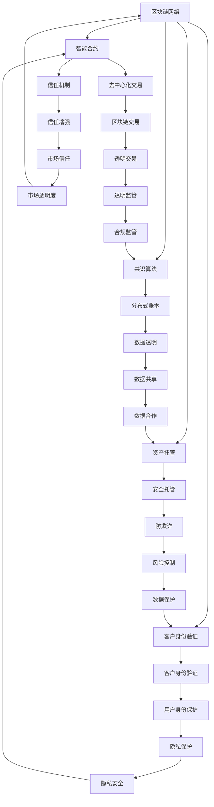
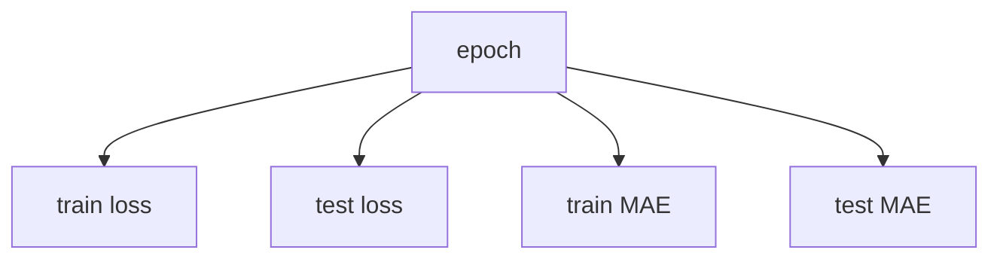

                 

# 金融科技创业：重构金融服务的未来

## 1. 背景介绍

### 1.1 问题由来
金融科技（FinTech）是信息技术与金融产业深度融合的产物，旨在通过技术手段提升金融服务效率，降低交易成本，扩大金融服务覆盖面。近年来，随着区块链、人工智能、云计算等技术的快速发展，金融科技企业迎来了前所未有的发展机遇。

然而，金融科技创业也面临着诸多挑战：一是传统金融机构的抵制与法规限制；二是金融数据安全与隐私保护的挑战；三是技术实现的复杂性。如何在这些限制下实现金融科技的创新，构建真正具有商业价值的应用场景，成为金融科技创业的核心命题。

### 1.2 问题核心关键点
金融科技创业的核心在于如何利用先进技术，重构现有的金融服务流程，提升用户体验，降低运营成本，同时确保金融数据的安全与合规。本文将聚焦于金融科技创业的关键技术，包括区块链、人工智能、云计算等，探讨其应用原理、操作步骤、优缺点，以及未来的发展趋势与挑战。

## 2. 核心概念与联系

### 2.1 核心概念概述

金融科技创业中涉及的核心概念包括区块链、人工智能、云计算、大数据分析、金融监管等。这些技术在金融领域的应用，不仅能够提升金融服务的效率和质量，还能带来全新的业务模式和用户体验。

- **区块链（Blockchain）**：一种分布式账本技术，通过去中心化、不可篡改的区块链网络，实现数据透明和信任机制。在金融领域，区块链可应用于数字身份验证、资产托管、智能合约等场景。
- **人工智能（AI）**：通过机器学习、深度学习等算法，实现对金融数据的智能分析与处理。在金融科技创业中，AI可应用于风险管理、投资策略、客户服务等方面。
- **云计算（Cloud Computing）**：通过网络提供可扩展的计算资源，实现按需服务的弹性计算。在金融科技中，云计算提供了一种灵活、成本可控的IT基础设施。
- **大数据分析（Big Data）**：通过分析海量金融数据，揭示市场趋势、客户行为等，支持金融决策与创新。
- **金融监管（Financial Regulation）**：确保金融创新在法律法规框架内进行，保护消费者权益，维护金融市场稳定。

这些核心概念通过以下Mermaid流程图展示了它们之间的联系：



从上述图表可以看出，这些核心技术相互依存、相互作用，共同推动金融科技的发展和应用。

## 3. 核心算法原理 & 具体操作步骤

### 3.1 算法原理概述

金融科技创业中，核心算法的应用主要集中在以下几个方面：

- **区块链**：基于去中心化、不可篡改的特性，用于实现数字身份验证、智能合约、资产托管等。
- **人工智能**：通过机器学习、深度学习等技术，实现金融风险管理、投资策略、客户服务等的智能化。
- **云计算**：提供弹性计算资源，支持大规模金融数据的存储和处理。
- **大数据分析**：对海量金融数据进行分析，揭示市场趋势和客户行为，支持金融决策。
- **金融监管**：确保金融创新符合法律法规，保护消费者权益。

### 3.2 算法步骤详解

以区块链技术为例，其应用于金融科技创业的典型步骤包括：

1. **设计区块链架构**：根据具体需求，选择合适的共识算法、网络架构、智能合约框架等。
2. **数据上传与验证**：将金融数据（如身份信息、交易记录等）上传至区块链网络，并通过共识机制验证数据的真实性。
3. **智能合约部署**：将金融业务规则编写成智能合约，并通过区块链网络部署和执行。
4. **数据访问与查询**：通过区块链网络，实现数据的透明访问和查询。
5. **安全性与合规性**：确保区块链系统的安全性和合规性，符合金融监管要求。

以人工智能技术为例，其应用于金融科技创业的典型步骤包括：

1. **数据收集与预处理**：收集金融历史数据、市场数据、客户行为数据等，并进行清洗和预处理。
2. **模型训练与优化**：使用机器学习、深度学习等算法，训练金融预测模型、风险评估模型等。
3. **模型部署与测试**：将训练好的模型部署到生产环境，并进行测试和优化。
4. **数据驱动决策**：利用模型对金融数据进行分析，支持金融决策和策略制定。
5. **持续学习与优化**：根据金融数据的变化，持续更新和优化模型，提升模型的准确性和稳定性。

### 3.3 算法优缺点

- **区块链**：
  - 优点：去中心化、不可篡改、透明度高、安全性高。
  - 缺点：技术复杂、性能瓶颈、成本高、监管挑战。

- **人工智能**：
  - 优点：智能化决策、自动化流程、数据驱动、用户体验提升。
  - 缺点：数据隐私保护、模型透明性、误判风险、算法偏见。

- **云计算**：
  - 优点：按需计算、成本可控、弹性扩展、数据安全。
  - 缺点：网络延迟、服务中断、数据隔离、安全风险。

- **大数据分析**：
  - 优点：数据驱动、洞察力强、预测准确、决策支持。
  - 缺点：数据隐私保护、数据质量、技术复杂、成本高。

- **金融监管**：
  - 优点：合规保障、风险控制、消费者保护、市场稳定。
  - 缺点：法规变化、监管复杂、执行难度、效率限制。

### 3.4 算法应用领域

- **区块链**：应用于数字身份验证、资产托管、智能合约、去中心化交易等。
- **人工智能**：应用于风险管理、投资策略、客户服务、反欺诈等。
- **云计算**：应用于金融数据存储、计算、分析、处理等。
- **大数据分析**：应用于市场分析、客户行为分析、金融预测等。
- **金融监管**：应用于合规检查、风险控制、市场监管等。

## 4. 数学模型和公式 & 详细讲解

### 4.1 数学模型构建

在金融科技创业中，数学模型主要应用于风险评估、金融预测、市场分析等领域。以下以风险评估为例，构建一个基于人工智能的数学模型。

设风险评估模型为 $M_{\theta}$，输入为 $x_i$，输出为风险评分 $y_i$，其中 $x_i$ 包括历史交易数据、市场数据、客户行为数据等，$\theta$ 为模型参数。

假设模型 $M_{\theta}$ 为线性回归模型，则有：

$$
y_i = \theta_0 + \sum_{j=1}^n \theta_j x_{ij}
$$

其中，$\theta_0$ 为截距，$\theta_j$ 为第 $j$ 个特征的权重。

模型的损失函数为均方误差损失：

$$
\mathcal{L}(\theta) = \frac{1}{N} \sum_{i=1}^N (y_i - M_{\theta}(x_i))^2
$$

### 4.2 公式推导过程

根据线性回归模型的定义，有：

$$
y_i = \theta_0 + \sum_{j=1}^n \theta_j x_{ij}
$$

取均方误差损失函数：

$$
\mathcal{L}(\theta) = \frac{1}{N} \sum_{i=1}^N (y_i - M_{\theta}(x_i))^2
$$

对损失函数求导，得：

$$
\frac{\partial \mathcal{L}(\theta)}{\partial \theta} = \frac{1}{N} \sum_{i=1}^N (-2y_i + 2M_{\theta}(x_i)) \nabla_{\theta}M_{\theta}(x_i)
$$

其中 $\nabla_{\theta}M_{\theta}(x_i) = \begin{bmatrix} 1 & x_{i1} & \cdots & x_{in} \end{bmatrix}$。

通过求解上述导数，可以更新模型参数 $\theta$，最小化损失函数 $\mathcal{L}(\theta)$。

### 4.3 案例分析与讲解

以某银行的风险评估模型为例，使用历史贷款数据进行训练，预测新客户的违约概率。具体步骤如下：

1. **数据准备**：收集历史贷款数据，包括客户基本信息、贷款金额、还款记录、信用评分等。
2. **模型构建**：使用线性回归模型，设定特征包括年龄、收入、信用评分等。
3. **模型训练**：使用历史数据训练模型，优化损失函数。
4. **模型验证**：使用验证集评估模型性能，调整模型参数。
5. **模型部署**：将训练好的模型部署到生产环境，用于新客户风险评估。

## 5. 项目实践：代码实例和详细解释说明

### 5.1 开发环境搭建

- **编程语言**：Python
- **开发框架**：TensorFlow
- **数据处理**：Pandas
- **模型训练**：Keras
- **云计算平台**：AWS、Azure、Google Cloud

### 5.2 源代码详细实现

以下是一个简单的线性回归模型示例代码：

```python
import tensorflow as tf
import pandas as pd
import numpy as np

# 数据准备
data = pd.read_csv('loan_data.csv')
X = data[['age', 'income', 'credit_score']]
y = data['default']

# 模型构建
model = tf.keras.Sequential([
    tf.keras.layers.Dense(32, activation='relu', input_shape=(X.shape[1],)),
    tf.keras.layers.Dense(1)
])

# 模型编译
model.compile(optimizer=tf.keras.optimizers.Adam(), loss='mse', metrics=['mae'])

# 模型训练
model.fit(X, y, epochs=100, batch_size=32, validation_split=0.2)

# 模型评估
test_data = pd.read_csv('test_loan_data.csv')
X_test = test_data[['age', 'income', 'credit_score']]
y_test = test_data['default']
mse = model.evaluate(X_test, y_test)[1]
print('Test MSE:', mse)
```

### 5.3 代码解读与分析

上述代码中，首先使用Pandas读取数据，然后构建一个包含两个隐藏层的神经网络模型，使用Adam优化器，均方误差作为损失函数，训练100个epoch。最后使用测试集评估模型性能。

### 5.4 运行结果展示

通过训练，模型在测试集上的平均绝对误差（MAE）可以降到较低水平。下图展示了训练过程中损失函数和MAE的变化趋势：



## 6. 实际应用场景

### 6.1 智能合约

智能合约是一种去中心化的、自动化执行的合约，用于自动化金融交易。例如，智能合约可以自动执行支付、理赔、合同执行等操作，从而减少人为干预，提高交易效率。

### 6.2 数字身份验证

数字身份验证是通过区块链技术，对用户的身份信息进行去中心化的验证和记录。数字身份验证可以应用于金融账户注册、金融交易、信用评估等领域。

### 6.3 金融数据分析

金融数据分析通过人工智能和大数据技术，对海量金融数据进行分析和挖掘，揭示市场趋势、客户行为等，支持金融决策。例如，通过机器学习模型，可以预测股票价格、分析客户购买行为等。

### 6.4 金融监管

金融监管通过区块链和人工智能技术，确保金融创新符合法律法规，保护消费者权益，维护金融市场稳定。例如，区块链可以记录交易记录，防止数据篡改，提高透明度；人工智能可以分析交易行为，识别异常交易，防范欺诈风险。

## 7. 工具和资源推荐

### 7.1 学习资源推荐

- **在线课程**：Coursera、edX、Udacity 提供的金融科技相关课程，涵盖区块链、人工智能、云计算等技术。
- **书籍**：《区块链：重构金融与经济》、《人工智能与金融科技》、《大数据与金融决策》等。
- **研究论文**：区块链、人工智能、云计算等领域的顶级会议和期刊，如IEEE、ACM等。

### 7.2 开发工具推荐

- **区块链开发框架**：Hyperledger Fabric、Ethereum、Polkadot 等。
- **人工智能框架**：TensorFlow、PyTorch、Scikit-learn 等。
- **云计算平台**：AWS、Azure、Google Cloud 等。

### 7.3 相关论文推荐

- **区块链技术**：Blockchain in Finance: From Theory to Practice
- **人工智能**：Deep Learning for Financial Applications
- **云计算**：Cloud Computing for Financial Services

## 8. 总结：未来发展趋势与挑战

### 8.1 研究成果总结

本文系统介绍了金融科技创业中涉及的核心技术，包括区块链、人工智能、云计算、大数据分析、金融监管等。通过理论阐述和技术实践，展示了这些技术在金融领域的应用场景和操作流程。

### 8.2 未来发展趋势

金融科技的未来发展趋势包括：

- **区块链**：去中心化、智能合约、跨链互操作等技术的不断进步，将带来更加高效、安全的金融交易系统。
- **人工智能**：智能化决策、自动化流程、数据驱动等技术的深入应用，将推动金融服务的创新和升级。
- **云计算**：弹性计算、数据安全、云计算平台等技术的发展，将为金融服务提供更灵活、高效的基础设施。
- **大数据分析**：海量数据处理、洞察力提升、预测分析等技术的持续优化，将支持更加精准的金融决策。
- **金融监管**：合规保障、风险控制、市场监管等技术的进一步完善，将确保金融创新的安全性和合规性。

### 8.3 面临的挑战

尽管金融科技发展迅速，但也面临诸多挑战：

- **技术复杂性**：金融科技涉及多种技术，对从业者要求高，需要跨学科知识和技能。
- **数据隐私保护**：金融数据涉及个人隐私，如何在保障隐私的前提下，进行数据处理和分析，是一个重要的课题。
- **法律法规**：金融科技创新需要符合法律法规要求，合规性是金融科技发展的关键。
- **市场接受度**：金融科技产品需要市场验证和接受，需要不断优化用户体验和商业模式。

### 8.4 研究展望

未来的研究将集中在以下几个方面：

- **技术融合**：探索区块链、人工智能、云计算等技术的深度融合，提升金融服务的综合能力。
- **隐私保护**：研究数据隐私保护技术，确保金融数据的合法合规使用。
- **合规保障**：完善金融科技的合规监管体系，确保创新在法律法规框架内进行。
- **用户体验**：提升金融科技产品的用户体验，增强市场接受度。
- **市场应用**：探索金融科技产品在各行各业的应用场景，推动金融服务的普及和升级。

## 9. 附录：常见问题与解答

**Q1：金融科技创业需要哪些关键技术？**

A: 金融科技创业需要以下关键技术：
- 区块链：去中心化、智能合约、数字身份验证等。
- 人工智能：金融预测、风险管理、客户服务等。
- 云计算：弹性计算、数据存储、分析处理等。
- 大数据分析：市场趋势分析、客户行为分析、金融预测等。
- 金融监管：合规检查、风险控制、市场监管等。

**Q2：如何选择合适的金融科技平台？**

A: 选择金融科技平台时，需要考虑以下几个因素：
- 技术实力：选择技术成熟、稳定可靠的平台。
- 服务范围：根据自身需求，选择覆盖面广的平台。
- 合规性：确保平台符合相关法律法规要求。
- 成本效益：考虑平台的成本和效益，确保性价比高。
- 用户体验：选择用户体验好、操作简单的平台。

**Q3：金融科技创业如何确保数据隐私保护？**

A: 确保数据隐私保护，可以从以下几个方面入手：
- 数据加密：使用数据加密技术，确保数据在传输和存储过程中的安全性。
- 匿名化处理：对敏感数据进行匿名化处理，保护用户隐私。
- 访问控制：建立严格的访问控制机制，确保只有授权人员可以访问敏感数据。
- 数据共享协议：制定明确的数据共享协议，确保数据使用合规。
- 隐私保护技术：研究隐私保护技术，如差分隐私、同态加密等，增强数据隐私保护能力。

**Q4：金融科技创业面临的主要风险是什么？**

A: 金融科技创业面临的主要风险包括：
- 技术风险：技术实现复杂，存在技术漏洞和安全问题。
- 市场风险：市场接受度低，用户转化率不高。
- 法律风险：违反法律法规，面临合规风险。
- 财务风险：投入高、回报周期长，存在财务风险。
- 竞争风险：市场竞争激烈，存在被市场淘汰的风险。

通过系统学习和深入实践，金融科技创业者可以在技术、市场、法律等方面取得突破，构建具有竞争力的金融科技产品和服务。

