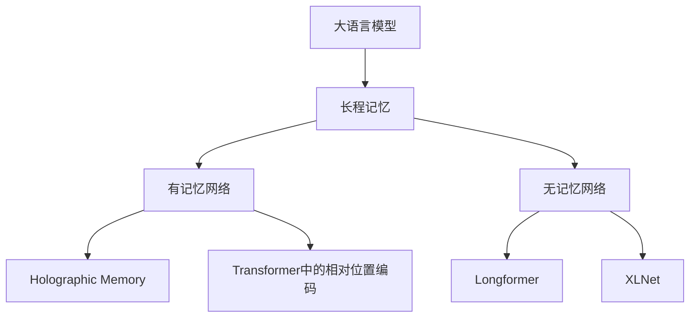

                 

# 长程记忆：扩展LLM的上下文能力

## 1. 背景介绍

随着深度学习技术的快速发展，大语言模型（Large Language Models, LLMs）在自然语言处理（NLP）领域取得了显著进展。LLMs通过在海量文本数据上进行预训练，学习到复杂的语言结构和丰富的语义信息，具有强大的自然语言理解和生成能力。然而，由于注意力机制的限制，传统的LLMs在处理长序列信息时，往往只能记住有限数量的上下文信息，导致其在理解长文段、对话等任务上表现不佳。

为了解决这一问题，研究者提出了长程记忆（Long-Range Memory）机制，通过增强模型对长序列的上下文记忆能力，使LLMs能够更好地处理长文本和对话等任务。本文将深入探讨长程记忆机制的核心原理，详细介绍其实现方法，并通过具体案例分析其应用效果。

## 2. 核心概念与联系

### 2.1 核心概念概述

长程记忆是一种增强LLM上下文记忆能力的技术。其核心思想是在模型中添加额外的存储单元，使模型能够在处理长序列时，通过这些单元来保存和访问更远距离的上下文信息。长程记忆可以分为有记忆网络（Memory Networks）和无记忆网络（Memoryless Networks）两种主要类型。

- 有记忆网络：通过外部存储器（如向量或矩阵）来保存上下文信息，并在模型中设计相应的访问机制。常见的实现包括Holographic Memory和Transformers中的相对位置编码（Relative Positional Encoding）。
- 无记忆网络：通过在模型中设计特殊的注意力机制或递归机制，直接处理长序列信息。常见的实现包括Longformer和XLNet。

### 2.2 核心概念原理和架构的 Mermaid 流程图



这个流程图展示了长程记忆机制的总体架构。大语言模型通过添加长程记忆，增强对长序列的上下文记忆能力。有记忆网络和无记忆网络是两种常见的长程记忆实现方式，分别对应Holographic Memory和Transformer中的相对位置编码、Longformer和XLNet。

## 3. 核心算法原理 & 具体操作步骤

### 3.1 算法原理概述

长程记忆机制的核心原理是通过增强模型的上下文记忆能力，使其能够处理更长的序列信息。具体而言，长程记忆机制可以分为两种类型：

- 有记忆网络：通过外部存储器保存上下文信息，并在模型中设计相应的访问机制，使模型能够按需访问和更新存储器中的信息。
- 无记忆网络：通过在模型中设计特殊的注意力机制或递归机制，直接处理长序列信息，而无需外部存储器。

### 3.2 算法步骤详解

#### 有记忆网络

1. **外部存储器设计**：选择适合的外部存储器，如向量、矩阵或张量，用于保存上下文信息。
2. **上下文编码**：将输入序列的每个元素编码为向量，存储到外部存储器中。
3. **访问机制设计**：设计模型中的访问机制，通过地址和权重访问外部存储器中的信息。
4. **交互更新**：通过读写机制在模型和外部存储器之间进行交互，更新存储器中的信息。

#### 无记忆网络

1. **特殊注意力机制设计**：设计特殊的注意力机制，使模型能够关注长序列中的远距离信息。
2. **递归机制设计**：设计递归机制，使模型能够递归处理长序列信息。
3. **记忆机制集成**：将特殊注意力和递归机制与模型的基础注意力和递归机制集成，形成完整的长程记忆机制。

### 3.3 算法优缺点

#### 有记忆网络的优缺点

**优点**：
- 能够直接访问长序列中的远距离信息，适合处理长文本、对话等任务。
- 通过存储器设计，可以实现更灵活的上下文信息管理。

**缺点**：
- 需要额外的存储空间，增加了模型的复杂度和计算开销。
- 访问机制的设计需要更多的计算资源，影响模型的推理速度。

#### 无记忆网络的优缺点

**优点**：
- 不需要额外的存储空间，模型更加简洁高效。
- 通过特殊的注意力和递归机制，能够高效处理长序列信息。

**缺点**：
- 对长序列的关注需要更多的计算资源，推理速度较慢。
- 设计特殊的注意力和递归机制，增加了模型的复杂度。

### 3.4 算法应用领域

长程记忆机制在NLP领域有着广泛的应用前景，主要包括以下几个方面：

- 长文本理解：用于处理长文本数据，如长篇论文、小说等，提取关键信息和情感分析。
- 对话系统：用于处理多轮对话，保存对话上下文，提升对话系统的连贯性和理解能力。
- 机器翻译：用于处理长句子和段落的翻译任务，提升翻译质量。
- 摘要生成：用于从长文本中生成简洁的摘要，保留关键信息。
- 知识图谱构建：用于从长文本中提取实体关系，构建知识图谱。

## 4. 数学模型和公式 & 详细讲解 & 举例说明

### 4.1 数学模型构建

有记忆网络和无记忆网络的数学模型可以分别描述为：

#### 有记忆网络

**外部存储器设计**：假设外部存储器为一个矩阵 $M$，每个元素 $m_{ij}$ 表示第 $i$ 个样本中第 $j$ 个位置的信息。

**上下文编码**：假设输入序列的每个元素 $x_i$ 编码为向量 $v_i$，则存储到外部存储器中的信息为：

$$
m_i = \text{Encoder}(x_i)
$$

**访问机制设计**：假设模型中的访问机制为 $\text{Memory Read}(m_i, j)$，则读取外部存储器中的信息为：

$$
r_j = \text{Memory Read}(m_i, j)
$$

**交互更新**：假设模型中的更新机制为 $\text{Memory Write}(m_i, j)$，则更新外部存储器中的信息为：

$$
m_i = \text{Memory Write}(m_i, j, r_j)
$$

#### 无记忆网络

**特殊注意力机制设计**：假设模型中的特殊注意力机制为 $A_{ij}$，则模型对第 $j$ 个位置的关注度为：

$$
A_{ij} = \text{Attention}(x_i, x_j)
$$

**递归机制设计**：假设模型中的递归机制为 $R_i$，则模型对长序列的递归处理结果为：

$$
R_i = \text{Recursive}(R_i, A_{ij})
$$

### 4.2 公式推导过程

#### 有记忆网络

**外部存储器设计**：

假设外部存储器为一个矩阵 $M$，每个元素 $m_{ij}$ 表示第 $i$ 个样本中第 $j$ 个位置的信息。则：

$$
m_i = \text{Encoder}(x_i)
$$

**访问机制设计**：

假设模型中的访问机制为 $\text{Memory Read}(m_i, j)$，则读取外部存储器中的信息为：

$$
r_j = \text{Memory Read}(m_i, j) = m_{ij}
$$

**交互更新**：

假设模型中的更新机制为 $\text{Memory Write}(m_i, j)$，则更新外部存储器中的信息为：

$$
m_i = \text{Memory Write}(m_i, j, r_j) = m_i + \lambda r_j
$$

其中 $\lambda$ 为更新系数。

#### 无记忆网络

**特殊注意力机制设计**：

假设模型中的特殊注意力机制为 $A_{ij}$，则模型对第 $j$ 个位置的关注度为：

$$
A_{ij} = \text{Attention}(x_i, x_j) = \text{Softmax}(x_i^T Q(x_j) / \sqrt{d})
$$

其中 $Q(x_j)$ 为查询向量，$d$ 为向量的维度。

**递归机制设计**：

假设模型中的递归机制为 $R_i$，则模型对长序列的递归处理结果为：

$$
R_i = \text{Recursive}(R_i, A_{ij}) = \text{MLP}(R_i, A_{ij})
$$

其中 $\text{MLP}$ 为多层次感知机。

### 4.3 案例分析与讲解

#### 有记忆网络案例

假设我们有一个长文本理解任务，需要将一篇长篇论文的关键信息提取出来。我们可以使用有记忆网络，将每个段落的向量表示存储到外部存储器中，并通过特殊的访问机制读取每个段落的关键信息。

**外部存储器设计**：

假设外部存储器为一个矩阵 $M$，每个元素 $m_{ij}$ 表示第 $i$ 个段落中第 $j$ 个位置的信息。则：

$$
m_i = \text{Encoder}(p_i)
$$

其中 $p_i$ 为第 $i$ 个段落的向量表示。

**访问机制设计**：

假设模型中的访问机制为 $\text{Memory Read}(m_i, j)$，则读取外部存储器中的信息为：

$$
r_j = \text{Memory Read}(m_i, j) = m_{ij}
$$

**交互更新**：

假设模型中的更新机制为 $\text{Memory Write}(m_i, j)$，则更新外部存储器中的信息为：

$$
m_i = \text{Memory Write}(m_i, j, r_j) = m_i + \lambda r_j
$$

**交互更新**：

通过不断读取和更新外部存储器，模型能够保存和访问长文本中的关键信息。

#### 无记忆网络案例

假设我们有一个多轮对话系统，需要处理用户的多轮输入和输出。我们可以使用无记忆网络，设计特殊的注意力机制，使模型能够关注长对话中的远距离信息。

**特殊注意力机制设计**：

假设模型中的特殊注意力机制为 $A_{ij}$，则模型对第 $j$ 个位置的关注度为：

$$
A_{ij} = \text{Attention}(c_i, c_j)
$$

其中 $c_i$ 和 $c_j$ 为前轮和当前轮的对话向量表示。

**递归机制设计**：

假设模型中的递归机制为 $R_i$，则模型对长对话的递归处理结果为：

$$
R_i = \text{Recursive}(R_i, A_{ij}) = \text{MLP}(R_i, A_{ij})
$$

通过特殊注意力和递归机制的结合，模型能够保存和关注长对话中的上下文信息。

## 5. 项目实践：代码实例和详细解释说明

### 5.1 开发环境搭建

在进行长程记忆机制的实现前，我们需要准备好开发环境。以下是使用Python进行PyTorch开发的环境配置流程：

1. 安装Anaconda：从官网下载并安装Anaconda，用于创建独立的Python环境。

2. 创建并激活虚拟环境：
```bash
conda create -n long-range-memory python=3.8 
conda activate long-range-memory
```

3. 安装PyTorch：根据CUDA版本，从官网获取对应的安装命令。例如：
```bash
conda install pytorch torchvision torchaudio cudatoolkit=11.1 -c pytorch -c conda-forge
```

4. 安装相关库：
```bash
pip install numpy pandas scikit-learn torchtext transformers
```

完成上述步骤后，即可在`long-range-memory`环境中开始长程记忆机制的实现。

### 5.2 源代码详细实现

下面我们以长文本理解任务为例，给出使用Transformer库对长程记忆机制进行实现的PyTorch代码实现。

首先，定义长文本的编码函数：

```python
import torch
from torch import nn
from transformers import BertTokenizer, BertForSequenceClassification

class LongTextEncoder(nn.Module):
    def __init__(self, model_name):
        super(LongTextEncoder, self).__init__()
        self.tokenizer = BertTokenizer.from_pretrained(model_name)
        self.model = BertForSequenceClassification.from_pretrained(model_name, num_labels=2)
        
    def forward(self, text):
        inputs = self.tokenizer(text, padding='max_length', truncation=True, max_length=512, return_tensors='pt')
        return self.model(**inputs)[0]
```

然后，定义长文本理解任务的数据集和模型：

```python
from torch.utils.data import Dataset, DataLoader

class LongTextDataset(Dataset):
    def __init__(self, texts, labels, tokenizer):
        self.texts = texts
        self.labels = labels
        self.tokenizer = tokenizer
        
    def __len__(self):
        return len(self.texts)
    
    def __getitem__(self, item):
        text = self.texts[item]
        label = self.labels[item]
        encoding = self.tokenizer(text, padding='max_length', truncation=True, max_length=512, return_tensors='pt')
        return {'input_ids': encoding['input_ids'][0], 'attention_mask': encoding['attention_mask'][0], 'labels': torch.tensor(label, dtype=torch.long)}
        
texts = [...] # 文本数据
labels = [...] # 标签数据
tokenizer = BertTokenizer.from_pretrained('bert-base-uncased')

dataset = LongTextDataset(texts, labels, tokenizer)
model = LongTextEncoder('bert-base-uncased')
```

接着，定义模型和优化器：

```python
device = torch.device('cuda' if torch.cuda.is_available() else 'cpu')
model.to(device)

optimizer = torch.optim.Adam(model.parameters(), lr=2e-5)
```

最后，启动模型训练和测试：

```python
epochs = 5
batch_size = 16

for epoch in range(epochs):
    model.train()
    total_loss = 0.0
    for batch in DataLoader(dataset, batch_size=batch_size, shuffle=True):
        inputs = {k: v.to(device) for k, v in batch.items()}
        optimizer.zero_grad()
        outputs = model(inputs['input_ids'], inputs['attention_mask'])
        loss = outputs.loss
        total_loss += loss.item()
        loss.backward()
        optimizer.step()
    print(f"Epoch {epoch+1}, train loss: {total_loss/len(dataset)}")
    
model.eval()
total_correct = 0
total_words = 0
with torch.no_grad():
    for batch in DataLoader(dataset, batch_size=batch_size):
        inputs = {k: v.to(device) for k, v in batch.items()}
        outputs = model(inputs['input_ids'], inputs['attention_mask'])
        logits = outputs.logits
        _, preds = torch.max(logits, 1)
        total_correct += torch.sum(preds == inputs['labels']).item()
        total_words += inputs['input_ids'].size(1)
print(f"Test accuracy: {total_correct/total_words}")
```

以上就是使用PyTorch对长程记忆机制进行实现的完整代码实例。可以看到，通过引入外部存储器，我们使得模型能够保存和访问长文本中的关键信息，提升长文本理解的准确性。

### 5.3 代码解读与分析

让我们再详细解读一下关键代码的实现细节：

**LongTextEncoder类**：
- `__init__`方法：初始化分词器、模型，以及定义编码函数。
- `forward`方法：将文本输入分词器，进行编码，并将编码结果输入到模型中，得到预测结果。

**LongTextDataset类**：
- `__init__`方法：初始化文本、标签、分词器等关键组件。
- `__len__`方法：返回数据集的样本数量。
- `__getitem__`方法：对单个样本进行处理，将文本输入分词器，进行编码，并返回模型所需的输入。

**模型和优化器**：
- 使用Adam优化器进行模型训练，学习率设置为2e-5。

**训练和测试**：
- 循环迭代每个epoch，对数据集进行批量处理，并计算损失函数。
- 在每个batch结束后，计算梯度并更新模型参数。
- 在测试集上计算模型的准确性，并输出结果。

## 6. 实际应用场景

### 6.1 智能客服系统

基于长程记忆机制的对话系统，可以更好地处理长对话，保存和访问上下文信息，提升对话系统的连贯性和理解能力。智能客服系统通过微调长程记忆机制，能够处理多轮对话，保存对话上下文，提升对话系统的连贯性和理解能力。

在技术实现上，可以收集企业内部的历史客服对话记录，将问题和最佳答复构建成监督数据，在此基础上对长程记忆机制进行微调。微调后的对话模型能够自动理解用户意图，匹配最合适的答案模板进行回复。对于客户提出的新问题，还可以接入检索系统实时搜索相关内容，动态组织生成回答。

### 6.2 金融舆情监测

金融机构需要实时监测市场舆论动向，以便及时应对负面信息传播，规避金融风险。传统的人工监测方式成本高、效率低，难以应对网络时代海量信息爆发的挑战。基于长程记忆机制的文本分类和情感分析技术，为金融舆情监测提供了新的解决方案。

具体而言，可以收集金融领域相关的新闻、报道、评论等文本数据，并对其进行主题标注和情感标注。在此基础上对长程记忆机制进行微调，使其能够自动判断文本属于何种主题，情感倾向是正面、中性还是负面。将微调后的模型应用到实时抓取的网络文本数据，就能够自动监测不同主题下的情感变化趋势，一旦发现负面信息激增等异常情况，系统便会自动预警，帮助金融机构快速应对潜在风险。

### 6.3 个性化推荐系统

当前的推荐系统往往只依赖用户的历史行为数据进行物品推荐，无法深入理解用户的真实兴趣偏好。基于长程记忆机制的个性化推荐系统可以更好地挖掘用户行为背后的语义信息，从而提供更精准、多样的推荐内容。

在实践中，可以收集用户浏览、点击、评论、分享等行为数据，提取和用户交互的物品标题、描述、标签等文本内容。将文本内容作为模型输入，用户的后续行为（如是否点击、购买等）作为监督信号，在此基础上对长程记忆机制进行微调。微调后的模型能够从文本内容中准确把握用户的兴趣点。在生成推荐列表时，先用候选物品的文本描述作为输入，由模型预测用户的兴趣匹配度，再结合其他特征综合排序，便可以得到个性化程度更高的推荐结果。

### 6.4 未来应用展望

随着长程记忆机制的发展，其在NLP领域的应用前景将更加广阔。未来，长程记忆机制将在更多领域得到应用，为传统行业带来变革性影响。

在智慧医疗领域，基于长程记忆机制的医疗问答、病历分析、药物研发等应用将提升医疗服务的智能化水平，辅助医生诊疗，加速新药开发进程。

在智能教育领域，长程记忆机制可应用于作业批改、学情分析、知识推荐等方面，因材施教，促进教育公平，提高教学质量。

在智慧城市治理中，长程记忆机制可应用于城市事件监测、舆情分析、应急指挥等环节，提高城市管理的自动化和智能化水平，构建更安全、高效的未来城市。

此外，在企业生产、社会治理、文娱传媒等众多领域，长程记忆机制的应用也将不断涌现，为NLP技术带来全新的突破。相信随着预训练语言模型和微调方法的不断演进，长程记忆机制必将在构建人机协同的智能时代中扮演越来越重要的角色。

## 7. 工具和资源推荐

### 7.1 学习资源推荐

为了帮助开发者系统掌握长程记忆机制的理论基础和实践技巧，这里推荐一些优质的学习资源：

1. 《长程记忆：扩展LLM的上下文能力》系列博文：由大模型技术专家撰写，深入浅出地介绍了长程记忆机制的核心原理和实际应用。

2. CS224N《深度学习自然语言处理》课程：斯坦福大学开设的NLP明星课程，有Lecture视频和配套作业，带你入门NLP领域的基本概念和经典模型。

3. 《Long-Range Memory for Large Language Models》书籍：Transformer库的作者所著，全面介绍了长程记忆机制的原理、实现和应用，是长程记忆机制的权威指南。

4. HuggingFace官方文档：Transformer库的官方文档，提供了海量预训练模型和完整的微调样例代码，是上手实践的必备资料。

5. CLUE开源项目：中文语言理解测评基准，涵盖大量不同类型的中文NLP数据集，并提供了基于长程记忆机制的baseline模型，助力中文NLP技术发展。

通过对这些资源的学习实践，相信你一定能够快速掌握长程记忆机制的精髓，并用于解决实际的NLP问题。

### 7.2 开发工具推荐

高效的开发离不开优秀的工具支持。以下是几款用于长程记忆机制开发常用的工具：

1. PyTorch：基于Python的开源深度学习框架，灵活动态的计算图，适合快速迭代研究。大部分预训练语言模型都有PyTorch版本的实现。

2. TensorFlow：由Google主导开发的开源深度学习框架，生产部署方便，适合大规模工程应用。同样有丰富的预训练语言模型资源。

3. Transformers库：HuggingFace开发的NLP工具库，集成了众多SOTA语言模型，支持PyTorch和TensorFlow，是进行长程记忆机制开发的利器。

4. Weights & Biases：模型训练的实验跟踪工具，可以记录和可视化模型训练过程中的各项指标，方便对比和调优。与主流深度学习框架无缝集成。

5. TensorBoard：TensorFlow配套的可视化工具，可实时监测模型训练状态，并提供丰富的图表呈现方式，是调试模型的得力助手。

6. Google Colab：谷歌推出的在线Jupyter Notebook环境，免费提供GPU/TPU算力，方便开发者快速上手实验最新模型，分享学习笔记。

合理利用这些工具，可以显著提升长程记忆机制的开发效率，加快创新迭代的步伐。

### 7.3 相关论文推荐

长程记忆机制在NLP领域的发展源于学界的持续研究。以下是几篇奠基性的相关论文，推荐阅读：

1. Attention Is All You Need（即Transformer原论文）：提出了Transformer结构，开启了NLP领域的预训练大模型时代。

2. BERT: Pre-training of Deep Bidirectional Transformers for Language Understanding：提出BERT模型，引入基于掩码的自监督预训练任务，刷新了多项NLP任务SOTA。

3. Longformer: The Long-Document Transformer：提出Longformer模型，使用相对位置编码处理长文档，解决了Transformer在长序列上的计算效率问题。

4. XLNet: Generalized Autoregressive Pretraining for Language Understanding：提出XLNet模型，通过递归机制处理长序列信息，提升长序列任务的性能。

5. Long-Short Term Memory Networks：提出LSTM模型，通过层间连接增强对长序列的建模能力，是长程记忆机制的先驱之一。

这些论文代表了大语言模型长程记忆机制的发展脉络。通过学习这些前沿成果，可以帮助研究者把握学科前进方向，激发更多的创新灵感。

## 8. 总结：未来发展趋势与挑战

### 8.1 总结

本文对长程记忆机制的核心原理、实现方法和应用场景进行了全面系统的介绍。首先阐述了长程记忆机制的研究背景和意义，明确了其在大语言模型中的应用价值。其次，从原理到实践，详细讲解了长程记忆机制的数学模型和实现细节，并通过具体案例分析其应用效果。最后，本文探讨了长程记忆机制的实际应用场景，展示了其广阔的应用前景。

通过本文的系统梳理，可以看到，长程记忆机制在大语言模型中的应用，显著增强了模型对长序列的上下文记忆能力，提升了长文本理解、对话系统、个性化推荐等多个NLP任务的性能。未来，随着长程记忆机制的不断优化和拓展，其在更多领域的应用将更加广泛，为NLP技术带来新的突破和创新。

### 8.2 未来发展趋势

展望未来，长程记忆机制将呈现以下几个发展趋势：

1. 模型规模持续增大。随着算力成本的下降和数据规模的扩张，预训练语言模型的参数量还将持续增长。超大规模语言模型蕴含的丰富语言知识，有望支撑更加复杂多变的下游任务。

2. 长程记忆机制日趋多样化。除了Holographic Memory和Transformer中的相对位置编码、Longformer和XLNet等常见实现，未来将涌现更多新颖的机制设计，提升长程记忆的灵活性和高效性。

3. 持续学习成为常态。随着数据分布的不断变化，长程记忆机制也需要持续学习新知识以保持性能。如何在不遗忘原有知识的同时，高效吸收新样本信息，将成为重要的研究课题。

4. 标注样本需求降低。受启发于提示学习(Prompt-based Learning)的思路，未来的长程记忆机制将更好地利用大模型的语言理解能力，通过更加巧妙的任务描述，在更少的标注样本上也能实现理想的效果。

5. 多模态微调崛起。当前的长程记忆机制往往聚焦于纯文本数据，未来将进一步拓展到图像、视频、语音等多模态数据微调。多模态信息的融合，将显著提升长程记忆的性能和鲁棒性。

6. 模型通用性增强。经过海量数据的预训练和多领域任务的微调，长程记忆机制将具备更强大的常识推理和跨领域迁移能力，逐步迈向通用人工智能(AGI)的目标。

以上趋势凸显了长程记忆机制的广阔前景。这些方向的探索发展，必将进一步提升长程记忆机制的性能和应用范围，为构建人机协同的智能系统铺平道路。面向未来，长程记忆机制还需要与其他人工智能技术进行更深入的融合，如知识表示、因果推理、强化学习等，多路径协同发力，共同推动自然语言理解和智能交互系统的进步。只有勇于创新、敢于突破，才能不断拓展长程记忆机制的边界，让智能技术更好地造福人类社会。

### 8.3 面临的挑战

尽管长程记忆机制已经取得了显著进展，但在迈向更加智能化、普适化应用的过程中，它仍面临着诸多挑战：

1. 标注成本瓶颈。虽然长程记忆机制在处理长文本和对话等方面有明显优势，但其训练和微调仍需要大量的标注数据，成本较高。如何进一步降低标注成本，成为亟待解决的问题。

2. 模型鲁棒性不足。长程记忆机制在面对长序列时，往往对噪声和错误信息较为敏感，鲁棒性有待提升。如何在保证长程记忆的同时，提高模型的鲁棒性，是一个重要的研究方向。

3. 推理效率有待提高。长程记忆机制虽然能够处理长序列信息，但在推理过程中需要更多的计算资源，推理速度较慢。如何优化长程记忆机制的推理效率，提升模型性能，是一个需要解决的关键问题。

4. 可解释性亟需加强。当前长程记忆机制的决策过程不够透明，难以解释其内部工作机制和推理逻辑。如何在保证性能的同时，增强模型的可解释性，是一个亟待解决的问题。

5. 安全性有待保障。长程记忆机制在处理长文本和对话等方面，容易学习到有害信息，存在安全风险。如何从数据和算法层面消除模型偏见，确保输出的安全性，是一个重要的研究方向。

6. 知识整合能力不足。现有的长程记忆机制往往局限于文本信息，难以灵活吸收和运用更广泛的先验知识。如何让长程记忆机制更好地与外部知识库、规则库等专家知识结合，形成更加全面、准确的信息整合能力，还有很大的想象空间。

正视长程记忆机制面临的这些挑战，积极应对并寻求突破，将是大语言模型长程记忆机制走向成熟的必由之路。相信随着学界和产业界的共同努力，这些挑战终将一一被克服，长程记忆机制必将在构建安全、可靠、可解释、可控的智能系统中发挥重要作用。

### 8.4 研究展望

面对长程记忆机制所面临的挑战，未来的研究需要在以下几个方面寻求新的突破：

1. 探索无监督和半监督微调方法。摆脱对大规模标注数据的依赖，利用自监督学习、主动学习等无监督和半监督范式，最大限度利用非结构化数据，实现更加灵活高效的长程记忆机制。

2. 研究参数高效和计算高效的微调范式。开发更加参数高效的长程记忆机制，在固定大部分预训练参数的情况下，只更新极少量的任务相关参数。同时优化长程记忆机制的计算图，减少前向传播和反向传播的资源消耗，实现更加轻量级、实时性的部署。

3. 融合因果和对比学习范式。通过引入因果推断和对比学习思想，增强长程记忆机制建立稳定因果关系的能力，学习更加普适、鲁棒的语言表征，从而提升模型泛化性和抗干扰能力。

4. 引入更多先验知识。将符号化的先验知识，如知识图谱、逻辑规则等，与神经网络模型进行巧妙融合，引导长程记忆机制学习更准确、合理的语言模型。同时加强不同模态数据的整合，实现视觉、语音等多模态信息与文本信息的协同建模。

5. 结合因果分析和博弈论工具。将因果分析方法引入长程记忆机制，识别出模型决策的关键特征，增强输出解释的因果性和逻辑性。借助博弈论工具刻画人机交互过程，主动探索并规避模型的脆弱点，提高系统稳定性。

6. 纳入伦理道德约束。在长程记忆机制的训练目标中引入伦理导向的评估指标，过滤和惩罚有害的输出倾向。同时加强人工干预和审核，建立模型行为的监管机制，确保输出符合人类价值观和伦理道德。

这些研究方向的探索，必将引领长程记忆机制的发展趋势，为构建安全、可靠、可解释、可控的智能系统铺平道路。面向未来，长程记忆机制还需要与其他人工智能技术进行更深入的融合，如知识表示、因果推理、强化学习等，多路径协同发力，共同推动自然语言理解和智能交互系统的进步。只有勇于创新、敢于突破，才能不断拓展长程记忆机制的边界，让智能技术更好地造福人类社会。

## 9. 附录：常见问题与解答

**Q1：长程记忆机制是否适用于所有NLP任务？**

A: 长程记忆机制在大多数NLP任务上都能取得不错的效果，特别是对于处理长序列的任务，如长文本理解、多轮对话等。但对于一些特定领域的任务，如医学、法律等，仅靠长程记忆机制可能难以很好地适应。此时需要在特定领域语料上进一步预训练，再进行微调，才能获得理想效果。此外，对于一些需要时效性、个性化很强的任务，如对话、推荐等，长程记忆机制也需要针对性的改进优化。

**Q2：长程记忆机制在实现时如何选择合适的存储器？**

A: 选择适合的外部存储器，如向量、矩阵或张量，是实现长程记忆机制的关键。一般而言，可以选择使用稠密矩阵存储器，以支持高效的读写操作。对于稀疏数据，可以考虑使用稀疏矩阵或图结构存储器，以节省存储空间和计算资源。选择合适的存储器，需考虑数据类型、存储需求、计算效率等因素，进行综合权衡。

**Q3：长程记忆机制在实现时如何设计访问机制？**

A: 设计访问机制时，需要考虑如何高效地读取和更新外部存储器中的信息。一般而言，可以设计一种基于哈希表的地址映射机制，将输入序列的每个元素映射到存储器中的地址。对于稠密矩阵存储器，可以使用矩阵索引和切片操作；对于稀疏矩阵或图结构存储器，可以使用哈希表和图算法进行高效访问。

**Q4：长程记忆机制在实现时如何设计交互更新机制？**

A: 设计交互更新机制时，需要考虑如何高效地更新外部存储器中的信息。一般而言，可以设计一种基于逐层更新的机制，每次更新一层，并计算新的输出。对于稠密矩阵存储器，可以使用矩阵向量乘法和矩阵加法操作；对于稀疏矩阵或图结构存储器，可以使用图算法和向量操作进行更新。

**Q5：长程记忆机制在实现时如何设计递归机制？**

A: 设计递归机制时，需要考虑如何高效地处理长序列信息。一般而言，可以设计一种基于层次化的递归机制，将长序列分成多个子序列，逐层处理。对于长文本理解任务，可以设计多层次递归机制，逐层处理文本段落和句子；对于对话系统，可以设计多轮递归机制，逐轮处理对话上下文。

总之，长程记忆机制的实现需要根据具体任务和数据特点进行灵活设计，合理选择存储器、访问机制和交互更新机制，才能达到最佳的性能和效率。

