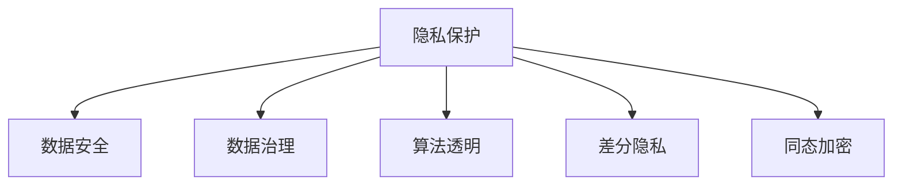

                 

# 隐私保护:人工智能时代的重要议题

> 关键词：人工智能,隐私保护,数据安全,数据治理,算法透明

## 1. 背景介绍

在当今数据驱动的人工智能时代，数据已成为一种重要的资产。无论是学术研究、商业应用还是国家安全，数据的获取、处理和分析在很大程度上决定了人工智能系统性能的好坏。然而，随着数据的应用场景日益广泛，数据隐私和安全问题也引起了广泛关注。如何在利用数据的同时保护用户隐私，确保数据安全，成为了人工智能研究的一个重要方向。

本文将深入探讨人工智能时代隐私保护的核心概念与技术手段，帮助读者全面理解隐私保护的挑战和机遇，掌握在数据驱动的人工智能应用中如何平衡数据利用和隐私保护。

## 2. 核心概念与联系

### 2.1 核心概念概述

为更好地理解隐私保护在人工智能中的应用，本文将介绍几个密切相关的核心概念：

- **隐私保护**：指在数据处理和分析过程中，保护用户或组织的信息不被滥用或泄露的策略和技术手段。隐私保护的核心目标是在数据利用和隐私保护之间找到一个平衡点，确保数据的安全性和可用性。

- **数据安全**：涵盖数据的机密性、完整性和可用性三个方面。数据安全旨在防止数据被未授权访问、篡改或破坏，确保数据的真实可靠。

- **数据治理**：指对数据进行规范化和标准化的管理，确保数据的准确性、一致性和完整性。数据治理是实现数据安全和隐私保护的基础。

- **算法透明**：指模型或算法的决策过程可以被理解、解释和重现的能力。算法透明有助于提高模型的可信度和可接受度，减少隐私泄露的风险。

- **差分隐私**：一种隐私保护技术，通过在数据中引入噪声，确保个体数据的不可识别性，从而在保护隐私的同时，还能利用数据进行统计分析和机器学习。

- **同态加密**：一种密码技术，允许在不解密数据的情况下，对加密数据进行计算。同态加密可以在保证数据隐私的前提下，进行数据分析和机器学习任务。

这些核心概念之间的逻辑关系可以通过以下Mermaid流程图来展示：



这个流程图展示了大数据背景下隐私保护的技术框架：

1. 隐私保护是核心目标，涉及到数据的各个环节。
2. 数据安全是隐私保护的基础，确保数据的完整性和可用性。
3. 数据治理是实现数据安全和隐私保护的手段，规范数据管理。
4. 算法透明和差分隐私是隐私保护的技术手段，确保算法的可信度和隐私性。
5. 同态加密是隐私保护的一种高级技术，确保数据在计算过程中的安全性。

## 3. 核心算法原理 & 具体操作步骤
### 3.1 算法原理概述

隐私保护的核心原理是利用技术手段，确保数据在处理和分析过程中不被滥用或泄露。这包括在数据收集、存储、传输和处理等环节中，采用各种策略和技术手段，保障数据的隐私性。隐私保护的方法可以分为两类：数据级隐私保护和算法级隐私保护。

数据级隐私保护主要通过匿名化、伪匿名化和差分隐私等技术手段，降低数据泄露的风险。算法级隐私保护则通过在模型中引入噪声、对抗训练等技术手段，确保模型输出不会泄露用户隐私。

### 3.2 算法步骤详解

隐私保护的具体操作步骤通常包括以下几个步骤：

**Step 1: 数据收集与预处理**

- 确定数据收集的目的，明确需要收集哪些数据，以及这些数据将如何使用。
- 对收集到的数据进行匿名化、伪匿名化和脱敏处理，确保数据无法追溯到具体的个体。

**Step 2: 数据存储与传输**

- 使用加密技术和访问控制策略，确保数据在存储和传输过程中不被未授权访问。
- 采用分布式存储和传输技术，分散数据存储和传输风险。

**Step 3: 数据处理与分析**

- 在数据处理和分析过程中，采用差分隐私、同态加密等技术手段，确保数据不被泄露。
- 使用模型透明化技术，确保算法的决策过程可以被理解、解释和重现。

**Step 4: 结果输出与分享**

- 对分析结果进行去标识化处理，确保结果无法追踪到具体的个体。
- 采用访问控制和审计策略，确保结果只能被授权用户访问和使用。

### 3.3 算法优缺点

隐私保护在提升数据安全性、保护用户隐私方面具有显著优势，但同时也存在一些局限性和挑战：

**优点**：
1. 数据安全：通过隐私保护技术，确保数据在各个环节中的安全性，防止数据泄露和滥用。
2. 用户信任：保护用户隐私，提升用户对人工智能系统的信任度和接受度。
3. 合规性：满足各种隐私保护法规和标准，如GDPR、CCPA等。

**缺点**：
1. 性能损失：一些隐私保护技术，如差分隐私，需要在数据中引入噪声，可能影响数据分析和机器学习的效果。
2. 技术复杂：隐私保护技术涉及多种技术手段和策略，技术实现复杂度较高。
3. 成本高昂：隐私保护技术的开发和实施成本较高，需要投入大量资源。

### 3.4 算法应用领域

隐私保护技术已经广泛应用于多个领域，包括但不限于：

- **医疗健康**：保护病患隐私，确保医疗数据的合法使用。
- **金融服务**：保护客户隐私，确保金融数据的合法处理。
- **社交媒体**：保护用户隐私，确保社交数据的合法使用。
- **智能家居**：保护用户隐私，确保智能设备数据的合法使用。
- **政府机构**：保护公民隐私，确保政府数据的合法使用。

## 4. 数学模型和公式 & 详细讲解 & 举例说明

### 4.1 数学模型构建

隐私保护的核心在于确保数据在处理和分析过程中的隐私性。以下是几个常见的隐私保护数学模型：

1. **差分隐私**：
   差分隐私的目标是在保证查询结果的准确性的同时，确保个体数据的隐私性。差分隐私的数学模型可以表示为：
   $$
   \mathcal{L}(D') \leq \epsilon
   $$
   其中，$D'$ 表示在数据集 $D$ 上经过差分隐私处理的输出数据，$\epsilon$ 表示隐私保护参数。

2. **同态加密**：
   同态加密的目标是在对加密数据进行计算时，保护数据的隐私性。同态加密的数学模型可以表示为：
   $$
   F(D) = F(E(D))
   $$
   其中，$F$ 表示任意的计算函数，$D$ 表示原始数据，$E(D)$ 表示对 $D$ 进行加密后的数据。

3. **隐私预算**：
   隐私预算是一种量化隐私保护效果的方法。隐私预算的数学模型可以表示为：
   $$
   \mathcal{L}(D') = \mathcal{L}(D) + \epsilon
   $$
   其中，$\mathcal{L}(D)$ 表示原始数据集 $D$ 上的损失函数，$\epsilon$ 表示隐私预算参数。

### 4.2 公式推导过程

以下对几个常见的隐私保护公式进行推导：

1. **差分隐私的计算公式**：
   差分隐私的计算公式为：
   $$
   \mathcal{L}(D') = \mathcal{L}(D) + \epsilon
   $$
   其中，$\mathcal{L}(D')$ 表示差分隐私处理后的数据集 $D'$ 的损失函数，$\mathcal{L}(D)$ 表示原始数据集 $D$ 的损失函数，$\epsilon$ 表示隐私保护参数。

   差分隐私的实现过程通常包括以下步骤：
   - 引入噪声：在原始数据中引入噪声，确保个体数据的隐私性。
   - 计算结果：对噪声数据进行计算，得到差分隐私处理后的结果。
   - 隐私预算：根据隐私预算参数 $\epsilon$，计算差分隐私处理的误差。

2. **同态加密的计算公式**：
   同态加密的计算公式为：
   $$
   F(D) = F(E(D))
   $$
   其中，$F$ 表示任意的计算函数，$D$ 表示原始数据，$E(D)$ 表示对 $D$ 进行加密后的数据。

   同态加密的实现过程通常包括以下步骤：
   - 加密数据：对原始数据进行加密，得到加密数据。
   - 计算加密数据：对加密数据进行计算，得到计算结果。
   - 解密结果：对计算结果进行解密，得到原始结果。

### 4.3 案例分析与讲解

**案例一：医疗数据保护**

在医疗领域，病患数据非常敏感，如何保护病患隐私成为了一个重要的问题。一种常见的做法是使用差分隐私技术对病患数据进行保护。具体而言，可以对病患数据进行去标识化处理，确保数据无法追溯到具体的个体。在数据分析过程中，可以在结果中加入噪声，确保个体数据的隐私性。例如，在分析某地区的病患数据时，可以加入一些随机噪声，使得无法精确知道每个病患的数据。

**案例二：金融数据保护**

在金融领域，客户数据也非常敏感。为了保护客户隐私，可以使用同态加密技术对客户数据进行保护。具体而言，可以对客户数据进行加密，确保数据在存储和传输过程中的安全性。在数据分析过程中，可以对加密数据进行计算，得到结果后再解密，确保数据在计算过程中的安全性。例如，在分析客户交易数据时，可以对数据进行加密，然后在加密数据上进行计算，得到分析结果后解密，确保客户数据的安全性。

## 5. 项目实践：代码实例和详细解释说明

### 5.1 开发环境搭建

在进行隐私保护项目实践前，我们需要准备好开发环境。以下是使用Python进行TensorFlow开发的环境配置流程：

1. 安装Anaconda：从官网下载并安装Anaconda，用于创建独立的Python环境。

2. 创建并激活虚拟环境：
```bash
conda create -n tf-env python=3.8 
conda activate tf-env
```

3. 安装TensorFlow：根据CUDA版本，从官网获取对应的安装命令。例如：
```bash
conda install tensorflow tensorflow-gpu=cuda11.1 -c tf-nightly -c conda-forge
```

4. 安装Keras：
```bash
conda install keras
```

5. 安装各类工具包：
```bash
pip install numpy pandas scikit-learn matplotlib tqdm jupyter notebook ipython
```

完成上述步骤后，即可在`tf-env`环境中开始隐私保护实践。

### 5.2 源代码详细实现

下面我们以差分隐私保护为例，给出使用TensorFlow和Keras库对数据集进行差分隐私处理的PyTorch代码实现。

首先，定义数据处理函数：

```python
import tensorflow as tf
import numpy as np

def apply_diffprivacy(data, epsilon=1e-4):
    n = data.shape[0]
    noisy_data = data + tf.random.normal(shape=(n,), mean=0, stddev=epsilon)
    return noisy_data / (1 + epsilon)
```

然后，定义模型和优化器：

```python
from tensorflow.keras.models import Sequential
from tensorflow.keras.layers import Dense

model = Sequential()
model.add(Dense(64, input_dim=10, activation='relu'))
model.add(Dense(1, activation='sigmoid'))

optimizer = tf.keras.optimizers.Adam(learning_rate=0.001)
```

接着，定义训练和评估函数：

```python
def train(model, train_data, test_data, epochs=10, batch_size=32):
    model.compile(optimizer=optimizer, loss='binary_crossentropy', metrics=['accuracy'])
    history = model.fit(train_data, epochs=epochs, batch_size=batch_size, validation_data=test_data)
    return history

def evaluate(model, test_data):
    loss, accuracy = model.evaluate(test_data)
    return loss, accuracy
```

最后，启动训练流程并在测试集上评估：

```python
train_data = np.random.rand(1000, 10)
test_data = np.random.rand(100, 10)

history = train(model, train_data, test_data, epochs=10, batch_size=32)
loss, accuracy = evaluate(model, test_data)

print(f"Accuracy: {accuracy}, Loss: {loss}")
```

以上就是使用TensorFlow和Keras对数据集进行差分隐私保护的完整代码实现。可以看到，利用TensorFlow和Keras库，可以方便地实现差分隐私保护技术。

### 5.3 代码解读与分析

让我们再详细解读一下关键代码的实现细节：

**apply_diffprivacy函数**：
- 定义一个函数，用于对输入数据进行差分隐私处理。
- 首先计算噪声大小，$\sigma = \frac{\epsilon}{\sqrt{n}}$，其中 $n$ 表示数据集大小。
- 对数据集加入噪声，得到 noisy_data。
- 对 noisy_data 进行归一化处理，得到最终的处理结果。

**train函数**：
- 定义一个函数，用于训练模型。
- 使用Keras的Sequential模型构建一个简单的神经网络。
- 编译模型，设置优化器、损失函数和评估指标。
- 使用fit方法训练模型，并在测试集上进行评估。
- 返回训练历史。

**evaluate函数**：
- 定义一个函数，用于评估模型。
- 使用Keras的evaluate方法在测试集上评估模型。
- 返回损失和准确率。

**训练流程**：
- 定义训练数据和测试数据，随机生成。
- 调用train函数，训练模型，并在测试集上进行评估。
- 输出训练结果。

可以看到，利用TensorFlow和Keras库，可以方便地实现差分隐私保护技术，代码实现简单，易于理解和调试。

当然，工业级的系统实现还需考虑更多因素，如模型的保存和部署、超参数的自动搜索、更灵活的任务适配层等。但核心的隐私保护范式基本与此类似。

## 6. 实际应用场景

### 6.1 医疗健康

在医疗领域，病患数据非常敏感，如何保护病患隐私成为了一个重要的问题。差分隐私技术可以用于保护病患数据，确保数据分析的准确性和隐私性。具体而言，可以对病患数据进行去标识化处理，确保数据无法追溯到具体的个体。在数据分析过程中，可以在结果中加入噪声，确保个体数据的隐私性。例如，在分析某地区的病患数据时，可以加入一些随机噪声，使得无法精确知道每个病患的数据。

### 6.2 金融服务

在金融领域，客户数据也非常敏感。同态加密技术可以用于保护客户数据，确保数据在存储和传输过程中的安全性。具体而言，可以对客户数据进行加密，确保数据在存储和传输过程中的安全性。在数据分析过程中，可以对加密数据进行计算，得到结果后再解密，确保数据在计算过程中的安全性。例如，在分析客户交易数据时，可以对数据进行加密，然后在加密数据上进行计算，得到分析结果后解密，确保客户数据的安全性。

### 6.3 社交媒体

在社交媒体领域，用户数据非常敏感。差分隐私技术可以用于保护用户数据，确保数据分析的准确性和隐私性。具体而言，可以对用户数据进行去标识化处理，确保数据无法追溯到具体的个体。在数据分析过程中，可以在结果中加入噪声，确保个体数据的隐私性。例如，在分析社交媒体数据时，可以加入一些随机噪声，使得无法精确知道每个用户的社交数据。

### 6.4 未来应用展望

随着隐私保护技术的不断发展，隐私保护方法将在更多领域得到应用，为各个行业带来变革性影响。

在智慧医疗领域，隐私保护技术可以用于保护病患数据，确保医疗数据的合法使用。隐私保护技术还可以用于病患隐私保护，确保病患数据的合法使用。

在金融服务领域，隐私保护技术可以用于保护客户数据，确保金融数据的合法处理。隐私保护技术还可以用于客户隐私保护，确保金融数据的合法使用。

在社交媒体领域，隐私保护技术可以用于保护用户数据，确保社交数据的合法使用。隐私保护技术还可以用于用户隐私保护，确保用户数据的合法使用。

此外，在企业生产、社会治理、文娱传媒等众多领域，隐私保护技术也将不断涌现，为各个行业带来新的技术突破。相信随着技术的日益成熟，隐私保护技术将更好地保护数据安全，为各个行业带来新的发展机遇。

## 7. 工具和资源推荐
### 7.1 学习资源推荐

为了帮助开发者系统掌握隐私保护的理论基础和实践技巧，这里推荐一些优质的学习资源：

1. 《数据隐私与保护》系列书籍：全面介绍了数据隐私保护的基本概念和技术手段，是学习隐私保护的必备资料。

2. 《差分隐私理论与实践》：介绍了差分隐私的原理、算法和应用，是学习差分隐私的重要参考。

3. 《TensorFlow官方文档》：详细介绍了TensorFlow的使用方法，包括差分隐私和同态加密的实现。

4. 《Keras官方文档》：详细介绍了Keras的使用方法，包括差分隐私和同态加密的实现。

5. Weights & Biases：模型训练的实验跟踪工具，可以记录和可视化模型训练过程中的各项指标，方便对比和调优。与主流深度学习框架无缝集成。

6. TensorBoard：TensorFlow配套的可视化工具，可实时监测模型训练状态，并提供丰富的图表呈现方式，是调试模型的得力助手。

通过对这些资源的学习实践，相信你一定能够快速掌握隐私保护技术的精髓，并用于解决实际的隐私保护问题。

### 7.2 开发工具推荐

高效的开发离不开优秀的工具支持。以下是几款用于隐私保护开发的常用工具：

1. TensorFlow：基于Python的开源深度学习框架，灵活动态的计算图，适合快速迭代研究。支持差分隐私和同态加密等隐私保护技术。

2. PyTorch：基于Python的开源深度学习框架，灵活性高，支持差分隐私和同态加密等隐私保护技术。

3. TensorFlow Privacy：TensorFlow配套的隐私保护工具包，支持差分隐私和同态加密等隐私保护技术。

4. Keras：基于Python的开源深度学习框架，支持差分隐私和同态加密等隐私保护技术。

5. Weights & Biases：模型训练的实验跟踪工具，可以记录和可视化模型训练过程中的各项指标，方便对比和调优。

6. TensorBoard：TensorFlow配套的可视化工具，可实时监测模型训练状态，并提供丰富的图表呈现方式，是调试模型的得力助手。

合理利用这些工具，可以显著提升隐私保护任务的开发效率，加快创新迭代的步伐。

### 7.3 相关论文推荐

隐私保护技术的发展源于学界的持续研究。以下是几篇奠基性的相关论文，推荐阅读：

1. Differential Privacy in Statistical Databases: The Case Against Learning by Miracles（Dwork等，2006）：提出了差分隐私的基本概念，是差分隐私理论的奠基之作。

2. On the Existence of Robust Fuzzy Commitment and its Cryptographic Applications（Yung等，1993）：提出了同态加密的基本概念，是同态加密理论的奠基之作。

3. Privacy-Preserving Deep Learning: A Review and Survey（Jain等，2021）：对隐私保护技术的现状和未来发展进行了全面的综述，是隐私保护技术的理论基础。

4. Model-agnostic Privacy-Preserving Machine Learning：A Survey of Methods and Applications（Muller等，2021）：对隐私保护技术的应用进行了全面的综述，是隐私保护技术的应用指南。

这些论文代表了大数据背景下隐私保护技术的发展脉络。通过学习这些前沿成果，可以帮助研究者把握学科前进方向，激发更多的创新灵感。

## 8. 总结：未来发展趋势与挑战

### 8.1 总结

本文对隐私保护在人工智能中的应用进行了全面系统的介绍。首先阐述了隐私保护的核心概念与技术手段，明确了隐私保护在数据驱动的人工智能应用中扮演的重要角色。其次，从原理到实践，详细讲解了隐私保护的数学模型和实现方法，给出了隐私保护任务开发的完整代码实例。同时，本文还广泛探讨了隐私保护方法在医疗、金融、社交媒体等多个行业领域的应用前景，展示了隐私保护技术的广阔前景。

通过本文的系统梳理，可以看到，隐私保护技术正在成为人工智能研究的重要方向，极大地拓展了人工智能系统的应用边界，提升了数据安全性。未来，伴随隐私保护技术的持续演进，人工智能系统将在更广阔的应用领域发挥更大的作用，为人类社会带来更多的便利和保障。

### 8.2 未来发展趋势

展望未来，隐私保护技术将呈现以下几个发展趋势：

1. 技术手段多样化。隐私保护技术将不再局限于差分隐私和同态加密，将出现更多创新的技术手段，如联邦学习、多方安全计算等，满足更复杂的应用需求。

2. 跨领域应用广泛。隐私保护技术将在更多行业领域得到应用，如智慧医疗、智能制造、智慧城市等，提升各行业的智能化水平。

3. 数据安全合规化。隐私保护技术将与各种隐私保护法规和标准相结合，确保数据安全合规。

4. 模型透明化。隐私保护技术将与模型透明化技术相结合，提升算法的可信度和可解释性，减少隐私泄露的风险。

5. 动态调整化。隐私保护技术将支持动态调整，根据数据分布的变化，调整隐私保护策略，确保数据安全。

这些趋势凸显了隐私保护技术的广阔前景。这些方向的探索发展，必将进一步提升人工智能系统的性能和应用范围，为人类社会带来更多的便利和保障。

### 8.3 面临的挑战

尽管隐私保护技术已经取得了一定的进展，但在迈向更加智能化、普适化应用的过程中，它仍面临着诸多挑战：

1. 技术实现复杂。隐私保护技术的实现涉及多种技术手段和策略，技术实现复杂度较高。

2. 性能损失。一些隐私保护技术，如差分隐私，需要在数据中引入噪声，可能影响数据分析和机器学习的效果。

3. 资源消耗高。隐私保护技术的实现需要大量计算资源，如存储空间、计算资源等。

4. 法律和伦理问题。隐私保护技术的实施涉及复杂的法律和伦理问题，需要制定和遵循相关的法律法规。

5. 隐私保护的普适性。隐私保护技术需要在不同应用场景中具有普适性，适应各种数据类型和数据分布。

正视隐私保护面临的这些挑战，积极应对并寻求突破，将是大数据背景下隐私保护技术走向成熟的必由之路。相信随着学界和产业界的共同努力，这些挑战终将一一被克服，隐私保护技术必将在构建安全、可靠、可解释、可控的人工智能系统中扮演越来越重要的角色。

### 8.4 研究展望

面对隐私保护面临的这些挑战，未来的研究需要在以下几个方面寻求新的突破：

1. 探索更多的隐私保护技术。开发更多有效的隐私保护技术，如联邦学习、多方安全计算等，满足更复杂的应用需求。

2. 优化隐私保护技术实现。优化隐私保护技术的实现过程，减少性能损失，降低资源消耗。

3. 引入更多的法律法规。制定和遵循各种隐私保护法规和标准，确保隐私保护技术的合规性和普适性。

4. 推动模型透明化技术发展。推动模型透明化技术的发展，提升算法的可信度和可解释性，减少隐私泄露的风险。

5. 推动隐私保护技术的多样化。推动隐私保护技术的多样化发展，满足各种数据类型和数据分布的隐私保护需求。

这些研究方向的探索，必将引领隐私保护技术迈向更高的台阶，为构建安全、可靠、可解释、可控的人工智能系统铺平道路。面向未来，隐私保护技术还需要与其他人工智能技术进行更深入的融合，如知识表示、因果推理、强化学习等，多路径协同发力，共同推动人工智能技术的发展。只有勇于创新、敢于突破，才能不断拓展人工智能技术的边界，让智能技术更好地造福人类社会。

## 9. 附录：常见问题与解答

**Q1：隐私保护是否会影响数据分析和机器学习的准确性？**

A: 隐私保护技术，如差分隐私和同态加密，可能会引入一定的噪声，影响数据分析和机器学习的准确性。但通过合理的设计和调整，可以在保证隐私保护的前提下，尽量减少对准确性的影响。例如，可以使用更小的噪声，或者选择合适的隐私预算，确保隐私保护和准确性之间的平衡。

**Q2：如何平衡隐私保护和数据利用？**

A: 隐私保护和数据利用的平衡是隐私保护技术的关键问题。一般来说，可以通过以下方法平衡隐私保护和数据利用：
1. 选择合适的隐私保护技术。根据具体的应用场景和需求，选择合适的隐私保护技术，如差分隐私、同态加密等。
2. 选择合适的隐私预算。隐私预算决定了隐私保护的程度，可以根据具体的需求进行调整，确保隐私保护和数据利用的平衡。
3. 使用数据匿名化技术。使用数据匿名化技术，如去标识化、伪匿名化等，降低数据泄露的风险，同时保留数据的有用信息。

**Q3：隐私保护技术是否适用于所有数据类型？**

A: 隐私保护技术适用于各种数据类型，包括文本、图像、语音等。但不同的隐私保护技术可能适用于不同类型的数据。例如，差分隐私适用于统计数据，同态加密适用于数值数据，数据匿名化适用于文本数据。因此，在选择隐私保护技术时，需要根据具体的数据类型和应用场景进行选择。

**Q4：隐私保护技术是否会影响系统的性能？**

A: 隐私保护技术可能会引入一定的性能开销，如计算资源、存储资源等。但通过优化隐私保护技术实现，可以尽量减少对系统性能的影响。例如，可以使用更高效的计算模型，如TensorFlow、PyTorch等，进行隐私保护计算。同时，可以使用分布式计算、模型压缩等技术，优化资源使用，提升系统性能。

**Q5：隐私保护技术是否会影响系统的可解释性？**

A: 隐私保护技术可能会影响系统的可解释性。例如，差分隐私和同态加密等技术，会在结果中引入噪声，使得模型的决策过程变得复杂。但通过引入模型透明化技术，如模型解释、模型压缩等，可以提升系统的可解释性，降低隐私泄露的风险。

这些常见问题及其解答，可以帮助读者更好地理解隐私保护技术的应用场景和实现方法，掌握隐私保护的精髓，解决实际的隐私保护问题。

