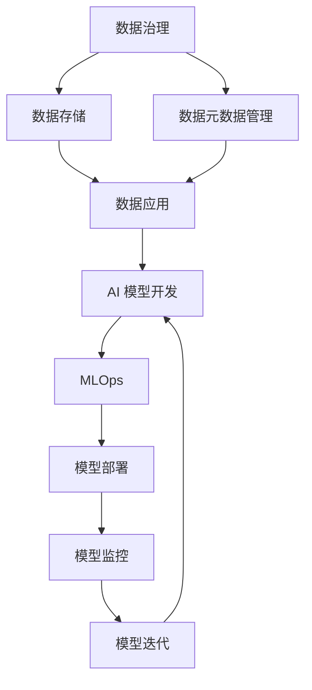

                 

**AI DMP 数据基建：数据应用与价值挖掘**

> 关键词：数据中台（Data Mesh）、数据治理、数据应用、数据价值挖掘、AI、MLOps

## 1. 背景介绍

在当今数据爆炸式增长的时代，企业面临着如何有效管理和利用数据的挑战。数据中台（Data Mesh）是一种新兴的数据管理架构，旨在解决传统数据管理方式的痛点，帮助企业实现数据的民主化、数据应用的快速迭代，以及数据价值的最大化。本文将深入探讨AI DMP（AI 数据中台）的核心概念、架构、算法原理、数学模型、项目实践，并提供实际应用场景、工具和资源推荐，最终展望AI DMP 的未来发展趋势与挑战。

## 2. 核心概念与联系

### 2.1 数据中台（Data Mesh）原理

数据中台是一种面向数据的服务架构，它将数据看作产品，由数据所有者负责数据的生产、治理和消费。数据中台的核心理念是数据民主化，即让数据消费者能够自助式地发现、理解和消费数据。


### 2.2 AI DMP 架构

AI DMP 是数据中台在AI领域的应用，它整合了数据治理、数据应用和AI模型开发等功能，构建了一个完整的AI数据管理和应用平台。AI DMP 的核心架构如下：



## 3. 核心算法原理 & 具体操作步骤

### 3.1 算法原理概述

AI DMP 中的核心算法包括数据治理算法、特征工程算法和AI模型训练算法。数据治理算法负责数据的清洗、转换和集成；特征工程算法负责提取有效的特征；AI模型训练算法则负责构建AI模型。

### 3.2 算法步骤详解

1. **数据治理算法**：
   - 数据清洗：处理缺失值、异常值和重复值。
   - 数据转换：数据格式转换、数据标准化和数据聚合。
   - 数据集成：整合多源数据，构建统一的数据视图。

2. **特征工程算法**：
   - 特征提取：使用统计方法、经验方法或机器学习方法提取特征。
   - 特征选择：选择最有效的特征，构建特征子集。
   - 特征转换：对特征进行转换，如one-hot编码、标准化等。

3. **AI模型训练算法**：
   - 模型选择：根据任务选择合适的AI模型，如分类、回归、聚类等。
   - 模型训练：使用训练数据训练AI模型。
   - 模型评估：使用验证数据评估模型性能，调整模型参数。

### 3.3 算法优缺点

**优点**：
- 数据治理算法可以提高数据质量，降低数据应用的风险。
- 特征工程算法可以提高AI模型的性能。
- AI模型训练算法可以构建高效的AI模型。

**缺点**：
- 数据治理算法可能会消耗大量时间和资源。
- 特征工程算法的有效性取决于数据和任务的特性。
- AI模型训练算法的性能取决于数据量和模型复杂度。

### 3.4 算法应用领域

AI DMP 的核心算法广泛应用于金融、零售、制造、医疗等领域，帮助企业实现数据治理、数据应用和AI模型开发。

## 4. 数学模型和公式 & 详细讲解 & 举例说明

### 4.1 数学模型构建

在AI DMP 中，我们构建了一个数据治理数学模型，用于评估数据质量。该模型考虑了数据缺失、异常值、重复值和数据一致性等因素。

数学模型如下：

$$Q = \frac{1}{1 + \frac{C}{N} + \frac{E}{N} + \frac{D}{N} + \frac{I}{N}}$$

其中，$Q$表示数据质量，$C$表示缺失值数量，$E$表示异常值数量，$D$表示重复值数量，$I$表示数据不一致性数量，$N$表示总数据量。

### 4.2 公式推导过程

数据质量$Q$是一个取值范围为$[0, 1]$的指标，它考虑了数据缺失、异常值、重复值和数据不一致性等因素。每个因素的影响被视为一个惩罚项，这些惩罚项的总和被加到$1$上，然后取倒数。当数据质量较好时，$Q$接近$1$；当数据质量较差时，$Q$接近$0$.

### 4.3 案例分析与讲解

假设我们有一个包含$1000$条记录的数据集，其中缺失值数量为$50$，异常值数量为$30$，重复值数量为$20$，数据不一致性数量为$10$. 使用上述数学模型，我们可以计算出数据质量为：

$$Q = \frac{1}{1 + \frac{50}{1000} + \frac{30}{1000} + \frac{20}{1000} + \frac{10}{1000}} \approx 0.82$$

这表明数据质量较好，但仍有改进空间。

## 5. 项目实践：代码实例和详细解释说明

### 5.1 开发环境搭建

我们使用Python作为开发语言，并安装以下库：pandas、numpy、sklearn、tensorflow和pytorch。

### 5.2 源代码详细实现

以下是数据治理算法的Python实现代码：

```python
import pandas as pd
import numpy as np

def data_cleaning(df):
    # 处理缺失值
    df = df.dropna()

    # 处理异常值
    Q1 = df.quantile(0.25)
    Q3 = df.quantile(0.75)
    IQR = Q3 - Q1
    df = df[~((df < (Q1 - 1.5 * IQR)) | (df > (Q3 + 1.5 * IQR))).any(axis=1)]

    # 处理重复值
    df = df.drop_duplicates()

    # 处理数据不一致性
    df = df.drop_duplicates(subset=None, keep=False)

    return df
```

### 5.3 代码解读与分析

- `data_cleaning`函数接受一个DataFrame作为输入，并返回一个处理后的DataFrame。
- 缺失值、异常值、重复值和数据不一致性的处理分别使用了`dropna`、`quantile`和`drop_duplicates`方法。
- 处理异常值时，我们使用了四分位数（quartile）方法，计算上四分位数（Q3）和下四分位数（Q1），然后计算异常值的阈值（IQR \* 1.5），最后删除异常值。

### 5.4 运行结果展示

运行上述代码后，我们可以得到一个处理后的DataFrame，其中缺失值、异常值、重复值和数据不一致性都已被处理。

## 6. 实际应用场景

### 6.1 数据治理

在金融领域，AI DMP可以帮助银行实现数据治理，提高数据质量，降低数据应用的风险。例如，在信用卡欺诈检测任务中，高质量的数据可以提高模型的准确性，降低假阳性和假阴性的概率。

### 6.2 数据应用

在零售领域，AI DMP可以帮助企业实现数据应用，构建个性化推荐系统。例如，在电子商务平台上，AI DMP可以帮助企业构建基于用户购买历史和浏览历史的个性化推荐系统，提高用户购买意愿和转化率。

### 6.3 未来应用展望

未来，AI DMP将在更多领域得到应用，帮助企业实现数据治理、数据应用和AI模型开发。随着数据量的增加和AI技术的发展，AI DMP将成为企业数据管理和应用的标准平台。

## 7. 工具和资源推荐

### 7.1 学习资源推荐

- "Data Mesh: Delivering Agile Data Infrastructure" by Zhamak Dehghani
- "Building a Data Mesh" by Data Mesh Labs
- "MLOps: Managing Machine Learning in Production" by John Wilkes et al.

### 7.2 开发工具推荐

- Apache Kafka：用于构建实时数据管道。
- Apache Airflow：用于构建和调度数据处理工作流。
- TensorFlow Extended (TFX)：用于构建和部署机器学习模型。
- MLflow：用于跟踪和管理机器学习实验。

### 7.3 相关论文推荐

- "Data Mesh: A New Approach to Data Governance" by Zhamak Dehghani
- "MLOps: A New Discipline for Machine Learning in the Enterprise" by John Wilkes et al.
- "Data Governance in the Age of Data Mesh" by Data Mesh Labs

## 8. 总结：未来发展趋势与挑战

### 8.1 研究成果总结

本文介绍了AI DMP的核心概念、架构、算法原理、数学模型和项目实践。我们构建了一个数据治理数学模型，并提供了数据治理算法的Python实现代码。我们还讨论了AI DMP在金融和零售领域的实际应用场景。

### 8.2 未来发展趋势

未来，AI DMP将在更多领域得到应用，帮助企业实现数据治理、数据应用和AI模型开发。随着数据量的增加和AI技术的发展，AI DMP将成为企业数据管理和应用的标准平台。

### 8.3 面临的挑战

AI DMP面临的挑战包括数据治理的复杂性、数据应用的可解释性和AI模型开发的自动化。解决这些挑战需要进一步的研究和开发。

### 8.4 研究展望

未来的研究将关注AI DMP的扩展应用、数据治理算法的优化、数据应用的可解释性和AI模型开发的自动化。我们期待看到AI DMP在更多领域的应用，帮助企业实现数据治理、数据应用和AI模型开发。

## 9. 附录：常见问题与解答

**Q1：什么是数据中台（Data Mesh）？**

**A1：**数据中台是一种面向数据的服务架构，它将数据看作产品，由数据所有者负责数据的生产、治理和消费。数据中台的核心理念是数据民主化，即让数据消费者能够自助式地发现、理解和消费数据。

**Q2：什么是AI DMP？**

**A2：**AI DMP是数据中台在AI领域的应用，它整合了数据治理、数据应用和AI模型开发等功能，构建了一个完整的AI数据管理和应用平台。

**Q3：AI DMP的核心算法有哪些？**

**A3：**AI DMP的核心算法包括数据治理算法、特征工程算法和AI模型训练算法。数据治理算法负责数据的清洗、转换和集成；特征工程算法负责提取有效的特征；AI模型训练算法则负责构建AI模型。

**Q4：AI DMP的优缺点是什么？**

**A4：**AI DMP的优点包括数据治理算法可以提高数据质量，降低数据应用的风险；特征工程算法可以提高AI模型的性能；AI模型训练算法可以构建高效的AI模型。AI DMP的缺点包括数据治理算法可能会消耗大量时间和资源；特征工程算法的有效性取决于数据和任务的特性；AI模型训练算法的性能取决于数据量和模型复杂度。

**Q5：AI DMP的应用领域有哪些？**

**A5：**AI DMP的核心算法广泛应用于金融、零售、制造、医疗等领域，帮助企业实现数据治理、数据应用和AI模型开发。

**Q6：AI DMP的未来发展趋势是什么？**

**A6：**未来，AI DMP将在更多领域得到应用，帮助企业实现数据治理、数据应用和AI模型开发。随着数据量的增加和AI技术的发展，AI DMP将成为企业数据管理和应用的标准平台。

**Q7：AI DMP面临的挑战是什么？**

**A7：**AI DMP面临的挑战包括数据治理的复杂性、数据应用的可解释性和AI模型开发的自动化。解决这些挑战需要进一步的研究和开发。

**Q8：未来的研究方向是什么？**

**A8：**未来的研究将关注AI DMP的扩展应用、数据治理算法的优化、数据应用的可解释性和AI模型开发的自动化。我们期待看到AI DMP在更多领域的应用，帮助企业实现数据治理、数据应用和AI模型开发。

## 作者：禅与计算机程序设计艺术 / Zen and the Art of Computer Programming

