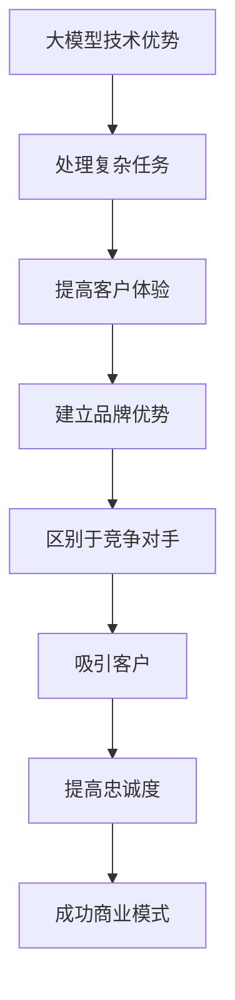

                 

## AI 大模型创业：如何利用品牌优势？

> 关键词：大模型、品牌优势、创业、商业化、AI 算法、数据策略、产品战略、市场策略

## 1. 背景介绍

随着人工智能（AI）技术的飞速发展，大模型（Large Language Models）已经成为AI领域的热门话题。这些模型通过处理大量数据，学习人类语言的复杂性，从而能够理解、生成和翻译人类语言。然而，如何将这些先进的技术转化为成功的商业产品，是当前AI创业面临的主要挑战之一。本文将探讨如何利用品牌优势，成功商业化AI大模型创业。

## 2. 核心概念与联系

### 2.1 大模型与品牌优势的关系

大模型的优势在于其强大的学习能力和泛化能力，能够处理各种复杂的任务。然而，单单依靠技术优势并不足以成功创业。品牌优势是指品牌在市场上建立的独特地位，它能够帮助企业区别于竞争对手，吸引客户，提高忠诚度。品牌优势与大模型技术优势结合，可以帮助AI创业者建立成功的商业模式。



### 2.2 大模型商业化的挑战

大模型商业化面临的挑战包括：

- **数据策略**：大模型需要大量数据进行训练，如何获取高质量数据，并确保数据安全和隐私是关键挑战。
- **产品战略**：如何将大模型技术转化为客户需要的产品和服务，是成功商业化的关键。
- **市场策略**：如何在竞争激烈的市场中建立品牌优势，吸引客户，提高忠诚度。

## 3. 核心算法原理 & 具体操作步骤

### 3.1 算法原理概述

大模型的核心算法是Transformer模型，它使用自注意力机制（Self-Attention）和位置编码（Positional Encoding）来处理序列数据。大模型通过训练大量数据，学习人类语言的复杂性，从而能够理解、生成和翻译人类语言。

### 3.2 算法步骤详解

大模型的训练过程包括以下步骤：

1. **数据预处理**：清洗、标记和切分数据。
2. **位置编码**：为序列数据添加位置信息。
3. **自注意力机制**：计算序列中每个位置的注意力权重。
4. **前向传播**：将输入数据通过多个Transformer层，生成输出。
5. **反向传播**：计算梯度，更新模型参数。

### 3.3 算法优缺点

大模型的优点包括：

- **泛化能力**：能够处理各种复杂任务。
- **理解能力**：能够理解人类语言的复杂性。
- **生成能力**：能够生成人类语言。

缺点包括：

- **训练成本**：需要大量计算资源和数据。
- **解释性**：模型的决策过程不易理解。

### 3.4 算法应用领域

大模型的应用领域包括：

- **自然语言处理（NLP）**：文本生成、翻译、问答系统等。
- **计算机视觉（CV）**：图像和视频理解、生成等。
- **推荐系统**：个性化推荐等。

## 4. 数学模型和公式 & 详细讲解 & 举例说明

### 4.1 数学模型构建

大模型的数学模型是Transformer模型，其核心是自注意力机制。自注意力机制的数学表达式如下：

$$Attention(Q, K, V) = softmax(\frac{QK^T}{\sqrt{d_k}})V$$

其中，Q、K、V分别是查询、键、值向量，d_k是键向量的维度。

### 4.2 公式推导过程

自注意力机制的推导过程如下：

1. 计算查询、键、值向量。
2. 计算注意力分数：$QK^T/\sqrt{d_k}$。
3. 计算注意力权重：$softmax(\cdot)$。
4. 计算输出：$V \cdot attention\ weights$.

### 4.3 案例分析与讲解

例如，在文本生成任务中，大模型需要预测下一个单词。输入是前面的单词序列，输出是下一个单词的概率分布。大模型使用自注意力机制计算每个单词的注意力权重，然后生成下一个单词的概率分布。

## 5. 项目实践：代码实例和详细解释说明

### 5.1 开发环境搭建

大模型的开发环境需要安装以下软件：

- Python
- PyTorch或TensorFlow
- Transformers库（Hugging Face）

### 5.2 源代码详细实现

大模型的训练过程可以使用Transformers库进行实现。以下是训练过程的伪代码：

```python
from transformers import AutoTokenizer, AutoModelForCausalLM

# 加载预训练模型和分词器
model = AutoModelForCausalLM.from_pretrained("bigscience/bloom")
tokenizer = AutoTokenizer.from_pretrained("bigscience/bloom")

# 准备数据
inputs = tokenizer("Hello, I'm a language model.", return_tensors="pt")

# 训练模型
outputs = model(**inputs, labels=inputs["input_ids"])
loss = outputs.loss
```

### 5.3 代码解读与分析

在上述代码中，我们首先加载预训练模型和分词器。然后，我们准备输入数据，并进行模型训练。模型输出损失值，我们可以使用此损失值更新模型参数。

### 5.4 运行结果展示

训练好的大模型可以用于各种NLP任务，例如文本生成、翻译、问答系统等。以下是一个文本生成的例子：

输入：`Hello, I'm a language model.`

输出：`I can understand and generate human language.`

## 6. 实际应用场景

### 6.1 当前应用

大模型当前的应用包括：

- **文本生成**：用于内容创作、营销等领域。
- **翻译**：用于跨语言通信、国际化等领域。
- **问答系统**：用于客户服务、信息检索等领域。

### 6.2 未来应用展望

未来，大模型的应用将扩展到更多领域，例如：

- **自动驾驶**：用于理解和生成语音指令。
- **医疗**：用于文本挖掘、疾病预测等领域。
- **金融**：用于风险预测、客户服务等领域。

## 7. 工具和资源推荐

### 7.1 学习资源推荐

- **课程**：斯坦福大学的“深度学习”课程（CS224n）和“自然语言处理”课程（CS224u）是学习大模型的好资源。
- **书籍**：“自然语言处理（第二版）”是学习NLP的经典教材。

### 7.2 开发工具推荐

- **Transformers库**：Hugging Face的Transformers库是开发大模型的好工具。
- **PyTorch或TensorFlow**：这两个深度学习框架是开发大模型的基础。

### 7.3 相关论文推荐

- **Attention is All You Need**：这篇论文介绍了Transformer模型和自注意力机制。
- **Language Models are Few-Shot Learners**：这篇论文介绍了大模型的泛化能力。

## 8. 总结：未来发展趋势与挑战

### 8.1 研究成果总结

大模型在NLP领域取得了显著成果，能够理解、生成和翻译人类语言。然而，商业化大模型面临着数据策略、产品战略和市场策略等挑战。

### 8.2 未来发展趋势

未来，大模型的发展趋势包括：

- **多模式学习**：结合文本、图像、音频等多模式数据进行学习。
- **跨语言学习**：学习多种语言，提高泛化能力。
- **解释性模型**：开发能够解释决策过程的模型。

### 8.3 面临的挑战

大模型面临的挑战包括：

- **数据安全和隐私**：如何获取高质量数据，并确保数据安全和隐私。
- **计算资源**：大模型需要大量计算资源进行训练。
- **商业化**：如何将大模型技术转化为成功的商业产品。

### 8.4 研究展望

未来的研究方向包括：

- **模型压缩**：开发更小、更快的大模型。
- **模型联邦学习**：开发分布式、隐私保护的大模型训练方法。
- **模型解释性**：开发能够解释决策过程的模型。

## 9. 附录：常见问题与解答

**Q：大模型需要多少数据进行训练？**

A：大模型需要大量数据进行训练，通常需要数十亿甚至数百亿个单词。

**Q：大模型的计算资源需求是什么？**

A：大模型需要大量计算资源进行训练，通常需要数千个GPU小时甚至数万个GPU小时。

**Q：大模型的商业化挑战是什么？**

A：大模型的商业化挑战包括数据策略、产品战略和市场策略等。

## 作者：禅与计算机程序设计艺术 / Zen and the Art of Computer Programming

_（END）_

