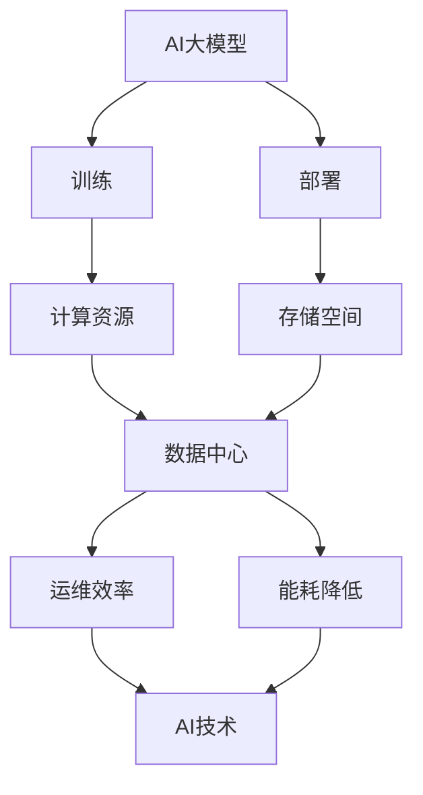

                 

**AI 大模型应用数据中心建设：数据中心产业发展**

**作者：禅与计算机程序设计艺术 / Zen and the Art of Computer Programming**

## 1. 背景介绍

随着人工智能（AI）技术的飞速发展，大模型（Large Language Models）在各个领域的应用日益广泛。然而，大模型的训练和部署需要大量的计算资源和存储空间，这对数据中心的建设和运维提出了新的挑战。本文将从技术和产业的角度，探讨AI大模型应用数据中心建设的相关问题，并展望未来的发展趋势。

## 2. 核心概念与联系

### 2.1 AI大模型

AI大模型是指通过大规模数据集和计算资源训练出来的模型，具有强大的理解、生成和推理能力。常见的大模型包括Transformer、BERT、T5等。

### 2.2 数据中心

数据中心是提供计算、存储、处理和分发信息服务的物理设施，是云计算、大数据和人工智能等新兴技术的基础设施。

### 2.3 AI大模型与数据中心的联系

AI大模型的训练和部署需要大量的计算资源和存储空间，数据中心提供了这些资源。同时，数据中心也需要AI技术来提高运维效率、降低能耗等。



## 3. 核心算法原理 & 具体操作步骤

### 3.1 算法原理概述

大模型的核心算法是Transformer，其使用自注意力机制（Self-Attention）和位置编码（Positional Encoding）来处理序列数据。自注意力机制允许模型关注输入序列的不同部分，位置编码则帮助模型理解输入序列的顺序。

### 3.2 算法步骤详解

1. **输入表示**：将输入序列（如文本）转换为向量表示。
2. **位置编码**：为输入序列中的每个位置添加位置信息。
3. **自注意力**：使用自注意力机制关注输入序列的不同部分。
4. ** Feed-Forward Network（FFN）**：对每个位置进行非线性变换。
5. **输出**：生成输出序列。

### 3.3 算法优缺点

**优点**：具有强大的理解、生成和推理能力，可以处理长序列数据。

**缺点**：训练需要大量的计算资源和时间，模型参数量大，部署困难。

### 3.4 算法应用领域

大模型广泛应用于自然语言处理（NLP）、计算机视觉（CV）、生物信息学等领域。

## 4. 数学模型和公式 & 详细讲解 & 举例说明

### 4.1 数学模型构建

大模型的数学模型可以表示为：

$$L(\theta) = \frac{1}{N} \sum_{i=1}^{N} \ell(f_\theta(x_i), y_i)$$

其中，$L(\theta)$是模型的损失函数，$f_\theta(x_i)$是模型的预测，$y_i$是真实值，$N$是样本数量。

### 4.2 公式推导过程

大模型的训练目标是最小化损失函数$L(\theta)$，可以使用梯度下降等优化算法来求解模型参数$\theta$。

### 4.3 案例分析与讲解

例如，在NLP任务中，输入序列$x_i$是一段文本，真实值$y_i$是这段文本的标签。模型的预测$f_\theta(x_i)$是对这段文本的理解或生成。

## 5. 项目实践：代码实例和详细解释说明

### 5.1 开发环境搭建

大模型的开发需要GPU等高性能计算资源，推荐使用NVIDIA A100 GPU。同时，需要安装PyTorch、Transformers等深度学习框架。

### 5.2 源代码详细实现

以下是大模型训练的伪代码：

```python
from transformers import AutoTokenizer, AutoModelForSeq2SeqLM

tokenizer = AutoTokenizer.from_pretrained("t5-base")
model = AutoModelForSeq2SeqLM.from_pretrained("t5-base")

inputs = tokenizer("translate English to German: I love you", return_tensors="pt")
outputs = model(**inputs)
```

### 5.3 代码解读与分析

这段代码使用Hugging Face的Transformers库来加载预训练的T5模型，并使用模型进行序列到序列的翻译任务。

### 5.4 运行结果展示

模型的输出是翻译后的文本："Ich liebe dich"。

## 6. 实际应用场景

### 6.1 当前应用

大模型广泛应用于搜索引擎、虚拟助手、内容生成等领域。

### 6.2 未来应用展望

未来，大模型将会应用于更多领域，如自动驾驶、医疗诊断等。同时，大模型也将会和边缘计算结合，实现更低延时的AI服务。

## 7. 工具和资源推荐

### 7.1 学习资源推荐

推荐阅读《Attention is All You Need》等经典论文，以及Hugging Face的Transformers教程。

### 7.2 开发工具推荐

推荐使用PyTorch、Transformers等深度学习框架，以及NVIDIA A100 GPU等硬件设备。

### 7.3 相关论文推荐

推荐阅读《BERT: Pre-training of Deep Bidirectional Transformers for Language Understanding》等相关论文。

## 8. 总结：未来发展趋势与挑战

### 8.1 研究成果总结

本文介绍了AI大模型的原理、算法、数学模型，并给出了代码实例和应用场景。

### 8.2 未来发展趋势

未来，大模型的发展将会朝着更大、更智能、更绿色的方向前进。

### 8.3 面临的挑战

大模型的训练和部署需要大量的计算资源和存储空间，这对数据中心的建设和运维提出了新的挑战。同时，大模型的解释性、可靠性等问题也需要进一步研究。

### 8.4 研究展望

未来的研究方向包括大模型的绿色化、小模型的研究、大模型的可解释性等。

## 9. 附录：常见问题与解答

**Q：大模型的训练需要多久？**

**A：这取决于模型的大小和训练数据的规模。通常，大模型的训练需要数天到数周的时间。**

**Q：大模型的部署需要多少资源？**

**A：大模型的部署需要大量的计算资源和存储空间。通常，需要使用GPU等高性能计算设备，以及大容量的存储设备。**

**Q：大模型的解释性如何？**

**A：大模型的解释性是一个挑战。目前，研究者正在开发各种方法来提高大模型的解释性。**

**作者：禅与计算机程序设计艺术 / Zen and the Art of Computer Programming**

