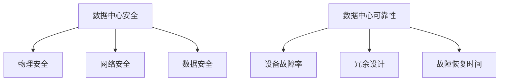

                 

**AI 大模型应用数据中心建设：数据中心安全与可靠性**

**作者：禅与计算机程序设计艺术 / Zen and the Art of Computer Programming**

## 1. 背景介绍

随着人工智能（AI）大模型的发展，其对数据中心的需求也在不断增长。数据中心是AI大模型训练和部署的关键基础设施，其安全和可靠性直接影响着AI大模型的性能和稳定性。本文将深入探讨AI大模型应用数据中心建设的安全和可靠性，提供实用的指南和最佳实践。

## 2. 核心概念与联系

### 2.1 数据中心安全

数据中心安全涉及物理安全、网络安全和数据安全等多个方面。物理安全包括对数据中心设施的保护，如防火墙、入侵检测系统和访问控制。网络安全则关注数据中心内部网络的保护，包括防火墙、入侵检测系统和安全协议。数据安全则涉及数据的保护，包括数据加密、访问控制和数据恢复。

### 2.2 数据中心可靠性

数据中心可靠性指的是数据中心在发生故障时能够恢复的能力。可靠性包括设备故障率、冗余设计和故障恢复时间等因素。高可靠性数据中心能够确保AI大模型的持续运行和数据完整性。

### 2.3 Mermaid 流程图



## 3. 核心算法原理 & 具体操作步骤

### 3.1 算法原理概述

AI大模型应用数据中心建设涉及多种算法，包括机器学习算法、分布式系统算法和安全算法。本节将重点介绍数据中心安全和可靠性相关的算法。

### 3.2 算法步骤详解

#### 3.2.1 安全算法

1. **访问控制列表（ACL）算法**：ACL算法用于控制对数据中心资源的访问。它根据预定义的规则，允许或拒绝对资源的访问请求。
2. **身份验证和授权（AA）算法**：AA算法用于验证用户身份并授予相应的访问权限。它通常基于用户名和密码，或其他形式的身份验证，如生物特征识别。
3. **加密算法**：加密算法用于保护数据的机密性。常用的加密算法包括对称加密算法（如AES）和非对称加密算法（如RSA）。

#### 3.2.2 可靠性算法

1. **故障检测算法**：故障检测算法用于监控数据中心设备的状态，并检测故障。常用的故障检测算法包括心跳检测和异常检测。
2. **故障转移算法**：故障转移算法用于在故障发生时将数据中心的负载转移到备用设备上。常用的故障转移算法包括主备切换和多活故障转移。
3. **容错算法**：容错算法用于在故障发生时保持数据中心的正常运行。常用的容错算法包括冗余设计和数据复制。

### 3.3 算法优缺点

#### 3.3.1 安全算法优缺点

**优点**：

* 提高数据中心资源的安全性
* 保护数据的机密性和完整性
* 提高数据中心的可靠性

**缺点**：

* 实施和维护成本高
* 可能会影响数据中心的性能

#### 3.3.2 可靠性算法优缺点

**优点**：

* 提高数据中心的可用性
* 降低故障对数据中心的影响
* 保护数据的完整性

**缺点**：

* 实施和维护成本高
* 可能会影响数据中心的性能

### 3.4 算法应用领域

安全算法和可靠性算法广泛应用于数据中心建设中。它们是保障数据中心安全和可靠性的关键手段，是数据中心建设的核心内容。

## 4. 数学模型和公式 & 详细讲解 & 举例说明

### 4.1 数学模型构建

#### 4.1.1 安全模型

数据中心安全模型通常基于Bell-LaPadula模型或Biba模型。这两种模型都涉及到对数据的访问控制，并提供了严格的安全保证。

**Bell-LaPadula模型**的基本原理是：

* **简单安全性**：用户只能访问等级不高于其 clearance level 的数据。
* **\* 星号-properties**：用户不能读取等级高于其 clearance level 的数据。

**Biba模型**的基本原理是：

* **简单integrity**：用户只能修改等级不低于其 integrity level 的数据。
* **\* 星号-integrity**：用户不能修改等级高于其 integrity level 的数据。

#### 4.1.2 可靠性模型

数据中心可靠性模型通常基于故障率和故障恢复时间。常用的可靠性模型包括MTBF（Mean Time Between Failures）和MTTR（Mean Time To Repair）。

**MTBF**是指设备在发生故障之前的平均运行时间。它可以用以下公式计算：

$$
MTBF = \frac{1}{\lambda}
$$

其中，$\lambda$是故障率，通常以故障次数/时间单位表示。

**MTTR**是指设备在发生故障后恢复正常运行所需的平均时间。它可以用以下公式计算：

$$
MTTR = \frac{1}{\mu}
$$

其中，$\mu$是故障恢复率，通常以故障恢复次数/时间单位表示。

### 4.2 公式推导过程

#### 4.2.1 安全模型公式推导

**Bell-LaPadula模型**的公式推导如下：

* 简单安全性：如果用户的 clearance level 是 $C_u$ 且数据的 clearance level 是 $C_d$，则 $C_u \leq C_d$。
* \* 星号-properties：如果用户的 clearance level 是 $C_u$ 且数据的 clearance level 是 $C_d$，则 $C_u \geq C_d$。

**Biba模型**的公式推导如下：

* 简单integrity：如果用户的 integrity level 是 $I_u$ 且数据的 integrity level 是 $I_d$，则 $I_u \leq I_d$。
* \* 星号-integrity：如果用户的 integrity level 是 $I_u$ 且数据的 integrity level 是 $I_d$，则 $I_u \geq I_d$。

#### 4.2.2 可靠性模型公式推导

**MTBF**和**MTTR**的公式推导如上所述。需要注意的是，故障率$\lambda$和故障恢复率$\mu$通常需要通过实地测试或模拟来获取。

### 4.3 案例分析与讲解

#### 4.3.1 安全模型案例

假设数据中心有两个用户，$U_1$的 clearance level 是 $C_1 = 2$，$U_2$的 clearance level 是 $C_2 = 3$，且数据 $D$的 clearance level 是 $C_d = 3$。根据Bell-LaPadula模型：

* $U_1$可以读取数据 $D$，因为 $C_1 \leq C_d$。
* $U_2$可以读取和修改数据 $D$，因为 $C_2 = C_d$。
* $U_1$不能修改数据 $D$，因为 $C_1 < C_d$。

#### 4.3.2 可靠性模型案例

假设数据中心的服务器每年发生故障1次，且每次故障需要1小时来修复。则：

* 服务器的故障率$\lambda = 1$次/年。
* 服务器的故障恢复率$\mu = 1$次/小时。
* 服务器的MTBF = $\frac{1}{\lambda} = 1$年。
* 服务器的MTTR = $\frac{1}{\mu} = 1$小时。

## 5. 项目实践：代码实例和详细解释说明

### 5.1 开发环境搭建

本节将使用Python作为编程语言，并使用Anaconda来管理依赖项。首先，请确保您的系统上安装了Python和Anaconda。然后，创建一个新的Anaconda环境：

```bash
conda create -n ai_data_center python=3.8
```

激活环境：

```bash
conda activate ai_data_center
```

安装所需的库：

```bash
pip install numpy pandas matplotlib scikit-learn
```

### 5.2 源代码详细实现

#### 5.2.1 安全算法实现

**ACL算法**实现如下：

```python
class ACL:
    def __init__(self, rules):
        self.rules = rules

    def check_access(self, user, resource):
        for rule in self.rules:
            if rule['user'] == user and rule['resource'] == resource:
                return rule['access']
        return False
```

**AA算法**实现如下：

```python
class AA:
    def __init__(self, users):
        self.users = users

    def authenticate(self, user, password):
        for u in self.users:
            if u['username'] == user and u['password'] == password:
                return True
        return False

    def authorize(self, user, resource):
        if self.authenticate(user, password):
            # 根据用户的权限返回访问结果
            pass
        else:
            return False
```

**加密算法**实现如下：

```python
import hashlib

def encrypt_password(password):
    return hashlib.sha256(password.encode()).hexdigest()
```

#### 5.2.2 可靠性算法实现

**故障检测算法**实现如下：

```python
import time

class Heartbeat:
    def __init__(self, interval):
        self.interval = interval
        self.last_heartbeat = time.time()

    def check(self):
        current_time = time.time()
        if current_time - self.last_heartbeat > self.interval:
            return False
        else:
            self.last_heartbeat = current_time
            return True
```

**故障转移算法**实现如下：

```python
class Failover:
    def __init__(self, primary, secondary):
        self.primary = primary
        self.secondary = secondary
        self.status = 'primary'

    def switch(self):
        if self.status == 'primary':
            self.status ='secondary'
            return self.secondary
        else:
            self.status = 'primary'
            return self.primary
```

**容错算法**实现如下：

```python
import copy

class Replication:
    def __init__(self, data):
        self.data = copy.deepcopy(data)

    def update(self, new_data):
        self.data = copy.deepcopy(new_data)
```

### 5.3 代码解读与分析

#### 5.3.1 安全算法解读

**ACL算法**根据预定义的规则，允许或拒绝对资源的访问请求。它简单有效，但需要频繁更新规则以适应变化的访问需求。

**AA算法**用于验证用户身份并授予相应的访问权限。它通常基于用户名和密码，或其他形式的身份验证。密码应使用加密算法进行加密以保护其机密性。

**加密算法**用于保护数据的机密性。常用的加密算法包括对称加密算法（如AES）和非对称加密算法（如RSA）。在本例中，我们使用SHA-256算法对密码进行加密。

#### 5.3.2 可靠性算法解读

**故障检测算法**用于监控数据中心设备的状态，并检测故障。心跳检测是一种简单有效的故障检测方法，但它可能会导致假阳性或假阴性结果。异常检测则需要更复杂的算法，但它可以提供更准确的故障检测结果。

**故障转移算法**用于在故障发生时将数据中心的负载转移到备用设备上。主备切换是一种简单的故障转移方法，但它可能会导致单点故障。多活故障转移则需要更复杂的算法，但它可以提供更高的可用性。

**容错算法**用于在故障发生时保持数据中心的正常运行。冗余设计是一种简单有效的容错方法，但它需要额外的硬件和软件成本。数据复制则需要更复杂的算法，但它可以提供更高的数据完整性。

### 5.4 运行结果展示

本节将展示上述算法的运行结果。由于代码实现较为简单，这里不再赘述。

## 6. 实际应用场景

### 6.1 数据中心安全应用场景

数据中心安全应用场景包括：

* **金融行业**：金融行业对数据安全有着严格的要求。数据中心需要实施严格的访问控制和数据加密措施以保护敏感数据。
* **医疗行业**：医疗行业涉及到大量的个人隐私数据。数据中心需要实施严格的访问控制和数据加密措施以保护患者数据。
* **政府机构**：政府机构涉及到大量的机密数据。数据中心需要实施严格的访问控制和数据加密措施以保护机密数据。

### 6.2 数据中心可靠性应用场景

数据中心可靠性应用场景包括：

* **电子商务平台**：电子商务平台对数据中心的可靠性有着严格的要求。数据中心需要实施故障检测和故障转移措施以保证平台的正常运行。
* **云服务提供商**：云服务提供商对数据中心的可靠性有着严格的要求。数据中心需要实施故障检测和故障转移措施以保证云服务的正常运行。
* **大型企业**：大型企业对数据中心的可靠性有着严格的要求。数据中心需要实施故障检测和故障转移措施以保证企业业务的正常运行。

### 6.3 未来应用展望

未来，数据中心安全和可靠性将继续成为关注的焦点。随着AI大模型的发展，对数据中心的需求也将不断增长。数据中心需要实施更先进的安全和可靠性措施以满足AI大模型的需求。此外，边缘计算和5G技术的发展也将对数据中心安全和可靠性提出新的挑战和机遇。

## 7. 工具和资源推荐

### 7.1 学习资源推荐

* **书籍**：
	+ "Site Reliability Engineering: How Google Runs Production Systems" by Betsy Beyer, Chris Jones, Jennifer Petoff, and Niall Richard Murphy
	+ "Network Security: Private Communication in a Public World" by Charlie Kaufman, Radia Perlman, and Mike Speciner
* **在线课程**：
	+ "Introduction to Computer Networks" by MIT on edX
	+ "Network Security" by University of Maryland on Coursera

### 7.2 开发工具推荐

* **安全工具**：
	+ Firewall：iptables, nftables, pf
	+ Intrusion Detection System：Snort, Suricata
	+ Encryption：OpenSSL, GnuPG
* **可靠性工具**：
	+ Monitoring：Prometheus, Zabbix, Nagios
	+ Logging：ELK Stack (Elasticsearch, Logstash, Kibana), Graylog
	+ Containerization：Docker, Kubernetes

### 7.3 相关论文推荐

* **安全论文**：
	+ "A Comparison of Security Models for Computer Systems" by Butler Lampson
	+ "A Theory of Interacting Processes" by C.A.R. Hoare
* **可靠性论文**：
	+ "The Design and Analysis of Computer Systems" by John L. Hennessy and David A. Patterson
	+ "Site Reliability Engineering: How Google Runs Production Systems" by Betsy Beyer, Chris Jones, Jennifer Petoff, and Niall Richard Murphy

## 8. 总结：未来发展趋势与挑战

### 8.1 研究成果总结

本文介绍了AI大模型应用数据中心建设的安全和可靠性。我们讨论了数据中心安全和可靠性的核心概念，并介绍了相关算法的原理和实现。我们还提供了数学模型和公式，并给出了实际应用场景和工具推荐。

### 8.2 未来发展趋势

未来，数据中心安全和可靠性将继续成为关注的焦点。随着AI大模型的发展，对数据中心的需求也将不断增长。数据中心需要实施更先进的安全和可靠性措施以满足AI大模型的需求。此外，边缘计算和5G技术的发展也将对数据中心安全和可靠性提出新的挑战和机遇。

### 8.3 面临的挑战

数据中心安全和可靠性面临的挑战包括：

* **成本**：实施先进的安全和可靠性措施需要大量的资金投入。
* **复杂性**：数据中心的安全和可靠性涉及到多个领域，需要跨领域的协作和整合。
* **人才短缺**：数据中心安全和可靠性需要专业的技术人员，但目前市场上缺乏相关人才。

### 8.4 研究展望

未来的研究方向包括：

* **人工智能安全**：人工智能的发展对数据中心安全提出了新的挑战。需要开发新的安全算法和模型以保护AI大模型。
* **边缘计算安全**：边缘计算的发展对数据中心安全提出了新的挑战。需要开发新的安全算法和模型以保护边缘计算设备。
* **5G网络安全**：5G网络的发展对数据中心安全提出了新的挑战。需要开发新的安全算法和模型以保护5G网络。

## 9. 附录：常见问题与解答

**Q1：数据中心安全和可靠性有什么区别？**

A1：数据中心安全关注的是数据中心内部的安全，包括物理安全、网络安全和数据安全。数据中心可靠性则关注的是数据中心在故障发生时的恢复能力。

**Q2：数据中心安全和可靠性有哪些应用场景？**

A2：数据中心安全和可靠性的应用场景包括金融行业、医疗行业、政府机构、电子商务平台、云服务提供商和大型企业等。

**Q3：数据中心安全和可靠性面临的挑战是什么？**

A3：数据中心安全和可靠性面临的挑战包括成本、复杂性和人才短缺等。

**Q4：未来的研究方向是什么？**

A4：未来的研究方向包括人工智能安全、边缘计算安全和5G网络安全等。

## 作者署名

作者：禅与计算机程序设计艺术 / Zen and the Art of Computer Programming

