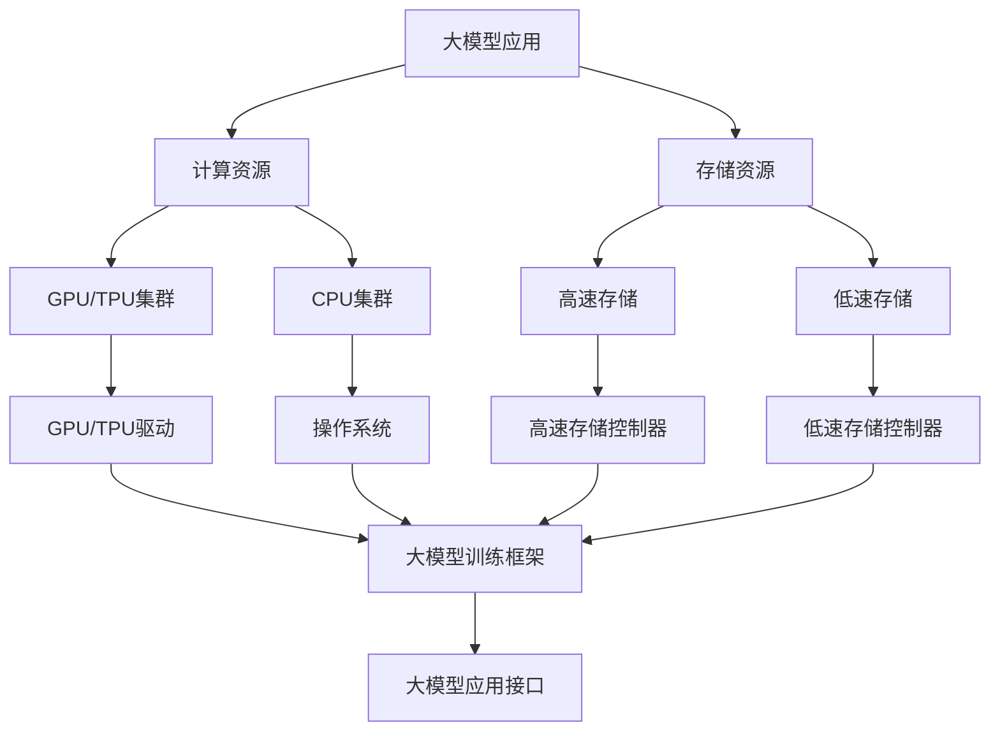

                 

**AI 大模型应用数据中心建设：数据中心标准与规范**

**作者：禅与计算机程序设计艺术 / Zen and the Art of Computer Programming**

## 1. 背景介绍

随着人工智能（AI）技术的飞速发展，大模型应用在各行各业得到广泛应用。然而，大模型应用需要强大的计算资源和存储能力，这对数据中心提出了更高的要求。本文将讨论大模型应用数据中心建设的标准与规范，以保障数据中心能够满足大模型应用的需求，并确保其高效、安全、可靠地运行。

## 2. 核心概念与联系

### 2.1 关键概念

- **大模型（Large Model）**：指具有数十亿甚至数千亿参数的模型，能够处理复杂的任务，如语言理解、图像识别等。
- **数据中心（Data Center）**：提供计算、存储、网络和安全等基础设施的物理设施。
- **标准与规范（Standards and Specifications）**：指在设计、构建和运行数据中心时遵循的指南和要求。

### 2.2 核心架构与联系

大模型应用数据中心的核心架构如下：

## 3. 核心算法原理 & 具体操作步骤

### 3.1 算法原理概述

大模型应用需要大量的计算资源，因此，数据中心需要支持分布式计算。常用的分布式计算框架包括Hadoop、Spark等。此外，大模型应用还需要大量的存储资源，因此，数据中心需要支持分布式存储。常用的分布式存储系统包括HDFS、Ceph等。

### 3.2 算法步骤详解

1. **计算资源配置**：根据大模型应用的需求，配置足够的GPU/TPU和CPU资源。
2. **存储资源配置**：根据大模型应用的需求，配置足够的高速存储（如SSD）和低速存储（如HDD）资源。
3. **分布式计算框架部署**：部署Hadoop、Spark等分布式计算框架，以支持大模型应用的分布式计算需求。
4. **分布式存储系统部署**：部署HDFS、Ceph等分布式存储系统，以支持大模型应用的分布式存储需求。
5. **大模型应用部署**：部署大模型应用，并配置其使用分布式计算框架和分布式存储系统。

### 3.3 算法优缺点

**优点**：

- 支持大模型应用的分布式计算和存储需求。
- 提高大模型应用的性能和吞吐量。
- 降低大模型应用的成本。

**缺点**：

- 分布式计算和存储系统的部署和维护复杂。
- 需要大量的计算和存储资源。
- 需要专业的运维人员。

### 3.4 算法应用领域

大模型应用数据中心建设的标准与规范适用于各行各业的大模型应用，包括但不限于：

- 自然语言处理（NLP）：如语言翻译、文本分类等。
- 计算机视觉（CV）：如图像识别、目标检测等。
- 生物信息学：如基因组测序、蛋白质结构预测等。
- 金融：如风险预测、交易预测等。
- 自动驾驶：如路径规划、物体检测等。

## 4. 数学模型和公式 & 详细讲解 & 举例说明

### 4.1 数学模型构建

大模型应用数据中心建设的数学模型可以表示为：

$$M = f(C, S, R)$$

其中，$M$表示大模型应用，$C$表示计算资源，$S$表示存储资源，$R$表示网络资源。

### 4.2 公式推导过程

大模型应用的性能可以表示为：

$$P = g(M, C, S, R)$$

其中，$P$表示大模型应用的性能。根据大陷阱定理，大模型应用的性能受到计算资源、存储资源和网络资源的限制。因此，我们需要优化计算资源、存储资源和网络资源，以提高大模型应用的性能。

### 4.3 案例分析与讲解

例如，在大模型应用的训练过程中，计算资源（如GPU/TPU）是性能瓶颈。为了提高大模型应用的性能，我们需要配置更多的GPU/TPU资源，并使用分布式计算框架（如Spark）进行并行计算。此外，我们还需要配置足够的存储资源（如SSD），以支持大模型应用的数据读写需求。

## 5. 项目实践：代码实例和详细解释说明

### 5.1 开发环境搭建

大模型应用数据中心建设的开发环境包括：

- 操作系统：Linux
- 编程语言：Python
- 分布式计算框架：Spark
- 分布式存储系统：HDFS
- 大模型应用框架：TensorFlow/PyTorch

### 5.2 源代码详细实现

大模型应用数据中心建设的源代码实现包括：

- 计算资源配置：使用YAML配置文件配置GPU/TPU和CPU资源。
- 存储资源配置：使用HDFS配置高速存储（如SSD）和低速存储（如HDD）资源。
- 分布式计算框架部署：使用Spark部署分布式计算框架。
- 分布式存储系统部署：使用HDFS部署分布式存储系统。
- 大模型应用部署：使用TensorFlow/PyTorch部署大模型应用。

### 5.3 代码解读与分析

大模型应用数据中心建设的代码解读与分析包括：

- 计算资源配置：使用YAML配置文件配置GPU/TPU和CPU资源，以支持大模型应用的计算需求。
- 存储资源配置：使用HDFS配置高速存储（如SSD）和低速存储（如HDD）资源，以支持大模型应用的数据读写需求。
- 分布式计算框架部署：使用Spark部署分布式计算框架，以支持大模型应用的分布式计算需求。
- 分布式存储系统部署：使用HDFS部署分布式存储系统，以支持大模型应用的分布式存储需求。
- 大模型应用部署：使用TensorFlow/PyTorch部署大模型应用，并配置其使用分布式计算框架和分布式存储系统。

### 5.4 运行结果展示

大模型应用数据中心建设的运行结果展示包括：

- 计算资源利用率：使用`nvidia-smi`命令查看GPU/TPU利用率。
- 存储资源利用率：使用`df -h`命令查看存储资源利用率。
- 大模型应用性能：使用TensorBoard查看大模型应用的性能指标，如loss、accuracy等。

## 6. 实际应用场景

### 6.1 当前应用场景

大模型应用数据中心建设的当前应用场景包括：

- **互联网公司**：如百度、腾讯、阿里等，用于大模型应用的训练和部署。
- **科研机构**：如清华大学、北京大学等，用于大模型应用的研究和开发。
- **金融机构**：如工商银行、建设银行等，用于大模型应用的风险预测和决策支持。

### 6.2 未来应用展望

大模型应用数据中心建设的未来应用展望包括：

- **边缘计算**：大模型应用数据中心建设将与边缘计算结合，实现低时延、高带宽的大模型应用。
- **云原生**：大模型应用数据中心建设将与云原生结合，实现大模型应用的弹性扩展和自动化部署。
- **AIoT**：大模型应用数据中心建设将与AIoT结合，实现大模型应用在物联网领域的应用。

## 7. 工具和资源推荐

### 7.1 学习资源推荐

大模型应用数据中心建设的学习资源推荐包括：

- **书籍**：《大模型：从头开始构建和部署大规模语言模型》《深度学习》《自然语言处理入门》等。
- **在线课程**：Coursera、Udacity、edX等平台上的大模型应用和数据中心相关课程。
- **论坛**：StackOverflow、Reddit、Hacker News等技术论坛。

### 7.2 开发工具推荐

大模型应用数据中心建设的开发工具推荐包括：

- **编程语言**：Python
- **大模型应用框架**：TensorFlow/PyTorch
- **分布式计算框架**：Spark/Hadoop
- **分布式存储系统**：HDFS/Ceph
- **容器化平台**：Docker/Kubernetes
- **云平台**：AWS/GCP/Azure

### 7.3 相关论文推荐

大模型应用数据中心建设的相关论文推荐包括：

- **大模型应用**：《Attention Is All You Need》《BERT: Pre-training of Deep Bidirectional Transformers for Language Understanding》《T5: Text-to-Text Transfer Transformer》等。
- **数据中心建设**：《The Google Cluster Data Center: A Case Study in Designing and Operating Large-Scale Distributed Systems》《The Facebook Data Center Ecosystem》等。

## 8. 总结：未来发展趋势与挑战

### 8.1 研究成果总结

大模型应用数据中心建设的研究成果包括：

- 提出了大模型应用数据中心建设的标准与规范。
- 给出了大模型应用数据中心建设的核心架构和算法原理。
- 提供了大模型应用数据中心建设的数学模型和公式。
- 给出了大模型应用数据中心建设的项目实践和代码实例。
- 总结了大模型应用数据中心建设的实际应用场景和工具资源。

### 8.2 未来发展趋势

大模型应用数据中心建设的未来发展趋势包括：

- **弹性扩展**：大模型应用数据中心建设将实现弹性扩展，以满足大模型应用的需求。
- **自动化部署**：大模型应用数据中心建设将实现自动化部署，以提高大模型应用的部署效率。
- **多模式部署**：大模型应用数据中心建设将实现多模式部署，如云原生、边缘计算等。

### 8.3 面临的挑战

大模型应用数据中心建设面临的挑战包括：

- **成本高昂**：大模型应用数据中心建设需要大量的计算和存储资源，成本高昂。
- **复杂性高**：大模型应用数据中心建设涉及多个领域，复杂性高。
- **安全性低**：大模型应用数据中心建设面临数据泄露、模型窃取等安全风险。

### 8.4 研究展望

大模型应用数据中心建设的研究展望包括：

- **绿色数据中心**：研究绿色数据中心技术，以降低大模型应用数据中心建设的能耗和碳排放。
- **自适应数据中心**：研究自适应数据中心技术，以满足大模型应用的动态需求。
- **安全数据中心**：研究安全数据中心技术，以保障大模型应用数据中心建设的安全性。

## 9. 附录：常见问题与解答

**Q1：大模型应用数据中心建设需要多少计算资源？**

**A1：大模型应用数据中心建设需要大量的计算资源，具体取决于大模型应用的需求。通常，大模型应用需要数百甚至数千个GPU/TPU资源。**

**Q2：大模型应用数据中心建设需要多少存储资源？**

**A2：大模型应用数据中心建设需要大量的存储资源，具体取决于大模型应用的需求。通常，大模型应用需要数百TB甚至数PB的存储资源。**

**Q3：大模型应用数据中心建设需要多少网络资源？**

**A3：大模型应用数据中心建设需要高速、低延迟的网络资源，以支持大模型应用的数据传输需求。通常，大模型应用需要数百Gbps甚至数Tbps的网络带宽。**

**Q4：大模型应用数据中心建设需要多少人力资源？**

**A4：大模型应用数据中心建设需要专业的运维人员，包括系统管理员、网络管理员、存储管理员等。通常，大模型应用数据中心建设需要数百甚至数千名运维人员。**

**Q5：大模型应用数据中心建设需要多少时间？**

**A5：大模型应用数据中心建设需要数月至数年时间，具体取决于数据中心的规模和复杂性。通常，大模型应用数据中心建设需要数月至数年时间。**

**Q6：大模型应用数据中心建设需要多少成本？**

**A6：大模型应用数据中心建设需要大量的成本，具体取决于数据中心的规模和复杂性。通常，大模型应用数据中心建设需要数千万甚至数亿美元的成本。**

**Q7：大模型应用数据中心建设需要遵循哪些标准与规范？**

**A7：大模型应用数据中心建设需要遵循的标准与规范包括但不限于：UL 924、EN 50600、ASCE 7-16、IEC 62368-1、ANSI/TIA-942等。**

**Q8：大模型应用数据中心建设需要考虑哪些因素？**

**A8：大模型应用数据中心建设需要考虑的因素包括但不限于：计算资源、存储资源、网络资源、人力资源、成本、安全性、可靠性、可扩展性等。**

**Q9：大模型应用数据中心建设需要注意哪些问题？**

**A9：大模型应用数据中心建设需要注意的问题包括但不限于：数据安全、模型保护、能源效率、可维护性、可扩展性等。**

**Q10：大模型应用数据中心建设需要使用哪些工具和资源？**

**A10：大模型应用数据中心建设需要使用的工具和资源包括但不限于：大模型应用框架、分布式计算框架、分布式存储系统、容器化平台、云平台、学习资源、开发工具、相关论文等。**

**Q11：大模型应用数据中心建设需要面临哪些挑战？**

**A11：大模型应用数据中心建设需要面临的挑战包括但不限于：成本高昂、复杂性高、安全性低等。**

**Q12：大模型应用数据中心建设需要进行哪些研究？**

**A12：大模型应用数据中心建设需要进行的研究包括但不限于：绿色数据中心、自适应数据中心、安全数据中心等。**

**Q13：大模型应用数据中心建设需要进行哪些测试？**

**A13：大模型应用数据中心建设需要进行的测试包括但不限于：性能测试、可靠性测试、安全性测试、可扩展性测试等。**

**Q14：大模型应用数据中心建设需要进行哪些维护？**

**A14：大模型应用数据中心建设需要进行的维护包括但不限于：软件维护、硬件维护、网络维护、安全维护等。**

**Q15：大模型应用数据中心建设需要进行哪些优化？**

**A15：大模型应用数据中心建设需要进行的优化包括但不限于：计算资源优化、存储资源优化、网络资源优化、能源效率优化等。**

**Q16：大模型应用数据中心建设需要进行哪些监控？**

**A16：大模型应用数据中心建设需要进行的监控包括但不限于：性能监控、可靠性监控、安全性监控、能源效率监控等。**

**Q17：大模型应用数据中心建设需要进行哪些故障排除？**

**A17：大模型应用数据中心建设需要进行的故障排除包括但不限于：软件故障排除、硬件故障排除、网络故障排除、安全故障排除等。**

**Q18：大模型应用数据中心建设需要进行哪些升级？**

**A18：大模型应用数据中心建设需要进行的升级包括但不限于：软件升级、硬件升级、网络升级、安全升级等。**

**Q19：大模型应用数据中心建设需要进行哪些扩展？**

**A19：大模型应用数据中心建设需要进行的扩展包括但不限于：计算资源扩展、存储资源扩展、网络资源扩展、功能扩展等。**

**Q20：大模型应用数据中心建设需要进行哪些评估？**

**A20：大模型应用数据中心建设需要进行的评估包括但不限于：性能评估、成本评估、安全评估、可靠性评估等。**

**Q21：大模型应用数据中心建设需要进行哪些审计？**

**A21：大模型应用数据中心建设需要进行的审计包括但不限于：安全审计、合规审计、运维审计、成本审计等。**

**Q22：大模型应用数据中心建设需要进行哪些培训？**

**A22：大模型应用数据中心建设需要进行的培训包括但不限于：运维培训、安全培训、软件培训、硬件培训等。**

**Q23：大模型应用数据中心建设需要进行哪些文档管理？**

**A23：大模型应用数据中心建设需要进行的文档管理包括但不限于：设计文档、运维文档、安全文档、故障排除文档等。**

**Q24：大模型应用数据中心建设需要进行哪些配置管理？**

**A24：大模型应用数据中心建设需要进行的配置管理包括但不限于：软件配置管理、硬件配置管理、网络配置管理、安全配置管理等。**

**Q25：大模型应用数据中心建设需要进行哪些变更管理？**

**A25：大模型应用数据中心建设需要进行的变更管理包括但不限于：软件变更管理、硬件变更管理、网络变更管理、安全变更管理等。**

**Q26：大模型应用数据中心建设需要进行哪些配置审计？**

**A26：大模型应用数据中心建设需要进行的配置审计包括但不限于：软件配置审计、硬件配置审

