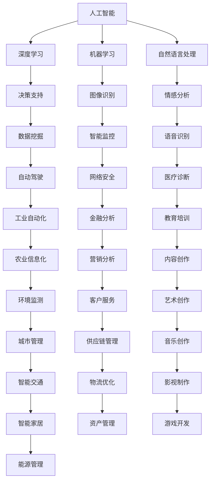

                 

# AI驱动的创新：人类计算与AI的协作

> 关键词：人工智能,人类计算,协同工作,深度学习,机器学习,计算架构,大数据,数据处理,智能系统

## 1. 背景介绍

在现代社会，人工智能(AI)技术正以前所未有的速度发展，其在各行各业中的应用日益广泛。AI不仅解放了人类从繁重重复的劳动中解放出来，还使得一些复杂且高难度的问题得到了解决。然而，AI的崛起并非意味着人类智能的全面取代，而是与之相辅相成，共同促进社会的进步和创新。

### 1.1 问题由来

随着数据和计算资源的大幅增加，AI技术得到了迅猛发展。深度学习、机器学习等技术的应用，使得AI模型可以处理和分析大量复杂的数据。然而，AI模型尽管强大，却无法完全替代人类智慧的广度和深度。在许多领域，如医疗诊断、艺术创作、复杂决策等，人类的经验和直觉仍是不可或缺的。因此，如何有效结合人类智慧和AI技术，以实现最佳的工作效果，成为了现代科技发展的一个关键课题。

### 1.2 问题核心关键点

要实现人类与AI的协作，首先需要明确几个核心关键点：

- **AI能力**：深度学习、自然语言处理、计算机视觉等技术，使AI具备强大的数据处理和决策能力。
- **人类智慧**：经验、直觉、情感、创造力等，使得人类能够在复杂情境下进行判断和决策。
- **协同工作**：通过合理的系统设计，使AI和人类能够在各自擅长的领域中发挥优势，形成互补。

这些关键点共同构成了AI驱动的协同工作系统的基础。通过深入理解和应用这些技术，可以构建出高效、智能且灵活的协作系统。

## 2. 核心概念与联系

### 2.1 核心概念概述

在深入探讨AI与人类计算的协作时，我们需要理解以下几个核心概念：

- **人工智能(AI)**：指通过计算机程序和算法模拟人类智能行为的技术。AI的常见应用包括机器学习、深度学习、自然语言处理等。
- **人类计算(Human Computation)**：指利用人类的感知、认知和创造力等优势，进行数据分析、问题解决和创新设计等活动。
- **协同工作(Collaborative Work)**：指多个人或多个实体共同完成某项任务的过程。在AI的协助下，协同工作可以高效、精确、智能化地进行。
- **智能系统(Intelligent System)**：结合了AI技术和人类智慧的系统，可以自主学习和适应环境变化，进行决策和行动。

### 2.2 核心概念原理和架构的 Mermaid 流程图



这个流程图展示了AI技术的各个分支以及它们在不同领域的应用，体现了AI技术在各行业的广泛渗透。同时，该图也突出了AI与人类计算协作的可能性。

## 3. 核心算法原理 & 具体操作步骤

### 3.1 算法原理概述

AI驱动的协作系统，通常基于机器学习和深度学习技术，通过构建智能模型来模拟人类认知和决策过程。这些模型通过大量数据进行训练，可以自动学习数据中的模式和规律，进行预测和决策。在AI模型与人类协作中，以下步骤是必不可少的：

1. **数据收集与处理**：收集相关领域的数据，进行清洗、标注和预处理。
2. **模型训练**：利用深度学习框架，训练AI模型，使其具备处理任务的能力。
3. **模型微调**：在特定应用场景中，对模型进行微调，使其适应具体任务。
4. **数据融合与反馈**：将AI的预测结果与人类决策相结合，形成反馈机制，不断优化模型。

### 3.2 算法步骤详解

在AI与人类协作的具体实现过程中，可以遵循以下步骤：

**Step 1: 数据收集与标注**
- 确定需要解决的问题和数据需求，设计数据收集策略。
- 获取领域相关的数据，如文本、图像、声音等。
- 对数据进行标注，使其适合模型训练。

**Step 2: 数据预处理**
- 清洗数据，去除噪声和不相关的信息。
- 进行数据标准化，如归一化、去重等。
- 划分数据集为训练集、验证集和测试集。

**Step 3: 模型选择与训练**
- 选择合适的深度学习模型，如卷积神经网络(CNN)、循环神经网络(RNN)等。
- 在训练集上进行模型训练，调整超参数如学习率、批次大小等。
- 在验证集上进行模型评估，防止过拟合。

**Step 4: 模型微调**
- 基于特定应用场景，对模型进行微调，如调整输出层结构或加入额外层。
- 在微调过程中，保持AI模型的部分权重不变，仅调整与任务相关部分。

**Step 5: 数据融合与反馈**
- 将AI模型的预测结果与人类专家的决策相结合，形成综合决策。
- 建立反馈机制，不断优化AI模型和数据处理流程。

### 3.3 算法优缺点

基于AI与人类协作的算法具有以下优点：

- **高效性**：AI可以处理大量数据，快速生成决策建议，节省时间。
- **精确性**：AI模型通过大量数据训练，具备较高的预测准确度。
- **灵活性**：AI模型可以根据新数据不断更新，适应环境变化。

同时，也存在以下缺点：

- **依赖数据**：AI模型需要大量数据进行训练，数据质量和数量直接影响模型性能。
- **解释性不足**：AI模型的决策过程较为复杂，难以解释其内在的逻辑。
- **风险因素**：AI模型可能存在算法偏见或错误，影响决策结果。

### 3.4 算法应用领域

基于AI与人类协作的算法，广泛应用于以下领域：

- **医疗健康**：利用AI进行疾病诊断、治疗方案推荐等，结合医生经验进行综合决策。
- **金融分析**：通过AI进行数据挖掘和预测分析，结合分析师的经验进行投资决策。
- **教育培训**：AI提供个性化学习推荐，结合教师和学生的反馈进行动态调整。
- **智能制造**：AI进行质量控制和生产调度，结合工程师经验进行优化调整。
- **公共安全**：AI进行数据分析和预测，结合警务人员的经验进行风险防范。
- **交通运输**：AI进行交通流量分析和预测，结合司机和交通管理人员的决策进行优化。

## 4. 数学模型和公式 & 详细讲解 & 举例说明

### 4.1 数学模型构建

在AI与人类协作的系统中，常见的数学模型包括线性回归、逻辑回归、决策树、随机森林等。其中，线性回归和逻辑回归用于分类任务，决策树和随机森林用于回归任务。

假设有一个分类问题，输入特征向量为 $x \in \mathbb{R}^n$，输出标签为 $y \in \{0, 1\}$，常用的逻辑回归模型可以表示为：

$$
P(y|x; \theta) = \sigma(\theta^T x)
$$

其中，$\sigma$ 为 sigmoid 函数，$\theta$ 为模型参数。

### 4.2 公式推导过程

以逻辑回归为例，其目标是最小化损失函数：

$$
\mathcal{L}(\theta) = -\frac{1}{N} \sum_{i=1}^N \left[ y_i \log \sigma(\theta^T x_i) + (1-y_i) \log (1-\sigma(\theta^T x_i)) \right]
$$

使用梯度下降等优化算法，更新参数 $\theta$ 的公式为：

$$
\theta \leftarrow \theta - \eta \nabla_{\theta}\mathcal{L}(\theta)
$$

其中，$\eta$ 为学习率。

### 4.3 案例分析与讲解

在实际应用中，一个简单的案例是自动生成文本摘要。通过训练一个基于RNN的模型，可以生成输入文本的摘要。模型输出的概率分布表示为：

$$
P(w_{1:T} | X) = \frac{1}{Z} \exp \left( \sum_{i=1}^{T} \log P(w_i | w_{1:i-1}; \theta) \right)
$$

其中，$w_{1:T}$ 为生成的文本，$X$ 为输入文本，$\theta$ 为模型参数，$Z$ 为归一化常数。

## 5. 项目实践：代码实例和详细解释说明

### 5.1 开发环境搭建

在进行AI与人类协作的项目实践时，需要一个良好的开发环境。以下是使用Python和TensorFlow搭建环境的示例：

```bash
conda create -n tf-env python=3.8
conda activate tf-env
pip install tensorflow
```

### 5.2 源代码详细实现

以下是一个简单的基于TensorFlow的逻辑回归模型的代码实现：

```python
import tensorflow as tf
import numpy as np

# 数据集
x = np.array([[0.5, 1.0], [1.5, 0.5], [2.5, 1.0]])
y = np.array([0, 1, 1])

# 模型定义
X = tf.placeholder(tf.float32, [None, 2])
y_ = tf.placeholder(tf.float32, [None])
W = tf.Variable(tf.zeros([2, 1]))
b = tf.Variable(tf.zeros([1]))
theta = tf.concat((W, b), axis=0)

# 模型训练
y_pred = tf.sigmoid(tf.matmul(X, theta))
cross_entropy = tf.reduce_mean(tf.nn.sigmoid_cross_entropy_with_logits(labels=y_, logits=y_pred))
train_step = tf.train.GradientDescentOptimizer(learning_rate=0.01).minimize(cross_entropy)

# 模型评估
correct_prediction = tf.equal(tf.round(y_pred), y_)
accuracy = tf.reduce_mean(tf.cast(correct_prediction, tf.float32))

# 训练和评估
with tf.Session() as sess:
    sess.run(tf.global_variables_initializer())
    for i in range(1000):
        sess.run(train_step, feed_dict={X: x, y_: y})
        if i % 100 == 0:
            print("Step {}: Accuracy: {:.2f}%".format(i, sess.run(accuracy, feed_dict={X: x, y_: y})))
```

### 5.3 代码解读与分析

在上述代码中，首先定义了训练数据集 $x$ 和 $y$，然后构建了逻辑回归模型。模型包含输入层、隐藏层和输出层，隐藏层使用sigmoid激活函数。训练过程使用梯度下降优化算法，损失函数为交叉熵。训练结束后，通过计算准确率来评估模型效果。

## 6. 实际应用场景

### 6.1 智能医疗系统

在智能医疗系统中，AI与人类计算的协作可以显著提升诊断和治疗效果。通过结合医生经验，AI可以快速处理大量医疗数据，识别出潜在的病患风险，并进行早期预警。例如，IBM的Watson系统，通过深度学习技术分析影像数据，结合医生的专业判断，提高了乳腺癌筛查的准确率。

### 6.2 金融智能分析

在金融领域，AI与人类协作能够提升投资和风险管理的精度。通过大数据分析和机器学习模型，AI可以快速分析市场趋势，识别出潜在的风险和机会。同时，结合分析师的经验，AI可以生成更准确的市场预测，帮助投资者做出更明智的决策。例如，JP Morgan的CoCo系统，通过机器学习模型和分析师的经验，实现了对股票市场的精确预测。

### 6.3 智能制造系统

在智能制造中，AI与人类协作可以提升生产效率和质量控制。通过结合机器学习和大数据分析，AI可以实时监控生产线状态，预测设备故障，优化生产流程。同时，结合工程师的经验，AI可以生成更精准的生产方案，提升生产效率。例如，GE的Predix系统，通过AI和人类协作，实现了预测性维护和智能生产。

## 7. 工具和资源推荐

### 7.1 学习资源推荐

为了全面掌握AI与人类协作的知识，以下是一些推荐的学习资源：

- **《Deep Learning》**：Ian Goodfellow、Yoshua Bengio 和 Aaron Courville 的深度学习经典著作，涵盖了深度学习的基本原理和实践技巧。
- **Coursera 和 edX 在线课程**：如斯坦福大学的《机器学习》课程，提供系统的学习资源，适合初学者和进阶者。
- **Kaggle**：一个数据科学竞赛平台，提供大量公开数据集和代码实现，适合实践和探索。
- **ArXiv**：一个开放的学术资源库，提供最新的AI研究论文，适合前沿研究。

### 7.2 开发工具推荐

在开发AI与人类协作的系统中，以下工具可以帮助提高效率和质量：

- **TensorFlow**：Google开发的深度学习框架，提供了丰富的模型和工具，适合大规模数据处理和模型训练。
- **PyTorch**：Facebook开发的深度学习框架，灵活性高，适合研究者和开发者使用。
- **Jupyter Notebook**：一个交互式的编程环境，支持Python、R等多种语言，适合数据探索和模型验证。

### 7.3 相关论文推荐

以下是几篇代表性和前沿性的相关论文：

- **"Deep Residual Learning for Image Recognition"**：He等人的ResNet论文，提出了残差网络结构，推动了深度学习的发展。
- **"Attention is All You Need"**：Vaswani等人的Transformer论文，提出了自注意力机制，提升了自然语言处理的性能。
- **"Human-in-the-loop Machine Learning"**：KGetter等人的综述文章，总结了AI与人类协作的研究方向和应用场景。

## 8. 总结：未来发展趋势与挑战

### 8.1 总结

本文从背景介绍、核心概念、算法原理到项目实践，全面阐述了AI与人类协作的创新和应用。通过系统梳理，展示了AI与人类协作的潜力，以及其在多个领域的具体应用。

### 8.2 未来发展趋势

未来AI与人类协作的发展趋势包括：

- **自动化和智能化提升**：AI技术不断进步，将在更多领域实现自动化和智能化，提高工作效率。
- **多模态融合**：结合图像、声音、文字等多种数据模式，提升AI对复杂情境的理解能力。
- **跨领域应用拓展**：AI与人类协作不仅局限于特定领域，将逐步向更多行业渗透，产生更广泛的影响。
- **伦理和法律问题**：AI与人类协作带来新的伦理和法律挑战，如数据隐私、算法透明等，需要深入探讨和解决。

### 8.3 面临的挑战

AI与人类协作仍面临诸多挑战：

- **数据质量和多样性**：AI模型需要高质量、多样化的数据进行训练，数据获取和标注成本较高。
- **模型复杂性和可解释性**：AI模型结构复杂，难以解释其决策过程，影响应用场景的选择和接受度。
- **人机协作模式**：如何设计合理的协作模式，使AI和人类发挥各自优势，仍需深入研究。

### 8.4 研究展望

未来研究应聚焦于以下几个方向：

- **跨模态融合**：开发更加智能的跨模态融合技术，提升AI对多维度数据的理解和处理能力。
- **可解释性研究**：深入研究AI决策的可解释性，提供更透明、可信的AI系统。
- **伦理和安全**：构建伦理框架，确保AI系统的公平性和安全性，避免伦理风险。
- **人机协作**：设计更灵活、高效的人机协作模式，实现AI与人类优势互补。

总之，AI与人类协作正处于快速发展阶段，其应用前景广阔。通过深入研究和实践，AI将更好地服务于人类社会，推动智能时代的到来。

## 9. 附录：常见问题与解答

**Q1: 什么是AI与人类协作？**

A: AI与人类协作指的是结合AI技术和人类智慧，共同完成复杂任务和决策的过程。这种协作方式能够发挥AI的高效处理能力和人类的广泛认知能力，实现最优的工作效果。

**Q2: 如何在AI系统中引入人类智慧？**

A: 引入人类智慧的方法包括：
1. **专家系统**：结合领域专家的知识和经验，构建专家系统进行辅助决策。
2. **人机交互**：设计人机交互界面，使人类能够对AI系统的输出进行审查和修正。
3. **反馈机制**：建立反馈循环，将AI的预测结果与人类判断相结合，不断优化AI模型。

**Q3: 如何评估AI与人类协作系统的效果？**

A: 评估AI与人类协作系统的效果可以从多个角度进行：
1. **精度和准确性**：通过对比AI和人类协作后的预测结果，评估系统的精度和准确性。
2. **效率和响应速度**：评估系统处理数据和决策的速度，分析AI与人类协作对效率的影响。
3. **用户体验**：通过用户满意度调查，了解用户对系统的感知和使用体验。

**Q4: 有哪些经典的应用案例？**

A: 以下是几个经典的AI与人类协作应用案例：
1. **IBM Watson**：在医疗领域，通过深度学习技术分析影像数据，结合医生的专业判断，提高了乳腺癌筛查的准确率。
2. **JP Morgan CoCo**：在金融领域，通过机器学习模型和分析师的经验，实现了对股票市场的精确预测。
3. **GE Predix**：在智能制造中，通过AI和人类协作，实现了预测性维护和智能生产。

**Q5: 如何克服AI与人类协作中的挑战？**

A: 克服AI与人类协作中的挑战需要以下几个方面的努力：
1. **数据质量管理**：确保数据的高质量和多样性，建立数据标注和清洗流程。
2. **模型可解释性**：开发可解释性高的模型，提供透明的决策过程，提升系统的可信度。
3. **人机协作设计**：设计灵活高效的协作模式，确保AI和人类能够发挥各自优势。
4. **伦理和安全保障**：建立伦理框架，确保系统的公平性和安全性，避免伦理风险。

---

作者：禅与计算机程序设计艺术 / Zen and the Art of Computer Programming

