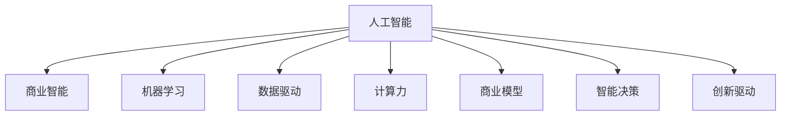

                 

# AI驱动的创新：人类计算在商业中的潜力

> 关键词：人工智能,商业智能,机器学习,数据驱动,计算力,商业模型,智能决策,创新驱动

## 1. 背景介绍

### 1.1 问题由来

进入21世纪以来，技术的快速发展使得信息时代的浪潮汹涌而至。人工智能（AI）作为现代科技的重要组成部分，已经渗透到各行各业，极大地改变了人类社会的运作方式。商业领域也不例外，AI技术的融入使得企业能够实现更为精准的决策支持，提升运营效率，开发新产品，开拓新市场，甚至重新定义商业模式。然而，AI并非万能的。尽管AI在数据驱动的决策、自动化流程、个性化推荐等方面表现出色，但仍然面临诸多挑战，特别是在复杂商业场景的精准把握、道德伦理问题等方面。

### 1.2 问题核心关键点

当前AI在商业中应用的瓶颈主要集中在以下几个方面：

1. **数据质量**：AI模型依赖于大量高质量数据，然而数据收集、清洗、标注等成本高昂，且数据质量和多样性不足可能影响模型效果。
2. **模型复杂性**：复杂的商业模型往往需要深度学习模型，而深度学习模型训练复杂、计算成本高昂，对算力、存储、带宽等要求极高。
3. **算法透明性**：AI模型的黑盒特性使得其在商业应用中的决策过程难以解释，对信任度要求较高的行业（如医疗、金融）是一个巨大的障碍。
4. **伦理风险**：AI模型可能无意中学习到歧视性、有害性信息，引发伦理争议，影响用户体验和品牌声誉。

### 1.3 问题研究意义

尽管存在上述挑战，AI在商业中的应用潜力仍然是巨大的。借助AI技术，企业可以更高效地运营、更精准地决策、更敏捷地应对市场变化。AI驱动的创新不仅能够提升企业自身的竞争力，还将促进整个行业的效率提升，激发新的商业模式和应用场景。因此，理解AI在商业中应用的潜在模式和价值，对于推动AI技术的落地应用具有重要意义。

## 2. 核心概念与联系

### 2.1 核心概念概述

为更好地理解AI在商业中的应用潜力，本节将介绍几个核心概念：

- **人工智能（AI）**：涉及机器学习、深度学习、自然语言处理、计算机视觉等多个领域的综合技术。AI通过数据分析、模型训练等方式，模拟人类智能行为，实现自动化决策、智能推荐等。

- **商业智能（BI）**：利用数据分析和可视化工具，帮助企业洞察业务数据、优化决策过程、提升运营效率的商业分析技术。AI与BI的结合，将大数据分析与智能模型相融合，实现更为精准的商业洞察。

- **机器学习（ML）**：通过算法让机器从数据中学习规律，并自动进行预测、分类、聚类等任务，广泛应用于数据驱动的决策支持、智能推荐、自动化流程等领域。

- **数据驱动**：利用数据分析和机器学习模型，从大量数据中提取有价值的信息，辅助企业决策，提升业务水平。数据驱动强调了在决策中重视数据的重要性。

- **计算力**：指处理大规模数据和运行复杂算法所需硬件和软件的能力。随着云计算和分布式计算的发展，计算力成为了制约AI模型训练和部署的重要因素。

- **商业模型**：指企业基于数据和业务逻辑构建的决策模型、业务流程、运营策略等。AI驱动的商业模型能够在动态市场环境中，自动优化商业策略和运营流程。

- **智能决策**：指在AI模型的辅助下，企业能够基于大量数据和模型分析结果，实现高效、精准的决策过程，快速响应市场变化。

- **创新驱动**：强调技术创新在企业发展中的重要作用，通过AI等前沿技术，推动商业模式、产品创新、市场扩展等。

这些核心概念之间的逻辑关系可以通过以下Mermaid流程图来展示：



这个流程图展示了几大核心概念及其之间的内在联系：

1. **人工智能**是基础，结合了机器学习、深度学习、自然语言处理等多种技术。
2. **商业智能**通过数据分析和可视化技术，辅助企业决策。
3. **机器学习**作为AI的核心，通过算法从数据中学习规律。
4. **数据驱动**强调在决策中重视数据的重要性。
5. **计算力**保障了AI模型的训练和运行。
6. **商业模型**和**智能决策**体现了AI在商业应用中的价值。
7. **创新驱动**强调了技术创新在企业发展中的重要作用。

这些概念共同构成了AI在商业中的应用框架，帮助企业实现数据驱动的决策和运营优化。

## 3. 核心算法原理 & 具体操作步骤
### 3.1 算法原理概述

AI在商业中的应用通常涉及数据预处理、模型训练、预测和决策等多个环节。核心算法原理包括：

- **数据预处理**：从原始数据中提取有价值的信息，清洗、标注数据，为后续模型训练做准备。
- **模型训练**：通过大量数据训练AI模型，学习数据中的规律和特征。
- **预测和决策**：利用训练好的模型对新数据进行预测，辅助企业做出智能决策。

### 3.2 算法步骤详解

基于AI的商业应用一般包括以下关键步骤：

**Step 1: 数据收集与预处理**

- 收集企业内部和外部的数据，包括客户行为数据、市场数据、供应链数据、财务数据等。
- 对数据进行清洗、去重、填充缺失值等预处理操作，确保数据质量。
- 对数据进行标注，为后续模型训练准备标签。

**Step 2: 选择合适的模型和算法**

- 根据业务需求，选择合适的机器学习或深度学习模型，如线性回归、随机森林、神经网络等。
- 确定模型参数和超参数，如学习率、批大小、迭代次数等。
- 选择合适的优化算法，如梯度下降、Adam等，进行模型训练。

**Step 3: 模型训练与验证**

- 使用训练集数据，对模型进行训练，最小化损失函数。
- 在验证集上评估模型性能，调整模型参数和超参数，防止过拟合。
- 重复训练和验证过程，直到模型收敛或性能满足要求。

**Step 4: 预测和决策**

- 将新数据输入训练好的模型，进行预测或分类。
- 根据模型输出结果，辅助企业做出决策。
- 对模型进行监控和维护，确保模型在实际应用中的稳定性和可靠性。

### 3.3 算法优缺点

基于AI的商业应用具有以下优点：

1. **高效决策**：AI模型能够从大量数据中提取有价值的信息，辅助企业做出精准的决策。
2. **实时响应**：AI模型可以实时处理数据，快速响应市场变化。
3. **自动化流程**：AI可以自动化处理重复性、劳动密集型的任务，提升工作效率。
4. **数据驱动**：AI模型基于数据驱动，能够从历史数据中学习规律，优化运营策略。

然而，也存在以下缺点：

1. **数据质量依赖**：AI模型依赖于高质量数据，数据质量差可能影响模型效果。
2. **计算成本高昂**：深度学习模型训练和推理计算成本高，对算力、存储要求高。
3. **模型透明性不足**：黑盒模型难以解释决策过程，影响用户体验和信任度。
4. **伦理风险**：AI模型可能学习到歧视性、有害性信息，引发伦理争议。

### 3.4 算法应用领域

基于AI的商业应用已经广泛涉及各个行业，具体如下：

- **金融行业**：利用AI进行风险评估、信用评分、欺诈检测、智能投顾等。
- **零售行业**：通过AI进行客户行为分析、个性化推荐、库存管理、价格优化等。
- **制造业**：应用AI进行质量检测、生产流程优化、供应链管理等。
- **医疗行业**：利用AI进行疾病预测、诊断、治疗方案推荐等。
- **物流行业**：使用AI进行路线规划、配送优化、货物跟踪等。

## 4. 数学模型和公式 & 详细讲解  
### 4.1 数学模型构建

本节将使用数学语言对基于AI的商业应用进行更加严格的刻画。

假设企业有 $N$ 个客户，每个客户有 $M$ 个特征，则客户数据可以表示为矩阵 $\mathbf{X} \in \mathbb{R}^{N \times M}$。假设每个客户有一个二元标签 $y_i \in \{0, 1\}$，表示是否发生某事件。我们的目标是通过机器学习模型预测客户的二元标签，即：

$$
\hat{y}_i = f(\mathbf{x}_i; \theta)
$$

其中 $f$ 为机器学习模型，$\theta$ 为模型参数。目标函数为最小化预测误差，即：

$$
\mathcal{L}(\theta) = \frac{1}{N}\sum_{i=1}^N \ell(y_i, \hat{y}_i)
$$

其中 $\ell$ 为损失函数，如交叉熵损失等。

### 4.2 公式推导过程

以下我们以二分类任务为例，推导交叉熵损失函数及其梯度的计算公式。

假设模型 $f(\mathbf{x}_i; \theta)$ 在输入 $\mathbf{x}_i$ 上的输出为 $\hat{y}_i=M_{\theta}(\mathbf{x}_i) \in [0,1]$，表示客户发生某事件的概率。真实标签 $y_i \in \{0,1\}$。则二分类交叉熵损失函数定义为：

$$
\ell(y_i, \hat{y}_i) = -[y_i\log \hat{y}_i + (1-y_i)\log(1-\hat{y}_i)]
$$

将其代入经验风险公式，得：

$$
\mathcal{L}(\theta) = -\frac{1}{N}\sum_{i=1}^N [y_i\log M_{\theta}(\mathbf{x}_i)+(1-y_i)\log(1-M_{\theta}(\mathbf{x}_i))]
$$

根据链式法则，损失函数对参数 $\theta_k$ 的梯度为：

$$
\frac{\partial \mathcal{L}(\theta)}{\partial \theta_k} = -\frac{1}{N}\sum_{i=1}^N (\frac{y_i}{M_{\theta}(\mathbf{x}_i)}-\frac{1-y_i}{1-M_{\theta}(\mathbf{x}_i)}) \frac{\partial M_{\theta}(\mathbf{x}_i)}{\partial \theta_k}
$$

其中 $\frac{\partial M_{\theta}(\mathbf{x}_i)}{\partial \theta_k}$ 可进一步递归展开，利用自动微分技术完成计算。

在得到损失函数的梯度后，即可带入参数更新公式，完成模型的迭代优化。重复上述过程直至收敛，最终得到适应特定任务的模型参数 $\theta^*$。

## 5. 项目实践：代码实例和详细解释说明
### 5.1 开发环境搭建

在进行AI在商业应用的开发实践前，我们需要准备好开发环境。以下是使用Python进行TensorFlow开发的详细环境配置流程：

1. 安装Anaconda：从官网下载并安装Anaconda，用于创建独立的Python环境。

2. 创建并激活虚拟环境：
```bash
conda create -n tf-env python=3.8 
conda activate tf-env
```

3. 安装TensorFlow：根据CUDA版本，从官网获取对应的安装命令。例如：
```bash
conda install tensorflow -c pytorch -c conda-forge
```

4. 安装各类工具包：
```bash
pip install numpy pandas scikit-learn matplotlib tqdm jupyter notebook ipython
```

完成上述步骤后，即可在`tf-env`环境中开始AI在商业应用的开发实践。

### 5.2 源代码详细实现

下面我们以金融风控任务为例，给出使用TensorFlow进行AI在商业应用开发的PyTorch代码实现。

首先，定义数据处理函数：

```python
import pandas as pd
import numpy as np
from sklearn.model_selection import train_test_split

def load_data(file_path):
    data = pd.read_csv(file_path)
    features = data.drop('label', axis=1)
    labels = data['label']
    return features, labels

def preprocess_data(features, labels):
    features = features.fillna(features.mean())
    features = (features - features.mean()) / features.std()
    features = np.array(features)
    labels = np.array(labels)
    return features, labels

def train_test_split_data(features, labels, test_size=0.2, random_state=42):
    features_train, features_test, labels_train, labels_test = train_test_split(features, labels, test_size=test_size, random_state=random_state)
    return features_train, features_test, labels_train, labels_test
```

然后，定义模型和优化器：

```python
import tensorflow as tf
from tensorflow.keras import layers, models

model = models.Sequential([
    layers.Dense(64, activation='relu', input_shape=(10,)),
    layers.Dense(32, activation='relu'),
    layers.Dense(1, activation='sigmoid')
])

optimizer = tf.keras.optimizers.Adam(learning_rate=0.001)
```

接着，定义训练和评估函数：

```python
def train_model(model, features_train, labels_train, features_test, labels_test, epochs=10, batch_size=32):
    model.compile(optimizer=optimizer, loss='binary_crossentropy', metrics=['accuracy'])
    model.fit(features_train, labels_train, epochs=epochs, batch_size=batch_size, validation_data=(features_test, labels_test))
    return model

def evaluate_model(model, features_test, labels_test):
    loss, accuracy = model.evaluate(features_test, labels_test)
    print(f'Test accuracy: {accuracy:.2f}')
```

最后，启动训练流程并在测试集上评估：

```python
features, labels = load_data('data.csv')
features_train, features_test, labels_train, labels_test = train_test_split_data(features, labels, test_size=0.2, random_state=42)

model = train_model(model, features_train, labels_train, features_test, labels_test, epochs=10, batch_size=32)

evaluate_model(model, features_test, labels_test)
```

以上就是使用TensorFlow进行金融风控任务开发的完整代码实现。可以看到，得益于TensorFlow的强大封装，我们可以用相对简洁的代码完成模型的构建和训练。

### 5.3 代码解读与分析

让我们再详细解读一下关键代码的实现细节：

**load_data函数**：
- 从指定CSV文件中读取数据，并将其分为特征和标签。

**preprocess_data函数**：
- 对特征进行缺失值处理、标准化处理，将特征转化为numpy数组，并将标签转化为numpy数组。

**train_test_split_data函数**：
- 使用sklearn库对数据进行训练集和测试集的划分，设定划分数和随机种子。

**train_model函数**：
- 构建模型，使用Adam优化器，定义交叉熵损失函数，进行模型训练，并输出训练后的模型。

**evaluate_model函数**：
- 使用测试集评估模型的性能，输出准确率。

**训练流程**：
- 加载数据，进行数据预处理和划分。
- 定义模型和优化器，进行模型训练。
- 在测试集上评估模型，输出最终结果。

可以看到，TensorFlow使得AI在商业应用的开发变得更加简洁高效。开发者可以将更多精力放在数据处理、模型改进等高层逻辑上，而不必过多关注底层的实现细节。

当然，工业级的系统实现还需考虑更多因素，如模型的保存和部署、超参数的自动搜索、更灵活的任务适配层等。但核心的AI应用流程基本与此类似。

## 6. 实际应用场景
### 6.1 金融风控

在金融领域，AI技术可以广泛应用于风险评估、信用评分、欺诈检测、智能投顾等。AI驱动的风控系统能够从大量历史交易数据中学习规律，识别潜在风险，提高决策的准确性和效率。

具体而言，可以收集用户的交易数据、信用记录、社交网络信息等，训练一个分类模型预测用户是否存在违约风险。模型可以学习到各类特征与违约风险之间的关系，对不同风险用户进行分层处理，采取相应的风控策略。

### 6.2 零售推荐

零售行业的AI应用主要集中在个性化推荐、库存管理、价格优化等方面。AI驱动的推荐系统能够根据用户的历史购买行为和浏览记录，推荐用户可能感兴趣的商品，提高转化率和客单价。

例如，电商平台可以利用AI分析用户的浏览记录和购买历史，预测用户可能感兴趣的商品，实时推送推荐商品。同时，根据库存水平和销售趋势，优化库存管理，避免缺货和积压。

### 6.3 制造业质量控制

制造业面临大量生产数据和质量控制问题，AI技术可以用于预测产品缺陷、优化生产流程、提升产品质量。AI驱动的质量控制系统能够从历史生产数据中学习生产过程的规律，预测潜在的产品缺陷，指导生产过程中的参数调整，提高产品质量和生产效率。

例如，通过传感器收集的生产数据，训练一个回归模型预测产品的使用寿命，帮助企业及时发现并解决生产问题，避免批量次品。

### 6.4 医疗诊断

医疗行业的AI应用主要集中在疾病预测、诊断、治疗方案推荐等方面。AI驱动的诊断系统能够从患者的影像数据、生理数据和病史中提取特征，辅助医生进行疾病诊断和治疗方案的制定。

例如，利用AI分析患者的CT、MRI等影像数据，识别病灶位置和大小，辅助医生进行精准诊断。同时，根据患者的病史和实验室数据，推荐个性化的治疗方案，提高治疗效果和患者满意度。

### 6.5 物流优化

物流行业的AI应用主要集中在路线规划、配送优化、货物跟踪等方面。AI驱动的物流系统能够从历史运输数据中学习规律，优化物流路线和配送方案，提高运输效率和降低成本。

例如，利用AI分析历史运输数据，预测运输延误和交通拥堵情况，优化运输路线和配送时间。同时，通过实时追踪和监控货物状态，提高运输的可靠性和安全性。

### 6.6 智能客服

智能客服系统可以广泛应用于各种企业，提升客户咨询体验和问题解决效率。AI驱动的客服系统能够理解客户问题，自动匹配答案，提供即时响应，提升客户满意度。

例如，智能客服系统可以分析大量的客服对话记录，训练一个对话模型，自动识别客户问题并提供解决方案。同时，根据客户的历史行为和偏好，提供个性化的服务。

## 7. 工具和资源推荐
### 7.1 学习资源推荐

为了帮助开发者系统掌握AI在商业中的应用基础和实践技巧，这里推荐一些优质的学习资源：

1. **《Python深度学习》**：该书系统介绍了深度学习的原理和应用，涵盖了TensorFlow、PyTorch等主流框架，适合初学者入门。
2. **《机器学习实战》**：该书通过实例演示，讲解了机器学习算法的实现细节，适合动手实践。
3. **CS229《机器学习》课程**：斯坦福大学开设的机器学习课程，涵盖了深度学习、强化学习、自然语言处理等前沿内容，适合进阶学习。
4. **《Deep Learning with Python》**：该书详细介绍了深度学习模型的构建和训练过程，适合动手实践。
5. **Kaggle竞赛**：Kaggle提供了大量的数据集和竞赛项目，通过实战练习，提升机器学习模型开发能力。

通过对这些资源的学习实践，相信你一定能够快速掌握AI在商业应用的基础和实践技巧，并用于解决实际的商业问题。

### 7.2 开发工具推荐

高效的开发离不开优秀的工具支持。以下是几款用于AI在商业应用开发的常用工具：

1. **TensorFlow**：由Google主导开发的开源深度学习框架，生产部署方便，适合大规模工程应用。
2. **PyTorch**：基于Python的开源深度学习框架，灵活动态的计算图，适合快速迭代研究。
3. **Jupyter Notebook**：交互式开发工具，支持代码编写、数据处理、可视化等，适合科研和工程开发。
4. **Scikit-learn**：开源机器学习库，提供了丰富的算法和工具，适合数据预处理和模型训练。
5. **Keras**：高层次深度学习库，提供了简单易用的API，适合快速搭建深度学习模型。

合理利用这些工具，可以显著提升AI在商业应用的开发效率，加快创新迭代的步伐。

### 7.3 相关论文推荐

AI在商业中的应用源于学界的持续研究。以下是几篇奠基性的相关论文，推荐阅读：

1. **Adaptive Computation of Statistical Quantities That Are Functions of Multiple Random Variables**：提出了统计量计算的基本原理，为机器学习中的统计推断奠定了基础。
2. **The Elements of Statistical Learning**：介绍了统计学习的基本理论和算法，涵盖机器学习、深度学习等前沿内容。
3. **Deep Learning**：Goodfellow等人撰写的深度学习经典教材，全面介绍了深度学习模型的构建和训练过程。
4. **TensorFlow 1.0: A TensorFlow Tutorial**：TensorFlow官方提供的教程，详细介绍了TensorFlow的架构和使用方法。
5. **TensorFlow 2.0: A TensorFlow Tutorial**：TensorFlow 2.0的官方教程，介绍了最新的TensorFlow API和使用方法。

这些论文代表了大模型在商业应用中的研究进展，通过学习这些前沿成果，可以帮助研究者把握学科前进方向，激发更多的创新灵感。

## 8. 总结：未来发展趋势与挑战

### 8.1 总结

本文对基于AI的商业应用进行了全面系统的介绍。首先阐述了AI在商业智能、机器学习、数据驱动等方面的重要价值，明确了AI在决策支持、自动化流程、个性化推荐等商业场景中的潜力。其次，从原理到实践，详细讲解了AI在商业应用中的数学模型和关键步骤，给出了AI在金融、零售、制造业等多个行业领域的代码实例。同时，本文还探讨了AI在商业应用中面临的挑战，如数据质量、计算成本、模型透明性、伦理风险等，提出了可能的改进措施。

通过本文的系统梳理，可以看到，AI在商业中的应用潜力巨大，但也面临着诸多挑战。未来，AI技术需要与业务深度结合，不断优化模型和算法，才能真正实现数据驱动的智能决策和运营优化。

### 8.2 未来发展趋势

展望未来，AI在商业中的应用将呈现以下几个发展趋势：

1. **智能化决策**：AI将进一步融入决策过程，实现自动化、实时化的决策支持。
2. **实时响应**：AI系统将实现实时数据处理和分析，快速响应市场变化。
3. **个性化推荐**：AI将实现更精准的个性化推荐，提升用户体验。
4. **自动化流程**：AI将自动处理重复性、劳动密集型的任务，提升工作效率。
5. **跨领域融合**：AI将与其他技术（如区块链、物联网等）深度融合，拓展应用范围。
6. **伦理导向**：AI系统将引入伦理导向的设计，确保算法公平、透明、可解释。

以上趋势凸显了AI在商业中的应用前景。这些方向的探索发展，必将进一步提升商业系统的智能化水平，为各行各业带来新的机遇和挑战。

### 8.3 面临的挑战

尽管AI在商业中的应用潜力巨大，但在迈向更加智能化、普适化应用的过程中，它仍面临着诸多挑战：

1. **数据质量瓶颈**：AI模型依赖高质量数据，数据质量差可能影响模型效果。如何提高数据收集和标注的效率和准确性，是一个亟待解决的问题。
2. **计算成本高昂**：深度学习模型训练和推理计算成本高，对算力、存储要求高。如何降低计算成本，提高计算效率，是一个重要课题。
3. **模型透明性不足**：黑盒模型难以解释决策过程，影响用户体验和信任度。如何赋予AI模型更高的透明性和可解释性，是一个重要的研究方向。
4. **伦理风险**：AI模型可能学习到歧视性、有害性信息，引发伦理争议。如何过滤和惩罚有害信息，确保算法的公平性和安全性，是一个重要课题。

### 8.4 研究展望

面对AI在商业应用中面临的挑战，未来的研究需要在以下几个方面寻求新的突破：

1. **数据增强技术**：利用数据增强技术，提高数据质量和多样性，提升模型泛化能力。
2. **轻量级模型**：开发更加轻量级的模型，降低计算成本，提高计算效率。
3. **可解释AI**：研究可解释AI技术，赋予AI模型更高的透明性和可解释性。
4. **公平性算法**：开发公平性算法，确保算法公平、透明、可解释。
5. **跨领域应用**：推动AI技术与其他技术的深度融合，拓展应用范围。

这些研究方向的探索，必将引领AI技术在商业应用中的进一步发展，为各行业带来新的机遇和挑战。面向未来，AI技术需要与业务深度结合，不断优化模型和算法，才能真正实现数据驱动的智能决策和运营优化。

## 9. 附录：常见问题与解答

**Q1：AI在商业应用中如何提升决策质量？**

A: AI通过数据分析和机器学习模型，从大量数据中提取有价值的信息，辅助企业决策。首先，AI可以从历史数据中学习规律，预测未来趋势。其次，AI能够识别数据中的关键特征，提供精准的决策建议。例如，金融行业中的信用评分、风险评估等，AI可以基于历史交易数据，识别潜在风险，提高决策的准确性和效率。

**Q2：AI在商业应用中如何处理大规模数据？**

A: 大规模数据处理是AI在商业应用中的重要挑战。首先，需要选择合适的数据处理工具和框架，如Hadoop、Spark等。其次，需要采用分布式计算技术，提高数据处理效率。同时，可以通过数据采样、特征选择等方法，减少数据量，提高计算效率。例如，金融行业中的风控系统，可以通过样本选择和特征优化，快速处理海量数据。

**Q3：AI在商业应用中如何确保数据安全？**

A: 数据安全是AI在商业应用中的重要问题。首先，需要采用加密技术，保护数据传输和存储的安全性。其次，需要建立数据访问控制机制，确保只有授权人员可以访问数据。同时，需要对AI模型进行审计和监控，防止恶意攻击和数据泄露。例如，医疗行业中的诊断系统，需要确保患者隐私数据的安全，防止数据泄露和滥用。

**Q4：AI在商业应用中如何确保模型公平性？**

A: AI模型在商业应用中需要确保公平性，防止歧视性输出。首先，需要收集多样化的训练数据，避免数据偏见。其次，需要选择合适的算法和模型，防止算法偏见。同时，需要对AI模型进行公平性评估，确保模型输出公平、透明。例如，招聘系统中的AI模型，需要确保不同性别、种族、年龄等特征的应聘者被公平对待。

**Q5：AI在商业应用中如何提升用户信任度？**

A: 提升用户信任度是AI在商业应用中的重要目标。首先，需要确保AI模型的透明性和可解释性，让用户了解模型决策过程。其次，需要确保AI模型的公平性和安全性，防止歧视性输出和数据泄露。同时，需要建立用户反馈机制，及时响应用户的疑虑和建议。例如，电商平台的推荐系统，需要确保推荐结果公平、透明，提升用户满意度。

通过以上常见问题的解答，可以看到AI在商业应用中的潜力和面临的挑战。未来，随着AI技术的不断发展和完善，AI在商业中的应用将越来越广泛，为各行业带来新的机遇和挑战。只有勇于创新、敢于突破，才能真正实现AI技术在商业中的落地应用。

---

作者：禅与计算机程序设计艺术 / Zen and the Art of Computer Programming

